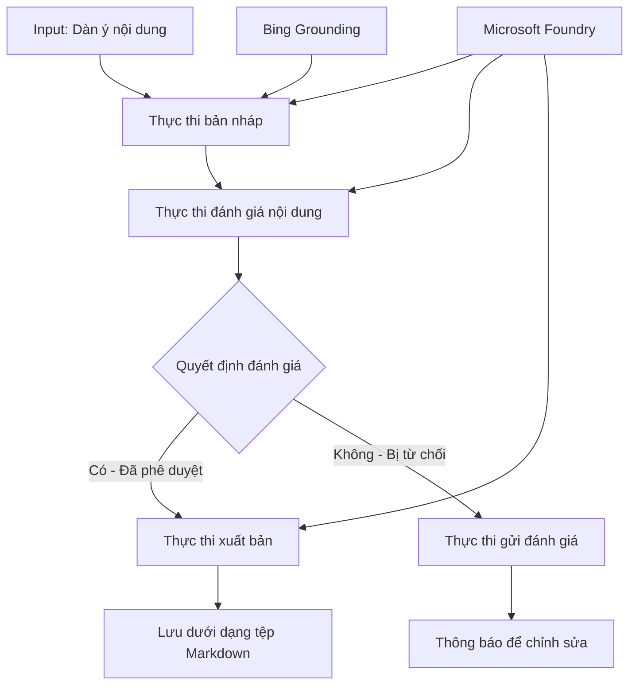

# 🔀 Quy trình làm việc có điều kiện với Microsoft Foundry (.NET)

## 📋 Hướng dẫn quy trình làm việc dựa trên quyết định thông minh

Sổ tay này trình bày **mẫu quy trình làm việc có điều kiện** sử dụng Microsoft Foundry và Microsoft Agent Framework cho .NET. Bạn sẽ học cách xây dựng các quy trình làm việc phức tạp, dựa trên quyết định, thông minh định tuyến xử lý dựa trên phân tích AI, quy tắc kinh doanh và các điều kiện động cho tự động hóa cấp doanh nghiệp.

## 🎯 Mục tiêu học tập

### 🧠 **Kiến trúc quyết định thông minh**
- **Triển khai logic có điều kiện**: Xây dựng cây quyết định phức tạp với nhiều điểm phân nhánh
- **Định tuyến vận hành bằng AI**: Sử dụng các mô hình Microsoft Foundry để đưa ra quyết định định tuyến thông minh
- **Điều chỉnh quy trình làm việc động**: Thay đổi hành vi quy trình làm việc dựa trên phân tích và điều kiện khi chạy
- **Tích hợp quy tắc doanh nghiệp**: Kết hợp logic kinh doanh và yêu cầu tuân thủ vào các quy trình làm việc

### 🔀 **Mẫu có điều kiện nâng cao**
- **Ra quyết định đa tiêu chí**: Đánh giá nhiều yếu tố để quyết định định tuyến
- **Xử lý nhận thức ngữ cảnh**: Đưa ra quyết định dựa trên bối cảnh và lịch sử tích lũy của quy trình làm việc
- **Điều chỉnh quy trình làm việc thích ứng**: Điều chỉnh đường đi xử lý động dựa trên điều kiện thời gian thực
- **Tích hợp công cụ quy tắc**: Triển khai công cụ quy tắc kinh doanh tinh vi trong các quy trình làm việc

### 🏢 **Ứng dụng có điều kiện cho doanh nghiệp**
- **Phân loại & định tuyến tài liệu**: Tự động phân loại và định tuyến tài liệu đến các quy trình làm việc thích hợp
- **Phân loại dịch vụ khách hàng**: Định tuyến thông minh các yêu cầu khách hàng đến các nhóm xử lý chuyên biệt
- **Xử lý tuân thủ & rủi ro**: Áp dụng các quy trình kiểm tra và đánh giá khác nhau dựa trên đánh giá rủi ro
- **Quy trình đảm bảo chất lượng**: Định tuyến nội dung qua các quy trình xem xét thích hợp dựa trên chỉ số chất lượng

## ⚙️ Yêu cầu & Thiết lập

### 📦 **Gói NuGet cần thiết**

Các gói nâng cao cho xử lý quy trình làm việc có điều kiện:

```xml
<!-- Core AI Framework -->
<PackageReference Include="Microsoft.Extensions.AI" Version="9.9.0" />

<!-- Azure AI Agents with Persistent State -->
<PackageReference Include="Azure.AI.Agents.Persistent" Version="1.2.0-beta.5" />

<!-- Azure Identity and Utilities -->
<PackageReference Include="Azure.Identity" Version="1.15.0" />
<PackageReference Include="System.Linq.Async" Version="6.0.3" />
<PackageReference Include="DotNetEnv" Version="3.1.1" />

<!-- Local Workflow Framework References -->
<!-- Microsoft.Agents.Workflows.dll - Advanced workflow orchestration -->
<!-- Microsoft.Agents.AI.AzureAI.dll - Microsoft Foundry integration -->
<!-- Microsoft.Agents.AI.dll - Core agent abstractions -->
```

### 🔑 **Cấu hình Microsoft Foundry**

**Tài nguyên Azure cần có:**
- Workspace Microsoft Foundry với các mô hình xử lý có điều kiện
- Subscription Azure với hạn mức và quyền truy cập phù hợp
- Các mô hình AI đã triển khai để ra quyết định và phân tích nội dung
- (Tuỳ chọn) Kết nối Bing Search API để hỗ trợ làm cơ sở dữ liệu

**Cấu hình môi trường (tệp .env):**
```env
# Microsoft Foundry Configuration
AZURE_AI_PROJECT_ENDPOINT=https://your-project.cognitiveservices.azure.com/
BING_CONNECTION_ID=your-bing-connection-id
```

**Thiết lập xác thực:**
```csharp
// Azure CLI or Managed Identity authentication
using Azure.Identity;
var credential = new AzureCliCredential();

// Load environment configuration
DotNetEnv.Env.Load("../../../.env");
```

### 🏗️ **Kiến trúc quy trình làm việc có điều kiện**



**Các thành phần chính:**
- **Draft Executor**: Đại lý AI tạo bản nháp nội dung ban đầu từ dàn bài
- **Content Review Executor**: Đại lý AI đánh giá chất lượng và tuân thủ bản nháp
- **Conditional Routing**: Logic quyết định định tuyến dựa trên kết quả đánh giá
- **Publish/Review Paths**: Đường đi xử lý riêng cho nội dung được duyệt hoặc bị từ chối
- **State Management**: Quản lý bối cảnh nội dung và đánh giá xuyên suốt quy trình

## 🎨 **Mẫu thiết kế quy trình làm việc có điều kiện**

### 📋 **Sản xuất nội dung với cổng kiểm soát chất lượng**
```
Outline → Draft Creation → Quality Review → {Approve: Publish | Reject: Revise}
```

### 🎯 **Xử lý tài liệu dựa trên rủi ro**
```
Document → Risk Assessment → {Low: Standard | High: Enhanced Review}
```

### 🔍 **Định tuyến dịch vụ khách hàng thông minh**
```
Customer Query → Analysis → {Simple: FAQ Bot | Complex: Human Agent}
```

### 💼 **Quy trình làm việc dựa trên tuân thủ**
```
Content → Compliance Check → {Pass: Publish | Fail: Legal Review}
```

## 🏢 **Lợi ích có điều kiện cho doanh nghiệp**

### 🎯 **Tự động hóa thông minh**
- **Quyết định thông minh**: Quyết định định tuyến được hỗ trợ bởi AI dựa trên phân tích nội dung và bối cảnh
- **Xử lý thích ứng**: Quy trình làm việc tự động điều chỉnh dựa trên điều kiện thay đổi
- **Thực thi quy tắc kinh doanh**: Tự động áp dụng logic kinh doanh và chính sách phức tạp
- **Định tuyến dựa trên bối cảnh**: Quyết định dựa trên toàn bộ lịch sử và bối cảnh tích lũy của quy trình

### 📈 **Hiệu suất vận hành tối ưu**
- **Tối ưu phân bổ tài nguyên**: Định tuyến công việc đến chuyên gia và quy trình phù hợp nhất
- **Giảm can thiệp thủ công**: Tự động hóa quyết định giảm thiểu nhu cầu định tuyến thủ công
- **Thời gian giải quyết nhanh hơn**: Định tuyến trực tiếp đến chuyên môn và khả năng xử lý phù hợp
- **Áp dụng nhất quán**: Áp dụng đồng nhất các quy tắc và tiêu chí quyết định kinh doanh

### 🛡️ **Quản trị rủi ro & tuân thủ**
- **Đánh giá rủi ro tự động**: Đánh giá mức độ rủi ro nội dung và tình huống bằng AI
- **Tuân thủ bắt buộc**: Định tuyến tự động qua các quy trình quy định cần thiết
- **Áp dụng giao thức bảo mật**: Biện pháp bảo mật nâng cao dựa trên đánh giá rủi ro
- **Bảo trì nhật ký kiểm toán**: Ghi chép đầy đủ các quyết định và lý do định tuyến

### 📊 **Phân tích & cải tiến liên tục**
- **Phân tích quyết định**: Theo dõi hiệu quả và độ chính xác các quyết định định tuyến
- **Nhận diện mẫu**: Xác định xu hướng và mẫu quyết định định tuyến theo thời gian
- **Tối ưu hiệu suất**: Cải tiến liên tục tiêu chí quyết định và hiệu quả định tuyến
- **Trí tuệ kinh doanh**: Thông tin về đặc tính nội dung và yêu cầu xử lý

### 🔧 **Xuất sắc kỹ thuật**
- **Quản lý trạng thái bền vững**: Duy trì trạng thái phức tạp xuyên suốt thực thi quy trình
- **Kiến trúc mở rộng**: Xử lý yêu cầu xử lý có điều kiện khối lượng lớn
- **Khả năng tích hợp**: Tích hợp liền mạch với hệ thống và quy trình kinh doanh hiện có
- **Giám sát & quan sát**: Theo dõi toàn diện hiệu suất và quyết định quy trình làm việc

Hãy xây dựng các quy trình làm việc doanh nghiệp thông minh dựa trên quyết định với .NET! 🚀

## 💻 Chạy mã nguồn

Triển khai đầy đủ có trong `04.dotnet-agent-framework-workflow-aifoundry-condition.cs`. Ví dụ này minh họa **quy trình sản xuất nội dung có cổng kiểm soát chất lượng**:

### 🏗️ **Kiến trúc quy trình làm việc**

```
Content Outline → Draft Creation → Quality Review → Conditional Routing:
                                                      ├─ Approved (>200 words) → Publish
                                                      └─ Rejected (<200 words) → Review Notification
```

**Các đại lý trong quy trình làm việc:**
1. **Evangelist Agent**: Tạo bản nháp hướng dẫn từ dàn bài dựa trên nguồn Bing
2. **Content Reviewer Agent**: Đánh giá chất lượng bản nháp (số lượng từ, độ hoàn chỉnh)
3. **Publisher Agent**: Lưu nội dung được duyệt dưới dạng tệp Markdown có dấu thời gian

**Các executor tùy chỉnh:**
1. **DraftExecutor**: Điều phối việc tạo bản nháp
2. **ContentReviewExecutor**: Thực hiện đánh giá chất lượng
3. **PublishExecutor**: Xử lý xuất bản nội dung đã được duyệt
4. **SendReviewExecutor**: Quản lý thông báo nội dung bị từ chối

### 🚀 Chạy ví dụ

**Yêu cầu trước:**
- Workspace Microsoft Foundry đã cấu hình
- Xác thực Azure CLI (`az login`)
- (Tuỳ chọn) Kết nối Bing Search để làm cơ sở dữ liệu

```bash
# Đặt script thành có thể thực thi (Unix/Linux/macOS)
chmod +x 04.dotnet-agent-framework-workflow-aifoundry-condition.cs

# Chạy quy trình làm việc có điều kiện
./04.dotnet-agent-framework-workflow-aifoundry-condition.cs
```

Hoặc trên Windows:
```powershell
dotnet run 04.dotnet-agent-framework-workflow-aifoundry-condition.cs
```

### 📝 Kết quả mong đợi

Quy trình sẽ:
1. **Tạo đại lý**: Khởi tạo ba đại lý Microsoft Foundry chuyên biệt
2. **Tạo bản nháp**: Đại lý Evangelist tạo bản nháp hướng dẫn từ dàn bài
3. **Đánh giá nội dung**: Đại lý Content Reviewer đánh giá chất lượng bản nháp
4. **Định tuyến có điều kiện**:
   - **Nếu được duyệt (>200 từ)**: Executor xuất bản lưu thành tệp Markdown
   - **Nếu bị từ chối (<200 từ)**: Gửi thông báo đánh giá
5. **Hiển thị kết quả**: Hiển thị kết quả cuối cùng của quy trình làm việc

### 🔧 Tùy chọn tùy chỉnh

**Thay đổi tiêu chí đánh giá:**
```csharp
const string ContentReviewerInstructions = @"
You are a content reviewer...
1. Check if content is more than 500 words (instead of 200)
2. Verify technical accuracy
3. Ensure proper formatting
...";
```

**Thêm đường đi có điều kiện mới:**
```csharp
var workflow = new WorkflowBuilder(draftExecutor)
    .AddEdge(draftExecutor, contentReviewerExecutor)
    .AddEdge(contentReviewerExecutor, publishExecutor, condition: GetCondition("Excellent"))
    .AddEdge(contentReviewerExecutor, editExecutor, condition: GetCondition("Good"))
    .AddEdge(contentReviewerExecutor, sendReviewerExecutor, condition: GetCondition("Poor"))
    .Build();
```

**Thay đổi yêu cầu nội dung:**
```csharp
string OUTLINE_Content = @"
# Your Custom Topic
## Section 1
https://your-reference-url
## Section 2
...
";
```

### 🎯 Ứng dụng thực tế

Mẫu quy trình có điều kiện này rất thích hợp cho:
- **Hệ thống quản lý nội dung**: Quy trình biên tập tự động với cổng kiểm soát chất lượng
- **Xử lý tài liệu**: Định tuyến tài liệu dựa trên phân loại và tuân thủ
- **Hỗ trợ khách hàng**: Định tuyến thông minh các phiếu dựa trên độ phức tạp và khẩn cấp
- **Xem xét pháp lý**: Định tuyến hợp đồng dựa trên đánh giá rủi ro và giá trị
- **Quy trình nhân sự**: Định tuyến đơn xin việc qua các quy trình sàng lọc phù hợp

### 🔍 Hiểu logic có điều kiện

**Hàm điều kiện:**
```csharp
public Func<object?, bool> GetCondition(string expectedResult) =>
    reviewResult => reviewResult is ReviewResult review && review.Result == expectedResult;
```

Hàm này tạo một phép thử để:
1. Kiểm tra xem kết quả có phải loại `ReviewResult`
2. So sánh thuộc tính `Result` với giá trị kỳ vọng
3. Trả về true/false để xác định định tuyến

**Các cạnh workflow với điều kiện:**
```csharp
.AddEdge(contentReviewerExecutor, publishExecutor, condition: GetCondition("Yes"))
.AddEdge(contentReviewerExecutor, sendReviewerExecutor, condition: GetCondition("No"))
```

### 📊 Tính năng nâng cao

**Xác thực JSON Schema:**
Quy trình sử dụng JSON schema để đảm bảo phản hồi có cấu trúc:

```csharp
// Define response structure
public class ReviewResult
{
    [JsonPropertyName("review_result")]
    public string Result { get; set; } = string.Empty;
    
    [JsonPropertyName("reason")]
    public string Reason { get; set; } = string.Empty;
    
    [JsonPropertyName("draft_content")]
    public string DraftContent { get; set; } = string.Empty;
}

// Apply to agent
ResponseFormat = ChatResponseFormat.ForJsonSchema(
    AIJsonUtilities.CreateJsonSchema(typeof(ReviewResult)), 
    "ReviewResult", 
    "Review Result From DraftContent"
)
```

**Tích hợp Bing Grounding:**
Đại lý Evangelist sử dụng Bing grounding để truy cập thông tin thời gian thực:

```csharp
var bingGroundingConfig = new BingGroundingSearchConfiguration(bing_conn_id);
BingGroundingToolDefinition bingGroundingTool = new(
    new BingGroundingSearchToolParameters([bingGroundingConfig])
);
```

Điều này cho phép đại lý theo dõi các URL trong dàn bài và trích xuất thông tin hiện tại.

### 🛡️ Xử lý lỗi

Quy trình có bao gồm xử lý lỗi mạnh mẽ cho nội dung bị từ chối:
- Lỗi đánh giá kích hoạt đường đi thay thế
- Thông báo cung cấp lý do từ chối rõ ràng
- Nội dung được bảo lưu để chỉnh sửa lại

### 🔄 Mở rộng quy trình

**Thêm vòng lặp chỉnh sửa:**
Tạo vòng phản hồi tự động tạo lại bản nháp:

```csharp
.AddEdge(contentReviewerExecutor, publishExecutor, condition: GetCondition("Yes"))
.AddEdge(contentReviewerExecutor, draftExecutor, condition: GetCondition("No")) // Loop back
```

**Thực hiện đánh giá đa cấp:**
Thêm nhiều cấp đánh giá với tiêu chí khác nhau:

```csharp
.AddEdge(draftExecutor, technicalReviewer)
.AddEdge(technicalReviewer, editorialReviewer, condition: GetCondition("TechPass"))
.AddEdge(editorialReviewer, publishExecutor, condition: GetCondition("EditPass"))
```

Mẫu quy trình có điều kiện này cung cấp nền tảng xây dựng hệ thống tự động hóa doanh nghiệp thông minh tinh vi! 🚀

---

<!-- CO-OP TRANSLATOR DISCLAIMER START -->
**Tuyên bố miễn trừ trách nhiệm**:
Tài liệu này đã được dịch bằng dịch vụ dịch thuật AI [Co-op Translator](https://github.com/Azure/co-op-translator). Mặc dù chúng tôi cố gắng đảm bảo độ chính xác, xin lưu ý rằng bản dịch tự động có thể chứa lỗi hoặc sai sót. Tài liệu gốc bằng ngôn ngữ gốc nên được coi là nguồn tin chính thức. Đối với thông tin quan trọng, nên sử dụng dịch vụ dịch thuật chuyên nghiệp bởi con người. Chúng tôi không chịu trách nhiệm về bất kỳ hiểu lầm hoặc giải thích sai nào phát sinh từ việc sử dụng bản dịch này.
<!-- CO-OP TRANSLATOR DISCLAIMER END -->