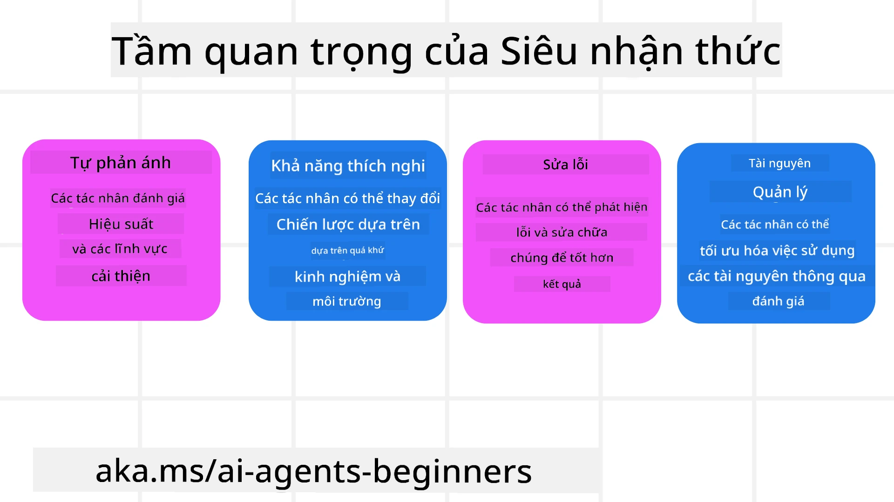
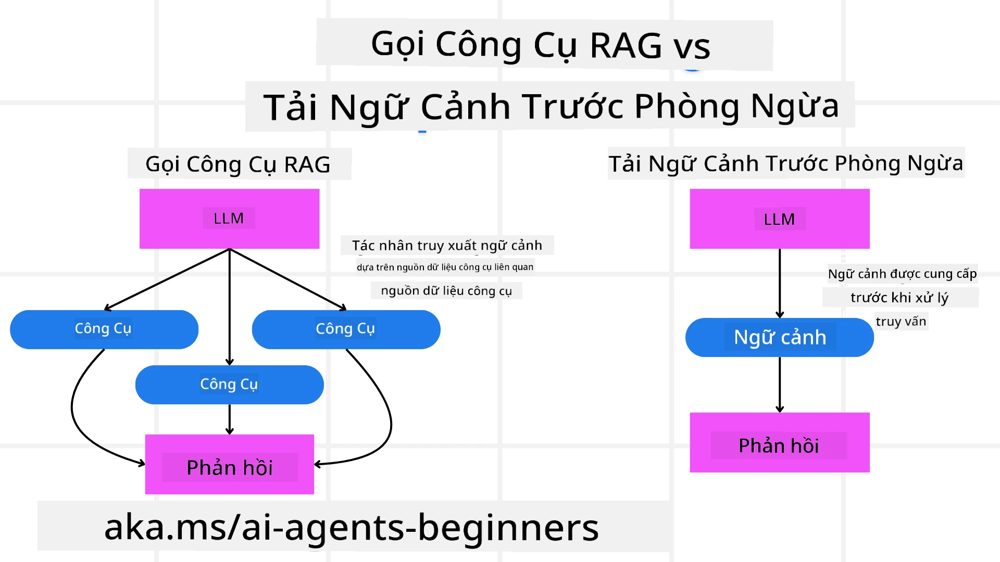

[](https://youtu.be/His9R6gw6Ec?si=3_RMb8VprNvdLRhX)

> _(Nhấp vào hình ảnh trên để xem video bài học này)_
# Siêu Nhận Thức trong Tác Nhân AI

## Giới Thiệu

Chào mừng bạn đến với bài học về siêu nhận thức trong các tác nhân AI! Chương này được thiết kế cho người mới bắt đầu đang tò mò về cách các tác nhân AI có thể suy nghĩ về quá trình suy nghĩ của chính họ. Kết thúc bài học này, bạn sẽ hiểu các khái niệm then chốt và được trang bị các ví dụ thực tiễn để áp dụng siêu nhận thức trong thiết kế tác nhân AI.

## Mục Tiêu Học Tập

Sau khi hoàn thành bài học này, bạn sẽ có thể:

1. Hiểu các hệ quả của những vòng lặp lập luận trong định nghĩa tác nhân.
2. Sử dụng kỹ thuật lập kế hoạch và đánh giá để hỗ trợ các tác nhân tự sửa lỗi.
3. Tạo ra các tác nhân riêng của bạn có khả năng thao tác mã để hoàn thành nhiệm vụ.

## Giới Thiệu về Siêu Nhận Thức

Siêu nhận thức đề cập đến các quá trình nhận thức bậc cao hơn liên quan đến việc suy nghĩ về chính quá trình suy nghĩ của mình. Đối với các tác nhân AI, điều này có nghĩa là có khả năng đánh giá và điều chỉnh hành động dựa trên sự tự nhận thức và kinh nghiệm trong quá khứ. Siêu nhận thức, hay "suy nghĩ về suy nghĩ," là một khái niệm quan trọng trong phát triển các hệ thống AI có tính tác nhân. Nó bao gồm việc các hệ thống AI nhận thức được các quá trình nội bộ của chính mình và có khả năng giám sát, điều tiết và thích nghi hành vi cho phù hợp. Giống như chúng ta khi quan sát không khí xung quanh hoặc nhìn nhận một vấn đề. Sự tự nhận thức này có thể giúp các hệ thống AI đưa ra quyết định tốt hơn, nhận biết lỗi sai và cải thiện hiệu suất theo thời gian - một lần nữa liên quan đến bài kiểm tra Turing và cuộc tranh luận liệu AI có sẽ chiếm lĩnh thế giới hay không.

Trong bối cảnh các hệ thống AI có tính tác nhân, siêu nhận thức có thể giúp giải quyết nhiều thách thức như:
- Minh bạch: Đảm bảo rằng các hệ thống AI có thể giải thích được lý luận và quyết định của chúng.
- Lập luận: Nâng cao khả năng tổng hợp thông tin và đưa ra các quyết định hợp lý của hệ thống AI.
- Thích nghi: Cho phép các hệ thống AI điều chỉnh để phù hợp với môi trường mới và điều kiện thay đổi.
- Nhận thức: Cải thiện độ chính xác của các hệ thống AI trong việc nhận biết và diễn giải dữ liệu từ môi trường.

### Siêu Nhận Thức là gì?

Siêu nhận thức, hay "suy nghĩ về suy nghĩ," là quá trình nhận thức bậc cao bao gồm sự tự nhận thức và tự điều chỉnh các quá trình nhận thức của chính mình. Trong lĩnh vực AI, siêu nhận thức trao quyền cho các tác nhân đánh giá và điều chỉnh chiến lược cũng như hành động của họ, dẫn đến khả năng giải quyết vấn đề và ra quyết định được cải thiện. Bằng cách hiểu siêu nhận thức, bạn có thể thiết kế các tác nhân AI không chỉ thông minh hơn mà còn linh hoạt và hiệu quả hơn. Trong siêu nhận thức thực sự, bạn sẽ thấy AI suy luận rõ ràng về chính quá trình suy luận của nó.

Ví dụ: “Tôi ưu tiên chuyến bay rẻ hơn vì... Tôi có thể bị bỏ lỡ các chuyến bay trực tiếp, vậy nên tôi sẽ kiểm tra lại.”
Theo dõi cách hoặc lý do tại sao nó chọn một tuyến đường nhất định.
- Lưu ý rằng nó đã phạm sai lầm vì quá phụ thuộc vào ưu tiên người dùng lần trước, nên nó điều chỉnh chiến lược ra quyết định, không chỉ là đề xuất cuối cùng.
- Chẩn đoán các mẫu như, “Mỗi khi tôi thấy người dùng nhắc đến ‘quá đông,’ tôi không chỉ loại bỏ một số điểm thu hút mà còn phản ánh rằng phương pháp chọn ‘điểm thu hút hàng đầu’ của tôi bị lỗi nếu tôi luôn xếp hạng theo độ phổ biến.”

### Tầm Quan Trọng của Siêu Nhận Thức trong Tác Nhân AI

Siêu nhận thức đóng vai trò quan trọng trong thiết kế tác nhân AI vì một số lý do:



- Tự Phản Ánh: Tác nhân có thể đánh giá hiệu suất của chính họ và xác định các lĩnh vực cần cải thiện.
- Khả Năng Thích Nghi: Tác nhân có thể điều chỉnh chiến lược dựa trên kinh nghiệm quá khứ và môi trường thay đổi.
- Sửa Lỗi: Tác nhân có thể tự phát hiện và sửa lỗi, dẫn đến kết quả chính xác hơn.
- Quản Lý Tài Nguyên: Tác nhân có thể tối ưu hóa việc sử dụng tài nguyên, như thời gian và công suất tính toán, bằng cách lập kế hoạch và đánh giá hành động của mình.

## Thành Phần của Một Tác Nhân AI

Trước khi đi sâu vào các quá trình siêu nhận thức, điều quan trọng là phải hiểu các thành phần cơ bản của một tác nhân AI. Một tác nhân AI thường gồm:

- Nhân cách: Tính cách và đặc điểm của tác nhân, xác định cách nó tương tác với người dùng.
- Công cụ: Các năng lực và chức năng mà tác nhân có thể thực hiện.
- Kỹ năng: Kiến thức và chuyên môn mà tác nhân sở hữu.

Những thành phần này hoạt động cùng nhau để tạo ra một "đơn vị chuyên môn" có thể thực hiện các nhiệm vụ cụ thể.

**Ví dụ**:
Hãy xem xét một đại lý du lịch, dịch vụ tác nhân không chỉ lập kế hoạch kỳ nghỉ cho bạn mà còn điều chỉnh lộ trình dựa trên dữ liệu thời gian thực và kinh nghiệm hành trình của khách hàng trước đó.

### Ví dụ: Siêu Nhận Thức trong Dịch Vụ Đại Lý Du Lịch

Hãy tưởng tượng bạn đang thiết kế một dịch vụ đại lý du lịch sử dụng AI. Tác nhân này, "Đại lý Du lịch," trợ giúp người dùng lập kế hoạch kỳ nghỉ. Để tích hợp siêu nhận thức, Đại lý Du lịch cần đánh giá và điều chỉnh hành động dựa trên sự tự nhận thức và kinh nghiệm quá khứ. Cách siêu nhận thức có thể phát huy vai trò như sau:

#### Nhiệm Vụ Hiện Tại

Nhiệm vụ hiện tại là giúp người dùng lập kế hoạch chuyến đi đến Paris.

#### Các Bước Hoàn Thành Nhiệm Vụ

1. **Thu Thập Ưu Tiên Người Dùng**: Hỏi người dùng về ngày đi lại, ngân sách, sở thích (ví dụ: bảo tàng, ẩm thực, mua sắm), và bất kỳ yêu cầu cụ thể nào.
2. **Truy Xuất Thông Tin**: Tìm kiếm các lựa chọn chuyến bay, chỗ ở, điểm tham quan và nhà hàng phù hợp với sở thích người dùng.
3. **Tạo Đề Xuất**: Cung cấp lịch trình cá nhân hóa với chi tiết chuyến bay, đặt phòng khách sạn và các hoạt động được đề xuất.
4. **Điều Chỉnh Dựa trên Phản Hồi**: Hỏi người dùng về phản hồi đối với các đề xuất và thực hiện các điều chỉnh cần thiết.

#### Tài Nguyên Cần Thiết

- Truy cập vào cơ sở dữ liệu đặt vé máy bay và khách sạn.
- Thông tin về các điểm tham quan và nhà hàng ở Paris.
- Dữ liệu phản hồi người dùng từ các tương tác trước đó.

#### Kinh Nghiệm và Tự Phản Ánh

Đại lý Du lịch sử dụng siêu nhận thức để đánh giá hiệu suất và học hỏi từ kinh nghiệm trước đây. Ví dụ:

1. **Phân Tích Phản Hồi Người Dùng**: Đại lý Du lịch xem xét phản hồi người dùng để xác định các đề xuất được đón nhận tốt và những đề xuất không phù hợp. Nó điều chỉnh các gợi ý tương lai cho phù hợp.
2. **Khả Năng Thích Nghi**: Nếu người dùng từng đề cập đến việc không thích nơi đông đúc, Đại lý Du lịch sẽ tránh đề xuất các điểm du lịch nổi tiếng vào giờ cao điểm trong tương lai.
3. **Sửa Lỗi**: Nếu Đại lý Du lịch đã phạm lỗi trong một lần đặt trước, chẳng hạn như đề xuất khách sạn đã kín phòng, nó sẽ học cách kiểm tra tính khả dụng kỹ hơn trước khi đưa ra đề xuất.

#### Ví Dụ Thực Tiễn Cho Nhà Phát Triển

Đây là ví dụ đơn giản về mã của Đại lý Du lịch khi tích hợp siêu nhận thức:

```python
class Travel_Agent:
    def __init__(self):
        self.user_preferences = {}
        self.experience_data = []

    def gather_preferences(self, preferences):
        self.user_preferences = preferences

    def retrieve_information(self):
        # Tìm kiếm chuyến bay, khách sạn và điểm tham quan dựa trên sở thích
        flights = search_flights(self.user_preferences)
        hotels = search_hotels(self.user_preferences)
        attractions = search_attractions(self.user_preferences)
        return flights, hotels, attractions

    def generate_recommendations(self):
        flights, hotels, attractions = self.retrieve_information()
        itinerary = create_itinerary(flights, hotels, attractions)
        return itinerary

    def adjust_based_on_feedback(self, feedback):
        self.experience_data.append(feedback)
        # Phân tích phản hồi và điều chỉnh đề xuất trong tương lai
        self.user_preferences = adjust_preferences(self.user_preferences, feedback)

# Ví dụ sử dụng
travel_agent = Travel_Agent()
preferences = {
    "destination": "Paris",
    "dates": "2025-04-01 to 2025-04-10",
    "budget": "moderate",
    "interests": ["museums", "cuisine"]
}
travel_agent.gather_preferences(preferences)
itinerary = travel_agent.generate_recommendations()
print("Suggested Itinerary:", itinerary)
feedback = {"liked": ["Louvre Museum"], "disliked": ["Eiffel Tower (too crowded)"]}
travel_agent.adjust_based_on_feedback(feedback)
```

#### Tại Sao Siêu Nhận Thức Quan Trọng

- **Tự Phản Ánh**: Tác nhân có thể phân tích hiệu suất và xác định điểm cần cải thiện.
- **Khả Năng Thích Nghi**: Tác nhân có thể điều chỉnh chiến lược dựa trên phản hồi và điều kiện thay đổi.
- **Sửa Lỗi**: Tác nhân có thể tự động phát hiện và sửa chữa lỗi.
- **Quản Lý Tài Nguyên**: Tác nhân có thể tối ưu hóa việc sử dụng tài nguyên, như thời gian và công suất tính toán.

Bằng cách tích hợp siêu nhận thức, Đại lý Du lịch có thể cung cấp các đề xuất du lịch cá nhân hóa và chính xác hơn, nâng cao trải nghiệm tổng thể của người dùng.

---

## 2. Lập Kế Hoạch trong Các Tác Nhân

Lập kế hoạch là thành phần quan trọng trong hành vi của tác nhân AI. Nó liên quan đến việc phác thảo các bước cần thiết để đạt được mục tiêu, xem xét trạng thái hiện tại, tài nguyên và các trở ngại có thể.

### Các Yếu Tố Của Lập Kế Hoạch

- **Nhiệm Vụ Hiện Tại**: Xác định rõ nhiệm vụ.
- **Các Bước Hoàn Thành Nhiệm Vụ**: Phân chia nhiệm vụ thành các bước dễ quản lý.
- **Tài Nguyên Cần Thiết**: Xác định tài nguyên cần thiết.
- **Kinh Nghiệm**: Sử dụng kinh nghiệm quá khứ để hỗ trợ lập kế hoạch.

**Ví dụ**:
Dưới đây là các bước mà Đại lý Du lịch cần thực hiện để hỗ trợ người dùng lập kế hoạch chuyến đi một cách hiệu quả:

### Các Bước cho Đại lý Du lịch

1. **Thu Thập Ưu Tiên Người Dùng**
   - Hỏi người dùng chi tiết về ngày đi lại, ngân sách, sở thích và các yêu cầu cụ thể.
   - Ví dụ: "Bạn dự định đi du lịch khi nào?" "Ngân sách của bạn là bao nhiêu?" "Bạn thích các hoạt động gì trong kỳ nghỉ?"

2. **Truy Xuất Thông Tin**
   - Tìm kiếm các lựa chọn du lịch phù hợp dựa trên sở thích của người dùng.
   - **Chuyến bay**: Tìm các chuyến bay có sẵn trong ngân sách và ngày đi lại người dùng chọn.
   - **Chỗ ở**: Tìm các khách sạn hoặc chỗ thuê phù hợp với vị trí, giá cả và tiện nghi người dùng mong muốn.
   - **Điểm tham quan và Nhà hàng**: Xác định các điểm thu hút phổ biến, hoạt động và địa điểm ăn uống phù hợp với sở thích người dùng.

3. **Tạo Đề Xuất**
   - Tổng hợp thông tin đã thu thập thành một lịch trình cá nhân hóa.
   - Cung cấp các chi tiết như lựa chọn chuyến bay, đặt phòng khách sạn và các hoạt động đề xuất, đảm bảo phù hợp với sở thích người dùng.

4. **Trình Bày Lịch Trình Cho Người Dùng**
   - Chia sẻ lịch trình đề xuất để người dùng xem xét.
   - Ví dụ: "Đây là lịch trình đề xuất cho chuyến đi Paris của bạn. Bao gồm chi tiết chuyến bay, đặt phòng khách sạn và danh sách các hoạt động và nhà hàng được khuyến nghị. Hãy cho tôi biết ý kiến của bạn!"

5. **Thu Thập Phản Hồi**
   - Hỏi người dùng về phản hồi đối với lịch trình đề xuất.
   - Ví dụ: "Bạn có thích lựa chọn chuyến bay không?" "Khách sạn có phù hợp với nhu cầu bạn không?" "Có hoạt động nào bạn muốn thêm hoặc bỏ không?"

6. **Điều Chỉnh Dựa Trên Phản Hồi**
   - Chỉnh sửa lịch trình dựa trên phản hồi của người dùng.
   - Thực hiện các điều chỉnh cần thiết với chuyến bay, chỗ ở và hoạt động đề xuất để phù hợp hơn với sở thích người dùng.

7. **Xác Nhận Cuối Cùng**
   - Trình bày lịch trình đã cập nhật để người dùng xác nhận lần cuối.
   - Ví dụ: "Tôi đã điều chỉnh theo phản hồi của bạn. Đây là lịch trình cập nhật. Mọi thứ có ổn không?"

8. **Đặt và Xác Nhận Đặt Chỗ**
   - Sau khi người dùng duyệt lịch trình, tiến hành đặt vé máy bay, chỗ ở và các hoạt động dự kiến.
   - Gửi thông tin xác nhận cho người dùng.

9. **Hỗ Trợ Liên Tục**
   - Luôn sẵn sàng hỗ trợ người dùng các thay đổi hoặc yêu cầu bổ sung trước và trong chuyến đi.
   - Ví dụ: "Nếu bạn cần hỗ trợ thêm trong chuyến đi, hãy liên hệ với tôi bất cứ lúc nào!"

### Ví Dụ Tương Tác

```python
class Travel_Agent:
    def __init__(self):
        self.user_preferences = {}
        self.experience_data = []

    def gather_preferences(self, preferences):
        self.user_preferences = preferences

    def retrieve_information(self):
        flights = search_flights(self.user_preferences)
        hotels = search_hotels(self.user_preferences)
        attractions = search_attractions(self.user_preferences)
        return flights, hotels, attractions

    def generate_recommendations(self):
        flights, hotels, attractions = self.retrieve_information()
        itinerary = create_itinerary(flights, hotels, attractions)
        return itinerary

    def adjust_based_on_feedback(self, feedback):
        self.experience_data.append(feedback)
        self.user_preferences = adjust_preferences(self.user_preferences, feedback)

# Ví dụ sử dụng trong một yêu cầu booing
travel_agent = Travel_Agent()
preferences = {
    "destination": "Paris",
    "dates": "2025-04-01 to 2025-04-10",
    "budget": "moderate",
    "interests": ["museums", "cuisine"]
}
travel_agent.gather_preferences(preferences)
itinerary = travel_agent.generate_recommendations()
print("Suggested Itinerary:", itinerary)
feedback = {"liked": ["Louvre Museum"], "disliked": ["Eiffel Tower (too crowded)"]}
travel_agent.adjust_based_on_feedback(feedback)
```

## 3. Hệ Thống RAG Sửa Lỗi

Trước tiên, hãy bắt đầu bằng việc hiểu sự khác biệt giữa Công Cụ RAG và Tải Ngữ Cảnh Chủ Động



### Sinh Tổng Hợp Tăng Cường Truy Xuất (RAG)

RAG kết hợp một hệ thống truy xuất với mô hình sinh tổng hợp. Khi có truy vấn, hệ thống truy xuất lấy các tài liệu hoặc dữ liệu liên quan từ nguồn bên ngoài, và thông tin này được dùng để bổ sung đầu vào cho mô hình sinh. Điều này giúp mô hình tạo ra các phản hồi chính xác và phù hợp với ngữ cảnh hơn.

Trong hệ thống RAG, tác nhân truy xuất thông tin liên quan từ cơ sở tri thức và sử dụng nó để tạo ra các phản hồi hoặc hành động phù hợp.

### Phương Pháp RAG Sửa Lỗi

Phương pháp RAG Sửa Lỗi tập trung vào việc sử dụng kỹ thuật RAG để sửa lỗi và cải thiện độ chính xác của tác nhân AI. Điều này bao gồm:

1. **Kỹ Thuật Gợi Lệnh**: Sử dụng các gợi lệnh cụ thể để hướng dẫn tác nhân truy xuất thông tin liên quan.
2. **Công Cụ**: Triển khai các thuật toán và cơ chế cho phép tác nhân đánh giá tính liên quan của thông tin truy xuất và tạo các phản hồi chính xác.
3. **Đánh Giá**: Liên tục đánh giá hiệu suất của tác nhân và thực hiện điều chỉnh để cải thiện độ chính xác và hiệu quả.

#### Ví Dụ: RAG Sửa Lỗi trong Tác Nhân Tìm Kiếm

Hãy xem xét một tác nhân tìm kiếm lấy thông tin từ web để trả lời câu hỏi người dùng. Phương pháp RAG Sửa Lỗi có thể bao gồm:

1. **Kỹ Thuật Gợi Lệnh**: Xây dựng các truy vấn tìm kiếm dựa trên đầu vào của người dùng.
2. **Công Cụ**: Sử dụng xử lý ngôn ngữ tự nhiên và thuật toán học máy để xếp hạng và lọc kết quả tìm kiếm.
3. **Đánh Giá**: Phân tích phản hồi người dùng để xác định và sửa chữa các thông tin không chính xác trong kết quả truy xuất.

### RAG Sửa Lỗi trong Đại lý Du lịch

RAG Sửa Lỗi (Sinh Tổng Hợp Tăng Cường Truy Xuất Sửa Lỗi) nâng cao khả năng của AI trong việc truy xuất và sinh thông tin đồng thời sửa các sai lệch. Hãy xem cách Đại lý Du lịch có thể ứng dụng phương pháp RAG Sửa Lỗi để cung cấp các đề xuất du lịch chính xác và phù hợp hơn.

Điều này bao gồm:

- **Kỹ Thuật Gợi Lệnh:** Sử dụng các gợi lệnh cụ thể để hướng dẫn tác nhân truy xuất thông tin liên quan.
- **Công Cụ:** Triển khai các thuật toán và cơ chế cho phép tác nhân đánh giá tính liên quan của thông tin truy xuất và tạo các phản hồi chính xác.
- **Đánh Giá:** Liên tục đánh giá hiệu suất của tác nhân và thực hiện điều chỉnh để cải thiện độ chính xác và hiệu quả.

#### Các Bước Triển Khai RAG Sửa Lỗi trong Đại lý Du lịch

1. **Tương Tác Ban Đầu Với Người Dùng**
   - Đại lý Du lịch thu thập các ưu tiên ban đầu của người dùng, chẳng hạn như điểm đến, ngày đi lại, ngân sách và sở thích.
   - Ví dụ:

     ```python
     preferences = {
         "destination": "Paris",
         "dates": "2025-04-01 to 2025-04-10",
         "budget": "moderate",
         "interests": ["museums", "cuisine"]
     }
     ```

2. **Truy Xuất Thông Tin**
   - Đại lý Du lịch truy xuất thông tin về chuyến bay, chỗ ở, điểm tham quan và nhà hàng dựa trên ưu tiên người dùng.
   - Ví dụ:

     ```python
     flights = search_flights(preferences)
     hotels = search_hotels(preferences)
     attractions = search_attractions(preferences)
     ```

3. **Tạo Đề Xuất Ban Đầu**
   - Đại lý Du lịch sử dụng thông tin truy xuất để tạo lịch trình cá nhân hóa.
   - Ví dụ:

     ```python
     itinerary = create_itinerary(flights, hotels, attractions)
     print("Suggested Itinerary:", itinerary)
     ```

4. **Thu Thập Phản Hồi Người Dùng**
   - Đại lý Du lịch hỏi người dùng về phản hồi đối với các đề xuất ban đầu.
   - Ví dụ:

     ```python
     feedback = {
         "liked": ["Louvre Museum"],
         "disliked": ["Eiffel Tower (too crowded)"]
     }
     ```

5. **Quy Trình RAG Sửa Lỗi**
   - **Kỹ Thuật Gợi Lệnh**: Đại lý Du lịch xây dựng các truy vấn tìm kiếm mới dựa trên phản hồi người dùng.
     - Ví dụ:

       ```python
       if "disliked" in feedback:
           preferences["avoid"] = feedback["disliked"]
       ```

   - **Công Cụ**: Đại lý Du lịch sử dụng thuật toán để xếp hạng và lọc kết quả tìm kiếm mới, chú trọng vào sự liên quan dựa trên phản hồi người dùng.
     - Ví dụ:

       ```python
       new_attractions = search_attractions(preferences)
       new_itinerary = create_itinerary(flights, hotels, new_attractions)
       print("Updated Itinerary:", new_itinerary)
       ```

   - **Đánh Giá**: Đại lý Du lịch liên tục đánh giá sự liên quan và chính xác của các đề xuất bằng cách phân tích phản hồi người dùng và thực hiện các điều chỉnh cần thiết.
     - Ví dụ:

       ```python
       def adjust_preferences(preferences, feedback):
           if "liked" in feedback:
               preferences["favorites"] = feedback["liked"]
           if "disliked" in feedback:
               preferences["avoid"] = feedback["disliked"]
           return preferences

       preferences = adjust_preferences(preferences, feedback)
       ```

#### Ví Dụ Thực Tế

Dưới đây là ví dụ mã Python đơn giản tích hợp phương pháp RAG Sửa Lỗi trong Đại lý Du lịch:

```python
class Travel_Agent:
    def __init__(self):
        self.user_preferences = {}
        self.experience_data = []

    def gather_preferences(self, preferences):
        self.user_preferences = preferences

    def retrieve_information(self):
        flights = search_flights(self.user_preferences)
        hotels = search_hotels(self.user_preferences)
        attractions = search_attractions(self.user_preferences)
        return flights, hotels, attractions

    def generate_recommendations(self):
        flights, hotels, attractions = self.retrieve_information()
        itinerary = create_itinerary(flights, hotels, attractions)
        return itinerary

    def adjust_based_on_feedback(self, feedback):
        self.experience_data.append(feedback)
        self.user_preferences = adjust_preferences(self.user_preferences, feedback)
        new_itinerary = self.generate_recommendations()
        return new_itinerary

# Ví dụ sử dụng
travel_agent = Travel_Agent()
preferences = {
    "destination": "Paris",
    "dates": "2025-04-01 to 2025-04-10",
    "budget": "moderate",
    "interests": ["museums", "cuisine"]
}
travel_agent.gather_preferences(preferences)
itinerary = travel_agent.generate_recommendations()
print("Suggested Itinerary:", itinerary)
feedback = {"liked": ["Louvre Museum"], "disliked": ["Eiffel Tower (too crowded)"]}
new_itinerary = travel_agent.adjust_based_on_feedback(feedback)
print("Updated Itinerary:", new_itinerary)
```

### Tải Ngữ Cảnh Chủ Động


Tải ngữ cảnh chủ động liên quan đến việc tải thông tin ngữ cảnh hoặc thông tin nền liên quan vào mô hình trước khi xử lý truy vấn. Điều này có nghĩa là mô hình có thể truy cập thông tin này ngay từ đầu, giúp nó tạo ra các phản hồi có thông tin hơn mà không cần phải truy xuất thêm dữ liệu trong quá trình.

Đây là một ví dụ đơn giản về cách một tải ngữ cảnh chủ động có thể nhìn trong ứng dụng đại lý du lịch bằng Python:

```python
class TravelAgent:
    def __init__(self):
        # Tải trước các điểm đến phổ biến và thông tin của chúng
        self.context = {
            "Paris": {"country": "France", "currency": "Euro", "language": "French", "attractions": ["Eiffel Tower", "Louvre Museum"]},
            "Tokyo": {"country": "Japan", "currency": "Yen", "language": "Japanese", "attractions": ["Tokyo Tower", "Shibuya Crossing"]},
            "New York": {"country": "USA", "currency": "Dollar", "language": "English", "attractions": ["Statue of Liberty", "Times Square"]},
            "Sydney": {"country": "Australia", "currency": "Dollar", "language": "English", "attractions": ["Sydney Opera House", "Bondi Beach"]}
        }

    def get_destination_info(self, destination):
        # Lấy thông tin điểm đến từ ngữ cảnh đã tải trước
        info = self.context.get(destination)
        if info:
            return f"{destination}:\nCountry: {info['country']}\nCurrency: {info['currency']}\nLanguage: {info['language']}\nAttractions: {', '.join(info['attractions'])}"
        else:
            return f"Sorry, we don't have information on {destination}."

# Ví dụ sử dụng
travel_agent = TravelAgent()
print(travel_agent.get_destination_info("Paris"))
print(travel_agent.get_destination_info("Tokyo"))
```

#### Giải thích

1. **Khởi tạo (phương thức `__init__`)**: Lớp `TravelAgent` tải trước một từ điển chứa thông tin về các điểm đến phổ biến như Paris, Tokyo, New York và Sydney. Từ điển này bao gồm chi tiết như quốc gia, tiền tệ, ngôn ngữ và các điểm thu hút chính của mỗi điểm đến.

2. **Lấy thông tin (phương thức `get_destination_info`)**: Khi người dùng hỏi về một điểm đến cụ thể, phương thức `get_destination_info` sẽ lấy thông tin liên quan từ từ điển ngữ cảnh đã được tải trước.

Bằng cách tải trước ngữ cảnh, ứng dụng đại lý du lịch có thể phản hồi nhanh các truy vấn của người dùng mà không phải truy xuất thông tin từ nguồn bên ngoài trong thời gian thực. Điều này làm cho ứng dụng hiệu quả và phản hồi nhanh hơn.

### Khởi động kế hoạch với một mục tiêu trước khi lặp

Khởi động một kế hoạch với một mục tiêu liên quan đến việc bắt đầu với một mục tiêu rõ ràng hoặc kết quả đích trong đầu. Bằng cách xác định mục tiêu này ngay từ đầu, mô hình có thể sử dụng nó như một nguyên tắc hướng dẫn trong suốt quá trình lặp. Điều này giúp đảm bảo mỗi vòng lặp tiến gần hơn đến việc đạt được kết quả mong muốn, làm cho quá trình hiệu quả và tập trung hơn.

Đây là ví dụ về cách bạn có thể khởi động một kế hoạch du lịch với một mục tiêu trước khi lặp cho đại lý du lịch bằng Python:

### Kịch bản

Một đại lý du lịch muốn lên kế hoạch kỳ nghỉ tùy chỉnh cho khách hàng. Mục tiêu là tạo ra một lịch trình du lịch tối đa hóa sự hài lòng của khách hàng dựa trên sở thích và ngân sách của họ.

### Các bước

1. Xác định sở thích và ngân sách của khách hàng.
2. Khởi động kế hoạch ban đầu dựa trên các sở thích này.
3. Lặp để tinh chỉnh kế hoạch, tối ưu hóa sự hài lòng của khách hàng.

#### Mã Python

```python
class TravelAgent:
    def __init__(self, destinations):
        self.destinations = destinations

    def bootstrap_plan(self, preferences, budget):
        plan = []
        total_cost = 0

        for destination in self.destinations:
            if total_cost + destination['cost'] <= budget and self.match_preferences(destination, preferences):
                plan.append(destination)
                total_cost += destination['cost']

        return plan

    def match_preferences(self, destination, preferences):
        for key, value in preferences.items():
            if destination.get(key) != value:
                return False
        return True

    def iterate_plan(self, plan, preferences, budget):
        for i in range(len(plan)):
            for destination in self.destinations:
                if destination not in plan and self.match_preferences(destination, preferences) and self.calculate_cost(plan, destination) <= budget:
                    plan[i] = destination
                    break
        return plan

    def calculate_cost(self, plan, new_destination):
        return sum(destination['cost'] for destination in plan) + new_destination['cost']

# Ví dụ sử dụng
destinations = [
    {"name": "Paris", "cost": 1000, "activity": "sightseeing"},
    {"name": "Tokyo", "cost": 1200, "activity": "shopping"},
    {"name": "New York", "cost": 900, "activity": "sightseeing"},
    {"name": "Sydney", "cost": 1100, "activity": "beach"},
]

preferences = {"activity": "sightseeing"}
budget = 2000

travel_agent = TravelAgent(destinations)
initial_plan = travel_agent.bootstrap_plan(preferences, budget)
print("Initial Plan:", initial_plan)

refined_plan = travel_agent.iterate_plan(initial_plan, preferences, budget)
print("Refined Plan:", refined_plan)
```

#### Giải thích mã

1. **Khởi tạo (phương thức `__init__`)**: Lớp `TravelAgent` được khởi tạo với danh sách các điểm đến tiềm năng, mỗi điểm có các thuộc tính như tên, chi phí và loại hoạt động.

2. **Khởi động kế hoạch (phương thức `bootstrap_plan`)**: Phương thức này tạo một kế hoạch du lịch ban đầu dựa trên sở thích và ngân sách của khách hàng. Nó lặp qua danh sách các điểm đến và thêm chúng vào kế hoạch nếu phù hợp với sở thích của khách hàng và nằm trong ngân sách.

3. **Phù hợp sở thích (phương thức `match_preferences`)**: Phương thức này kiểm tra xem một điểm đến có phù hợp với sở thích của khách hàng hay không.

4. **Lặp kế hoạch (phương thức `iterate_plan`)**: Phương thức này tinh chỉnh kế hoạch ban đầu bằng cách cố gắng thay thế từng điểm đến trong kế hoạch bằng một lựa chọn phù hợp hơn, xem xét sở thích và hạn chế ngân sách của khách hàng.

5. **Tính chi phí (phương thức `calculate_cost`)**: Phương thức này tính tổng chi phí của kế hoạch hiện tại, bao gồm một điểm đến mới tiềm năng.

#### Ví dụ sử dụng

- **Kế hoạch ban đầu**: Đại lý du lịch tạo kế hoạch ban đầu dựa trên sở thích tham quan và ngân sách 2000 đô la của khách hàng.
- **Kế hoạch tinh chỉnh**: Đại lý du lịch lặp kế hoạch, tối ưu hóa cho sở thích và ngân sách của khách hàng.

Bằng cách khởi động kế hoạch với một mục tiêu rõ ràng (ví dụ, tối đa hóa sự hài lòng của khách hàng) và lặp để tinh chỉnh kế hoạch, đại lý du lịch có thể tạo ra một lịch trình du lịch tùy chỉnh và tối ưu cho khách hàng. Cách tiếp cận này đảm bảo kế hoạch du lịch phù hợp với sở thích và ngân sách của khách hàng ngay từ đầu và được cải thiện qua mỗi vòng lặp.

### Tận dụng LLM để xếp hạng lại và chấm điểm

Mô hình Ngôn ngữ Lớn (LLMs) có thể được sử dụng để xếp hạng lại và chấm điểm bằng cách đánh giá mức độ liên quan và chất lượng của các tài liệu được truy xuất hoặc các phản hồi được tạo ra. Cách thức hoạt động như sau:

**Truy xuất:** Bước truy xuất ban đầu lấy một tập hợp các tài liệu hoặc phản hồi tiềm năng dựa trên truy vấn.

**Xếp hạng lại:** LLM đánh giá các ứng viên này và xếp hạng lại chúng dựa trên mức độ liên quan và chất lượng. Bước này đảm bảo thông tin có mức độ liên quan cao nhất và chất lượng tốt nhất được trình bày trước.

**Chấm điểm:** LLM gán điểm cho từng ứng viên, phản ánh mức độ liên quan và chất lượng của chúng. Điều này giúp chọn phản hồi hoặc tài liệu tốt nhất cho người dùng.

Bằng cách tận dụng LLM cho việc xếp hạng lại và chấm điểm, hệ thống có thể cung cấp thông tin chính xác hơn và phù hợp với ngữ cảnh, nâng cao trải nghiệm tổng thể cho người dùng.

Dưới đây là ví dụ về cách một đại lý du lịch có thể sử dụng Mô hình Ngôn ngữ Lớn (LLM) để xếp hạng lại và chấm điểm các điểm đến dựa trên sở thích người dùng bằng Python:

#### Kịch bản - Du lịch dựa trên sở thích

Một đại lý du lịch muốn đề xuất các điểm đến du lịch tốt nhất cho khách hàng dựa trên sở thích của họ. LLM sẽ giúp xếp hạng lại và chấm điểm các điểm đến để đảm bảo các lựa chọn phù hợp nhất được trình bày.

#### Các bước:

1. Thu thập sở thích của người dùng.
2. Truy xuất danh sách các điểm đến du lịch tiềm năng.
3. Sử dụng LLM để xếp hạng lại và chấm điểm các điểm đến dựa trên sở thích người dùng.

Đây là cách bạn có thể cập nhật ví dụ trước để sử dụng Dịch vụ Azure OpenAI:

#### Yêu cầu

1. Bạn cần có đăng ký Azure.
2. Tạo tài nguyên Azure OpenAI và lấy khóa API của bạn.

#### Ví dụ mã Python

```python
import requests
import json

class TravelAgent:
    def __init__(self, destinations):
        self.destinations = destinations

    def get_recommendations(self, preferences, api_key, endpoint):
        # Tạo một prompt cho Azure OpenAI
        prompt = self.generate_prompt(preferences)
        
        # Định nghĩa headers và payload cho yêu cầu
        headers = {
            'Content-Type': 'application/json',
            'Authorization': f'Bearer {api_key}'
        }
        payload = {
            "prompt": prompt,
            "max_tokens": 150,
            "temperature": 0.7
        }
        
        # Gọi API Azure OpenAI để lấy các điểm đến đã được xếp hạng lại và chấm điểm
        response = requests.post(endpoint, headers=headers, json=payload)
        response_data = response.json()
        
        # Trích xuất và trả về các đề xuất
        recommendations = response_data['choices'][0]['text'].strip().split('\n')
        return recommendations

    def generate_prompt(self, preferences):
        prompt = "Here are the travel destinations ranked and scored based on the following user preferences:\n"
        for key, value in preferences.items():
            prompt += f"{key}: {value}\n"
        prompt += "\nDestinations:\n"
        for destination in self.destinations:
            prompt += f"- {destination['name']}: {destination['description']}\n"
        return prompt

# Ví dụ sử dụng
destinations = [
    {"name": "Paris", "description": "City of lights, known for its art, fashion, and culture."},
    {"name": "Tokyo", "description": "Vibrant city, famous for its modernity and traditional temples."},
    {"name": "New York", "description": "The city that never sleeps, with iconic landmarks and diverse culture."},
    {"name": "Sydney", "description": "Beautiful harbour city, known for its opera house and stunning beaches."},
]

preferences = {"activity": "sightseeing", "culture": "diverse"}
api_key = 'your_azure_openai_api_key'
endpoint = 'https://your-endpoint.com/openai/deployments/your-deployment-name/completions?api-version=2022-12-01'

travel_agent = TravelAgent(destinations)
recommendations = travel_agent.get_recommendations(preferences, api_key, endpoint)
print("Recommended Destinations:")
for rec in recommendations:
    print(rec)
```

#### Giải thích mã - Người đặt chỗ theo sở thích

1. **Khởi tạo**: Lớp `TravelAgent` khởi tạo với danh sách các điểm đến du lịch tiềm năng, mỗi điểm có các thuộc tính như tên và mô tả.

2. **Lấy đề xuất (phương thức `get_recommendations`)**: Phương thức này tạo một prompt cho dịch vụ Azure OpenAI dựa trên sở thích của người dùng và thực hiện yêu cầu HTTP POST tới API Azure OpenAI để nhận các điểm đến được xếp hạng lại và chấm điểm.

3. **Tạo prompt (phương thức `generate_prompt`)**: Phương thức này xây dựng một prompt cho Azure OpenAI, bao gồm sở thích người dùng và danh sách các điểm đến. Prompt hướng dẫn mô hình xếp hạng lại và chấm điểm các điểm đến dựa trên sở thích được cung cấp.

4. **Gọi API**: Thư viện `requests` được sử dụng để thực hiện yêu cầu HTTP POST tới endpoint API Azure OpenAI. Phản hồi chứa các điểm đến đã được xếp hạng lại và chấm điểm.

5. **Ví dụ sử dụng**: Đại lý du lịch thu thập sở thích người dùng (ví dụ, quan tâm tham quan và văn hóa đa dạng) và sử dụng dịch vụ Azure OpenAI để nhận đề xuất được xếp hạng lại và chấm điểm cho các điểm đến du lịch.

Hãy chắc chắn thay thế `your_azure_openai_api_key` bằng khóa API Azure OpenAI thực tế của bạn và `https://your-endpoint.com/...` bằng URL endpoint thực tế của triển khai Azure OpenAI.

Bằng cách tận dụng LLM cho việc xếp hạng lại và chấm điểm, đại lý du lịch có thể cung cấp các đề xuất du lịch cá nhân hóa và phù hợp hơn cho khách hàng, nâng cao trải nghiệm tổng thể của họ.

### RAG: Kỹ thuật Prompting và Công cụ

Retrieval-Augmented Generation (RAG) có thể vừa là một kỹ thuật prompting vừa là một công cụ trong việc phát triển các tác nhân AI. Hiểu sự khác biệt giữa hai cách này sẽ giúp bạn tận dụng RAG hiệu quả hơn trong dự án của mình.

#### RAG như một kỹ thuật Prompting

**Nó là gì?**

- Là một kỹ thuật prompting, RAG liên quan đến việc xây dựng các truy vấn hoặc prompt cụ thể để hướng dẫn việc truy xuất thông tin liên quan từ một tập tài liệu lớn hoặc cơ sở dữ liệu. Thông tin này sau đó được dùng để tạo phản hồi hoặc hành động.

**Cách thức hoạt động:**

1. **Tạo prompt:** Tạo các prompt hoặc truy vấn được cấu trúc tốt dựa trên nhiệm vụ hoặc dữ liệu người dùng nhập.
2. **Truy xuất thông tin:** Sử dụng prompt để tìm kiếm dữ liệu liên quan từ một cơ sở tri thức hoặc tập dữ liệu có sẵn.
3. **Tạo phản hồi:** Kết hợp thông tin truy xuất được với các mô hình AI sinh tạo để tạo ra phản hồi toàn diện và mạch lạc.

**Ví dụ trong Đại lý Du lịch**:

- Dữ liệu người dùng: "Tôi muốn thăm các bảo tàng ở Paris."
- Prompt: "Tìm các bảo tàng hàng đầu ở Paris."
- Thông tin truy xuất: Chi tiết về Bảo tàng Louvre, Musée d'Orsay, v.v.
- Phản hồi tạo ra: "Dưới đây là một số bảo tàng hàng đầu ở Paris: Bảo tàng Louvre, Musée d'Orsay và Centre Pompidou."

#### RAG như một công cụ

**Nó là gì?**

- Như một công cụ, RAG là hệ thống tích hợp tự động hóa quy trình truy xuất và tạo phản hồi, giúp nhà phát triển dễ dàng triển khai các chức năng AI phức tạp mà không phải tự tay soạn thảo từng prompt cho mỗi truy vấn.

**Cách thức hoạt động:**

1. **Tích hợp:** Nhúng RAG trong kiến trúc tác nhân AI, cho phép nó tự động xử lý các nhiệm vụ truy xuất và tạo phản hồi.
2. **Tự động hóa:** Công cụ quản lý toàn bộ quy trình, từ nhận đầu vào người dùng đến tạo phản hồi cuối cùng, không cần các prompt cụ thể cho mỗi bước.
3. **Hiệu quả:** Nâng cao hiệu suất tác nhân bằng cách tinh giản quy trình truy xuất và tạo phản hồi, cho phép phản hồi nhanh hơn và chính xác hơn.

**Ví dụ trong Đại lý Du lịch**:

- Dữ liệu người dùng: "Tôi muốn thăm các bảo tàng ở Paris."
- Công cụ RAG: Tự động lấy thông tin về các bảo tàng và tạo phản hồi.
- Phản hồi tạo ra: "Dưới đây là một số bảo tàng hàng đầu ở Paris: Bảo tàng Louvre, Musée d'Orsay và Centre Pompidou."

### So sánh

| Khía cạnh               | Kỹ thuật Prompting                                        | Công cụ                                               |
|------------------------|-------------------------------------------------------------|-------------------------------------------------------|
| **Thủ công vs Tự động**| Soạn thảo prompt thủ công cho mỗi truy vấn.               | Quy trình tự động cho truy xuất và tạo phản hồi.       |
| **Kiểm soát**          | Cung cấp kiểm soát nhiều hơn với quy trình truy xuất.      | Tinh giản và tự động hóa quy trình truy xuất và tạo phản hồi.|
| **Linh hoạt**          | Cho phép tùy chỉnh prompt theo nhu cầu cụ thể.             | Hiệu quả hơn cho triển khai quy mô lớn.               |
| **Độ phức tạp**        | Cần soạn thảo và điều chỉnh prompt.                        | Dễ tích hợp trong kiến trúc tác nhân AI.                |

### Ví dụ Thực tế

**Ví dụ kỹ thuật Prompting:**

```python
def search_museums_in_paris():
    prompt = "Find top museums in Paris"
    search_results = search_web(prompt)
    return search_results

museums = search_museums_in_paris()
print("Top Museums in Paris:", museums)
```

**Ví dụ công cụ:**

```python
class Travel_Agent:
    def __init__(self):
        self.rag_tool = RAGTool()

    def get_museums_in_paris(self):
        user_input = "I want to visit museums in Paris."
        response = self.rag_tool.retrieve_and_generate(user_input)
        return response

travel_agent = Travel_Agent()
museums = travel_agent.get_museums_in_paris()
print("Top Museums in Paris:", museums)
```

### Đánh giá mức độ liên quan

Đánh giá mức độ liên quan là khía cạnh quan trọng của hiệu suất tác nhân AI. Nó đảm bảo thông tin được truy xuất và tạo ra phù hợp, chính xác và hữu ích cho người dùng. Hãy cùng khám phá cách đánh giá mức độ liên quan trong tác nhân AI, kèm ví dụ và kỹ thuật thực tiễn.

#### Khái niệm chính trong đánh giá mức độ liên quan

1. **Hiểu biết ngữ cảnh**:
   - Tác nhân phải hiểu ngữ cảnh truy vấn của người dùng để truy xuất và tạo ra thông tin liên quan.
   - Ví dụ: Nếu người dùng hỏi "nhà hàng tốt nhất ở Paris", tác nhân nên xem xét sở thích của người dùng như loại ẩm thực và ngân sách.

2. **Độ chính xác**:
   - Thông tin do tác nhân cung cấp cần đúng sự thật và cập nhật.
   - Ví dụ: Đề xuất nhà hàng đang mở và có đánh giá tốt thay vì những lựa chọn lỗi thời hoặc đóng cửa.

3. **Ý định người dùng**:
   - Tác nhân cần suy luận ý định người dùng đằng sau truy vấn để cung cấp thông tin phù hợp nhất.
   - Ví dụ: Nếu người dùng hỏi "khách sạn giá rẻ", tác nhân nên ưu tiên các lựa chọn phù hợp túi tiền.

4. **Vòng phản hồi**:
   - Liên tục thu thập và phân tích phản hồi người dùng giúp tác nhân cải thiện quy trình đánh giá mức độ liên quan.
   - Ví dụ: Kết hợp đánh giá và phản hồi của người dùng về các đề xuất trước để cải thiện phản hồi trong tương lai.

#### Kỹ thuật thực tiễn đánh giá mức độ liên quan

1. **Chấm điểm mức độ liên quan**:
   - Gán điểm mức độ liên quan cho mỗi mục truy xuất dựa trên mức độ phù hợp với truy vấn và sở thích người dùng.
   - Ví dụ:

     ```python
     def relevance_score(item, query):
         score = 0
         if item['category'] in query['interests']:
             score += 1
         if item['price'] <= query['budget']:
             score += 1
         if item['location'] == query['destination']:
             score += 1
         return score
     ```

2. **Lọc và xếp hạng**:
   - Loại bỏ các mục không liên quan và xếp hạng các mục còn lại theo điểm mức độ liên quan.
   - Ví dụ:

     ```python
     def filter_and_rank(items, query):
         ranked_items = sorted(items, key=lambda item: relevance_score(item, query), reverse=True)
         return ranked_items[:10]  # Trả về 10 mục liên quan hàng đầu
     ```

3. **Xử lý ngôn ngữ tự nhiên (NLP)**:
   - Sử dụng kỹ thuật NLP để hiểu truy vấn người dùng và truy xuất thông tin liên quan.
   - Ví dụ:

     ```python
     def process_query(query):
         # Sử dụng NLP để trích xuất thông tin chính từ truy vấn của người dùng
         processed_query = nlp(query)
         return processed_query
     ```

4. **Tích hợp phản hồi người dùng**:
   - Thu thập phản hồi người dùng về các đề xuất được cung cấp và dùng để điều chỉnh đánh giá mức độ liên quan trong tương lai.
   - Ví dụ:

     ```python
     def adjust_based_on_feedback(feedback, items):
         for item in items:
             if item['name'] in feedback['liked']:
                 item['relevance'] += 1
             if item['name'] in feedback['disliked']:
                 item['relevance'] -= 1
         return items
     ```

#### Ví dụ: Đánh giá mức độ liên quan trong Đại lý Du lịch

Dưới đây là ví dụ thực tiễn cách Đại lý Du lịch đánh giá mức độ liên quan của các đề xuất du lịch:

```python
class Travel_Agent:
    def __init__(self):
        self.user_preferences = {}
        self.experience_data = []

    def gather_preferences(self, preferences):
        self.user_preferences = preferences

    def retrieve_information(self):
        flights = search_flights(self.user_preferences)
        hotels = search_hotels(self.user_preferences)
        attractions = search_attractions(self.user_preferences)
        return flights, hotels, attractions

    def generate_recommendations(self):
        flights, hotels, attractions = self.retrieve_information()
        ranked_hotels = self.filter_and_rank(hotels, self.user_preferences)
        itinerary = create_itinerary(flights, ranked_hotels, attractions)
        return itinerary

    def filter_and_rank(self, items, query):
        ranked_items = sorted(items, key=lambda item: self.relevance_score(item, query), reverse=True)
        return ranked_items[:10]  # Trả về 10 mục phù hợp hàng đầu

    def relevance_score(self, item, query):
        score = 0
        if item['category'] in query['interests']:
            score += 1
        if item['price'] <= query['budget']:
            score += 1
        if item['location'] == query['destination']:
            score += 1
        return score

    def adjust_based_on_feedback(self, feedback, items):
        for item in items:
            if item['name'] in feedback['liked']:
                item['relevance'] += 1
            if item['name'] in feedback['disliked']:
                item['relevance'] -= 1
        return items

# Ví dụ sử dụng
travel_agent = Travel_Agent()
preferences = {
    "destination": "Paris",
    "dates": "2025-04-01 to 2025-04-10",
    "budget": "moderate",
    "interests": ["museums", "cuisine"]
}
travel_agent.gather_preferences(preferences)
itinerary = travel_agent.generate_recommendations()
print("Suggested Itinerary:", itinerary)
feedback = {"liked": ["Louvre Museum"], "disliked": ["Eiffel Tower (too crowded)"]}
updated_items = travel_agent.adjust_based_on_feedback(feedback, itinerary['hotels'])
print("Updated Itinerary with Feedback:", updated_items)
```

### Tìm kiếm với ý định

Tìm kiếm với ý định liên quan đến việc hiểu và giải thích mục đích hoặc mục tiêu đằng sau truy vấn của người dùng để truy xuất và tạo ra thông tin phù hợp và hữu ích nhất. Cách tiếp cận này đi xa hơn việc chỉ khớp từ khóa và tập trung vào việc nắm bắt nhu cầu thực sự và ngữ cảnh của người dùng.

#### Khái niệm chính trong tìm kiếm với ý định

1. **Hiểu ý định người dùng**:
   - Ý định người dùng có thể được phân loại thành ba loại chính: thông tin, điều hướng và giao dịch.
     - **Ý định thông tin**: Người dùng tìm kiếm thông tin về một chủ đề (ví dụ, "Những bảo tàng tốt nhất ở Paris?").
     - **Ý định điều hướng**: Người dùng muốn điều hướng tới một trang web hoặc trang cụ thể (ví dụ, "Trang web chính thức của Bảo tàng Louvre").
     - **Ý định giao dịch**: Người dùng muốn thực hiện một giao dịch, chẳng hạn như đặt vé máy bay hoặc mua hàng (ví dụ, "Đặt vé máy bay đến Paris").

2. **Hiểu biết ngữ cảnh**:
   - Phân tích ngữ cảnh truy vấn người dùng giúp xác định chính xác ý định của họ. Điều này bao gồm xem xét các tương tác trước, sở thích người dùng và chi tiết cụ thể của truy vấn hiện tại.

3. **Xử lý ngôn ngữ tự nhiên (NLP)**:
   - Kỹ thuật NLP được sử dụng để hiểu và giải thích các truy vấn ngôn ngữ tự nhiên do người dùng cung cấp. Điều này bao gồm các nhiệm vụ như nhận diện thực thể, phân tích cảm xúc và phân tích truy vấn.

4. **Cá nhân hóa**:
   - Cá nhân hóa kết quả tìm kiếm dựa trên lịch sử, sở thích và phản hồi của người dùng giúp nâng cao mức độ liên quan của thông tin truy xuất.

#### Ví dụ thực tiễn: Tìm kiếm với ý định trong Đại lý Du lịch

Hãy lấy Đại lý Du lịch làm ví dụ để xem cách thực hiện tìm kiếm với ý định.

1. **Thu thập sở thích người dùng**

   ```python
   class Travel_Agent:
       def __init__(self):
           self.user_preferences = {}

       def gather_preferences(self, preferences):
           self.user_preferences = preferences
   ```

2. **Hiểu ý định người dùng**

   ```python
   def identify_intent(query):
       if "book" in query or "purchase" in query:
           return "transactional"
       elif "website" in query or "official" in query:
           return "navigational"
       else:
           return "informational"
   ```

3. **Hiểu biết ngữ cảnh**


   ```python
   def analyze_context(query, user_history):
       # Kết hợp truy vấn hiện tại với lịch sử người dùng để hiểu ngữ cảnh
       context = {
           "current_query": query,
           "user_history": user_history
       }
       return context
   ```

4. **Tìm kiếm và Cá nhân hóa Kết quả**

   ```python
   def search_with_intent(query, preferences, user_history):
       intent = identify_intent(query)
       context = analyze_context(query, user_history)
       if intent == "informational":
           search_results = search_information(query, preferences)
       elif intent == "navigational":
           search_results = search_navigation(query)
       elif intent == "transactional":
           search_results = search_transaction(query, preferences)
       personalized_results = personalize_results(search_results, user_history)
       return personalized_results

   def search_information(query, preferences):
       # Ví dụ logic tìm kiếm cho ý định thông tin
       results = search_web(f"best {preferences['interests']} in {preferences['destination']}")
       return results

   def search_navigation(query):
       # Ví dụ logic tìm kiếm cho ý định điều hướng
       results = search_web(query)
       return results

   def search_transaction(query, preferences):
       # Ví dụ logic tìm kiếm cho ý định giao dịch
       results = search_web(f"book {query} to {preferences['destination']}")
       return results

   def personalize_results(results, user_history):
       # Ví dụ logic cá nhân hóa
       personalized = [result for result in results if result not in user_history]
       return personalized[:10]  # Trả về 10 kết quả cá nhân hóa hàng đầu
   ```

5. **Ví dụ về Sử dụng**

   ```python
   travel_agent = Travel_Agent()
   preferences = {
       "destination": "Paris",
       "interests": ["museums", "cuisine"]
   }
   travel_agent.gather_preferences(preferences)
   user_history = ["Louvre Museum website", "Book flight to Paris"]
   query = "best museums in Paris"
   results = search_with_intent(query, preferences, user_history)
   print("Search Results:", results)
   ```

---

## 4. Tạo Mã như một Công cụ

Các tác nhân tạo mã sử dụng mô hình AI để viết và thực thi mã, giải quyết các vấn đề phức tạp và tự động hóa các nhiệm vụ.

### Các Tác nhân Tạo Mã

Các tác nhân tạo mã sử dụng các mô hình AI sinh tạo để viết và thực thi mã. Những tác nhân này có thể giải quyết các vấn đề phức tạp, tự động hóa các nhiệm vụ và cung cấp những hiểu biết giá trị bằng cách tạo và chạy mã trong nhiều ngôn ngữ lập trình khác nhau.

#### Ứng Dụng Thực Tiễn

1. **Tạo Mã Tự Động**: Tạo các đoạn mã cho các nhiệm vụ cụ thể, như phân tích dữ liệu, thu thập dữ liệu web, hoặc học máy.
2. **SQL như một RAG**: Sử dụng các truy vấn SQL để truy xuất và thao tác dữ liệu từ cơ sở dữ liệu.
3. **Giải Quyết Vấn Đề**: Tạo và chạy mã để giải quyết các vấn đề cụ thể, như tối ưu hóa thuật toán hoặc phân tích dữ liệu.

#### Ví dụ: Tác nhân Tạo Mã cho Phân tích Dữ liệu

Hãy tưởng tượng bạn đang thiết kế một tác nhân tạo mã. Dưới đây là cách nó có thể hoạt động:

1. **Nhiệm vụ**: Phân tích một bộ dữ liệu để xác định xu hướng và mô hình.
2. **Các bước**:
   - Tải bộ dữ liệu vào một công cụ phân tích dữ liệu.
   - Tạo các truy vấn SQL để lọc và tổng hợp dữ liệu.
   - Thực thi các truy vấn và lấy kết quả.
   - Sử dụng kết quả để tạo trực quan hóa và hiểu biết.
3. **Tài nguyên cần thiết**: Truy cập bộ dữ liệu, công cụ phân tích dữ liệu, và khả năng SQL.
4. **Kinh nghiệm**: Sử dụng kết quả phân tích trước để nâng cao độ chính xác và sự liên quan của các phân tích tương lai.

### Ví dụ: Tác nhân Tạo Mã cho Đại lý Du lịch

Trong ví dụ này, chúng ta sẽ thiết kế một tác nhân tạo mã, Đại lý Du lịch, để hỗ trợ người dùng lên kế hoạch chuyến đi bằng cách tạo và thực thi mã. Tác nhân này có thể xử lý các nhiệm vụ như lấy các lựa chọn du lịch, lọc kết quả, và lập lịch trình sử dụng AI sinh tạo.

#### Tổng quan về Tác nhân Tạo Mã

1. **Thu thập Sở thích Người dùng**: Thu thập thông tin của người dùng như điểm đến, ngày đi, ngân sách và sở thích.
2. **Tạo Mã để Lấy Dữ liệu**: Tạo các đoạn mã để truy xuất dữ liệu về chuyến bay, khách sạn và điểm tham quan.
3. **Thực thi Mã đã Tạo**: Chạy mã để lấy thông tin thời gian thực.
4. **Tạo Lịch trình**: Tổng hợp dữ liệu lấy được thành kế hoạch du lịch cá nhân hóa.
5. **Điều chỉnh Dựa trên Phản hồi**: Nhận phản hồi từ người dùng và tạo lại mã nếu cần để tinh chỉnh kết quả.

#### Thực hiện theo các bước

1. **Thu thập Sở thích Người dùng**

   ```python
   class Travel_Agent:
       def __init__(self):
           self.user_preferences = {}

       def gather_preferences(self, preferences):
           self.user_preferences = preferences
   ```

2. **Tạo Mã để Lấy Dữ liệu**

   ```python
   def generate_code_to_fetch_data(preferences):
       # Ví dụ: Tạo mã để tìm kiếm chuyến bay dựa trên sở thích của người dùng
       code = f"""
       def search_flights():
           import requests
           response = requests.get('https://api.example.com/flights', params={preferences})
           return response.json()
       """
       return code

   def generate_code_to_fetch_hotels(preferences):
       # Ví dụ: Tạo mã để tìm kiếm khách sạn
       code = f"""
       def search_hotels():
           import requests
           response = requests.get('https://api.example.com/hotels', params={preferences})
           return response.json()
       """
       return code
   ```

3. **Thực thi Mã đã Tạo**

   ```python
   def execute_code(code):
       # Thực thi mã đã tạo bằng cách sử dụng exec
       exec(code)
       result = locals()
       return result

   travel_agent = Travel_Agent()
   preferences = {
       "destination": "Paris",
       "dates": "2025-04-01 to 2025-04-10",
       "budget": "moderate",
       "interests": ["museums", "cuisine"]
   }
   travel_agent.gather_preferences(preferences)
   
   flight_code = generate_code_to_fetch_data(preferences)
   hotel_code = generate_code_to_fetch_hotels(preferences)
   
   flights = execute_code(flight_code)
   hotels = execute_code(hotel_code)

   print("Flight Options:", flights)
   print("Hotel Options:", hotels)
   ```

4. **Tạo Lịch trình**

   ```python
   def generate_itinerary(flights, hotels, attractions):
       itinerary = {
           "flights": flights,
           "hotels": hotels,
           "attractions": attractions
       }
       return itinerary

   attractions = search_attractions(preferences)
   itinerary = generate_itinerary(flights, hotels, attractions)
   print("Suggested Itinerary:", itinerary)
   ```

5. **Điều chỉnh Dựa trên Phản hồi**

   ```python
   def adjust_based_on_feedback(feedback, preferences):
       # Điều chỉnh tùy chọn dựa trên phản hồi của người dùng
       if "liked" in feedback:
           preferences["favorites"] = feedback["liked"]
       if "disliked" in feedback:
           preferences["avoid"] = feedback["disliked"]
       return preferences

   feedback = {"liked": ["Louvre Museum"], "disliked": ["Eiffel Tower (too crowded)"]}
   updated_preferences = adjust_based_on_feedback(feedback, preferences)
   
   # Tạo lại và thực thi mã với các tùy chọn được cập nhật
   updated_flight_code = generate_code_to_fetch_data(updated_preferences)
   updated_hotel_code = generate_code_to_fetch_hotels(updated_preferences)
   
   updated_flights = execute_code(updated_flight_code)
   updated_hotels = execute_code(updated_hotel_code)
   
   updated_itinerary = generate_itinerary(updated_flights, updated_hotels, attractions)
   print("Updated Itinerary:", updated_itinerary)
   ```

### Tận dụng nhận thức và lý luận môi trường

Dựa trên sơ đồ của bảng thực sự có thể cải thiện quá trình tạo truy vấn bằng cách tận dụng nhận thức và lý luận môi trường.

Dưới đây là ví dụ về cách làm điều này:

1. **Hiểu sơ đồ**: Hệ thống sẽ hiểu sơ đồ của bảng và sử dụng thông tin này để làm cơ sở cho việc tạo truy vấn.
2. **Điều chỉnh Dựa trên Phản hồi**: Hệ thống sẽ điều chỉnh sở thích người dùng dựa trên phản hồi và suy luận các trường trong sơ đồ cần được cập nhật.
3. **Tạo và Thực thi Truy vấn**: Hệ thống sẽ tạo và thực thi các truy vấn để lấy dữ liệu chuyến bay và khách sạn cập nhật dựa trên sở thích mới.

Dưới đây là ví dụ mã Python cập nhật kết hợp những khái niệm này:

```python
def adjust_based_on_feedback(feedback, preferences, schema):
    # Điều chỉnh tùy chọn dựa trên phản hồi của người dùng
    if "liked" in feedback:
        preferences["favorites"] = feedback["liked"]
    if "disliked" in feedback:
        preferences["avoid"] = feedback["disliked"]
    # Lý luận dựa trên sơ đồ để điều chỉnh các tùy chọn liên quan khác
    for field in schema:
        if field in preferences:
            preferences[field] = adjust_based_on_environment(feedback, field, schema)
    return preferences

def adjust_based_on_environment(feedback, field, schema):
    # Logic tùy chỉnh để điều chỉnh tùy chọn dựa trên sơ đồ và phản hồi
    if field in feedback["liked"]:
        return schema[field]["positive_adjustment"]
    elif field in feedback["disliked"]:
        return schema[field]["negative_adjustment"]
    return schema[field]["default"]

def generate_code_to_fetch_data(preferences):
    # Tạo mã để lấy dữ liệu chuyến bay dựa trên tùy chọn đã cập nhật
    return f"fetch_flights(preferences={preferences})"

def generate_code_to_fetch_hotels(preferences):
    # Tạo mã để lấy dữ liệu khách sạn dựa trên tùy chọn đã cập nhật
    return f"fetch_hotels(preferences={preferences})"

def execute_code(code):
    # Mô phỏng thực thi mã và trả về dữ liệu giả
    return {"data": f"Executed: {code}"}

def generate_itinerary(flights, hotels, attractions):
    # Tạo lịch trình dựa trên chuyến bay, khách sạn và điểm tham quan
    return {"flights": flights, "hotels": hotels, "attractions": attractions}

# Ví dụ sơ đồ
schema = {
    "favorites": {"positive_adjustment": "increase", "negative_adjustment": "decrease", "default": "neutral"},
    "avoid": {"positive_adjustment": "decrease", "negative_adjustment": "increase", "default": "neutral"}
}

# Ví dụ sử dụng
preferences = {"favorites": "sightseeing", "avoid": "crowded places"}
feedback = {"liked": ["Louvre Museum"], "disliked": ["Eiffel Tower (too crowded)"]}
updated_preferences = adjust_based_on_feedback(feedback, preferences, schema)

# Tạo lại và thực thi mã với tùy chọn đã cập nhật
updated_flight_code = generate_code_to_fetch_data(updated_preferences)
updated_hotel_code = generate_code_to_fetch_hotels(updated_preferences)

updated_flights = execute_code(updated_flight_code)
updated_hotels = execute_code(updated_hotel_code)

updated_itinerary = generate_itinerary(updated_flights, updated_hotels, feedback["liked"])
print("Updated Itinerary:", updated_itinerary)
```

#### Giải thích - Đặt chỗ dựa trên phản hồi

1. **Nhận thức về Sơ đồ**: Từ điển `schema` định nghĩa cách sở thích nên được điều chỉnh dựa trên phản hồi. Nó bao gồm các trường như `favorites` và `avoid`, với các điều chỉnh tương ứng.
2. **Điều chỉnh Sở thích (phương thức `adjust_based_on_feedback`)**: Phương thức này điều chỉnh sở thích dựa trên phản hồi của người dùng và sơ đồ.
3. **Điều chỉnh Dựa trên Môi trường (phương thức `adjust_based_on_environment`)**: Phương thức này tùy chỉnh các điều chỉnh dựa trên sơ đồ và phản hồi.
4. **Tạo và Thực thi Truy vấn**: Hệ thống tạo mã để lấy dữ liệu chuyến bay và khách sạn cập nhật dựa trên sở thích đã điều chỉnh và mô phỏng việc thực thi các truy vấn này.
5. **Tạo Lịch trình**: Hệ thống tạo lịch trình cập nhật dựa trên dữ liệu chuyến bay, khách sạn và điểm tham quan mới.

Bằng cách làm cho hệ thống có nhận thức về môi trường và lý luận dựa trên sơ đồ, nó có thể tạo các truy vấn chính xác và phù hợp hơn, dẫn đến những đề xuất du lịch tốt hơn và trải nghiệm người dùng cá nhân hóa hơn.

### Sử dụng SQL như một kỹ thuật Tạo Sinh Hỗ trợ Truy xuất (RAG)

SQL (Ngôn ngữ Truy vấn Có cấu trúc) là một công cụ mạnh mẽ để tương tác với cơ sở dữ liệu. Khi được sử dụng như một phần của phương pháp Tạo Sinh Hỗ trợ Truy xuất (RAG), SQL có thể truy xuất dữ liệu liên quan từ cơ sở dữ liệu để hỗ trợ và tạo ra phản hồi hoặc hành động trong các tác nhân AI. Hãy khám phá cách sử dụng SQL như một kỹ thuật RAG trong bối cảnh Đại lý Du lịch.

#### Các khái niệm chính

1. **Tương tác Cơ sở dữ liệu**:
   - SQL được sử dụng để truy vấn cơ sở dữ liệu, lấy thông tin liên quan và thao tác dữ liệu.
   - Ví dụ: Lấy thông tin chuyến bay, khách sạn và điểm tham quan từ cơ sở dữ liệu du lịch.

2. **Tích hợp với RAG**:
   - Các truy vấn SQL được tạo dựa trên đầu vào và sở thích của người dùng.
   - Dữ liệu lấy được sau đó được dùng để tạo đề xuất hoặc hành động cá nhân hóa.

3. **Tạo truy vấn động**:
   - Tác nhân AI tạo các truy vấn SQL động dựa trên ngữ cảnh và nhu cầu người dùng.
   - Ví dụ: Tùy chỉnh truy vấn SQL để lọc kết quả dựa trên ngân sách, ngày tháng và sở thích.

#### Ứng dụng

- **Tạo Mã Tự Động**: Tạo các đoạn mã cho các nhiệm vụ cụ thể.
- **SQL như một RAG**: Sử dụng truy vấn SQL để thao tác dữ liệu.
- **Giải Quyết Vấn Đề**: Tạo và thực thi mã để giải quyết vấn đề.

**Ví dụ**:
Một tác nhân phân tích dữ liệu:

1. **Nhiệm vụ**: Phân tích bộ dữ liệu để tìm xu hướng.
2. **Các bước**:
   - Tải bộ dữ liệu.
   - Tạo truy vấn SQL để lọc dữ liệu.
   - Thực thi truy vấn và lấy kết quả.
   - Tạo biểu đồ và hiểu biết.
3. **Tài nguyên**: Truy cập bộ dữ liệu, khả năng SQL.
4. **Kinh nghiệm**: Sử dụng kết quả trước để cải thiện các phân tích sau.

#### Ví dụ thực tiễn: Sử dụng SQL trong Đại lý Du lịch

1. **Thu thập Sở thích Người dùng**

   ```python
   class Travel_Agent:
       def __init__(self):
           self.user_preferences = {}

       def gather_preferences(self, preferences):
           self.user_preferences = preferences
   ```

2. **Tạo các truy vấn SQL**

   ```python
   def generate_sql_query(table, preferences):
       query = f"SELECT * FROM {table} WHERE "
       conditions = []
       for key, value in preferences.items():
           conditions.append(f"{key}='{value}'")
       query += " AND ".join(conditions)
       return query
   ```

3. **Thực thi các truy vấn SQL**

   ```python
   import sqlite3

   def execute_sql_query(query, database="travel.db"):
       connection = sqlite3.connect(database)
       cursor = connection.cursor()
       cursor.execute(query)
       results = cursor.fetchall()
       connection.close()
       return results
   ```

4. **Tạo Đề xuất**

   ```python
   def generate_recommendations(preferences):
       flight_query = generate_sql_query("flights", preferences)
       hotel_query = generate_sql_query("hotels", preferences)
       attraction_query = generate_sql_query("attractions", preferences)
       
       flights = execute_sql_query(flight_query)
       hotels = execute_sql_query(hotel_query)
       attractions = execute_sql_query(attraction_query)
       
       itinerary = {
           "flights": flights,
           "hotels": hotels,
           "attractions": attractions
       }
       return itinerary

   travel_agent = Travel_Agent()
   preferences = {
       "destination": "Paris",
       "dates": "2025-04-01 to 2025-04-10",
       "budget": "moderate",
       "interests": ["museums", "cuisine"]
   }
   travel_agent.gather_preferences(preferences)
   itinerary = generate_recommendations(preferences)
   print("Suggested Itinerary:", itinerary)
   ```

#### Ví dụ các truy vấn SQL

1. **Truy vấn chuyến bay**

   ```sql
   SELECT * FROM flights WHERE destination='Paris' AND dates='2025-04-01 to 2025-04-10' AND budget='moderate';
   ```

2. **Truy vấn khách sạn**

   ```sql
   SELECT * FROM hotels WHERE destination='Paris' AND budget='moderate';
   ```

3. **Truy vấn điểm tham quan**

   ```sql
   SELECT * FROM attractions WHERE destination='Paris' AND interests='museums, cuisine';
   ```

Bằng cách tận dụng SQL như một phần của kỹ thuật Tạo Sinh Hỗ trợ Truy xuất (RAG), các tác nhân AI như Đại lý Du lịch có thể truy xuất và sử dụng dữ liệu phù hợp một cách linh hoạt để cung cấp đề xuất chính xác và cá nhân hóa.

### Ví dụ về Metacognition

Để minh họa một triển khai metacognition, hãy tạo một tác nhân đơn giản *phản ánh quá trình ra quyết định của chính nó* khi giải quyết một vấn đề. Trong ví dụ này, chúng ta sẽ xây dựng một hệ thống nơi một tác nhân cố gắng tối ưu hóa lựa chọn khách sạn, nhưng sau đó đánh giá lập luận của chính nó và điều chỉnh chiến lược khi mắc lỗi hoặc lựa chọn không tối ưu.

Chúng ta sẽ mô phỏng điều này bằng một ví dụ cơ bản, trong đó tác nhân chọn khách sạn dựa trên sự kết hợp giữa giá cả và chất lượng, nhưng sẽ "phản ánh" các quyết định và điều chỉnh cho phù hợp.

#### Cách điều này minh họa metacognition:

1. **Quyết định ban đầu**: Tác nhân sẽ chọn khách sạn rẻ nhất, mà không hiểu tác động của chất lượng.
2. **Phản ánh và Đánh giá**: Sau lựa chọn ban đầu, tác nhân sẽ kiểm tra xem khách sạn có phải là lựa chọn "tệ" bằng phản hồi của người dùng. Nếu phát hiện chất lượng khách sạn quá thấp, nó sẽ phản ánh lập luận.
3. **Điều chỉnh Chiến lược**: Tác nhân điều chỉnh chiến lược dựa trên sự phản ánh, chuyển từ "rẻ nhất" sang "chất lượng cao nhất", từ đó cải thiện quá trình ra quyết định trong các lần lặp tiếp theo.

Dưới đây là một ví dụ:

```python
class HotelRecommendationAgent:
    def __init__(self):
        self.previous_choices = []  # Lưu trữ các khách sạn đã chọn trước đó
        self.corrected_choices = []  # Lưu trữ các lựa chọn đã được chỉnh sửa
        self.recommendation_strategies = ['cheapest', 'highest_quality']  # Các chiến lược có sẵn

    def recommend_hotel(self, hotels, strategy):
        """
        Recommend a hotel based on the chosen strategy.
        The strategy can either be 'cheapest' or 'highest_quality'.
        """
        if strategy == 'cheapest':
            recommended = min(hotels, key=lambda x: x['price'])
        elif strategy == 'highest_quality':
            recommended = max(hotels, key=lambda x: x['quality'])
        else:
            recommended = None
        self.previous_choices.append((strategy, recommended))
        return recommended

    def reflect_on_choice(self):
        """
        Reflect on the last choice made and decide if the agent should adjust its strategy.
        The agent considers if the previous choice led to a poor outcome.
        """
        if not self.previous_choices:
            return "No choices made yet."

        last_choice_strategy, last_choice = self.previous_choices[-1]
        # Giả sử chúng ta có một số phản hồi từ người dùng cho biết lựa chọn cuối cùng có tốt hay không
        user_feedback = self.get_user_feedback(last_choice)

        if user_feedback == "bad":
            # Điều chỉnh chiến lược nếu lựa chọn trước đó không làm hài lòng
            new_strategy = 'highest_quality' if last_choice_strategy == 'cheapest' else 'cheapest'
            self.corrected_choices.append((new_strategy, last_choice))
            return f"Reflecting on choice. Adjusting strategy to {new_strategy}."
        else:
            return "The choice was good. No need to adjust."

    def get_user_feedback(self, hotel):
        """
        Simulate user feedback based on hotel attributes.
        For simplicity, assume if the hotel is too cheap, the feedback is "bad".
        If the hotel has quality less than 7, feedback is "bad".
        """
        if hotel['price'] < 100 or hotel['quality'] < 7:
            return "bad"
        return "good"

# Mô phỏng một danh sách các khách sạn (giá và chất lượng)
hotels = [
    {'name': 'Budget Inn', 'price': 80, 'quality': 6},
    {'name': 'Comfort Suites', 'price': 120, 'quality': 8},
    {'name': 'Luxury Stay', 'price': 200, 'quality': 9}
]

# Tạo một tác nhân
agent = HotelRecommendationAgent()

# Bước 1: Tác nhân đề xuất một khách sạn theo chiến lược "rẻ nhất"
recommended_hotel = agent.recommend_hotel(hotels, 'cheapest')
print(f"Recommended hotel (cheapest): {recommended_hotel['name']}")

# Bước 2: Tác nhân suy ngẫm về lựa chọn và điều chỉnh chiến lược nếu cần thiết
reflection_result = agent.reflect_on_choice()
print(reflection_result)

# Bước 3: Tác nhân đề xuất lại, lần này sử dụng chiến lược đã được điều chỉnh
adjusted_recommendation = agent.recommend_hotel(hotels, 'highest_quality')
print(f"Adjusted hotel recommendation (highest_quality): {adjusted_recommendation['name']}")
```

#### Khả năng Metacognition của Tác nhân

Điều then chốt ở đây là khả năng của tác nhân để:
- Đánh giá các lựa chọn trước và quá trình ra quyết định.
- Điều chỉnh chiến lược dựa trên sự phản ánh đó, tức là metacognition trong hành động.

Đây là một hình thức metacognition đơn giản, nơi hệ thống có thể điều chỉnh quá trình lập luận dựa trên phản hồi nội bộ.

### Kết luận

Metacognition là một công cụ mạnh mẽ có thể cải thiện đáng kể năng lực của các tác nhân AI. Bằng cách tích hợp các quy trình metacognitive, bạn có thể thiết kế các tác nhân thông minh hơn, có khả năng thích ứng và hiệu quả hơn. Sử dụng các tài nguyên bổ sung để khám phá sâu hơn thế giới thú vị của metacognition trong các tác nhân AI.

### Có thêm câu hỏi về Mẫu Thiết kế Metacognition?

Tham gia [Microsoft Foundry Discord](https://discord.com/invite/ATgtXmAS5D) để gặp gỡ những người học khác, tham dự giờ làm việc và nhận giải đáp các câu hỏi về Tác nhân AI của bạn.

## Bài học Trước

[Mẫu Thiết kế Tác nhân Đa tác nhân](../08-multi-agent/README.md)

## Bài học Tiếp theo

[Tác nhân AI trong Sản xuất](../10-ai-agents-production/README.md)

---

<!-- CO-OP TRANSLATOR DISCLAIMER START -->
**Tuyên bố miễn trừ trách nhiệm**:
Tài liệu này đã được dịch bằng dịch vụ dịch thuật AI [Co-op Translator](https://github.com/Azure/co-op-translator). Mặc dù chúng tôi cố gắng đảm bảo độ chính xác, xin lưu ý rằng bản dịch tự động có thể chứa lỗi hoặc sai sót. Tài liệu gốc bằng ngôn ngữ gốc nên được coi là nguồn tin chính thức. Đối với thông tin quan trọng, nên sử dụng dịch vụ dịch thuật chuyên nghiệp bởi con người. Chúng tôi không chịu trách nhiệm về bất kỳ hiểu lầm hoặc giải thích sai nào phát sinh từ việc sử dụng bản dịch này.
<!-- CO-OP TRANSLATOR DISCLAIMER END -->