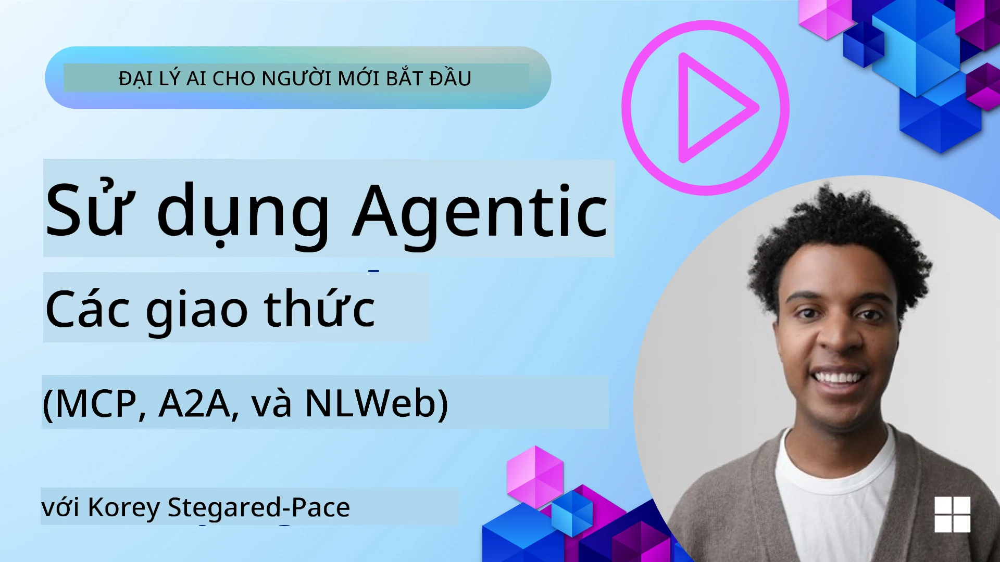
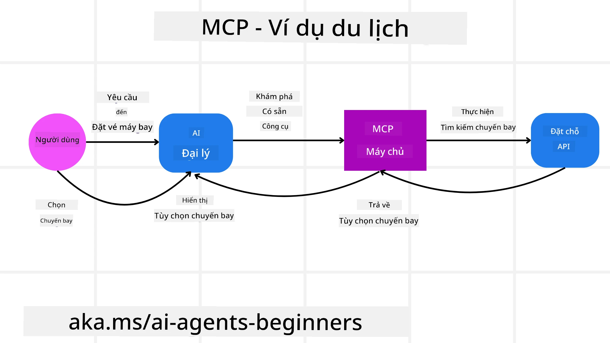
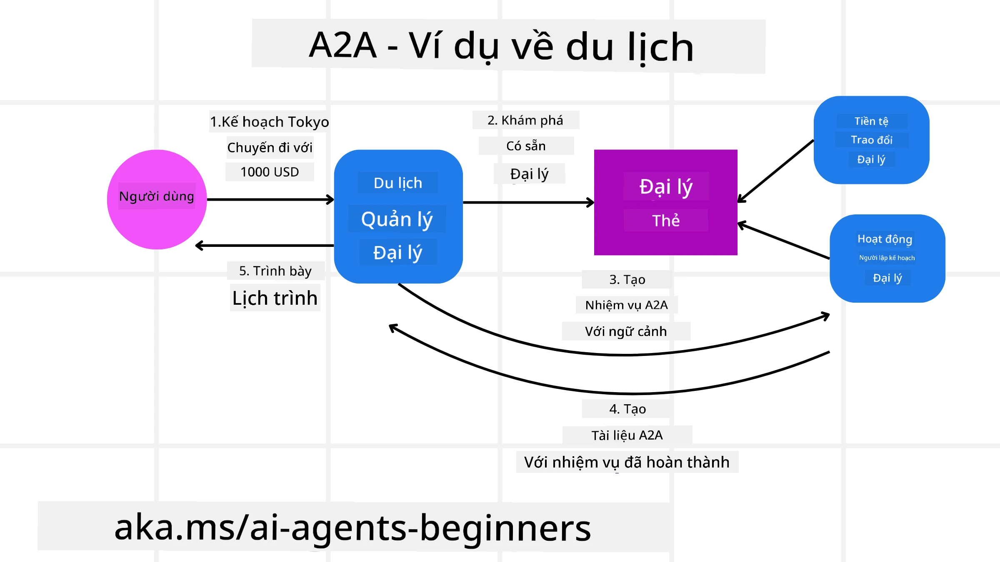
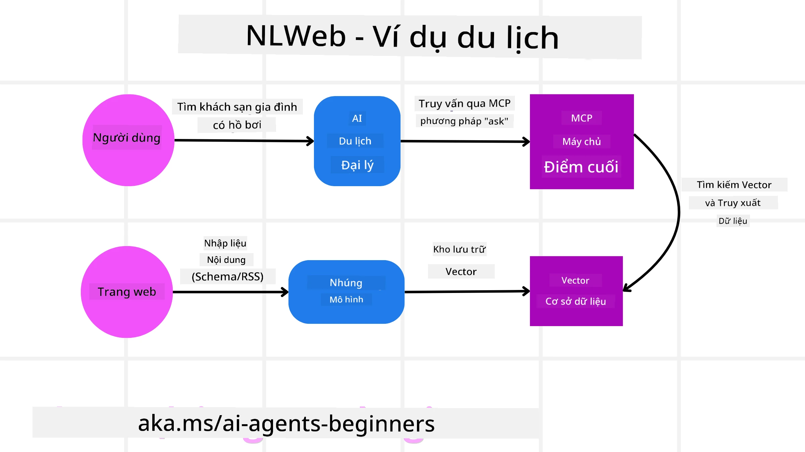

# Sử dụng Giao thức Agentic (MCP, A2A và NLWeb)

> _(Nhấp vào hình ảnh ở trên để xem video của bài học này)_

Khi việc sử dụng các tác nhân AI tăng lên, nhu cầu về các giao thức đảm bảo tiêu chuẩn hóa, bảo mật và hỗ trợ đổi mới mở cũng tăng theo. Trong bài học này, chúng ta sẽ đề cập đến 3 giao thức nhằm đáp ứng nhu cầu này - Giao thức Ngữ cảnh Mô hình (MCP), Agent to Agent (A2A) và Natural Language Web (NLWeb).

## Giới thiệu

Trong bài học này, chúng ta sẽ đề cập đến:

• Cách **MCP** cho phép các tác nhân AI truy cập công cụ và dữ liệu bên ngoài để hoàn thành các nhiệm vụ của người dùng.

• Cách **A2A** cho phép giao tiếp và hợp tác giữa các tác nhân AI khác nhau.

• Cách **NLWeb** đưa giao diện ngôn ngữ tự nhiên đến bất kỳ trang web nào, cho phép các tác nhân AI khám phá và tương tác với nội dung.

## Mục tiêu học tập

• **Xác định** mục đích cốt lõi và lợi ích của MCP, A2A và NLWeb trong bối cảnh các tác nhân AI.

• **Giải thích** cách mỗi giao thức tạo điều kiện cho việc giao tiếp và tương tác giữa LLM, công cụ và các tác nhân khác.

• **Nhận biết** vai trò riêng biệt mà mỗi giao thức đóng trong việc xây dựng các hệ thống tác nhân phức tạp.

## Model Context Protocol

Giao thức **Model Context Protocol (MCP)** là một tiêu chuẩn mở cung cấp cách chuẩn hóa để các ứng dụng cung cấp ngữ cảnh và công cụ cho các LLM. Điều này cho phép một "bộ chuyển đổi chung" tới các nguồn dữ liệu và công cụ khác nhau mà các Tác nhân AI có thể kết nối theo một cách nhất quán.

Hãy xem các thành phần của MCP, lợi ích so với việc sử dụng API trực tiếp, và một ví dụ về cách các tác nhân AI có thể sử dụng một máy chủ MCP.

### MCP Core Components

MCP hoạt động trên kiến trúc **client-server** và các thành phần cốt lõi là:

• **Hosts** là các ứng dụng LLM (ví dụ một trình soạn mã như VSCode) khởi tạo các kết nối tới một MCP Server.

• **Clients** là các thành phần trong ứng dụng host duy trì các kết nối một-một với các server.

• **Servers** là các chương trình nhẹ phơi bày các khả năng cụ thể.

Bao gồm trong giao thức là ba nguyên thủy cốt lõi là các khả năng của một MCP Server:

• **Tools**: Đây là các hành động hoặc chức năng rời rạc mà một tác nhân AI có thể gọi để thực hiện một hành động. Ví dụ, một dịch vụ thời tiết có thể phơi bày một công cụ "get weather", hoặc một server thương mại điện tử có thể phơi bày công cụ "purchase product". Máy chủ MCP quảng cáo tên, mô tả và sơ đồ đầu vào/đầu ra của từng công cụ trong danh sách khả năng của họ.

• **Resources**: Đây là các mục dữ liệu chỉ đọc hoặc tài liệu mà một MCP server có thể cung cấp, và các client có thể truy xuất theo yêu cầu. Ví dụ bao gồm nội dung file, bản ghi cơ sở dữ liệu hoặc tập tin nhật ký. Resources có thể là văn bản (như mã hoặc JSON) hoặc nhị phân (như hình ảnh hoặc PDF).

• **Prompts**: Đây là các mẫu được định nghĩa trước cung cấp các prompt gợi ý, cho phép các luồng công việc phức tạp hơn.

### Benefits of MCP

MCP mang lại lợi thế đáng kể cho các Tác nhân AI:

• **Khám phá công cụ động**: Các tác nhân có thể nhận động một danh sách các công cụ khả dụng từ một server cùng với mô tả về chức năng của chúng. Điều này khác với API truyền thống, vốn thường yêu cầu mã hóa tĩnh cho các tích hợp, nghĩa là bất kỳ thay đổi API nào đều đòi hỏi cập nhật mã. MCP cung cấp cách "tích hợp một lần", dẫn đến tính thích ứng cao hơn.

• **Tương tác giữa các LLM**: MCP hoạt động trên các LLM khác nhau, cung cấp tính linh hoạt để chuyển đổi mô hình lõi nhằm đánh giá hiệu suất tốt hơn.

• **Bảo mật chuẩn hóa**: MCP bao gồm một phương thức xác thực chuẩn, cải thiện khả năng mở rộng khi thêm quyền truy cập vào các MCP server bổ sung. Điều này đơn giản hơn so với quản lý nhiều khóa và loại xác thực khác nhau cho các API truyền thống.

### MCP Example

Hãy tưởng tượng một người dùng muốn đặt vé máy bay bằng một trợ lý AI được hỗ trợ bởi MCP.

1. **Connection**: Trợ lý AI (MCP client) kết nối với một MCP server do một hãng hàng không cung cấp.

2. **Tool Discovery**: Client hỏi MCP server của hãng hàng không, "Bạn có những công cụ nào khả dụng?" Server trả lời với các công cụ như "search flights" và "book flights".

3. **Tool Invocation**: Sau đó bạn yêu cầu trợ lý AI, "Vui lòng tìm chuyến bay từ Portland đến Honolulu." Trợ lý AI, sử dụng LLM của nó, xác định rằng nó cần gọi công cụ "search flights" và truyền các tham số liên quan (sân bay đi, sân bay đến) tới MCP server.

4. **Execution and Response**: MCP server, đóng vai trò là một wrapper, thực hiện cuộc gọi thực tế đến API đặt vé nội bộ của hãng hàng không. Sau đó nó nhận thông tin chuyến bay (ví dụ, dữ liệu JSON) và gửi lại cho trợ lý AI.

5. **Further Interaction**: Trợ lý AI trình bày các tùy chọn chuyến bay. Khi bạn chọn một chuyến, trợ lý có thể gọi công cụ "book flight" trên cùng MCP server, hoàn tất việc đặt vé.

## Agent-to-Agent Protocol (A2A)

Trong khi MCP tập trung vào kết nối LLM với công cụ, giao thức **Agent-to-Agent (A2A)** tiến xa hơn bằng cách cho phép giao tiếp và hợp tác giữa các tác nhân AI khác nhau. A2A kết nối các tác nhân AI giữa các tổ chức, môi trường và ngăn xếp kỹ thuật khác nhau để hoàn thành một nhiệm vụ chung.

Chúng ta sẽ xem xét các thành phần và lợi ích của A2A, cùng với một ví dụ về cách nó có thể được áp dụng trong ứng dụng du lịch của chúng ta.

### A2A Core Components

A2A tập trung vào việc cho phép giao tiếp giữa các tác nhân và để họ làm việc cùng nhau để hoàn thành một phần nhiệm vụ của người dùng. Mỗi thành phần của giao thức đóng góp cho điều này:

#### Agent Card

Tương tự như cách một MCP server chia sẻ danh sách công cụ, một Agent Card có:
- The Name of the Agent .
- A **description of the general tasks** it completes.
- A **list of specific skills** with descriptions to help other agents (or even human users) understand when and why they would want to call that agent.
- The **current Endpoint URL** of the agent
- The **version** and **capabilities** of the agent such as streaming responses and push notifications.

#### Agent Executor

Agent Executor chịu trách nhiệm **chuyển ngữ cảnh của cuộc trò chuyện người dùng tới tác nhân từ xa**, tác nhân từ xa cần điều này để hiểu nhiệm vụ cần hoàn thành. Trong một A2A server, một tác nhân sử dụng chính Large Language Model (LLM) của nó để phân tích các yêu cầu đến và thực thi nhiệm vụ bằng cách sử dụng các công cụ nội bộ của chính nó.

#### Artifact

Khi một tác nhân từ xa hoàn thành nhiệm vụ được yêu cầu, sản phẩm công việc của nó được tạo thành một artifact. Một artifact **chứa kết quả công việc của tác nhân**, một **mô tả về những gì đã hoàn thành**, và **ngữ cảnh văn bản** được gửi qua giao thức. Sau khi artifact được gửi, kết nối với tác nhân từ xa được đóng cho đến khi cần lại.

#### Event Queue

Thành phần này được sử dụng để **xử lý cập nhật và truyền thông điệp**. Nó đặc biệt quan trọng trong môi trường sản xuất cho các hệ thống tác nhân để ngăn kết nối giữa các tác nhân bị đóng trước khi một nhiệm vụ hoàn thành, đặc biệt khi thời gian hoàn thành nhiệm vụ có thể kéo dài.

### Benefits of A2A

• **Hợp tác nâng cao**: Nó cho phép các tác nhân từ các nhà cung cấp và nền tảng khác nhau tương tác, chia sẻ ngữ cảnh và làm việc cùng nhau, tạo điều kiện tự động hóa liền mạch trên các hệ thống vốn tách rời.

• **Linh hoạt trong lựa chọn mô hình**: Mỗi tác nhân A2A có thể quyết định sử dụng LLM nào để phục vụ yêu cầu của nó, cho phép tối ưu hóa hoặc tinh chỉnh mô hình theo từng tác nhân, khác với kết nối một LLM duy nhất trong một số kịch bản MCP.

• **Xác thực tích hợp sẵn**: Xác thực được tích hợp trực tiếp vào giao thức A2A, cung cấp một khung bảo mật vững chắc cho các tương tác giữa các tác nhân.

### A2A Example

Hãy mở rộng kịch bản đặt vé du lịch của chúng ta, nhưng lần này sử dụng A2A.

1. **User Request to Multi-Agent**: Người dùng tương tác với một "Travel Agent" A2A client/agent, có thể bằng cách nói, "Vui lòng đặt toàn bộ chuyến đi đến Honolulu cho tuần tới, bao gồm vé máy bay, khách sạn và thuê xe".

2. **Orchestration by Travel Agent**: Travel Agent nhận yêu cầu phức tạp này. Nó sử dụng LLM của mình để suy luận về nhiệm vụ và xác định rằng nó cần tương tác với các tác nhân chuyên môn khác.

3. **Inter-Agent Communication**: Travel Agent sau đó sử dụng giao thức A2A để kết nối với các tác nhân hạ nguồn, chẳng hạn như "Airline Agent", "Hotel Agent" và "Car Rental Agent" được tạo bởi các công ty khác nhau.

4. **Delegated Task Execution**: Travel Agent gửi các nhiệm vụ cụ thể đến các tác nhân chuyên môn này (ví dụ, "Find flights to Honolulu", "Book a hotel", "Rent a car"). Mỗi tác nhân chuyên môn này, chạy LLM của riêng họ và sử dụng các công cụ của chính họ (có thể là các MCP server), thực hiện phần cụ thể của việc đặt dịch vụ.

5. **Consolidated Response**: Khi tất cả các tác nhân hạ nguồn hoàn thành nhiệm vụ, Travel Agent tổng hợp kết quả (chi tiết chuyến bay, xác nhận khách sạn, đặt xe thuê) và gửi một phản hồi toàn diện, theo dạng trò chuyện, quay lại cho người dùng.

## Natural Language Web (NLWeb)

Các trang web từ lâu đã là cách chính để người dùng truy cập thông tin và dữ liệu trên internet.

Hãy xem các thành phần khác nhau của NLWeb, lợi ích của NLWeb và một ví dụ về cách NLWeb hoạt động bằng cách xem ứng dụng du lịch của chúng ta.

### Components of NLWeb

- **NLWeb Application (Core Service Code)**: Hệ thống xử lý các câu hỏi bằng ngôn ngữ tự nhiên. Nó kết nối các phần khác nhau của nền tảng để tạo phản hồi. Bạn có thể coi nó như **động cơ điều khiển các tính năng ngôn ngữ tự nhiên** của một trang web.

- **NLWeb Protocol**: Đây là một **tập hợp quy tắc cơ bản cho tương tác ngôn ngữ tự nhiên** với một trang web. Nó trả về phản hồi ở định dạng JSON (thường sử dụng Schema.org). Mục đích của nó là tạo nền tảng đơn giản cho "AI Web", tương tự cách HTML cho phép chia sẻ tài liệu trực tuyến.

- **MCP Server (Model Context Protocol Endpoint)**: Mỗi cài đặt NLWeb cũng hoạt động như một **MCP server**. Điều này có nghĩa là nó có thể **chia sẻ công cụ (như phương thức “ask”) và dữ liệu** với các hệ thống AI khác. Trong thực tế, điều này khiến nội dung và khả năng của trang web có thể được sử dụng bởi các tác nhân AI, cho phép trang web trở thành một phần của “hệ sinh thái tác nhân” rộng hơn.

- **Embedding Models**: Các mô hình này được dùng để **chuyển nội dung trang web thành các biểu diễn số gọi là vectors** (embeddings). Các vectors này nắm bắt ý nghĩa theo cách mà máy tính có thể so sánh và tìm kiếm. Chúng được lưu trữ trong một cơ sở dữ liệu đặc biệt, và người dùng có thể chọn mô hình embedding mà họ muốn sử dụng.

- **Vector Database (Retrieval Mechanism)**: Cơ sở dữ liệu này **lưu trữ các embeddings của nội dung trang web**. Khi ai đó đặt câu hỏi, NLWeb kiểm tra cơ sở dữ liệu vector để nhanh chóng tìm thông tin liên quan nhất. Nó cung cấp một danh sách các câu trả lời có thể, được xếp hạng theo sự tương đồng. NLWeb hoạt động với nhiều hệ thống lưu trữ vector khác nhau như Qdrant, Snowflake, Milvus, Azure AI Search và Elasticsearch.

### NLWeb by Example

Hãy xem xét lại trang web đặt chuyến du lịch của chúng ta, nhưng lần này nó được vận hành bởi NLWeb.

1. **Data Ingestion**: Các danh mục sản phẩm hiện có của trang du lịch (ví dụ, danh sách chuyến bay, mô tả khách sạn, gói tour) được định dạng bằng Schema.org hoặc nạp qua RSS feed. Các công cụ của NLWeb nhập dữ liệu có cấu trúc này, tạo embeddings và lưu trữ chúng trong cơ sở dữ liệu vector cục bộ hoặc từ xa.

2. **Natural Language Query (Human)**: Người dùng truy cập trang web và, thay vì điều hướng qua menu, nhập vào giao diện trò chuyện: "Tìm cho tôi một khách sạn phù hợp cho gia đình ở Honolulu có hồ bơi cho tuần tới".

3. **NLWeb Processing**: Ứng dụng NLWeb nhận truy vấn này. Nó gửi truy vấn đến một LLM để hiểu và đồng thời tìm kiếm cơ sở dữ liệu vector của nó để tìm danh sách khách sạn liên quan.

4. **Accurate Results**: LLM giúp diễn giải kết quả tìm kiếm từ cơ sở dữ liệu, xác định các khớp tốt nhất dựa trên tiêu chí "phù hợp cho gia đình", "hồ bơi" và "Honolulu", sau đó định dạng một phản hồi bằng ngôn ngữ tự nhiên. Quan trọng là, phản hồi tham chiếu đến các khách sạn thực tế từ danh mục của trang web, tránh thông tin bịa đặt.

5. **AI Agent Interaction**: Bởi vì NLWeb hoạt động như một MCP server, một tác nhân du lịch AI bên ngoài cũng có thể kết nối với instance NLWeb của trang web này. Tác nhân AI có thể sử dụng phương thức `ask` của MCP để truy vấn trang web trực tiếp: `ask("Are there any vegan-friendly restaurants in the Honolulu area recommended by the hotel?")`. Instance NLWeb sẽ xử lý điều này, tận dụng cơ sở dữ liệu thông tin nhà hàng của nó (nếu đã nạp), và trả về phản hồi JSON có cấu trúc.

### Got More Questions about MCP/A2A/NLWeb?

Tham gia [Microsoft Foundry Discord](https://aka.ms/ai-agents/discord) để gặp gỡ những người học khác, tham dự giờ tư vấn và nhận câu trả lời cho các câu hỏi về AI Agents của bạn.

## Tài nguyên

- [MCP for Beginners](https://aka.ms/mcp-for-beginners)  
- [MCP Documentation](https://learn.microsoft.com/python/api/overview/azure/ai-projects-readme)
- [NLWeb Repo](https://github.com/nlweb-ai/NLWeb)
- [Microsoft Agent Framework](https://aka.ms/ai-agents-beginners/agent-framewrok)

---

<!-- CO-OP TRANSLATOR DISCLAIMER START -->
Miễn trừ trách nhiệm:
Tài liệu này đã được dịch bằng dịch vụ dịch thuật AI [Co-op Translator](https://github.com/Azure/co-op-translator). Mặc dù chúng tôi nỗ lực đảm bảo độ chính xác, xin lưu ý rằng các bản dịch tự động có thể chứa lỗi hoặc không chính xác. Văn bản gốc bằng ngôn ngữ ban đầu nên được coi là nguồn chính thức. Đối với thông tin quan trọng, nên sử dụng bản dịch chuyên nghiệp do người dịch thực hiện. Chúng tôi không chịu trách nhiệm cho bất kỳ hiểu lầm hoặc giải thích sai nào phát sinh từ việc sử dụng bản dịch này.
<!-- CO-OP TRANSLATOR DISCLAIMER END -->