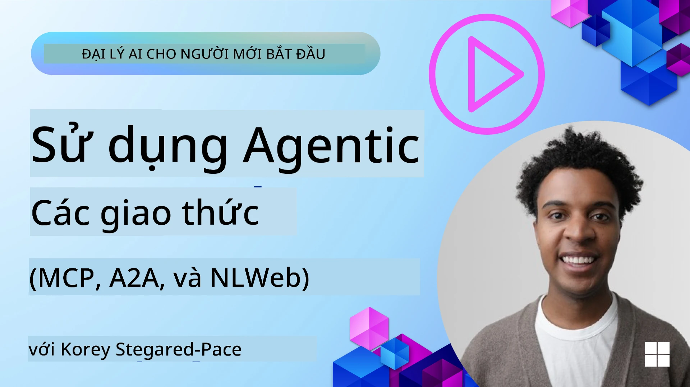
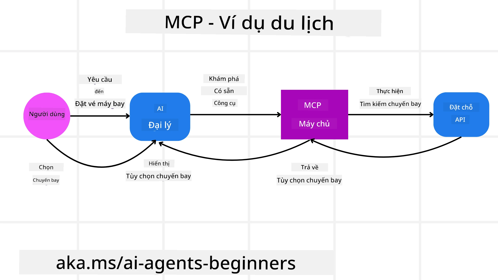
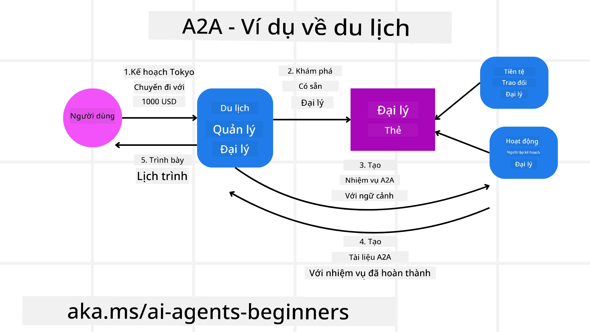
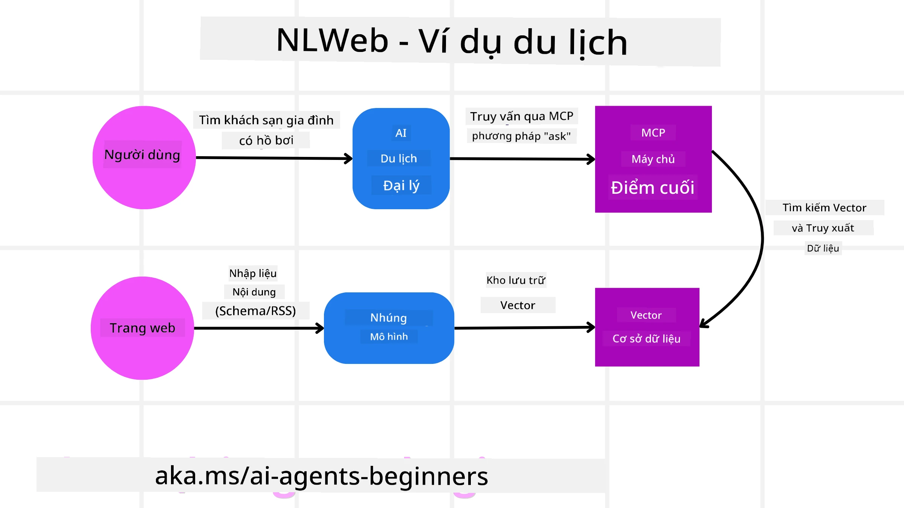

# Sử dụng Các Giao Thức Agentic (MCP, A2A và NLWeb)

> _(Nhấp vào hình ảnh trên để xem video bài học này)_

Khi việc sử dụng các đại lý AI ngày càng tăng, nhu cầu về các giao thức đảm bảo chuẩn hóa, bảo mật và hỗ trợ đổi mới mở cũng tăng theo. Trong bài học này, chúng ta sẽ tìm hiểu 3 giao thức nhằm đáp ứng nhu cầu này - Giao Thức Ngữ Cảnh Mô Hình (MCP), Agent to Agent (A2A) và Mạng Ngôn Ngữ Tự Nhiên (NLWeb).

## Giới thiệu

Trong bài học này, chúng ta sẽ tìm hiểu:

• Cách **MCP** cho phép các Đại lý AI truy cập công cụ và dữ liệu bên ngoài để hoàn thành nhiệm vụ người dùng.

• Cách **A2A** cho phép giao tiếp và hợp tác giữa các đại lý AI khác nhau.

• Cách **NLWeb** đưa giao diện ngôn ngữ tự nhiên vào bất kỳ trang web nào, cho phép các Đại lý AI khám phá và tương tác với nội dung.

## Mục tiêu học tập

• **Xác định** mục đích cốt lõi và lợi ích của MCP, A2A và NLWeb trong bối cảnh các đại lý AI.

• **Giải thích** cách mỗi giao thức hỗ trợ giao tiếp và tương tác giữa LLMs, công cụ và các đại lý khác.

• **Nhận biết** vai trò riêng biệt của mỗi giao thức trong xây dựng các hệ thống agentic phức tạp.

## Giao Thức Ngữ Cảnh Mô Hình

**Giao Thức Ngữ Cảnh Mô Hình (MCP)** là một tiêu chuẩn mở cung cấp cách chuẩn hóa để ứng dụng cung cấp ngữ cảnh và công cụ cho LLMs. Điều này cho phép một "bộ điều hợp chung" kết nối với các nguồn dữ liệu và công cụ khác nhau theo cách nhất quán mà các Đại lý AI có thể sử dụng.

Hãy cùng xem các thành phần của MCP, lợi ích so với việc sử dụng API trực tiếp, và một ví dụ về cách các đại lý AI có thể sử dụng máy chủ MCP.

### Thành phần cốt lõi của MCP

MCP hoạt động trên kiến trúc **client-server** và các thành phần cốt lõi bao gồm:

• **Hosts** là các ứng dụng LLM (ví dụ một trình soạn thảo mã như VSCode) bắt đầu kết nối đến máy chủ MCP.

• **Clients** là các thành phần trong ứng dụng host duy trì kết nối một-một với các máy chủ.

• **Servers** là các chương trình nhẹ cung cấp các khả năng cụ thể.

Bao gồm trong giao thức là ba khái niệm cơ bản đại diện cho các khả năng của máy chủ MCP:

• **Tools**: Đây là các hành động hoặc chức năng riêng biệt mà một đại lý AI có thể gọi để thực hiện một hành động. Ví dụ, một dịch vụ thời tiết có thể cung cấp công cụ "lấy thời tiết", hoặc máy chủ thương mại điện tử có thể cung cấp công cụ "mua sản phẩm". Máy chủ MCP công bố tên công cụ, mô tả và sơ đồ đầu vào/đầu ra trong danh sách khả năng.

• **Resources**: Đây là các mục dữ liệu hoặc tài liệu chỉ đọc mà máy chủ MCP có thể cung cấp, và client có thể lấy theo yêu cầu. Ví dụ bao gồm nội dung tập tin, bản ghi cơ sở dữ liệu hoặc tệp nhật ký. Tài nguyên có thể là văn bản (như mã hoặc JSON) hoặc nhị phân (như hình ảnh hoặc PDF).

• **Prompts**: Đây là các mẫu định nghĩa trước cung cấp các đề xuất prompt, cho phép quy trình làm việc phức tạp hơn.

### Lợi ích của MCP

MCP mang lại nhiều ưu điểm đáng kể cho các Đại lý AI:

• **Khám phá Công cụ động**: Đại lý có thể nhận danh sách công cụ có sẵn từ máy chủ cùng với mô tả công dụng của chúng. Điều này khác với các API truyền thống, vốn thường yêu cầu mã hóa tĩnh cho các tích hợp, nghĩa là mỗi thay đổi API đều phải cập nhật mã. MCP mang đến cách tiếp cận "tích hợp một lần", dẫn đến khả năng thích ứng cao hơn.

• **Tương tác đa LLM**: MCP hoạt động trên nhiều LLM khác nhau, cung cấp linh hoạt để thay đổi mô hình lõi nhằm đánh giá và cải thiện hiệu suất.

• **Bảo mật Chuẩn hóa**: MCP bao gồm phương thức xác thực chuẩn, cải thiện khả năng mở rộng khi thêm truy cập các máy chủ MCP khác. Điều này đơn giản hơn nhiều so với việc quản lý các khóa và kiểu xác thực khác nhau cho nhiều API truyền thống.

### Ví dụ về MCP

Hãy tưởng tượng một người dùng muốn đặt vé máy bay bằng trợ lý AI chạy MCP.

1. **Kết nối**: Trợ lý AI (client MCP) kết nối đến máy chủ MCP do hãng hàng không cung cấp.

2. **Khám phá Công cụ**: Client hỏi máy chủ MCP của hãng hàng không: "Bạn có công cụ nào sẵn có?" Máy chủ trả lời với các công cụ như "tìm chuyến bay" và "đặt chuyến bay".

3. **Gọi Công cụ**: Người dùng yêu cầu trợ lý AI: "Vui lòng tìm chuyến bay từ Portland tới Honolulu." Trợ lý AI, sử dụng LLM, nhận ra cần gọi công cụ "tìm chuyến bay" và chuyển các tham số liên quan (nơi đi, nơi đến) cho máy chủ MCP.

4. **Thực thi và Phản hồi**: Máy chủ MCP, hoạt động như lớp bao bọc, thực hiện gọi API nội bộ đặt vé của hãng hàng không. Sau đó nhận dữ liệu chuyến bay (ví dụ dữ liệu JSON) và gửi về cho trợ lý AI.

5. **Tương tác thêm**: Trợ lý AI trình bày các lựa chọn chuyến bay. Khi người dùng chọn chuyến bay, trợ lý có thể gọi công cụ "đặt chuyến bay" trên cùng máy chủ MCP để hoàn tất đặt vé.

## Giao Thức Agent-to-Agent (A2A)

Trong khi MCP tập trung kết nối LLM với công cụ, **giao thức Agent-to-Agent (A2A)** đi xa hơn khi cho phép giao tiếp và hợp tác giữa các đại lý AI khác nhau. A2A kết nối các đại lý AI thuộc các tổ chức, môi trường và nền tảng kỹ thuật khác nhau để hoàn thành nhiệm vụ chung.

Chúng ta sẽ tìm hiểu các thành phần và lợi ích của A2A cùng ví dụ áp dụng trong ứng dụng du lịch.

### Thành phần cốt lõi của A2A

A2A tập trung vào cho phép giao tiếp giữa các đại lý và làm việc cùng nhau hoàn thành một phần nhiệm vụ của người dùng. Mỗi thành phần trong giao thức góp phần vào điều này:

#### Thẻ Đại lý (Agent Card)

Tương tự cách một máy chủ MCP chia sẻ danh sách công cụ, một Thẻ Đại lý có:
- Tên của Đại lý.
- **Mô tả các nhiệm vụ chung** mà đại lý thực hiện.
- **Danh sách các kỹ năng cụ thể** kèm mô tả giúp các đại lý khác (hoặc người dùng) hiểu khi nào và vì sao họ muốn gọi đến đại lý đó.
- **URL Endpoint hiện tại** của đại lý
- **Phiên bản** và **khả năng** của đại lý, ví dụ như hỗ trợ streaming phản hồi và thông báo đẩy.

#### Bộ thực thi đại lý (Agent Executor)

Bộ thực thi đại lý chịu trách nhiệm **chuyển ngữ cảnh cuộc chat người dùng đến đại lý từ xa**, đại lý từ xa cần ngữ cảnh này để hiểu nhiệm vụ cần hoàn thành. Trong máy chủ A2A, đại lý sử dụng LLM của chính mình để phân tích yêu cầu đến và thực thi nhiệm vụ với các công cụ nội bộ.

#### Tác phẩm (Artifact)

Khi đại lý từ xa hoàn thành nhiệm vụ, sản phẩm công việc được tạo dưới dạng tác phẩm. Một tác phẩm **chứa kết quả công việc của đại lý**, một **mô tả về những gì đã hoàn thành**, và **bối cảnh văn bản** được gửi qua giao thức. Sau khi gửi tác phẩm, kết nối với đại lý từ xa được đóng cho đến khi cần lại.

#### Hàng đợi Sự kiện (Event Queue)

Thành phần này dùng để **xử lý cập nhật và truyền tin nhắn**. Nó đặc biệt quan trọng trong sản xuất đối với các hệ thống agentic để ngăn kết nối giữa các đại lý bị đóng trước khi nhiệm vụ hoàn thành, nhất là khi thời gian hoàn thành có thể kéo dài.

### Lợi ích của A2A

• **Tăng cường Hợp tác**: Cho phép các đại lý từ nhiều nhà cung cấp và nền tảng khác nhau tương tác, chia sẻ ngữ cảnh và làm việc cùng nhau, giúp tự động hóa liền mạch trên các hệ thống trước đây tách rời.

• **Linh hoạt trong Lựa chọn Mô hình**: Mỗi đại lý A2A có thể quyết định LLM nào sử dụng để phục vụ yêu cầu, cho phép tối ưu hoặc tinh chỉnh mô hình riêng cho mỗi đại lý, khác với kết nối LLM đơn trong một số kịch bản MCP.

• **Xác thực tích hợp sẵn**: Xác thực được tích hợp trực tiếp trong giao thức A2A, cung cấp khung bảo mật mạnh mẽ cho tương tác đại lý.

### Ví dụ về A2A

Hãy mở rộng kịch bản đặt du lịch, lần này sử dụng A2A.

1. **Yêu cầu người dùng đến đa đại lý**: Người dùng tương tác với một client/đại lý "Travel Agent" A2A, có thể bằng cách nói: "Vui lòng đặt một chuyến đi trọn gói tới Honolulu cho tuần tới, bao gồm vé máy bay, khách sạn và thuê xe".

2. **Điều phối bởi Travel Agent**: Travel Agent nhận yêu cầu phức tạp này. Nó sử dụng LLM của mình để suy nghĩ về nhiệm vụ và xác định cần tương tác với các đại lý chuyên môn khác.

3. **Giao tiếp giữa các đại lý**: Travel Agent sử dụng giao thức A2A để kết nối với các đại lý hạ nguồn, như "Airline Agent," "Hotel Agent," và "Car Rental Agent" được tạo bởi các công ty khác nhau.

4. **Phân công thực thi nhiệm vụ**: Travel Agent gửi các nhiệm vụ cụ thể cho các đại lý chuyên biệt này (ví dụ, "Tìm chuyến bay tới Honolulu," "Đặt khách sạn," "Thuê xe"). Mỗi đại lý chuyên biệt này, chạy LLM riêng và sử dụng công cụ của mình (có thể là máy chủ MCP), thực hiện phần việc riêng của họ trong quá trình đặt.

5. **Phản hồi tổng hợp**: Khi tất cả đại lý hạ nguồn hoàn thành nhiệm vụ, Travel Agent tổng hợp kết quả (chi tiết chuyến bay, xác nhận khách sạn, đặt thuê xe) và gửi phản hồi tổng hợp, kiểu trò chuyện, trở lại cho người dùng.

## Mạng Ngôn Ngữ Tự Nhiên (NLWeb)

Các trang web từ lâu đã là cách chính để người dùng truy cập thông tin và dữ liệu trên internet.

Hãy xem các thành phần khác nhau của NLWeb, lợi ích của NLWeb và một ví dụ về cách NLWeb hoạt động qua ứng dụng du lịch của chúng ta.

### Các thành phần của NLWeb

- **Ứng dụng NLWeb (Mã dịch vụ cốt lõi)**: Hệ thống xử lý các câu hỏi ngôn ngữ tự nhiên. Nó kết nối các phần khác nhau của nền tảng để tạo ra các phản hồi. Bạn có thể xem nó như **động cơ vận hành các tính năng ngôn ngữ tự nhiên** của một trang web.

- **Giao thức NLWeb**: Đây là **bộ quy tắc cơ bản cho tương tác ngôn ngữ tự nhiên** với một trang web. Nó gửi lại câu trả lời ở định dạng JSON (thường sử dụng Schema.org). Mục đích là tạo nền tảng đơn giản cho "Mạng AI", tương tự cách HTML giúp chia sẻ tài liệu trên mạng.

- **Máy chủ MCP (Điểm cuối Giao thức Ngữ cảnh Mô hình)**: Mỗi thiết lập NLWeb cũng đóng vai trò là **máy chủ MCP**. Điều này có nghĩa nó có thể **chia sẻ công cụ (như phương thức “ask”) và dữ liệu** với các hệ thống AI khác. Trên thực tế, điều này làm cho nội dung và chức năng của trang web có thể sử dụng bởi các đại lý AI, cho phép trang web trở thành một phần của "hệ sinh thái đại lý" rộng lớn hơn.

- **Mô hình nhúng (Embedding Models)**: Các mô hình này dùng để **chuyển nội dung trang web thành các biểu diễn số gọi là vectors** (embeddings). Các vectors này biểu diễn ý nghĩa theo cách máy tính có thể so sánh và tìm kiếm. Chúng được lưu trữ trong cơ sở dữ liệu đặc biệt, và người dùng có thể chọn mô hình nhúng họ muốn sử dụng.

- **Cơ sở dữ liệu Vector (Cơ chế truy xuất)**: Cơ sở dữ liệu này **lưu trữ embeddings của nội dung trang web**. Khi ai đó hỏi một câu, NLWeb tra cứu trong cơ sở dữ liệu vector để nhanh chóng tìm thông tin phù hợp nhất. Nó cung cấp danh sách câu trả lời có thể, xếp hạng theo độ tương đồng. NLWeb hoạt động với nhiều hệ thống lưu trữ vector như Qdrant, Snowflake, Milvus, Azure AI Search và Elasticsearch.

### Ví dụ về NLWeb

Hãy tiếp tục với trang web đặt du lịch, lần này trang web chạy trên NLWeb.

1. **Nhập dữ liệu**: Danh mục sản phẩm hiện có của trang web du lịch (ví dụ, danh sách chuyến bay, mô tả khách sạn, các gói tour) được định dạng theo Schema.org hoặc tải qua nguồn cấp RSS. Các công cụ của NLWeb nhập dữ liệu có cấu trúc này, tạo embeddings và lưu vào cơ sở dữ liệu vector cục bộ hoặc từ xa.

2. **Truy vấn ngôn ngữ tự nhiên (con người)**: Người dùng vào website và thay vì duyệt menu, nhập câu hỏi vào giao diện chat: "Tìm cho tôi khách sạn phù hợp gia đình ở Honolulu có hồ bơi cho tuần tới".

3. **Xử lý NLWeb**: Ứng dụng NLWeb nhận truy vấn này. Nó gửi truy vấn đến LLM để hiểu và đồng thời tìm kiếm trong cơ sở dữ liệu vector cho các bản ghi khách sạn phù hợp.

4. **Kết quả chính xác**: LLM giúp diễn giải kết quả tìm kiếm, xác định các kết quả phù hợp nhất dựa trên tiêu chí "phù hợp gia đình," "hồ bơi," và "Honolulu," rồi định dạng câu trả lời ngôn ngữ tự nhiên. Quan trọng là câu trả lời tham chiếu đúng các khách sạn thật từ danh mục của website, tránh thông tin giả mạo.

5. **Tương tác Đại lý AI**: Vì NLWeb hoạt động như một máy chủ MCP, một đại lý du lịch AI bên ngoài cũng có thể kết nối đến instance NLWeb của trang này. Đại lý AI có thể sử dụng phương thức `ask` của MCP để truy vấn trực tiếp trang web: `ask("Có nhà hàng thuần chay nào gần khu vực Honolulu được khách sạn giới thiệu không?")`. Instance NLWeb sẽ xử lý câu hỏi này, khai thác dữ liệu nhà hàng (nếu đã tải), và trả về phản hồi có cấu trúc JSON.

### Còn Thắc Mắc về MCP/A2A/NLWeb?

Tham gia [Microsoft Foundry Discord](https://discord.com/invite/ATgtXmAS5D) để gặp gỡ các học viên khác, tham dự giờ văn phòng và nhận câu trả lời cho các câu hỏi về Đại lý AI.

## Tài nguyên

- [MCP cho Người mới bắt đầu](https://aka.ms/mcp-for-beginners)  
- [Tài liệu MCP](https://learn.microsoft.com/python/api/overview/azure/ai-projects-readme)
- [Kho mã NLWeb](https://github.com/nlweb-ai/NLWeb)
- [Microsoft Agent Framework](https://learn.microsoft.com/en-us/agent-framework/overview/?wt.mc_id=youtube_26688_organicsocial_reactor&pivots=programming-language-python)

## Bài học trước

[Đại lý AI trong Sản xuất](../10-ai-agents-production/README.md)

## Bài học tiếp theo

[Kỹ thuật Ngữ cảnh cho Đại lý AI](../12-context-engineering/README.md)

---

<!-- CO-OP TRANSLATOR DISCLAIMER START -->
**Tuyên bố miễn trừ trách nhiệm**:
Tài liệu này đã được dịch bằng dịch vụ dịch thuật AI [Co-op Translator](https://github.com/Azure/co-op-translator). Mặc dù chúng tôi cố gắng đảm bảo độ chính xác, xin lưu ý rằng bản dịch tự động có thể chứa lỗi hoặc sai sót. Tài liệu gốc bằng ngôn ngữ gốc nên được coi là nguồn tin chính thức. Đối với thông tin quan trọng, nên sử dụng dịch vụ dịch thuật chuyên nghiệp bởi con người. Chúng tôi không chịu trách nhiệm về bất kỳ hiểu lầm hoặc giải thích sai nào phát sinh từ việc sử dụng bản dịch này.
<!-- CO-OP TRANSLATOR DISCLAIMER END -->