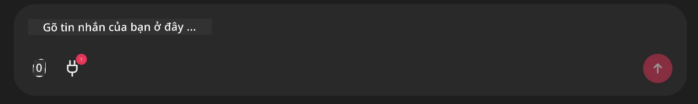

# Github MCP Server Example

## Mô tả

Đây là một bản demo được tạo cho AI Agents Hackathon được tổ chức thông qua Microsoft Reactor.

Công cụ này được dùng để đề xuất các dự án hackathon dựa trên các kho (repo) Github của người dùng.
Điều này được thực hiện bằng:

1. **Github Agent** - Sử dụng Github MCP Server để truy xuất các repo và thông tin về các repo đó.
2. **Hackathon Agent** - Lấy dữ liệu từ Github Agent và đưa ra các ý tưởng dự án hackathon sáng tạo dựa trên các dự án, ngôn ngữ người dùng sử dụng và các chủ đề dự án cho AI Agents hackathon.
3. **Events Agent** - Dựa trên đề xuất của hackathon agent, events agent sẽ đề xuất các sự kiện liên quan từ chuỗi AI Agent Hackathon.
## Running the code 

### Environment Variables

This demo uses Microsoft Agent Framework, Azure OpenAI Service, the Github MCP Server and Azure AI Search.

Make sure that you have the proper environment variables set to use these tools:

```python
AZURE_AI_PROJECT_ENDPOINT=""
AZURE_AI_MODEL_DEPLOYMENT_NAME=""
AZURE_SEARCH_SERVICE_ENDPOINT=""
AZURE_SEARCH_API_KEY=""
``` 

## Running the Chainlit Server

To connect to the MCP server, this demo use Chainlit as a chat interface. 

To run the server, use the following command in your terminal:

```bash
chainlit run app.py -w
```

This should start your Chainlit server on `localhost:8000` as well as populate your Azure AI Search Index with the `event-descriptions.md` content. 

## Connecting to the MCP Server

To connect to the Github MCP Server, select the "plug" icon underneath the "Type your message here.." chat box:



From there you can click on the "Connect an MCP" to add the command to connect to the Github MCP Server:

```bash
npx -y @modelcontextprotocol/server-github --env GITHUB_PERSONAL_ACCESS_TOKEN=[YOUR PERSONAL ACCESS TOKEN]
```

Replace "[YOUR PERSONAL ACCESS TOKEN]" with your actual Personal Access Token. 

After connecting, you should see a (1) next to the plug icon to confirm that its connected. If not, try restarting the chainlit server with `chainlit run app.py -w`.

## Using the Demo 

To start the agent workflow of recommending hackathon projects, you can type a message like: 

"Đề xuất dự án hackathon cho người dùng Github koreyspace"

The Router Agent will analyze your request and determine which combination of agents (GitHub, Hackathon, and Events) is best suited to handle your query. The agents work together to provide comprehensive recommendations based on GitHub repository analysis, project ideation, and relevant tech events.

---

<!-- CO-OP TRANSLATOR DISCLAIMER START -->
**Miễn trừ trách nhiệm**:
Tài liệu này đã được dịch bằng dịch vụ dịch thuật bằng AI [Co-op Translator](https://github.com/Azure/co-op-translator). Mặc dù chúng tôi nỗ lực đảm bảo độ chính xác, xin lưu ý rằng các bản dịch tự động có thể chứa lỗi hoặc không chính xác. Tài liệu gốc bằng ngôn ngữ gốc nên được coi là nguồn chính thức. Đối với những thông tin quan trọng, nên sử dụng dịch vụ dịch thuật chuyên nghiệp do con người thực hiện. Chúng tôi không chịu trách nhiệm về bất kỳ hiểu lầm hoặc giải thích sai nào phát sinh từ việc sử dụng bản dịch này.
<!-- CO-OP TRANSLATOR DISCLAIMER END -->