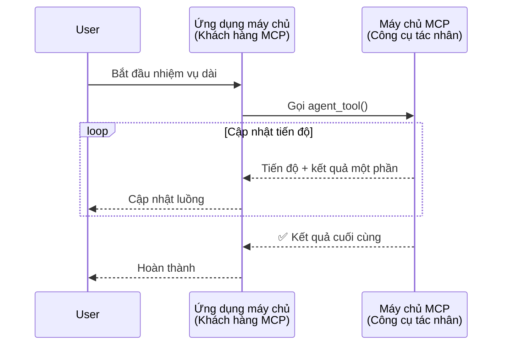
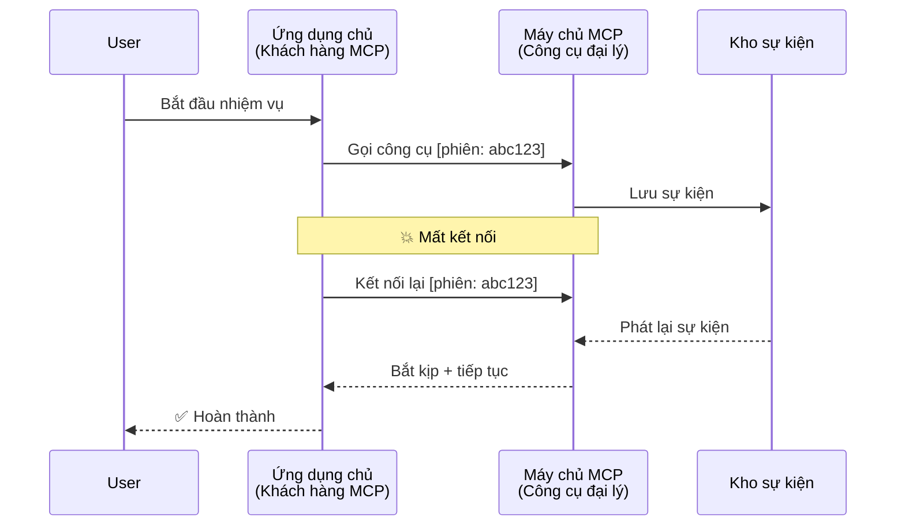
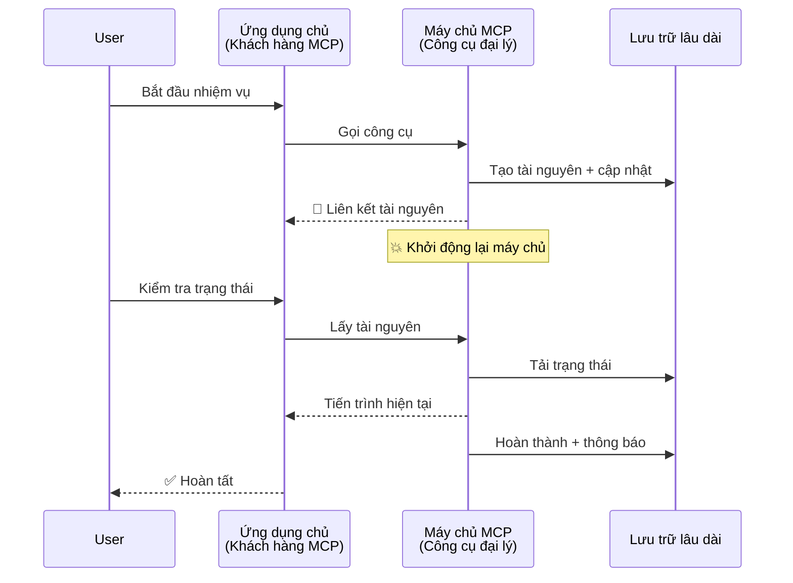
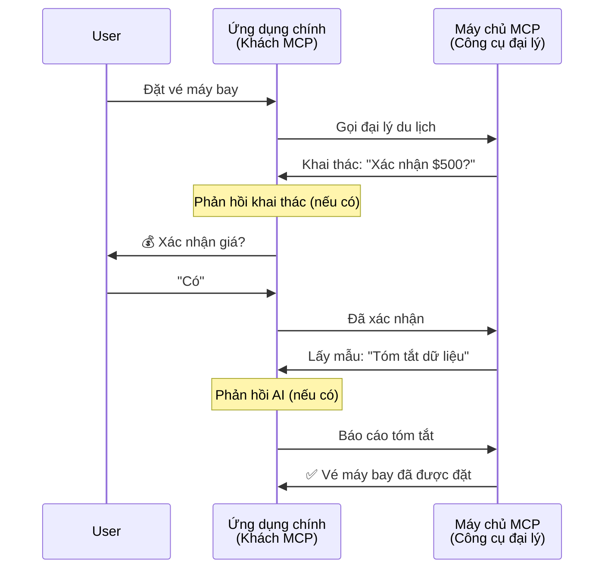
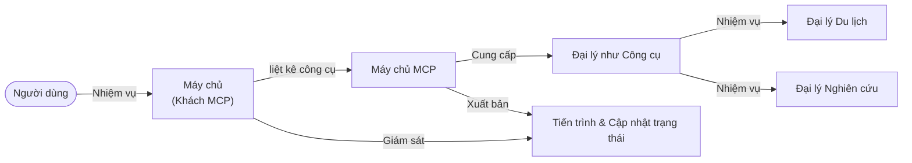

# Xây dựng Hệ thống Giao tiếp Tác nhân với Tác nhân bằng MCP

> Tóm tắt - Bạn có thể xây dựng giao tiếp Agent2Agent trên MCP không? Có thể!

MCP đã phát triển vượt xa mục tiêu ban đầu của nó là "cung cấp ngữ cảnh cho LLM". Với những cải tiến gần đây bao gồm [luồng có thể tiếp tục](https://modelcontextprotocol.io/docs/concepts/transports#resumability-and-redelivery), [gợi ý](https://modelcontextprotocol.io/specification/2025-06-18/client/elicitation), [lấy mẫu](https://modelcontextprotocol.io/specification/2025-06-18/client/sampling), và thông báo ([tiến trình](https://modelcontextprotocol.io/specification/2025-06-18/basic/utilities/progress) và [tài nguyên](https://modelcontextprotocol.io/specification/2025-06-18/schema#resourceupdatednotification)), MCP hiện cung cấp một nền tảng vững chắc để xây dựng các hệ thống giao tiếp phức tạp giữa các tác nhân.

## Nhận thức Sai lầm về Tác nhân/Công cụ

Khi nhiều nhà phát triển khám phá các công cụ với hành vi tác nhân (chạy trong thời gian dài, có thể yêu cầu đầu vào bổ sung giữa chừng, v.v.), một nhận thức phổ biến là MCP không phù hợp chủ yếu vì các ví dụ ban đầu về công cụ của nó tập trung vào các mẫu yêu cầu-phản hồi đơn giản.

Quan điểm này đã lỗi thời. Đặc tả MCP đã được cải tiến đáng kể trong vài tháng qua với các khả năng lấp đầy khoảng trống để xây dựng hành vi tác nhân chạy lâu dài:

- **Phát trực tuyến & Kết quả phần**: Cập nhật tiến trình theo thời gian thực trong khi thực thi
- **Khả năng tiếp tục**: Khách hàng có thể kết nối lại và tiếp tục sau khi mất kết nối
- **Độ bền**: Kết quả tồn tại qua các lần khởi động lại máy chủ (ví dụ, qua các liên kết tài nguyên)
- **Đa lượt**: Nhập tương tác giữa chừng qua gợi ý và lấy mẫu

Các tính năng này có thể được kết hợp để cho phép các ứng dụng tác nhân phức tạp và đa tác nhân, tất cả được triển khai trên giao thức MCP.

Để tham khảo, chúng ta sẽ gọi một tác nhân là một "công cụ" có sẵn trên máy chủ MCP. Điều này ngụ ý tồn tại một ứng dụng chủ mà triển khai một khách hàng MCP thiết lập một phiên với máy chủ MCP và có thể gọi tác nhân đó.

## Điều gì làm cho Công cụ MCP trở nên "Tác nhân"?

Trước khi đi sâu vào triển khai, hãy xác định những khả năng hạ tầng cần thiết để hỗ trợ các tác nhân chạy lâu dài.

> Chúng ta sẽ định nghĩa một tác nhân là một thực thể có thể hoạt động tự chủ trong khoảng thời gian dài, có khả năng xử lý các nhiệm vụ phức tạp có thể cần nhiều tương tác hoặc điều chỉnh dựa trên phản hồi thời gian thực.

### 1. Phát trực tuyến & Kết quả phần

Các mẫu yêu cầu-phản hồi truyền thống không hiệu quả cho các nhiệm vụ chạy lâu dài. Các tác nhân cần cung cấp:

- Cập nhật tiến trình theo thời gian thực
- Kết quả trung gian

**Hỗ trợ MCP**: Thông báo cập nhật tài nguyên cho phép phát trực tuyến kết quả phần, mặc dù điều này đòi hỏi thiết kế cẩn thận để tránh xung đột với mô hình yêu cầu/phản hồi 1:1 của JSON-RPC.

| Tính năng                 | Trường hợp sử dụng                                                                                                                                                | Hỗ trợ MCP                                                                                 |
| ------------------------ | ---------------------------------------------------------------------------------------------------------------------------------------------------------------- | ------------------------------------------------------------------------------------------ |
| Cập nhật tiến trình thời gian thực | Người dùng yêu cầu nhiệm vụ di cư mã nguồn. Tác nhân phát trực tuyến tiến trình: "10% - Phân tích phụ thuộc... 25% - Chuyển đổi file TypeScript... 50% - Cập nhật import..." | ✅ Thông báo tiến trình                                                                     |
| Kết quả phần             | Nhiệm vụ "Tạo một cuốn sách" phát trực tuyến kết quả phần, ví dụ: 1) Phác thảo cốt truyện, 2) Danh sách chương, 3) Mỗi chương khi hoàn thành. Chủ có thể kiểm tra, hủy hoặc chuyển hướng bất kỳ lúc nào. | ✅ Thông báo có thể "mở rộng" để bao gồm kết quả phần xem các đề xuất trong PR 383, 776       |

<div align="center" style="font-style: italic; font-size: 0.95em; margin-bottom: 0.5em;">
<strong>Hình 1:</strong> Sơ đồ này minh họa cách một tác nhân MCP phát trực tuyến cập nhật tiến trình thời gian thực và kết quả phần cho ứng dụng chủ trong quá trình thực hiện nhiệm vụ dài hạn, cho phép người dùng theo dõi tiến trình thực hiện ngay lập tức.
</div>



### 2. Khả năng Tiếp tục

Các tác nhân phải xử lý gián đoạn mạng một cách mượt mà:

- Kết nối lại sau khi (khách hàng) bị ngắt kết nối
- Tiếp tục từ nơi đã dừng lại (phân phối lại thông điệp)

**Hỗ trợ MCP**: Giao thức StreamableHTTP của MCP hiện nay hỗ trợ tiếp tục phiên và phân phối lại thông điệp với ID phiên và ID sự kiện cuối cùng. Lưu ý quan trọng là máy chủ phải triển khai một Kho Sự kiện cho phép phát lại sự kiện khi khách hàng kết nối lại.  
Lưu ý rằng có một đề xuất cộng đồng (PR #975) đang khám phá luồng có thể tiếp tục độc lập với giao thức truyền tải.

| Tính năng       | Trường hợp sử dụng                                                                                                                                           | Hỗ trợ MCP                                                               |
| -------------- | ------------------------------------------------------------------------------------------------------------------------------------------------------------ | ------------------------------------------------------------------------- |
| Khả năng Tiếp tục | Khách hàng bị ngắt kết nối trong khi thực hiện tác vụ dài. Khi kết nối lại, phiên được tiếp tục với các sự kiện bị bỏ lỡ được phát lại, tiếp tục liền mạch từ nơi đã dừng. | ✅ Giao thức StreamableHTTP với ID phiên, phát lại sự kiện và Kho Sự kiện |

<div align="center" style="font-style: italic; font-size: 0.95em; margin-bottom: 0.5em;">
<strong>Hình 2:</strong> Sơ đồ này cho thấy cách giao thức StreamableHTTP của MCP và kho sự kiện cho phép tiếp tục phiên mượt mà: nếu khách hàng ngắt kết nối, nó có thể kết nối lại và phát lại các sự kiện bị bỏ lỡ, tiếp tục tác vụ mà không mất tiến trình.
</div>



### 3. Độ bền

Các tác nhân chạy lâu dài cần trạng thái tồn tại:

- Kết quả tồn tại qua các lần khởi động lại máy chủ
- Trạng thái có thể được truy xuất ngoài băng thông (out-of-band)
- Theo dõi tiến trình qua các phiên

**Hỗ trợ MCP**: MCP hiện hỗ trợ kiểu trả về liên kết tài nguyên cho các cuộc gọi công cụ. Hiện nay, một mẫu phổ biến là thiết kế công cụ tạo một tài nguyên và trả về ngay một liên kết tài nguyên. Công cụ có thể tiếp tục xử lý tác vụ ở nền và cập nhật tài nguyên. Khách hàng có thể chọn truy vấn trạng thái tài nguyên để nhận kết quả phần hoặc đầy đủ (dựa trên các cập nhật tài nguyên mà máy chủ cung cấp) hoặc đăng ký nhận thông báo cập nhật từ tài nguyên.

Một hạn chế ở đây là việc truy vấn tài nguyên hoặc đăng ký nhận cập nhật có thể tiêu tốn tài nguyên với các tác động ở quy mô lớn. Có một đề xuất cộng đồng mở (bao gồm #992) khám phá khả năng bao gồm webhook hoặc trigger mà máy chủ có thể gọi để thông báo cho khách hàng/ứng dụng chủ về các cập nhật.

| Tính năng  | Trường hợp sử dụng                                                                                                                               | Hỗ trợ MCP                                                      |
| ---------- | ----------------------------------------------------------------------------------------------------------------------------------------------- | ---------------------------------------------------------------- |
| Độ bền     | Máy chủ bị sự cố trong quá trình di cư dữ liệu. Kết quả và tiến trình tồn tại qua lần khởi động lại, khách hàng có thể kiểm tra trạng thái và tiếp tục từ tài nguyên tồn tại. | ✅ Liên kết tài nguyên với lưu trữ bền và thông báo trạng thái     |

Hiện nay, một mẫu phổ biến là thiết kế công cụ tạo tài nguyên và trả về ngay liên kết tài nguyên. Công cụ có thể ở nền giải quyết tác vụ, phát đi thông báo tài nguyên làm cập nhật tiến trình hoặc bao gồm kết quả phần, và cập nhật nội dung trong tài nguyên khi cần.

<div align="center" style="font-style: italic; font-size: 0.95em; margin-bottom: 0.5em;">
<strong>Hình 3:</strong> Sơ đồ này minh họa cách các tác nhân MCP sử dụng tài nguyên tồn tại và thông báo trạng thái để đảm bảo các tác vụ chạy dài tồn tại qua các lần khởi động lại máy chủ, cho phép khách hàng kiểm tra tiến trình và lấy kết quả ngay cả sau khi có sự cố.
</div>



### 4. Tương Tác Đa Lượt

Các tác nhân thường cần đầu vào bổ sung giữa chừng:

- Làm rõ hoặc phê duyệt của con người
- Hỗ trợ AI cho các quyết định phức tạp
- Điều chỉnh tham số động

**Hỗ trợ MCP**: Được hỗ trợ đầy đủ qua lấy mẫu (để lấy đầu vào AI) và gợi ý (để lấy đầu vào con người).

| Tính năng              | Trường hợp sử dụng                                                                                                                        | Hỗ trợ MCP                                             |
| ---------------------- | ----------------------------------------------------------------------------------------------------------------------------------------- | ------------------------------------------------------- |
| Tương tác đa lượt      | Đại lý đặt chuyến du lịch yêu cầu xác nhận giá từ người dùng, rồi yêu cầu AI tóm tắt dữ liệu du lịch trước khi hoàn tất giao dịch đặt chỗ. | ✅ Gợi ý cho đầu vào con người, lấy mẫu cho đầu vào AI  |

<div align="center" style="font-style: italic; font-size: 0.95em; margin-bottom: 0.5em;">
<strong>Hình 4:</strong> Sơ đồ này mô tả cách các tác nhân MCP có thể tương tác để gợi ý đầu vào con người hoặc yêu cầu hỗ trợ AI giữa chừng, hỗ trợ các quy trình làm việc đa lượt phức tạp như xác nhận và ra quyết định động.
</div>



## Triển khai Tác nhân Chạy dài trên MCP - Tổng quan mã nguồn

Trong bài viết này, chúng tôi cung cấp một [kho mã nguồn](https://github.com/victordibia/ai-tutorials/tree/main/MCP%20Agents) chứa triển khai đầy đủ các tác nhân chạy dài sử dụng SDK Python MCP với giao thức StreamableHTTP cho tiếp tục phiên và phân phối lại thông điệp. Triển khai này minh họa cách các khả năng MCP được kết hợp để tạo ra hành vi giống tác nhân tinh vi.

Cụ thể, chúng tôi triển khai một máy chủ với hai công cụ tác nhân chính:

- **Đại lý Du lịch** - Mô phỏng dịch vụ đặt chuyến du lịch với xác nhận giá thông qua gợi ý
- **Đại lý Nghiên cứu** - Thực hiện các tác vụ nghiên cứu với tóm tắt hỗ trợ AI qua lấy mẫu

Cả hai tác nhân đều trình diễn cập nhật tiến trình thời gian thực, xác nhận tương tác, và khả năng tiếp tục phiên đầy đủ.

### Các Khái niệm triển khai chính

Các phần dưới đây trình bày triển khai tác nhân phía máy chủ và xử lý ở phía ứng dụng chủ cho từng khả năng:

#### Phát trực tuyến & Cập nhật tiến trình - Trạng thái tác vụ theo thời gian thực

Phát trực tuyến cho phép các tác nhân cung cấp cập nhật tiến trình theo thời gian thực trong khi thực hiện các tác vụ dài, giúp người dùng nắm bắt trạng thái và kết quả trung gian.

**Triển khai máy chủ (tác nhân gửi thông báo tiến trình):**

```python
# Từ server/server.py - Đại lý du lịch gửi cập nhật tiến trình
for i, step in enumerate(steps):
    await ctx.session.send_progress_notification(
        progress_token=ctx.request_id,
        progress=i * 25,
        total=100,
        message=step,
        related_request_id=str(ctx.request_id)
    )
    await anyio.sleep(2)  # Mô phỏng công việc

# Thay thế: Ghi nhật ký thông báo để cập nhật chi tiết từng bước
await ctx.session.send_log_message(
    level="info",
    data=f"Processing step {current_step}/{steps} ({progress_percent}%)",
    logger="long_running_agent",
    related_request_id=ctx.request_id,
)
```

**Triển khai khách hàng (ứng dụng chủ nhận cập nhật tiến trình):**

```python
# Từ client/client.py - Khách hàng xử lý thông báo thời gian thực
async def message_handler(message) -> None:
    if isinstance(message, types.ServerNotification):
        if isinstance(message.root, types.LoggingMessageNotification):
            console.print(f"📡 [dim]{message.root.params.data}[/dim]")
        elif isinstance(message.root, types.ProgressNotification):
            progress = message.root.params
            console.print(f"🔄 [yellow]{progress.message} ({progress.progress}/{progress.total})[/yellow]")

# Đăng ký trình xử lý tin nhắn khi tạo phiên làm việc
async with ClientSession(
    read_stream, write_stream,
    message_handler=message_handler
) as session:
```

#### Gợi ý - Yêu cầu đầu vào người dùng

Gợi ý cho phép tác nhân yêu cầu đầu vào người dùng giữa chừng thực thi. Điều này cần thiết cho xác nhận, làm rõ, hoặc phê duyệt trong các tác vụ chạy dài.

**Triển khai máy chủ (tác nhân yêu cầu xác nhận):**

```python
# Từ server/server.py - Đại lý du lịch yêu cầu xác nhận giá
elicit_result = await ctx.session.elicit(
    message=f"Please confirm the estimated price of $1200 for your trip to {destination}",
    requestedSchema=PriceConfirmationSchema.model_json_schema(),
    related_request_id=ctx.request_id,
)

if elicit_result and elicit_result.action == "accept":
    # Tiếp tục với đặt chỗ
    logger.info(f"User confirmed price: {elicit_result.content}")
elif elicit_result and elicit_result.action == "decline":
    # Hủy đặt chỗ
    booking_cancelled = True
```

**Triển khai khách hàng (ứng dụng chủ cung cấp callback gợi ý):**

```python
# Từ client/client.py - Xử lý các yêu cầu khám phá của khách hàng
async def elicitation_callback(context, params):
    console.print(f"💬 Server is asking for confirmation:")
    console.print(f"   {params.message}")

    response = console.input("Do you accept? (y/n): ").strip().lower()

    if response in ['y', 'yes']:
        return types.ElicitResult(
            action="accept",
            content={"confirm": True, "notes": "Confirmed by user"}
        )
    else:
        return types.ElicitResult(
            action="decline",
            content={"confirm": False, "notes": "Declined by user"}
        )

# Đăng ký callback khi tạo phiên làm việc
async with ClientSession(
    read_stream, write_stream,
    elicitation_callback=elicitation_callback
) as session:
```

#### Lấy mẫu - Yêu cầu hỗ trợ AI

Lấy mẫu cho phép tác nhân yêu cầu trợ giúp từ mô hình ngôn ngữ lớn cho các quyết định phức tạp hoặc tạo nội dung trong lúc thực thi. Điều này cho phép các quy trình làm việc kết hợp giữa con người và AI.

**Triển khai máy chủ (tác nhân yêu cầu hỗ trợ AI):**

```python
# Từ server/server.py - Tác nhân nghiên cứu yêu cầu tóm tắt AI
sampling_result = await ctx.session.create_message(
    messages=[
        SamplingMessage(
            role="user",
            content=TextContent(type="text", text=f"Please summarize the key findings for research on: {topic}")
        )
    ],
    max_tokens=100,
    related_request_id=ctx.request_id,
)

if sampling_result and sampling_result.content:
    if sampling_result.content.type == "text":
        sampling_summary = sampling_result.content.text
        logger.info(f"Received sampling summary: {sampling_summary}")
```

**Triển khai khách hàng (ứng dụng chủ cung cấp callback lấy mẫu):**

```python
# Từ client/client.py - Xử lý yêu cầu lấy mẫu từ client
async def sampling_callback(context, params):
    message_text = params.messages[0].content.text if params.messages else 'No message'
    console.print(f"🧠 Server requested sampling: {message_text}")

    # Trong ứng dụng thực tế, điều này có thể gọi API LLM
    # Cho mục đích demo, chúng tôi cung cấp phản hồi giả lập
    mock_response = "Based on current research, MCP has evolved significantly..."

    return types.CreateMessageResult(
        role="assistant",
        content=types.TextContent(type="text", text=mock_response),
        model="interactive-client",
        stopReason="endTurn"
    )

# Đăng ký callback khi tạo phiên làm việc
async with ClientSession(
    read_stream, write_stream,
    sampling_callback=sampling_callback,
    elicitation_callback=elicitation_callback
) as session:
```

#### Khả năng Tiếp tục - Duy trì phiên qua các kết nối lại

Khả năng tiếp tục đảm bảo các tác vụ tác nhân chạy lâu dài có thể vượt qua các lần ngắt kết nối của khách hàng và tiếp tục liền mạch khi kết nối lại. Điều này được thực hiện qua kho sự kiện và token tiếp tục.

**Triển khai Kho Sự kiện (máy chủ giữ trạng thái phiên):**

```python
# Từ server/event_store.py - Kho sự kiện đơn giản trong bộ nhớ
class SimpleEventStore(EventStore):
    def __init__(self):
        self._events: list[tuple[StreamId, EventId, JSONRPCMessage]] = []
        self._event_id_counter = 0

    async def store_event(self, stream_id: StreamId, message: JSONRPCMessage) -> EventId:
        """Store an event and return its ID."""
        self._event_id_counter += 1
        event_id = str(self._event_id_counter)
        self._events.append((stream_id, event_id, message))
        return event_id

    async def replay_events_after(self, last_event_id: EventId, send_callback: EventCallback) -> StreamId | None:
        """Replay events after the specified ID for resumption."""
        start_index = None
        stream_id = None
        for index, (event_stream_id, event_id, _) in enumerate(self._events):
            if event_id == last_event_id:
                start_index = index + 1
                stream_id = event_stream_id
                break

        if start_index is None:
            return None

        # Chỉ phát lại các sự kiện sau từ luồng gốc của phiên.
        for event_stream_id, event_id, message in self._events[start_index:]:
            if event_stream_id != stream_id:
                continue
            await send_callback(EventMessage(message, event_id))

        return stream_id

# Từ server/server.py - Truyền kho sự kiện cho quản lý phiên
def create_server_app(event_store: Optional[EventStore] = None) -> Starlette:
    server = ResumableServer()

    # Tạo quản lý phiên với kho sự kiện để tiếp tục
    session_manager = StreamableHTTPSessionManager(
        app=server,
        event_store=event_store,  # Kho sự kiện cho phép tiếp tục phiên
        json_response=False,
        security_settings=security_settings,
    )

    return Starlette(routes=[Mount("/mcp", app=session_manager.handle_request)])

# Sử dụng: Khởi tạo với kho sự kiện
event_store = SimpleEventStore()
app = create_server_app(event_store)
```

**Metadata khách hàng với token tiếp tục (khách hàng kết nối lại sử dụng trạng thái lưu):**

```python
# Từ client/client.py - Khách hàng tiếp tục với siêu dữ liệu
if existing_tokens and existing_tokens.get("resumption_token"):
    # Sử dụng token tiếp tục hiện có để tiếp tục từ chỗ đã dừng
    metadata = ClientMessageMetadata(
        resumption_token=existing_tokens["resumption_token"],
    )
else:
    # Tạo hàm gọi lại để lưu token tiếp tục khi nhận được
    def enhanced_callback(token: str):
        protocol_version = getattr(session, 'protocol_version', None)
        token_manager.save_tokens(session_id, token, protocol_version, command, args)

    metadata = ClientMessageMetadata(
        on_resumption_token_update=enhanced_callback,
    )

# Gửi yêu cầu kèm theo siêu dữ liệu tiếp tục
result = await session.send_request(
    types.ClientRequest(
        types.CallToolRequest(
            method="tools/call",
            params=types.CallToolRequestParams(name=command, arguments=args)
        )
    ),
    types.CallToolResult,
    metadata=metadata,
)
```

Ứng dụng chủ duy trì ID phiên và token tiếp tục tại chỗ, giúp nó kết nối lại các phiên hiện có mà không mất tiến trình hay trạng thái.

### Tổ chức mã nguồn

<div align="center" style="font-style: italic; font-size: 0.95em; margin-bottom: 0.5em;">
<strong>Hình 5:</strong> Kiến trúc hệ thống tác nhân dựa trên MCP
</div>



**Các tập tin chính:**

- **`server/server.py`** - Máy chủ MCP có thể tiếp tục cho các tác nhân du lịch và nghiên cứu trình diễn gợi ý, lấy mẫu, và cập nhật tiến trình
- **`client/client.py`** - Ứng dụng chủ tương tác với hỗ trợ tiếp tục phiên, các trình xử lý callback, và quản lý token
- **`server/event_store.py`** - Triển khai kho sự kiện cho phép tiếp tục phiên và phân phối lại thông điệp

## Mở rộng đến Giao tiếp Đa Tác nhân trên MCP

Triển khai trên có thể mở rộng cho các hệ thống đa tác nhân bằng cách nâng cao trí thông minh và phạm vi của ứng dụng chủ:

- **Phân rã Nhiệm vụ Thông minh**: Ứng dụng chủ phân tích các yêu cầu phức tạp của người dùng và chia nhỏ thành các tác vụ phụ cho các tác nhân chuyên biệt khác nhau
- **Phối hợp Đa máy chủ**: Ứng dụng chủ duy trì kết nối tới nhiều máy chủ MCP, mỗi máy chủ cung cấp các khả năng tác nhân khác nhau
- **Quản lý Trạng thái Nhiệm vụ**: Ứng dụng chủ theo dõi tiến trình qua nhiều tác vụ tác nhân đồng thời, xử lý phụ thuộc và thứ tự thực hiện
- **Khả năng chống chịu & Thử lại**: Ứng dụng chủ quản lý các lỗi, thực hiện logic thử lại, và định tuyến lại nhiệm vụ khi các tác nhân không khả dụng
- **Tổng hợp Kết quả**: Ứng dụng chủ kết hợp đầu ra từ nhiều tác nhân thành kết quả cuối cùng hợp lý

Ứng dụng chủ tiến hóa từ một khách hàng đơn giản thành một trình điều phối thông minh, phối hợp các khả năng tác nhân phân tán trong khi vẫn duy trì nền tảng giao thức MCP.

## Kết luận

Các khả năng được cải tiến của MCP - thông báo tài nguyên, gợi ý/lấy mẫu, luồng có thể tiếp tục, và tài nguyên tồn tại - cho phép các tương tác phức tạp giữa các tác nhân trong khi giữ sự đơn giản của giao thức.

## Bắt đầu

Sẵn sàng xây dựng hệ thống agent2agent của riêng bạn? Hãy làm theo các bước sau:

### 1. Chạy bản demo

```bash
# Khởi động máy chủ với kho sự kiện để tiếp tục
python -m server.server --port 8006

# Trong một terminal khác, chạy client tương tác
python -m client.client --url http://127.0.0.1:8006/mcp
```

**Các lệnh có sẵn ở chế độ tương tác:**

- `travel_agent` - Đặt chuyến du lịch với xác nhận giá qua gợi ý
- `research_agent` - Nghiên cứu chủ đề với tóm tắt hỗ trợ AI qua lấy mẫu
- `list` - Hiển thị tất cả công cụ có sẵn
- `clean-tokens` - Xóa token tiếp tục
- `help` - Hiển thị trợ giúp lệnh chi tiết
- `quit` - Thoát khỏi khách hàng

### 2. Kiểm tra khả năng tiếp tục

- Bắt đầu một tác nhân chạy dài (ví dụ `travel_agent`)
- Gián đoạn khách hàng trong khi thực thi (Ctrl+C)
- Khởi động lại khách hàng - tự động tiếp tục từ nơi đã dừng lại

### 3. Khám phá và Mở rộng

- **Khám phá ví dụ**: Xem ví dụ trong [mcp-agents](https://github.com/victordibia/ai-tutorials/tree/main/MCP%20Agents)
- **Tham gia cộng đồng**: Tham gia thảo luận MCP trên GitHub
- **Thử nghiệm**: Bắt đầu với nhiệm vụ chạy dài đơn giản và dần thêm phát trực tuyến, khả năng tiếp tục, và phối hợp đa tác nhân

Điều này cho thấy MCP cho phép các hành vi tác nhân thông minh mà vẫn giữ được sự đơn giản dựa trên công cụ.

Tổng thể, đặc tả giao thức MCP đang phát triển nhanh chóng; độc giả được khuyến khích xem trang tài liệu chính thức để cập nhật mới nhất - https://modelcontextprotocol.io/introduction

---

<!-- CO-OP TRANSLATOR DISCLAIMER START -->
**Tuyên bố miễn trừ trách nhiệm**:
Tài liệu này đã được dịch bằng dịch vụ dịch thuật AI [Co-op Translator](https://github.com/Azure/co-op-translator). Mặc dù chúng tôi cố gắng đảm bảo độ chính xác, xin lưu ý rằng bản dịch tự động có thể chứa lỗi hoặc sai sót. Tài liệu gốc bằng ngôn ngữ gốc nên được coi là nguồn tin chính thức. Đối với thông tin quan trọng, nên sử dụng dịch vụ dịch thuật chuyên nghiệp bởi con người. Chúng tôi không chịu trách nhiệm về bất kỳ hiểu lầm hoặc giải thích sai nào phát sinh từ việc sử dụng bản dịch này.
<!-- CO-OP TRANSLATOR DISCLAIMER END -->