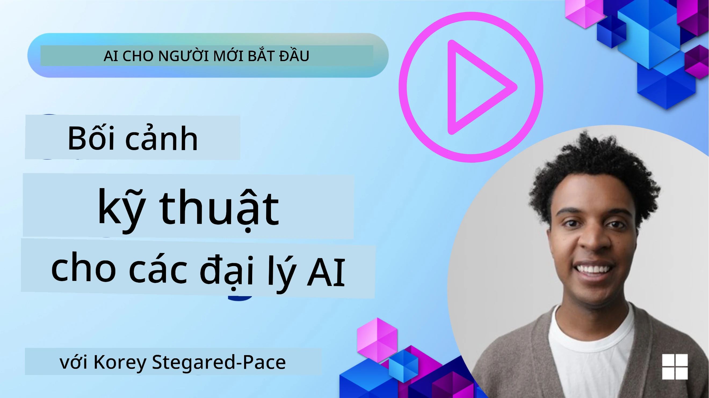
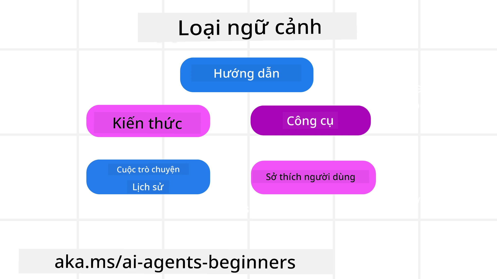
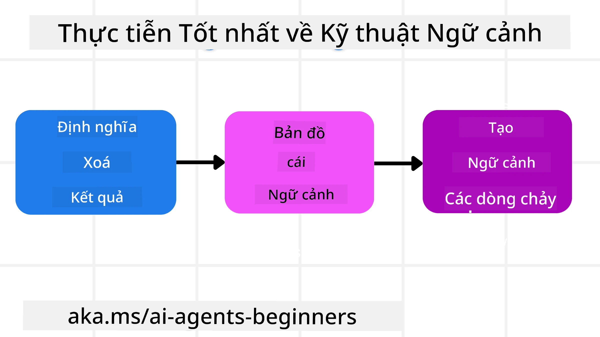

# Kỹ Thuật Ngữ Cảnh cho Tác Nhân AI

> _(Nhấn vào hình ảnh trên để xem video bài học này)_

Hiểu được độ phức tạp của ứng dụng mà bạn đang xây dựng một tác nhân AI là rất quan trọng để tạo nên một tác nhân đáng tin cậy. Chúng ta cần xây dựng Tác Nhân AI quản lý thông tin hiệu quả để giải quyết các nhu cầu phức tạp vượt xa kỹ thuật hướng dẫn.

Trong bài học này, chúng ta sẽ tìm hiểu kỹ thuật ngữ cảnh là gì và vai trò của nó trong việc xây dựng các tác nhân AI.

## Giới Thiệu

Bài học này sẽ đề cập đến:

• **Kỹ Thuật Ngữ Cảnh là gì** và tại sao nó khác với kỹ thuật hướng dẫn.

• **Chiến lược cho Kỹ Thuật Ngữ Cảnh hiệu quả**, bao gồm cách viết, chọn lọc, nén, và cô lập thông tin.

• **Các Lỗi Ngữ Cảnh Phổ Biến** có thể phá vỡ tác nhân AI của bạn và cách khắc phục chúng.

## Mục Tiêu Học Tập

Sau khi hoàn thành bài học này, bạn sẽ hiểu cách:

• **Định nghĩa kỹ thuật ngữ cảnh** và phân biệt nó với kỹ thuật hướng dẫn.

• **Nhận diện các thành phần chính của ngữ cảnh** trong các ứng dụng Mô Hình Ngôn Ngữ Lớn (LLM).

• **Áp dụng các chiến lược viết, chọn lọc, nén, và cô lập ngữ cảnh** để cải thiện hiệu suất tác nhân.

• **Nhận biết các lỗi ngữ cảnh phổ biến** như nhiễm độc, phân tâm, nhầm lẫn, và xung đột, đồng thời thực hiện các biện pháp giảm thiểu.

## Kỹ Thuật Ngữ Cảnh là gì?

Với Tác Nhân AI, ngữ cảnh là thứ thúc đẩy kế hoạch hành động của tác nhân AI để thực hiện các bước nhất định. Kỹ thuật ngữ cảnh là thực hành đảm bảo tác nhân AI có thông tin đúng để hoàn thành bước tiếp theo của nhiệm vụ. Cửa sổ ngữ cảnh có kích thước giới hạn, vì vậy với vai trò người xây dựng tác nhân, chúng ta cần xây dựng hệ thống và quy trình để quản lý việc thêm, loại bỏ và cô đọng thông tin trong cửa sổ ngữ cảnh.

### Kỹ Thuật Hướng Dẫn và Kỹ Thuật Ngữ Cảnh

Kỹ thuật hướng dẫn tập trung vào một bộ hướng dẫn tĩnh duy nhất để điều khiển hiệu quả tác nhân AI bằng một bộ quy tắc. Kỹ thuật ngữ cảnh là cách quản lý một tập thông tin động, bao gồm hướng dẫn ban đầu, để đảm bảo tác nhân AI có những gì cần theo thời gian. Ý tưởng chính của kỹ thuật ngữ cảnh là làm cho quá trình này có thể lặp lại và đáng tin cậy.

### Các Loại Ngữ Cảnh

Điều quan trọng là phải nhớ rằng ngữ cảnh không chỉ là một thứ duy nhất. Thông tin mà tác nhân AI cần có thể đến từ nhiều nguồn khác nhau và trách nhiệm của chúng ta là đảm bảo tác nhân có quyền truy cập vào các nguồn này:

Các loại ngữ cảnh mà tác nhân AI có thể cần quản lý bao gồm:

• **Hướng dẫn:** Đây giống như "quy tắc" của tác nhân – các prompt, tin nhắn hệ thống, ví dụ vài mẫu (cho AI biết cách làm gì), và mô tả công cụ mà nó có thể sử dụng. Đây là điểm giao thoa giữa kỹ thuật hướng dẫn và kỹ thuật ngữ cảnh.

• **Kiến Thức:** Bao gồm các sự kiện, thông tin truy xuất từ cơ sở dữ liệu, hoặc ký ức dài hạn mà tác nhân đã tích lũy. Điều này có thể bao gồm tích hợp hệ thống Retrieval Augmented Generation (RAG) nếu tác nhân cần truy cập các kho kiến thức và cơ sở dữ liệu khác nhau.

• **Công Cụ:** Là các định nghĩa về các hàm ngoài, API và MCP Server mà tác nhân có thể gọi, cùng với phản hồi (kết quả) mà nó nhận được khi sử dụng chúng.

• **Lịch Sử Hội Thoại:** Cuộc đối thoại đang diễn ra với người dùng. Khi thời gian trôi qua, các cuộc hội thoại trở nên dài hơn và phức tạp hơn, chiếm không gian trong cửa sổ ngữ cảnh.

• **Ưu Tiên Người Dùng:** Thông tin thu thập được về sở thích hoặc không thích theo thời gian. Những thông tin này có thể được lưu trữ và sử dụng khi đưa ra các quyết định quan trọng để hỗ trợ người dùng.

## Chiến Lược cho Kỹ Thuật Ngữ Cảnh Hiệu Quả

### Chiến Lược Lập Kế Hoạch

Kỹ thuật ngữ cảnh tốt bắt đầu từ lập kế hoạch tốt. Đây là một phương pháp giúp bạn bắt đầu suy nghĩ về cách áp dụng khái niệm kỹ thuật ngữ cảnh:

1. **Xác Định Kết Quả Rõ Ràng** - Kết quả của các nhiệm vụ mà Tác Nhân AI sẽ được giao nên được định nghĩa rõ ràng. Trả lời câu hỏi - "Thế giới sẽ như thế nào khi tác nhân AI hoàn thành nhiệm vụ?" Nói cách khác, thay đổi, thông tin hoặc phản hồi gì người dùng nên nhận được sau khi tương tác với tác nhân AI.
2. **Vẽ Bản Đồ Ngữ Cảnh** - Khi bạn đã xác định kết quả của tác nhân AI, bạn cần trả lời câu hỏi "Tác nhân AI cần những thông tin gì để hoàn thành nhiệm vụ này?". Bằng cách này bạn có thể bắt đầu vẽ bản đồ ngữ cảnh, chỉ ra vị trí của các nguồn thông tin đó.
3. **Tạo Đường Ống Ngữ Cảnh** - Khi đã biết thông tin nằm ở đâu, bạn cần trả lời câu hỏi "Tác nhân sẽ lấy thông tin này bằng cách nào?". Điều này có thể được thực hiện bằng nhiều cách khác nhau bao gồm RAG, sử dụng MCP server và các công cụ khác.

### Chiến Lược Thực Tiễn

Lập kế hoạch rất quan trọng nhưng khi thông tin bắt đầu đổ vào cửa sổ ngữ cảnh của tác nhân, chúng ta cần các chiến lược thực tiễn để quản lý nó:

#### Quản Lý Ngữ Cảnh

Trong khi một số thông tin sẽ được thêm vào cửa sổ ngữ cảnh tự động, kỹ thuật ngữ cảnh là việc chủ động hơn với thông tin này, có thể thực hiện bằng vài chiến lược:

 1. **Bảng Ghi Chép của Tác Nhân**  
 Cho phép tác nhân AI ghi lại các thông tin liên quan về nhiệm vụ hiện tại và tương tác với người dùng trong một phiên làm việc duy nhất. Bảng ghi chép này nên tồn tại bên ngoài cửa sổ ngữ cảnh trong một file hoặc đối tượng runtime mà tác nhân có thể truy xuất khi cần trong phiên này.

 2. **Ký Ức**  
 Bảng ghi chép tốt để quản lý thông tin bên ngoài cửa sổ ngữ cảnh trong một phiên. Ký ức cho phép tác nhân lưu trữ và truy lại thông tin liên quan qua nhiều phiên làm việc. Điều này có thể bao gồm bản tóm tắt, ưu tiên người dùng và phản hồi để cải thiện trong tương lai.

 3. **Nén Ngữ Cảnh**  
 Khi cửa sổ ngữ cảnh phát triển và gần đạt giới hạn, các kỹ thuật như tóm tắt và cắt bớt có thể được sử dụng. Điều này gồm giữ lại chỉ những thông tin liên quan nhất hoặc loại bỏ các tin nhắn cũ hơn.

 4. **Hệ Thống Đa Tác Nhân**  
 Phát triển hệ thống đa tác nhân là một dạng kỹ thuật ngữ cảnh bởi mỗi tác nhân có cửa sổ ngữ cảnh riêng. Cách chia sẻ và truyền ngữ cảnh đến các tác nhân khác nhau là điều cần lên kế hoạch khi xây dựng hệ thống này.

 5. **Môi Trường Sandbox**  
 Nếu tác nhân cần chạy một số đoạn mã hoặc xử lý lượng thông tin lớn trong tài liệu, điều này có thể dùng nhiều token để xử lý kết quả. Thay vì lưu hết trong cửa sổ ngữ cảnh, tác nhân có thể sử dụng môi trường sandbox để chạy mã và chỉ đọc kết quả cùng các thông tin liên quan.

 6. **Đối Tượng Trạng Thái Thời Gian Chạy**  
 Tạo các vùng chứa thông tin để quản lý các trường hợp tác nhân cần truy cập thông tin nhất định. Với nhiệm vụ phức tạp, điều này cho phép tác nhân lưu kết quả từng bước của các nhiệm vụ con, giữ ngữ cảnh chỉ kết nối với nhiệm vụ con cụ thể đó.

#### Kiểm Tra Ngữ Cảnh

Sau khi áp dụng một trong các chiến lược này, bạn nên kiểm tra xem lần gọi mô hình tiếp theo thực sự nhận được gì. Một câu hỏi hữu ích để gỡ lỗi là:

> Tác nhân có tải quá nhiều ngữ cảnh, ngữ cảnh sai hoặc thiếu ngữ cảnh cần thiết?

Bạn không cần ghi lại prompt gốc, kết quả công cụ, hoặc nội dung bộ nhớ để trả lời câu hỏi này. Trong môi trường sản xuất, nên ưu tiên ghi chép nhỏ về kiểm tra ngữ cảnh bằng cách ghi lại số lượng, id, hash, và nhãn chính sách:

- **Chọn lọc:** Theo dõi có bao nhiêu đoạn dữ liệu ứng viên, công cụ, hoặc ký ức được xem xét, bao nhiêu được chọn, và quy tắc hoặc điểm số nào khiến số còn lại bị lọc ra.
- **Nén:** Ghi lại phạm vi nguồn hoặc id dấu vết, id bản tóm tắt, ước tính số token trước và sau khi nén, và liệu nội dung gốc có bị loại khỏi lần gọi tiếp theo không.
- **Cô Lập:** Ghi chú tác vụ con nào chạy trong tác nhân, phiên hoặc sandbox riêng, bản tóm tắt giới hạn nào được trả về, và liệu kết quả công cụ lớn có giữ bên ngoài ngữ cảnh tác nhân chính không.
- **Ký Ức và RAG:** Lưu id tài liệu truy xuất, id ký ức, điểm số, id được chọn, và trạng thái xoá thay vì toàn bộ văn bản truy xuất.
- **An toàn và riêng tư:** Ưu tiên hash, id, token bucket, và nhãn chính sách thay vì văn bản hướng dẫn nhạy cảm, đối số công cụ, kết quả công cụ hoặc nội dung bộ nhớ người dùng.

Mục tiêu không phải là giữ nhiều ngữ cảnh hơn mà là để lại đủ bằng chứng để phát triển viên có thể biết chiến lược ngữ cảnh nào đã chạy và liệu nó có thay đổi lần gọi mô hình tiếp theo theo cách dự kiến hay không.

### Ví dụ về Kỹ Thuật Ngữ Cảnh

Ví dụ bạn muốn một tác nhân AI **"Đặt cho tôi một chuyến đi đến Paris."**

• Một tác nhân đơn giản chỉ dùng kỹ thuật hướng dẫn có thể chỉ trả lời: **"Được rồi, bạn muốn đi Paris vào lúc nào?"**. Nó chỉ xử lý câu hỏi trực tiếp của bạn tại thời điểm người dùng hỏi.

• Một tác nhân sử dụng các chiến lược kỹ thuật ngữ cảnh sẽ làm nhiều hơn thế. Trước khi phản hồi, hệ thống của nó có thể:

  ◦ **Kiểm tra lịch của bạn** cho các ngày khả dụng (truy xuất dữ liệu thời gian thực).

  ◦ **Gợi nhớ sở thích du lịch trước đây** (từ ký ức dài hạn) như hãng bay ưu tiên, ngân sách, hoặc bạn thích chuyến bay thẳng hay không.

  ◦ **Xác định các công cụ có sẵn** để đặt vé máy bay và khách sạn.

- Sau đó, phản hồi ví dụ có thể là: "Chào [Tên bạn]! Tôi thấy bạn rảnh tuần đầu tháng Mười. Tôi có nên tìm chuyến bay thẳng đến Paris trên hãng [Hãng Ưu Tiên] trong ngân sách thường của bạn [Ngân Sách] không?". Phản hồi phong phú, có nhận thức ngữ cảnh này thể hiện sức mạnh của kỹ thuật ngữ cảnh.

## Các Lỗi Ngữ Cảnh Phổ Biến

### Nhiễm Độc Ngữ Cảnh

**Là gì:** Khi một ảo giác (thông tin sai do LLM tạo ra) hoặc lỗi được đưa vào ngữ cảnh và được tham chiếu lặp đi lặp lại, khiến tác nhân theo đuổi các mục tiêu không thể hoặc phát triển các chiến lược vô nghĩa.

**Cần làm gì:** Thực hiện **xác thực ngữ cảnh** và **cách ly**. Xác thực thông tin trước khi thêm vào ký ức dài hạn. Nếu phát hiện nhiễm độc tiềm năng, bắt đầu luồng ngữ cảnh mới để ngăn chặn thông tin xấu lan rộng.

**Ví dụ Đặt Vé Du Lịch:** Tác nhân của bạn ảo giác một **chuyến bay thẳng từ sân bay nhỏ tại địa phương đến một thành phố quốc tế xa xôi** không thực sự có chuyến bay quốc tế. Chi tiết chuyến bay không tồn tại này được lưu trong ngữ cảnh. Sau đó, khi bạn yêu cầu đặt vé, tác nhân cứ cố tìm vé cho tuyến đường không thể này dẫn đến lỗi lặp lại.

**Giải pháp:** Thực hiện bước **xác thực sự tồn tại và tuyến bay với API thời gian thực** _trước khi_ thêm chi tiết chuyến bay vào ngữ cảnh làm việc của tác nhân. Nếu xác thực thất bại, thông tin sai sẽ bị "cách ly" và không dùng tiếp.

### Phân Tâm Ngữ Cảnh

**Là gì:** Khi ngữ cảnh trở nên quá lớn đến mức mô hình tập trung quá nhiều vào lịch sử tích lũy thay vì dùng những gì đã học trong quá trình huấn luyện, dẫn đến hành động lặp đi lặp lại hoặc không hữu ích. Mô hình có thể bắt đầu mắc lỗi ngay cả khi cửa sổ ngữ cảnh chưa đầy.

**Cần làm gì:** Sử dụng **tóm tắt ngữ cảnh**. Định kỳ nén thông tin tích lũy thành các bản tóm tắt ngắn hơn, giữ lại các chi tiết quan trọng và loại bỏ lịch sử dư thừa. Điều này giúp "đặt lại" sự tập trung.

**Ví dụ Đặt Vé Du Lịch:** Bạn đã thảo luận nhiều về các điểm đến mơ ước trong thời gian dài, kể cả việc tường thuật chi tiết về chuyến đi ba lô hai năm trước. Khi bạn cuối cùng yêu cầu **"tìm cho tôi chuyến bay giá rẻ tháng sau,"** tác nhân bị sa lầy trong các chi tiết cũ không liên quan và liên tục hỏi về hành lý ba lô hay lịch trình cũ, bỏ qua yêu cầu hiện tại.

**Giải pháp:** Sau một số lượt hoặc khi ngữ cảnh quá lớn, tác nhân nên **tóm tắt những phần gần đây và liên quan nhất của cuộc trò chuyện** – tập trung vào ngày đi và điểm đến hiện tại – và sử dụng bản tóm tắt này cho lần gọi LLM tiếp theo, loại bỏ phần trò chuyện lịch sử ít liên quan.

### Nhầm Lẫn Ngữ Cảnh

**Là gì:** Khi ngữ cảnh thừa thãi, thường là do nhiều công cụ có sẵn, khiến mô hình tạo ra câu trả lời sai hoặc gọi công cụ không liên quan. Mô hình nhỏ dễ mắc lỗi này hơn.

**Cần làm gì:** Thực hiện **quản lý tải công cụ** sử dụng kỹ thuật RAG. Lưu mô tả công cụ trong cơ sở dữ liệu vectơ và chọn _chỉ_ các công cụ phù hợp nhất cho từng nhiệm vụ cụ thể. Nghiên cứu cho thấy giới hạn dưới 30 công cụ.

**Ví dụ Đặt Vé Du Lịch:** Tác nhân của bạn có hàng chục công cụ: `book_flight`, `book_hotel`, `rent_car`, `find_tours`, `currency_converter`, `weather_forecast`, `restaurant_reservations`, v.v. Bạn hỏi, **"Cách tốt nhất để di chuyển quanh Paris là gì?"** Do số lượng công cụ quá lớn, tác nhân bị nhầm và cố gọi `book_flight` _trong_ Paris hoặc `rent_car` mặc dù bạn thích giao thông công cộng, vì mô tả công cụ có thể chồng chéo hoặc nó không thể phân biệt tốt nhất.

**Giải pháp:** Dùng **RAG trên mô tả công cụ**. Khi bạn hỏi về di chuyển ở Paris, hệ thống chỉ lấy _chỉ_ các công cụ liên quan như `rent_car` hoặc `public_transport_info` dựa trên truy vấn của bạn, trình bày một "bộ công cụ" tập trung cho LLM.

### Xung Đột Ngữ Cảnh

**Là gì:** Khi có thông tin xung đột tồn tại trong ngữ cảnh, dẫn đến lập luận không nhất quán hoặc kết quả cuối cùng kém. Điều này thường xảy ra khi thông tin đến theo giai đoạn và giả định sai ban đầu vẫn còn trong ngữ cảnh.

**Cần làm gì:** Sử dụng **cắt tỉa ngữ cảnh** và **đẩy ra ngoài**. Cắt tỉa nghĩa là loại bỏ thông tin lỗi thời hoặc xung đột khi có thông tin mới. Đẩy ra ngoài cho mô hình một không gian làm việc "bảng ghi chép" riêng để xử lý thông tin mà không làm lộn xộn ngữ cảnh chính.
**Ví dụ Đặt Chuyến Bay:** Ban đầu bạn nói với đại lý của mình, **"Tôi muốn bay hạng phổ thông."** Sau đó trong cuộc trò chuyện, bạn đổi ý và nói, **"Thật ra, cho chuyến đi này, hãy chọn hạng thương gia."** Nếu cả hai hướng dẫn vẫn còn trong ngữ cảnh, đại lý có thể nhận kết quả tìm kiếm mâu thuẫn hoặc bối rối về ưu tiên lựa chọn nào.

**Giải pháp:** Thực hiện **cắt tỉa ngữ cảnh**. Khi một hướng dẫn mới mâu thuẫn với hướng dẫn cũ, hướng dẫn cũ sẽ bị loại bỏ hoặc bị thay thế rõ ràng trong ngữ cảnh. Ngoài ra, đại lý có thể sử dụng một **bảng nháp** để hòa giải các ưu tiên mâu thuẫn trước khi quyết định, đảm bảo chỉ có hướng dẫn cuối cùng, nhất quán làm định hướng cho hành động của nó.

## Có Thêm Câu Hỏi Về Kỹ Thuật Ngữ Cảnh?

Tham gia [Microsoft Foundry Discord](https://aka.ms/ai-agents/discord) để gặp gỡ những người học khác, tham dự giờ làm việc và được giải đáp các câu hỏi về Đại lý AI.

---

<!-- CO-OP TRANSLATOR DISCLAIMER START -->
**Tuyên bố miễn trừ trách nhiệm**:
Tài liệu này đã được dịch bằng dịch vụ dịch thuật AI [Co-op Translator](https://github.com/Azure/co-op-translator). Mặc dù chúng tôi cố gắng đảm bảo độ chính xác, xin lưu ý rằng bản dịch tự động có thể chứa lỗi hoặc sai sót. Tài liệu gốc bằng ngôn ngữ gốc nên được coi là nguồn tin chính thức. Đối với thông tin quan trọng, nên sử dụng dịch vụ dịch thuật chuyên nghiệp bởi con người. Chúng tôi không chịu trách nhiệm về bất kỳ hiểu lầm hoặc giải thích sai nào phát sinh từ việc sử dụng bản dịch này.
<!-- CO-OP TRANSLATOR DISCLAIMER END -->