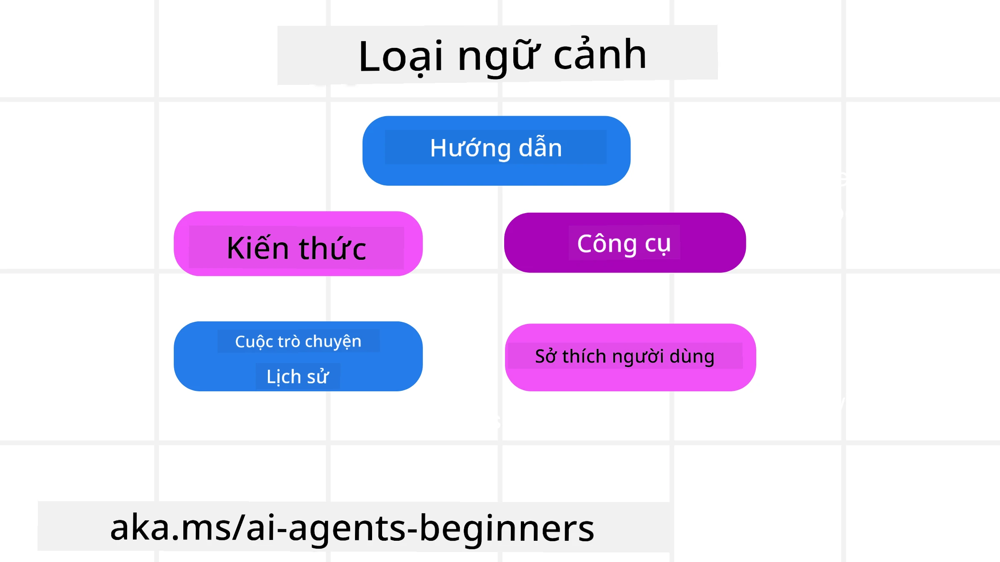
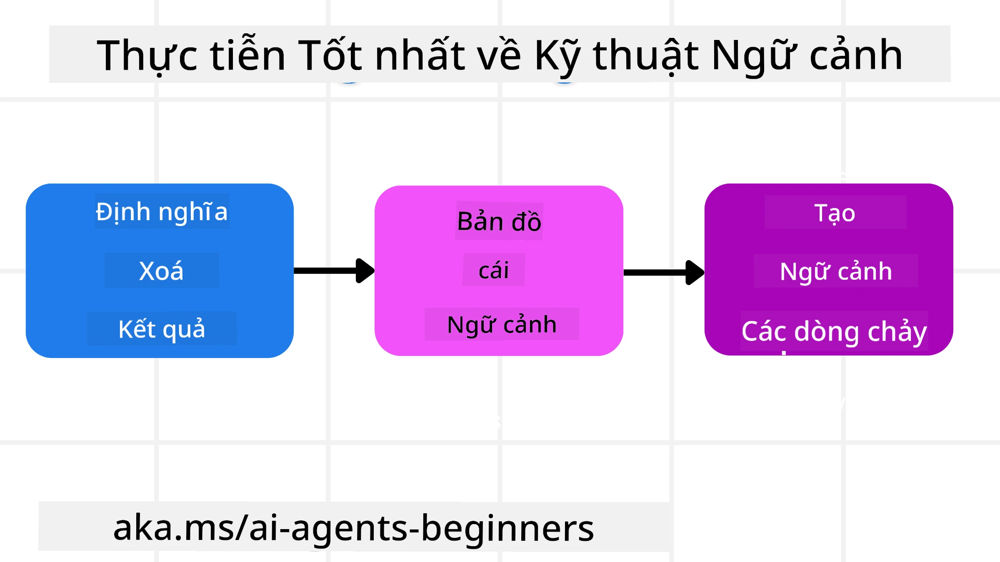

# Kỹ thuật Ngữ cảnh cho Đại lý AI

> _(Nhấp vào hình ảnh trên để xem video bài học này)_

Hiểu được sự phức tạp của ứng dụng mà bạn đang xây dựng đại lý AI cho là điều quan trọng để tạo ra một đại lý đáng tin cậy. Chúng ta cần xây dựng các Đại lý AI quản lý thông tin hiệu quả để đáp ứng các nhu cầu phức tạp vượt ra ngoài kỹ thuật prompt.

Trong bài học này, chúng ta sẽ tìm hiểu kỹ thuật ngữ cảnh là gì và vai trò của nó trong việc xây dựng các đại lý AI.

## Giới thiệu

Bài học này sẽ đề cập đến:

• **Kỹ thuật Ngữ cảnh là gì** và tại sao nó khác với kỹ thuật prompt.

• **Các chiến lược cho kỹ thuật Ngữ cảnh hiệu quả**, bao gồm cách viết, lựa chọn, nén và cô lập thông tin.

• **Các lỗi phổ biến về Ngữ cảnh** có thể làm trật đường ray đại lý AI của bạn và cách khắc phục chúng.

## Mục tiêu học tập

Sau khi hoàn thành bài học này, bạn sẽ hiểu cách:

• **Định nghĩa kỹ thuật ngữ cảnh** và phân biệt nó với kỹ thuật prompt.

• **Xác định các thành phần chính của ngữ cảnh** trong các ứng dụng Mô hình Ngôn ngữ Lớn (LLM).

• **Áp dụng các chiến lược để viết, lựa chọn, nén và cô lập ngữ cảnh** nhằm cải thiện hiệu suất của đại lý.

• **Nhận biết các lỗi phổ biến về ngữ cảnh** như nhiễm độc, xao nhãng, nhầm lẫn, và xung đột, cũng như thực hiện các kỹ thuật giảm thiểu.

## Kỹ thuật Ngữ cảnh là gì?

Với các Đại lý AI, ngữ cảnh là yếu tố thúc đẩy kế hoạch hành động của đại lý để thực hiện các bước cụ thể. Kỹ thuật Ngữ cảnh là thực hành đảm bảo đại lý AI có đúng thông tin để hoàn thành bước tiếp theo của nhiệm vụ. Cửa sổ ngữ cảnh có kích thước giới hạn, vì vậy với tư cách là những người xây dựng đại lý, chúng ta cần xây dựng hệ thống và quy trình để quản lý việc thêm, loại bỏ và cô đọng thông tin trong cửa sổ ngữ cảnh.

### Kỹ thuật Prompt so với Kỹ thuật Ngữ cảnh

Kỹ thuật prompt tập trung vào một bộ hướng dẫn tĩnh duy nhất để hướng dẫn đại lý AI hiệu quả với một tập hợp các quy tắc. Kỹ thuật ngữ cảnh là cách quản lý một tập hợp thông tin động, bao gồm prompt ban đầu, để đảm bảo đại lý AI có những gì cần thiết theo thời gian. Ý tưởng chính của kỹ thuật ngữ cảnh là làm cho quá trình này trở nên lặp lại và đáng tin cậy.

### Các loại Ngữ cảnh

Cần nhớ rằng ngữ cảnh không chỉ là một điều. Thông tin mà đại lý AI cần có thể đến từ nhiều nguồn khác nhau và chúng ta phải đảm bảo đại lý có quyền truy cập vào các nguồn này:

Các loại ngữ cảnh mà một đại lý AI có thể cần quản lý bao gồm:

• **Hướng dẫn:** Đây như là "quy tắc" của đại lý – các prompt, tin nhắn hệ thống, ví dụ ít-shot (cho thấy cách AI làm điều gì đó), và mô tả các công cụ mà nó có thể sử dụng. Đây là điểm kết hợp giữa kỹ thuật prompt và kỹ thuật ngữ cảnh.

• **Kiến thức:** Bao gồm các sự thật, thông tin lấy từ cơ sở dữ liệu, hoặc ký ức dài hạn mà đại lý tích lũy được. Bao gồm tích hợp hệ thống Retrieval Augmented Generation (RAG) nếu đại lý cần truy cập vào các kho kiến thức và cơ sở dữ liệu khác nhau.

• **Công cụ:** Đây là định nghĩa của các hàm bên ngoài, APIs và MCP Servers mà đại lý có thể gọi, cùng với phản hồi (kết quả) mà đại lý nhận được khi sử dụng chúng.

• **Lịch sử Hội thoại:** Cuộc đối thoại đang diễn ra với người dùng. Khi thời gian trôi qua, các cuộc trò chuyện này trở nên dài hơn và phức tạp hơn, đồng nghĩa với việc chiếm không gian trong cửa sổ ngữ cảnh.

• **Sở thích Người dùng:** Thông tin được học về những điều người dùng thích hoặc không thích theo thời gian. Những thông tin này có thể được lưu trữ và gọi ra khi đưa ra các quyết định quan trọng để giúp người dùng.

## Các Chiến lược cho Kỹ thuật Ngữ cảnh Hiệu quả

### Chiến lược Lập kế hoạch

Kỹ thuật ngữ cảnh tốt bắt đầu từ kế hoạch tốt. Dưới đây là một phương pháp giúp bạn bắt đầu suy nghĩ về cách áp dụng khái niệm kỹ thuật ngữ cảnh:

1. **Xác định Kết quả Rõ ràng** - Kết quả của các nhiệm vụ được giao cho Đại lý AI nên được định nghĩa rõ ràng. Trả lời câu hỏi - "Thế giới sẽ trông như thế nào khi Đại lý AI hoàn thành nhiệm vụ?" Nói cách khác, thay đổi, thông tin, hay phản hồi nào người dùng nên có sau khi tương tác với Đại lý AI.
2. **Lập bản đồ Ngữ cảnh** - Sau khi bạn xác định kết quả của Đại lý AI, bạn cần trả lời câu hỏi "Thông tin nào đại lý AI cần để hoàn thành nhiệm vụ này?". Cách này bạn có thể bắt đầu lập bản đồ ngữ cảnh về nơi thông tin có thể được tìm thấy.
3. **Tạo các dòng ngữ cảnh** - Khi bạn đã biết nơi thông tin nằm, bạn cần trả lời câu hỏi "Đại lý sẽ lấy thông tin này như thế nào?". Điều này có thể thực hiện theo nhiều cách bao gồm RAG, sử dụng các MCP server và các công cụ khác.

### Chiến lược Thực tiễn

Lập kế hoạch là quan trọng nhưng khi thông tin bắt đầu chảy vào cửa sổ ngữ cảnh của đại lý, chúng ta cần có các chiến lược thực tiễn để quản lý nó:

#### Quản lý Ngữ cảnh

Trong khi một số thông tin sẽ được thêm vào cửa sổ ngữ cảnh tự động, kỹ thuật ngữ cảnh là việc chủ động hơn trong việc quản lý thông tin này có thể được thực hiện bằng một vài chiến lược:

 1. **Sổ ghi chú của Đại lý**
 Điều này cho phép Đại lý AI ghi chú các thông tin liên quan đến các nhiệm vụ hiện tại và tương tác với người dùng trong một phiên làm việc. Nó nên tồn tại ngoài cửa sổ ngữ cảnh trong một file hoặc đối tượng runtime mà đại lý có thể truy xuất sau trong phiên làm việc đó nếu cần.

 2. **Ký ức**
 Sổ ghi chú thích hợp để quản lý thông tin bên ngoài cửa sổ ngữ cảnh trong một phiên duy nhất. Ký ức cho phép đại lý lưu trữ và truy xuất thông tin liên quan qua nhiều phiên làm việc. Điều này có thể bao gồm các bản tóm tắt, sở thích người dùng và phản hồi để cải tiến trong tương lai.

 3. **Nén Ngữ cảnh**
  Khi cửa sổ ngữ cảnh lớn lên và gần đạt giới hạn, các kỹ thuật như tóm tắt và cắt tỉa có thể được áp dụng. Điều này bao gồm giữ lại chỉ những thông tin quan trọng nhất hoặc loại bỏ những tin nhắn cũ hơn.
  
 4. **Hệ thống Đa Đại lý**
  Phát triển hệ thống đa đại lý là một hình thức kỹ thuật ngữ cảnh vì mỗi đại lý có cửa sổ ngữ cảnh riêng. Cách mà ngữ cảnh này được chia sẻ và truyền cho các đại lý khác nhau là điều cần lên kế hoạch khi xây dựng các hệ thống này.
  
 5. **Môi trường Sandbox**
  Nếu một đại lý cần chạy mã hoặc xử lý lượng lớn thông tin trong một tài liệu, việc này có thể tốn nhiều tokens để xử lý kết quả. Thay vì lưu trữ tất cả trong cửa sổ ngữ cảnh, đại lý có thể sử dụng môi trường sandbox để chạy mã và chỉ đọc kết quả cùng những thông tin liên quan.
  
 6. **Đối tượng Trạng thái Runtime**
   Việc này thực hiện bằng cách tạo các container thông tin để quản lý các tình huống khi Đại lý cần truy cập thông tin cụ thể. Với nhiệm vụ phức tạp, điều này cho phép đại lý lưu kết quả của từng bước phụ trong nhiệm vụ, giúp ngữ cảnh chỉ liên quan đến chính bước phụ đó.

#### Kiểm tra Ngữ cảnh

Sau khi áp dụng một trong các chiến lược này, bạn nên kiểm tra xem gọi mô hình tiếp theo thực sự nhận được gì. Một câu hỏi hữu ích để gỡ lỗi là:

> Đại lý đã tải quá nhiều ngữ cảnh, ngữ cảnh sai, hay thiếu ngữ cảnh cần thiết?

Bạn không cần phải ghi lại prompt thô, đầu ra công cụ, hoặc nội dung ký ức để trả lời câu hỏi đó. Trong sản xuất, ưu tiên các bản ghi kiểm tra ngữ cảnh nhỏ ghi nhận số lượng, id, hash và nhãn chính sách:

- **Lựa chọn:** Theo dõi có bao nhiêu mảnh thông tin ứng viên, công cụ, hoặc ký ức được xem xét, bao nhiêu được chọn, và quy tắc hoặc điểm số nào khiến những cái khác bị loại bỏ.
- **Nén:** Ghi lại phạm vi nguồn hoặc id truy vết, id bản tóm tắt, ước lượng số tokens trước và sau nén, và liệu nội dung thô có bị loại khỏi lần gọi kế tiếp hay không.
- **Cô lập:** Ghi chú tác vụ phụ nào chạy trong đại lý, phiên, hay sandbox riêng, bản tóm tắt giới hạn nào được trả về, và liệu kết quả công cụ lớn có giữ ngoài ngữ cảnh đại lý cha không.
- **Ký ức và RAG:** Lưu id tài liệu truy xuất, id ký ức, điểm số, id được chọn, và trạng thái chỉnh sửa thay vì đầy đủ văn bản truy xuất.
- **An toàn và riêng tư:** Ưu tiên hash, id, bucket token, và nhãn chính sách thay vì văn bản prompt nhạy cảm, tham số công cụ, kết quả công cụ, hoặc nội dung ký ức người dùng.

Mục tiêu không phải giữ nhiều ngữ cảnh hơn. Mà là để lại đủ bằng chứng để nhà phát triển có thể biết chiến lược ngữ cảnh nào đã chạy và liệu nó có thay đổi lần gọi mô hình tiếp theo theo cách dự kiến hay không.

### Ví dụ về Kỹ thuật Ngữ cảnh

Giả sử chúng ta muốn một đại lý AI **"Đặt cho tôi một chuyến đi đến Paris."**

• Một đại lý đơn giản chỉ sử dụng kỹ thuật prompt có thể chỉ phản hồi: **"Được rồi, bạn muốn đến Paris vào khi nào?"**. Nó chỉ xử lý câu hỏi trực tiếp của bạn tại thời điểm người dùng hỏi.

• Một đại lý sử dụng các chiến lược kỹ thuật ngữ cảnh đã đề cập sẽ làm nhiều hơn thế. Trước khi phản hồi, hệ thống của nó có thể:

  ◦ **Kiểm tra lịch của bạn** để tìm ngày khả dụng (truy xuất dữ liệu thời gian thực).

 ◦ **Ghi nhớ sở thích du lịch trước đây** (từ ký ức dài hạn) như hãng hàng không bạn thích, ngân sách, hoặc bạn có thích chuyến bay thẳng không.

 ◦ **Xác định các công cụ có sẵn** để đặt vé máy bay và khách sạn.

- Sau đó, một ví dụ phản hồi có thể là:  "Chào [Tên bạn]! Tôi thấy bạn rảnh tuần đầu tháng Mười. Tôi có nên tìm chuyến bay thẳng đến Paris trên [Hãng hàng không ưu tiên] trong ngân sách thường lệ của bạn là [Ngân sách] không?". Phản hồi giàu ngữ cảnh như vậy chứng minh sức mạnh của kỹ thuật ngữ cảnh.

## Các lỗi phổ biến về Ngữ cảnh

### Nhiễm độc Ngữ cảnh

**Là gì:** Khi một ảo giác (thông tin sai được sinh ra bởi LLM) hoặc lỗi xâm nhập vào ngữ cảnh và liên tục được tham chiếu, làm cho đại lý theo đuổi mục tiêu không thể hoặc phát triển chiến lược vô nghĩa.

**Phải làm gì:** Triển khai **xác thực ngữ cảnh** và **cách ly**. Xác thực thông tin trước khi thêm vào ký ức dài hạn. Nếu phát hiện nhiễm độc tiềm ẩn, bắt đầu các luồng ngữ cảnh mới để ngăn thông tin xấu lan rộng.

**Ví dụ Đặt chuyến đi:** Đại lý của bạn ảo giác một **chuyến bay thẳng từ sân bay nhỏ địa phương đến thành phố quốc tế xa xôi** mà thực sự không có chuyến quốc tế nào. Chi tiết chuyến bay không tồn tại này được lưu vào ngữ cảnh. Sau đó, khi bạn yêu cầu đại lý đặt vé, nó cứ cố tìm vé cho tuyến đường không thể này, dẫn đến lỗi lặp đi lặp lại.

**Giải pháp:** Thực hiện bước **xác thực sự tồn tại và tuyến bay với API thời gian thực** _trước khi_ thêm chi tiết chuyến bay vào ngữ cảnh làm việc của đại lý. Nếu xác thực thất bại, thông tin sai bị "cách ly" và không được dùng tiếp.

### Xao nhãng Ngữ cảnh

**Là gì:** Khi ngữ cảnh trở nên quá lớn khiến mô hình tập trung quá nhiều vào lịch sử tích lũy thay vì sử dụng những gì đã học trong huấn luyện, gây ra các hành động lặp lại hoặc không hữu ích. Mô hình có thể bắt đầu sai sót ngay trước khi cửa sổ ngữ cảnh đầy.

**Phải làm gì:** Sử dụng **tóm tắt ngữ cảnh**. Thường xuyên nén thông tin tích lũy thành các bản tóm tắt ngắn hơn, giữ lại chi tiết quan trọng và loại bỏ lịch sử dư thừa. Điều này giúp "đặt lại" trọng tâm.

**Ví dụ Đặt chuyến đi:** Bạn đã bàn luận về nhiều điểm đến trong mơ trong thời gian dài, kể cả kể chi tiết chuyến đi balo cách đây hai năm. Khi bạn cuối cùng yêu cầu **"tìm cho tôi chuyến bay rẻ cho tháng tới,"** đại lý bị sa đà vào những chi tiết cũ không liên quan và cứ hỏi về đồ balo hoặc lịch trình cũ, bỏ qua yêu cầu hiện tại của bạn.

**Giải pháp:** Sau một số lượt hoặc khi ngữ cảnh quá lớn, đại lý nên **tóm tắt những phần gần đây và liên quan nhất trong cuộc trò chuyện** – tập trung vào ngày đi và điểm đến hiện tại – và sử dụng bản tóm tắt này cho lần gọi LLM tiếp theo, loại bỏ phần trò chuyện lịch sử ít liên quan.

### Nhầm lẫn Ngữ cảnh

**Là gì:** Khi ngữ cảnh không cần thiết, thường là do có quá nhiều công cụ có sẵn, khiến mô hình tạo ra câu trả lời sai hoặc gọi các công cụ không liên quan. Mô hình nhỏ thường dễ bị như vậy.

**Phải làm gì:** Triển khai **quản lý tải công cụ** dùng kỹ thuật RAG. Lưu mô tả công cụ trong cơ sở dữ liệu vector và chỉ chọn công cụ liên quan nhất cho mỗi nhiệm vụ cụ thể. Nghiên cứu cho thấy giới hạn chọn công cụ dưới 30.

**Ví dụ Đặt chuyến đi:** Đại lý của bạn có quyền truy cập hàng chục công cụ: `book_flight`, `book_hotel`, `rent_car`, `find_tours`, `currency_converter`, `weather_forecast`, `restaurant_reservations`, v.v. Bạn hỏi, **"Cách tốt nhất để đi lại ở Paris là gì?"** Vì có quá nhiều công cụ, đại lý bị lẫn lộn và cố gọi `book_flight` _trong_ Paris, hoặc `rent_car` dù bạn thích phương tiện công cộng, vì mô tả công cụ có thể chồng chéo hoặc đại lý không phân biệt được công cụ tốt nhất.

**Giải pháp:** Sử dụng **RAG trên mô tả công cụ**. Khi bạn hỏi về cách đi lại ở Paris, hệ thống chỉ truy xuất các công cụ liên quan nhất như `rent_car` hoặc `public_transport_info` dựa trên truy vấn của bạn, giới thiệu bộ công cụ “loadout” tập trung cho LLM.

### Xung đột Ngữ cảnh

**Là gì:** Khi có thông tin mâu thuẫn trong ngữ cảnh, dẫn đến lập luận không nhất quán hoặc câu trả lời sai. Điều này thường xảy ra khi thông tin đến theo giai đoạn và các giả định sai ban đầu vẫn còn trong ngữ cảnh.

**Phải làm gì:** Sử dụng **cắt tỉa ngữ cảnh** và **chuyển tải**. Cắt tỉa có nghĩa là loại bỏ thông tin lỗi thời hoặc mâu thuẫn khi có chi tiết mới. Chuyển tải cho mô hình một không gian làm việc "scratchpad" riêng để xử lý thông tin mà không làm rối ngữ cảnh chính.

**Ví dụ Đặt Chuyến Đi:** Ban đầu bạn nói với đại lý, **"Tôi muốn bay hạng phổ thông."** Sau đó trong cuộc trò chuyện, bạn thay đổi ý định và nói, **"Thực ra, chuyến đi này, hãy đi hạng thương gia."** Nếu cả hai chỉ dẫn vẫn còn trong bối cảnh, đại lý có thể nhận được kết quả tìm kiếm mâu thuẫn hoặc bối rối không biết ưu tiên sở thích nào.

**Giải pháp:** Triển khai **cắt bớt bối cảnh**. Khi một chỉ dẫn mới mâu thuẫn với chỉ dẫn cũ, chỉ dẫn cũ sẽ được loại bỏ hoặc bị ghi đè rõ ràng trong bối cảnh. Ngoài ra, đại lý có thể sử dụng **bảng ghi chú tạm** để hòa giải các sở thích xung đột trước khi quyết định, đảm bảo chỉ có chỉ dẫn cuối cùng, nhất quán dẫn dắt hành động của nó.

## Còn Thắc Mắc Về Kỹ Thuật Bối Cảnh?

Tham gia [Microsoft Foundry Discord](https://discord.com/invite/ATgtXmAS5D) để gặp gỡ các học viên khác, tham dự giờ làm việc và nhận giải đáp các câu hỏi về Đại lý AI của bạn.

---

<!-- CO-OP TRANSLATOR DISCLAIMER START -->
**Tuyên bố miễn trừ trách nhiệm**:
Tài liệu này đã được dịch bằng dịch vụ dịch thuật AI [Co-op Translator](https://github.com/Azure/co-op-translator). Mặc dù chúng tôi cố gắng đảm bảo độ chính xác, xin lưu ý rằng bản dịch tự động có thể chứa lỗi hoặc sai sót. Tài liệu gốc bằng ngôn ngữ gốc nên được coi là nguồn tin chính thức. Đối với thông tin quan trọng, nên sử dụng dịch vụ dịch thuật chuyên nghiệp bởi con người. Chúng tôi không chịu trách nhiệm về bất kỳ hiểu lầm hoặc giải thích sai nào phát sinh từ việc sử dụng bản dịch này.
<!-- CO-OP TRANSLATOR DISCLAIMER END -->