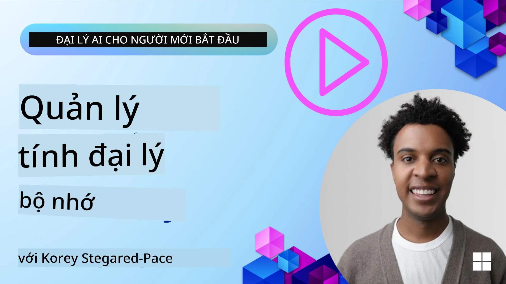

# Bộ nhớ cho tác nhân AI 

Khi thảo luận về các lợi ích độc đáo của việc tạo các tác nhân AI, thường có hai điều được nhắc đến chính: khả năng gọi công cụ để hoàn thành nhiệm vụ và khả năng cải thiện theo thời gian. Bộ nhớ là nền tảng để tạo ra tác nhân tự cải thiện có thể mang lại trải nghiệm tốt hơn cho người dùng của chúng ta.

Trong bài học này, chúng ta sẽ xem xét bộ nhớ là gì đối với tác nhân AI và cách chúng ta quản lý và sử dụng nó để mang lại lợi ích cho các ứng dụng của mình.

## Giới thiệu

Bài học này sẽ bao gồm:

• **Hiểu về Bộ nhớ của tác nhân AI**: Bộ nhớ là gì và tại sao nó quan trọng với các tác nhân.

• **Triển khai và Lưu trữ Bộ nhớ**: Các phương pháp thực tiễn để thêm khả năng bộ nhớ cho các tác nhân AI của bạn, tập trung vào bộ nhớ ngắn hạn và dài hạn.

• **Biến tác nhân AI thành tự cải thiện**: Cách bộ nhớ cho phép tác nhân học từ các tương tác trước và cải thiện theo thời gian.

## Các triển khai có sẵn

Bài học này bao gồm hai hướng dẫn sổ tay (notebook) toàn diện:

• **[13-agent-memory.ipynb](./13-agent-memory.ipynb)**: Triển khai bộ nhớ bằng Mem0 và Azure AI Search với Microsoft Agent Framework

• **[13-agent-memory-cognee.ipynb](./13-agent-memory-cognee.ipynb)**: Triển khai bộ nhớ có cấu trúc bằng Cognee, tự động xây dựng đồ thị tri thức dựa trên embeddings, trực quan hóa đồ thị và truy xuất thông minh

## Mục tiêu học tập

Sau khi hoàn thành bài học này, bạn sẽ biết cách:

• **Phân biệt giữa các loại bộ nhớ của tác nhân AI khác nhau**, bao gồm bộ nhớ làm việc, bộ nhớ ngắn hạn và bộ nhớ dài hạn, cũng như các hình thức chuyên biệt như persona và bộ nhớ theo tập (episodic memory).

• **Triển khai và quản lý bộ nhớ ngắn hạn và dài hạn cho tác nhân AI** sử dụng Microsoft Agent Framework, tận dụng các công cụ như Mem0, Cognee, Whiteboard memory, và tích hợp với Azure AI Search.

• **Hiểu các nguyên tắc đằng sau tác nhân AI tự cải thiện** và cách hệ thống quản lý bộ nhớ vững chắc góp phần vào việc học liên tục và thích ứng.

## Hiểu về Bộ nhớ của tác nhân AI

Về cốt lõi, **bộ nhớ cho tác nhân AI đề cập đến các cơ chế cho phép chúng lưu giữ và nhớ lại thông tin**. Thông tin này có thể là chi tiết cụ thể về một cuộc trò chuyện, sở thích của người dùng, các hành động đã thực hiện trước đó, hoặc thậm chí các mẫu đã học.

Nếu không có bộ nhớ, các ứng dụng AI thường là không trạng thái (stateless), có nghĩa là mỗi tương tác bắt đầu từ đầu. Điều này dẫn đến trải nghiệm người dùng lặp lại và gây khó chịu nơi tác nhân "quên" ngữ cảnh hoặc sở thích trước đó.

### Tại sao Bộ nhớ quan trọng?

trí thông minh của một tác nhân gắn chặt với khả năng nhớ lại và sử dụng thông tin quá khứ. Bộ nhớ cho phép tác nhân trở nên:

• **Soi xét (Reflective)**: Học từ các hành động và kết quả trong quá khứ.

• **Tương tác (Interactive)**: Duy trì ngữ cảnh trong một cuộc trò chuyện đang diễn ra.

• **Chủ động và Phản ứng (Proactive and Reactive)**: Dự đoán nhu cầu hoặc phản ứng phù hợp dựa trên dữ liệu lịch sử.

• **Tự chủ (Autonomous)**: Hoạt động độc lập hơn bằng cách tận dụng kiến thức đã lưu.

Mục tiêu của việc triển khai bộ nhớ là làm cho các tác nhân trở nên **đáng tin cậy và có năng lực hơn**.

### Các loại Bộ nhớ

#### Bộ nhớ làm việc

Hãy tưởng tượng điều này như một mảnh giấy nháp mà tác nhân sử dụng trong một nhiệm vụ hoặc quá trình suy nghĩ đang diễn ra. Nó giữ thông tin ngay lập tức cần thiết để tính bước tiếp theo.

Đối với tác nhân AI, bộ nhớ làm việc thường nắm bắt thông tin quan trọng nhất từ một cuộc trò chuyện, ngay cả khi toàn bộ lịch sử trò chuyện dài hoặc bị cắt bớt. Nó tập trung vào việc trích xuất các yếu tố chính như yêu cầu, đề xuất, quyết định và hành động.

**Ví dụ về Bộ nhớ làm việc**

Trong một tác nhân đặt vé du lịch, bộ nhớ làm việc có thể ghi lại yêu cầu hiện tại của người dùng, chẳng hạn như "Tôi muốn đặt một chuyến đi đến Paris". Yêu cầu cụ thể này được giữ trong ngữ cảnh ngay lập tức của tác nhân để hướng dẫn tương tác hiện tại.

#### Bộ nhớ ngắn hạn

Loại bộ nhớ này giữ thông tin trong suốt một cuộc trò chuyện hoặc phiên duy nhất. Nó là ngữ cảnh của cuộc trò chuyện hiện tại, cho phép tác nhân tham chiếu lại các lượt trước trong đối thoại.

**Ví dụ về Bộ nhớ ngắn hạn**

Nếu người dùng hỏi, "Một chuyến bay đến Paris sẽ tốn bao nhiêu?" và sau đó tiếp tục với "Còn chỗ ở ở đó thì sao?", bộ nhớ ngắn hạn đảm bảo tác nhân biết "ở đó" ám chỉ "Paris" trong cùng một cuộc trò chuyện.

#### Bộ nhớ dài hạn

Đây là thông tin tồn tại qua nhiều cuộc trò chuyện hoặc phiên. Nó cho phép tác nhân ghi nhớ sở thích người dùng, các tương tác lịch sử, hoặc kiến thức chung trong thời gian dài. Điều này quan trọng cho cá nhân hóa.

**Ví dụ về Bộ nhớ dài hạn**

Một bộ nhớ dài hạn có thể lưu rằng "Ben thích trượt tuyết và các hoạt động ngoài trời, thích cà phê với tầm nhìn núi, và muốn tránh các dốc trượt cao cấp do một chấn thương trong quá khứ". Thông tin này, học được từ các tương tác trước, ảnh hưởng đến các khuyến nghị trong các phiên lập kế hoạch du lịch sau này, khiến chúng trở nên rất cá nhân hóa.

#### Bộ nhớ Persona

Loại bộ nhớ chuyên biệt này giúp một tác nhân phát triển một "tính cách" hoặc "vai trò" nhất quán. Nó cho phép tác nhân ghi nhớ các chi tiết về bản thân hoặc vai trò dự định, làm cho các tương tác trôi chảy và phù hợp hơn.

**Ví dụ về Bộ nhớ Persona**
Nếu tác nhân du lịch được thiết kế để là một "chuyên gia lập kế hoạch trượt tuyết", bộ nhớ persona có thể củng cố vai trò này, ảnh hưởng đến cách đáp ứng để phù hợp với giọng điệu và kiến thức của một chuyên gia.

#### Bộ nhớ Quy trình/Tập sự (Workflow/Episodic Memory)

Bộ nhớ này lưu chuỗi các bước mà tác nhân thực hiện trong một nhiệm vụ phức tạp, bao gồm thành công và thất bại. Nó giống như nhớ các "tập" hoặc trải nghiệm trong quá khứ để học hỏi từ chúng.

**Ví dụ về Bộ nhớ Tập sự**

Nếu tác nhân đã cố gắng đặt một chuyến bay cụ thể nhưng thất bại do không có chỗ, bộ nhớ tập sự có thể ghi lại thất bại này, cho phép tác nhân thử các chuyến bay thay thế hoặc thông báo cho người dùng về vấn đề đó một cách hiểu biết hơn trong lần thử sau.

#### Bộ nhớ Thực thể

Điều này liên quan đến việc trích xuất và ghi nhớ các thực thể cụ thể (như con người, địa điểm hoặc vật thể) và sự kiện từ các cuộc trò chuyện. Nó cho phép tác nhân xây dựng một hiểu biết có cấu trúc về các yếu tố chính đã thảo luận.

**Ví dụ về Bộ nhớ Thực thể**

Từ một cuộc trò chuyện về một chuyến đi trước, tác nhân có thể trích xuất "Paris", "Eiffel Tower", và "bữa tối tại nhà hàng Le Chat Noir" như các thực thể. Trong một tương tác tương lai, tác nhân có thể nhớ "Le Chat Noir" và đề nghị đặt một bàn mới ở đó.

#### Structured RAG (Retrieval Augmented Generation)

Trong khi RAG là một kỹ thuật rộng hơn, "Structured RAG" được nhấn mạnh là một công nghệ bộ nhớ mạnh mẽ. Nó trích xuất thông tin cô đọng, có cấu trúc từ nhiều nguồn khác nhau (trò chuyện, email, hình ảnh) và sử dụng chúng để nâng cao độ chính xác, khả năng truy hồi và tốc độ trong các phản hồi. Khác với RAG cổ điển chỉ dựa trên sự tương đồng ngữ nghĩa, Structured RAG làm việc với cấu trúc vốn có của thông tin.

**Ví dụ về Structured RAG**

Thay vì chỉ khớp từ khóa, Structured RAG có thể phân tích chi tiết chuyến bay (điểm đến, ngày, giờ, hãng bay) từ một email và lưu trữ chúng theo cách có cấu trúc. Điều này cho phép các truy vấn chính xác như "Tôi đã đặt chuyến bay nào đến Paris vào thứ Ba?"

## Triển khai và Lưu trữ Bộ nhớ

Triển khai bộ nhớ cho tác nhân AI liên quan đến một quá trình có hệ thống của **quản lý bộ nhớ**, bao gồm tạo, lưu trữ, truy xuất, tích hợp, cập nhật và thậm chí "quên" (hoặc xóa) thông tin. Truy xuất là một khía cạnh đặc biệt quan trọng.

### Công cụ Bộ nhớ chuyên dụng

#### Mem0

Một cách để lưu trữ và quản lý bộ nhớ tác nhân là sử dụng các công cụ chuyên dụng như Mem0. Mem0 hoạt động như một lớp bộ nhớ bền vững, cho phép tác nhân nhớ lại các tương tác liên quan, lưu sở thích người dùng và bối cảnh thực tế, và học từ thành công và thất bại theo thời gian. Ý tưởng ở đây là các tác nhân không trạng thái biến thành có trạng thái.

Nó hoạt động thông qua một **đường dẫn bộ nhớ hai pha: trích xuất và cập nhật**. Đầu tiên, các tin nhắn thêm vào luồng của tác nhân được gửi đến dịch vụ Mem0, dịch vụ này sử dụng một Large Language Model (LLM) để tóm tắt lịch sử hội thoại và trích xuất các ký ức mới. Sau đó, một pha cập nhật do LLM điều khiển xác định xem có nên thêm, sửa đổi hay xóa các ký ức này, lưu chúng trong một kho dữ liệu lai có thể bao gồm cơ sở dữ liệu vector, đồ thị và khóa-giá trị. Hệ thống này cũng hỗ trợ nhiều loại bộ nhớ khác nhau và có thể tích hợp bộ nhớ đồ thị để quản lý mối quan hệ giữa các thực thể.

#### Cognee

Một cách tiếp cận mạnh mẽ khác là sử dụng **Cognee**, một bộ nhớ ngữ nghĩa mã nguồn mở cho tác nhân AI, chuyển đổi dữ liệu có cấu trúc và không có cấu trúc thành đồ thị tri thức có thể truy vấn được, được hỗ trợ bởi embeddings. Cognee cung cấp một **kiến trúc lưu trữ kép** kết hợp tìm kiếm tương đồng vector với mối quan hệ đồ thị, cho phép tác nhân hiểu không chỉ thông tin giống nhau mà còn cách các khái niệm liên quan tới nhau.

Nó xuất sắc ở **truy xuất lai** kết hợp tương đồng vector, cấu trúc đồ thị và suy luận LLM - từ tra cứu khối dữ liệu thô đến hỏi đáp có nhận thức đồ thị. Hệ thống duy trì **bộ nhớ sống** phát triển và lớn lên trong khi vẫn có thể truy vấn như một đồ thị kết nối duy nhất, hỗ trợ cả ngữ cảnh phiên ngắn hạn và bộ nhớ bền vững dài hạn.

Hướng dẫn notebook về Cognee ([13-agent-memory-cognee.ipynb](./13-agent-memory-cognee.ipynb)) trình bày cách xây dựng lớp bộ nhớ hợp nhất này, với các ví dụ thực tế về nạp các nguồn dữ liệu đa dạng, trực quan hóa đồ thị tri thức và truy vấn với các chiến lược tìm kiếm khác nhau được điều chỉnh cho nhu cầu cụ thể của tác nhân.

### Lưu trữ Bộ nhớ với RAG

Ngoài các công cụ bộ nhớ chuyên dụng như mem0 , bạn có thể tận dụng các dịch vụ tìm kiếm mạnh mẽ như **Azure AI Search như một backend để lưu trữ và truy xuất các ký ức**, đặc biệt cho Structured RAG.

Điều này cho phép bạn căn cứ phản hồi của tác nhân vào dữ liệu của riêng bạn, đảm bảo các câu trả lời phù hợp và chính xác hơn. Azure AI Search có thể được sử dụng để lưu trữ các ký ức du lịch cụ thể của người dùng, danh mục sản phẩm, hoặc bất kỳ kiến thức chuyên ngành nào khác.

Azure AI Search hỗ trợ các khả năng như **Structured RAG**, vốn xuất sắc trong việc trích xuất và truy xuất thông tin cô đọng, có cấu trúc từ các tập dữ liệu lớn như lịch sử cuộc trò chuyện, email, hoặc thậm chí hình ảnh. Điều này cung cấp "độ chính xác và khả năng truy hồi siêu phàm" so với các phương pháp chia khối văn bản và embedding truyền thống.

## Biến tác nhân AI trở thành tự cải thiện

Một mô hình phổ biến cho các tác nhân tự cải thiện liên quan đến việc giới thiệu một **"tác nhân tri thức" (knowledge agent)**. Tác nhân riêng biệt này quan sát cuộc trò chuyện chính giữa người dùng và tác nhân chính. Vai trò của nó là:

1. **Xác định thông tin có giá trị**: Xem phần nào của cuộc trò chuyện đáng lưu lại như kiến thức chung hoặc sở thích cụ thể của người dùng.

2. **Trích xuất và tóm tắt**: Chắt lọc kiến thức hoặc sở thích thiết yếu từ cuộc trò chuyện.

3. **Lưu vào cơ sở tri thức**: Lưu trữ thông tin đã trích xuất này, thường trong một cơ sở dữ liệu vector, để có thể truy xuất sau.

4. **Tăng cường các truy vấn trong tương lai**: Khi người dùng bắt đầu truy vấn mới, tác nhân tri thức truy xuất thông tin liên quan đã lưu và ghép nó vào prompt của người dùng, cung cấp ngữ cảnh quan trọng cho tác nhân chính (tương tự như RAG).

### Tối ưu hóa cho Bộ nhớ

• **Quản lý độ trễ (Latency Management)**: Để tránh làm chậm tương tác người dùng, một mô hình rẻ hơn, nhanh hơn có thể được sử dụng ban đầu để nhanh chóng kiểm tra xem thông tin có đáng lưu hoặc truy xuất hay không, chỉ khi cần thiết mới kích hoạt quá trình trích xuất/truy xuất phức tạp hơn.

• **Bảo trì Cơ sở tri thức**: Đối với một cơ sở tri thức ngày càng lớn, thông tin ít được sử dụng có thể được chuyển sang "lưu trữ lạnh" để quản lý chi phí.

## Còn thắc mắc về Bộ nhớ tác nhân?

Tham gia [Microsoft Foundry Discord](https://aka.ms/ai-agents/discord) để gặp gỡ những người học khác, tham dự giờ cố vấn và được trả lời các câu hỏi về Tác nhân AI của bạn.

---

<!-- CO-OP TRANSLATOR DISCLAIMER START -->
**Miễn trừ trách nhiệm**:
Tài liệu này đã được dịch bằng dịch vụ dịch thuật AI [Co-op Translator](https://github.com/Azure/co-op-translator). Mặc dù chúng tôi nỗ lực để đảm bảo tính chính xác, xin lưu ý rằng các bản dịch tự động có thể chứa lỗi hoặc không chính xác. Văn bản gốc bằng ngôn ngữ ban đầu nên được coi là nguồn tham chiếu có thẩm quyền. Đối với thông tin quan trọng, nên sử dụng dịch vụ dịch thuật chuyên nghiệp do người dịch thực hiện. Chúng tôi không chịu trách nhiệm về bất kỳ hiểu lầm hoặc diễn giải sai nào phát sinh từ việc sử dụng bản dịch này.
<!-- CO-OP TRANSLATOR DISCLAIMER END -->