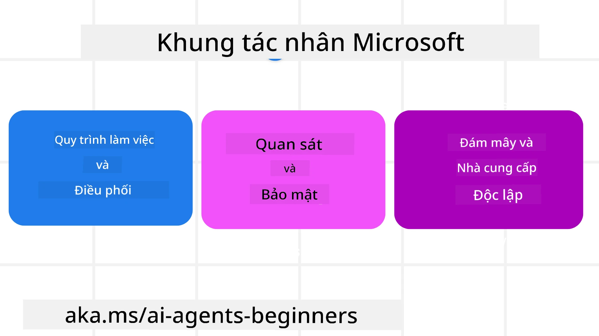
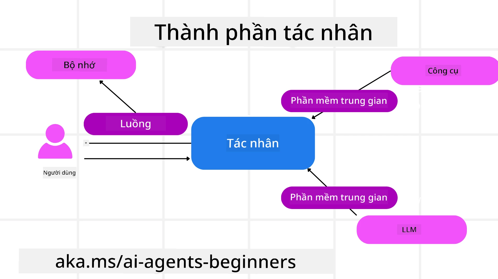

# Khám phá Microsoft Agent Framework


### Giới thiệu

Bài học này sẽ bao gồm:

- Hiểu về Microsoft Agent Framework: Các tính năng chính và giá trị  
- Khám phá các Khái niệm Chính của Microsoft Agent Framework
- Các Mẫu MAF Nâng cao: Quy trình công việc, Middleware và Bộ nhớ

## Mục tiêu học tập

Sau khi hoàn thành bài học này, bạn sẽ biết cách:

- Xây dựng các AI Agents sẵn sàng cho sản xuất sử dụng Microsoft Agent Framework
- Áp dụng các tính năng cốt lõi của Microsoft Agent Framework cho các trường hợp sử dụng Agentic của bạn
- Sử dụng các mẫu nâng cao bao gồm quy trình công việc, middleware và khả năng quan sát

## Mẫu mã 

Mẫu mã cho [Microsoft Agent Framework (MAF)](https://aka.ms/ai-agents-beginners/agent-framewrok) có thể tìm thấy trong kho lưu trữ này dưới các tệp `xx-python-agent-framework` và `xx-dotnet-agent-framework`.

## Hiểu về Microsoft Agent Framework



[Microsoft Agent Framework (MAF)](https://aka.ms/ai-agents-beginners/agent-framewrok) là khung công tác hợp nhất của Microsoft để xây dựng các AI agents. Nó cung cấp sự linh hoạt để giải quyết nhiều trường hợp sử dụng agentic đa dạng được thấy trong cả môi trường sản xuất và nghiên cứu bao gồm:

- **Điều phối Agent tuần tự** trong các kịch bản cần quy trình công việc từng bước.
- **Điều phối đồng thời** trong các kịch bản các agents cần hoàn thành tác vụ cùng lúc.
- **Điều phối chat nhóm** trong các kịch bản các agents có thể cộng tác cùng nhau trên một nhiệm vụ.
- **Điều phối chuyển giao** trong các kịch bản các agents chuyển giao nhiệm vụ cho nhau khi các nhiệm vụ con được hoàn thành.
- **Điều phối từ tính** trong các kịch bản một agent quản lý tạo và sửa đổi danh sách nhiệm vụ và xử lý phối hợp các subagents để hoàn thành nhiệm vụ.

Để triển khai AI Agents trong sản xuất, MAF còn bao gồm các tính năng cho:

- **Khả năng quan sát** thông qua việc sử dụng OpenTelemetry, nơi mọi hành động của AI Agent bao gồm gọi công cụ, các bước điều phối, luồng suy luận và theo dõi hiệu năng qua bảng điều khiển Microsoft Foundry.
- **Bảo mật** bằng cách lưu trữ agents trực tiếp trên Microsoft Foundry với các kiểm soát bảo mật như phân quyền dựa trên vai trò, xử lý dữ liệu riêng tư và bảo vệ nội dung tích hợp sẵn.
- **Độ bền** khi các luồng agent và quy trình công việc có thể tạm dừng, tiếp tục và phục hồi sau lỗi giúp quá trình chạy kéo dài hơn.
- **Kiểm soát** khi quy trình công việc có người tham gia được hỗ trợ, nơi các nhiệm vụ được đánh dấu yêu cầu phê duyệt con người.

Microsoft Agent Framework cũng hướng đến sự tương tác bằng cách:

- **Không phụ thuộc đám mây cụ thể** - Agents có thể chạy trên container, tại cơ sở hoặc trên nhiều đám mây khác nhau.
- **Không phụ thuộc nhà cung cấp** - Agents có thể được tạo qua SDK bạn ưa thích bao gồm Azure OpenAI và OpenAI
- **Tích hợp các Chuẩn mở** - Agents có thể sử dụng các giao thức như Agent-to-Agent (A2A) và Model Context Protocol (MCP) để phát hiện và sử dụng các agents và công cụ khác.
- **Plugin và Kết nối** - Có thể kết nối với các dịch vụ dữ liệu và bộ nhớ như Microsoft Fabric, SharePoint, Pinecone và Qdrant.

Hãy cùng xem cách các tính năng này được áp dụng vào một số khái niệm cốt lõi của Microsoft Agent Framework.

## Các khái niệm chính của Microsoft Agent Framework

### Agents



**Tạo Agents**

Việc tạo agent được thực hiện bằng cách định nghĩa dịch vụ suy diễn (Nhà cung cấp LLM), một bộ hướng dẫn cho AI Agent theo dõi, và một `name` được chỉ định:

```python
agent = AzureOpenAIChatClient(credential=AzureCliCredential()).create_agent( instructions="You are good at recommending trips to customers based on their preferences.", name="TripRecommender" )
```

Đoạn trên sử dụng `Azure OpenAI` nhưng agents có thể được tạo bằng nhiều dịch vụ khác nhau bao gồm `Microsoft Foundry Agent Service`:

```python
AzureAIAgentClient(async_credential=credential).create_agent( name="HelperAgent", instructions="You are a helpful assistant." ) as agent
```

OpenAI `Responses`, API `ChatCompletion`

```python
agent = OpenAIResponsesClient().create_agent( name="WeatherBot", instructions="You are a helpful weather assistant.", )
```

```python
agent = OpenAIChatClient().create_agent( name="HelpfulAssistant", instructions="You are a helpful assistant.", )
```

hoặc agents từ xa sử dụng giao thức A2A:

```python
agent = A2AAgent( name=agent_card.name, description=agent_card.description, agent_card=agent_card, url="https://your-a2a-agent-host" )
```

**Chạy Agents**

Agents được chạy bằng các phương thức `.run` hoặc `.run_stream` cho phản hồi không streaming hoặc streaming.

```python
result = await agent.run("What are good places to visit in Amsterdam?")
print(result.text)
```

```python
async for update in agent.run_stream("What are the good places to visit in Amsterdam?"):
    if update.text:
        print(update.text, end="", flush=True)

```

Mỗi lần chạy agent cũng có thể có các tuỳ chọn để tùy chỉnh các tham số như `max_tokens` mà agent sử dụng, `tools` mà agent có thể gọi, và thậm chí cả `model` mà agent sử dụng.

Điều này hữu ích trong các trường hợp cần model hoặc công cụ cụ thể để hoàn thành nhiệm vụ của người dùng.

**Công cụ**

Công cụ có thể được định nghĩa cả trong quá trình định nghĩa agent:

```python
def get_attractions( location: Annotated[str, Field(description="The location to get the top tourist attractions for")], ) -> str: """Get the top tourist attractions for a given location.""" return f"The top attractions for {location} are." 


# Khi tạo một ChatAgent trực tiếp

agent = ChatAgent( chat_client=OpenAIChatClient(), instructions="You are a helpful assistant", tools=[get_attractions]

```

và cũng khi chạy agent:

```python

result1 = await agent.run( "What's the best place to visit in Seattle?", tools=[get_attractions] # Công cụ chỉ cung cấp cho lần chạy này )
```

**Luồng Agent**

Luồng Agent được sử dụng để xử lý các cuộc hội thoại đa lượt. Luồng có thể được tạo bằng:

- Sử dụng `get_new_thread()` để lưu luồng theo thời gian
- Tạo luồng tự động khi chạy agent và luồng chỉ tồn tại trong phiên chạy hiện tại.

Để tạo một luồng, mã sẽ như sau:

```python
# Tạo một luồng mới.
thread = agent.get_new_thread() # Chạy tác nhân với luồng.
response = await agent.run("Hello, I am here to help you book travel. Where would you like to go?", thread=thread)

```

Sau đó bạn có thể tuần tự hóa luồng để lưu trữ sử dụng sau:

```python
# Tạo một luồng mới.
thread = agent.get_new_thread() 

# Chạy tác nhân với luồng.

response = await agent.run("Hello, how are you?", thread=thread) 

# Tuần tự hóa luồng để lưu trữ.

serialized_thread = await thread.serialize() 

# Giải tuần tự trạng thái luồng sau khi tải từ bộ nhớ.

resumed_thread = await agent.deserialize_thread(serialized_thread)
```

**Agent Middleware**

Agents tương tác với các công cụ và LLM để hoàn thành nhiệm vụ của người dùng. Trong một số kịch bản, chúng ta muốn thực thi hoặc theo dõi giữa các tương tác này. Middleware của agent cho phép làm điều này thông qua:

*Middleware chức năng*

Middleware này cho phép thực thi một hành động giữa agent và một hàm/công cụ mà nó sẽ gọi. Ví dụ khi bạn muốn ghi lại nhật ký về cuộc gọi hàm.

Trong mã bên dưới `next` định nghĩa liệu middleware tiếp theo hoặc hàm thực tế có được gọi.

```python
async def logging_function_middleware(
    context: FunctionInvocationContext,
    next: Callable[[FunctionInvocationContext], Awaitable[None]],
) -> None:
    """Function middleware that logs function execution."""
    # Tiền xử lý: Ghi lại trước khi thực thi chức năng
    print(f"[Function] Calling {context.function.name}")

    # Tiếp tục tới middleware tiếp theo hoặc thực thi chức năng
    await next(context)

    # Hậu xử lý: Ghi lại sau khi thực thi chức năng
    print(f"[Function] {context.function.name} completed")
```

*Middleware chat*

Middleware này cho phép thực thi hoặc ghi lại một hành động giữa agent và các yêu cầu giữa LLM.

Nó chứa thông tin quan trọng như `messages` đang được gửi đến dịch vụ AI.

```python
async def logging_chat_middleware(
    context: ChatContext,
    next: Callable[[ChatContext], Awaitable[None]],
) -> None:
    """Chat middleware that logs AI interactions."""
    # Tiền xử lý: Ghi nhật ký trước khi gọi AI
    print(f"[Chat] Sending {len(context.messages)} messages to AI")

    # Tiếp tục đến middleware hoặc dịch vụ AI tiếp theo
    await next(context)

    # Hậu xử lý: Ghi nhật ký sau phản hồi của AI
    print("[Chat] AI response received")

```

**Bộ nhớ Agent**

Như đã đề cập trong bài học `Agentic Memory`, bộ nhớ là yếu tố quan trọng để cho phép agent hoạt động theo nhiều ngữ cảnh khác nhau. MAF cung cấp nhiều loại bộ nhớ khác nhau:

*Bộ nhớ trong bộ nhớ*

Đây là bộ nhớ được lưu trong các luồng trong thời gian chạy ứng dụng.

```python
# Tạo một luồng mới.
thread = agent.get_new_thread() # Chạy agent với luồng đó.
response = await agent.run("Hello, I am here to help you book travel. Where would you like to go?", thread=thread)
```

*Tin nhắn bền vững*

Bộ nhớ này được sử dụng để lưu trữ lịch sử cuộc hội thoại qua các phiên khác nhau. Nó được định nghĩa bằng `chat_message_store_factory` :

```python
from agent_framework import ChatMessageStore

# Tạo một kho lưu trữ tin nhắn tùy chỉnh
def create_message_store():
    return ChatMessageStore()

agent = ChatAgent(
    chat_client=OpenAIChatClient(),
    instructions="You are a Travel assistant.",
    chat_message_store_factory=create_message_store
)

```

*Bộ nhớ động*

Bộ nhớ này được thêm vào ngữ cảnh trước khi các agents được chạy. Những bộ nhớ này có thể được lưu trữ trong các dịch vụ bên ngoài như mem0:

```python
from agent_framework.mem0 import Mem0Provider

# Sử dụng Mem0 cho các khả năng bộ nhớ nâng cao
memory_provider = Mem0Provider(
    api_key="your-mem0-api-key",
    user_id="user_123",
    application_id="my_app"
)

agent = ChatAgent(
    chat_client=OpenAIChatClient(),
    instructions="You are a helpful assistant with memory.",
    context_providers=memory_provider
)

```

**Khả năng quan sát của Agent**

Khả năng quan sát rất quan trọng để xây dựng hệ thống agentic đáng tin cậy và dễ bảo trì. MAF tích hợp với OpenTelemetry để cung cấp việc truy vết và đo lường cho việc quan sát tốt hơn.

```python
from agent_framework.observability import get_tracer, get_meter

tracer = get_tracer()
meter = get_meter()
with tracer.start_as_current_span("my_custom_span"):
    # làm gì đó
    pass
counter = meter.create_counter("my_custom_counter")
counter.add(1, {"key": "value"})
```

### Quy trình công việc

MAF cung cấp các quy trình công việc là các bước được định nghĩa trước để hoàn thành một nhiệm vụ và bao gồm các AI agents là thành phần trong những bước đó.

Quy trình công việc bao gồm các thành phần khác nhau cho phép kiểm soát luồng tốt hơn. Quy trình cũng cho phép **điều phối đa agent** và **điểm kiểm tra** để lưu trạng thái quy trình công việc.

Các thành phần cốt lõi của một quy trình công việc là:

**Bộ thực thi**

Bộ thực thi nhận các thông điệp đầu vào, thực hiện nhiệm vụ được giao và sau đó tạo ra một thông điệp đầu ra. Điều này giúp quy trình công việc tiến tới hoàn thành nhiệm vụ lớn hơn. Bộ thực thi có thể là agent AI hoặc logic tùy chỉnh.

**Cạnh**

Cạnh được sử dụng để định nghĩa luồng thông điệp trong một quy trình công việc. Chúng có thể là:

*Cạnh trực tiếp* - Kết nối một-một đơn giản giữa các bộ thực thi:

```python
from agent_framework import WorkflowBuilder

builder = WorkflowBuilder()
builder.add_edge(source_executor, target_executor)
builder.set_start_executor(source_executor)
workflow = builder.build()
```

*Cạnh điều kiện* - Kích hoạt sau khi điều kiện nhất định được đáp ứng. Ví dụ, khi các phòng khách sạn không có sẵn, một bộ thực thi có thể đề xuất các lựa chọn khác.

*Cạnh chuyển đổi trường hợp* - Định tuyến thông điệp đến các bộ thực thi khác nhau dựa trên điều kiện đã định nghĩa. Ví dụ, nếu khách du lịch có quyền ưu tiên và nhiệm vụ của họ sẽ được xử lý qua quy trình công việc khác.

*Cạnh phân tán* - Gửi một thông điệp đến nhiều đích.

*Cạnh hội tụ* - Thu thập nhiều thông điệp từ các bộ thực thi khác nhau và gửi đến một đích.

**Sự kiện**

Để cung cấp khả năng quan sát tốt hơn vào quy trình công việc, MAF cung cấp các sự kiện tích hợp cho việc thực thi bao gồm:

- `WorkflowStartedEvent`  - Bắt đầu thực thi quy trình công việc
- `WorkflowOutputEvent` - Quy trình công việc tạo ra đầu ra
- `WorkflowErrorEvent` - Quy trình công việc gặp lỗi
- `ExecutorInvokeEvent`  - Bộ thực thi bắt đầu xử lý
- `ExecutorCompleteEvent`  -  Bộ thực thi hoàn tất xử lý
- `RequestInfoEvent` - Một yêu cầu được thực hiện

## Mẫu MAF Nâng cao

Các phần trên đã bao gồm các khái niệm chính của Microsoft Agent Framework. Khi bạn xây dựng các agents phức tạp hơn, dưới đây là một số mẫu nâng cao để cân nhắc:

- **Middleware tổng hợp**: Xâu chuỗi nhiều bộ xử lý middleware (ghi nhật ký, xác thực, giới hạn tốc độ) sử dụng middleware chức năng và chat để kiểm soát hành vi agent một cách chi tiết.
- **Điểm kiểm tra quy trình công việc**: Sử dụng các sự kiện quy trình công việc và tuần tự hóa để lưu và tiếp tục các quá trình agent chạy lâu dài.
- **Lựa chọn công cụ động**: Kết hợp RAG dựa trên mô tả công cụ với đăng ký công cụ của MAF để chỉ trình bày các công cụ liên quan cho mỗi truy vấn.
- **Chuyển giao đa agent**: Sử dụng các cạnh quy trình và định tuyến có điều kiện để điều phối chuyển giao giữa các agents chuyên biệt.

## Mẫu mã 

Mẫu mã cho Microsoft Agent Framework có thể tìm thấy trong kho lưu trữ này dưới các tệp `xx-python-agent-framework` và `xx-dotnet-agent-framework`.

## Có câu hỏi thêm về Microsoft Agent Framework?

Tham gia [Microsoft Foundry Discord](https://aka.ms/ai-agents/discord) để gặp gỡ các học viên khác, tham dự giờ giải đáp và nhận trợ giúp cho các câu hỏi về AI Agents của bạn.

---

<!-- CO-OP TRANSLATOR DISCLAIMER START -->
**Tuyên bố từ chối trách nhiệm**:
Tài liệu này đã được dịch bằng dịch vụ dịch thuật AI [Co-op Translator](https://github.com/Azure/co-op-translator). Mặc dù chúng tôi cố gắng đảm bảo tính chính xác, xin lưu ý rằng bản dịch tự động có thể chứa lỗi hoặc sự không chính xác. Tài liệu gốc bằng ngôn ngữ gốc của nó nên được coi là nguồn tham khảo chính thức. Đối với những thông tin quan trọng, nên sử dụng dịch vụ dịch thuật chuyên nghiệp do con người thực hiện. Chúng tôi không chịu trách nhiệm về bất kỳ sự hiểu lầm hoặc giải thích sai nào phát sinh từ việc sử dụng bản dịch này.
<!-- CO-OP TRANSLATOR DISCLAIMER END -->