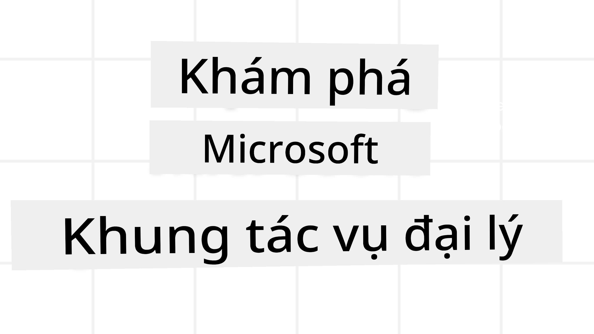
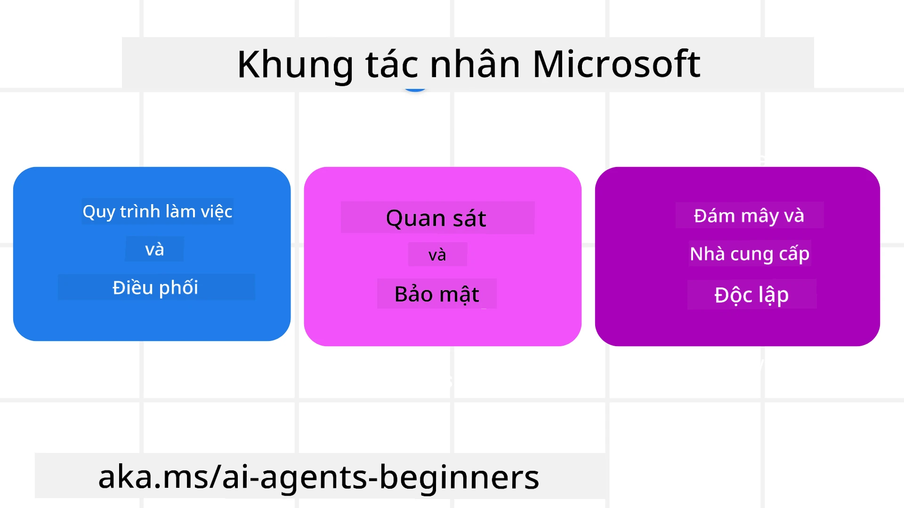
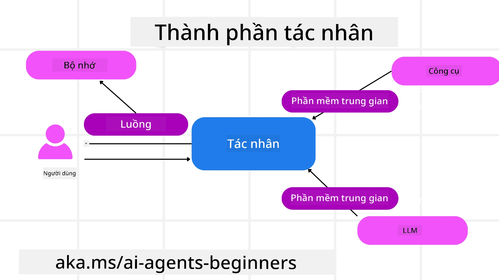

# Khám phá Microsoft Agent Framework



### Giới thiệu

Bài học này sẽ bao gồm:

- Hiểu về Microsoft Agent Framework: Các tính năng chính và giá trị  
- Khám phá các Khái niệm Chính của Microsoft Agent Framework
- Các Mẫu nâng cao của MAF: Quy trình công việc, Middleware, và Bộ nhớ

## Mục tiêu học tập

Sau khi hoàn thành bài học này, bạn sẽ biết cách:

- Xây dựng các AI Agents sẵn sàng sản xuất sử dụng Microsoft Agent Framework
- Áp dụng các tính năng cốt lõi của Microsoft Agent Framework cho các trường hợp sử dụng Agentic của bạn
- Sử dụng các mẫu nâng cao bao gồm quy trình công việc, middleware và khả năng quan sát

## Mẫu mã nguồn 

Mẫu mã dành cho [Microsoft Agent Framework (MAF)](https://aka.ms/ai-agents-beginners/agent-framework) có thể được tìm thấy trong kho lưu trữ này dưới các tệp `xx-python-agent-framework` và `xx-dotnet-agent-framework`.

## Hiểu về Microsoft Agent Framework



[Microsoft Agent Framework (MAF)](https://aka.ms/ai-agents-beginners/agent-framework) là khuôn khổ thống nhất của Microsoft để xây dựng các AI agent. Nó cung cấp sự linh hoạt để đáp ứng nhiều trường hợp sử dụng agentic đa dạng được thấy trong cả môi trường sản xuất và nghiên cứu bao gồm:

- **Điều phối Agent tuần tự** trong các kịch bản yêu cầu quy trình từng bước.
- **Điều phối đồng thời** trong các kịch bản yêu cầu các agent hoàn thành nhiệm vụ cùng lúc.
- **Điều phối nhóm chat** trong các kịch bản các agent có thể cộng tác cùng nhau trên một nhiệm vụ.
- **Điều phối chuyển giao** trong các kịch bản các agent chuyển giao nhiệm vụ cho nhau khi các nhiệm vụ con được hoàn thành.
- **Điều phối Định hướng** trong các kịch bản một agent quản lý tạo và chỉnh sửa danh sách nhiệm vụ và xử lý phối hợp các subagent hoàn thành nhiệm vụ.

Để cung cấp AI Agents trong môi trường sản xuất, MAF cũng bao gồm các tính năng cho:

- **Khả năng quan sát** thông qua việc sử dụng OpenTelemetry nơi mọi hành động của AI Agent bao gồm gọi công cụ, bước điều phối, luồng suy nghĩ và giám sát hiệu năng thông qua bảng điều khiển Microsoft Foundry.
- **Bảo mật** bằng cách lưu trữ các agent bản địa trên Microsoft Foundry với các kiểm soát bảo mật như truy cập dựa trên vai trò, xử lý dữ liệu riêng tư và an toàn nội dung tích hợp.
- **Độ bền** khi các luồng và quy trình của Agent có thể tạm dừng, tiếp tục và phục hồi từ lỗi cho phép các tiến trình chạy dài hơn.
- **Kiểm soát** khi các quy trình có con người can thiệp được hỗ trợ, nơi các nhiệm vụ được đánh dấu là yêu cầu sự chấp thuận của con người.

Microsoft Agent Framework còn tập trung vào khả năng tương tác bằng cách:

- **Không phụ thuộc đám mây** - Các agent có thể chạy trong container, on-prem và trên nhiều đám mây khác nhau.
- **Không phụ thuộc nhà cung cấp** - Các agent có thể được tạo bằng SDK bạn ưa thích bao gồm Azure OpenAI và OpenAI
- **Tích hợp tiêu chuẩn mở** - Các agent có thể sử dụng giao thức như Agent-to-Agent(A2A) và Model Context Protocol (MCP) để khám phá và sử dụng các agent và công cụ khác.
- **Plugin và Kết nối** - Các kết nối có thể được thiết lập tới dịch vụ dữ liệu và bộ nhớ như Microsoft Fabric, SharePoint, Pinecone và Qdrant.

Hãy cùng xem cách những tính năng này được áp dụng vào một số khái niệm cốt lõi của Microsoft Agent Framework.

## Các Khái niệm Chính của Microsoft Agent Framework

### Agents



**Tạo Agents**

Việc tạo agent được thực hiện bằng cách định nghĩa dịch vụ suy luận (Nhà cung cấp LLM), một
bộ hướng dẫn để AI Agent tuân theo, và một `name` được gán:

```python
agent = AzureOpenAIChatClient(credential=AzureCliCredential()).create_agent( instructions="You are good at recommending trips to customers based on their preferences.", name="TripRecommender" )
```

Đoạn trên sử dụng `Azure OpenAI` nhưng các agent có thể được tạo bằng nhiều dịch vụ khác nhau bao gồm `Microsoft Foundry Agent Service`:

```python
AzureAIAgentClient(async_credential=credential).create_agent( name="HelperAgent", instructions="You are a helpful assistant." ) as agent
```

Các API `Responses`, `ChatCompletion` của OpenAI

```python
agent = OpenAIResponsesClient().create_agent( name="WeatherBot", instructions="You are a helpful weather assistant.", )
```

```python
agent = OpenAIChatClient().create_agent( name="HelpfulAssistant", instructions="You are a helpful assistant.", )
```

hoặc [MiniMax](https://platform.minimaxi.com/), cung cấp API tương thích OpenAI với cửa sổ ngữ cảnh lớn (lên đến 204K token):

```python
agent = OpenAIChatClient(base_url="https://api.minimax.io/v1", api_key=os.environ["MINIMAX_API_KEY"], model_id="MiniMax-M3").create_agent( name="HelpfulAssistant", instructions="You are a helpful assistant.", )
```

hoặc các agent từ xa sử dụng giao thức A2A:

```python
agent = A2AAgent( name=agent_card.name, description=agent_card.description, agent_card=agent_card, url="https://your-a2a-agent-host" )
```

**Chạy Agents**

Agents được chạy bằng các phương thức `.run` hoặc `.run_stream` cho phản hồi không streaming hoặc streaming tương ứng.

```python
result = await agent.run("What are good places to visit in Amsterdam?")
print(result.text)
```

```python
async for update in agent.run_stream("What are the good places to visit in Amsterdam?"):
    if update.text:
        print(update.text, end="", flush=True)

```

Mỗi lần chạy agent cũng có thể có các tùy chọn để tùy chỉnh các tham số như `max_tokens` mà agent sử dụng, các `tools` mà agent có thể gọi, và thậm chí `model` dùng cho agent.

Điều này hữu ích trong những trường hợp yêu cầu các mô hình hoặc công cụ cụ thể để hoàn thành nhiệm vụ của người dùng.

**Công cụ**

Công cụ có thể được định nghĩa cả khi tạo agent:

```python
def get_attractions( location: Annotated[str, Field(description="The location to get the top tourist attractions for")], ) -> str: """Get the top tourist attractions for a given location.""" return f"The top attractions for {location} are." 


# Khi tạo một ChatAgent trực tiếp

agent = ChatAgent( chat_client=OpenAIChatClient(), instructions="You are a helpful assistant", tools=[get_attractions]

```

và cũng khi chạy agent:

```python

result1 = await agent.run( "What's the best place to visit in Seattle?", tools=[get_attractions] # Công cụ chỉ được cung cấp cho lần chạy này thôi )
```

**Luồng Agent**

Luồng Agent được dùng để xử lý các cuộc trò chuyện đa lượt. Luồng có thể được tạo bằng cách:

- Sử dụng `get_new_thread()` cho phép luồng được lưu lại theo thời gian
- Tạo luồng tự động khi chạy agent và luồng chỉ tồn tại trong quá trình chạy hiện tại.

Để tạo một luồng, đoạn mã như sau:

```python
# Tạo một luồng mới.
thread = agent.get_new_thread() # Chạy tác nhân với luồng đó.
response = await agent.run("Hello, I am here to help you book travel. Where would you like to go?", thread=thread)

```

Bạn có thể tuần tự hóa luồng để lưu trữ sử dụng sau:

```python
# Tạo một luồng mới.
thread = agent.get_new_thread() 

# Chạy tác nhân với luồng.

response = await agent.run("Hello, how are you?", thread=thread) 

# Tuần tự hóa luồng để lưu trữ.

serialized_thread = await thread.serialize() 

# Giải tuần tự trạng thái luồng sau khi tải từ bộ nhớ.

resumed_thread = await agent.deserialize_thread(serialized_thread)
```

**Middleware của Agent**

Agents tương tác với các công cụ và LLM để hoàn thành nhiệm vụ người dùng. Trong một số kịch bản, chúng ta muốn thực hiện hoặc theo dõi các tương tác trung gian. Middleware của agent cho phép điều này thông qua:

*Middleware Hàm*

Middleware này cho phép thực thi một hành động giữa agent và hàm/công cụ mà nó đang gọi. Một ví dụ khi sử dụng là khi bạn muốn ghi lại nhật ký cuộc gọi hàm.

Trong mã dưới đây `next` định nghĩa việc có gọi middleware tiếp theo hoặc hàm thực tế.

```python
async def logging_function_middleware(
    context: FunctionInvocationContext,
    next: Callable[[FunctionInvocationContext], Awaitable[None]],
) -> None:
    """Function middleware that logs function execution."""
    # Tiền xử lý: Ghi lại trước khi thực thi hàm
    print(f"[Function] Calling {context.function.name}")

    # Tiếp tục tới middleware kế tiếp hoặc thực thi hàm
    await next(context)

    # Hậu xử lý: Ghi lại sau khi thực thi hàm
    print(f"[Function] {context.function.name} completed")
```

*Middleware Chat*

Middleware này cho phép thực thi hoặc ghi lại hành động giữa agent và các yêu cầu gửi đến LLM.

Nó chứa thông tin quan trọng như các `messages` đang được gửi đến dịch vụ AI.

```python
async def logging_chat_middleware(
    context: ChatContext,
    next: Callable[[ChatContext], Awaitable[None]],
) -> None:
    """Chat middleware that logs AI interactions."""
    # Tiền xử lý: Ghi lại trước khi gọi AI
    print(f"[Chat] Sending {len(context.messages)} messages to AI")

    # Tiếp tục đến middleware hoặc dịch vụ AI tiếp theo
    await next(context)

    # Hậu xử lý: Ghi lại sau phản hồi của AI
    print("[Chat] AI response received")

```

**Bộ nhớ của Agent**

Như đã đề cập trong bài học `Agentic Memory`, bộ nhớ là yếu tố quan trọng cho phép agent hoạt động qua các ngữ cảnh khác nhau. MAF cung cấp nhiều loại bộ nhớ khác nhau:

*Bộ nhớ trong luồng*

Đây là bộ nhớ lưu trữ trong các luồng trong khi ứng dụng đang chạy.

```python
# Tạo một luồng mới.
thread = agent.get_new_thread() # Chạy tác nhân với luồng đó.
response = await agent.run("Hello, I am here to help you book travel. Where would you like to go?", thread=thread)
```

*Tin nhắn lưu trữ lâu dài*

Bộ nhớ này dùng để lưu lịch sử hội thoại qua các phiên khác nhau. Nó được định nghĩa sử dụng `chat_message_store_factory` :

```python
from agent_framework import ChatMessageStore

# Tạo một kho lưu trữ tin nhắn tùy chỉnh
def create_message_store():
    return ChatMessageStore()

agent = ChatAgent(
    chat_client=OpenAIChatClient(),
    instructions="You are a Travel assistant.",
    chat_message_store_factory=create_message_store
)

```

*Bộ nhớ động*

Bộ nhớ này được thêm vào ngữ cảnh trước khi các agent được chạy. Bộ nhớ này có thể được lưu trong các dịch vụ bên ngoài như mem0:

```python
from agent_framework.mem0 import Mem0Provider

# Sử dụng Mem0 cho các khả năng bộ nhớ nâng cao
memory_provider = Mem0Provider(
    api_key="your-mem0-api-key",
    user_id="user_123",
    application_id="my_app"
)

agent = ChatAgent(
    chat_client=OpenAIChatClient(),
    instructions="You are a helpful assistant with memory.",
    context_providers=memory_provider
)

```

**Khả năng quan sát của Agent**

Khả năng quan sát rất quan trọng để xây dựng các hệ thống agent đáng tin cậy và dễ bảo trì. MAF tích hợp với OpenTelemetry để cung cấp theo dõi và đo lường cho khả năng quan sát tốt hơn.

```python
from agent_framework.observability import get_tracer, get_meter

tracer = get_tracer()
meter = get_meter()
with tracer.start_as_current_span("my_custom_span"):
    # làm gì đó
    pass
counter = meter.create_counter("my_custom_counter")
counter.add(1, {"key": "value"})
```

### Quy trình công việc

MAF cung cấp các quy trình công việc là các bước đã được định nghĩa trước để hoàn thành một nhiệm vụ và bao gồm các agent AI như các thành phần trong các bước đó.

Quy trình công việc gồm các thành phần khác nhau cho phép kiểm soát luồng tốt hơn. Quy trình công việc cũng cho phép **điều phối đa agent** và **điểm kiểm tra** để lưu trạng thái quy trình công việc.

Các thành phần cốt lõi của một quy trình công việc là:

**Người thực thi**

Người thực thi nhận tin nhắn đầu vào, thực hiện nhiệm vụ được giao, và sau đó tạo ra tin nhắn đầu ra. Điều này đưa quy trình công việc tiến tới hoàn thành nhiệm vụ lớn hơn. Người thực thi có thể là agent AI hoặc logic tùy chỉnh.

**Cạnh nối**

Cạnh nối dùng để định nghĩa luồng tin nhắn trong quy trình công việc. Các cạnh này có thể là:

*Cạnh nối trực tiếp* - Kết nối đơn giản một-nhiều giữa các người thực thi:

```python
from agent_framework import WorkflowBuilder

builder = WorkflowBuilder()
builder.add_edge(source_executor, target_executor)
builder.set_start_executor(source_executor)
workflow = builder.build()
```

*Cạnh nối có điều kiện* - Kích hoạt sau khi điều kiện nhất định được đáp ứng. Ví dụ, khi phòng khách sạn không có sẵn, một người thực thi có thể gợi ý các lựa chọn khác.

*Cạnh nối chuyển mạch* - Định tuyến tin nhắn đến các người thực thi khác nhau dựa trên các điều kiện đã định nghĩa. Ví dụ, nếu khách hàng du lịch có quyền ưu tiên thì nhiệm vụ của họ sẽ được xử lý qua quy trình công việc khác.

*Cạnh nối phân nhánh ra* - Gửi một tin nhắn tới nhiều đích.

*Cạnh nối gom lại* - Thu thập nhiều tin nhắn từ các người thực thi khác nhau và gửi đến một đích.

**Sự kiện**

Để cung cấp khả năng quan sát tốt hơn vào quy trình công việc, MAF cung cấp các sự kiện tích hợp cho việc thực thi bao gồm:

- `WorkflowStartedEvent`  - Bắt đầu thực thi quy trình công việc
- `WorkflowOutputEvent` - Quy trình công việc tạo ra đầu ra
- `WorkflowErrorEvent` - Quy trình công việc gặp lỗi
- `ExecutorInvokeEvent`  - Người thực thi bắt đầu xử lý
- `ExecutorCompleteEvent`  -  Người thực thi hoàn thành xử lý
- `RequestInfoEvent` - Một yêu cầu được phát hành

## Các Mẫu nâng cao của MAF

Các phần trên trình bày các khái niệm chính của Microsoft Agent Framework. Khi bạn xây dựng các agent phức tạp hơn, dưới đây là một số mẫu nâng cao cần xem xét:

- **Tổ hợp Middleware**: Chuỗi nhiều middleware handler (ghi nhật ký, xác thực, giới hạn tần suất) sử dụng middleware chức năng và chat để kiểm soát hành vi của agent một cách chi tiết.
- **Điểm kiểm tra quy trình công việc**: Sử dụng sự kiện quy trình công việc và tuần tự hóa để lưu và tiếp tục các tiến trình agent chạy dài.
- **Chọn lựa công cụ động**: Kết hợp RAG dựa trên mô tả công cụ với đăng ký công cụ của MAF để chỉ đưa ra những công cụ liên quan cho từng truy vấn.
- **Chuyển giao đa agent**: Sử dụng các cạnh quy trình công việc và định tuyến có điều kiện để điều phối chuyển giao giữa các agent chuyên biệt.

## Lưu trữ LangChain / LangGraph Agents trên Microsoft Foundry

Microsoft Agent Framework là **khả năng tương tác khung làm việc** — bạn không bị giới hạn chỉ với các agent viết bằng MAF. Nếu bạn đã có agent xây dựng bằng **LangChain** hoặc **LangGraph**, bạn có thể chạy nó như một **agent được lưu trữ trên Microsoft Foundry** để Foundry quản lý runtime, phiên làm việc, quy mô, danh tính và các điểm cuối giao thức cho bạn, trong khi logic agent của bạn vẫn nằm trong LangGraph.

Điều này được thực hiện với gói `langchain_azure_ai.agents.hosting`, cho phép một đồ thị LangGraph đã biên dịch hoạt động trên cùng các giao thức mà các agent được lưu trữ của Foundry sử dụng.

**1. Cài đặt gói mở rộng hosting:**

```bash
pip install -U "langchain-azure-ai[hosting]>=1.2.4" azure-identity
```

Gói `hosting` cài đặt các thư viện giao thức Foundry: `azure-ai-agentserver-responses` (điểm cuối `/responses` tương thích OpenAI) và `azure-ai-agentserver-invocations` (điểm cuối `/invocations` chung).

**2. Chọn một giao thức hosting:**

| Giao thức | Lớp Host | Điểm cuối | Sử dụng khi |
|----------|-----------|----------|----------|
| **Responses** | `ResponsesHostServer` | `/responses` | Bạn muốn chat tương thích OpenAI, streaming, lịch sử phản hồi, và luồng hội thoại — mặc định được khuyến nghị cho các agent hội thoại. |
| **Invocations** | `InvocationsHostServer` | `/invocations` | Bạn cần hình dạng JSON tùy chỉnh, điểm cuối kiểu webhook, hoặc xử lý phi hội thoại. |

Bởi vì **Responses API là API chính để phát triển agent theo phong cách agent trong Foundry**, hãy bắt đầu với `ResponsesHostServer` cho hầu hết các agent.

**3. Cấu hình biến môi trường** (`az login` trước để `DefaultAzureCredential` có thể xác thực):

```bash
export FOUNDRY_PROJECT_ENDPOINT="https://<resource>.services.ai.azure.com/api/projects/<project>"
export FOUNDRY_MODEL_NAME="gpt-4.1"
```

Khi agent chạy sau này như một agent được lưu trữ trong Foundry, nền tảng sẽ tự động chèn `FOUNDRY_PROJECT_ENDPOINT`.

**4. Triển khai agent LangGraph qua giao thức Responses:**

```python
import os

from azure.ai.projects import AIProjectClient
from azure.identity import DefaultAzureCredential, get_bearer_token_provider
from langchain.agents import create_agent
from langchain_openai import ChatOpenAI
from langchain_azure_ai.agents.hosting import ResponsesHostServer

_AZURE_AI_SCOPE = "https://ai.azure.com/.default"


def build_chat_model() -> ChatOpenAI:
    project_endpoint = os.environ["FOUNDRY_PROJECT_ENDPOINT"].rstrip("/")
    deployment = os.environ.get("FOUNDRY_MODEL_NAME", "gpt-4.1")
    credential = DefaultAzureCredential()
    project = AIProjectClient(endpoint=project_endpoint, credential=credential)
    openai_client = project.get_openai_client()
    token_provider = get_bearer_token_provider(credential, _AZURE_AI_SCOPE)

    # ChatOpenAI ở đây nhắm vào điểm cuối tương thích OpenAI (Responses) của dự án Foundry.
    return ChatOpenAI(
        model=deployment,
        base_url=str(openai_client.base_url),
        api_key=token_provider,
    )


def main() -> None:
    graph = create_agent(build_chat_model(), tools=[])
    port = int(os.environ.get("PORT", "8088"))
    ResponsesHostServer(graph).run(port=port)


if __name__ == "__main__":
    main()
```

Chạy cục bộ với `python main.py`, sau đó gửi yêu cầu Responses tới `http://localhost:8088/responses`.

**Các hành vi chính:**

- **Hội thoại**: Khách hàng tiếp tục hội thoại bằng cách truyền `previous_response_id` hoặc ID `conversation`. Nếu đồ thị của bạn được biên dịch với một bộ kiểm tra LangGraph, Foundry sẽ khóa trạng thái hội thoại với điểm kiểm tra (sử dụng bộ kiểm tra bền vững trong sản xuất; `MemorySaver` phù hợp cho thử nghiệm cục bộ).
- **Con người trong vòng lặp**: Nếu đồ thị của bạn dùng `interrupt()` của LangGraph, `ResponsesHostServer` hé lộ sự gián đoạn đang chờ như một mục `function_call` / `mcp_approval_request` của Responses, và khách hàng tiếp tục với `function_call_output` / `mcp_approval_response` tương ứng.
- **Triển khai lên Foundry**: Sử dụng Azure Developer CLI — `azd ext install azure.ai.agents`, `azd ai agent init -m <manifest>`, `azd ai agent run` (cục bộ, yêu cầu Docker), sau đó `azd provision` và `azd deploy`. Triển khai agent được lưu trữ yêu cầu vai trò **Foundry Project Manager**.

Phiên bản chạy được của ví dụ này nằm trong [code-samples/14-langchain-hosted-agent.py](../../../14-microsoft-agent-framework/code-samples/14-langchain-hosted-agent.py). Để xem chi tiết hướng dẫn (giao thức Invocations, sơ đồ yêu cầu tùy chỉnh, và xử lý sự cố), xem [Host LangGraph agents as Foundry hosted agents](https://learn.microsoft.com/azure/foundry/how-to/develop/langchain-hosted-agents).

## Mẫu mã nguồn

Mẫu mã cho Microsoft Agent Framework có thể được tìm thấy trong kho lưu trữ này dưới các tệp `xx-python-agent-framework` và `xx-dotnet-agent-framework`.

## Còn thắc mắc gì về Microsoft Agent Framework?

Tham gia vào [Microsoft Foundry Discord](https://discord.com/invite/ATgtXmAS5D) để gặp gỡ các học viên khác, tham gia giờ làm việc và nhận giải đáp các thắc mắc về AI Agents của bạn.

---

<!-- CO-OP TRANSLATOR DISCLAIMER START -->
**Tuyên bố miễn trừ trách nhiệm**:
Tài liệu này đã được dịch bằng dịch vụ dịch thuật AI [Co-op Translator](https://github.com/Azure/co-op-translator). Mặc dù chúng tôi cố gắng đảm bảo độ chính xác, xin lưu ý rằng bản dịch tự động có thể chứa lỗi hoặc sai sót. Tài liệu gốc bằng ngôn ngữ gốc nên được coi là nguồn tin chính thức. Đối với thông tin quan trọng, nên sử dụng dịch vụ dịch thuật chuyên nghiệp bởi con người. Chúng tôi không chịu trách nhiệm về bất kỳ hiểu lầm hoặc giải thích sai nào phát sinh từ việc sử dụng bản dịch này.
<!-- CO-OP TRANSLATOR DISCLAIMER END -->