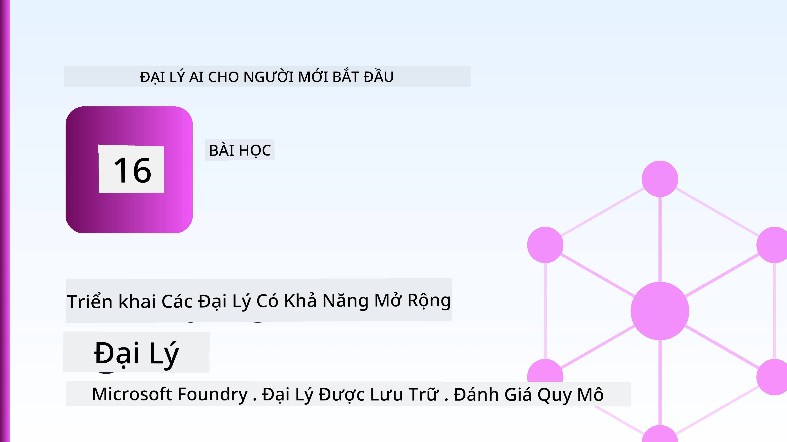
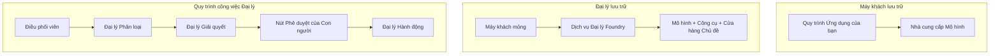
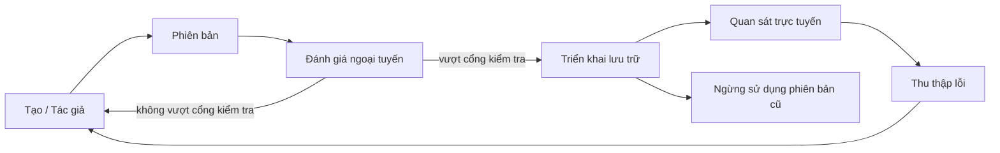
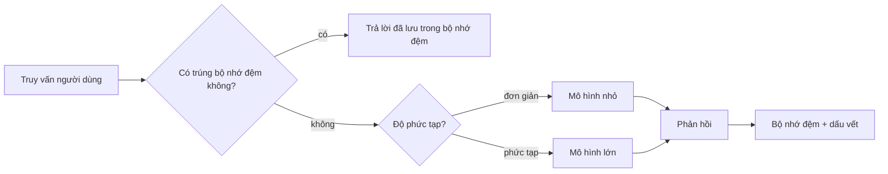
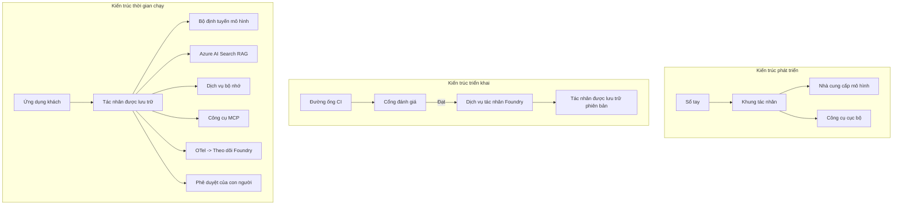

# Triển khai Đại lý Có thể Mở rộng với Microsoft Foundry



Cho đến thời điểm này trong khóa học, bạn đã xây dựng các đại lý chạy trên máy tính xách tay của bạn, trong một sổ tay, được điều khiển bởi `az login` và một vài biến môi trường. Đó chính xác là cách học đúng. Nhưng đó không phải là cách đúng để chạy một đại lý mà hàng nghìn khách hàng dựa vào lúc 3 giờ sáng.

Bài học này nói về khoảng cách giữa "nó hoạt động trên máy của tôi" và "nó hoạt động, đáng tin cậy và hợp túi tiền, trong sản xuất." Chúng ta sẽ thu hẹp khoảng cách đó bằng cách sử dụng **Microsoft Foundry** và **Dịch vụ Đại lý Microsoft Foundry**, và chúng ta làm điều đó bằng cách xây dựng một đại lý hỗ trợ khách hàng thực sự có công cụ, truy xuất, bộ nhớ, đánh giá và giám sát.

## Giới thiệu

Bài học này sẽ đề cập đến:

- Sự khác biệt giữa một **đại lý mẫu thử** và một **đại lý triển khai**, và tại sao sự chuyển đổi chủ yếu là về mọi thứ *xung quanh* mô hình.
- **Mẫu triển khai** cho các đại lý: lưu trữ phía khách hàng, lưu trữ dịch vụ (Đại lý được Lưu trữ), và điều phối luồng công việc.
- **Vòng đời đại lý** trên Microsoft Foundry — tạo, phiên bản hóa, triển khai, đánh giá, quan sát, nghỉ hưu.
- **Chiến lược mở rộng**: định tuyến mô hình, bộ đệm, đồng thời, và thiết kế không trạng thái.
- **Khả năng quan sát** với OpenTelemetry và truy vết Foundry.
- **Tối ưu chi phí** thông qua lựa chọn mô hình, định tuyến, và cổng đánh giá.
- **Các cân nhắc doanh nghiệp**: quản trị, phê duyệt con người, và chạy máy chủ MCP một cách an toàn trong sản xuất.

## Mục tiêu học tập

Sau khi hoàn thành bài học này, bạn sẽ biết cách:

- Chọn mẫu triển khai phù hợp cho khối lượng công việc của một đại lý cụ thể.
- Triển khai một đại lý lên Dịch vụ Đại lý Microsoft Foundry để nó được phiên bản hóa, quản trị và có thể quan sát.
- Đánh dấu một đại lý để truy vết và kết nối một pipeline đánh giá chạy trước mỗi lần phát hành.
- Áp dụng định tuyến mô hình và bộ đệm để giữ độ trễ và chi phí trong tầm kiểm soát khi mở rộng.
- Thêm cổng phê duyệt con người cho các hành động có rủi ro cao và tích hợp máy chủ MCP một cách an toàn trong sản xuất.

## Yêu cầu trước

Bài học này giả định bạn đã hoàn thành các bài học trước và thoải mái với:

- Xây dựng đại lý với [Microsoft Agent Framework](../14-microsoft-agent-framework/README.md) (Bài 14).
- [Sử dụng công cụ](../04-tool-use/README.md) (Bài 4) và [Agentic RAG](../05-agentic-rag/README.md) (Bài 5).
- [Bộ nhớ đại lý](../13-agent-memory/README.md) (Bài 13) và [Giao thức Agentic / MCP](../11-agentic-protocols/README.md) (Bài 11).
- [Khả năng quan sát và Đánh giá](../10-ai-agents-production/README.md) (Bài 10) — bài học này xây dựng trực tiếp trên nó.

Bạn cũng sẽ cần:

- Một **đăng ký Azure** và một **dự án Microsoft Foundry** với ít nhất một mô hình chat đã được triển khai.
- **Azure CLI** đã được xác thực (`az login`).
- Python 3.12+ và các gói trong kho lưu trữ [`requirements.txt`](../../../requirements.txt).

## Từ Mẫu thử đến Sản xuất: Điều Gì Thực Sự Thay Đổi

Một đại lý mẫu thử và một đại lý sản xuất chia sẻ cùng vòng lặp cốt lõi — suy luận, gọi công cụ, trả lời. Điều thay đổi là mọi thứ bao quanh vòng lặp đó. Mô hình có thể chiếm khoảng 20% của đại lý sản xuất; 80% còn lại là khung vận hành.

| Mối quan tâm | Mẫu thử | Sản xuất |
| --- | --- | --- |
| **Lưu trữ** | Chạy trong sổ tay của bạn | Chạy như dịch vụ được lưu trữ, có phiên bản và triển khai |
| **Danh tính** | Token `az login` của bạn | Danh tính được quản lý với RBAC được phân quyền |
| **Trạng thái** | Trong bộ nhớ, mất khi khởi động lại | Ngoại vi hóa (cửa hàng thread, dịch vụ bộ nhớ) |
| **Thất bại** | Bạn thấy traceback | Thử lại, dự phòng, thư chết, cảnh báo |
| **Chi phí** | "Chỉ vài xu" | Theo dõi mỗi yêu cầu, định tuyến, bộ đệm, ngân sách |
| **Chất lượng** | Bạn xem qua kết quả | Đánh giá tự động trước mỗi lần phát hành |
| **Niềm tin** | Bạn phê duyệt từng hành động | Chính sách + con người trong vòng lặp cho các hành động rủi ro |

Ghi nhớ bảng này. Mỗi phần bên dưới tương ứng với một trong các hàng này.

## Mẫu Triển khai Đại lý

Có ba mẫu bạn sẽ sử dụng, thường kết hợp với nhau.

### 1. Đại lý lưu trữ phía khách hàng

Đối tượng đại lý sống trong quá trình ứng dụng *của bạn*. Mã của bạn gọi trực tiếp nhà cung cấp mô hình; vòng lặp suy luận chạy trong dịch vụ của bạn. Đây là cách mà mọi bài học trước đã làm.

- **Sử dụng khi** bạn cần kiểm soát hoàn toàn vòng lặp, phần mềm trung gian tùy chỉnh, hoặc bạn nhúng đại lý vào backend hiện có.
- **Nhược điểm**: bạn tự quản lý mở rộng, trạng thái và khả năng phục hồi.

### 2. Đại lý được Lưu trữ (Dịch vụ Đại lý Foundry)

Đại lý được *đăng ký như một tài nguyên* trong Microsoft Foundry. Foundry lưu trữ vòng lặp suy luận, lưu trữ các thread, thực thi bảo đảm nội dung và RBAC, và làm cho đại lý hiển thị trong cổng Foundry. Ứng dụng của bạn trở thành một client nhẹ tạo các thread và đọc phản hồi.

- **Sử dụng khi** bạn muốn độ bền, khả năng quan sát tích hợp sẵn, quản trị, và diện tích hoạt động nhỏ hơn.
- **Nhược điểm**: ít kiểm soát cấp thấp hơn đổi lại một môi trường quản lý.

### 3. Luồng công việc đại lý

Nhiều đại lý (và công cụ) được cấu thành thành một đồ thị với luồng điều khiển rõ ràng — các bước tuần tự, phân nhánh, nút phê duyệt con người, và các điểm kiểm tra bền có thể tạm dừng và tiếp tục. Đây là khả năng **Luồng công việc** của Microsoft Agent Framework áp dụng ở quy mô triển khai.

- **Sử dụng khi** một nhiệm vụ duy nhất trải rộng qua nhiều đại lý chuyên môn hoặc yêu cầu bước phê duyệt ở giữa.
- **Nhược điểm**: nhiều phần di chuyển hơn; cần khả năng quan sát cấp điều phối.



## Vòng Đời Đại lý trên Microsoft Foundry

Triển khai một đại lý không chỉ là một lần `push`. Nó là một vòng lặp, và nó trông rất giống chu kỳ phát hành phần mềm vì đó chính xác là nó.



Ý chính, kéo dài từ [Bài 10](../10-ai-agents-production/README.md): **đánh giá ngoại tuyến là cổng, không phải suy nghĩ sau cùng.** Một phiên bản đại lý mới không được phát hành trừ khi vượt qua ngưỡng đánh giá của bạn. Khả năng quan sát trực tuyến sau đó trả lại các thất bại thực tế vào bộ kiểm tra ngoại tuyến của bạn. Đó là toàn bộ vòng lặp.

## Chiến lược mở rộng

Mở rộng một đại lý khác với mở rộng một API web không trạng thái, vì mỗi yêu cầu có thể kích hoạt nhiều lần gọi mô hình và công cụ tốn kém. Bốn kỹ thuật thực hiện hầu hết tải.

**Xử lý yêu cầu không trạng thái.** Không giữ trạng thái từng người dùng trong bộ nhớ quá trình. Lưu trữ các luồng hội thoại trong cửa hàng luồng Foundry hoặc dịch vụ bộ nhớ để bất kỳ phiên bản nào cũng có thể xử lý bất kỳ yêu cầu nào. Đây là cách bạn mở rộng theo chiều ngang — thêm phiên bản, không có phiên làm việc cố định.

**Định tuyến mô hình.** Không phải mọi yêu cầu đều cần mô hình mạnh nhất (và đắt nhất) của bạn. Định tuyến các yêu cầu đơn giản — phân loại ý định, câu trả lời ngắn về sự kiện — đến một mô hình nhỏ, nhanh, và dành mô hình lớn cho suy luận thực sự. **Model Router** của Foundry có thể làm điều này cho bạn, hoặc bạn có thể tự xây dựng một bộ phân loại nhẹ. Bạn sẽ xây bản DIY trong phòng lab.

**Bộ đệm phản hồi.** Nhiều câu hỏi hỗ trợ là gần như trùng lặp ("làm thế nào để đặt lại mật khẩu?"). Bộ đệm các câu trả lời cho các câu hỏi phổ biến và phục vụ chúng mà không cần gọi mô hình. Một tỷ lệ thành công bộ đệm dù khiêm tốn cũng làm giảm đáng kể chi phí và độ trễ.

**Đồng thời và áp lực ngược.** Các nhà cung cấp mô hình có giới hạn tốc độ. Giới hạn đồng thời, sử dụng thử lại với hồi lại lũy tiến, và thất bại một cách nhẹ nhàng (phản hồi "chúng tôi đang xử lý" trong hàng đợi tốt hơn lỗi 500).



## Khả năng Quan sát trong Sản xuất

Bạn không thể vận hành những gì bạn không thể thấy. Như đã đề cập trong Bài 10, Microsoft Agent Framework phát ra các dấu vết **OpenTelemetry** tự nhiên — mỗi lời gọi mô hình, gọi công cụ, và bước điều phối trở thành một span. Trong sản xuất, bạn xuất các span đó sang Microsoft Foundry (hoặc bất kỳ backend tương thích OTel nào) để bạn có thể:

- Theo dõi một khiếu nại khách hàng từ đầu đến cuối qua mọi lời gọi mô hình và công cụ.
- Xem độ trễ p50/p95 và chi phí mỗi yêu cầu theo thời gian.
- Cảnh báo khi tỉ lệ lỗi và bất thường chi phí tăng trước khi người dùng của bạn (hoặc bộ phận tài chính) nhận ra.

```python
from agent_framework.observability import get_tracer

tracer = get_tracer()

with tracer.start_as_current_span("support_request") as span:
    span.set_attribute("customer.tier", "enterprise")
    span.set_attribute("routed.model", "gpt-5-nano")
    # việc thực thi tác nhân được theo dõi tự động bên trong khoảng này
```

Các thuộc tính như `customer.tier` và `routed.model` là những gì biến hàng loạt dấu vết thành các câu hỏi có thể trả lời ("khách hàng doanh nghiệp có bị định tuyến đến mô hình nhỏ quá thường xuyên không?").

## Tối ưu Chi phí

Chi phí trong các đại lý sản xuất chủ yếu đến từ token. Ba đòn bẩy, theo thứ tự tác động:

1. **Chọn kích thước mô hình phù hợp.** Một mô hình nhỏ vượt cổng đánh giá của bạn thường rẻ hơn một mô hình lớn cũng vượt qua. Sử dụng đánh giá để *chứng minh* mô hình nhỏ đủ tốt thay vì mặc định dùng mô hình lớn nhất chỉ để cẩn thận.
2. **Định tuyến theo độ phức tạp.** Như trên — chỉ trả giá mô hình lớn cho các yêu cầu cần suy luận mô hình lớn.
3. **Bộ đệm mạnh mẽ.** Lời gọi mô hình rẻ nhất là cái bạn không bao giờ thực hiện.

Cổng đánh giá và kiểm soát chi phí là cùng một kỷ luật nhìn từ hai góc độ: đánh giá cho bạn *đáy chất lượng*, định tuyến và bộ đệm giữ bạn gần *chi phí* của đáy đó nhất có thể.

## Cân nhắc Triển khai Doanh nghiệp

**Quản trị.** Đại lý được Lưu trữ kế thừa RBAC, bảo đảm nội dung, và ghi nhật ký kiểm toán của Foundry. Đặt cho mỗi đại lý một danh tính được quản lý với quyền tối thiểu cần thiết — quyền đọc kiến thức, quyền truy cập có phạm vi vào API vé, không hơn.

**Con người trong vòng lặp.** Một số hành động quá hệ trọng để tự động hoàn toàn — hoàn tiền, xóa tài khoản, chuyển lên nhóm pháp lý. Microsoft Agent Framework hỗ trợ công cụ **cần phê duyệt**: đại lý đề xuất hành động, thực thi tạm dừng, con người phê duyệt hoặc từ chối, và luồng công việc tiếp tục. Bạn đã thấy nguyên mẫu trong [Bài 6](../06-building-trustworthy-agents/README.md); ở đây bạn triển khai nó.

**MCP trong sản xuất.** [MCP](../11-agentic-protocols/README.md) cho phép đại lý của bạn sử dụng công cụ bên ngoài qua giao diện chuẩn. Trong sản xuất, coi mỗi máy chủ MCP là biên giới không tin cậy: cố định phiên bản máy chủ, chạy với danh tính có phạm vi, xác thực kết quả đầu ra, và không bao giờ tiết lộ bí mật với nó. Máy chủ MCP là một phụ thuộc, và các phụ thuộc được vá, kiểm toán và giới hạn tỉ lệ.



Ba sơ đồ đó — phát triển, triển khai, chạy thời gian — là cùng một đại lý ở ba giai đoạn của đời. Phòng lab tiếp theo sẽ hướng dẫn bạn xây dựng nó.

## Phòng Lab Thực hành: Đại lý Hỗ trợ Khách hàng Sẵn sàng Sản xuất

Mở [`code_samples/16-python-agent-framework.ipynb`](./code_samples/16-python-agent-framework.ipynb) và làm việc qua toàn bộ. Bạn sẽ lắp ráp một **đại lý hỗ trợ khách hàng Contoso** với mọi mối quan tâm sản xuất được kết nối:

1. **Gọi công cụ** — tra cứu trạng thái đơn hàng và mở vé hỗ trợ.
2. **RAG** — trả lời các câu hỏi về chính sách từ cơ sở kiến thức (Azure AI Search, với một phương thức dự phòng trong bộ nhớ để sổ tay chạy mà không cần tài nguyên Search).
3. **Bộ nhớ** — nhớ khách hàng qua các lượt hội thoại.
4. **Định tuyến mô hình** — bộ phân loại độ phức tạp định tuyến mỗi yêu cầu đến mô hình nhỏ hoặc lớn.
5. **Bộ đệm phản hồi** — các câu hỏi lặp lại được phục vụ từ bộ đệm.
6. **Phê duyệt con người** — hoàn tiền trên ngưỡng tạm dừng chờ phê duyệt.
7. **Pipeline đánh giá** — một bộ kiểm tra ngoại tuyến nhỏ chấm điểm đại lý và làm cổng phát hành.
8. **Khả năng quan sát** — truy vết OpenTelemetry quanh mỗi yêu cầu.

### Hướng Dẫn Qua

Sổ tay được tổ chức sao cho mỗi mối quan tâm sản xuất là một phần riêng biệt, có thể chạy. Trái tim của nó là trình xử lý yêu cầu kết hợp định tuyến và bộ đệm:

```python
async def handle_support_request(query: str, customer_id: str) -> str:
    # 1. Phục vụ từ bộ nhớ đệm khi có thể.
    cached = response_cache.get(normalize(query))
    if cached:
        return cached

    # 2. Định tuyến theo độ phức tạp để kiểm soát chi phí.
    model = "gpt-5-nano" if is_simple(query) else "gpt-5-mini"

    # 3. Chạy agent bên trong một vùng theo dõi để quan sát.
    with tracer.start_as_current_span("support_request") as span:
        span.set_attribute("routed.model", model)
        span.set_attribute("customer.id", customer_id)
        response = await support_agent.run(query, model=model)

    # 4. Lưu vào bộ nhớ đệm và trả về.
    response_cache.set(normalize(query), response.text)
    return response.text
```

Cổng đánh giá bảo vệ một lần phát hành trông như sau:

```python
async def evaluation_gate(agent, test_cases, threshold: float = 0.8) -> bool:
    passed = 0
    for case in test_cases:
        result = await agent.run(case["input"])
        if score_response(result.text, case["expected"]) >= 0.8:
            passed += 1
    pass_rate = passed / len(test_cases)
    print(f"Evaluation pass rate: {pass_rate:.0%} (gate: {threshold:.0%})")
    return pass_rate >= threshold  # chỉ triển khai nếu cổng vượt qua
```

Đọc từng dòng — sổ tay giữ các nguyên mẫu rất nhỏ để không có gì bị ẩn sau một lời gọi framework.

## Xác Thực Đại lý Đã Triển khai bằng Các Kiểm tra Khói

Cổng đánh giá ở trên chạy *ngoại tuyến* đối với đối tượng đại lý của bạn. Khi đại lý được triển khai như một Đại lý được Lưu trữ, bạn cần thêm một kiểm tra nữa, thậm chí rẻ hơn: **điểm cuối đã triển khai có thực sự trả lời không?**

Việc triển khai "thành công" chỉ chứng minh mặt điều khiển chấp nhận định nghĩa — không chứng minh đại lý trả lời. Thiếu phụ thuộc, định tuyến mô hình sai, hoặc kết nối hết hạn có thể để lại một triển khai xanh mà không trả lời gì. Một **kiểm tra khói** phát hiện điều này trong vài giây, mỗi lần triển khai, không tốn kém như đánh giá đầy đủ.

Kho lưu trữ này cung cấp pipeline kiểm tra khói sẵn dùng được xây dựng trên GitHub Action [AI Smoke Test](https://github.com/marketplace/actions/ai-smoke-test):

- **Danh mục** — [`tests/lesson-16-smoke-tests.json`](../../../tests/lesson-16-smoke-tests.json) chứa các lời nhắc và khẳng định cho đại lý hỗ trợ Contoso (câu trả lời chính sách chuẩn xác, tra cứu đơn hàng, giữ chủ đề, và liên tục luồng đa lượt). Danh mục cho các đại lý bài học khác cũng được lưu bên cạnh — xem [`tests/README.md`](../tests/README.md).
- **Luồng công việc** — [`.github/workflows/smoke-test.yml`](../../../.github/workflows/smoke-test.yml) đăng nhập với Azure OIDC và gửi POST mỗi lời nhắc tới endpoint Phản hồi của đại lý, thất bại công việc nếu có sai lệch khẳng định nào.

```yaml
- name: Smoke-test hosted agent
  uses: JFolberth/ai-smoketest@v1
  with:
    project_endpoint: ${{ inputs.project_endpoint }}
    agent_name: ContosoSupportAgent
    tests_file: tests/lesson-16-smoke-tests.json
```


Chạy nó từ tab **Actions** khi đại lý của bạn đã được triển khai, cung cấp điểm cuối dự án Foundry và tên đại lý của bạn. Định danh liên kết cần vai trò **Azure AI User** ở phạm vi dự án Foundry. Hãy nghĩ về các lớp giống như một kim tự tháp: các bài kiểm tra khói (có thể truy cập và phản hồi được không?) chạy mỗi khi triển khai, đánh giá ngoại tuyến (đủ tốt để phát hành không?) chạy trước khi thăng cấp, và đánh giá trực tuyến (nó hoạt động thế nào ngoài thực tế?) chạy liên tục.

## Kiểm tra kiến thức

Kiểm tra hiểu biết của bạn trước khi chuyển sang bài tập.

**1. Đại khái, mô hình chiếm bao nhiêu phần trong một đại lý sản xuất, và phần còn lại là gì?**

<details>
<summary>Đáp án</summary>

Mô hình chỉ là thiểu số trong hệ thống — thường được nhắc đến khoảng 20%. Phần còn lại là bộ khung hoạt động: lưu trữ và phiên bản, định danh và RBAC, trạng thái tách riêng, xử lý lỗi, theo dõi chi phí, đánh giá, và kiểm soát có con người tham gia. Việc chuyển sang sản xuất chủ yếu là xây dựng mọi thứ *xung quanh* vòng lặp suy luận.
</details>

**2. Khi nào bạn nên chọn một Đại lý Hosted thay vì đại lý lưu trữ trên máy khách?**

<details>
<summary>Đáp án</summary>

Khi bạn muốn một môi trường chạy được quản lý với độ bền tích hợp (luồng tồn tại và có thể tiếp tục), khả năng quan sát, an toàn nội dung, và RBAC, và bạn sẵn lòng đánh đổi một số kiểm soát cấp thấp của vòng lặp suy luận để giảm diện tích vận hành. Lưu trữ trên máy khách thích hợp hơn khi bạn cần kiểm soát hoàn toàn vòng lặp hoặc nhúng đại lý vào backend hiện có.
</details>

**3. Tại sao một đại lý có thể mở rộng cần phải không giữ trạng thái trong bộ nhớ tiến trình của chính nó?**

<details>
<summary>Đáp án</summary>

Để bất kỳ phiên bản nào cũng có thể xử lý bất kỳ yêu cầu nào, điều này cho phép mở rộng theo chiều ngang mà không cần các phiên cố định. Trạng thái đối thoại theo người dùng được lưu trữ ngoài ở bộ lưu trữ luồng hoặc dịch vụ bộ nhớ. Nếu trạng thái tồn tại trong bộ nhớ tiến trình, bạn sẽ mất nó khi khởi động lại và không thể phân phối tải tự do.
</details>

**4. Vấn đề gì được giải quyết bởi điều hướng mô hình, và nó liên quan thế nào đến đánh giá?**

<details>
<summary>Đáp án</summary>

Điều hướng gửi các yêu cầu đơn giản đến một mô hình nhỏ, rẻ và nhanh, và dành mô hình lớn cho suy luận thực sự, kiểm soát cả độ trễ và chi phí. Nó liên quan đến đánh giá vì đánh giá là thứ *chứng minh* mô hình nhỏ đủ tốt cho một loại yêu cầu — điều hướng mà không đánh giá chỉ là phỏng đoán.
</details>

**5. Cổng đánh giá là gì và nó nằm ở đâu trong vòng đời?**

<details>
<summary>Đáp án</summary>

Cổng đánh giá chạy một bộ kiểm tra ngoại tuyến trên phiên bản đại lý mới và ngăn không cho triển khai nếu tỷ lệ đạt không vượt ngưỡng. Nó nằm giữa "phiên bản" và "triển khai" trong vòng đời, biến chất lượng thành điều kiện tiên quyết để phát hành thay vì điều bạn kiểm tra sau khi phát hành.
</details>

**6. Tại sao một máy chủ MCP nên được coi là ranh giới không tin cậy trong môi trường production?**

<details>
<summary>Đáp án</summary>

Vì nó là phụ thuộc bên ngoài mà đại lý của bạn gọi vào. Bạn nên cố định phiên bản của nó, chạy nó với định danh giới hạn, xác thực đầu ra, giới hạn tần suất, và không bao giờ tiết lộ bí mật với nó — cùng kỉ luật áp dụng cho bất kỳ phụ thuộc bên thứ ba nào. Đầu ra của nó chảy vào suy luận của đại lý, vậy nên tin tưởng không xác thực là rủi ro bảo mật.
</details>

**7. Thay đổi đơn lẻ nào thường có tác động lớn nhất đến chi phí đại lý sản xuất, và vì sao?**

<details>
<summary>Đáp án</summary>

Điều chỉnh kích thước mô hình — sử dụng mô hình nhỏ nhất mà vẫn vượt qua cổng đánh giá của bạn. Chi phí chủ yếu do token chi phối, và một mô hình nhỏ hơn nhưng đạt chuẩn chất lượng gần như luôn rẻ hơn mô hình lớn hơn. Bộ nhớ đệm và điều hướng sẽ giảm chi phí hơn nữa, nhưng chọn mô hình nền phù hợp có ảnh hưởng đầu tiên lớn nhất.
</details>

**8. Thuộc tính span như `customer.tier` và `routed.model` đóng vai trò gì trong khả năng quan sát?**

<details>
<summary>Đáp án</summary>

Chúng biến các trace thô thành các câu hỏi kinh doanh có thể trả lời. Nếu không có thuộc tính, bạn chỉ có một bức tường các spans; với chúng, bạn có thể hỏi "có phải khách hàng doanh nghiệp bị điều hướng quá nhiều đến mô hình nhỏ không?" hoặc "mô hình nào xử lý các yêu cầu chậm nhất của chúng ta?" Thuộc tính là cách bạn phân lớp telemetria theo các chiều quan trọng với hoạt động của bạn.
</details>

## Bài tập

Lấy đại lý hỗ trợ khách hàng từ phòng thí nghiệm và củng cố nó cho một kịch bản cụ thể: **đại lý hỗ trợ thanh toán đăng ký cho một công ty SaaS.**

Bài nộp của bạn nên:

1. **Thay thế các công cụ** bằng các công cụ liên quan đến thanh toán: `get_subscription_status`, `get_invoice`, và `issue_credit` (các khoản tín dụng trên $50 yêu cầu phê duyệt con người).
2. **Thêm ba tài liệu RAG** bao gồm chính sách hoàn tiền, chu kỳ thanh toán, và chính sách hủy của công ty.
3. **Mở rộng bộ đánh giá** lên ít nhất tám trường hợp, bao gồm ít nhất hai trường hợp *phải* kích hoạt lộ trình phê duyệt con người, và xác nhận cổng đánh giá của bạn đúng khi cho phép hoặc từ chối.
4. **Thêm một báo cáo chi phí**: sau khi chạy mười truy vấn hỗn hợp qua đại lý, in ra bao nhiêu truy vấn chạy trên mô hình nhỏ, bao nhiêu trên mô hình lớn, và bao nhiêu được phục vụ từ bộ đệm.

Viết một đoạn văn ngắn (trong một ô markdown) giải thích bạn chọn quy tắc điều hướng mô hình nào và cách bạn sẽ xác thực nó với lưu lượng thực tế. Không có câu trả lời đúng duy nhất — bạn sẽ được đánh giá xem các yếu tố production có được kết nối một cách nhất quán không.

## Tóm tắt

Trong bài học này, bạn đã chuyển một đại lý từ nguyên mẫu sang sản xuất với Microsoft Foundry:

- Bước nhảy vào sản xuất chủ yếu là về **bộ khung vận hành** xung quanh mô hình — lưu trữ, định danh, trạng thái, xử lý lỗi, chi phí, chất lượng và niềm tin.
- Bạn đã học ba **mẫu triển khai** — lưu trữ trên máy khách, Đại lý Hosted, và Quy trình Đại lý — và khi nào mỗi cái phù hợp.
- Bạn đã đi qua **vòng đời đại lý**, nơi đánh giá ngoại tuyến **đóng vai trò như cổng phát hành** và khả năng quan sát trực tuyến báo lỗi trở lại bộ kiểm tra.
- Bạn áp dụng **chiến lược mở rộng** — thiết kế không trạng thái, điều hướng mô hình, bộ nhớ đệm, và đồng thời có giới hạn — và kết nối chúng với **tối ưu chi phí**.
- Bạn đã nối kết các **kiểm soát doanh nghiệp**: RBAC, phê duyệt có con người tham gia, và tích hợp MCP an toàn cho môi trường production.
- Bạn đã xây dựng một **đại lý hỗ trợ khách hàng sẵn sàng sản xuất** kết nối tất cả các thành phần này trong mã có thể chạy.

Bài học tiếp theo sẽ đi theo hướng ngược lại: thay vì mở rộng đại lý lên đám mây, bạn sẽ đưa chúng *xuống* một máy tính nhà phát triển duy nhất và chạy toàn bộ cục bộ.

## Tài nguyên bổ sung

- <a href="https://learn.microsoft.com/azure/ai-foundry/what-is-azure-ai-foundry" target="_blank">Tài liệu Microsoft Foundry</a>
- <a href="https://learn.microsoft.com/azure/ai-foundry/agents/overview" target="_blank">Tổng quan Dịch vụ Đại lý Microsoft Foundry</a>
- <a href="https://learn.microsoft.com/en-us/agent-framework/overview/?wt.mc_id=youtube_26688_organicsocial_reactor&pivots=programming-language-python" target="_blank">Khung Đại lý Microsoft</a>
- <a href="https://learn.microsoft.com/azure/ai-foundry/concepts/model-router" target="_blank">Bộ định tuyến mô hình trong Microsoft Foundry</a>
- <a href="https://learn.microsoft.com/azure/search/search-what-is-azure-search" target="_blank">Azure AI Search</a>
- <a href="https://opentelemetry.io/" target="_blank">OpenTelemetry</a>
- <a href="https://github.com/marketplace/actions/ai-smoke-test" target="_blank">Hành động Kiểm tra Khói AI trên GitHub</a>
- <a href="https://modelcontextprotocol.io/" target="_blank">Giao thức Ngữ cảnh Mô hình (MCP)</a>

## Bài học trước

[Xây dựng Đại lý Sử dụng Máy tính (CUA)](../15-browser-use/README.md)

## Bài học tiếp theo

[Tạo Đại lý AI Cục bộ](../17-creating-local-ai-agents/README.md)

---

<!-- CO-OP TRANSLATOR DISCLAIMER START -->
**Tuyên bố miễn trừ trách nhiệm**:
Tài liệu này đã được dịch bằng dịch vụ dịch thuật AI [Co-op Translator](https://github.com/Azure/co-op-translator). Mặc dù chúng tôi cố gắng đảm bảo độ chính xác, xin lưu ý rằng bản dịch tự động có thể chứa lỗi hoặc sai sót. Tài liệu gốc bằng ngôn ngữ gốc nên được coi là nguồn tin chính thức. Đối với thông tin quan trọng, nên sử dụng dịch vụ dịch thuật chuyên nghiệp bởi con người. Chúng tôi không chịu trách nhiệm về bất kỳ hiểu lầm hoặc giải thích sai nào phát sinh từ việc sử dụng bản dịch này.
<!-- CO-OP TRANSLATOR DISCLAIMER END -->