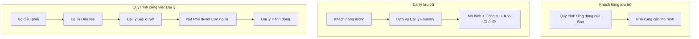
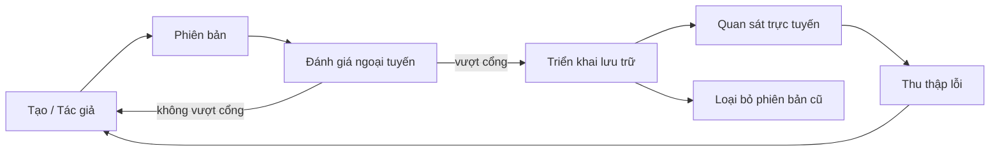
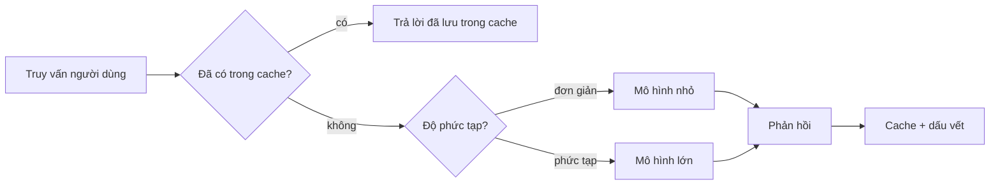
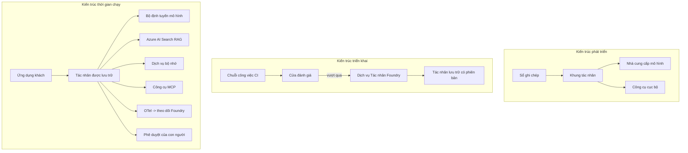

# Triển khai các tác nhân có khả năng mở rộng với Microsoft Foundry


Cho đến thời điểm này trong khóa học, bạn đã xây dựng các tác nhân chạy trên laptop của bạn, bên trong một sổ tay, được điều khiển bởi `az login` và một vài biến môi trường. Đó chính xác là cách học đúng. Nhưng đó không phải là cách đúng để chạy một tác nhân mà hàng nghìn khách hàng phụ thuộc vào lúc 3 giờ sáng.

Bài học này nói về khoảng cách giữa "nó hoạt động trên máy tôi" và "nó hoạt động, đáng tin cậy và tiết kiệm, trong môi trường sản xuất." Chúng ta sẽ thu hẹp khoảng cách đó bằng cách sử dụng **Microsoft Foundry** và **Dịch vụ Tác nhân Microsoft Foundry**, và chúng ta làm điều đó bằng cách xây dựng một tác nhân hỗ trợ khách hàng thực thụ có các công cụ, truy xuất, bộ nhớ, đánh giá và giám sát.

## Giới thiệu

Bài học này sẽ bao gồm:

- Sự khác biệt giữa một **tác nhân nguyên mẫu** và một **tác nhân triển khai**, và tại sao việc chuyển đổi chủ yếu là về tất cả những gì *xung quanh* mô hình.
- **Mẫu triển khai** cho các tác nhân: lưu trữ trên máy khách, lưu trữ dịch vụ (Tác nhân được lưu trữ), và quy trình công việc được điều phối.
- **Vòng đời tác nhân** trên Microsoft Foundry — tạo, phiên bản, triển khai, đánh giá, quan sát, ngưng sử dụng.
- **Chiến lược mở rộng**: định tuyến mô hình, lưu bộ nhớ đệm, đồng thời và thiết kế không trạng thái.
- **Khả năng quan sát** với OpenTelemetry và theo dõi Foundry.
- **Tối ưu hóa chi phí** thông qua lựa chọn mô hình, định tuyến và cổng đánh giá.
- **Cân nhắc doanh nghiệp**: quản trị, phê duyệt con người và chạy các máy chủ MCP an toàn trong sản xuất.

## Mục tiêu học tập

Sau khi hoàn thành bài học này, bạn sẽ biết cách:

- Chọn mẫu triển khai phù hợp cho một khối lượng công việc tác nhân nhất định.
- Triển khai một tác nhân lên Dịch vụ Tác nhân Microsoft Foundry để nó có phiên bản, được quản trị và có thể quan sát.
- Gắn công cụ theo dõi cho tác nhân và nối dây một quy trình đánh giá chạy trước mỗi lần phát hành.
- Áp dụng định tuyến mô hình và lưu bộ nhớ đệm để giữ độ trễ và chi phí ở mức kiểm soát khi mở rộng.
- Thêm cổng phê duyệt con người cho các hành động rủi ro cao và tích hợp máy chủ MCP một cách an toàn trong sản xuất.

## Yêu cầu tiền đề

Bài học này giả định bạn đã hoàn thành các bài học trước và quen thuộc với:

- Xây dựng các tác nhân với [Microsoft Agent Framework](../14-microsoft-agent-framework/README.md) (Bài 14).
- [Sử dụng công cụ](../04-tool-use/README.md) (Bài 4) và [Agentic RAG](../05-agentic-rag/README.md) (Bài 5).
- [Bộ nhớ tác nhân](../13-agent-memory/README.md) (Bài 13) và [Giao thức Agentic / MCP](../11-agentic-protocols/README.md) (Bài 11).
- [Khả năng quan sát và đánh giá](../10-ai-agents-production/README.md) (Bài 10) — bài học này xây dựng trực tiếp trên đó.

Bạn cũng cần:

- Một **đăng ký Azure** và một **dự án Microsoft Foundry** với ít nhất một mô hình chat đã triển khai.
- Đã xác thực **Azure CLI** (`az login`).
- Python 3.12+ và các gói trong kho lưu trữ [`requirements.txt`](../../../requirements.txt).

## Từ nguyên mẫu đến sản xuất: Điều gì thực sự thay đổi

Một tác nhân nguyên mẫu và một tác nhân sản xuất chia sẻ cùng một vòng lặp cốt lõi — lý luận, gọi công cụ, phản hồi. Điều thay đổi là tất cả những gì bao quanh vòng lặp đó. Mô hình có thể chỉ chiếm 20% một tác nhân sản xuất; còn lại 80% là bộ khung vận hành.

| Mối quan tâm | Nguyên mẫu | Sản xuất |
| --- | --- | --- |
| **Lưu trữ** | Chạy trong sổ tay của bạn | Chạy như một dịch vụ lưu trữ, có phiên bản và được triển khai dần |
| **Danh tính** | Token `az login` của bạn | Danh tính được quản lý với RBAC có phạm vi |
| **Trạng thái** | Trong bộ nhớ, mất khi khởi động lại | Ngoại vi hóa (cửa hàng chuỗi, dịch vụ bộ nhớ) |
| **Lỗi** | Bạn nhìn thấy truy vết ngược | Thử lại, dự phòng, thư chết, cảnh báo |
| **Chi phí** | "Chỉ vài xu" | Theo dõi trên mỗi yêu cầu, định tuyến, lưu trữ đệm, ngân sách |
| **Chất lượng** | Bạn quan sát đầu ra | Được đánh giá tự động trước mỗi lần phát hành |
| **Niềm tin** | Bạn phê duyệt mọi hành động | Chính sách + người trong vòng lặp cho các hành động rủi ro |

Ghi nhớ bảng này. Mỗi phần bên dưới tương ứng với một trong các hàng này.

## Mẫu Triển khai Tác nhân

Có ba mẫu bạn sẽ sử dụng, thường kết hợp với nhau.

### 1. Tác nhân lưu trữ trên máy khách

Đối tượng tác nhân sống bên trong *quy trình ứng dụng* của bạn. Mã của bạn gọi trực tiếp nhà cung cấp mô hình; vòng lặp lý luận chạy trong dịch vụ của bạn. Đây là cách các bài học trước đã làm.

- **Sử dụng khi** bạn cần kiểm soát hoàn toàn vòng lặp, middleware tùy chỉnh hoặc bạn đang nhúng tác nhân bên trong backend hiện có.
- **Đổi chác**: bạn chịu trách nhiệm tự mở rộng, trạng thái và khả năng chịu lỗi.

### 2. Tác nhân được lưu trữ (Dịch vụ Tác nhân Foundry)

Tác nhân được *đăng ký như một tài nguyên* trong Microsoft Foundry. Foundry lưu trữ vòng lặp lý luận, lưu trữ các chuỗi, thực thi an toàn nội dung và RBAC, và làm cho tác nhân hiển thị trong cổng Foundry. Ứng dụng của bạn trở thành một khách hàng nhẹ tạo chuỗi và đọc phản hồi.

- **Sử dụng khi** bạn muốn độ bền, khả năng quan sát tích hợp sẵn, quản trị và diện tích vận hành nhỏ hơn.
- **Đổi chác**: ít kiểm soát cấp thấp hơn đổi lấy một môi trường chạy được quản lý.

### 3. Quy trình công việc tác nhân

Nhiều tác nhân (và công cụ) được kết hợp thành một đồ thị với luồng điều khiển rõ ràng — các bước tuần tự, phân nhánh, nút phê duyệt con người và các điểm kiểm tra bền bỉ có thể tạm dừng và tiếp tục. Đây là khả năng **Workflows** của Microsoft Agent Framework được áp dụng ở quy mô triển khai.

- **Sử dụng khi** một tác vụ đơn lẻ trải dài qua nhiều tác nhân chuyên biệt hoặc yêu cầu bước phê duyệt ở giữa.
- **Đổi chác**: nhiều phần chuyển động hơn; cần khả năng quan sát cấp điều phối.



## Vòng đời tác nhân trên Microsoft Foundry

Việc triển khai một tác nhân không phải là một `đẩy` một lần. Nó là một vòng lặp, và nó trông rất giống chu trình phát hành phần mềm vì thực chất nó là như vậy.



Ý tưởng chính, được chuyển từ [Bài 10](../10-ai-agents-production/README.md): **đánh giá ngoại tuyến là một cổng, không phải là suy nghĩ sau cùng.** Một phiên bản tác nhân mới sẽ không được phát hành trừ khi nó vượt qua các ngưỡng đánh giá của bạn. Khả năng quan sát trực tuyến sau đó đưa các lỗi thực tế vào bộ kiểm tra ngoại tuyến của bạn. Đó là toàn bộ vòng lặp.

## Chiến lược mở rộng

Mở rộng một tác nhân khác với mở rộng một API web không trạng thái, vì mỗi yêu cầu có thể kích hoạt nhiều lần gọi mô hình và công cụ tốn kém. Bốn kỹ thuật chịu phần lớn tải.

**Xử lý yêu cầu không trạng thái.** Không giữ trạng thái theo người dùng trong bộ nhớ tiến trình của bạn. Lưu trữ các chuỗi hội thoại trong cửa hàng chuỗi Foundry hoặc dịch vụ bộ nhớ để mọi phiên bản đều có thể xử lý bất kỳ yêu cầu nào. Đây là điều cho phép bạn mở rộng theo chiều ngang — thêm phiên bản, không cần phiên làm việc cố định.

**Định tuyến mô hình.** Không phải mọi yêu cầu đều cần mô hình có khả năng cao nhất (và đắt nhất) của bạn. Định tuyến các yêu cầu đơn giản — phân loại ý định, trả lời ngắn gọn về sự kiện — sang mô hình nhỏ, nhanh và giữ mô hình lớn cho reasoning thực sự. **Model Router** của Foundry có thể làm việc này cho bạn, hoặc bạn có thể tự triển khai bộ phân loại nhẹ. Bạn sẽ xây dựng phiên bản DIY trong phòng lab.

**Lưu bộ nhớ đệm phản hồi.** Nhiều truy vấn hỗ trợ là gần giống nhau ("tôi làm thế nào để đặt lại mật khẩu?"). Lưu bộ nhớ đệm câu trả lời cho các câu hỏi phổ biến và phục vụ mà không cần gọi mô hình. Ngay cả tỉ lệ trúng bộ nhớ đệm khiêm tốn cũng giảm đáng kể chi phí và độ trễ.

**Đồng thời và áp lực ngược.** Nhà cung cấp mô hình có giới hạn tốc độ. Hạn chế độ đồng thời của bạn, sử dụng thử lại với độ trễ tăng theo cấp số nhân, và thất bại nhẹ nhàng (phản hồi "chúng tôi đang xử lý" trong hàng đợi tốt hơn lỗi 500).



## Khả năng quan sát trong sản xuất

Bạn không thể vận hành những gì bạn không thể thấy. Như đã đề cập trong Bài 10, Microsoft Agent Framework phát ra dấu vết **OpenTelemetry** gốc — mọi cuộc gọi mô hình, gọi công cụ, và bước điều phối trở thành một span. Trong sản xuất, bạn xuất những spans đó ra Microsoft Foundry (hoặc máy chủ hỗ trợ OTel nào đó) để bạn có thể:

- Theo dõi một khiếu nại khách hàng từ đầu đến cuối qua mọi cuộc gọi mô hình và công cụ.
- Xem độ trễ p50/p95 và chi phí trên mỗi yêu cầu theo thời gian.
- Cảnh báo về sự tăng đột biến lỗi và bất thường chi phí trước khi người dùng (hoặc nhóm tài chính của bạn) nhận ra.

```python
from agent_framework.observability import get_tracer

tracer = get_tracer()

with tracer.start_as_current_span("support_request") as span:
    span.set_attribute("customer.tier", "enterprise")
    span.set_attribute("routed.model", "gpt-5-nano")
    # việc thực thi tác nhân được theo dõi tự động bên trong phạm vi này
```

Các thuộc tính như `customer.tier` và `routed.model` là thứ biến một bức tường các dấu vết thành các câu hỏi có thể trả lời ("các khách hàng doanh nghiệp có quá thường xuyên được định tuyến sang mô hình nhỏ không?").

## Tối ưu hóa chi phí

Chi phí trong tác nhân sản xuất bị chi phối bởi token. Ba cần gạt, theo thứ tự ảnh hưởng:

1. **Chọn kích thước mô hình phù hợp.** Một mô hình nhỏ vượt qua cổng đánh giá của bạn gần như luôn rẻ hơn mô hình lớn cũng vượt qua. Dùng đánh giá để *chứng minh* mô hình nhỏ đủ tốt thay vì mặc định chọn mô hình lớn nhất chỉ vì cẩn trọng.
2. **Định tuyến theo độ phức tạp.** Như trên — chỉ trả giá lớn cho các yêu cầu cần reasoning mô hình lớn.
3. **Lưu bộ nhớ đệm mạnh mẽ.** Cuộc gọi mô hình rẻ nhất là cuộc gọi bạn không bao giờ thực hiện.

Cổng đánh giá và kiểm soát chi phí là cùng một kỷ luật nhìn từ hai góc độ: đánh giá cho bạn *sàn chất lượng*, định tuyến và lưu đệm giúp bạn gần *chi phí* của sàn đó nhất có thể.

## Cân nhắc triển khai doanh nghiệp

**Quản trị.** Tác nhân được lưu trữ kế thừa RBAC, an toàn nội dung và ghi nhật ký kiểm toán của Foundry. Cấp cho mỗi tác nhân một danh tính được quản lý với quyền tối thiểu cần thiết — truy cập chỉ đọc vào kho kiến thức, truy cập có phạm vi API bán vé, không hơn.

**Con người trong vòng lặp.** Một số hành động quá quan trọng để tự động hoàn toàn — cấp hoàn tiền, xóa tài khoản, chuyển lên nhóm pháp lý. Microsoft Agent Framework hỗ trợ các công cụ **yêu cầu phê duyệt**: tác nhân đề xuất hành động, thực thi tạm dừng, con người phê duyệt hoặc từ chối, rồi quy trình tiếp tục. Bạn đã thấy nguyên thủy này trong [Bài 6](../06-building-trustworthy-agents/README.md); đây bạn triển khai nó.

**MCP trong sản xuất.** [MCP](../11-agentic-protocols/README.md) cho phép tác nhân sử dụng công cụ bên ngoài qua giao diện chuẩn. Trong sản xuất, xem mỗi máy chủ MCP là một biên an toàn không tin cậy: ghim phiên bản máy chủ, chạy với danh tính có phạm vi, xác thực đầu ra, và không bao giờ tiết lộ bí mật với nó. Máy chủ MCP là một phụ thuộc, và phụ thuộc được vá, kiểm toán và giới hạn tốc độ.



Ba sơ đồ đó — phát triển, triển khai, thời gian chạy — là cùng một tác nhân ở ba giai đoạn của cuộc đời nó. Phòng lab tiếp theo sẽ hướng dẫn bạn xây dựng nó.

## Phòng Lab Thực hành: Tác nhân hỗ trợ khách hàng sẵn sàng cho sản xuất

Mở [`code_samples/16-python-agent-framework.ipynb`](./code_samples/16-python-agent-framework.ipynb) và làm theo từng bước đến cuối. Bạn sẽ lắp ráp một **tác nhân hỗ trợ khách hàng Contoso** có mọi mối quan tâm sản xuất được nối dây:

1. **Gọi công cụ** — tra cứu trạng thái đơn hàng và mở vé hỗ trợ.
2. **RAG** — trả lời câu hỏi chính sách từ kho kiến thức (Azure AI Search, với dự phòng trong bộ nhớ để sổ tay chạy mà không cần tài nguyên Search).
3. **Bộ nhớ** — nhớ khách hàng qua nhiều lượt hội thoại.
4. **Định tuyến mô hình** — bộ phân loại độ phức tạp định tuyến mỗi yêu cầu tới mô hình nhỏ hoặc lớn.
5. **Lưu bộ nhớ đệm phản hồi** — các câu hỏi lặp lại được phục vụ từ bộ nhớ đệm.
6. **Phê duyệt con người** — hoàn tiền trên mức ngưỡng tạm dừng chờ phê duyệt.
7. **Quy trình đánh giá** — bộ kiểm tra nhỏ ngoại tuyến chấm điểm tác nhân và đóng vai trò cổng phát hành.
8. **Khả năng quan sát** — theo dõi OpenTelemetry quanh mỗi yêu cầu.

### Hướng dẫn qua

Sổ tay được tổ chức để mỗi mối quan tâm sản xuất là một phần có thể chạy độc lập. Trái tim của nó là bộ xử lý yêu cầu kết hợp định tuyến và lưu bộ nhớ đệm:

```python
async def handle_support_request(query: str, customer_id: str) -> str:
    # 1. Phục vụ từ bộ nhớ đệm khi có thể.
    cached = response_cache.get(normalize(query))
    if cached:
        return cached

    # 2. Định tuyến theo độ phức tạp để kiểm soát chi phí.
    model = "gpt-5-nano" if is_simple(query) else "gpt-5-mini"

    # 3. Chạy tác nhân bên trong khoảng theo dõi để quan sát.
    with tracer.start_as_current_span("support_request") as span:
        span.set_attribute("routed.model", model)
        span.set_attribute("customer.id", customer_id)
        response = await support_agent.run(query, model=model)

    # 4. Bộ nhớ đệm và trả về.
    response_cache.set(normalize(query), response.text)
    return response.text
```

Cổng đánh giá bảo vệ một lần phát hành trông như thế này:

```python
async def evaluation_gate(agent, test_cases, threshold: float = 0.8) -> bool:
    passed = 0
    for case in test_cases:
        result = await agent.run(case["input"])
        if score_response(result.text, case["expected"]) >= 0.8:
            passed += 1
    pass_rate = passed / len(test_cases)
    print(f"Evaluation pass rate: {pass_rate:.0%} (gate: {threshold:.0%})")
    return pass_rate >= threshold  # chỉ triển khai nếu cổng đạt yêu cầu
```

Đọc từng dòng — sổ tay giữ các nguyên thủy có chủ ý nhỏ để không có gì bị ẩn phía sau lời gọi framework.

## Xác thực tác nhân đã triển khai bằng các bài kiểm tra nhanh

Cổng đánh giá phía trên chạy *ngoại tuyến* trên đối tượng tác nhân của bạn. Khi tác nhân được triển khai như một Tác nhân được lưu trữ, bạn cần thêm một kiểm tra nữa, thậm chí rẻ hơn: **điểm cuối triển khai có thực sự trả lời không?**

Triển khai "thành công" chỉ chứng minh mặt điều khiển chấp nhận định nghĩa — nó không chứng minh tác nhân trả lời. Một phụ thuộc bị thiếu, định tuyến mô hình sai hoặc kết nối hết hạn có thể để lại triển khai xanh nhưng không trả về gì. Một **bài kiểm tra khói** phát hiện điều đó trong vài giây, trên mỗi lần triển khai, mà không tốn kém như đánh giá đầy đủ.

Kho lưu trữ này cung cấp một quy trình kiểm tra khói sẵn sàng sử dụng xây dựng trên GitHub Action [AI Smoke Test](https://github.com/marketplace/actions/ai-smoke-test):

- **Danh mục** — [`tests/lesson-16-smoke-tests.json`](../../../tests/lesson-16-smoke-tests.json) chứa lời nhắc và khẳng định cho tác nhân hỗ trợ Contoso (câu trả lời chính sách có căn cứ, tra cứu đơn hàng, giữ chủ đề, và duy trì chuỗi đa lượt). Các danh mục cho các tác nhân bài học khác tồn tại bên cạnh — xem [`tests/README.md`](../tests/README.md).
- **Quy trình công việc** — [`.github/workflows/smoke-test.yml`](../../../.github/workflows/smoke-test.yml) đăng nhập với Azure OIDC và gửi POST từng lời nhắc tới điểm cuối Responses của tác nhân, thất bại công việc nếu có bỏ lỡ khẳng định.

```yaml
- name: Smoke-test hosted agent
  uses: JFolberth/ai-smoketest@v1
  with:
    project_endpoint: ${{ inputs.project_endpoint }}
    agent_name: ContosoSupportAgent
    tests_file: tests/lesson-16-smoke-tests.json
```


Chạy nó từ tab **Actions** khi đại lý của bạn đã được triển khai, cung cấp điểm cuối dự án Foundry và tên đại lý của bạn. Định danh liên kết cần vai trò **Azure AI User** trong phạm vi dự án Foundry. Hãy nghĩ về các lớp như một kim tự tháp: các kiểm tra khói (có thể tiếp cận và phản hồi?) chạy trên mỗi lần triển khai, đánh giá ngoại tuyến (đủ tốt để phát hành?) chạy trước khi thăng cấp, và đánh giá trực tuyến (nó hoạt động thế nào ngoài thực tế?) chạy liên tục.

## Kiểm tra kiến thức

Kiểm tra sự hiểu biết của bạn trước khi chuyển sang bài tập.

**1. Đại khái thì "mô hình" chiếm bao nhiêu phần trong một đại lý sản xuất, và phần còn lại là gì?**

<details>
<summary>Đáp án</summary>

Mô hình chỉ là một phần nhỏ trong hệ thống — thường được trích dẫn khoảng 20%. Phần còn lại là bộ khung vận hành: lưu trữ và quản lý phiên bản, định danh và RBAC, trạng thái bên ngoài, xử lý lỗi, theo dõi chi phí, đánh giá, và kiểm soát có con người tham gia. Việc đưa vào sản xuất chủ yếu là xây dựng mọi thứ *xung quanh* vòng lặp suy luận.
</details>

**2. Khi nào bạn chọn Đại lý Được Lưu trữ thay vì đại lý lưu trữ phía khách hàng?**

<details>
<summary>Đáp án</summary>

Khi bạn muốn có một môi trường chạy được quản lý với độ bền tích hợp sẵn (luồng thực thi tồn tại và có thể tiếp tục), quan sát được, an toàn nội dung, và RBAC, và bạn sẵn sàng đánh đổi một phần kiểm soát cấp thấp của vòng lặp suy luận để giảm diện tích vận hành. Lưu trữ phía khách hàng thích hợp hơn khi bạn cần kiểm soát đầy đủ vòng lặp hoặc đang nhúng đại lý vào backend hiện có.
</details>

**3. Tại sao một đại lý có khả năng mở rộng phải không giữ trạng thái trong bộ nhớ tiến trình riêng?**

<details>
<summary>Đáp án</summary>

Để mọi phiên bản có thể xử lý mọi yêu cầu, đó là điều cho phép mở rộng ngang mà không cần giữ phiên kết dính (sticky sessions). Trạng thái hội thoại của từng người dùng được lưu ngoài vào kho luồng hoặc dịch vụ bộ nhớ. Nếu trạng thái lưu trong bộ nhớ tiến trình, bạn sẽ mất nó khi khởi động lại và không thể phân phối tải tự do.
</details>

**4. Vấn đề nào mà định tuyến mô hình giải quyết, và nó liên quan thế nào đến đánh giá?**

<details>
<summary>Đáp án</summary>

Định tuyến gửi các yêu cầu đơn giản đến mô hình nhỏ, rẻ và nhanh và giữ lại mô hình lớn cho những suy luận thực sự, kiểm soát cả độ trễ và chi phí. Nó liên quan đến đánh giá vì đánh giá là cách *chứng minh* mô hình nhỏ đủ tốt cho một loại yêu cầu — định tuyến mà không đánh giá là đoán mò.
</details>

**5. "Cổng đánh giá" là gì và nó nằm ở đâu trong vòng đời?**

<details>
<summary>Đáp án</summary>

Một cổng đánh giá chạy một bộ kiểm tra ngoại tuyến trên phiên bản đại lý mới và chặn việc triển khai nếu tỷ lệ vượt qua không đạt ngưỡng. Nó nằm giữa "phiên bản" và "triển khai" trong vòng đời, biến chất lượng thành điều kiện tiên quyết cho việc phát hành thay vì thứ bạn kiểm tra sau khi phát hành.
</details>

**6. Tại sao máy chủ MCP nên được coi là một ranh giới không đáng tin cậy trong sản xuất?**

<details>
<summary>Đáp án</summary>

Vì nó là một phụ thuộc bên ngoài mà đại lý của bạn gọi tới. Bạn nên cố định phiên bản của nó, chạy nó với định danh giới hạn phạm vi, xác thực đầu ra, giới hạn tốc độ, và không bao giờ tiết lộ bí mật cho nó — kỷ luật tương tự bạn áp dụng cho bất kỳ phụ thuộc bên thứ ba nào. Đầu ra của nó chảy vào suy luận của đại lý bạn, nên tin tưởng không kiểm tra là rủi ro bảo mật.
</details>

**7. Thay đổi duy nhất nào thường có tác động lớn nhất đến chi phí đại lý sản xuất, và tại sao?**

<details>
<summary>Đáp án</summary>

Chọn kích thước mô hình phù hợp — sử dụng mô hình nhỏ nhất mà vẫn vượt qua cổng đánh giá của bạn. Chi phí chủ yếu do token gây ra, và mô hình nhỏ hơn mà đáp ứng chuẩn chất lượng thường rẻ hơn mô hình lớn hơn. Bộ nhớ đệm và định tuyến sau đó giảm chi phí thêm nữa, nhưng chọn mô hình cơ sở phù hợp có ảnh hưởng lớn nhất ngay từ đầu.
</details>

**8. Thuộc tính span như `customer.tier` và `routed.model` đóng vai trò gì trong quan sát?**

<details>
<summary>Đáp án</summary>

Chúng biến dấu vết thô thành các câu hỏi kinh doanh có thể trả lời. Nếu không có thuộc tính, bạn có một bức tường các span; với thuộc tính, bạn có thể hỏi "các khách hàng doanh nghiệp có thường được định tuyến đến mô hình nhỏ quá nhiều không?" hoặc "mô hình nào xử lý các yêu cầu chậm nhất của chúng ta?" Thuộc tính là cách bạn phân đoạn dữ liệu đo đạc theo các chiều quan trọng với hoạt động của bạn.
</details>

## Bài tập

Lấy đại lý hỗ trợ khách hàng từ bài lab và củng cố nó cho một kịch bản cụ thể: **đại lý hỗ trợ thanh toán đăng ký cho công ty SaaS.**

Nộp bài của bạn nên:

1. **Thay thế các công cụ** bằng những công cụ liên quan đến thanh toán: `get_subscription_status`, `get_invoice`, và `issue_credit` (phiếu tín dụng trên $50 cần phê duyệt con người).
2. **Thêm ba tài liệu RAG** bao gồm chính sách hoàn tiền của công ty, chu kỳ thanh toán, và chính sách hủy.
3. **Mở rộng bộ đánh giá** lên ít nhất tám trường hợp, bao gồm ít nhất hai trường hợp *nên* kích hoạt đường phê duyệt con người, và xác nhận cổng đánh giá của bạn đúng khi cho qua hoặc không.
4. **Thêm một báo cáo chi phí**: sau khi chạy mười truy vấn hỗn hợp qua đại lý, in ra có bao nhiêu truy vấn đi đến mô hình nhỏ, bao nhiêu đến mô hình lớn, và bao nhiêu được phục vụ từ bộ nhớ đệm.

Viết một đoạn ngắn (trong ô markdown) giải thích quy tắc định tuyến mô hình bạn chọn và cách bạn sẽ xác thực nó với lưu lượng thực tế. Không có câu trả lời duy nhất đúng — bạn sẽ được đánh giá dựa trên việc liệu các mối quan tâm về sản xuất có được kết nối chặt chẽ và hợp lý.

## Tóm tắt

Trong bài học này bạn đã chuyển một đại lý từ nguyên mẫu sang sản xuất với Microsoft Foundry:

- Việc nhảy sang sản xuất chủ yếu về **bộ khung vận hành** bao quanh mô hình — lưu trữ, định danh, trạng thái, xử lý lỗi, chi phí, chất lượng, và độ tin cậy.
- Bạn đã học ba **mô hình triển khai** — lưu trữ phía khách hàng, Đại lý Được Lưu trữ, và Quy trình Đại lý — và khi nào mỗi cái phù hợp.
- Bạn đã đi qua **vòng đời đại lý**, nơi đánh giá ngoại tuyến **đóng vai trò là cổng phát hành** và quan sát trực tuyến đưa lỗi trở lại bộ kiểm tra.
- Bạn đã áp dụng **chiến lược mở rộng** — thiết kế không trạng thái, định tuyến mô hình, bộ nhớ đệm, và đồng thời có giới hạn — và kết nối chúng với **tối ưu chi phí**.
- Bạn đã tích hợp **kiểm soát doanh nghiệp**: RBAC, phê duyệt có con người, và tích hợp MCP an toàn cho sản xuất.
- Bạn đã xây dựng một **đại lý hỗ trợ khách hàng sẵn sàng cho sản xuất** liên kết tất cả các mối quan tâm này trong mã chạy được.

Bài học tiếp theo đi theo hướng ngược lại: thay vì mở rộng đại lý lên đám mây, bạn sẽ đưa chúng *xuống* máy của một nhà phát triển duy nhất và chạy hoàn toàn cục bộ.

## Tài nguyên bổ sung

- <a href="https://learn.microsoft.com/azure/ai-foundry/what-is-azure-ai-foundry" target="_blank">Tài liệu Microsoft Foundry</a>
- <a href="https://learn.microsoft.com/azure/ai-foundry/agents/overview" target="_blank">Tổng quan về Dịch vụ Đại lý Microsoft Foundry</a>
- <a href="https://learn.microsoft.com/en-us/agent-framework/overview/?wt.mc_id=youtube_26688_organicsocial_reactor&pivots=programming-language-python" target="_blank">Khung Đại lý Microsoft (Microsoft Agent Framework)</a>
- <a href="https://learn.microsoft.com/azure/ai-foundry/concepts/model-router" target="_blank">Định tuyến Mô hình trong Microsoft Foundry</a>
- <a href="https://learn.microsoft.com/azure/search/search-what-is-azure-search" target="_blank">Tìm kiếm Azure AI</a>
- <a href="https://opentelemetry.io/" target="_blank">OpenTelemetry</a>
- <a href="https://github.com/marketplace/actions/ai-smoke-test" target="_blank">Hành động GitHub AI Smoke Test</a>
- <a href="https://modelcontextprotocol.io/" target="_blank">Giao thức Ngữ cảnh Mô hình (MCP)</a>

## Bài học trước

[Xây dựng Đại lý Sử dụng Máy tính (CUA)](../15-browser-use/README.md)

## Bài học tiếp theo

[Tạo Đại lý AI Cục bộ](../17-creating-local-ai-agents/README.md)

---

<!-- CO-OP TRANSLATOR DISCLAIMER START -->
**Tuyên bố miễn trừ trách nhiệm**:
Tài liệu này đã được dịch bằng dịch vụ dịch thuật AI [Co-op Translator](https://github.com/Azure/co-op-translator). Mặc dù chúng tôi cố gắng đảm bảo độ chính xác, xin lưu ý rằng bản dịch tự động có thể chứa lỗi hoặc sai sót. Tài liệu gốc bằng ngôn ngữ gốc nên được coi là nguồn tin chính thức. Đối với thông tin quan trọng, nên sử dụng dịch vụ dịch thuật chuyên nghiệp bởi con người. Chúng tôi không chịu trách nhiệm về bất kỳ hiểu lầm hoặc giải thích sai nào phát sinh từ việc sử dụng bản dịch này.
<!-- CO-OP TRANSLATOR DISCLAIMER END -->