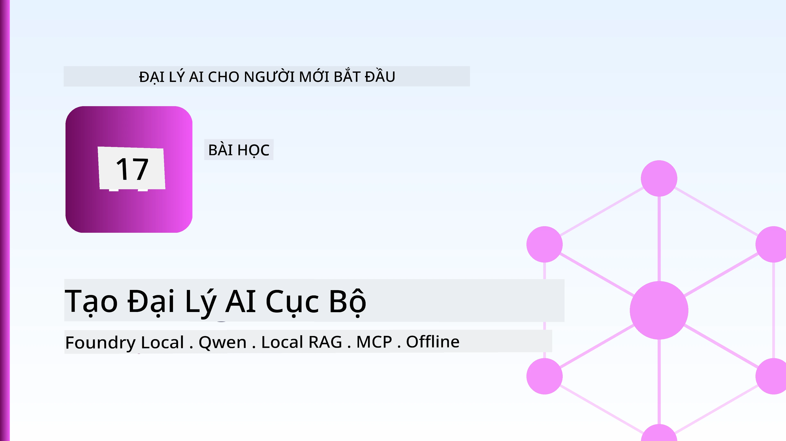
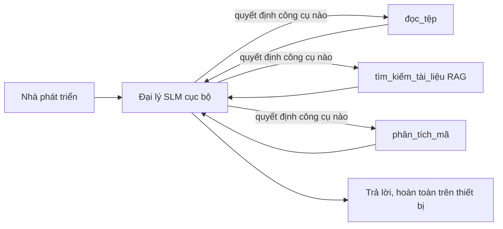
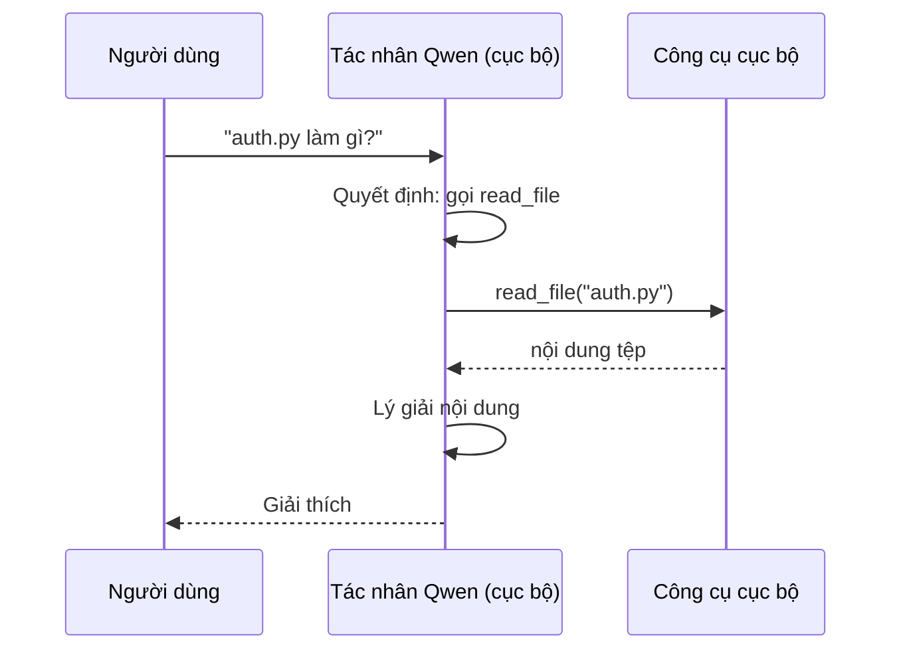
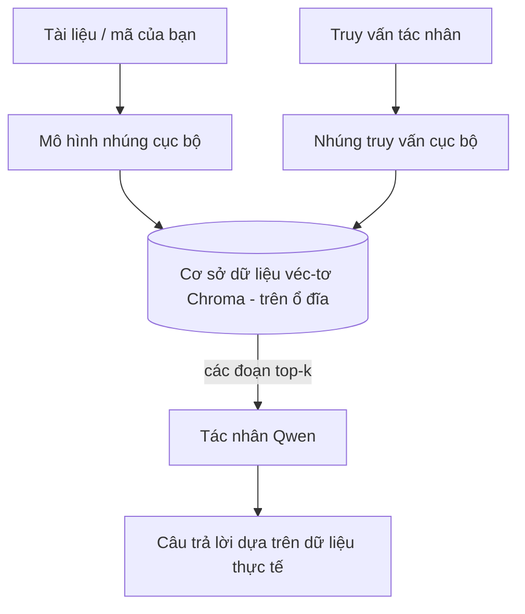
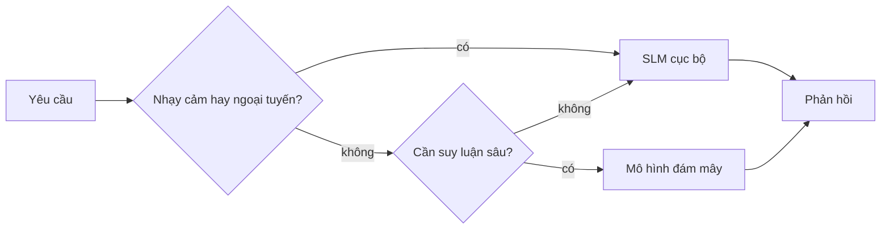

# Tạo các Đại lý AI Cục bộ Sử dụng Microsoft Foundry Local và Qwen



Bài học trước đã mở rộng các đại lý *lên* đám mây. Bài này sẽ đưa chúng *xuống* một máy duy nhất. Đến cuối bài bạn sẽ có một trợ lý kỹ thuật hoạt động có khả năng suy luận, gọi công cụ, đọc tập tin và tìm kiếm tài liệu của bạn — **mà không cần gọi suy luận từ đám mây nào.**

Tại sao bạn muốn điều đó? Ba lý do thường gặp trong công việc kỹ thuật thực tế:

- **Quyền riêng tư.** Mã và tài liệu không bao giờ rời khỏi máy. Không có lệnh gọi, đoạn mã hay dữ liệu khách hàng nào được gửi qua mạng.
- **Chi phí.** Suy luận cục bộ không tính phí trên mỗi token. Bạn có thể chạy thử cả ngày với chi phí điện.
- **Ngoại tuyến.** Trên máy bay, trong khu vực an toàn hoặc khi mất mạng, đại lý vẫn hoạt động.

Điểm khó là bạn phải đánh đổi mô hình đám mây tiên tiến lấy một **Mô hình Ngôn ngữ Nhỏ (SLM)** chạy trên CPU, GPU hoặc NPU của bạn. Bài học này nói về xây dựng đại lý *hiệu quả* trong giới hạn đó thay vì giả vờ giới hạn không tồn tại.

## Giới thiệu

Bài học này sẽ đề cập đến:

- **Mô hình Ngôn ngữ Nhỏ (SLMs)** — là gì, điểm mạnh và điểm yếu.
- **Microsoft Foundry Local** — một runtime tải về và phục vụ mô hình trên thiết bị qua API **tương thích OpenAI**.
- **Mô hình gọi hàm Qwen** — SLMs đảm bảo tạo ra các cuộc gọi công cụ đáng tin cậy, điều này làm cho đại lý *cục bộ* (không chỉ chat cục bộ) trở nên khả thi.
- **Công cụ cục bộ, RAG cục bộ và MCP cục bộ** — cung cấp năng lực cho đại lý mà không cần đám mây.
- **Mẫu lai** — khi nào giữ ở cục bộ và khi nào dựa vào đám mây.

## Mục tiêu học tập

Sau khi hoàn thành, bạn sẽ biết cách:

- Giải thích các đánh đổi của SLMs và chọn các trường hợp sử dụng đại lý cục bộ phù hợp.
- Phục vụ mô hình Qwen cục bộ với Foundry Local và kết nối qua endpoint tương thích OpenAI.
- Xây dựng đại lý gọi công cụ chạy hoàn toàn trên máy làm việc của bạn.
- Thêm RAG cục bộ trên tài liệu của bạn bằng cơ sở dữ liệu vector cục bộ (Chroma).
- Kết nối đại lý với server MCP cục bộ và suy luận về thiết kế lai cục bộ/đám mây.

## Các yêu cầu trước

Bài học giả định bạn đã hoàn thành các bài trước và thoải mái với:

- [Sử dụng Công cụ](../04-tool-use/README.md) (Bài 4) và [Agentic RAG](../05-agentic-rag/README.md) (Bài 5).
- [Giao thức Agentic / MCP](../11-agentic-protocols/README.md) (Bài 11).
- [Microsoft Agent Framework](../14-microsoft-agent-framework/README.md) (Bài 14).

Bạn cũng cần:

- Một máy làm việc cho phát triển. **8 GB RAM là tối thiểu hợp lý**; 16 GB trở lên thoải mái hơn. Một GPU hoặc NPU giúp nhưng không bắt buộc.
- Cài đặt **Microsoft Foundry Local** (xem phần cài đặt bên dưới).
- Python 3.12+ và các gói trong kho [`requirements.txt`](../../../requirements.txt), cộng thêm `foundry-local-sdk`, `openai`, và `chromadb` cho bài này.

## Mô hình Ngôn ngữ Nhỏ: Công Cụ Phù Hợp cho Công Việc Cục Bộ

Mô hình đám mây tiên tiến có hàng trăm tỷ tham số và dữ liệu trung tâm phía sau. SLM có vài tỷ tham số và phải vừa RAM máy tính xách tay bạn. Sự khác biệt đó định rõ kỳ vọng.

**SLMs giỏi ở:**

- Nhiệm vụ có cấu trúc, giới hạn — phân loại, trích xuất, tóm tắt tài liệu đã biết.
- **Gọi công cụ** — quyết định gọi hàm nào với đối số gì.
- Thử nghiệm nhanh, rẻ, riêng tư trên dữ liệu của bạn.

**SLMs yếu hơn ở:**

- Suy luận mở, đa bước trên ngữ cảnh lớn.
- Kiến thức thế giới rộng (thấy ít hơn, quên nhanh hơn).

Chiến lược thắng lợi cho đại lý cục bộ là: **để SLM điều phối, và để công cụ làm phần nặng nhọc.** Mô hình không cần *biết* codebase của bạn — nó chỉ cần biết khi nào gọi `read_file` và `search_docs`. Điều này tận dụng điểm mạnh của SLM.



## Microsoft Foundry Local

**Microsoft Foundry Local** là runtime nhẹ tải về, quản lý và phục vụ mô hình hoàn toàn trên máy bạn. Tính năng quan trọng nhất với chúng ta là nó cung cấp **endpoint HTTP tương thích OpenAI** — nghĩa là SDK OpenAI và client OpenAI của Microsoft Agent Framework dùng được với nó chỉ bằng cách đổi `base_url`. Mọi thứ bạn học về xây dựng đại lý chuyển thẳng; chỉ endpoint thay từ đám mây sang `localhost`.

Foundry Local cũng tự động chọn bản build mô hình tốt nhất cho phần cứng bạn — bản CPU, CUDA/GPU, hoặc NPU — nên bạn không cần tối ưu thủ công từng máy.

### Cài đặt

Cài Foundry Local (xem [tài liệu](https://learn.microsoft.com/azure/ai-foundry/foundry-local/) cho hệ điều hành của bạn), rồi xác nhận hoạt động:

```bash
# Cài đặt (ví dụ; làm theo tài liệu cho nền tảng của bạn)
winget install Microsoft.FoundryLocal      # Windows
# brew install microsoft/foundrylocal/foundrylocal   # macOS

# Tải xuống và chạy mô hình Qwen, sau đó khởi động dịch vụ cục bộ
foundry model run qwen2.5-7b-instruct
foundry service status
```

Một khi dịch vụ chạy bạn có endpoint cục bộ tương thích OpenAI (thường là `http://localhost:PORT/v1`). Notebook dùng `foundry-local-sdk` để tự phát hiện endpoint, nên bạn không phải cứng port.

## Gọi Hàm Qwen: Tại Sao Quan Trọng

Một đại lý chỉ là đại lý nếu có thể gọi công cụ. Nhiều SLM có thể chat nhưng tạo cuộc gọi công cụ không tin cậy, sai cấu trúc. Mô hình **Qwen** được huấn luyện để gọi hàm và tạo cấu trúc gọi công cụ chính xác liên tục — điều này biến mô hình chat cục bộ thành đại lý *cục bộ* khả thi.

Luồng là vòng gọi công cụ chuẩn bạn đã biết, chỉ khác chạy trên thiết bị:



## RAG Cục bộ

Tìm kiếm tài liệu là nơi đại lý cục bộ phát huy. Thay vì mong SLM nhớ tài liệu framework, bạn nhúng tài liệu vào **cơ sở dữ liệu vector cục bộ** và để đại lý truy xuất đoạn liên quan theo yêu cầu.

Chúng ta dùng **Chroma**, kho vector nhúng chạy nội bộ không cần server quản lý. Quy trình hoàn toàn cục bộ: mô hình nhúng cục bộ → vector cục bộ → truy xuất cục bộ → SLM cục bộ.



Đây giống mô hình Agentic RAG trong Bài 5 — chỉ khác mỗi thành phần chạy trên máy bạn.

## Server MCP Cục bộ

[MCP](../11-agentic-protocols/README.md) là giao vận, không phải dịch vụ đám mây. Server MCP có thể chạy cục bộ như tiến trình `stdio`, cung cấp công cụ cho đại lý qua giao thức chuẩn. Điều này cho phép tái sử dụng hệ sinh thái server MCP phong phú — truy cập hệ thống file, thao tác git, truy vấn database — hoàn toàn ngoại tuyến.

Phương thức bảo mật khác đám mây, nhưng không mất hẳn: server MCP cục bộ chạy với quyền người dùng bạn, nên giới hạn phạm vi truy cập (thư mục dự án, không phải toàn bộ thư mục nhà) và xử lý kết quả như đầu vào cần kiểm tra.

## Mẫu lai Đám mây và Cục bộ

Chọn cục bộ trước không có nghĩa chỉ cục bộ. Hệ thống trưởng thành sẽ phân luồng theo độ nhạy cảm và khó khăn:

| Tình huống | Địa điểm chạy |
| --- | --- |
| Code/dữ liệu nhạy cảm, hoặc ngoại tuyến | **SLM cục bộ** |
| Nhiệm vụ đơn giản, giới hạn | **SLM cục bộ** (rẻ, nhanh) |
| Suy luận đa bước phức tạp trên dữ liệu không nhạy cảm | **Mô hình đám mây** |
| Tất cả, khi mất mạng | **SLM cục bộ** (giảm dần tốt) |

Điều này giống ý tưởng **định tuyến mô hình** từ Bài 16 — chỉ khác một "mô hình" là máy bạn. Thiết kế chắc chắn sẽ dự phòng cục bộ khi đám mây không sẵn, để đại lý giảm chất lượng thay vì lỗi hẳn.



## Thực hành: Trợ lý Kỹ thuật Cục bộ

Mở [`code_samples/17-local-agent-foundry-local.ipynb`](./code_samples/17-local-agent-foundry-local.ipynb) và làm theo. Bạn sẽ xây dựng một **trợ lý kỹ thuật cục bộ** chạy hoàn toàn trên máy làm việc và có thể:

1. **Gọi công cụ** — qua gọi hàm Qwen qua Foundry Local.
2. **Thực hiện thao tác file cục bộ** — liệt kê và đọc file trong thư mục dự án.
3. **Phân tích code** — báo cáo các chỉ số cơ bản trên file nguồn.
4. **Tìm kiếm tài liệu** — RAG cục bộ trên thư mục docs với Chroma.
5. **Dùng MCP** — kết nối với server MCP cục bộ (bỏ qua nhẹ nhàng nếu không có).

Không dùng suy luận đám mây ở bất cứ điểm nào.

### Hướng dẫn qua

Trợ lý kết nối Foundry Local qua endpoint tương thích OpenAI, nên mã đại lý gần như giống bài đám mây — chỉ client thay đổi:

```python
from foundry_local import FoundryLocalManager
from openai import OpenAI

# Foundry Local phát hiện/tải xuống mô hình và cung cấp cho chúng ta một điểm cuối cục bộ.
manager = FoundryLocalManager(\"qwen2.5-7b-instruct\")
client = OpenAI(base_url=manager.endpoint, api_key=manager.api_key)  # api_key là một trình giữ chỗ cục bộ
```

Các công cụ là hàm Python thông thường giới hạn phạm vi vào thư mục dự án:

```python
def read_file(path: str) -> str:
    \"\"\"Read a file, but only inside the sandboxed project directory.\"\"\"
    full = (PROJECT_ROOT / path).resolve()
    if PROJECT_ROOT not in full.parents and full != PROJECT_ROOT:
        return \"Access denied: path is outside the project directory.\"
    return full.read_text(encoding=\"utf-8\")
```

Chú ý kiểm tra sandbox — dù cục bộ, công cụ đọc đường dẫn tùy ý là rủi ro. Notebook giữ mọi công cụ trong một thư mục gốc dự án.

## Kiểm tra kiến thức

Kiểm tra hiểu biết trước khi làm bài tập.

**1. Nêu hai lý do thực tế để chạy đại lý cục bộ thay vì trên đám mây.**

<details>
<summary>Trả lời</summary>

Bất kỳ hai trong ba: **quyền riêng tư** (mã và dữ liệu không rời máy), **chi phí** (không tính phí suy luận từng token), và **khả năng ngoại tuyến** (hoạt động không mạng — trên máy bay, nơi an toàn, hoặc mất mạng). Các hạn chế quy định/tuân thủ không cho phép gửi dữ liệu ra ngoài thiết bị thường là lý do quyền riêng tư.
</details>

**2. Phân công lao động được khuyến nghị giữa SLM và công cụ trong đại lý cục bộ là gì, và tại sao?**

<details>
<summary>Trả lời</summary>

Để SLM **điều phối** (quyết định gọi công cụ nào với đối số gì) và để **công cụ làm phần nặng nhọc** (đọc file, truy xuất docs, tính toán kết quả). SLM mạnh trong quyết định giới hạn như chọn công cụ nhưng yếu về kiến thức rộng và suy luận dài, nên dựa vào công cụ là phát huy thế mạnh tốt.
</details>

**3. Điều gì làm cho việc tái sử dụng mã đại lý đám mây với Foundry Local trở nên khả thi?**

<details>
<summary>Trả lời</summary>

Foundry Local cung cấp **endpoint HTTP tương thích OpenAI**. SDK OpenAI và client OpenAI của Agent Framework dùng được với nó chỉ bằng cách đổi `base_url` (và dùng key API giả cục bộ). Mọi phần còn lại của mã đại lý giữ nguyên.
</details>

**4. Tại sao chúng ta dùng mô hình gọi hàm Qwen đặc biệt thay vì bất kỳ SLM nào?**

<details>
<summary>Trả lời</summary>

Vì đại lý phải tạo ra cuộc gọi **công cụ** đáng tin cậy, đúng cấu trúc. Nhiều SLM có chat nhưng gửi cấu trúc gọi công cụ sai hoặc không nhất quán. Qwen được huấn luyện gọi hàm và tạo cuộc gọi công cụ nhất quán, biến mô hình chat cục bộ thành đại lý cục bộ hoạt động được.
</details>

**5. Trong quy trình RAG cục bộ, thành phần nào chạy trên máy?**

<details>
<summary>Trả lời</summary>

Tất cả: mô hình nhúng, cơ sở dữ liệu vector (Chroma, trên đĩa), bước truy xuất và SLM. Tài liệu được nhúng cục bộ, lưu cục bộ, truy xuất cục bộ và được SLM cục bộ suy luận — không thành phần nào chạm đám mây.
</details>

**6. Một server MCP cục bộ chạy trên máy bạn. Điều đó có làm nó tự động an toàn không? Cần đề phòng gì?**

<details>
<summary>Trả lời</summary>

Không. Server MCP cục bộ chạy với quyền người dùng của bạn, nên nó có thể truy cập mọi thứ bạn được quyền. Giới hạn phạm vi nó cần (ví dụ một thư mục dự án thay vì toàn bộ thư mục nhà) và xử lý kết quả nó trả về như đầu vào cần kiểm tra trước khi hành động.
</details>

**7. Mô tả quy tắc định tuyến lai hợp lý bao gồm một mô hình cục bộ.**

<details>
<summary>Trả lời</summary>

Định tuyến các yêu cầu nhạy cảm hoặc ngoại tuyến tới SLM cục bộ; định tuyến nhiệm vụ ngắn gọn đơn giản tới SLM cục bộ để tiết kiệm và nhanh; định tuyến suy luận đa bước phức tạp dữ liệu không nhạy cảm tới mô hình đám mây; và chuyển về SLM cục bộ khi đám mây không khả dụng để đại lý giảm chất lượng một cách nhẹ nhàng thay vì lỗi hẳn. Đây là định tuyến mô hình (Bài 16) với máy cục bộ là một trong các mô hình.
</details>

**8. RAM tối thiểu thực tế để chạy đại lý cục bộ bài này là bao nhiêu, và thêm RAM đem lại gì?**

<details>
<summary>Trả lời</summary>

Khoảng **8 GB** là tối thiểu hợp lý; 16 GB trở lên thoải mái hơn. RAM nhiều hơn cho phép chạy mô hình lớn hơn, năng lực hơn và giữ nhiều ngữ cảnh trong bộ nhớ. GPU hoặc NPU tăng tốc suy luận nhưng không bắt buộc — Foundry Local chọn bản CPU khi không có bộ tăng tốc.
</details>

## Bài tập

Mở rộng trợ lý kỹ thuật cục bộ thành **người đánh giá tài liệu cục bộ** cho một dự án nhỏ bạn chọn (dùng một thư mục bài học trong repo nếu bạn muốn).

Bài nộp của bạn nên:

1. **Lập chỉ mục thư mục docs/code thật** vào Chroma (ít nhất năm file).
2. **Thêm công cụ `find_todos`** quét dự án tìm chú thích `TODO`/`FIXME` và trả về chúng với file và số dòng — giữ kiểm tra sandbox như `read_file`.

3. **Hỏi đại lý ba câu hỏi** buộc nó phải kết hợp các công cụ: một câu hỏi thuần túy RAG, một câu hỏi yêu cầu đọc một tệp cụ thể và một câu hỏi yêu cầu tìm các TODO.
4. **Đo lường nó**: tính thời gian cho từng phản hồi trong ba phản hồi và ghi chú chúng trong một ô markdown. Bình luận xem độ trễ có chấp nhận được cho quy trình làm việc dự kiến của bạn hay không.

Sau đó viết một đoạn ngắn về **những gì bạn sẽ chuyển lên đám mây và những gì bạn sẽ giữ cục bộ** cho người đánh giá này, và lý do tại sao. Bạn được đánh giá dựa trên việc các thành phần cục bộ được kết nối chính xác và liệu lý luận lai của bạn có hợp lý hay không — không dựa trên chất lượng mô hình.

## Tóm tắt

Trong bài học này, bạn đã xây dựng một đại lý chạy hoàn toàn trên máy của chính bạn:

- **SLM** đánh đổi độ bao phủ để lấy quyền riêng tư, chi phí và vận hành ngoại tuyến — và thực sự nổi bật khi chúng **điều phối các công cụ** thay vì mang tất cả kiến thức một mình.
- **Foundry Local** cung cấp các mô hình chạy trên thiết bị đằng sau một **điểm cuối tương thích OpenAI**, vì vậy mã đại lý đám mây của bạn sẽ chuyển đổi với chỉ một dòng thay đổi.
- **Các mô hình gọi hàm Qwen** giúp gọi công cụ cục bộ một cách đáng tin cậy — và do đó giúp tạo *đại lý* cục bộ trở nên khả thi.
- **RAG cục bộ** (Chroma) và **MCP cục bộ** cung cấp cho đại lý khả năng mà không cần rời máy.
- **Mẫu lai** cho phép bạn định tuyến theo độ nhạy cảm và độ khó, với cục bộ là phương án dự phòng duyên dáng.

Điều này hoàn thành vòng triển khai: Bài 16 đã mở rộng quy mô đại lý vào Microsoft Foundry, còn bài học này thu nhỏ chúng lại trên một trạm làm việc đơn lẻ. Bài học tiếp theo sẽ tập trung vào việc giữ an toàn cho đại lý đã triển khai.

## Tài nguyên bổ sung

- <a href="https://learn.microsoft.com/azure/ai-foundry/foundry-local/" target="_blank">Tài liệu Microsoft Foundry Local</a>
- <a href="https://learn.microsoft.com/azure/ai-foundry/what-is-azure-ai-foundry" target="_blank">Tài liệu Microsoft Foundry</a>
- <a href="https://learn.microsoft.com/en-us/agent-framework/overview/?wt.mc_id=youtube_26688_organicsocial_reactor&pivots=programming-language-python" target="_blank">Microsoft Agent Framework</a>
- <a href="https://qwen.readthedocs.io/en/latest/framework/function_call.html" target="_blank">Tài liệu gọi hàm Qwen</a>
- <a href="https://modelcontextprotocol.io/" target="_blank">Model Context Protocol (MCP)</a>
- <a href="https://docs.trychroma.com/" target="_blank">Cơ sở dữ liệu vectơ Chroma</a>

## Bài học trước

[Triển khai đại lý có thể mở rộng](../16-deploying-scalable-agents/README.md)

## Bài học tiếp theo

[Bảo mật đại lý AI](../18-securing-ai-agents/README.md)

---

<!-- CO-OP TRANSLATOR DISCLAIMER START -->
**Tuyên bố miễn trừ trách nhiệm**:
Tài liệu này đã được dịch bằng dịch vụ dịch thuật AI [Co-op Translator](https://github.com/Azure/co-op-translator). Mặc dù chúng tôi cố gắng đảm bảo độ chính xác, xin lưu ý rằng bản dịch tự động có thể chứa lỗi hoặc sai sót. Tài liệu gốc bằng ngôn ngữ gốc nên được coi là nguồn tin chính thức. Đối với thông tin quan trọng, nên sử dụng dịch vụ dịch thuật chuyên nghiệp bởi con người. Chúng tôi không chịu trách nhiệm về bất kỳ hiểu lầm hoặc giải thích sai nào phát sinh từ việc sử dụng bản dịch này.
<!-- CO-OP TRANSLATOR DISCLAIMER END -->