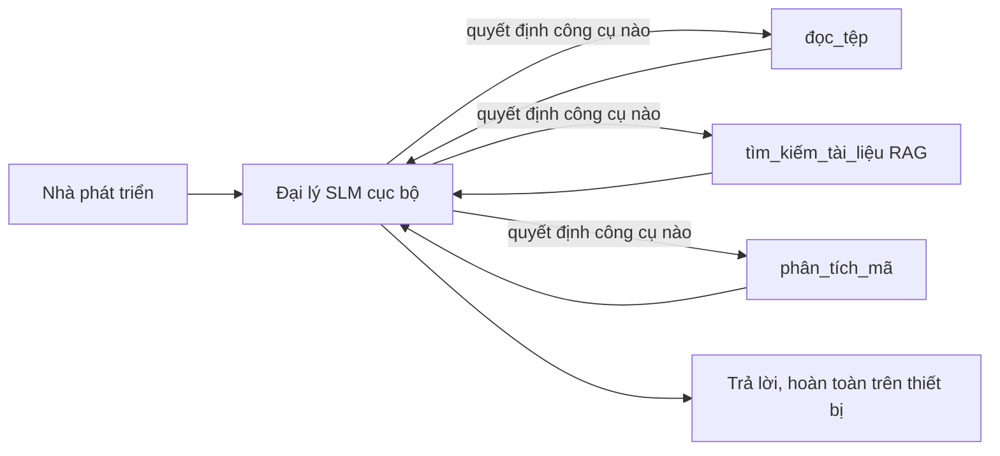
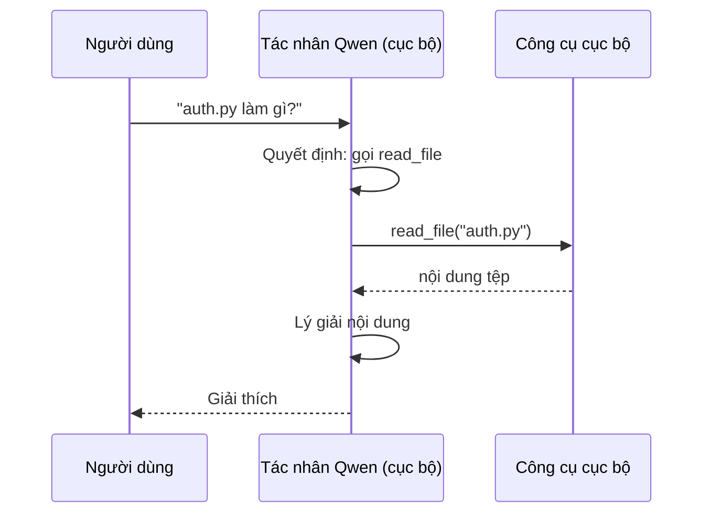
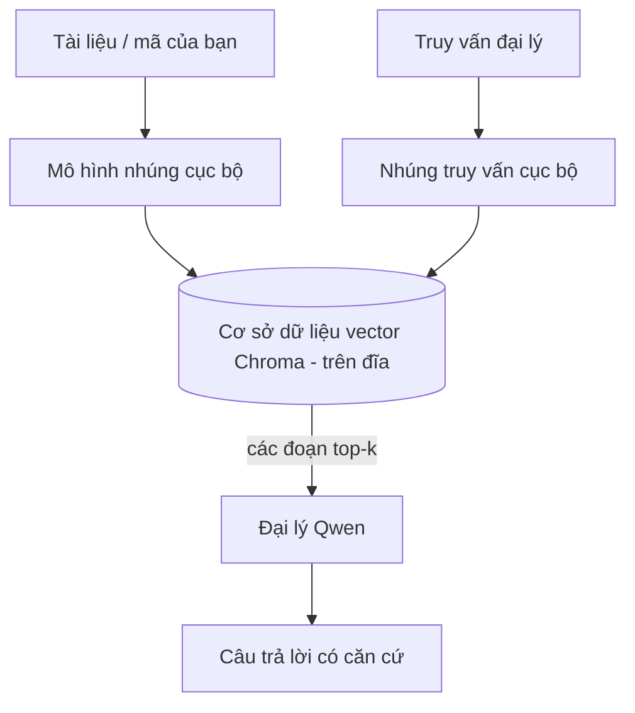
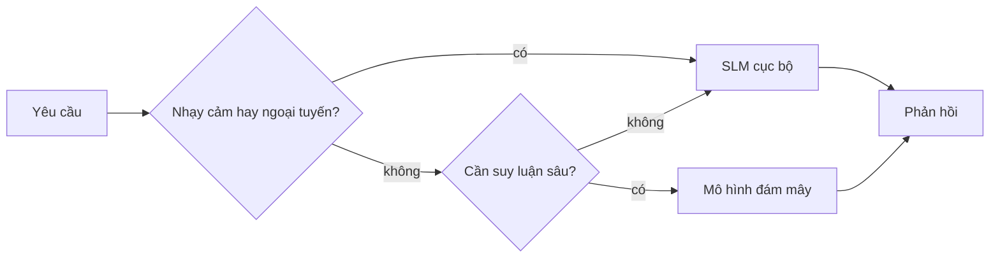

# Tạo các Đại lý AI Cục bộ Sử dụng Microsoft Foundry Local và Qwen


Bài học trước đã mở rộng các đại lý *lên* đám mây. Bài này đưa chúng *xuống* một máy đơn. Cuối bài bạn sẽ có một trợ lý kỹ thuật hoạt động có khả năng suy luận, gọi công cụ, đọc file của bạn, và tìm kiếm tài liệu — **mà không cần gọi suy luận qua đám mây một lần nào.**

Tại sao bạn lại muốn điều đó? Ba lý do thường gặp trong công việc kỹ thuật thực tế:

- **Bảo mật.** Mã nguồn và tài liệu không bao giờ rời máy. Không prompt nào, không đoạn mã nào, không dữ liệu khách hàng vượt quá ranh giới mạng.
- **Chi phí.** Suy luận cục bộ không tính phí trên mỗi token. Bạn có thể thử nghiệm cả ngày chỉ với giá điện.
- **Offline.** Trên máy bay, trong cơ sở an toàn, hoặc khi mất điện, đại lý vẫn hoạt động.

Điểm hạn chế là bạn đang đánh đổi một mô hình đám mây tiên tiến lấy một **Mô hình Ngôn ngữ Nhỏ (SLM)** chạy trên CPU, GPU hoặc NPU của bạn. Bài học này nói về xây dựng các đại lý *tốt* trong giới hạn đó thay vì giả vờ giới hạn không tồn tại.

## Giới thiệu

Bài học này sẽ đề cập đến:

- **Mô hình Ngôn ngữ Nhỏ (SLMs)** — chúng là gì, nơi chúng phát huy, và những nơi chúng không.
- **Microsoft Foundry Local** — một runtime tải xuống và phục vụ mô hình trên thiết bị qua **API tương thích OpenAI**.
- **Mô hình gọi hàm Qwen** — các SLM tạo các cuộc gọi công cụ đáng tin cậy, điều làm cho đại lý cục bộ khả thi (không chỉ chat cục bộ).
- **Công cụ cục bộ, RAG cục bộ, và MCP cục bộ** — trao quyền cho đại lý không cần đám mây.
- **Mẫu lai** — khi nào giữ lại cục bộ và khi nào cần dùng đám mây.

## Mục tiêu học tập

Sau khi hoàn thành bài học, bạn sẽ biết cách:

- Giải thích các đánh đổi của SLM và lựa chọn các trường hợp sử dụng đại lý cục bộ phù hợp.
- Phục vụ một mô hình Qwen cục bộ với Foundry Local và kết nối qua điểm cuối tương thích OpenAI.
- Xây dựng đại lý gọi công cụ chạy hoàn toàn trên máy làm việc của bạn.
- Thêm RAG cục bộ dựa trên tài liệu của bạn sử dụng cơ sở dữ liệu vector cục bộ (Chroma).
- Kết nối đại lý với máy chủ MCP cục bộ và suy xét về thiết kế lai cục bộ/đám mây.

## Yêu cầu trước

Bài học này giả định bạn đã hoàn thành các bài trước và thành thạo:

- [Sử dụng Công cụ](../04-tool-use/README.md) (Bài 4) và [Agentic RAG](../05-agentic-rag/README.md) (Bài 5).
- [Giao thức Agentic / MCP](../11-agentic-protocols/README.md) (Bài 11).
- [Microsoft Agent Framework](../14-microsoft-agent-framework/README.md) (Bài 14).

Bạn cũng cần:

- Máy trạm phát triển. **8 GB RAM là mức tối thiểu thực tế**; 16 GB trở lên thì thoải mái. Có GPU hoặc NPU là hữu ích nhưng không bắt buộc.
- Cài đặt **Microsoft Foundry Local** (xem phần thiết lập bên dưới).
- Python 3.12+ và các gói trong kho [`requirements.txt`](../../../requirements.txt), cộng thêm `foundry-local-sdk`, `openai`, và `chromadb` cho bài này.

## Mô hình Ngôn ngữ Nhỏ: Công cụ phù hợp cho công việc cục bộ

Một mô hình đám mây tiên tiến có hàng trăm tỷ tham số và trung tâm dữ liệu ở phía sau. Một SLM có vài tỷ tham số và phải vừa với RAM laptop của bạn. Sự khác biệt đó đặt ra kỳ vọng rõ ràng.

**SLMs mạnh ở:**

- Nhiệm vụ có cấu trúc, giới hạn — phân loại, trích xuất, tóm tắt tài liệu đã biết.
- **Gọi công cụ** — quyết định hàm nào gọi và với tham số gì.
- Lặp thử nhanh, rẻ, riêng tư trên dữ liệu của bạn.

**SLMs yếu ở:**

- Suy luận mở, đa bước trên ngữ cảnh lớn.
- Kiến thức thế giới rộng (chúng thấy ít hơn, quên nhanh hơn).

Chiến lược thắng cho đại lý cục bộ là: **để SLM điều phối, và để công cụ làm việc nặng.** Mô hình không cần *biết* codebase của bạn — nó cần biết khi nào gọi `read_file` và `search_docs`. Điều đó tận dụng trực tiếp điểm mạnh của SLM.



## Microsoft Foundry Local

**Microsoft Foundry Local** là một runtime nhẹ tải xuống, quản lý, và phục vụ mô hình hoàn toàn trên máy bạn. Tính năng quan trọng nhất với chúng ta là nó mở ra một **điểm cuối HTTP tương thích OpenAI** — nghĩa là SDK OpenAI và client OpenAI của Microsoft Agent Framework hoạt động với nó chỉ với thay đổi `base_url`. Mọi thứ bạn đã học về xây dựng đại lý được chuyển thẳng; chỉ điểm cuối chuyển từ đám mây về `localhost`.

Foundry Local cũng tự động chọn bản build tối ưu nhất cho phần cứng của bạn — bản CPU, bản CUDA/GPU, hay bản NPU — nên bạn không cần tối ưu thủ công cho từng máy.

### Thiết lập

Cài Foundry Local (xem [tài liệu](https://learn.microsoft.com/azure/ai-foundry/foundry-local/) cho hệ điều hành của bạn), rồi xác nhận nó hoạt động:

```bash
# Cài đặt (ví dụ; làm theo tài liệu cho nền tảng của bạn)
winget install Microsoft.FoundryLocal      # Windows
# brew install microsoft/foundrylocal/foundrylocal   # macOS

# Tải xuống và chạy mô hình Qwen, sau đó khởi động dịch vụ cục bộ
foundry model run qwen2.5-7b-instruct
foundry service status
```

Khi dịch vụ chạy, bạn có một điểm cuối cục bộ, tương thích OpenAI (thường là `http://localhost:PORT/v1`). Notebook dùng `foundry-local-sdk` để tự khám phá điểm cuối, nên bạn không phải mã cứng port.

## Gọi Hàm Qwen: Tại sao quan trọng

Một đại lý chỉ là đại lý khi nó có thể gọi công cụ. Nhiều SLM có thể chat nhưng tạo ra các lời gọi công cụ không đáng tin cậy, sai cấu trúc. Mô hình **Qwen** được huấn luyện để gọi hàm và phát sinh cấu trúc lời gọi công cụ rõ ràng, liên tục — đây chính là thứ biến một mô hình chat cục bộ thành một *đại lý* cục bộ.

Luồng này là vòng gọi công cụ tiêu chuẩn bạn đã biết, nhưng chạy trên thiết bị:



## RAG Cục bộ

Tìm kiếm tài liệu là nơi đại lý cục bộ phát huy giá trị. Thay vì hi vọng SLM ghi nhớ tài liệu framework, bạn nhúng tài liệu vào **cơ sở dữ liệu vector cục bộ** và để đại lý truy xuất những đoạn liên quan theo yêu cầu.

Chúng ta dùng **Chroma**, kho vector nhúng chạy cùng tiến trình không cần server quản lý. Quy trình hoàn toàn cục bộ: mô hình nhúng → vector cục bộ → truy xuất cục bộ → SLM cục bộ.



Đây là mẫu Agentic RAG từ Bài 5 — chỉ khác là mọi thành phần chạy trên máy bạn.

## Máy chủ MCP Cục bộ

[MCP](../11-agentic-protocols/README.md) là một giao thức vận chuyển, không phải dịch vụ đám mây. Máy chủ MCP có thể chạy dưới dạng tiến trình cục bộ qua `stdio`, cung cấp công cụ cho đại lý qua giao thức chuẩn. Điều này cho phép bạn tái dùng hệ sinh thái MCP — truy cập hệ thống tập tin, thao tác git, truy vấn cơ sở dữ liệu — hoàn toàn offline.

Quan điểm bảo mật khác với đám mây, nhưng không phải không có. Máy chủ MCP cục bộ vẫn chạy với quyền người dùng của bạn, nên hãy giới hạn phạm vi nó có thể truy cập (thư mục dự án, chứ không phải toàn bộ thư mục home) và xử lý đầu ra của nó như dữ liệu đầu vào để kiểm tra.

## Mẫu Lai Đám mây và Cục bộ

Ưu tiên cục bộ không có nghĩa là chỉ cục bộ. Hệ thống trưởng thành định tuyến dựa trên độ nhạy cảm và độ khó:

| Tình huống | Chạy ở đâu |
| --- | --- |
| Code / dữ liệu nhạy cảm, hoặc offline | **SLM cục bộ** |
| Nhiệm vụ đơn giản, giới hạn | **SLM cục bộ** (rẻ, nhanh) |
| Suy luận đa bước khó trên dữ liệu không nhạy cảm | **Mô hình đám mây** |
| Mọi thứ, khi mất kết nối | **SLM cục bộ** (giảm chất lượng khéo léo) |

Điều này giống ý tưởng **định tuyến mô hình** từ Bài 16 — chỉ khác là một trong các "mô hình" giờ là máy bạn. Thiết kế bền vững sẽ chuyển về cục bộ khi đám mây mất kết nối, để chất lượng đại lý giảm dần thay vì đổ hỏng hoàn toàn.



## Thực hành: Trợ lý Kỹ thuật Cục bộ

Mở [`code_samples/17-local-agent-foundry-local.ipynb`](./code_samples/17-local-agent-foundry-local.ipynb) và làm theo. Bạn sẽ xây dựng một **trợ lý kỹ thuật cục bộ** chạy hoàn toàn trên máy làm việc của bạn và có thể:

1. **Gọi công cụ** — qua gọi hàm Qwen qua Foundry Local.
2. **Thao tác file cục bộ** — liệt kê và đọc file trong thư mục dự án.
3. **Phân tích code** — báo cáo các chỉ số cơ bản trên file nguồn.
4. **Tìm kiếm tài liệu** — RAG cục bộ trên thư mục tài liệu với Chroma.
5. **Dùng MCP** — kết nối đến máy chủ MCP cục bộ (bỏ qua khéo léo nếu không có cấu hình).

Không dùng suy luận đám mây ở bất kỳ điểm nào.

### Hướng dẫn

Trợ lý kết nối Foundry Local qua điểm cuối tương thích OpenAI, nên mã đại lý gần như giống hệt bài đám mây — chỉ khác khách thay đổi client:

```python
from foundry_local import FoundryLocalManager
from openai import OpenAI

# Foundry Local phát hiện/tải mô hình và cung cấp cho chúng ta một đầu cuối cục bộ.
manager = FoundryLocalManager(\"qwen2.5-7b-instruct\")
client = OpenAI(base_url=manager.endpoint, api_key=manager.api_key)  # api_key là một chỗ giữ chỗ cục bộ
```

Các công cụ là hàm Python thông thường giới hạn trong thư mục dự án:

```python
def read_file(path: str) -> str:
    \"\"\"Read a file, but only inside the sandboxed project directory.\"\"\"
    full = (PROJECT_ROOT / path).resolve()
    if PROJECT_ROOT not in full.parents and full != PROJECT_ROOT:
        return \"Access denied: path is outside the project directory.\"
    return full.read_text(encoding=\"utf-8\")
```

Lưu ý kiểm tra sandbox — ngay cả cục bộ, công cụ đọc đường dẫn tùy ý là rủi ro. Notebook giữ mọi công cụ giới hạn trong thư mục gốc dự án.

## Kiểm tra kiến thức

Kiểm tra hiểu biết trước khi chuyển sang bài tập.

**1. Nêu hai lý do cụ thể để chạy đại lý cục bộ thay vì trên đám mây.**

<details>
<summary>Trả lời</summary>

Bất kỳ hai trong số: **bảo mật** (code và dữ liệu không rời máy), **chi phí** (không tính phí suy luận theo token), và **khả năng offline** (hoạt động không cần mạng — trên máy bay, trong cơ sở an toàn, hoặc khi mất điện). Các yêu cầu tuân thủ/nguyên tắc ngăn gửi dữ liệu ra khỏi thiết bị là lý do phổ biến của bảo mật.
</details>

**2. Phân công công việc được khuyến nghị giữa SLM và công cụ trong đại lý cục bộ là gì, và tại sao?**

<details>
<summary>Trả lời</summary>

Để SLM **điều phối** (quyết định gọi công cụ nào với tham số gì) và để **công cụ làm việc nặng** (đọc file, truy xuất tài liệu, tính toán kết quả). SLM mạnh ở quyết định giới hạn như chọn công cụ nhưng yếu hơn ở kiến thức rộng và suy luận đa bước dài, nên dựa vào công cụ thì tận dụng điểm mạnh.
</details>

**3. Điều gì làm cho việc tái dùng mã đại lý đám mây được với Foundry Local?**

<details>
<summary>Trả lời</summary>

Foundry Local mở ra một **điểm cuối HTTP tương thích OpenAI**. SDK OpenAI và client OpenAI của Agent Framework hoạt động với nó bằng cách chỉ đổi `base_url` (và dùng API key giả cục bộ). Mọi thứ khác trong mã đại lý giữ nguyên.
</details>

**4. Tại sao ta dùng mô hình gọi hàm Qwen thay vì bất kỳ SLM nào?**

<details>
<summary>Trả lời</summary>

Vì đại lý phải tạo ra các **lời gọi công cụ** đáng tin cậy, đúng cấu trúc. Nhiều SLM có thể chat nhưng phát sinh lời gọi công cụ sai cấu trúc hoặc không nhất quán. Mô hình Qwen được huấn luyện gọi hàm và tạo lời gọi công cụ liên tục, chính là thứ biến mô hình chat cục bộ thành đại lý hoạt động.
</details>

**5. Trong pipeline RAG cục bộ, thành phần nào chạy trên máy?**

<details>
<summary>Trả lời</summary>

Tất cả: mô hình nhúng, cơ sở dữ liệu vector (Chroma, trên đĩa), bước truy xuất, và SLM. Tài liệu được nhúng cục bộ, lưu cục bộ, truy xuất cục bộ, và suy luận bởi mô hình cục bộ — không thành phần nào chạm đến đám mây.
</details>

**6. Máy chủ MCP cục bộ chạy trên máy bạn. Liệu điều đó có tự động an toàn? Bạn nên thận trọng gì?**

<details>
<summary>Trả lời</summary>

Không. Máy chủ MCP cục bộ chạy với quyền người dùng của bạn, nên có thể truy cập mọi thứ bạn có quyền. Giới hạn nó trong phạm vi cần thiết (ví dụ, chỉ thư mục dự án chứ không phải toàn bộ thư mục home) và xử lý đầu ra của nó như đầu vào để xác thực trước khi hành động.
</details>

**7. Mô tả một quy tắc định tuyến lai hợp lý có bao gồm mô hình cục bộ.**

<details>
<summary>Trả lời</summary>

Định tuyến các yêu cầu nhạy cảm hoặc offline đến SLM cục bộ; các nhiệm vụ đơn giản giới hạn đến SLM cục bộ vì nhanh và rẻ; suy luận đa bước khó trên dữ liệu không nhạy cảm đến mô hình đám mây; và chuyển về SLM cục bộ nếu đám mây không khả dụng để đại lý giảm chất lượng nhẹ nhàng thay vì lỗi hoàn toàn. Đây là định tuyến mô hình (Bài 16) với máy cục bộ là một trong mô hình.
</details>

**8. Con số RAM tối thiểu thực tế để chạy đại lý cục bộ trong bài này là bao nhiêu, và thêm RAM mang lại gì?**

<details>
<summary>Trả lời</summary>

Khoảng **8 GB** là tối thiểu thực tế; 16 GB trở lên sẽ thoải mái. Thêm RAM cho phép chạy mô hình lớn hơn, năng lực hơn và giữ được nhiều ngữ cảnh hơn trong bộ nhớ. GPU hoặc NPU giúp suy luận nhanh hơn nhưng không bắt buộc — Foundry Local chọn bản build CPU khi không có tăng tốc.
</details>

## Bài tập

Mở rộng trợ lý kỹ thuật cục bộ thành một **người đánh giá tài liệu cục bộ** cho một dự án nhỏ bạn chọn (có thể dùng một trong các thư mục bài học trong repo này).

Bài nộp của bạn nên:

1. **Lập chỉ mục thư mục tài liệu/code thực tế** vào Chroma (ít nhất năm file).
2. **Thêm công cụ `find_todos`** quét dự án để tìm comment `TODO`/`FIXME` và trả về với tên file và số dòng — giữ kiểm tra sandbox như `read_file`.

3. **Hỏi đại lý ba câu hỏi** bắt buộc nó kết hợp các công cụ: một câu hỏi thuần RAG, một câu hỏi yêu cầu đọc một tệp cụ thể, và một câu hỏi yêu cầu tìm các TODO.
4. **Đo thời gian**: đo thời gian cho mỗi câu trả lời trong ba câu hỏi và ghi chú chúng trong một ô markdown. Bình luận xem độ trễ có chấp nhận được cho quy trình làm việc dự định của bạn hay không.

Sau đó, viết một đoạn văn ngắn về **những gì bạn sẽ chuyển lên đám mây và những gì bạn sẽ giữ lại cục bộ** cho bộ đánh giá này, và lý do tại sao. Bạn được đánh giá dựa trên việc các thành phần cục bộ có được kết nối đúng cách không và liệu khả năng lập luận kết hợp của bạn có chắc chắn hay không — không phải về chất lượng mô hình.

## Tóm tắt

Trong bài học này, bạn đã xây dựng một đại lý chạy hoàn toàn trên máy của bạn:

- **SLMs** đổi lấy sự rộng lớn để lấy quyền riêng tư, chi phí và hoạt động ngoại tuyến — và tỏa sáng khi chúng **điều phối các công cụ** thay vì mang toàn bộ kiến thức.
- **Foundry Local** phục vụ các mô hình trên thiết bị đằng sau một **điểm cuối tương thích OpenAI**, nên mã đại lý đám mây của bạn có thể chuyển đổi chỉ với một thay đổi dòng.
- **Các mô hình gọi hàm Qwen** làm cho việc gọi công cụ cục bộ đáng tin cậy — và do đó các *đại lý* cục bộ — trở nên khả thi.
- **Local RAG** (Chroma) và **local MCP** cung cấp cho đại lý khả năng mà không rời khỏi máy.
- **Các mô hình kết hợp** cho phép bạn định tuyến theo độ nhạy cảm và độ khó, với chế độ cục bộ như một phương án dự phòng nhẹ nhàng.

Điều này hoàn thành vòng triển khai: Bài học 16 đã mở rộng đại lý lên Microsoft Foundry, và bài học này thu nhỏ chúng xuống một trạm làm việc duy nhất. Bài học tiếp theo sẽ nói về cách giữ an toàn cho các đại lý đã triển khai.

## Tài nguyên bổ sung

- <a href="https://learn.microsoft.com/azure/ai-foundry/foundry-local/" target="_blank">Tài liệu Microsoft Foundry Local</a>
- <a href="https://learn.microsoft.com/azure/ai-foundry/what-is-azure-ai-foundry" target="_blank">Tài liệu Microsoft Foundry</a>
- <a href="https://learn.microsoft.com/en-us/agent-framework/overview/?wt.mc_id=youtube_26688_organicsocial_reactor&pivots=programming-language-python" target="_blank">Microsoft Agent Framework</a>
- <a href="https://qwen.readthedocs.io/en/latest/framework/function_call.html" target="_blank">Tài liệu gọi hàm Qwen</a>
- <a href="https://modelcontextprotocol.io/" target="_blank">Model Context Protocol (MCP)</a>
- <a href="https://docs.trychroma.com/" target="_blank">Cơ sở dữ liệu vector Chroma</a>

## Bài học trước

[Triển khai Các Đại lý có thể Mở rộng](../16-deploying-scalable-agents/README.md)

## Bài học tiếp theo

[Bảo mật Các Đại lý AI](../18-securing-ai-agents/README.md)

---

<!-- CO-OP TRANSLATOR DISCLAIMER START -->
**Tuyên bố miễn trừ trách nhiệm**:
Tài liệu này đã được dịch bằng dịch vụ dịch thuật AI [Co-op Translator](https://github.com/Azure/co-op-translator). Mặc dù chúng tôi cố gắng đảm bảo độ chính xác, xin lưu ý rằng bản dịch tự động có thể chứa lỗi hoặc sai sót. Tài liệu gốc bằng ngôn ngữ gốc nên được coi là nguồn tin chính thức. Đối với thông tin quan trọng, nên sử dụng dịch vụ dịch thuật chuyên nghiệp bởi con người. Chúng tôi không chịu trách nhiệm về bất kỳ hiểu lầm hoặc giải thích sai nào phát sinh từ việc sử dụng bản dịch này.
<!-- CO-OP TRANSLATOR DISCLAIMER END -->