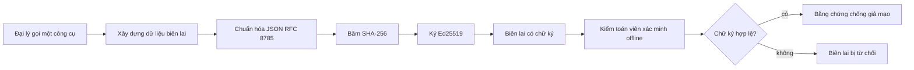
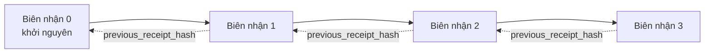

[Watch the lesson video: Bảo mật Tác nhân AI với Biên lai Mã hóa](https://youtu.be/PLACEHOLDER_VIDEO_ID)

> _(Video bài học và ảnh thu nhỏ sẽ được nhóm nội dung Microsoft thêm vào sau khi gộp, theo mẫu bài học 14 / 15.)_

# Bảo mật Tác nhân AI với Biên lai Mã hóa

## Giới thiệu

Bài học này sẽ đề cập đến:

- Tại sao dấu vết kiểm tra cho tác nhân AI lại quan trọng đối với tuân thủ, gỡ lỗi và niềm tin.
- Biên lai mã hóa là gì và nó khác với dòng nhật ký chưa ký như thế nào.
- Cách tạo biên lai có chữ ký cho cuộc gọi công cụ của tác nhân trong Python thuần.
- Cách xác minh biên lai ngoại tuyến và phát hiện giả mạo.
- Cách nối chuỗi biên lai sao cho việc xóa hoặc thay đổi thứ tự một biên lai sẽ phá vỡ chuỗi.
- Biên lai chứng minh điều gì và điều gì mà nó không chứng minh.

## Mục tiêu học tập

Sau khi hoàn thành bài học này, bạn sẽ biết cách:

- Xác định các chế độ lỗi thúc đẩy sự ra đời biên lai mã hóa cho các hành động của tác nhân.
- Tạo một biên lai được ký Ed25519 trên một payload JSON chuẩn.
- Xác minh biên lai một cách độc lập chỉ với khóa công khai của người ký.
- Phát hiện giả mạo bằng cách chạy lại xác minh trên biên lai đã bị sửa đổi.
- Xây dựng chuỗi biên lai có liên kết băm và giải thích lý do chuỗi quan trọng.
- Nhận biết ranh giới giữa những gì biên lai chứng minh (thuộc tính, tính toàn vẹn, thứ tự) và những gì không chứng minh (đúng đắn của hành động, hợp lý của chính sách).

## Vấn đề: Dấu vết Kiểm tra của Tác nhân của bạn

Hãy tưởng tượng bạn đã triển khai một tác nhân AI cho Contoso Travel. Tác nhân đọc yêu cầu khách hàng, gọi API chuyến bay để tra cứu lựa chọn và đặt chỗ thay cho khách hàng. Quý trước, tác nhân đã xử lý 50.000 đặt chỗ.

Hôm nay, một kiểm toán viên đến. Họ hỏi một câu đơn giản: "Cho tôi xem tác nhân của bạn đã làm gì."

Bạn giao các tập tin nhật ký cho họ. Kiểm toán viên xem qua và hỏi câu khó hơn: "Làm sao tôi biết các nhật ký này chưa bị chỉnh sửa?"

Đây là vấn đề dấu vết kiểm tra. Hầu hết các triển khai tác nhân hiện nay dựa vào:

- **Nhật ký ứng dụng**: do chính tác nhân ghi lại, có thể chỉnh sửa bởi bất kỳ ai có quyền truy cập hệ thống tập tin.
- **Dịch vụ ghi nhật ký đám mây**: có tính phát hiện giả mạo ở cấp nền tảng nhưng chỉ khi kiểm toán viên tin tưởng nhà cung cấp nền tảng.
- **Nhật ký giao dịch cơ sở dữ liệu**: phù hợp để thay đổi dữ liệu cơ sở dữ liệu nhưng không phải cho các cuộc gọi công cụ tùy ý.

Không phương pháp nào trong số này trả lời được câu hỏi của kiểm toán viên nếu không yêu cầu kiểm toán viên tin tưởng ai đó (bạn, nhà cung cấp đám mây, nhà cung cấp cơ sở dữ liệu). Đối với sử dụng nội bộ, sự tin tưởng đó thường được chấp nhận. Đối với các khối lượng công việc có quy định (tài chính, chăm sóc sức khỏe, bất cứ thứ gì chịu Luật AI EU), thì không.

Biên lai mã hóa giải quyết vấn đề này bằng cách làm cho mỗi hành động của tác nhân trở nên có thể xác minh độc lập. Kiểm toán viên không cần tin bạn. Họ chỉ cần khóa công khai của bạn và biên lai đó.

## Biên lai Mã hóa là gì?

Biên lai là một đối tượng JSON ghi lại những gì tác nhân đã làm, có chữ ký số.



Một biên lai tối giản trông như sau:

```json
{
  "type": "agent.tool_call.v1",
  "agent_id": "contoso-travel-bot",
  "tool_name": "lookup_flights",
  "tool_args_hash": "sha256:a3f9c1...",
  "result_hash": "sha256:7b2e1d...",
  "policy_id": "contoso-travel-policy-v3",
  "timestamp": "2026-04-25T14:30:00Z",
  "sequence": 47,
  "previous_receipt_hash": "sha256:9d4e6a...",
  "signature": {
    "alg": "EdDSA",
    "sig": "c5af83...",
    "public_key": "8f3b2c..."
  }
}
```

Ba thuộc tính làm nên tính năng:

1. **Chữ ký**. Biên lai được ký bởi gateway của tác nhân bằng khóa riêng Ed25519. Bất cứ ai có khóa công khai tương ứng có thể xác minh chữ ký ngoại tuyến. Sửa đổi bất kỳ trường nào làm chữ ký không hợp lệ.

2. **Mã hóa chuẩn hóa**. Trước khi ký, biên lai được tuần tự hóa dùng JSON Canonicalization Scheme (JCS, RFC 8785). Điều này đảm bảo hai triển khai tạo ra cùng một biên lai logic sẽ sản xuất dữ liệu byte giống hệt nhau. Nếu không chuẩn hóa, các trình tuần tự JSON khác nhau sẽ tạo ra các chữ ký khác nhau cho cùng nội dung.

3. **Chuỗi băm**. Trường `previous_receipt_hash` liên kết mỗi biên lai với biên lai trước đó. Việc xóa hoặc thay đổi thứ tự một biên lai sẽ phá vỡ tất cả các biên lai tiếp theo. Việc giả mạo trở nên hiển nhiên ở mức chuỗi ngay cả khi các chữ ký riêng lẻ bị bỏ qua.

Ba thuộc tính này cùng đảm bảo ba điều:

- **Thuộc tính**: khóa này đã ký nội dung này.
- **Tính toàn vẹn**: nội dung không thay đổi kể từ khi ký.
- **Thứ tự**: biên lai này được tạo sau biên lai kia trong chuỗi.

## Tạo Biên lai bằng Python

Bạn không cần thư viện đặc biệt để tạo biên lai. Các hàm mật mã cơ bản rất phổ biến và logic chỉ là vài chục dòng Python.

Các bài tập thực hành trong `code_samples/18-signed-receipts.ipynb` hướng dẫn toàn bộ quy trình. Phiên bản tóm tắt:

```python
import json
import hashlib
import base64
from nacl import signing
from jcs import canonicalize  # JSON chuẩn RFC 8785

def b64url_nopad(data: bytes) -> str:
    return base64.urlsafe_b64encode(data).decode("ascii").rstrip("=")

def sha256_canonical(obj) -> str:
    """SHA-256 of a Python object's JCS-canonical JSON form."""
    return f"sha256:{hashlib.sha256(canonicalize(obj)).hexdigest()}"

# Tạo hoặc tải khóa ký (trong môi trường sản xuất, lưu trong kho khóa)
signing_key = signing.SigningKey.generate()
verify_key = signing_key.verify_key

# Xây dựng payload biên nhận (chưa ký)
tool_args = {"origin": "SYD", "destination": "LAX"}
tool_result = [{"flight": "QF11", "price": 1850, "stops": 0}]

payload = {
    "type": "agent.tool_call.v1",
    "agent_id": "contoso-travel-bot",
    "tool_name": "lookup_flights",
    "tool_args_hash": sha256_canonical(tool_args),
    "result_hash": sha256_canonical(tool_result),
    "policy_id": "contoso-travel-policy-v3",
    "timestamp": "2026-04-25T14:30:00Z",
    "sequence": 0,
    "previous_receipt_hash": None,
}

# Chuẩn hóa, băm, ký.
canonical_bytes = canonicalize(payload)
message_hash = hashlib.sha256(canonical_bytes).digest()
signature_bytes = signing_key.sign(message_hash).signature

# Đính kèm đối tượng chữ ký có cấu trúc.
receipt = {
    **payload,
    "signature": {
        "alg": "EdDSA",
        "sig": b64url_nopad(signature_bytes),
        "public_key": b64url_nopad(bytes(verify_key)),
    },
}
```

Đó là toàn bộ pipeline ký. Các bài tập trong sổ tay sẽ đi qua từng bước.

## Xác minh Biên lai và Phát hiện Giả mạo

Xác minh là thao tác ngược lại:

```python
import base64
import hashlib
from nacl import signing
from nacl.exceptions import BadSignatureError
from jcs import canonicalize

def b64url_decode(s: str) -> bytes:
    padding = "=" * ((4 - len(s) % 4) % 4)
    return base64.urlsafe_b64decode(s + padding)

def verify_receipt(receipt: dict) -> bool:
    # Chữ ký là một đối tượng có cấu trúc: {"alg", "sig", "public_key"}.
    sig_obj = receipt.get("signature")
    if not sig_obj or sig_obj.get("alg") != "EdDSA":
        return False

    # Tái tạo lại phần payload đã được ký thực tế (mọi thứ ngoại trừ chữ ký).
    payload = {k: v for k, v in receipt.items() if k != "signature"}

    canonical_bytes = canonicalize(payload)
    message_hash = hashlib.sha256(canonical_bytes).digest()

    try:
        verify_key = signing.VerifyKey(b64url_decode(sig_obj["public_key"]))
        verify_key.verify(message_hash, b64url_decode(sig_obj["sig"]))
        return True
    except BadSignatureError:
        return False
```

Hàm này nhận một biên lai và trả về `True` nếu chữ ký hợp lệ, `False` nếu không. Không gọi mạng, không phụ thuộc dịch vụ, không cần tin tưởng bên thứ ba nào.

Để thấy việc phát hiện giả mạo vận hành thế nào, sổ tay hướng dẫn:

1. Tạo ra biên lai hợp lệ và xác nhận nó được xác minh.
2. Sửa đổi một byte trong trường `tool_args_hash`.
3. Xác minh lại và thấy nó không hợp lệ.

Đây là minh chứng thực tế rằng biên lai phát hiện giả mạo: bất kỳ sửa đổi nào dù nhỏ làm chữ ký không hợp lệ.

## Nối Chuỗi Biên lai cho Tác nhân Nhiều Bước

Một biên lai ký bảo vệ một hành động. Một chuỗi biên lai bảo vệ cả chuỗi hành động.



Mỗi biên lai ghi lại băm của biên lai trước đó. Để lặng lẽ xóa biên lai số 2, kẻ tấn công sẽ cần:

- Sửa trường `previous_receipt_hash` của biên lai 3 (phá vỡ chữ ký biên lai 3), HOẶC
- Giả mạo một chữ ký mới trên biên lai 3 đã sửa (cần khóa riêng của tác nhân).

Nếu khóa riêng nằm trong khoá phần cứng và bạn công bố khóa công khai với mỗi biên lai, thì không thể thực hiện hai cuộc tấn công đó mà không bị phát hiện.

Sổ tay thực hiện:

1. Xây dựng chuỗi ba biên lai.
2. Xác minh rằng trường `previous_receipt_hash` của mỗi biên lai khớp với băm thực tế của biên lai trước đó.
3. Thay đổi một biên lai ở giữa và thấy chuỗi bị phá vỡ đúng tại điểm đó.

Đây là cách bạn tạo dấu vết kiểm tra để kiểm toán viên bên ngoài có thể xác minh mà không cần tin bạn.

## Biên lai Chứng minh điều gì (và điều gì không)

Đây là phần quan trọng nhất của bài học. Biên lai rất mạnh nhưng sức mạnh có giới hạn.

**Biên lai chứng minh ba điều:**

1. **Thuộc tính**: một khóa cụ thể đã ký một payload cụ thể.
2. **Tính toàn vẹn**: payload không thay đổi kể từ khi ký.
3. **Thứ tự**: biên lai này đến sau biên lai kia trong chuỗi băm.

**Biên lai KHÔNG chứng minh:**

1. **Đúng đắn**: rằng hành động của tác nhân là hành động đúng. Biên lai có thể được ký cho một kết quả sai như dễ dàng như với kết quả đúng.
2. **Tuân thủ chính sách**: rằng chính sách được tham chiếu trong `policy_id` đã được đánh giá, hay rằng chính sách đó sẽ cho phép hành động này nếu được kiểm tra. Biên lai ghi lại những điều đã tuyên bố, không phải những điều được thi hành.
3. **Danh tính vượt ngoài khóa**: biên lai nói "khóa này đã ký nội dung này." Nó không nói "con người này đã ủy quyền." Kết nối một khóa với con người hoặc tổ chức đòi hỏi hạ tầng danh tính riêng (thư mục, đăng ký khóa công khai, v.v).
4. **Tính chân thực của đầu vào**: nếu tác nhân nhận được lời nhắc bị chỉnh sửa và hành động theo đó, biên lai ghi lại hành động đó trung thực. Biên lai là bước hạ lưu của xác thực đầu vào, không thay thế xác thực đó.

Ranh giới này quan trọng vì hai lý do:

- Nó cho bạn biết biên lai hữu ích cho việc gì: làm cho hành vi tác nhân có thể kiểm toán và phát hiện giả mạo, ngay cả khi qua ranh giới tổ chức.
- Nó cũng cho biết các lớp bổ sung bạn vẫn cần: xác thực đầu vào (Bài học 6), thi hành chính sách (đã đề cập sơ qua bên dưới), và hạ tầng danh tính (ngoài phạm vi bài học này).

Một lỗi phổ biến là cho rằng "chúng ta có biên lai" nghĩa là "chúng ta có quản trị." Không phải vậy. Biên lai là nền tảng. Quản trị là hệ thống bạn xây dựng trên nền tảng đó.

## Tham chiếu Sản xuất

Mã Python trong bài học này được thiết kế tối giản để bạn có thể đọc từng dòng và hiểu rõ điều xảy ra. Trong sản xuất, bạn có hai lựa chọn:

1. **Xây dựng trực tiếp trên các hàm mật mã cơ bản.** 50 dòng bạn thấy ở trên đủ cho nhiều trường hợp sử dụng. PyNaCl (Ed25519) và gói `jcs` (JSON chuẩn hóa) là thư viện được duy trì và kiểm tra tốt.

2. **Dùng thư viện biên lai sản xuất.** Một số dự án mã nguồn mở thực hiện mẫu tương tự với các tính năng bổ sung (đổi khóa, xác minh hàng loạt, phân phối bộ JWK, tích hợp với động cơ chính sách):
   - Định dạng biên lai trong bài học này theo một IETF Internet-Draft (`draft-farley-acta-signed-receipts`) đang trong quá trình chuẩn hóa.
   - Bộ công cụ Quản trị Tác nhân Microsoft hợp thành biên lai với quyết định chính sách dựa trên Cedar; xem Hướng dẫn 33 trong kho lưu trữ đó để có ví dụ đầu-cuối.
   - Các gói `protect-mcp` (npm) và `@veritasacta/verify` (npm) cung cấp triển khai trên Node của việc ký biên lai và xác minh ngoại tuyến, dùng để bao quanh bất kỳ máy chủ MCP nào với dấu vết kiểm toán phát hiện giả mạo.
   - **[nobulex](https://github.com/arian-gogani/nobulex)** SDK Python (`pip install nobulex`) cung cấp mẫu ký Ed25519 + JCS tương tự trong Python với tích hợp LangChain và CrewAI, bao gồm vector kiểm tra ngang và bản đồ tuân thủ đóng góp qua [OWASP PR #2210](https://github.com/OWASP/CheatSheetSeries/pull/2210).

Việc lựa chọn tự viết hoặc dùng thư viện tương tự như quyết định giữa viết thư viện JWT riêng và dùng thư viện đã kiểm thử: cả hai đều hợp lý; thư viện tiết kiệm thời gian và giảm bề mặt kiểm toán; viết từ đầu buộc bạn hiểu mọi hàm cơ bản. Bài học này dạy từ đầu để bạn có nền tảng cho cả hai lựa chọn.

## Kiểm tra Kiến thức

Kiểm tra hiểu biết của bạn trước khi chuyển sang bài tập thực hành.

**1. Biên lai được ký bằng khóa riêng Ed25519 của tác nhân. Kiểm toán viên chỉ có khóa công khai. Liệu kiểm toán viên có thể xác minh biên lai ngoại tuyến không?**

<details>
<summary>Đáp án</summary>

Có. Xác minh Ed25519 chỉ cần khóa công khai và các byte đã ký. Không gọi mạng, không phụ thuộc dịch vụ. Đây là tính năng làm biên lai hữu ích trong môi trường ngắt mạng, đa tổ chức, hoặc kiểm toán ít tin cậy.
</details>

**2. Kẻ tấn công sửa đổi trường `policy_id` trong biên lai để tuyên bố nó chịu chính sách ít nghiêm ngặt hơn. Chữ ký là trên payload gốc. Điều gì xảy ra khi xác minh?**

<details>
<summary>Đáp án</summary>

Xác minh thất bại. Chữ ký được tính trên các byte chuẩn hóa của payload gốc; sửa đổi bất kỳ trường nào thay đổi các byte chuẩn hóa, làm thay đổi băm SHA-256, khiến chữ ký không hợp lệ. Kẻ tấn công cần khóa riêng để tạo chữ ký mới hợp lệ, mà họ không có.
</details>

**3. Tại sao biên lai lại bao gồm `tool_args_hash` và `result_hash` thay vì các đối số và kết quả thô?**

<details>
<summary>Đáp án</summary>

Hai lý do. Thứ nhất, biên lai có thể cần lưu trữ hoặc truyền trong môi trường mà việc lộ nội dung thô (thông tin cá nhân, dữ liệu kinh doanh) là vấn đề. Băm giữ biên lai nhỏ và nội dung riêng tư; kiểm toán viên xác minh băm khớp với bản sao lưu trữ riêng của nội dung thực. Thứ hai, băm có kích thước cố định; biên lai có băm có kích thước giới hạn bất kể đầu vào đầu ra lớn cỡ nào.
</details>

**4. Trường `previous_receipt_hash` liên kết mỗi biên lai với biên lai trước đó. Nếu kẻ tấn công âm thầm xóa một biên lai ở giữa chuỗi, điều gì trở nên không hợp lệ?**

<details>
<summary>Đáp án</summary>

Mỗi biên lai sau biên lai bị xóa. Trường `previous_receipt_hash` của chúng không còn khớp với chuỗi thực tế (vì biên lai mà chúng tham chiếu đã không còn, hoặc chuỗi giờ liên kết với biên lai tiền nhiệm khác). Để che dấu việc xóa, kẻ tấn công phải ký lại tất cả các biên lai sau đó, điều này cần khóa riêng.
</details>

**5. Biên lai xác minh sạch. Liệu điều đó có chứng minh hành động của tác nhân là đúng, hợp lý, hoặc tuân thủ chính sách không?**

<details>
<summary>Đáp án</summary>

Không. Biên lai hợp lệ chứng minh ba điều: thuộc tính (khóa này đã ký nội dung này), tính toàn vẹn (nội dung không đổi), và thứ tự (biên lai này đến sau biên lai kia). Nó KHÔNG chứng minh rằng hành động đúng, rằng chính sách ghi trong `policy_id` đã được đánh giá, hay rằng tác nhân tuân thủ mọi quy tắc. Biên lai giúp hành vi tác nhân có thể kiểm toán, không nhất thiết đúng. Đây là ranh giới quan trọng nhất trong bài học.
</details>

## Bài tập Thực hành

Mở `code_samples/18-signed-receipts.ipynb` và hoàn thành bốn phần sau:

1. **Phần 1**: Ký biên lai đầu tiên và xác minh nó.
2. **Phần 2**: Can thiệp vào biên lai và quan sát xác minh thất bại.
3. **Phần 3**: Xây chuỗi ba biên lai và xác minh tính toàn vẹn chuỗi.
4. **Phần 4**: Áp dụng mẫu cho tác nhân xây dựng bằng Microsoft Agent Framework: bao bọc cuộc gọi công cụ trong ký biên lai, rồi xác minh biên lai một cách độc lập.
**Thử thách nâng cao 1:** mở rộng lược đồ biên lai với một trường bổ sung do bạn chọn (ví dụ, một ID yêu cầu để truy vết), cập nhật logic ký chuẩn để bao gồm trường đó, và xác nhận rằng biên lai vẫn có thể xác minh hai chiều thành công. Sau đó sửa đổi trường này sau khi ký và xác nhận xác minh thất bại. Điều này buộc bạn phải hiểu cách mọi byte của mã hóa chuẩn góp phần vào chữ ký.

**Thử thách nâng cao 2:** Băm SHA-256 hai biên lai của bạn với nhau (nối byte chuẩn của chúng theo thứ tự xác định được) và nhúng giá trị băm kết quả như một trường mới trên biên lai thứ ba trước khi ký nó. Xác nhận tất cả ba biên lai vẫn xác minh hai chiều được. Bạn vừa xây dựng một bằng chứng bao hàm một bước: bất kỳ ai có biên lai thứ ba đều có thể chứng minh biên lai thứ nhất và thứ hai đã tồn tại vào thời điểm nó được ký, mà không cần phải tiết lộ nội dung. Đây là mô hình mà biên lai tiết lộ chọn lọc sử dụng ở quy mô lớn (Cam kết Merkle, RFC 6962).

## Kết luận

Biên lai mã hóa cung cấp cho các đại lý AI một dấu vết kiểm toán:

- **Có thể xác minh độc lập**: bất kỳ bên nào có khóa công khai đều có thể xác minh, không phụ thuộc dịch vụ nào.
- **Có thể phát hiện sửa đổi**: bất kỳ thay đổi nào cũng làm chữ ký không hợp lệ.
- **Có thể mang theo**: biên lai là một tập tin JSON nhỏ; có thể lưu trữ, truyền tải và xác minh ở bất cứ đâu.
- **Phù hợp với tiêu chuẩn**: xây dựng trên Ed25519 (RFC 8032), JCS (RFC 8785), và SHA-256, các nguyên thủy được triển khai rộng rãi.

Chúng không thay thế cho việc kiểm tra đầu vào, thực thi chính sách, hoặc hạ tầng nhận dạng. Chúng là nền tảng cho những lớp đó. Khi bạn triển khai đại lý vào các khối công việc có quy định, luồng công việc đa tổ chức, hoặc bất kỳ môi trường nào mà người kiểm toán tương lai không thể cho là tin tưởng bạn, biên lai là cách bạn làm cho dấu vết kiểm toán trở nên trung thực.

Điều quan trọng nhất cần ghi nhớ: biên lai chứng minh ai đã nói gì, khi nào. Chúng không chứng minh rằng những gì được nói là đúng hay chính xác. Hãy giữ sự phân biệt đó rõ ràng. Đó là sự khác biệt giữa một hệ thống xuất xứ trung thực và một hệ thống gây hiểu lầm.

## Danh sách kiểm tra khi đưa vào sản xuất

Khi bạn sẵn sàng ra khỏi bài học này để triển khai đại lý ký biên lai trong môi trường thực:

- [ ] **Chuyển khóa ký ra khỏi máy lập trình viên.** Sử dụng Azure Key Vault, AWS KMS, hoặc thiết bị bảo mật phần cứng. Khóa riêng dùng để ký biên lai tuyệt đối không được lưu trong mã nguồn hay dưới dạng văn bản thuần trên máy ứng dụng.
- [ ] **Công bố khóa công khai để xác minh.** Người kiểm toán cần để xác minh ngoại tuyến. Mẫu tiêu chuẩn là một JWK Set tại URL chuẩn được biết (RFC 7517), ví dụ `https://your-org.example.com/.well-known/agent-keys.json`.
- [ ] **Mỏ neo chuỗi ra bên ngoài.** Định kỳ ghi lại băm đầu chuỗi mới nhất vào nhật ký minh bạch (Sigstore Rekor, cơ quan đánh dấu thời gian RFC 3161, hoặc hệ thống nội bộ thứ hai) để bên ngoài có thể xác nhận "chuỗi này tồn tại tại thời điểm này."
- [ ] **Lưu trữ biên lai không thay đổi được.** Bộ nhớ blob chỉ thêm (Azure Storage với chính sách không thay đổi, AWS S3 Object Lock) ngăn người trong nội bộ sửa đổi lịch sử ở tầng lưu trữ.
- [ ] **Quyết định thời gian lưu trữ.** Nhiều chế độ tuân thủ yêu cầu lưu giữ nhiều năm. Lên kế hoạch cho sự tăng trưởng biên lai (mỗi biên lai ~500 byte; một đại lý thực hiện 10.000 cuộc gọi mỗi ngày tạo ra ~1,8 GB mỗi năm).
- [ ] **Ghi chú rõ những gì biên lai không bao gồm.** Biên lai chứng minh sự gán nhận, tính toàn vẹn và thứ tự. Quy trình của bạn nên liệt kê rõ các kiểm soát bổ sung (kiểm tra đầu vào, thực thi chính sách, giới hạn tỷ lệ, hạ tầng nhận diện) đi kèm với biên lai trong chính sách quản trị của bạn.

### Có thêm câu hỏi về bảo mật đại lý AI?

Tham gia [Microsoft Foundry Discord](https://aka.ms/ai-agents/discord) để gặp gỡ các học viên khác, tham dự giờ tư vấn, và giải đáp thắc mắc về đại lý AI.

## Ngoài bài học này

Bài học này đề cập đến ký một biên lai đơn và chuỗi băm nối tiếp. Các nguyên thủy tương tự phối hợp thành nhiều mô hình nâng cao mà bạn có thể gặp khi chính sách quản trị của bạn trưởng thành:

- **Tiết lộ có chọn lọc.** Khi các trường trong biên lai được cam kết độc lập (cây Merkle kiểu RFC 6962), bạn có thể tiết lộ các trường cụ thể cho các kiểm toán viên cụ thể và chứng minh phần còn lại không thay đổi mà không tiết lộ chúng. Hữu ích khi cùng một biên lai phải đáp ứng cả kiểm toán toàn diện (yêu cầu đầy đủ) và quy định giảm thiểu dữ liệu như GDPR (cho phép kiểm toán viên chỉ xem những gì cần thiết).
- **Thu hồi biên lai.** Nếu khóa ký bị lộ, bạn cần cách đánh dấu tất cả biên lai ký bằng khóa đó là không tin cậy từ một thời điểm trở đi. Mẫu phổ biến: khóa ký có thời hạn ngắn kèm danh sách thu hồi công khai, hoặc nhật ký minh bạch với các mục thu hồi.
- **Biên lai ký hai bên / chia nhỏ.** Một số thực thi chia tải trọng ký thành hai phần trước thực thi (`authorization_*`) và sau thực thi (`result_*`) với chữ ký riêng biệt, hữu ích khi quyết định ủy quyền và kết quả quan sát do các tác nhân khác nhau tạo ra hoặc tại các thời điểm khác nhau. Điều này thêm vào cấu trúc biên lai được dạy trong bài học này.
- **Tổ hợp tải trọng.** Một biên lai niêm phong bất kỳ dữ liệu byte nào bạn cho vào `result_hash`. Tải trọng thế giới thực thường phong phú hơn kết quả lệnh đơn giản: lý luận trước quyết định (dự đoán mô hình, các lựa chọn đã xem xét, bằng chứng và mức độ đầy đủ, tư thế rủi ro, chuỗi trách nhiệm, kết quả kiểm soát) đều có thể nằm trong tải trọng, niêm phong trong một biên lai duy nhất. Điều này giữ định dạng biên lai tối giản trong khi cho phép các lược đồ tải trọng tiến hóa theo từng lĩnh vực.
- **Tuân thủ đa thực thi.** Nhiều thực thi độc lập của cùng định dạng biên lai (Python, TypeScript, Rust, Go) xác minh chéo dựa trên bộ kiểm thử chung. Nếu bạn xây dựng thực thi riêng, xác thực theo bộ kiểm thử công khai giúp đảm bảo tương thích định dạng.
- **Di cư hậu lượng tử.** Ed25519 hiện được triển khai rộng nhưng không kháng lượng tử. Định dạng biên lai linh hoạt về thuật toán: trường `signature.alg` có thể mang `ML-DSA-65` (chuẩn chữ ký hậu lượng tử của NIST) khi bạn cần di cư. Lên kế hoạch cho giai đoạn chuyển tiếp với biên lai ký kép.

## Tài nguyên bổ sung

- <a href="https://datatracker.ietf.org/doc/draft-farley-acta-signed-receipts/" target="_blank">IETF Internet-Draft: Biên Lai Quyết Định Có Ký cho Kiểm Soát Truy Cập Máy-máy</a>
- <a href="https://learn.microsoft.com/azure/ai-studio/responsible-use-of-ai-overview" target="_blank">Tổng quan về AI có trách nhiệm (Azure AI)</a>
- <a href="https://datatracker.ietf.org/doc/html/rfc8032" target="_blank">RFC 8032: Thuật Toán Chữ Ký Số Đường Cong Edwards (EdDSA)</a>
- <a href="https://datatracker.ietf.org/doc/html/rfc8785" target="_blank">RFC 8785: Định Dạng Chuẩn Hóa JSON (JCS)</a>
- <a href="https://datatracker.ietf.org/doc/html/rfc6962" target="_blank">RFC 6962: Minh Bạch Chứng Chỉ</a> (cấu trúc cây Merkle dùng bởi biên lai tiết lộ chọn lọc)
- <a href="https://github.com/microsoft/agent-governance-toolkit/blob/main/docs/tutorials/33-offline-verifiable-receipts.md" target="_blank">Bộ Công Cụ Quản Trị Đại Lý Microsoft, Hướng dẫn 33: Biên Lai Quyết Định Có Thể Xác Minh Ngoại Tuyến</a>
- <a href="https://github.com/ScopeBlind/agent-governance-testvectors" target="_blank">Bộ kiểm thử tuân thủ đa thực thi</a> cho định dạng biên lai dùng trong bài học này (Apache-2.0)
- <a href="https://pynacl.readthedocs.io/" target="_blank">Tài liệu PyNaCl</a> (Ed25519 trên Python)

## Bài học trước

[Khởi tạo Đại Lý Sử Dụng Máy Tính (CUA)](../15-browser-use/README.md)

## Bài học tiếp theo

_(Được xác định bởi người quản lý chương trình học)_

---

<!-- CO-OP TRANSLATOR DISCLAIMER START -->
**Tuyên bố miễn trừ trách nhiệm**:
Tài liệu này đã được dịch bằng dịch vụ dịch thuật AI [Co-op Translator](https://github.com/Azure/co-op-translator). Mặc dù chúng tôi cố gắng đảm bảo độ chính xác, xin lưu ý rằng bản dịch tự động có thể chứa lỗi hoặc sai sót. Tài liệu gốc bằng ngôn ngữ gốc nên được coi là nguồn tin chính thức. Đối với thông tin quan trọng, nên sử dụng dịch vụ dịch thuật chuyên nghiệp bởi con người. Chúng tôi không chịu trách nhiệm về bất kỳ hiểu lầm hoặc giải thích sai nào phát sinh từ việc sử dụng bản dịch này.
<!-- CO-OP TRANSLATOR DISCLAIMER END -->