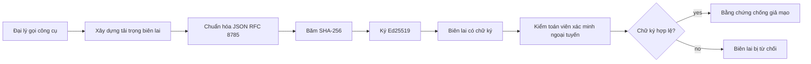
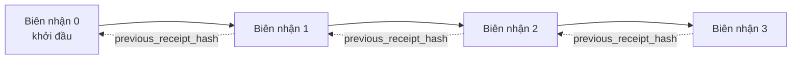

[Watch the lesson video: Bảo mật Đại lý AI với Biên lai Mã hóa](https://youtu.be/PLACEHOLDER_VIDEO_ID)

> _(Video bài học và hình thu nhỏ sẽ được nhóm nội dung Microsoft thêm sau khi gộp, theo mẫu bài học 14 / 15.)_

# Bảo mật Đại lý AI với Biên lai Mã hóa

## Giới thiệu

Bài học này sẽ bao gồm:

- Tại sao các dấu vết kiểm toán đối với đại lý AI lại quan trọng cho việc tuân thủ, gỡ lỗi và tin cậy.
- Biên lai mã hóa là gì và nó khác với một dòng nhật ký chưa ký như thế nào.
- Cách tạo biên lai đã ký cho cuộc gọi công cụ của đại lý bằng Python thuần túy.
- Cách xác minh biên lai ngoại tuyến và phát hiện gian lận.
- Cách liên kết các biên lai sao cho việc loại bỏ hoặc thay đổi thứ tự một biên lai sẽ phá vỡ chuỗi.
- Biên lai chứng minh điều gì và điều gì chúng không chứng minh rõ ràng.

## Mục tiêu học tập

Sau khi hoàn thành bài học này, bạn sẽ biết cách:

- Xác định các chế độ lỗi thúc đẩy việc tạo nguồn gốc mã hóa cho các hành động của đại lý.
- Tạo biên lai đã ký Ed25519 trên một payload JSON tiêu chuẩn.
- Xác minh biên lai một cách độc lập chỉ sử dụng khóa công khai của người ký.
- Phát hiện gian lận bằng cách chạy lại xác minh trên một biên lai bị sửa đổi.
- Xây dựng chuỗi biên lai liên kết hàm băm và giải thích tại sao chuỗi lại quan trọng.
- Nhận biết ranh giới giữa những gì biên lai chứng minh (thuộc tính, tính toàn vẹn, thứ tự) và những gì chúng không chứng minh (độ chính xác của hành động, tính đúng đắn của chính sách).

## Vấn đề: Dấu vết kiểm toán của Đại lý bạn

Hãy tưởng tượng bạn đã triển khai một đại lý AI cho Contoso Travel. Đại lý nghe yêu cầu của khách, gọi API chuyến bay để tra cứu các lựa chọn và đặt chỗ thay mặt khách. Quý trước, đại lý đã xử lý 50.000 lượt đặt chỗ.

Hôm nay, một kiểm toán viên đến. Họ hỏi một câu đơn giản: "Cho tôi xem đại lý của bạn đã làm gì."

Bạn giao nộp các tệp nhật ký. Kiểm toán viên xem chúng và hỏi câu khó hơn: "Làm sao tôi biết những nhật ký này không bị sửa đổi?"

Đây chính là vấn đề dấu vết kiểm toán. Hầu hết các triển khai đại lý hiện nay dựa vào:

- **Nhật ký ứng dụng**: do chính đại lý ghi, có thể chỉnh sửa bởi bất cứ ai có quyền truy cập hệ thống tệp.
- **Dịch vụ ghi nhật ký đám mây**: có thể phát hiện chỉnh sửa ở cấp nền tảng nhưng chỉ khi kiểm toán viên tin tưởng nhà điều hành nền tảng.
- **Nhật ký giao dịch cơ sở dữ liệu**: phù hợp để ghi thay đổi cơ sở dữ liệu nhưng không áp dụng cho các cuộc gọi công cụ tùy ý.

Không giải pháp nào trong số này có thể trả lời câu hỏi của kiểm toán viên mà không yêu cầu sự tin tưởng vào ai đó (bạn, nhà cung cấp đám mây, nhà cung cấp cơ sở dữ liệu). Với sử dụng nội bộ, sự tin tưởng này thường chấp nhận được. Với khối lượng công việc bị quy định (tài chính, y tế, bất cứ thứ gì chịu tác động của Luật AI EU), thì không thể.

Biên lai mã hóa giải quyết điều này bằng cách khiến mỗi hành động của đại lý có thể được xác minh độc lập. Kiểm toán viên không cần tin bạn. Họ chỉ cần khóa công khai và biên lai.

## Biên lai Mã hóa là gì?

Biên lai là một đối tượng JSON ghi lại những gì đại lý đã làm, được ký bằng chữ ký số.



Một biên lai tối thiểu trông như sau:

```json
{
  "type": "agent.tool_call.v1",
  "agent_id": "contoso-travel-bot",
  "tool_name": "lookup_flights",
  "tool_args_hash": "sha256:a3f9c1...",
  "result_hash": "sha256:7b2e1d...",
  "policy_id": "contoso-travel-policy-v3",
  "timestamp": "2026-04-25T14:30:00Z",
  "sequence": 47,
  "previous_receipt_hash": "sha256:9d4e6a...",
  "signature": {
    "alg": "EdDSA",
    "sig": "c5af83...",
    "public_key": "8f3b2c..."
  }
}
```

Ba thuộc tính thực hiện công việc:

1. **Chữ ký**. Biên lai được ký bởi cổng đại lý sử dụng khóa riêng Ed25519. Bất cứ ai có khóa công khai tương ứng đều có thể xác minh chữ ký ngoại tuyến. Việc chỉnh sửa bất kỳ trường nào khiến chữ ký không hợp lệ.

2. **Mã hóa chuẩn hóa**. Trước khi ký, biên lai được tuần tự hóa theo JSON Canonicalization Scheme (JCS, RFC 8785). Điều này đảm bảo hai triển khai tạo cùng một biên lai logic sẽ tạo ra đầu ra byte-identical. Nếu không chuẩn hóa, các trình tuần tự hóa JSON khác nhau sẽ tạo ra chữ ký khác nhau cho cùng nội dung.

3. **Liên kết hàm băm**. Trường `previous_receipt_hash` liên kết mỗi biên lai với biên lai trước nó. Việc loại bỏ hoặc thay đổi thứ tự một biên lai sẽ phá vỡ các biên lai đến sau đó. Gian lận trở nên dễ thấy ở cấp chuỗi ngay cả khi vượt qua được chữ ký đơn lẻ.

Cùng nhau, các thuộc tính này cung cấp ba đảm bảo:

- **Thuộc tính**: khóa này đã ký nội dung này.
- **Tính toàn vẹn**: nội dung không thay đổi kể từ khi ký.
- **Thứ tự**: biên lai này đến sau biên lai kia trong chuỗi.

## Tạo một Biên lai trong Python

Bạn không cần thư viện đặc biệt để tạo biên lai. Các nguyên thủy mã hóa phổ biến và logic chỉ dài vài chục dòng Python.

Các bài tập thực hành trong `code_samples/18-signed-receipts.ipynb` sẽ hướng dẫn toàn bộ quy trình. Phiên bản tóm tắt:

```python
import json
import hashlib
import base64
from nacl import signing
from jcs import canonicalize  # JSON chuẩn RFC 8785

def b64url_nopad(data: bytes) -> str:
    return base64.urlsafe_b64encode(data).decode("ascii").rstrip("=")

def sha256_canonical(obj) -> str:
    """SHA-256 of a Python object's JCS-canonical JSON form."""
    return f"sha256:{hashlib.sha256(canonicalize(obj)).hexdigest()}"

# Tạo hoặc tải khóa ký (trong môi trường sản xuất, lưu trữ trong kho khóa)
signing_key = signing.SigningKey.generate()
verify_key = signing_key.verify_key

# Xây dựng nội dung biên lai (chưa có chữ ký)
tool_args = {"origin": "SYD", "destination": "LAX"}
tool_result = [{"flight": "QF11", "price": 1850, "stops": 0}]

payload = {
    "type": "agent.tool_call.v1",
    "agent_id": "contoso-travel-bot",
    "tool_name": "lookup_flights",
    "tool_args_hash": sha256_canonical(tool_args),
    "result_hash": sha256_canonical(tool_result),
    "policy_id": "contoso-travel-policy-v3",
    "timestamp": "2026-04-25T14:30:00Z",
    "sequence": 0,
    "previous_receipt_hash": None,
}

# Chuẩn hóa, băm, ký.
canonical_bytes = canonicalize(payload)
message_hash = hashlib.sha256(canonical_bytes).digest()
signature_bytes = signing_key.sign(message_hash).signature

# Đính kèm một đối tượng chữ ký có cấu trúc.
receipt = {
    **payload,
    "signature": {
        "alg": "EdDSA",
        "sig": b64url_nopad(signature_bytes),
        "public_key": b64url_nopad(bytes(verify_key)),
    },
}
```

Đó là toàn bộ đường dẫn ký. Các bài tập trong notebook sẽ lần lượt qua từng bước.

## Xác minh Biên lai và Phát hiện Gian lận

Xác minh là thao tác nghịch đảo:

```python
import base64
import hashlib
from nacl import signing
from nacl.exceptions import BadSignatureError
from jcs import canonicalize

def b64url_decode(s: str) -> bytes:
    padding = "=" * ((4 - len(s) % 4) % 4)
    return base64.urlsafe_b64decode(s + padding)

def verify_receipt(receipt: dict) -> bool:
    # Chữ ký là một đối tượng có cấu trúc: {"alg", "sig", "public_key"}.
    sig_obj = receipt.get("signature")
    if not sig_obj or sig_obj.get("alg") != "EdDSA":
        return False

    # Tái tạo lại phần payload thực sự đã được ký (mọi thứ ngoại trừ chữ ký).
    payload = {k: v for k, v in receipt.items() if k != "signature"}

    canonical_bytes = canonicalize(payload)
    message_hash = hashlib.sha256(canonical_bytes).digest()

    try:
        verify_key = signing.VerifyKey(b64url_decode(sig_obj["public_key"]))
        verify_key.verify(message_hash, b64url_decode(sig_obj["sig"]))
        return True
    except BadSignatureError:
        return False
```

Hàm này nhận một biên lai và trả về `True` nếu chữ ký hợp lệ, `False` nếu không. Không gọi mạng, không phụ thuộc dịch vụ, không phải tin tưởng bất kỳ bên thứ ba nào.

Để thấy ví dụ về phát hiện gian lận, notebook sẽ hướng dẫn:

1. Tạo biên lai hợp lệ và xác nhận nó xác minh được.
2. Thay đổi một byte của trường `tool_args_hash`.
3. Chạy lại xác minh và thấy nó thất bại.

Đây là minh chứng thực tế rằng biên lai dễ phát hiện chỉnh sửa: bất kỳ sửa đổi nào, dù nhỏ, cũng làm vỡ chữ ký.

## Liên kết Biên lai cho Đại lý Nhiều Bước

Một biên lai đã ký bảo vệ một hành động. Một chuỗi biên lai bảo vệ một chuỗi hành động.



Mỗi biên lai ghi hàm băm của biên lai trước đó. Để lặng lẽ xóa biên lai số 2, kẻ tấn công sẽ phải:

- Thay đổi trường `previous_receipt_hash` của biên lai 3 (phá vỡ chữ ký của biên lai 3), HOẶC
- Giả mạo một chữ ký mới trên biên lai 3 đã sửa (cần khóa riêng của đại lý).

Nếu khóa riêng nằm trong khoá phần cứng và bạn công bố khóa công khai cùng mỗi biên lai, thì cả hai cuộc tấn công đều không thực hiện được mà không bị phát hiện.

Notebook sẽ hướng dẫn:

1. Xây dựng chuỗi gồm ba biên lai.
2. Xác minh rằng `previous_receipt_hash` của mỗi biên lai khớp với hàm băm thực của biên lai trước đó.
3. Sửa một biên lai ở giữa và thấy chuỗi bị phá vỡ ngay tại đó.

Đây là cách bạn tạo dấu vết kiểm toán mà kiểm toán viên bên ngoài có thể xác minh mà không cần tin bạn.

## Biên lai chứng minh điều gì (và điều gì không chứng minh)

Đây là phần quan trọng nhất của bài học. Biên lai rất mạnh nhưng quyền lực của chúng có giới hạn.

**Biên lai chứng minh ba điều:**

1. **Thuộc tính**: một khóa cụ thể đã ký một payload cụ thể.
2. **Tính toàn vẹn**: payload không thay đổi kể từ khi ký.
3. **Thứ tự**: biên lai này đến sau biên lai kia trong chuỗi hàm băm.

**Biên lai KHÔNG chứng minh:**

1. **Độ chính xác**: rằng hành động của đại lý là đúng đắn. Một biên lai có thể được ký cho câu trả lời sai cũng rõ ràng như câu trả lời đúng.
2. **Tuân thủ chính sách**: rằng chính sách được tham chiếu trong `policy_id` thực sự đã được đánh giá, hoặc rằng nó sẽ cho phép hành động này nếu được kiểm tra. Biên lai chỉ ghi lại những gì được tuyên bố, không phải những gì được thi hành.
3. **Nhận dạng ngoài khóa**: biên lai nói "khóa này đã ký nội dung này." Nó không nói "con người này đã ủy quyền." Kết nối khóa với cá nhân hoặc tổ chức cần hạ tầng nhận dạng riêng biệt (thư mục, đăng ký khóa công khai, v.v.).
4. **Tính trung thực của đầu vào**: nếu đại lý nhận một lời nhắc bị thao túng và thực hiện theo, biên lai ghi lại hành động một cách trung thực. Biên lai là bước sau của xác thực đầu vào, không phải thay thế cho nó.

Ranh giới này quan trọng vì hai lý do:

- Nó cho bạn biết biên lai hữu ích để làm gì: khiến hành vi đại lý có thể kiểm toán và phát hiện gian lận, ngay cả giữa các tổ chức khác nhau.
- Nó cho bạn biết các lớp bổ sung còn cần thiết: xác thực đầu vào (Bài học 6), thực thi chính sách (được nhắc đến ngắn gọn phía dưới), và hạ tầng nhận dạng (không thuộc phạm vi bài học này).

Một sai lầm phổ biến là nghĩ rằng "chúng ta có biên lai" nghĩa là "chúng ta được quản trị." Không phải vậy. Biên lai là nền tảng, quản trị là hệ thống bạn xây dựng lên trên đó.

## Tham khảo Sản xuất

Mã Python trong bài học này được giữ tối giản để bạn có thể đọc từng dòng và hiểu rõ điều gì đang xảy ra. Trong sản xuất, bạn có hai lựa chọn:

1. **Xây dựng trực tiếp trên nguyên thủy mật mã.** 50 dòng mã bạn thấy ở trên đủ cho nhiều trường hợp. PyNaCl (Ed25519) và gói `jcs` (JSON chuẩn hóa) là các thư viện được bảo trì và kiểm toán tốt.

2. **Sử dụng thư viện biên lai sản xuất.** Một số dự án nguồn mở triển khai cùng mẫu này với các tính năng bổ sung (quay vòng khóa, xác minh hàng loạt, phân phối JWK Set, tích hợp với bộ máy chính sách):
   - Định dạng biên lai dùng trong bài học này theo dự thảo IETF Internet-Draft (`draft-farley-acta-signed-receipts`) hiện đang trong quá trình tiêu chuẩn hóa.
   - Bộ Công cụ Quản trị Đại lý Microsoft kết hợp biên lai với quyết định chính sách dựa trên Cedar; xem Hướng dẫn 33 trong kho lưu trữ đó để có ví dụ toàn diện.
   - Các gói `protect-mcp` (npm) và `@veritasacta/verify` (npm) cung cấp triển khai Node cho ký biên lai và xác minh ngoại tuyến, dùng để bao bọc mọi máy chủ MCP với dấu vết kiểm toán phát hiện chỉnh sửa.

Quyết định giữa tự viết và dùng thư viện giống với quyết định giữa tự viết thư viện JWT và dùng thư viện đã được kiểm thử: cả hai đều hợp lý; thư viện giúp tiết kiệm thời gian và giảm phạm vi kiểm toán; cách viết lại bắt buộc bạn hiểu kỹ từng nguyên thủy. Bài học này dạy cách viết lại để bạn có nền tảng vững chắc cho cả hai lựa chọn.

## Kiểm tra Kiến thức

Kiểm tra hiểu biết trước khi chuyển sang bài tập thực hành.

**1. Biên lai được ký bằng khóa riêng Ed25519 của đại lý. Kiểm toán viên chỉ có khóa công khai. Kiểm toán viên có thể xác minh biên lai ngoại tuyến không?**

<details>
<summary>Đáp án</summary>

Có. Xác minh Ed25519 chỉ cần khóa công khai và bytes đã ký. Không gọi mạng, không phụ thuộc dịch vụ. Đây là đặc tính giúp biên lai hữu ích trong môi trường cách ly mạng, đa tổ chức hoặc kiểm toán với mức độ tin cậy thấp.
</details>

**2. Kẻ tấn công thay đổi trường `policy_id` trong biên lai để tuyên bố nó được quản lý bởi chính sách cởi mở hơn. Chữ ký được tạo trên payload gốc. Điều gì xảy ra khi xác minh?**

<details>
<summary>Đáp án</summary>

Xác minh thất bại. Chữ ký được tính trên các bytes chuẩn hóa của payload gốc; thay đổi bất kỳ trường nào sẽ thay đổi bytes chuẩn hóa, thay đổi hàm băm SHA-256, làm chữ ký không hợp lệ. Kẻ tấn công phải có khóa riêng để tạo chữ ký hợp lệ mới, điều mà họ không có.
</details>

**3. Tại sao biên lai lại có `tool_args_hash` và `result_hash` thay vì các đối số và kết quả thô?**

<details>
<summary>Đáp án</summary>

Có hai lý do. Thứ nhất, biên lai có thể cần lưu trữ hoặc truyền trong môi trường mà tiết lộ nội dung thô (thông tin cá nhân, dữ liệu kinh doanh) là vấn đề. Hàm băm giữ biên lai nhỏ và nội dung riêng tư; kiểm toán viên xác minh hàm băm khớp với bản sao nội dung lưu trữ riêng. Thứ hai, hàm băm có kích thước cố định; biên lai chứa hàm băm có kích thước cố định bất kể kích thước đầu vào và đầu ra.
</details>

**4. Trường `previous_receipt_hash` liên kết mỗi biên lai với biên lai trước. Nếu kẻ tấn công lặng lẽ xoá một biên lai ở giữa chuỗi, điều gì trở nên không hợp lệ?**

<details>
<summary>Đáp án</summary>

Mọi biên lai đến sau biên lai bị xoá. Trường `previous_receipt_hash` của chúng sẽ không còn khớp với chuỗi thực tế (bởi vì biên lai được tham chiếu không còn tồn tại hoặc chuỗi giờ chỉ đến một tiền nhiệm khác). Để che giấu việc xoá, kẻ tấn công phải ký lại mọi biên lai sau đó, điều này cần khóa riêng.
</details>

**5. Một biên lai xác minh hợp lệ. Điều đó có chứng minh hành động của đại lý là đúng, chính xác hoặc tuân thủ chính sách không?**

<details>
<summary>Đáp án</summary>

Không. Biên lai hợp lệ chứng minh ba điều: thuộc tính (khóa này đã ký nội dung này), tính toàn vẹn (nội dung không đổi), và thứ tự (biên lai này đến sau biên lai kia). Nó KHÔNG chứng minh hành động là đúng, rằng chính sách trong `policy_id` thực sự đã được đánh giá, hoặc đại lý đã theo mọi quy tắc. Biên lai giúp hành vi đại lý có thể kiểm toán, không nhất thiết đúng. Đây là ranh giới quan trọng nhất của bài học.
</details>

## Bài tập Thực hành

Mở `code_samples/18-signed-receipts.ipynb` và hoàn thành bốn phần sau:

1. **Phần 1**: Ký biên lai đầu tiên và xác minh nó.
2. **Phần 2**: Sửa đổi biên lai và quan sát xác minh thất bại.
3. **Phần 3**: Xây dựng chuỗi ba biên lai và xác minh tính toàn vẹn chuỗi.
4. **Phần 4**: Áp dụng mẫu cho đại lý xây dựng bằng Microsoft Agent Framework: bọc cuộc gọi công cụ trong ký biên lai, rồi xác minh biên lai độc lập.

**Thử thách nâng cao 1:** mở rộng lược đồ biên lai với một trường bổ sung do bạn chọn (ví dụ, ID yêu cầu để truy vết), cập nhật logic ký chuẩn hóa để bao gồm nó, và xác nhận biên lai vẫn có thể xác minh hoàn chỉnh. Sau đó sửa trường này sau khi ký và xác nhận xác minh thất bại. Điều này giúp bạn hiểu cách từng byte của mã hóa chuẩn hóa đóng góp vào chữ ký.
**Thử thách nâng cao 2:** Băm SHA-256 hai biên lai của bạn cùng nhau (nối các byte chuẩn hóa của chúng theo thứ tự xác định) và nhúng bản tóm tắt kết quả đó làm trường mới trên biên lai thứ ba trước khi ký. Xác minh rằng cả ba biên lai vẫn có thể được chuyến đi hai chiều. Bạn vừa xây dựng một bằng chứng bao gồm một bước: bất kỳ ai giữ biên lai thứ ba có thể chứng minh rằng hai biên lai đầu tiên tồn tại tại thời điểm nó được ký, mà không cần phải tiết lộ nội dung của chúng. Đây là mô hình mà các biên lai tiết lộ có chọn lọc sử dụng ở quy mô lớn (cam kết Merkle, RFC 6962).

## Kết luận

Biên lai mật mã cho các tác nhân AI một dấu vết kiểm tra mà:

- **Có thể xác minh độc lập**: bất kỳ bên nào có khóa công khai đều có thể xác minh, không phụ thuộc dịch vụ.
- **Chứng minh sửa đổi**: mọi chỉnh sửa đều làm mất hiệu lực chữ ký.
- **Dễ dàng mang theo**: biên lai là một tệp JSON nhỏ; có thể lưu trữ, truyền tải và xác minh ở bất cứ đâu.
- **Tuân thủ tiêu chuẩn**: xây dựng trên Ed25519 (RFC 8032), JCS (RFC 8785), và SHA-256, tất cả đều là các nguyên thủy được triển khai rộng rãi.

Chúng không thay thế cho việc xác thực đầu vào, thực thi chính sách, hoặc hạ tầng định danh. Chúng là nền tảng cho các lớp đó. Khi bạn triển khai các tác nhân vào các khối công việc có quy định, quy trình đa tổ chức, hoặc bất kỳ môi trường nào mà kiểm toán viên tương lai không thể mặc định tin tưởng bạn, biên lai là cách bạn giữ cho dấu vết kiểm tra minh bạch.

Điều quan trọng nhất cần nhớ: biên lai chứng minh ai đã nói gì, khi nào. Chúng không chứng minh những gì được nói là đúng hay chính xác. Hãy giữ chặt sự phân biệt đó. Đây là sự khác biệt giữa hệ thống nguồn gốc trung thực và hệ thống gây hiểu lầm.

## Danh sách kiểm tra triển khai

Khi bạn sẵn sàng chuyển từ bài học này sang triển khai tác nhân ký biên lai trong môi trường thực:

- [ ] **Di chuyển khóa ký ra khỏi máy lập trình viên.** Sử dụng Azure Key Vault, AWS KMS, hoặc mô-đun bảo mật phần cứng. Khóa riêng ký biên lai không bao giờ được lưu trong quản lý mã nguồn hoặc dưới dạng chữ rõ trên máy ứng dụng.
- [ ] **Công bố khóa công khai xác minh.** Kiểm toán viên cần để xác minh ngoại tuyến. Mẫu tiêu chuẩn là một Bộ JWK tại URL nổi tiếng (RFC 7517), ví dụ `https://your-org.example.com/.well-known/agent-keys.json`.
- [ ] **Neo chuỗi bên ngoài.** Định kỳ ghi băm đầu chuỗi mới nhất vào nhật ký minh bạch (Sigstore Rekor, cơ quan múi giờ RFC 3161, hoặc hệ thống nội bộ thứ hai) để bên ngoài xác nhận "chuỗi này đã tồn tại tại thời điểm này."
- [ ] **Lưu trữ biên lai không thể thay đổi.** Lưu trữ blob chỉ thêm (Azure Storage với chính sách bất biến, AWS S3 Object Lock) ngăn người có quyền truy cập nội bộ ghi đè lại lịch sử ở tầng lưu trữ.
- [ ] **Quyết định về lưu trữ lâu dài.** Nhiều quy định yêu cầu lưu trữ nhiều năm. Lên kế hoạch cho sự tăng trưởng biên lai (mỗi biên lai khoảng ~500 byte; tác nhân thực hiện 10K cuộc gọi mỗi ngày tạo ra khoảng ~1.8 GB mỗi năm).
- [ ] **Tài liệu rõ ràng về những gì biên lai không bao phủ.** Biên lai chứng minh sự thuộc về, tính toàn vẹn và thứ tự. Sổ tay vận hành của bạn nên liệt kê rõ các kiểm soát bổ sung (xác thực đầu vào, thực thi chính sách, giới hạn tần suất, hạ tầng định danh) đi kèm với biên lai trong tư thế quản trị của bạn.

### Còn thắc mắc về bảo mật tác nhân AI?

Tham gia [Microsoft Foundry Discord](https://aka.ms/ai-agents/discord) để gặp gỡ các học viên khác, tham dự giờ làm việc, và được giải đáp các câu hỏi về Tác nhân AI.

## Hơn nữa sau bài học này

Bài học này bao gồm ký biên lai đơn lẻ và chuỗi băm liên kết. Các nguyên thủy giống nhau có thể kết hợp vào một số mẫu nâng cao hơn bạn có thể gặp khi tư thế quản trị phát triển:

- **Tiết lộ có chọn lọc.** Khi các trường biên lai được cam kết độc lập (cây Merkle kiểu RFC 6962), bạn có thể tiết lộ các trường cụ thể cho các kiểm toán viên cụ thể và chứng minh phần còn lại không thay đổi mà không tiết lộ chúng. Hữu ích khi biên lai cùng lúc phải đáp ứng kiểm toán tổng thể (đòi hỏi tính đầy đủ) và các quy định giảm thiểu dữ liệu như GDPR (đòi hỏi kiểm toán viên nhìn thấy ít nhất có thể).
- **Thu hồi biên lai.** Nếu khóa ký bị xâm phạm, bạn cần cách đánh dấu tất cả các biên lai ký bằng khóa đó là không tin cậy từ một thời điểm nhất định trở đi. Mẫu tiêu chuẩn: khóa ký có thời hạn ngắn kết hợp danh sách thu hồi công bố, hoặc nhật ký minh bạch có các mục thu hồi.
- **Biên lai ký hai bên / phân tách chữ ký.** Một số triển khai tách tải trọng ký thành hai nửa trước thực thi (`authorization_*`) và sau thực thi (`result_*`) với chữ ký độc lập, hữu ích khi quyết định ủy quyền và kết quả quan sát được do các tác nhân khác nhau hoặc ở thời điểm khác nhau sản xuất. Điều này được xây dựng bổ sung trên định dạng biên lai được dạy trong bài học này.
- **Tập hợp tải trọng.** Biên lai niêm phong bất kỳ byte nào bạn bỏ vào `result_hash`. Tải trọng thực tế thường phong phú hơn một kết quả công cụ đơn lẻ: quá trình suy luận trước quyết định (dự đoán mô hình, các lựa chọn xem xét, bằng chứng và tính đầy đủ của nó, tư thế rủi ro, chuỗi trách nhiệm, kết quả cửa kiểm soát) có thể tất cả tồn tại trong tải trọng, được niêm phong bởi một biên lai duy nhất. Điều này giữ định dạng biên lai tối giản trong khi cho phép sơ đồ tải trọng phát triển theo từng miền.
- **Tương thích giữa các triển khai.** Nhiều triển khai độc lập cùng định dạng biên lai (Python, TypeScript, Rust, Go) xác minh chéo theo các vectơ kiểm thử chung. Nếu bạn xây dựng triển khai riêng, xác thực với các vectơ công bố xác nhận tương thích giao tiếp.
- **Di cư bảo mật hậu lượng tử.** Ed25519 được dùng rộng rãi hiện nay nhưng không chống lượng tử. Định dạng biên lai linh hoạt về thuật toán: trường `signature.alg` có thể mang `ML-DSA-65` (chuẩn chữ ký hậu lượng tử NIST) khi bạn cần di cư. Lập kế hoạch giai đoạn chuyển tiếp nơi biên lai được ký kép.

## Tài nguyên bổ sung

- <a href="https://datatracker.ietf.org/doc/draft-farley-acta-signed-receipts/" target="_blank">IETF Internet-Draft: Biên Lai Quyết Định Ký Cho Kiểm Soát Truy Cập Máy-Máy</a>
- <a href="https://learn.microsoft.com/azure/ai-studio/responsible-use-of-ai-overview" target="_blank">Tổng quan AI Trách Nhiệm (Azure AI)</a>
- <a href="https://datatracker.ietf.org/doc/html/rfc8032" target="_blank">RFC 8032: Thuật Toán Chữ Ký Số Đường Cong Edwards (EdDSA)</a>
- <a href="https://datatracker.ietf.org/doc/html/rfc8785" target="_blank">RFC 8785: Kế Hoạch Chuẩn Hóa JSON (JCS)</a>
- <a href="https://datatracker.ietf.org/doc/html/rfc6962" target="_blank">RFC 6962: Minh Bạch Chứng Chỉ</a> (cấu trúc cây Merkle dùng bởi biên lai tiết lộ có chọn lọc)
- <a href="https://github.com/microsoft/agent-governance-toolkit/blob/main/docs/tutorials/33-offline-verifiable-receipts.md" target="_blank">Bộ Công Cụ Quản Trị Tác Nhân Microsoft, Hướng Dẫn 33: Biên Lai Quyết Định Có Thể Xác Minh Ngoại Tuyến</a>
- <a href="https://github.com/ScopeBlind/agent-governance-testvectors" target="_blank">Vectơ Kiểm Thử Tương Thích Giữa Các Triển Khai</a> cho định dạng biên lai dùng trong bài học này (Apache-2.0)
- <a href="https://pynacl.readthedocs.io/" target="_blank">Tài liệu PyNaCl</a> (Ed25519 trong Python)

## Bài học trước

[Xây dựng Tác Nhân Sử Dụng Máy Tính (CUA)](../15-browser-use/README.md)

## Bài học tiếp theo

_(Sẽ do người quản lý chương trình học xác định)_

---

<!-- CO-OP TRANSLATOR DISCLAIMER START -->
**Tuyên bố miễn trừ trách nhiệm**:
Tài liệu này đã được dịch bằng dịch vụ dịch thuật AI [Co-op Translator](https://github.com/Azure/co-op-translator). Mặc dù chúng tôi cố gắng đảm bảo độ chính xác, xin lưu ý rằng bản dịch tự động có thể chứa lỗi hoặc sai sót. Tài liệu gốc bằng ngôn ngữ gốc nên được coi là nguồn tin chính thức. Đối với thông tin quan trọng, nên sử dụng dịch vụ dịch thuật chuyên nghiệp bởi con người. Chúng tôi không chịu trách nhiệm về bất kỳ hiểu lầm hoặc giải thích sai nào phát sinh từ việc sử dụng bản dịch này.
<!-- CO-OP TRANSLATOR DISCLAIMER END -->