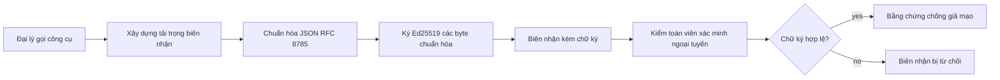
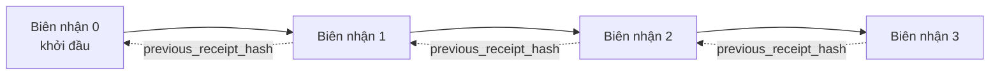

[Xem video bài học: Bảo mật các tác nhân AI với Biên nhận Mã hóa](https://youtu.be/PLACEHOLDER_VIDEO_ID)

> _(Video bài học và hình thu nhỏ sẽ được nhóm nội dung Microsoft bổ sung sau khi hợp nhất, phù hợp với mẫu bài học 14 / 15.)_

# Bảo mật các tác nhân AI với Biên nhận Mã hóa

## Giới thiệu

Bài học này sẽ đề cập đến:

- Tại sao dấu vết kiểm toán đối với các tác nhân AI lại quan trọng cho việc tuân thủ, gỡ lỗi và tin cậy.
- Biên nhận mã hóa là gì và nó khác gì so với một dòng nhật ký không ký.
- Cách tạo biên nhận đã ký cho cuộc gọi công cụ của tác nhân bằng Python thuần.
- Cách xác minh biên nhận ngoại tuyến và phát hiện sửa đổi.
- Cách xâu chuỗi các biên nhận để việc loại bỏ hoặc thay đổi thứ tự một biên nhận sẽ làm đứt chuỗi.
- Biên nhận chứng minh điều gì và không chứng minh điều gì một cách rõ ràng.

## Mục tiêu học tập

Sau khi hoàn thành bài học này, bạn sẽ biết cách:

- Xác định các chế độ lỗi thúc đẩy việc chứng minh nguồn gốc mã hóa cho các hành động của tác nhân.
- Tạo một biên nhận có chữ ký Ed25519 trên một tải trọng JSON chuẩn.
- Xác minh biên nhận một cách độc lập chỉ bằng cách sử dụng khóa công khai của người ký.
- Phát hiện sửa đổi bằng cách chạy lại việc xác minh trên biên nhận đã bị sửa đổi.
- Xây dựng một chuỗi các biên nhận qua hàm băm và giải thích tại sao chuỗi này lại quan trọng.
- Nhận biết ranh giới giữa những gì biên nhận chứng minh (định danh, tính toàn vẹn, thứ tự) và những gì nó không chứng minh (độ chính xác của hành động, sự hợp lý của chính sách).

## Vấn đề: Dấu vết kiểm toán của tác nhân bạn

Hãy tưởng tượng bạn đã triển khai một tác nhân AI cho Contoso Travel. Tác nhân này đọc yêu cầu của khách hàng, gọi API chuyến bay để tìm các lựa chọn, và đặt chỗ cho khách hàng. Quý trước, tác nhân đã xử lý 50.000 giao dịch đặt chỗ.

Hôm nay, một kiểm toán viên đến. Họ hỏi một câu đơn giản: "Cho tôi xem tác nhân của bạn đã làm gì."

Bạn trao cho họ các tập tin nhật ký. Kiểm toán viên xem và hỏi câu khó hơn: "Làm sao tôi biết các nhật ký này không bị chỉnh sửa?"

Đây là vấn đề về dấu vết kiểm toán. Hầu hết các triển khai tác nhân ngày nay dựa vào:

- **Nhật ký ứng dụng**: do chính tác nhân ghi, có thể chỉnh sửa bởi bất kỳ ai có quyền truy cập hệ thống tập tin.
- **Dịch vụ ghi nhật ký đám mây**: có khả năng phát hiện sửa đổi ở cấp nền tảng nhưng chỉ khi kiểm toán viên tin tưởng nhà điều hành nền tảng.
- **Nhật ký giao dịch cơ sở dữ liệu**: phù hợp cho các thay đổi cơ sở dữ liệu nhưng không phù hợp cho các cuộc gọi công cụ tùy ý.

Không cái nào trong số này có thể trả lời câu hỏi của kiểm toán viên mà không yêu cầu họ phải tin ai đó (bạn, nhà cung cấp đám mây, nhà cung cấp cơ sở dữ liệu). Đối với sử dụng nội bộ, sự tin tưởng này thường là chấp nhận được. Nhưng đối với các quy trình được điều chỉnh (tài chính, chăm sóc sức khỏe, bất kỳ gì thuộc về Đạo luật AI của EU), thì không phải vậy.

Biên nhận mã hóa giải quyết vấn đề này bằng cách làm cho mỗi hành động của tác nhân có thể xác minh độc lập. Kiểm toán viên không cần tin bạn. Họ chỉ cần khóa công khai của bạn và biên nhận.

## Biên nhận mã hóa là gì?

Biên nhận là một đối tượng JSON ghi lại tác nhân đã làm gì, được ký bằng chữ ký số.


```mermaid
flowchart LR
    A[Đại lý gọi công cụ] --> B[Xây dựng tải trọng biên nhận]
    B --> C[Chuẩn hóa JSON RFC 8785]
    C --> E[Ký Ed25519 các byte chuẩn hóa]
    E --> F[Biên nhận kèm chữ ký]
    F --> G[Kiểm toán viên xác minh ngoại tuyến]
    G --> H{Chữ ký hợp lệ?}
    H -- yes --> I[Bằng chứng chống giả mạo]
    H -- no --> J[Biên nhận bị từ chối]
```

Một biên nhận tối giản trông như sau:

```json
{
  "type": "agent.tool_call.v1",
  "agent_id": "contoso-travel-bot",
  "tool_name": "lookup_flights",
  "tool_args_hash": "sha256:a3f9c1...",
  "result_hash": "sha256:7b2e1d...",
  "policy_id": "contoso-travel-policy-v3",
  "timestamp": "2026-04-25T14:30:00Z",
  "sequence": 47,
  "previous_receipt_hash": "sha256:9d4e6a...",
  "signature": {
    "alg": "EdDSA",
    "sig": "c5af83...",
    "public_key": "8f3b2c..."
  }
}
```

Ba tính chất thực hiện công việc:

1. **Chữ ký**. Biên nhận được ký bởi cổng của tác nhân bằng khóa riêng Ed25519. Bất kỳ ai có khóa công khai tương ứng đều có thể xác minh chữ ký ngoại tuyến. Việc sửa đổi bất kỳ trường nào sẽ làm chữ ký không hợp lệ.

2. **Mã hóa chuẩn**. Trước khi ký, biên nhận được tuần tự hóa sử dụng JSON Canonicalization Scheme (JCS, RFC 8785). Điều này đảm bảo hai bộ triển khai tạo ra cùng một biên nhận logic sẽ tạo ra đầu ra byte giống hệt nhau. Nếu không có chuẩn hóa, các trình tuần tự JSON khác nhau sẽ tạo ra các chữ ký khác nhau cho cùng nội dung.

3. **Xâu chuỗi băm**. Trường `previous_receipt_hash` liên kết mỗi biên nhận với biên nhận trước nó. Việc loại bỏ hoặc thay đổi thứ tự biên nhận sẽ làm hỏng tất cả các biên nhận sau đó. Việc sửa đổi trở nên rõ ràng ở cấp chuỗi ngay cả khi chữ ký cá nhân bị vượt qua.

Ba tính chất này cùng nhau cung cấp ba đảm bảo:

- **Định danh**: khóa này đã ký nội dung này.
- **Tính toàn vẹn**: nội dung không thay đổi kể từ lúc ký.
- **Thứ tự**: biên nhận này đến sau biên nhận kia trong chuỗi.

## Tạo một Biên nhận trong Python

Bạn không cần thư viện đặc biệt để tạo một biên nhận. Các nguyên lý mã hóa có sẵn rộng rãi và logic chỉ là vài chục dòng Python.

Các bài tập thực hành trong `code_samples/18-signed-receipts.ipynb` hướng dẫn toàn bộ quy trình. Phiên bản tóm tắt:

```python
import json
import hashlib
import base64
from nacl import signing
from jcs import canonicalize  # JSON chuẩn RFC 8785

def b64url_nopad(data: bytes) -> str:
    return base64.urlsafe_b64encode(data).decode("ascii").rstrip("=")

def sha256_canonical(obj) -> str:
    """SHA-256 of a Python object's JCS-canonical JSON form."""
    return f"sha256:{hashlib.sha256(canonicalize(obj)).hexdigest()}"

# Tạo hoặc tải khóa ký (trong sản xuất, lưu trữ trong khoá bảo mật)
signing_key = signing.SigningKey.generate()
verify_key = signing_key.verify_key

# Xây dựng nội dung biên nhận (chưa có chữ ký)
tool_args = {"origin": "SYD", "destination": "LAX"}
tool_result = [{"flight": "QF11", "price": 1850, "stops": 0}]

payload = {
    "type": "agent.tool_call.v1",
    "agent_id": "contoso-travel-bot",
    "tool_name": "lookup_flights",
    "tool_args_hash": sha256_canonical(tool_args),
    "result_hash": sha256_canonical(tool_result),
    "policy_id": "contoso-travel-policy-v3",
    "timestamp": "2026-04-25T14:30:00Z",
    "sequence": 0,
    "previous_receipt_hash": None,
}

# Chuẩn hóa và ký trực tiếp các byte JCS. PureEdDSA tự băm nội bộ.
canonical_bytes = canonicalize(payload)
signature_bytes = signing_key.sign(canonical_bytes).signature

# Đính kèm một đối tượng chữ ký có cấu trúc.
receipt = {
    **payload,
    "signature": {
        "alg": "EdDSA",
        "sig": b64url_nopad(signature_bytes),
        "public_key": b64url_nopad(bytes(verify_key)),
    },
}
```

Đó là toàn bộ chuỗi ký. Các bài tập trong sổ tay sẽ hướng dẫn từng bước.

## Xác minh Biên nhận và Phát hiện Sửa đổi

Việc xác minh là thao tác nghịch đảo:

```python
import base64
import hashlib
from nacl import signing
from nacl.exceptions import BadSignatureError
from jcs import canonicalize

def b64url_decode(s: str) -> bytes:
    padding = "=" * ((4 - len(s) % 4) % 4)
    return base64.urlsafe_b64decode(s + padding)

def verify_receipt(receipt: dict) -> bool:
    # Chữ ký là một đối tượng có cấu trúc: {"alg", "sig", "public_key"}.
    sig_obj = receipt.get("signature")
    if not sig_obj or sig_obj.get("alg") != "EdDSA":
        return False

    # Tái tạo lại phần dữ liệu gốc thực sự đã được ký (mọi thứ ngoại trừ chữ ký).
    payload = {k: v for k, v in receipt.items() if k != "signature"}

    canonical_bytes = canonicalize(payload)

    try:
        verify_key = signing.VerifyKey(b64url_decode(sig_obj["public_key"]))
        verify_key.verify(canonical_bytes, b64url_decode(sig_obj["sig"]))
        return True
    except BadSignatureError:
        return False
```

Hàm này nhận một biên nhận và trả về `True` nếu chữ ký hợp lệ, `False` nếu không. Không gọi mạng, không phụ thuộc dịch vụ, không cần tin tưởng bên thứ ba nào.

Để thấy việc phát hiện sửa đổi hoạt động, sổ tay sẽ hướng dẫn:

1. Tạo một biên nhận hợp lệ và xác nhận biên nhận xác minh được.
2. Sửa đổi một byte trong trường `tool_args_hash`.
3. Chạy lại xác minh và thấy nó thất bại.

Đây là minh chứng thực tế rằng các biên nhận có khả năng phát hiện sửa đổi: bất kỳ thay đổi nào, dù rất nhỏ, cũng làm hỏng chữ ký.

## Xâu Chuỗi Biên nhận cho Các tác nhân đa bước

Một biên nhận duy nhất đã ký bảo vệ một hành động. Một chuỗi các biên nhận bảo vệ một chuỗi hành động.


```mermaid
flowchart LR
    R0[Biên nhận 0<br/>khởi đầu] --> R1[Biên nhận 1]
    R1 --> R2[Biên nhận 2]
    R2 --> R3[Biên nhận 3]
    R1 -. previous_receipt_hash .-> R0
    R2 -. previous_receipt_hash .-> R1
    R3 -. previous_receipt_hash .-> R2
```

Mỗi biên nhận ghi lại băm của biên nhận trước nó. Để lặng lẽ loại bỏ biên nhận số 2, kẻ tấn công phải:

- Sửa đổi trường `previous_receipt_hash` của biên nhận 3 (làm hỏng chữ ký của biên nhận 3), HOẶC
- Giả mạo chữ ký mới trên biên nhận 3 đã sửa đổi (cần khóa riêng của tác nhân).

Nếu khóa riêng được giữ trong khoá phần cứng và bạn công bố khóa công khai cùng với mỗi biên nhận, thì không cuộc tấn công nào khả thi mà không bị phát hiện.

Sổ tay hướng dẫn:

1. Xây dựng chuỗi gồm ba biên nhận.
2. Xác minh rằng trường `previous_receipt_hash` của mỗi biên nhận bằng đúng băm thực tế của biên nhận trước đó.
3. Thực hiện sửa đổi một biên nhận ở giữa và thấy chuỗi đứt ngay tại điểm đó.

Đây là cách bạn tạo dấu vết kiểm toán mà kiểm toán viên bên ngoài có thể xác minh mà không cần tin bạn.

## Biên nhận chứng minh điều gì (và điều gì không)

Đây là phần quan trọng nhất của bài học này. Biên nhận rất mạnh mẽ nhưng quyền lực của nó có giới hạn.

**Biên nhận chứng minh ba điều:**

1. **Định danh**: một khóa cụ thể đã ký một tải trọng cụ thể.
2. **Tính toàn vẹn**: tải trọng không thay đổi kể từ khi ký.
3. **Thứ tự**: biên nhận này đến sau biên nhận kia trong chuỗi băm.

**Biên nhận KHÔNG chứng minh:**

1. **Độ chính xác**: rằng hành động của tác nhân là đúng đắn. Một biên nhận có thể được ký cho câu trả lời sai cũng sạch sẽ như câu trả lời đúng.
2. **Tuân thủ chính sách**: rằng chính sách được tham chiếu trong `policy_id` thực sự đã được đánh giá, hoặc rằng nó sẽ cho phép hành động này nếu được kiểm tra. Biên nhận ghi lại những gì được tuyên bố, không phải những gì đã được thực thi.
3. **Danh tính ngoài khóa**: biên nhận nói "khóa này ký nội dung này." Nó không nói "con người này phê duyệt." Việc kết nối khóa với người hoặc tổ chức yêu cầu hạ tầng danh tính riêng biệt (thư mục, đăng ký khóa công khai, v.v.).
4. **Tính trung thực của đầu vào**: nếu tác nhân nhận được lời nhắc đã bị thao túng và hành động theo đó, biên nhận vẫn ghi lại hành động một cách chính xác. Biên nhận là giai đoạn sau của việc xác thực đầu vào, không thể thay thế cho việc đó.

Ranh giới này quan trọng vì hai lý do:

- Nó cho bạn biết biên nhận hữu ích cho mục đích gì: làm cho hành vi của tác nhân có thể kiểm toán và phát hiện sửa đổi, ngay cả qua các ranh giới tổ chức.
- Nó cho bạn biết những lớp bổ sung bạn vẫn cần: xác thực đầu vào (Bài học 6), thực thi chính sách (được đề cập ngắn dưới đây), và hạ tầng danh tính (không thuộc phạm vi bài học này).

Một sai lầm phổ biến là cho rằng "chúng ta có biên nhận" có nghĩa là "chúng ta được quản trị." Không phải vậy. Biên nhận là nền tảng. Quản trị là hệ thống bạn xây dựng trên nền tảng đó.

## Chứng minh Có Người Phê duyệt Hành động Chính xác

Mục 3 trên đáng được một phần riêng: một biên nhận hành động nói "khóa này ký nội dung này," không bao giờ nói "một con người phê duyệt điều này." Đối với các hành động rủi ro cao (hoàn tiền, xóa, chuyển tiền), các khung quản trị ngày càng yêu cầu chính xác câu nói còn thiếu đó, và điều này có thể thực hiện được với cùng các nguyên lý bạn đã xây dựng trong bài học này.

Sổ tay kế tiếp `code_samples/human-authorization-receipts.ipynb` thêm một loại biên nhận thứ hai, `human.approval.v1`, cùng kiểu phong bì với biên nhận trong bài học (một tải trọng có kiểu ký bằng Ed25519 trên bytes canonical JCS, với đối tượng `signature` nằm ngoài bytes đã ký). Một người phê duyệt được đặt tên ký **toàn bộ hành động chuẩn và băm của nó** trước khi thực hiện; biên nhận hành động của tác nhân mang **cùng băm hành động đó** và `parent_approval_ref`, là `receipt_hash` của biên nhận phê duyệt, theo cùng quy tắc với `previous_receipt_hash` trong chuỗi bạn đã xây dựng ở trên. Một `verify_chain` duy nhất xử lý cả hai chứng từ này dưới **đăng ký khóa riêng biệt đã được khoá cố định** (khóa người phê duyệt và khóa tác nhân), nên mã dùng chung nhưng các quyền lực không bao giờ chung.

Đặc tính này, được phát biểu cẩn thận: *con người đã phê duyệt chính xác hành động này, và tác nhân thực hiện đúng hành động được phê duyệt đó.* Các tình huống từ chối trong sổ tay làm cho đặc tính này thực thể thay vì chỉ là giả định:

- bộ kinh điển: sửa đổi, đại diện bị nhầm lẫn, phát lại, giả mạo khóa ở cả hai bên, đầu vào sai hình dạng;
- **quyền lực lỗi thời**: chữ ký vẫn xác minh được, nhưng bị từ chối vì phiên bản chính sách đã thay đổi, khóa người phê duyệt đã được xoay vòng ra khỏi đăng ký cố định hoặc phê duyệt hết hạn trước khi thực hiện;
- **thay thế băm**: biên nhận hành động hợp lệ chỉ tới phê duyệt *thật* nhưng lại gán cho hành động chuẩn *khác*.

Mỗi lỗi từ chối với một lý do riêng biệt, nên kiểm toán viên đọc từ chối có thể biết được quyền lực có bị lỗi thời hay hành động thực hiện có thay đổi không. Quy tắc sổ tay dạy: một phê duyệt đã ký không phải là quyền lực tự thân. Quyền lực chỉ tồn tại khi cả hai biên nhận vẫn liên kết với cùng một hành động chuẩn tại thời điểm thực hiện. Biên nhận phê duyệt con người là một thành phần giáo dục do bài học này định nghĩa, không phải loại biên nhận được định nghĩa bởi `draft-farley-acta-signed-receipts`.

## Tài liệu tham khảo trong sản xuất

Mã Python trong bài học này rất tối giản để bạn có thể đọc từng dòng và hiểu chính xác những gì đang diễn ra. Trong môi trường sản xuất, bạn có hai lựa chọn:

1. **Xây dựng trực tiếp trên các nguyên lý mã hóa.** 50 dòng bạn thấy ở trên đủ cho nhiều trường hợp sử dụng. PyNaCl (Ed25519) và gói `jcs` (JSON chuẩn) là các thư viện được duy trì tốt và được kiểm toán.

2. **Sử dụng thư viện biên nhận sản xuất.** Một số dự án mã nguồn mở triển khai mẫu tương tự với các tính năng bổ sung (xoay vòng khóa, xác minh hàng loạt, phân phối Bộ JWK, tích hợp với công cụ chính sách):
   - Chuỗi ký sử dụng các quy ước JCS và phạm vi chữ ký theo bản thảo độc lập của IETF ([`draft-farley-acta-signed-receipts`](https://datatracker.ietf.org/doc/draft-farley-acta-signed-receipts/), phiên bản 02). Biên nhận phẳng giáo dục trong bài học khác với phong bì `{payload, signature}` của bản thảo và không được trình bày như một thực thi tuân thủ. Bản thảo công bố bộ kiểm thử tuân thủ chung ([agent-governance-testvectors](https://github.com/ScopeBlind/agent-governance-testvectors)) dành cho các triển khai nhắm tới định dạng dây của nó.
   - Bộ công cụ Quản trị Tác nhân Microsoft kết hợp biên nhận với quyết định chính sách dựa trên Cedar; xem Tutorial 33 trong kho lưu trữ đó để biết ví dụ đầu cuối.
   - Các gói `protect-mcp` (npm) và `@veritasacta/verify` (npm) cung cấp triển khai Node cho việc ký biên nhận và xác minh ngoại tuyến, nhằm mục đích bọc bất kỳ máy chủ MCP nào với dấu vết kiểm toán phát hiện sửa đổi, bao gồm luồng giữ để đồng ký trong đó hành động tạm dừng phát ra biên nhận phê duyệt liên kết với băm hành động (dựa trên WebAuthn trong luồng trên máy tính để bàn), cùng mẫu biên nhận phê duyệt người dùng như sổ tay phê duyệt con người phía trên.
   - Bộ SDK Python **[nobulex](https://github.com/arian-gogani/nobulex)** (`pip install nobulex`) cung cấp mẫu ký Ed25519 + JCS tương tự trong Python với tích hợp LangChain và CrewAI, bao gồm các vectơ kiểm thử xác nhận chéo được công bố và bản đồ tuân thủ đóng góp qua [OWASP PR #2210](https://github.com/OWASP/CheatSheetSeries/pull/2210).

Quyết định giữa việc tự tạo và dùng thư viện tương tự như quyết định giữa viết thư viện JWT riêng và dùng thư viện đã được kiểm thử: đều hợp lý; thư viện tiết kiệm thời gian và giảm diện kiểm toán; cách tự viết buộc bạn hiểu từng nguyên lý. Bài học này dạy cách tự viết để bạn có nền tảng cho cả hai lựa chọn.

## Kiểm tra kiến thức

Kiểm tra hiểu biết của bạn trước khi chuyển sang bài tập thực hành.

**1. Một biên nhận được ký bằng khóa riêng Ed25519 của tác nhân. Kiểm toán viên chỉ có khóa công khai. Kiểm toán viên có thể xác minh biên nhận ngoại tuyến không?**

<details>
<summary>Trả lời</summary>

Có. Việc xác minh Ed25519 chỉ cần khóa công khai và bytes được ký. Không gọi mạng, không phụ thuộc dịch vụ. Đây là đặc điểm làm cho các biên nhận hữu dụng trong các môi trường kiểm toán ngắt mạng, đa tổ chức hoặc tin cậy thấp.
</details>

**2. Kẻ tấn công sửa đổi trường `policy_id` của một biên nhận để tuyên bố nó được quản lý bởi chính sách ưu đãi hơn. Chữ ký đã được tạo trên tải trọng gốc. Chuyện gì xảy ra trong quá trình xác minh?**

<details>
<summary>Trả lời</summary>


Xác minh thất bại. Chữ ký được tính trên các byte chuẩn của payload gốc; thay đổi bất kỳ trường nào sẽ làm thay đổi các byte đó, dẫn đến chữ ký không hợp lệ. Kẻ tấn công sẽ cần khóa riêng để tạo chữ ký hợp lệ mới, mà họ không có.
</details>

**3. Tại sao biên nhận lại bao gồm `tool_args_hash` và `result_hash` thay vì các đối số thô và kết quả?**

<details>
<summary>Trả lời</summary>

Có hai lý do. Thứ nhất, biên nhận có thể cần được lưu trữ hoặc truyền trong các môi trường mà việc tiết lộ nội dung thô (PII, dữ liệu kinh doanh) là vấn đề. Băm giữ cho biên nhận nhỏ gọn và nội dung riêng tư; kiểm toán viên xác minh rằng băm khớp với bản sao nội dung thực tế được lưu riêng. Thứ hai, các giá trị băm có kích thước cố định; một biên nhận có băm có kích thước giới hạn bất kể đầu vào và đầu ra lớn thế nào.
</details>

**4. Trường `previous_receipt_hash` liên kết mỗi biên nhận với người tiền nhiệm của nó. Nếu kẻ tấn công lặng lẽ xóa một biên nhận ở giữa chuỗi, điều gì sẽ trở nên không hợp lệ?**

<details>
<summary>Trả lời</summary>

Mọi biên nhận đến sau biên nhận bị xóa. Trường `previous_receipt_hash` của chúng không còn khớp với chuỗi thực (vì biên nhận mà chúng tham chiếu không còn tồn tại, hoặc chuỗi giờ trỏ tới một người tiền nhiệm khác). Để che giấu việc xóa, kẻ tấn công sẽ phải ký lại mọi biên nhận sau đó, điều này đòi hỏi khóa riêng.
</details>

**5. Một biên nhận xác minh thành công. Điều đó có chứng tỏ hành động của tác nhân là đúng, hợp lệ hay tuân thủ chính sách không?**

<details>
<summary>Trả lời</summary>

Không. Một biên nhận hợp lệ chứng minh ba điều: xác thực (khóa này đã ký nội dung này), toàn vẹn (nội dung không thay đổi), và thứ tự (biên nhận này đến sau biên nhận kia). Nó KHÔNG chứng minh rằng hành động là đúng, rằng chính sách được liệt kê trong `policy_id` đã thực sự được đánh giá, hoặc rằng tác nhân tuân thủ mọi quy tắc. Biên nhận làm cho hành vi tác nhân có thể kiểm toán, không nhất thiết là đúng. Đây là ranh giới quan trọng nhất trong bài học.
</details>

## Bài Tập Thực Hành

Mở `code_samples/18-signed-receipts.ipynb` và hoàn thành cả bốn phần:

1. **Phần 1**: Ký biên nhận đầu tiên của bạn và xác minh nó.
2. **Phần 2**: Thao túng biên nhận và quan sát xác minh thất bại.
3. **Phần 3**: Xây dựng chuỗi ba biên nhận và xác minh tính toàn vẹn chuỗi.
4. **Phần 4**: Áp dụng mẫu này cho một tác nhân xây dựng với Microsoft Agent Framework: bao một cuộc gọi công cụ trong ký biên nhận, sau đó xác minh biên nhận độc lập.

**Thách thức mở rộng 1:** mở rộng schema biên nhận với một trường bổ sung do bạn chọn (ví dụ, ID yêu cầu để theo dõi), cập nhật logic ký chuẩn hóa để bao gồm trường đó, và xác nhận biên nhận vẫn có thể qua lại vòng xác minh. Sau đó sửa đổi trường này sau khi ký và xác nhận xác minh thất bại. Điều này buộc bạn phải hiểu cách từng byte của mã hóa chuẩn đóng góp vào chữ ký.

**Thách thức mở rộng 2:** Băm SHA-256 hai biên nhận của bạn lại với nhau (nối các byte chuẩn của chúng theo thứ tự xác định) và nhúng kết quả băm ấy như một trường mới trên biên nhận thứ ba trước khi ký nó. Xác minh cả ba biên nhận vẫn có thể qua lại vòng xác minh. Bạn vừa xây dựng bằng chứng bao gồm một bước: bất kỳ ai giữ biên nhận thứ ba có thể chứng minh hai biên nhận đầu tiên đã tồn tại tại thời điểm nó được ký, mà không cần tiết lộ nội dung chúng. Đây là mẫu được các biên nhận tiết lộ có chọn lọc sử dụng ở quy mô lớn (Cam kết Merkle, RFC 6962).

## Kết Luận

Biên nhận mật mã cho các tác nhân AI một chuỗi kiểm toán mà:

- **Có thể xác minh độc lập**: bất kỳ bên nào có khóa công khai cũng có thể xác minh, không phụ thuộc dịch vụ.
- **Phát hiện bị giả mạo**: mọi sửa đổi làm chữ ký không hợp lệ.
- **Di động**: biên nhận là một file JSON nhỏ; có thể lưu trữ, truyền và xác minh ở bất cứ đâu.
- **Phù hợp chuẩn**: xây dựng trên Ed25519 (RFC 8032), JCS (RFC 8785), và SHA-256, tất cả đều là các nguyên thủy được triển khai rộng rãi.

Chúng không thay thế cho việc kiểm tra đầu vào, thực thi chính sách, hay hạ tầng định danh. Chúng là nền tảng cho các lớp đó. Khi bạn triển khai tác nhân vào các khối công việc có quy định, quy trình đa tổ chức, hoặc bất kỳ nơi nào mà kiểm toán viên tương lai không thể coi bạn là tin cậy, biên nhận là cách bạn làm cho chuỗi kiểm toán trung thực.

Điều quan trọng nhất: biên nhận chứng minh ai đã nói gì, khi nào. Chúng không chứng minh những gì được nói là đúng hay chính xác. Giữ chặt sự khác biệt đó. Đây là sự khác biệt giữa một hệ thống nguồn gốc trung thực và một hệ thống gây hiểu lầm.

## Danh Sách Kiểm Tra Sản Xuất

Khi bạn sẵn sàng để tốt nghiệp khỏi bài học này và triển khai tác nhân có ký biên nhận trong môi trường thực:

- [ ] **Di chuyển khóa ký ra khỏi máy tính lập trình viên.** Sử dụng Azure Key Vault, AWS KMS hoặc module bảo mật phần cứng. Khóa riêng dùng để ký biên nhận không bao giờ được lưu trong mã nguồn hay ở dạng văn bản thuần trên máy ứng dụng.
- [ ] **Công bố khóa công khai xác minh.** Kiểm toán viên cần nó để xác minh ngoại tuyến. Mẫu chuẩn là một JWK Set tại URL phổ biến (RFC 7517), ví dụ `https://your-org.example.com/.well-known/agent-keys.json`.
- [ ] **Ghim chuỗi ra bên ngoài.** Thường xuyên ghi băm đầu chuỗi mới nhất vào một nhật ký minh bạch (Sigstore Rekor, RFC 3161 timestamp authority hoặc hệ thống nội bộ thứ hai) để bên ngoài xác nhận "chuỗi này tồn tại tại thời điểm đó."
- [ ] **Lưu biên nhận không thể thay đổi.** Lưu trữ blob chỉ thêm (Azure Storage với chính sách không thay đổi, AWS S3 Object Lock) ngăn không cho người trong tổ chức ghi đè lịch sử ở tầng lưu trữ.
- [ ] **Quyết định về thời gian lưu trữ.** Nhiều quy định yêu cầu lưu giữ nhiều năm. Lên kế hoạch cho sự tăng trưởng biên nhận (mỗi biên nhận ~500 byte; tác nhân gọi 10.000 lần mỗi ngày sinh ~1,8 GB mỗi năm).
- [ ] **Ghi chép rõ biên nhận không bao gồm điều gì.** Biên nhận chứng minh xác thực, toàn vẹn, và thứ tự. Sổ tay vận hành của bạn nên liệt kê rõ các kiểm soát bổ sung (kiểm tra đầu vào, thực thi chính sách, giới hạn tốc độ, hạ tầng định danh) nằm bên cạnh biên nhận trong chính sách quản trị.

### Còn Nhiều Câu Hỏi Về Bảo Mật Tác Nhân AI?

Tham gia [Microsoft Foundry Discord](https://aka.ms/ai-agents/discord) để gặp gỡ những người học khác, tham dự giờ hỗ trợ, và nhận được trả lời cho các câu hỏi về Tác Nhân AI.

## Bên Ngoài Bài Học Này

Bài học này trình bày ký đơn biên nhận và chuỗi băm liên kết. Các nguyên thủy này kết hợp để tạo ra nhiều mẫu nâng cao hơn bạn có thể gặp khi chính sách quản trị của bạn phát triển:

- **Tiết lộ có chọn lọc.** Khi các trường biên nhận được cam kết riêng biệt (cây Merkle kiểu RFC 6962), bạn có thể tiết lộ trường cụ thể cho kiểm toán viên cụ thể và chứng minh các trường khác không thay đổi mà không tiết lộ chúng. Hữu ích khi cùng một biên nhận phải đáp ứng cả kiểm toán toàn diện (muốn đầy đủ) và quy định giảm thiểu dữ liệu như GDPR (muốn kiểm toán viên thấy ít nhất có thể).
- **Thu hồi biên nhận.** Nếu khóa ký bị lộ, bạn cần cách đánh dấu tất cả biên nhận ký bằng khóa đó là không tin cậy từ một thời điểm nhất định trở đi. Mẫu chuẩn: khóa ký có thời hạn ngắn kết hợp danh sách thu hồi được công bố, hoặc nhật ký minh bạch có mục thu hồi.
- **Biên nhận song phương / ký tách.** Một số triển khai tách payload đã ký thành nửa trước thực thi (`authorization_*`) và nửa sau (`result_*`) với các chữ ký độc lập, hữu ích khi quyết định ủy quyền và kết quả quan sát do các thực thể khác nhau hoặc thời điểm khác nhau tạo ra. Điều này bổ sung trên định dạng biên nhận được dạy trong bài.
- **Tổng hợp payload.** Biên nhận niêm phong bất kỳ byte nào bạn đặt trong `result_hash`. Payload thực tế thường giàu dữ liệu hơn kết quả gọi công cụ duy nhất: luận lý trước quyết định (dự đoán mô hình, lựa chọn xem xét, bằng chứng và tính đầy đủ, hiện trạng rủi ro, chuỗi trách nhiệm, kết quả kiểm soát) đều có thể nằm trong payload, niêm phong bởi một biên nhận duy nhất. Điều này giữ định dạng biên nhận tối giản đồng thời cho phép schema payload phát triển theo lĩnh vực.
- **Tuân thủ đa triển khai.** Nhiều triển khai độc lập cùng định dạng biên nhận (Python, TypeScript, Rust, Go) kiểm tra chéo với bộ vector kiểm thử chung. Nếu bạn xây dựng triển khai riêng, xác minh với các vector công bố xác nhận tương thích giao thức.
- **Di cư hậu lượng tử.** Ed25519 hiện được triển khai rộng rãi nhưng không chống lượng tử. Định dạng biên nhận linh hoạt thuật toán: trường `signature.alg` có thể chứa `ML-DSA-65` (chuẩn chữ ký hậu lượng tử của NIST) khi bạn cần di cư. Lập kế hoạch giai đoạn chuyển tiếp dùng hai chữ ký.

## Tài Nguyên Thêm

- <a href="https://datatracker.ietf.org/doc/draft-farley-acta-signed-receipts/" target="_blank">IETF Internet-Draft: Biên nhận quyết định có ký cho kiểm soát truy cập máy-máy</a>
- <a href="https://learn.microsoft.com/azure/ai-studio/responsible-use-of-ai-overview" target="_blank">Tổng quan AI có trách nhiệm (Azure AI)</a>
- <a href="https://datatracker.ietf.org/doc/html/rfc8032" target="_blank">RFC 8032: Thuật toán chữ ký số đường cong Edwards (EdDSA)</a>
- <a href="https://datatracker.ietf.org/doc/html/rfc8785" target="_blank">RFC 8785: Kế hoạch chuẩn hóa JSON (JCS)</a>
- <a href="https://datatracker.ietf.org/doc/html/rfc6962" target="_blank">RFC 6962: Minh bạch chứng chỉ</a> (cấu trúc cây Merkle dùng trong biên nhận tiết lộ có chọn lọc)
- <a href="https://github.com/microsoft/agent-governance-toolkit/blob/main/docs/tutorials/33-offline-verifiable-receipts.md" target="_blank">Bộ công cụ quản trị tác nhân Microsoft, Hướng dẫn 33: Biên nhận quyết định xác minh ngoại tuyến</a>
- <a href="https://github.com/ScopeBlind/agent-governance-testvectors" target="_blank">Vector kiểm thử tuân thủ đa triển khai</a> cho định dạng biên nhận dùng trong bài học này (Apache-2.0)
- <a href="https://pynacl.readthedocs.io/" target="_blank">Tài liệu PyNaCl</a> (Ed25519 trong Python)

## Bài Học Trước

[Tạo Tác Nhân AI Cục Bộ](../17-creating-local-ai-agents/README.md)

---

<!-- CO-OP TRANSLATOR DISCLAIMER START -->
**Tuyên bố miễn trừ trách nhiệm**:
Tài liệu này đã được dịch bằng dịch vụ dịch thuật AI [Co-op Translator](https://github.com/Azure/co-op-translator). Mặc dù chúng tôi cố gắng đảm bảo độ chính xác, xin lưu ý rằng bản dịch tự động có thể chứa lỗi hoặc sai sót. Tài liệu gốc bằng ngôn ngữ gốc nên được coi là nguồn tin chính thức. Đối với thông tin quan trọng, nên sử dụng dịch vụ dịch thuật chuyên nghiệp bởi con người. Chúng tôi không chịu trách nhiệm về bất kỳ hiểu lầm hoặc giải thích sai nào phát sinh từ việc sử dụng bản dịch này.
<!-- CO-OP TRANSLATOR DISCLAIMER END -->