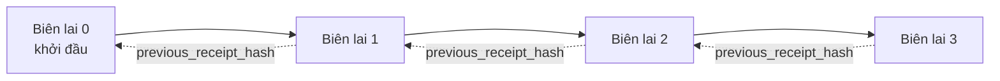

[Xem video bài học: Bảo mật Đại lý AI với Biên lai Mật mã](https://youtu.be/PLACEHOLDER_VIDEO_ID)

> _(Video bài học và ảnh thu nhỏ sẽ được nhóm nội dung Microsoft thêm vào sau khi gộp, phù hợp với mẫu bài học 14 / 15.)_

# Bảo mật Đại lý AI với Biên lai Mật mã

## Giới thiệu

Bài học này sẽ bao gồm:

- Tại sao dấu vết kiểm toán cho đại lý AI quan trọng cho tuân thủ, gỡ lỗi và tin cậy.
- Biên lai mật mã là gì và nó khác gì so với dòng nhật ký không được ký.
- Cách tạo biên lai có chữ ký cho một cuộc gọi công cụ của đại lý bằng Python thuần túy.
- Cách xác minh biên lai ngoại tuyến và phát hiện giả mạo.
- Cách liên kết các biên lai sao cho việc loại bỏ hoặc sắp xếp lại một biên lai sẽ phá vỡ chuỗi.
- Biên lai chứng minh điều gì và điều gì nó không chứng minh rõ ràng.

## Mục tiêu học tập

Sau khi hoàn thành bài học này, bạn sẽ biết cách:

- Xác định các chế độ thất bại thúc đẩy việc dùng nguồn gốc mật mã cho hành động của đại lý.
- Tạo biên lai ký Ed25519 trên một tải trọng JSON chuẩn.
- Xác minh biên lai độc lập chỉ bằng khóa công khai của người ký.
- Phát hiện giả mạo bằng cách chạy lại xác minh trên biên lai đã sửa đổi.
- Xây dựng chuỗi biên lai liên kết bằng băm và giải thích tại sao chuỗi lại quan trọng.
- Nhận diện ranh giới giữa những gì biên lai chứng minh (thuộc tính, toàn vẹn, thứ tự) và những gì nó không chứng minh (độ chính xác của hành động, tính hợp lệ của chính sách).

## Vấn đề: Dấu vết kiểm toán của Đại lý bạn

Hãy tưởng tượng bạn đã triển khai một đại lý AI cho Contoso Travel. Đại lý đọc yêu cầu của khách hàng, gọi API chuyến bay để tìm lựa chọn, và đặt chỗ cho khách hàng thay mặt họ. Quý trước, đại lý đã xử lý 50.000 đặt chỗ.

Hôm nay một kiểm toán viên đến. Họ đặt câu hỏi đơn giản: "Cho tôi xem đại lý của bạn đã làm gì."

Bạn đưa ra các tệp nhật ký. Kiểm toán viên xem qua và hỏi câu hỏi khó hơn: "Làm sao tôi biết các nhật ký này không bị chỉnh sửa?"

Đây là vấn đề dấu vết kiểm toán. Phần lớn các triển khai đại lý ngày nay dựa vào:

- **Nhật ký ứng dụng**: do chính đại lý viết, bất cứ ai có quyền truy cập hệ thống tập tin đều có thể chỉnh sửa.
- **Dịch vụ ghi nhật ký đám mây**: có khả năng phát hiện giả mạo ở cấp nền tảng nhưng chỉ khi kiểm toán viên tin tưởng nhà điều hành nền tảng.
- **Nhật ký giao dịch cơ sở dữ liệu**: phù hợp cho các thay đổi cơ sở dữ liệu nhưng không phù hợp cho các cuộc gọi công cụ tùy ý.

Không có phương pháp nào trong số này có thể trả lời câu hỏi của kiểm toán viên mà không yêu cầu họ tin ai đó (bạn, nhà cung cấp đám mây, nhà cung cấp cơ sở dữ liệu). Đối với sử dụng nội bộ, sự tin tưởng đó thường chấp nhận được. Đối với các khối lượng công việc được điều chỉnh (tài chính, y tế, hoặc bất cứ điều gì thuộc Đạo luật AI EU), thì không.

Biên lai mật mã giải quyết vấn đề này bằng cách làm cho mỗi hành động của đại lý có thể được xác minh độc lập. Kiểm toán viên không cần tin bạn. Họ chỉ cần khóa công khai của bạn và chính biên lai.

## Biên lai Mật mã là gì?

Biên lai là một đối tượng JSON ghi lại những gì đại lý đã làm, được ký bằng chữ ký số.


```mermaid
flowchart LR
    A[Đại lý gọi công cụ] --> B[Xây dựng tải dữ liệu biên lai]
    B --> C[Chuẩn hóa JSON RFC 8785]
    C --> E[Ký Ed25519 các byte chuẩn hóa]
    E --> F[Biên lai có chữ ký]
    F --> G[Kiểm toán viên xác minh ngoại tuyến]
    G --> H{Chữ ký hợp lệ?}
    H -- yes --> I[Bằng chứng chống giả mạo]
    H -- no --> J[Biên lai bị từ chối]
```

Một biên lai tối thiểu trông như sau:

```json
{
  "type": "agent.tool_call.v1",
  "agent_id": "contoso-travel-bot",
  "tool_name": "lookup_flights",
  "tool_args_hash": "sha256:a3f9c1...",
  "result_hash": "sha256:7b2e1d...",
  "policy_id": "contoso-travel-policy-v3",
  "timestamp": "2026-04-25T14:30:00Z",
  "sequence": 47,
  "previous_receipt_hash": "sha256:9d4e6a...",
  "signature": {
    "alg": "EdDSA",
    "sig": "c5af83...",
    "public_key": "8f3b2c..."
  }
}
```

Ba thuộc tính thực hiện công việc:

1. **Chữ ký**. Biên lai được ký bởi cổng của đại lý dùng khóa riêng Ed25519. Bất cứ ai có khóa công khai tương ứng đều có thể xác minh chữ ký ngoại tuyến. Việc giả mạo bất kỳ trường nào sẽ làm chữ ký không hợp lệ.

2. **Mã hóa chuẩn**. Trước khi ký, biên lai được tuần tự hóa bằng JSON Canonicalization Scheme (JCS, RFC 8785). Điều này đảm bảo rằng hai triển khai tạo ra cùng một biên lai logic thì sẽ tạo ra kết quả nhị phân giống hệt nhau. Nếu không có chuẩn hóa, các bộ tuần tự JSON khác nhau sẽ tạo ra chữ ký khác nhau cho cùng nội dung.

3. **Liên kết băm**. Trường `previous_receipt_hash` liên kết mỗi biên lai với biên lai trước nó. Việc loại bỏ hoặc sắp xếp lại một biên lai sẽ phá vỡ tất cả các biên lai sau đó. Giả mạo trở nên dễ phát hiện ở cấp chuỗi ngay cả khi chữ ký đơn lẻ bị lờ đi.

Ba thuộc tính này cùng nhau cung cấp ba đảm bảo:

- **Thuộc tính**: khóa này đã ký nội dung này.
- **Toàn vẹn**: nội dung chưa bị thay đổi kể từ khi ký.
- **Thứ tự**: biên lai này có sau biên lai kia trong chuỗi.

## Tạo Biên lai trong Python

Bạn không cần thư viện đặc biệt để tạo biên lai. Các nguyên tắc mật mã đã được cung cấp rộng rãi và logic chỉ vài chục dòng Python.

Các bài tập thực hành trong `code_samples/18-signed-receipts.ipynb` sẽ hướng dẫn toàn bộ quy trình. Phiên bản tóm tắt:

```python
import json
import hashlib
import base64
from nacl import signing
from jcs import canonicalize  # JSON chuẩn RFC 8785

def b64url_nopad(data: bytes) -> str:
    return base64.urlsafe_b64encode(data).decode("ascii").rstrip("=")

def sha256_canonical(obj) -> str:
    """SHA-256 of a Python object's JCS-canonical JSON form."""
    return f"sha256:{hashlib.sha256(canonicalize(obj)).hexdigest()}"

# Tạo hoặc tải khóa ký (trong môi trường sản xuất, lưu trong kho khóa)
signing_key = signing.SigningKey.generate()
verify_key = signing_key.verify_key

# Xây dựng payload biên nhận (chưa có chữ ký)
tool_args = {"origin": "SYD", "destination": "LAX"}
tool_result = [{"flight": "QF11", "price": 1850, "stops": 0}]

payload = {
    "type": "agent.tool_call.v1",
    "agent_id": "contoso-travel-bot",
    "tool_name": "lookup_flights",
    "tool_args_hash": sha256_canonical(tool_args),
    "result_hash": sha256_canonical(tool_result),
    "policy_id": "contoso-travel-policy-v3",
    "timestamp": "2026-04-25T14:30:00Z",
    "sequence": 0,
    "previous_receipt_hash": None,
}

# Chuẩn hóa và ký trực tiếp các byte JCS. PureEdDSA băm bên trong.
canonical_bytes = canonicalize(payload)
signature_bytes = signing_key.sign(canonical_bytes).signature

# Đính kèm đối tượng chữ ký có cấu trúc.
receipt = {
    **payload,
    "signature": {
        "alg": "EdDSA",
        "sig": b64url_nopad(signature_bytes),
        "public_key": b64url_nopad(bytes(verify_key)),
    },
}
```

Đó là toàn bộ quy trình ký. Các bài tập trong sổ tay sẽ đi qua từng bước.

## Xác Minh Biên Lai và Phát Hiện Giả Mạo

Xác minh là thao tác ngược lại:

```python
import base64
import hashlib
from nacl import signing
from nacl.exceptions import BadSignatureError
from jcs import canonicalize

def b64url_decode(s: str) -> bytes:
    padding = "=" * ((4 - len(s) % 4) % 4)
    return base64.urlsafe_b64decode(s + padding)

def verify_receipt(receipt: dict) -> bool:
    # Chữ ký là một đối tượng có cấu trúc: {"alg", "sig", "public_key"}.
    sig_obj = receipt.get("signature")
    if not sig_obj or sig_obj.get("alg") != "EdDSA":
        return False

    # Tái tạo lại phần dữ liệu thực sự được ký (mọi thứ ngoại trừ chữ ký).
    payload = {k: v for k, v in receipt.items() if k != "signature"}

    canonical_bytes = canonicalize(payload)

    try:
        verify_key = signing.VerifyKey(b64url_decode(sig_obj["public_key"]))
        verify_key.verify(canonical_bytes, b64url_decode(sig_obj["sig"]))
        return True
    except BadSignatureError:
        return False
```

Hàm này nhận một biên lai và trả về `True` nếu chữ ký hợp lệ, `False` nếu không. Không gọi mạng, không phụ thuộc dịch vụ, không cần tin tưởng bên thứ ba nào.

Để thấy việc phát hiện giả mạo trong thực tế, sổ tay hướng dẫn:

1. Tạo một biên lai hợp lệ và xác nhận nó được xác minh.
2. Sửa đổi một byte của trường `tool_args_hash`.
3. Chạy lại xác minh và thấy nó thất bại.

Đây là minh chứng thực tiễn rằng biên lai có thể phát hiện giả mạo: bất kỳ thay đổi nào, dù nhỏ, đều phá vỡ chữ ký.

## Liên kết các Biên lai cho Đại lý Nhiều Bước

Một biên lai ký bảo vệ một hành động. Chuỗi biên lai bảo vệ một trình tự.


```mermaid
flowchart LR
    R0[Biên lai 0<br/>khởi đầu] --> R1[Biên lai 1]
    R1 --> R2[Biên lai 2]
    R2 --> R3[Biên lai 3]
    R1 -. previous_receipt_hash .-> R0
    R2 -. previous_receipt_hash .-> R1
    R3 -. previous_receipt_hash .-> R2
```

Mỗi biên lai ghi lại băm của biên lai trước đó. Để âm thầm loại bỏ biên lai số 2, kẻ tấn công phải:

- Sửa trường `previous_receipt_hash` của biên lai số 3 (phá vỡ chữ ký biên lai 3), HOẶC
- Tạo chữ ký mới trên biên lai số 3 đã sửa (cần khóa riêng của đại lý).

Nếu khóa riêng được lưu trong khoá phần cứng và bạn xuất bản khóa công khai cùng với mỗi biên lai, thì không tấn công nào trên khả thi mà không bị phát hiện.

Sổ tay hướng dẫn:

1. Xây dựng chuỗi ba biên lai.
2. Xác minh mỗi `previous_receipt_hash` của biên lai khớp băm thực tế của biên lai trước.
3. Giả mạo một biên lai ở giữa và thấy chuỗi bị phá vỡ tại điểm đó.

Đây là cách bạn tạo dấu vết kiểm toán mà kiểm toán viên bên ngoài có thể xác minh mà không phải tin bạn.

## Biên lai Chứng minh Điều gì (và Điều gì Không)

Đây là phần quan trọng nhất của bài học. Biên lai rất mạnh mẽ nhưng quyền lực của nó có giới hạn.

**Biên lai chứng minh ba điều:**

1. **Thuộc tính**: một khóa xác định đã ký một tải trọng cụ thể.
2. **Toàn vẹn**: tải trọng chưa thay đổi kể từ khi ký.
3. **Thứ tự**: biên lai này đứng sau biên lai kia trong chuỗi băm.

**Biên lai KHÔNG chứng minh:**

1. **Độ chính xác**: rằng hành động của đại lý là hành động đúng. Biên lai có thể được ký cho câu trả lời sai cũng rõ ràng như câu trả lời đúng.
2. **Tuân thủ chính sách**: rằng chính sách trong `policy_id` đã thực sự được đánh giá, hoặc sẽ cho phép hành động này nếu được kiểm tra. Biên lai ghi lại điều được tuyên bố, không phải điều được thi hành.
3. **Nhận dạng ngoài khóa**: biên lai nói "khóa này đã ký nội dung này." Nó không nói "con người này đã ủy quyền." Việc kết nối một khóa với một người hoặc tổ chức yêu cầu hạ tầng nhận dạng riêng biệt (thư mục, đăng ký khóa công khai, v.v.).
4. **Tính trung thực của đầu vào**: nếu đại lý nhận được lời nhắc đã bị thao túng và hành động trên đó, biên lai ghi lại hành động trung thực. Biên lai là bước sau xác thực đầu vào, không phải thay thế cho nó.

Ranh giới này quan trọng vì hai lý do:

- Nó cho biết biên lai hữu ích cho việc gì: làm cho hành vi đại lý có thể kiểm toán và phát hiện giả mạo, ngay cả qua các ranh giới tổ chức.
- Nó cho biết bạn vẫn cần những lớp bổ sung nào: xác thực đầu vào (Bài học 6), thi hành chính sách (được đề cập ngắn bên dưới), và hạ tầng nhận dạng (ngoài phạm vi bài học này).

Một sai lầm phổ biến là cho rằng "chúng ta có biên lai" nghĩa là "chúng ta được quản trị." Không phải vậy. Biên lai là nền tảng. Quản trị là hệ thống xây dựng trên nền tảng đó.

## Chứng minh Con Người Đã Phê duyệt Hành Động Chính Xác

Điểm 3 phía trên xứng đáng có phần riêng: một biên lai hành động nói "khóa này đã ký nội dung này," không bao giờ nói "con người đã ủy quyền." Với các hành động rủi ro cao (hoàn tiền, xóa, chuyển khoản), các khuôn khổ quản trị ngày càng yêu cầu đúng câu nói còn thiếu đó, và nó có thể tạo ra với các nguyên lý bạn đã xây trong bài học này.

Sổ tay tiếp theo `code_samples/human-authorization-receipts.ipynb` bổ sung loại biên lai thứ hai, `human.approval.v1`, trong cùng hình thức phong bì như biên lai bài học (tải trọng kiểu được ký Ed25519 trên bytes JCS chuẩn, với đối tượng `signature` nằm ngoài bytes được ký). Người phê duyệt được đặt tên ký **toàn bộ hành động chuẩn và giá trị băm của nó** trước khi thực thi; biên lai hành động của đại lý mang **cùng giá trị băm hành động** và `parent_approval_ref`, là `receipt_hash` của biên lai phê duyệt, theo quy ước giống `previous_receipt_hash` trong chuỗi bạn đã tạo ở trên. Một `verify_chain` duy nhất chạy cả hai yếu tố dưới **hai bộ đăng ký khóa cố định riêng biệt** (khóa người phê duyệt so với khóa đại lý), nên đường mã dùng chung nhưng quyền hạn không bao giờ dùng chung.

Thuộc tính này được nói cẩn thận: *con người đã phê duyệt hành động chính xác này, và đại lý đã thực thi chính xác hành động đã được phê duyệt đó.* Các kiểm thử từ chối trong sổ tay làm thuộc tính này trở thành thật thay vì chỉ là khẳng định:

- bộ kinh điển: giả mạo, đại lý nhầm lẫn, phát lại, khóa giả ở cả hai bên, đầu vào sai định dạng;
- **quyền hạn lỗi thời**: chữ ký vẫn xác minh được nhưng bị từ chối vì phiên bản chính sách đã thay đổi, khóa người phê duyệt bị xoay vòng ra khỏi đăng ký cố định, hoặc phê duyệt hết hạn trước khi thực thi;
- **thay thế giá trị băm**: biên lai hành động được ký hợp lệ trỏ đến một phê duyệt *thật* ràng buộc một hành động chuẩn *khác*.

Mỗi lỗi từ chối với lý do riêng biệt, giúp kiểm toán viên biết liệu quyền hạn đã lỗi thời hay hành động thực thi đã thay đổi. Quy tắc sổ tay dạy: phê duyệt ký không phải là quyền hạn tự nó. Quyền hạn chỉ tồn tại nếu cả hai biên lai vẫn ràng buộc với cùng hành động chuẩn tại thời điểm thực thi. Biên lai phê duyệt con người là một cấu hợp giáo dục được định nghĩa bởi bài học này, không phải loại biên lai được định nghĩa bởi `draft-farley-acta-signed-receipts`.

## Tài liệu Tham khảo Sản xuất

Mã Python trong bài học này cố tình tối giản để bạn có thể đọc từng dòng và hiểu chính xác điều gì đang xảy ra. Trong sản xuất, bạn có hai lựa chọn:

1. **Xây dựng trực tiếp trên các nguyên lý mật mã.** 50 dòng bạn thấy ở trên đủ dùng cho nhiều trường hợp. PyNaCl (Ed25519) và gói `jcs` (JSON chuẩn) là các thư viện được duy trì và kiểm toán tốt.

2. **Dùng thư viện biên lai sản xuất.** Một số dự án mã nguồn mở triển khai mẫu tương tự với tính năng bổ sung (xoay khóa, xác minh hàng loạt, phân phối Bộ khóa JWK, tích hợp với động cơ chính sách):
   - Quy trình ký dùng các quy ước JCS và phạm vi chữ ký trong bản thảo IETF độc lập ([`draft-farley-acta-signed-receipts`](https://datatracker.ietf.org/doc/draft-farley-acta-signed-receipts/), phiên bản 02). Biên lai phẳng giáo dục trong bài học khác với phong bì `{payload, signature}` của bản thảo và không trình bày như một triển khai tuân thủ. Bản thảo xuất bản bộ kiểm thử tuân thủ chung ([agent-governance-testvectors](https://github.com/ScopeBlind/agent-governance-testvectors)) cho các triển khai nhắm định dạng mạng của nó.
   - Bộ công cụ Quản trị Đại lý Microsoft kết hợp biên lai với các quyết định chính sách dựa trên Cedar; xem Hướng dẫn 33 trong kho đó để có ví dụ toàn diện.
   - Các gói `protect-mcp` (npm) và `@veritasacta/verify` (npm) cung cấp triển khai ký biên lai và xác minh ngoại tuyến trên Node, nhằm bọc mọi máy chủ MCP với dấu vết kiểm toán phát hiện giả mạo, bao gồm dòng phê duyệt giữ lại trong đó hành động tạm dừng phát ra biên lai phê duyệt liên kết với giá trị băm hành động (dựa WebAuthn trong quy trình trên máy tính để bàn), mẫu biên lai phê duyệt giống sổ tay phê duyệt con người phía trên.
   - SDK Python **[nobulex](https://github.com/arian-gogani/nobulex)** (`pip install nobulex`) cung cấp mẫu ký Ed25519 + JCS giống trong Python với tích hợp LangChain và CrewAI, gồm các vectơ kiểm thử xác thực chéo được công bố và bản đồ tuân thủ đóng góp qua [OWASP PR #2210](https://github.com/OWASP/CheatSheetSeries/pull/2210).

Quyết định giữa tự xây và dùng thư viện tương tự như quyết định giữa viết thư viện JWT riêng và dùng thư viện đã kiểm thử: cả hai đều hợp lý; thư viện tiết kiệm thời gian và giảm bề mặt kiểm toán; cách tự xây buộc bạn phải hiểu từng nguyên lý. Bài học này dạy cách tự xây để bạn có nền tảng cho cả hai lựa chọn.

## Kiểm tra Kiến thức

Kiểm tra hiểu biết trước khi chuyển sang bài tập thực hành.

**1. Biên lai được ký bằng khóa riêng Ed25519 của đại lý. Kiểm toán viên chỉ có khóa công khai. Kiểm toán viên có thể xác minh biên lai ngoại tuyến không?**

<details>
<summary>Trả lời</summary>

Có. Xác minh Ed25519 chỉ cần khóa công khai và bytes đã ký. Không gọi mạng, không phụ thuộc dịch vụ. Đây là thuộc tính khiến biên lai hữu ích trong các môi trường kiểm toán cách ly, đa tổ chức, hoặc ít tin cậy.
</details>

**2. Kẻ tấn công sửa trường `policy_id` của biên lai để tuyên bố nó tuân thủ chính sách cởi mở hơn. Chữ ký được tạo trên tải trọng ban đầu. Chuyện gì xảy ra khi xác minh?**

<details>
<summary>Trả lời</summary>


Xác minh thất bại. Chữ ký được tính trên các byte chuẩn của payload gốc; việc sửa đổi bất kỳ trường nào cũng thay đổi các byte đó, làm cho chữ ký không hợp lệ. Kẻ tấn công sẽ cần khóa riêng tư để tạo một chữ ký hợp lệ mới, điều mà họ không có.
</details>

**3. Tại sao biên lai bao gồm `tool_args_hash` và `result_hash` thay vì các đối số và kết quả thô?**

<details>
<summary>Trả lời</summary>

Có hai lý do. Thứ nhất, biên lai có thể cần được lưu trữ hoặc truyền đi trong môi trường mà việc tiết lộ nội dung thô (PII, dữ liệu kinh doanh) là vấn đề. Băm giữ cho biên lai nhỏ và nội dung được giữ kín; người kiểm toán xác minh rằng hàm băm khớp với bản sao riêng biệt của nội dung thực tế. Thứ hai, các hàm băm có kích thước cố định; biên lai với các hàm băm có kích thước giới hạn bất kể đầu vào và đầu ra lớn đến đâu.
</details>

**4. Trường `previous_receipt_hash` liên kết mỗi biên lai với biên lai trước đó. Nếu kẻ tấn công lặng lẽ xóa một biên lai ở giữa chuỗi, điều gì sẽ trở nên không hợp lệ?**

<details>
<summary>Trả lời</summary>

Mọi biên lai đến sau biên lai bị xóa. Các trường `previous_receipt_hash` của chúng không còn khớp với chuỗi thực tế (bởi vì biên lai mà chúng tham chiếu không còn tồn tại, hoặc chuỗi giờ trỏ đến một người tiền nhiệm khác). Để che giấu việc xóa, kẻ tấn công sẽ phải ký lại mọi biên lai sau đó, điều này đòi hỏi khóa riêng tư.
</details>

**5. Một biên lai xác minh thành công. Điều đó có chứng minh hành động của đại lý là chính xác, hợp lý, hoặc tuân thủ chính sách không?**

<details>
<summary>Trả lời</summary>

Không. Một biên lai hợp lệ chứng minh ba điều: phân attribution (khóa này đã ký nội dung này), tính toàn vẹn (nội dung không thay đổi), và thứ tự (biên lai này đến sau biên lai kia). Nó KHÔNG chứng minh hành động đó là chính xác, rằng chính sách được chỉ định trong `policy_id` thực sự đã được đánh giá, hoặc đại lý đã tuân theo mọi quy tắc. Biên lai làm cho hành vi đại lý có thể kiểm toán được, không nhất thiết là đúng. Đây là ranh giới quan trọng nhất trong bài học.
</details>

## Bài tập thực hành

Mở `code_samples/18-signed-receipts.ipynb` và hoàn thành toàn bộ bốn phần:

1. **Phần 1**: Ký biên lai đầu tiên của bạn và xác minh nó.
2. **Phần 2**: Can thiệp vào biên lai và quan sát xác minh thất bại.
3. **Phần 3**: Xây dựng chuỗi gồm ba biên lai và xác minh tính toàn vẹn của chuỗi.
4. **Phần 4**: Áp dụng mẫu này cho một đại lý được xây dựng với Microsoft Agent Framework: đóng gói cuộc gọi công cụ vào việc ký biên lai, sau đó xác minh biên lai độc lập.

**Thử thách mở rộng 1:** mở rộng sơ đồ biên lai với một trường bổ sung mà bạn chọn (ví dụ, một ID yêu cầu để truy vết), cập nhật logic ký chuẩn để bao gồm nó, và xác nhận rằng biên lai vẫn có thể được xác minh qua lại. Sau đó sửa đổi trường đó sau khi ký và xác nhận xác minh thất bại. Điều này buộc bạn phải hiểu cách mọi byte của mã hóa chuẩn góp phần vào chữ ký.

**Thử thách mở rộng 2:** Băm SHA-256 hai biên lai của bạn với nhau (nối các byte chuẩn của chúng theo thứ tự xác định) và nhúng kết quả băm này làm trường mới trên biên lai thứ ba trước khi ký. Xác minh rằng cả ba biên lai vẫn có thể được xác minh. Bạn vừa xây dựng bằng chứng bao gồm một bước: bất kỳ ai giữ biên lai thứ ba có thể chứng minh hai biên lai đầu tiên tồn tại vào thời điểm nó được ký, mà không cần tiết lộ nội dung của chúng. Đây là mẫu mà các biên lai tiết lộ chọn lọc sử dụng ở quy mô lớn (cam kết Merkle, RFC 6962).

## Kết luận

Biên lai mật mã cung cấp cho đại lý AI một dấu vết kiểm toán mà:

- **Có thể xác minh độc lập**: bất kỳ bên nào có khóa công khai cũng có thể xác minh, không phụ thuộc dịch vụ.
- **Phát hiện can thiệp**: bất kỳ sửa đổi nào cũng làm chữ ký không hợp lệ.
- **Di động**: biên lai là một tập tin JSON nhỏ; có thể lưu trữ, truyền và xác minh ở bất cứ đâu.
- **Tuân thủ tiêu chuẩn**: xây dựng trên Ed25519 (RFC 8032), JCS (RFC 8785), và SHA-256, đều là các nguyên thủy được triển khai rộng rãi.

Chúng không thay thế cho xác thực đầu vào, thực thi chính sách, hoặc hạ tầng nhận dạng. Chúng là nền tảng cho các tầng đó. Khi bạn triển khai đại lý vào các khối công việc được quy định, quy trình làm việc đa tổ chức, hoặc bất kỳ môi trường nào mà kiểm toán viên trong tương lai không thể được giả định là tin tưởng bạn, biên lai là cách bạn làm cho dấu vết kiểm toán trung thực.

Điều quan trọng nhất cần nhớ: biên lai chứng minh ai đã nói gì và khi nào. Chúng không chứng minh những gì được nói là đúng hay chính xác. Hãy giữ sự phân biệt đó thật chắc chắn. Đó là sự khác biệt giữa hệ thống gốc xuất xứ trung thực và hệ thống gây hiểu lầm.

## Danh sách kiểm tra khi triển khai thực tế

Khi bạn sẵn sàng chuyển từ bài học này sang triển khai đại lý ký biên lai trong môi trường thực tế:

- [ ] **Di chuyển khóa ký ra khỏi laptop của nhà phát triển.** Dùng Azure Key Vault, AWS KMS, hoặc mô-đun bảo mật phần cứng. Khóa riêng ký cho biên lai của bạn không bao giờ được lưu trong kiểm soát nguồn hay dưới dạng văn bản thuần trên máy ứng dụng.
- [ ] **Công bố khóa công khai để xác minh.** Người kiểm toán cần nó để xác minh ngoại tuyến. Mẫu chuẩn là bộ JWK tại một URL nổi tiếng (RFC 7517), ví dụ, `https://your-org.example.com/.well-known/agent-keys.json`.
- [ ] **Neo chuỗi bên ngoài.** Định kỳ ghi băm đầu chuỗi mới nhất vào nhật ký minh bạch (Sigstore Rekor, cơ quan cấp dấu thời gian RFC 3161, hoặc hệ thống nội bộ thứ hai) để bên ngoài có thể xác nhận "chuỗi này tồn tại vào thời điểm này."
- [ ] **Lưu trữ biên lai dưới dạng bất biến.** Lưu trữ blob chỉ thêm (Azure Storage với chính sách bất biến, AWS S3 Object Lock) ngăn người trong nhóm sửa lại lịch sử ở tầng lưu trữ.
- [ ] **Quyết định về thời gian lưu trữ.** Nhiều quy định yêu cầu lưu nhiều năm. Lập kế hoạch cho tăng trưởng biên lai (mỗi biên lai khoảng 500 byte; một đại lý thực hiện 10K cuộc gọi mỗi ngày tạo ra khoảng 1.8 GB mỗi năm).
- [ ] **Tài liệu hóa những gì biên lai không bao phủ.** Biên lai chứng minh phân attribution, tính toàn vẹn, và thứ tự. Quy trình của bạn nên liệt kê rõ các kiểm soát bổ sung (xác thực đầu vào, thực thi chính sách, hạn chế tốc độ, hạ tầng nhận dạng) đứng cạnh biên lai trong tư thế quản trị của bạn.

### Có thêm câu hỏi về bảo mật đại lý AI?

Tham gia [Microsoft Foundry Discord](https://aka.ms/ai-agents/discord) để gặp gỡ các học viên khác, tham dự giờ làm việc, và nhận câu trả lời cho các câu hỏi về Đại lý AI.

## Vượt ra ngoài bài học này

Bài học này bao gồm ký một biên lai đơn lẻ và chuỗi băm liên kết. Các nguyên thủy giống nhau tạo nên nhiều mẫu nâng cao hơn mà bạn có thể gặp khi tư thế quản trị trưởng thành:

- **Tiết lộ có chọn lọc.** Khi các trường biên lai được cam kết độc lập (cây Merkle theo kiểu RFC 6962), bạn có thể tiết lộ các trường cụ thể cho các kiểm toán viên cụ thể và chứng minh các trường còn lại không thay đổi mà không tiết lộ chúng. Hữu ích khi cùng một biên lai phải thỏa mãn cả kiểm toán toàn diện (cần đầy đủ) và quy định giảm thiểu dữ liệu như GDPR (cho phép kiểm toán viên thấy ít nhất cần thiết).
- **Thu hồi biên lai.** Nếu một khóa ký bị xâm phạm, bạn cần cách đánh dấu tất cả các biên lai được ký bởi khóa đó là không tin cậy từ một thời điểm trở đi. Các mẫu chuẩn: khóa ký sống ngắn cùng danh sách thu hồi được công bố, hoặc nhật ký minh bạch với các mục thu hồi.
- **Biên lai song phương / ký tách.** Một số triển khai tách payload được ký thành hai phần trước và sau thực thi (`authorization_*` và `result_*`) với chữ ký độc lập, hữu ích khi quyết định ủy quyền và kết quả quan sát được do các tác nhân khác nhau hoặc vào các thời điểm khác nhau tạo ra. Điều này bổ sung cho định dạng biên lai dạy trong bài học này.
- **Thành phần payload.** Biên lai đóng dấu bất kỳ byte nào bạn đặt vào `result_hash`. Các payload thực tế thường phong phú hơn một kết quả gọi công cụ đơn lẻ: lý luận trước quyết định (dự đoán mô hình, các lựa chọn đã xem xét, bằng chứng và tính đầy đủ của nó, tư thế rủi ro, chuỗi trách nhiệm, kết quả kiểm soát) đều có thể sống trong payload, được đóng dấu bởi một biên lai duy nhất. Điều này giữ định dạng biên lai tối giản đồng thời cho phép sơ đồ payload phát triển theo từng miền.
- **Tuân thủ đa triển khai.** Nhiều triển khai độc lập của cùng định dạng biên lai (Python, TypeScript, Rust, Go) đối chứng với vector kiểm thử chung. Nếu bạn xây dựng triển khai riêng, xác thực với vector công bố xác nhận khả năng tương thích.
- **Di cư chống lượng tử.** Ed25519 hiện được triển khai rộng rãi nhưng không chống được lượng tử. Định dạng biên lai linh động về thuật toán: trường `signature.alg` có thể mang `ML-DSA-65` (tiêu chuẩn chữ ký hậu lượng tử của NIST) khi cần di cư. Lập kế hoạch giai đoạn chuyển tiếp để biên lai được ký kép.

## Tài nguyên bổ sung

- <a href="https://datatracker.ietf.org/doc/draft-farley-acta-signed-receipts/" target="_blank">IETF Internet-Draft: Biên lai quyết định ký cho kiểm soát truy cập máy-máy</a>
- <a href="https://learn.microsoft.com/azure/ai-studio/responsible-use-of-ai-overview" target="_blank">Tổng quan AI có trách nhiệm (Azure AI)</a>
- <a href="https://datatracker.ietf.org/doc/html/rfc8032" target="_blank">RFC 8032: Thuật toán chữ ký kỹ thuật số đường cong Edwards (EdDSA)</a>
- <a href="https://datatracker.ietf.org/doc/html/rfc8785" target="_blank">RFC 8785: Sơ đồ chuẩn hóa JSON (JCS)</a>
- <a href="https://datatracker.ietf.org/doc/html/rfc6962" target="_blank">RFC 6962: Minh bạch chứng chỉ</a> (cấu trúc cây Merkle dùng bởi biên lai tiết lộ chọn lọc)
- <a href="https://github.com/microsoft/agent-governance-toolkit/blob/main/docs/tutorials/33-offline-verifiable-receipts.md" target="_blank">Bộ công cụ quản trị đại lý Microsoft, Hướng dẫn 33: Biên lai quyết định có thể xác minh ngoại tuyến</a>
- <a href="https://github.com/ScopeBlind/agent-governance-testvectors" target="_blank">Vector kiểm thử đối chứng đa triển khai</a> cho định dạng biên lai dùng trong bài học này (Apache-2.0)
- <a href="https://pynacl.readthedocs.io/" target="_blank">Tài liệu PyNaCl</a> (Ed25519 trong Python)

## Bài học trước

[Tạo đại lý AI địa phương](../17-creating-local-ai-agents/README.md)

---

<!-- CO-OP TRANSLATOR DISCLAIMER START -->
**Tuyên bố miễn trừ trách nhiệm**:
Tài liệu này đã được dịch bằng dịch vụ dịch thuật AI [Co-op Translator](https://github.com/Azure/co-op-translator). Mặc dù chúng tôi cố gắng đảm bảo độ chính xác, xin lưu ý rằng bản dịch tự động có thể chứa lỗi hoặc sai sót. Tài liệu gốc bằng ngôn ngữ gốc nên được coi là nguồn tin chính thức. Đối với thông tin quan trọng, nên sử dụng dịch vụ dịch thuật chuyên nghiệp bởi con người. Chúng tôi không chịu trách nhiệm về bất kỳ hiểu lầm hoặc giải thích sai nào phát sinh từ việc sử dụng bản dịch này.
<!-- CO-OP TRANSLATOR DISCLAIMER END -->