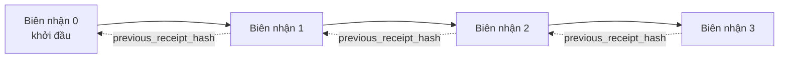

[Xem video bài học: Bảo mật các đại lý AI với Biên lai Mã hóa](https://youtu.be/PLACEHOLDER_VIDEO_ID)

> _(Video và hình thu nhỏ của bài học sẽ được nhóm nội dung Microsoft thêm sau khi gộp, theo mẫu bài học 14 / 15.)_

# Bảo mật các đại lý AI với Biên lai Mã hóa

## Giới thiệu

Bài học này sẽ bao gồm:

- Tại sao việc có các dấu vết kiểm toán cho đại lý AI lại quan trọng đối với tuân thủ, gỡ lỗi và tin cậy.
- Biên lai mã hóa là gì và nó khác với một dòng nhật ký chưa ký như thế nào.
- Cách tạo ra một biên lai ký cho lời gọi công cụ của đại lý bằng Python thuần.
- Cách xác minh biên lai ngoại tuyến và phát hiện sự giả mạo.
- Cách xâu chuỗi các biên lai sao cho việc xoá hoặc sắp xếp lại một biên lai sẽ phá vỡ chuỗi.
- Biên lai chứng minh được gì và những gì chúng không chứng minh rõ ràng.

## Mục tiêu học tập

Sau khi hoàn thành bài học này, bạn sẽ biết cách:

- Nhận biết các chế độ thất bại thúc đẩy nguồn gốc mã hóa cho các hành động của đại lý.
- Tạo một biên lai ký Ed25519 trên một gói JSON chuẩn hóa.
- Xác minh biên lai một cách độc lập chỉ sử dụng khóa công khai của người ký.
- Phát hiện giả mạo bằng cách chạy lại xác minh trên một biên lai bị sửa đổi.
- Xây dựng chuỗi các biên lai có liên kết bằng hàm băm và giải thích tại sao chuỗi quan trọng.
- Nhận biết ranh giới giữa những gì biên lai chứng minh (định danh, tính toàn vẹn, thứ tự) và những gì chúng không chứng minh (độ chính xác của hành động, tính hợp lý của chính sách).

## Vấn đề: Dấu vết kiểm toán của đại lý bạn

Hãy tưởng tượng bạn đã triển khai một đại lý AI cho Contoso Travel. Đại lý này đọc yêu cầu khách hàng, gọi API chuyến bay để tìm lựa chọn, và đặt chỗ ngồi thay mặt khách hàng. Quý trước, đại lý đã xử lý 50.000 đặt chỗ.

Hôm nay một kiểm toán viên đến. Họ hỏi một câu đơn giản: "Cho tôi xem đại lý của bạn đã làm gì."

Bạn giao nộp các tập tin nhật ký. Kiểm toán viên xem và hỏi câu khó hơn: "Làm sao tôi biết các nhật ký này không bị chỉnh sửa?"

Đây là vấn đề dấu vết kiểm toán. Phần lớn các triển khai đại lý hiện nay dựa vào:

- **Nhật ký ứng dụng**: do chính đại lý ghi, có thể chỉnh sửa bởi bất kỳ ai có quyền truy cập hệ thống tập tin.
- **Dịch vụ ghi nhật ký đám mây**: có thể phát hiện giả mạo ở mức nền tảng nhưng chỉ khi kiểm toán viên tin tưởng nhà điều hành nền tảng.
- **Nhật ký giao dịch cơ sở dữ liệu**: phù hợp cho thay đổi cơ sở dữ liệu nhưng không tốt cho các cuộc gọi công cụ tùy ý.

Không cái nào trong số này có thể trả lời câu hỏi của kiểm toán viên mà không yêu cầu kiểm toán viên phải tin tưởng ai đó (bạn, nhà cung cấp đám mây, nhà cung cấp cơ sở dữ liệu). Đối với sử dụng nội bộ, sự tin tưởng đó thường chấp nhận được. Đối với khối lượng công việc được quy định (tài chính, chăm sóc sức khỏe, bất cứ thứ gì chịu luật AI EU), thì không được.

Biên lai mã hóa giải quyết vấn đề này bằng cách làm cho mỗi hành động của đại lý có thể kiểm chứng độc lập. Kiểm toán viên không cần phải tin bạn. Họ chỉ cần khóa công khai của bạn và chính biên lai.

## Biên lai Mã hóa là gì?

Một biên lai là một đối tượng JSON ghi lại những gì đại lý đã làm, được ký bằng chữ ký số.


```mermaid
flowchart LR
    A[Đại lý gọi công cụ] --> B[Xây dựng dữ liệu biên lai]
    B --> C[Chuẩn hóa JSON RFC 8785]
    C --> D[Băm SHA-256]
    D --> E[Ký Ed25519]
    E --> F[Biên lai có chữ ký]
    F --> G[Kiểm toán viên xác minh ngoại tuyến]
    G --> H{Chữ ký hợp lệ?}
    H -- yes --> I[Bằng chứng chống giả mạo]
    H -- no --> J[Biên lai bị từ chối]
```

Một biên lai tối thiểu trông như thế này:

```json
{
  "type": "agent.tool_call.v1",
  "agent_id": "contoso-travel-bot",
  "tool_name": "lookup_flights",
  "tool_args_hash": "sha256:a3f9c1...",
  "result_hash": "sha256:7b2e1d...",
  "policy_id": "contoso-travel-policy-v3",
  "timestamp": "2026-04-25T14:30:00Z",
  "sequence": 47,
  "previous_receipt_hash": "sha256:9d4e6a...",
  "signature": {
    "alg": "EdDSA",
    "sig": "c5af83...",
    "public_key": "8f3b2c..."
  }
}
```

Ba đặc tính đang thực hiện công việc:

1. **Chữ ký**. Biên lai được ký bởi cổng đại lý sử dụng khóa riêng Ed25519. Bất kỳ ai có khóa công khai tương ứng đều có thể xác minh chữ ký ngoại tuyến. Việc giả mạo bất kỳ trường nào sẽ làm mất hiệu lực chữ ký.

2. **Mã hóa chuẩn hóa**. Trước khi ký, biên lai được tuần tự hóa bằng JSON Canonicalization Scheme (JCS, RFC 8785). Điều này đảm bảo rằng hai triển khai tạo ra cùng một biên lai logic sinh ra đầu ra byte giống hệt nhau. Nếu không chuẩn hóa, các trình tuần tự JSON khác nhau sẽ tạo ra các chữ ký khác nhau cho cùng một nội dung.

3. **Xâu chuỗi hàm băm**. Trường `previous_receipt_hash` liên kết mỗi biên lai với biên lai trước nó. Việc xoá hoặc sắp xếp lại một biên lai sẽ phá vỡ mọi biên lai đi sau. Giả mạo trở nên có thể phát hiện ở mức chuỗi ngay cả khi chữ ký riêng lẻ bị vượt qua.

Những đặc tính này cùng nhau cung cấp ba đảm bảo:

- **Định danh**: khóa này đã ký nội dung này.
- **Tính toàn vẹn**: nội dung không thay đổi kể từ khi được ký.
- **Thứ tự**: biên lai này đến sau biên lai kia trong chuỗi.

## Tạo một Biên lai trong Python

Bạn không cần thư viện đặc biệt để tạo biên lai. Các nguyên thủy mã hóa phổ biến và logic chỉ là vài chục dòng Python.

Bài tập thực hành trong `code_samples/18-signed-receipts.ipynb` hướng dẫn toàn bộ quy trình. Phiên bản tóm tắt:

```python
import json
import hashlib
import base64
from nacl import signing
from jcs import canonicalize  # JSON chuẩn RFC 8785

def b64url_nopad(data: bytes) -> str:
    return base64.urlsafe_b64encode(data).decode("ascii").rstrip("=")

def sha256_canonical(obj) -> str:
    """SHA-256 of a Python object's JCS-canonical JSON form."""
    return f"sha256:{hashlib.sha256(canonicalize(obj)).hexdigest()}"

# Tạo hoặc tải khóa ký (trong môi trường sản xuất, lưu trong kho khóa)
signing_key = signing.SigningKey.generate()
verify_key = signing_key.verify_key

# Xây dựng nội dung biên lai (chưa có chữ ký)
tool_args = {"origin": "SYD", "destination": "LAX"}
tool_result = [{"flight": "QF11", "price": 1850, "stops": 0}]

payload = {
    "type": "agent.tool_call.v1",
    "agent_id": "contoso-travel-bot",
    "tool_name": "lookup_flights",
    "tool_args_hash": sha256_canonical(tool_args),
    "result_hash": sha256_canonical(tool_result),
    "policy_id": "contoso-travel-policy-v3",
    "timestamp": "2026-04-25T14:30:00Z",
    "sequence": 0,
    "previous_receipt_hash": None,
}

# Chuẩn hóa, băm, ký.
canonical_bytes = canonicalize(payload)
message_hash = hashlib.sha256(canonical_bytes).digest()
signature_bytes = signing_key.sign(message_hash).signature

# Đính kèm đối tượng chữ ký có cấu trúc.
receipt = {
    **payload,
    "signature": {
        "alg": "EdDSA",
        "sig": b64url_nopad(signature_bytes),
        "public_key": b64url_nopad(bytes(verify_key)),
    },
}
```

Đó là toàn bộ quy trình ký. Các bài tập trong notebook hướng dẫn từng bước.

## Xác minh Biên lai và Phát hiện Giả mạo

Xác minh là thao tác nghịch đảo:

```python
import base64
import hashlib
from nacl import signing
from nacl.exceptions import BadSignatureError
from jcs import canonicalize

def b64url_decode(s: str) -> bytes:
    padding = "=" * ((4 - len(s) % 4) % 4)
    return base64.urlsafe_b64decode(s + padding)

def verify_receipt(receipt: dict) -> bool:
    # Chữ ký là một đối tượng có cấu trúc: {"alg", "sig", "public_key"}.
    sig_obj = receipt.get("signature")
    if not sig_obj or sig_obj.get("alg") != "EdDSA":
        return False

    # Tái tạo lại phần payload thực sự đã được ký (mọi thứ ngoại trừ chữ ký).
    payload = {k: v for k, v in receipt.items() if k != "signature"}

    canonical_bytes = canonicalize(payload)
    message_hash = hashlib.sha256(canonical_bytes).digest()

    try:
        verify_key = signing.VerifyKey(b64url_decode(sig_obj["public_key"]))
        verify_key.verify(message_hash, b64url_decode(sig_obj["sig"]))
        return True
    except BadSignatureError:
        return False
```

Hàm này nhận một biên lai và trả về `True` nếu chữ ký hợp lệ, `False` nếu không. Không gọi mạng, không phụ thuộc dịch vụ, không cần tin tưởng bên thứ ba.

Để xem phát hiện giả mạo hoạt động như thế nào, notebook hướng dẫn:

1. Tạo một biên lai hợp lệ và xác nhận nó xác minh được.
2. Thay đổi một byte của trường `tool_args_hash`.
3. Chạy lại xác minh và thấy nó thất bại.

Đây là minh chứng thực tế rằng biên lai có thể phát hiện giả mạo: bất kỳ sửa đổi nào, dù nhỏ, sẽ làm mất tính hợp lệ của chữ ký.

## Xâu chuỗi các Biên lai cho Đại lý Đa bước

Một biên lai ký đơn bảo vệ một hành động. Một chuỗi biên lai bảo vệ một chuỗi hành động.


```mermaid
flowchart LR
    R0[Biên nhận 0<br/>khởi đầu] --> R1[Biên nhận 1]
    R1 --> R2[Biên nhận 2]
    R2 --> R3[Biên nhận 3]
    R1 -. previous_receipt_hash .-> R0
    R2 -. previous_receipt_hash .-> R1
    R3 -. previous_receipt_hash .-> R2
```

Mỗi biên lai ghi lại hàm băm của biên lai trước đó. Để xoá biên lai số 2 một cách lặng lẽ, kẻ tấn công cần:

- Sửa đổi trường `previous_receipt_hash` của biên lai số 3 (phá vỡ chữ ký của biên lai 3), HOẶC
- Làm giả chữ ký mới trên biên lai 3 đã sửa đổi (cần khóa riêng của đại lý).

Nếu khóa riêng nằm trong khoá phần cứng và bạn công khai khóa công khai cùng mỗi biên lai, cả hai cuộc tấn công đều không khả thi mà không bị phát hiện.

Notebook hướng dẫn:

1. Xây dựng chuỗi gồm ba biên lai.
2. Xác minh rằng `previous_receipt_hash` của mỗi biên lai khớp với hàm băm thực tế của biên lai liền trước.
3. Giả mạo một biên lai ở giữa và thấy chuỗi bị phá vỡ ngay tại điểm đó.

Đây là cách bạn tạo dấu vết kiểm toán để kiểm toán viên bên ngoài có thể xác minh mà không cần tin bạn.

## Biên lai chứng minh được gì (và không chứng minh được gì)

Đây là phần quan trọng nhất của bài học này. Biên lai rất mạnh mẽ nhưng sức mạnh đó có giới hạn.

**Biên lai chứng minh ba điều:**

1. **Định danh**: một khóa cụ thể đã ký một gói cụ thể.
2. **Tính toàn vẹn**: gói không thay đổi kể từ khi được ký.
3. **Thứ tự**: biên lai này đến sau biên lai kia trong chuỗi hàm băm.

**Biên lai KHÔNG chứng minh:**

1. **Chính xác**: rằng hành động của đại lý là đúng. Một biên lai có thể ký cho câu trả lời sai một cách sạch sẽ như câu trả lời đúng.
2. **Tuân thủ chính sách**: rằng chính sách nêu trong `policy_id` thực sự được đánh giá, hoặc rằng nó sẽ cho phép hành động này nếu được kiểm tra. Biên lai ghi lại điều đã tuyên bố, không phải điều đã thực thi.
3. **Nhận dạng vượt quá khóa**: biên lai nói "khóa này ký nội dung này." Nó không nói "con người này đã cấp quyền." Kết nối khóa với người hoặc tổ chức cần hạ tầng nhận dạng riêng biệt (thư mục, đăng ký khóa công khai,…).
4. **Tính chân thực của đầu vào**: nếu đại lý nhận prompt bị thao túng và hành động theo đó, biên lai ghi lại hành động trung thực. Biên lai là đầu cuối của xác thực đầu vào, không phải thay thế cho nó.

Giới hạn này quan trọng vì hai lý do:

- Nó nói cho bạn biết biên lai hữu ích cho việc gì: làm cho hành vi đại lý có thể kiểm toán và phát hiện giả mạo, thậm chí qua ranh giới tổ chức.
- Nó hướng dẫn bạn những lớp bổ sung cần có: xác thực đầu vào (Bài học 6), thực thi chính sách (được đề cập ngắn dưới đây), và hạ tầng nhận dạng (ngoài phạm vi bài học này).

Một sai lầm phổ biến là cho rằng "chúng ta có biên lai" có nghĩa là "chúng ta được quản trị." Không phải vậy. Biên lai là nền tảng. Quản trị là hệ thống bạn xây dựng trên đó.

## Tham khảo sản xuất

Mã Python trong bài học này cố ý tối giản để bạn có thể đọc từng dòng và hiểu chính xác điều đang xảy ra. Trong sản xuất, bạn có hai lựa chọn:

1. **Xây dựng trực tiếp trên các nguyên thủy mã hóa.** 50 dòng bạn vừa thấy đủ cho nhiều trường hợp sử dụng. PyNaCl (Ed25519) và gói `jcs` (JSON chuẩn hóa) là thư viện được duy trì và kiểm tra tốt.

2. **Dùng thư viện biên lai sản xuất.** Một số dự án mã nguồn mở thực hiện cùng mẫu với các tính năng bổ sung (xoay khóa, xác minh hàng loạt, phân phối JWK Set, tích hợp với công cụ chính sách):
   - Định dạng biên lai dùng trong bài học này theo một Dự thảo Internet IETF (`draft-farley-acta-signed-receipts`) đang trong quy trình chuẩn hóa.
   - Bộ công cụ Quản trị Đại lý Microsoft ghép biên lai với quyết định chính sách dựa trên Cedar; xem Bài hướng dẫn 33 trong kho đó để có ví dụ toàn diện.
   - Gói `protect-mcp` (npm) và `@veritasacta/verify` (npm) cung cấp triển khai Node về ký biên lai và xác minh ngoại tuyến, dùng để bao quanh bất kỳ máy chủ MCP nào với dấu vết kiểm toán phát hiện giả mạo.
   - Bộ SDK Python **[nobulex](https://github.com/arian-gogani/nobulex)** (`pip install nobulex`) cung cấp cùng mẫu ký Ed25519 + JCS trong Python với tích hợp LangChain và CrewAI, bao gồm vector kiểm tra xác nhận chéo xuất bản và bản đồ tuân thủ được đóng góp qua [PR OWASP #2210](https://github.com/OWASP/CheatSheetSeries/pull/2210).

Quyết định giữa tự viết và sử dụng thư viện phản ánh quyết định giữa tự viết thư viện JWT và dùng thư viện đã được thử nghiệm: cả hai đều hợp lý; thư viện tiết kiệm thời gian và giảm bề mặt kiểm toán; cách làm từ đầu buộc bạn hiểu mọi nguyên thủy. Bài học này dạy theo cách làm từ đầu để bạn có nền tảng cho cả hai lựa chọn.

## Kiểm tra kiến thức

Kiểm tra hiểu biết của bạn trước khi chuyển sang bài tập thực hành.

**1. Một biên lai được ký bằng khóa riêng Ed25519 của đại lý. Kiểm toán viên chỉ có khóa công khai. Kiểm toán viên có thể xác minh biên lai ngoại tuyến không?**

<details>
<summary>Trả lời</summary>

Có. Xác minh Ed25519 chỉ cần khóa công khai và các byte đã ký. Không gọi mạng, không phụ thuộc dịch vụ. Đây là đặc tính làm biên lai hữu dụng trong môi trường cách ly mạng, đa tổ chức hoặc kiểm toán tin cậy thấp.
</details>

**2. Kẻ tấn công sửa đổi trường `policy_id` của một biên lai để tuyên bố nó được điều chỉnh bởi một chính sách khoan dung hơn. Chữ ký được tạo trên gói ban đầu. Điều gì xảy ra trong quá trình xác minh?**

<details>
<summary>Trả lời</summary>

Xác minh thất bại. Chữ ký được tính trên bytes chuẩn hóa của gói ban đầu; sửa đổi bất kỳ trường nào sẽ thay đổi bytes chuẩn hóa, làm thay đổi hàm băm SHA-256, khiến chữ ký không hợp lệ. Kẻ tấn công phải có khóa riêng để tạo chữ ký mới hợp lệ, nhưng họ không có.
</details>

**3. Tại sao biên lai bao gồm `tool_args_hash` và `result_hash` thay vì các đối số và kết quả thô?**

<details>
<summary>Trả lời</summary>

Hai lý do. Thứ nhất, biên lai có thể cần lưu trữ lâu dài hoặc truyền qua môi trường mà việc rò rỉ nội dung thô (thông tin cá nhân, dữ liệu kinh doanh) là vấn đề. Băm giữ cho biên lai nhỏ và nội dung riêng tư; kiểm toán viên xác minh băm khớp với bản sao nội dung lưu riêng biệt. Thứ hai, các hàm băm có kích thước cố định; biên lai có hàm băm có kích thước giới hạn bất kể đầu vào đầu ra lớn thế nào.
</details>

**4. Trường `previous_receipt_hash` liên kết mỗi biên lai với biên lai trước đó. Nếu kẻ tấn công lặng lẽ xoá một biên lai ở giữa chuỗi, điều gì sẽ trở nên không hợp lệ?**

<details>
<summary>Trả lời</summary>

Mọi biên lai sau biên lai bị xoá. Trường `previous_receipt_hash` của chúng không còn khớp với chuỗi thực tế (vì biên lai được tham chiếu không tồn tại, hoặc chuỗi giờ tham chiếu đến tiền nhiệm khác). Để che giấu việc xoá, kẻ tấn công sẽ phải ký lại tất cả các biên lai sau đó, cần khóa riêng.
</details>

**5. Biên lai xác minh thành công. Điều đó có chứng minh hành động của đại lý là đúng, hợp lệ hoặc tuân theo chính sách không?**

<details>
<summary>Trả lời</summary>

Không. Biên lai hợp lệ chứng minh ba điều: định danh (khóa này ký nội dung này), tính toàn vẹn (nội dung không thay đổi), và thứ tự (biên lai này đến sau biên lai kia). Nó KHÔNG chứng minh rằng hành động là đúng, chính sách nêu trong `policy_id` được đánh giá, hoặc đại lý tuân thủ mọi quy tắc. Biên lai làm cho hành vi đại lý có thể kiểm toán, không nhất thiết là đúng. Đây là ranh giới quan trọng nhất trong bài học.
</details>

## Bài tập Thực hành

Mở `code_samples/18-signed-receipts.ipynb` và hoàn thành cả bốn phần:

1. **Phần 1**: Ký biên lai đầu tiên và xác minh nó.
2. **Phần 2**: Giả mạo biên lai và quan sát xác minh thất bại.
3. **Phần 3**: Xây dựng chuỗi ba biên lai và xác minh tính toàn vẹn chuỗi.
4. **Phần 4**: Áp dụng mẫu cho đại lý xây bằng Microsoft Agent Framework: bao bọc lời gọi công cụ trong ký biên lai, sau đó xác minh biên lai độc lập.


**Thử thách nâng cao 1:** mở rộng lược đồ biên lai với một trường bổ sung mà bạn chọn (ví dụ, một ID yêu cầu để truy vết), cập nhật logic ký chuẩn để bao gồm nó, và xác nhận rằng biên lai vẫn có thể qua vòng xác minh. Sau đó sửa đổi trường đó sau khi ký và xác nhận việc xác minh thất bại. Điều này buộc bạn phải hiểu cách mỗi byte của mã hóa chuẩn đóng góp vào chữ ký.

**Thử thách nâng cao 2:** Băm SHA-256 hai biên lai của bạn cùng nhau (nối các byte chuẩn của chúng theo thứ tự xác định) và nhúng digest kết quả như một trường mới trên biên lai thứ ba trước khi ký nó. Xác minh rằng cả ba biên lai vẫn có thể qua vòng. Bạn vừa xây dựng một bằng chứng bao gồm một bước: bất kỳ ai giữ biên lai thứ ba có thể chứng minh hai biên lai đầu tiên đã tồn tại vào thời điểm nó được ký mà không cần tiết lộ nội dung của chúng. Đây là mẫu mà các biên lai tiết lộ có chọn lọc sử dụng ở quy mô lớn (cam kết Merkle, RFC 6962).

## Kết luận

Biên lai mật mã cung cấp cho các đại lý AI một lộ trình kiểm toán mà:

- **Có thể xác minh độc lập:** bất kỳ bên nào có khóa công khai đều có thể xác minh, không phụ thuộc dịch vụ.
- **Chứng minh sửa đổi:** bất kỳ sửa đổi nào cũng làm chữ ký không hợp lệ.
- **Di động:** biên lai là một file JSON nhỏ; có thể lưu trữ, truyền đi và xác minh ở bất cứ đâu.
- **Tuân thủ tiêu chuẩn:** xây dựng trên Ed25519 (RFC 8032), JCS (RFC 8785), và SHA-256, tất cả đều là các nguyên thủy được triển khai rộng rãi.

Chúng không thay thế việc xác thực đầu vào, thực thi chính sách, hoặc hạ tầng định danh. Chúng là nền tảng cho những lớp đó. Khi bạn triển khai các đại lý trong các khối công việc được quản lý, quy trình đa tổ chức, hoặc bất kỳ môi trường nào mà không thể giả định kiểm toán viên tương lai tin bạn, biên lai là cách bạn làm cho lộ trình kiểm toán trở nên trung thực.

Điều quan trọng nhất: biên lai chứng minh ai nói gì, khi nào. Chúng không chứng minh rằng điều được nói là sự thật hay đúng đắn. Giữ chặt phân biệt đó. Đó là sự khác biệt giữa hệ thống nguồn gốc trung thực và hệ thống gây hiểu lầm.

## Danh sách kiểm tra triển khai sản xuất

Khi bạn sẵn sàng từ bài học này chuyển sang triển khai các đại lý ký biên lai trong môi trường thực:

- [ ] **Di chuyển khóa ký khỏi laptop phát triển.** Sử dụng Azure Key Vault, AWS KMS, hoặc mô-đun bảo mật phần cứng. Khóa riêng tư ký biên lai của bạn tuyệt đối không được tồn tại trong hệ thống kiểm soát nguồn hoặc dưới dạng văn bản thuần trên máy chủ ứng dụng.
- [ ] **Công bố khóa công khai xác minh.** Kiểm toán viên cần nó để xác minh offline. Mẫu chuẩn là tập JWK tại URL được biết đến (RFC 7517), ví dụ `https://your-org.example.com/.well-known/agent-keys.json`.
- [ ] **Neo chuỗi ra bên ngoài.** Định kỳ ghi mã băm đầu chuỗi mới nhất vào nhật ký minh bạch (Sigstore Rekor, cơ quan xác thực dấu thời gian RFC 3161 hoặc hệ thống nội bộ thứ hai) để bên ngoài có thể xác nhận "chuỗi này tồn tại tại thời điểm này."
- [ ] **Lưu trữ biên lai bất biến.** Lưu trữ blob chỉ thêm (Azure Storage với chính sách bất biến, AWS S3 Object Lock) ngăn chặn nội bộ sửa lại lịch sử ở lớp lưu trữ.
- [ ] **Quyết định về thời gian lưu trữ.** Nhiều quy định yêu cầu lưu giữ nhiều năm. Lập kế hoạch cho sự tăng trưởng biên lai (mỗi biên lai khoảng 500 byte; một đại lý tạo 10K cuộc gọi mỗi ngày sẽ tạo khoảng 1.8 GB mỗi năm).
- [ ] **Ghi lại những gì biên lai không bao phủ.** Biên lai chứng minh thuộc tính, tính toàn vẹn và thứ tự. Quy trình vận hành của bạn nên liệt kê rõ ràng các kiểm soát bổ sung (xác thực đầu vào, thực thi chính sách, giới hạn tỷ lệ, cơ sở hạ tầng định danh) đi cùng biên lai trong vị thế quản trị của bạn.

### Có thêm câu hỏi về Bảo mật Đặc vụ AI?

Tham gia [Microsoft Foundry Discord](https://aka.ms/ai-agents/discord) để gặp các học viên khác, tham dự giờ tư vấn, và được giải đáp thắc mắc về các đại lý AI của bạn.

## Ngoài bài học này

Bài học này bao gồm ký đơn lẻ biên lai và các chuỗi băm liên kết. Cùng các nguyên thủy này tạo thành nhiều mẫu nâng cao mà bạn có thể gặp khi vị thế quản trị của bạn trưởng thành:

- **Tiết lộ có chọn lọc.** Khi các trường của biên lai được cam kết độc lập (cây Merkle kiểu RFC 6962), bạn có thể tiết lộ các trường cụ thể cho kiểm toán viên cụ thể và chứng minh phần còn lại không thay đổi mà không cần phơi bày chúng. Hữu ích khi cùng một biên lai phải đáp ứng cả một kiểm toán toàn diện (muốn độ đầy đủ) và các quy định giảm thiểu dữ liệu như GDPR (muốn kiểm toán viên chỉ thấy ít nhất cần thiết).
- **Thu hồi biên lai.** Nếu một khóa ký bị lộ, bạn cần cách đánh dấu tất cả biên lai ký bằng khóa đó là không đáng tin từ một thời điểm trở đi. Mẫu chuẩn: khóa ký ngắn hạn cộng danh sách thu hồi công bố, hoặc nhật ký minh bạch với mục thu hồi.
- **Biên lai song phương / ký chia đôi.** Một số triển khai chia tải trọng ký thành hai nửa trước thực thi (`authorization_*`) và sau thực thi (`result_*`) với chữ ký độc lập, hữu ích khi quyết định ủy quyền và kết quả quan sát được tạo ra bởi các thực thể khác nhau hoặc vào thời điểm khác nhau. Điều này áp dụng bổ sung trên định dạng biên lai dạy trong bài này.
- **Tạo tải trọng.** Biên lai niêm phong bất kỳ byte nào bạn đặt trong `result_hash`. Tải trọng thế giới thực thường phong phú hơn kết quả gọi công cụ đơn lẻ: lý luận trước quyết định (dự đoán mô hình, các tùy chọn đã xem xét, bằng chứng và tính đầy đủ, tư thế rủi ro, chuỗi trách nhiệm, kết quả cổng) tất cả đều có thể nằm trong tải trọng, được niêm phong bởi một biên lai duy nhất. Điều này giữ định dạng biên lai tối giản trong khi cho phép sơ đồ tải trọng phát triển theo từng lĩnh vực.
- **Tuân thủ đa triển khai.** Nhiều triển khai độc lập cùng định dạng biên lai (Python, TypeScript, Rust, Go) xác minh chéo dựa trên các vector kiểm thử chung. Nếu bạn xây dựng triển khai riêng, xác minh với vector công bố xác nhận tương thích wire.
- **Di cư hậu lượng tử.** Ed25519 được triển khai rộng rãi hiện nay nhưng không chống lượng tử. Định dạng biên lai có thể thay đổi thuật toán: trường `signature.alg` có thể mang giá trị `ML-DSA-65` (tiêu chuẩn chữ ký hậu lượng tử NIST) khi bạn cần di cư. Lập kế hoạch cho giai đoạn chuyển tiếp khi biên lai được ký kép.

## Tài nguyên bổ sung

- <a href="https://datatracker.ietf.org/doc/draft-farley-acta-signed-receipts/" target="_blank">Bản thảo IETF Internet: Biên Lai Quyết Định Đã Ký cho Kiểm Soát Truy Cập Máy-Máy</a>
- <a href="https://learn.microsoft.com/azure/ai-studio/responsible-use-of-ai-overview" target="_blank">Tổng quan AI có trách nhiệm (Azure AI)</a>
- <a href="https://datatracker.ietf.org/doc/html/rfc8032" target="_blank">RFC 8032: Thuật toán Chữ ký Kỹ thuật số Đường cong Edwards (EdDSA)</a>
- <a href="https://datatracker.ietf.org/doc/html/rfc8785" target="_blank">RFC 8785: Sơ đồ Chuẩn hóa JSON (JCS)</a>
- <a href="https://datatracker.ietf.org/doc/html/rfc6962" target="_blank">RFC 6962: Minh bạch Chứng chỉ</a> (Cấu trúc cây Merkle được sử dụng bởi biên lai tiết lộ có chọn lọc)
- <a href="https://github.com/microsoft/agent-governance-toolkit/blob/main/docs/tutorials/33-offline-verifiable-receipts.md" target="_blank">Bộ công cụ Quản trị Đại lý Microsoft, Hướng dẫn 33: Biên lai Quyết Định có thể xác minh Offline</a>
- <a href="https://github.com/ScopeBlind/agent-governance-testvectors" target="_blank">Vector kiểm thử tuân thủ đa triển khai</a> cho định dạng biên lai dùng trong bài học này (Apache-2.0)
- <a href="https://pynacl.readthedocs.io/" target="_blank">Tài liệu PyNaCl</a> (Ed25519 trong Python)

## Bài học trước

[Xây dựng các Đại lý Sử dụng Máy tính (CUA)](../15-browser-use/README.md)

---

<!-- CO-OP TRANSLATOR DISCLAIMER START -->
**Tuyên bố miễn trừ trách nhiệm**:
Tài liệu này đã được dịch bằng dịch vụ dịch thuật AI [Co-op Translator](https://github.com/Azure/co-op-translator). Mặc dù chúng tôi cố gắng đảm bảo độ chính xác, xin lưu ý rằng bản dịch tự động có thể chứa lỗi hoặc sai sót. Tài liệu gốc bằng ngôn ngữ gốc nên được coi là nguồn tin chính thức. Đối với thông tin quan trọng, nên sử dụng dịch vụ dịch thuật chuyên nghiệp bởi con người. Chúng tôi không chịu trách nhiệm về bất kỳ hiểu lầm hoặc giải thích sai nào phát sinh từ việc sử dụng bản dịch này.
<!-- CO-OP TRANSLATOR DISCLAIMER END -->