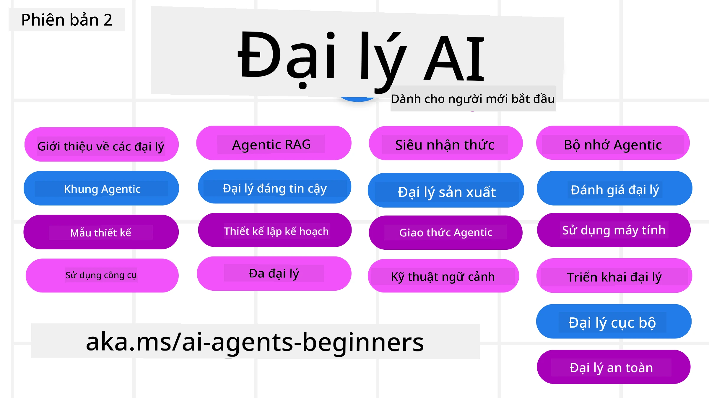

# AI Agents for Beginners - Khóa học



## Một khóa học dạy mọi thứ bạn cần biết để bắt đầu xây dựng AI Agents

[](https://github.com/microsoft/ai-agents-for-beginners/blob/master/LICENSE?WT.mc_id=academic-105485-koreyst)
[](https://GitHub.com/microsoft/ai-agents-for-beginners/graphs/contributors/?WT.mc_id=academic-105485-koreyst)
[](https://GitHub.com/microsoft/ai-agents-for-beginners/issues/?WT.mc_id=academic-105485-koreyst)
[](https://GitHub.com/microsoft/ai-agents-for-beginners/pulls/?WT.mc_id=academic-105485-koreyst)
[](http://makeapullrequest.com?WT.mc_id=academic-105485-koreyst)

### 🌐 Hỗ trợ đa ngôn ngữ

#### Hỗ trợ qua GitHub Action (Tự động & Luôn cập nhật)

<!-- CO-OP TRANSLATOR LANGUAGES TABLE START -->
[Arabic](../ar/README.md) | [Bengali](../bn/README.md) | [Bulgarian](../bg/README.md) | [Burmese (Myanmar)](../my/README.md) | [Chinese (Simplified)](../zh-CN/README.md) | [Chinese (Traditional, Hong Kong)](../zh-HK/README.md) | [Chinese (Traditional, Macau)](../zh-MO/README.md) | [Chinese (Traditional, Taiwan)](../zh-TW/README.md) | [Croatian](../hr/README.md) | [Czech](../cs/README.md) | [Danish](../da/README.md) | [Dutch](../nl/README.md) | [Estonian](../et/README.md) | [Finnish](../fi/README.md) | [French](../fr/README.md) | [German](../de/README.md) | [Greek](../el/README.md) | [Hebrew](../he/README.md) | [Hindi](../hi/README.md) | [Hungarian](../hu/README.md) | [Indonesian](../id/README.md) | [Italian](../it/README.md) | [Japanese](../ja/README.md) | [Kannada](../kn/README.md) | [Korean](../ko/README.md) | [Lithuanian](../lt/README.md) | [Malay](../ms/README.md) | [Malayalam](../ml/README.md) | [Marathi](../mr/README.md) | [Nepali](../ne/README.md) | [Nigerian Pidgin](../pcm/README.md) | [Norwegian](../no/README.md) | [Persian (Farsi)](../fa/README.md) | [Polish](../pl/README.md) | [Portuguese (Brazil)](../pt-BR/README.md) | [Portuguese (Portugal)](../pt-PT/README.md) | [Punjabi (Gurmukhi)](../pa/README.md) | [Romanian](../ro/README.md) | [Russian](../ru/README.md) | [Serbian (Cyrillic)](../sr/README.md) | [Slovak](../sk/README.md) | [Slovenian](../sl/README.md) | [Spanish](../es/README.md) | [Swahili](../sw/README.md) | [Swedish](../sv/README.md) | [Tagalog (Filipino)](../tl/README.md) | [Tamil](../ta/README.md) | [Telugu](../te/README.md) | [Thai](../th/README.md) | [Turkish](../tr/README.md) | [Ukrainian](../uk/README.md) | [Urdu](../ur/README.md) | [Vietnamese](./README.md)

> **Ưa thích Tải Về Máy?**
>
> Kho lưu trữ này bao gồm hơn 50 bản dịch ngôn ngữ làm tăng đáng kể kích thước tải về. Để tải mà không có bản dịch, hãy sử dụng sparse checkout:
>
> **Bash / macOS / Linux:**
> ```bash
> git clone --filter=blob:none --sparse https://github.com/microsoft/ai-agents-for-beginners.git
> cd ai-agents-for-beginners
> git sparse-checkout set --no-cone '/*' '!translations' '!translated_images'
> ```
>
> **CMD (Windows):**
> ```cmd
> git clone --filter=blob:none --sparse https://github.com/microsoft/ai-agents-for-beginners.git
> cd ai-agents-for-beginners
> git sparse-checkout set --no-cone "/*" "!translations" "!translated_images"
> ```
>
> Điều này cung cấp cho bạn mọi thứ bạn cần để hoàn thành khóa học với tốc độ tải về nhanh hơn nhiều.
<!-- CO-OP TRANSLATOR LANGUAGES TABLE END -->

**Nếu bạn muốn hỗ trợ thêm các ngôn ngữ dịch khác, các ngôn ngữ được hỗ trợ được liệt kê [tại đây](https://github.com/Azure/co-op-translator/blob/main/getting_started/supported-languages.md)**

[](https://GitHub.com/microsoft/ai-agents-for-beginners/watchers/?WT.mc_id=academic-105485-koreyst)
[](https://GitHub.com/microsoft/ai-agents-for-beginners/network/?WT.mc_id=academic-105485-koreyst)
[](https://GitHub.com/microsoft/ai-agents-for-beginners/stargazers/?WT.mc_id=academic-105485-koreyst)

[](https://discord.gg/nTYy5BXMWG)


## 🌱 Bắt đầu

Khóa học này có các bài học bao gồm các kiến thức cơ bản về xây dựng AI Agents. Mỗi bài học đề cập tới một chủ đề riêng, vì vậy bạn có thể bắt đầu ở bất cứ đâu bạn thích!

Khóa học này có hỗ trợ đa ngôn ngữ. Hãy xem các [ngôn ngữ có sẵn tại đây](../..). 

Nếu đây là lần đầu tiên bạn xây dựng với các mô hình Generative AI, hãy xem khóa học [Generative AI For Beginners](https://aka.ms/genai-beginners) của chúng tôi, bao gồm 21 bài học về xây dựng với GenAI.

Đừng quên [thêm dấu sao (🌟) cho repo này](https://docs.github.com/en/get-started/exploring-projects-on-github/saving-repositories-with-stars?WT.mc_id=academic-105485-koreyst) và [fork repo này](https://github.com/microsoft/ai-agents-for-beginners/fork) để chạy mã nhé.

### Gặp gỡ các học viên khác, nhận câu trả lời cho câu hỏi của bạn

Nếu bạn gặp khó khăn hoặc có câu hỏi về xây dựng AI Agents, hãy tham gia Kênh Discord chuyên dụng của chúng tôi trong [Microsoft Foundry Discord](https://aka.ms/ai-agents/discord).

### Những gì bạn cần

Mỗi bài học trong khóa học này đều có các ví dụ mã, bạn có thể tìm thấy trong thư mục code_samples. Bạn có thể [fork repo này](https://github.com/microsoft/ai-agents-for-beginners/fork) để tạo bản sao riêng của bạn.  

Các ví dụ mã trong các bài tập này sử dụng Microsoft Agent Framework với Azure AI Foundry Agent Service V2:

- [Microsoft Foundry](https://aka.ms/ai-agents-beginners/ai-foundry) - Yêu cầu Tài khoản Azure

Khóa học này sử dụng các framework và dịch vụ AI Agent sau từ Microsoft:

- [Microsoft Agent Framework (MAF)](https://aka.ms/ai-agents-beginners/agent-framewrok)
- [Azure AI Foundry Agent Service V2](https://aka.ms/ai-agents-beginners/ai-agent-service)


Để biết thêm thông tin về cách chạy mã cho khóa học này, hãy xem [Course Setup](./00-course-setup/README.md).

## 🙏 Muốn giúp đỡ?

Bạn có đề xuất hoặc phát hiện lỗi chính tả hay lỗi mã? [Tạo issue](https://github.com/microsoft/ai-agents-for-beginners/issues?WT.mc_id=academic-105485-koreyst) hoặc [Tạo pull request](https://github.com/microsoft/ai-agents-for-beginners/pulls?WT.mc_id=academic-105485-koreyst)


## 📂 Mỗi bài học bao gồm

- Một bài học viết nằm trong README và một video ngắn
- Ví dụ mã Python sử dụng Microsoft Agent Framework với Azure AI Foundry
- Các liên kết đến tài nguyên bổ sung để bạn tiếp tục học


## 🗃️ Các bài học

| **Bài học**                                  | **Văn bản & Mã**                                   | **Video**                                                  | **Học thêm**                                                                          |
|----------------------------------------------|----------------------------------------------------|------------------------------------------------------------|----------------------------------------------------------------------------------------|
| Giới thiệu về AI Agents và Các Trường hợp sử dụng Agents | [Link](./01-intro-to-ai-agents/README.md)          | [Video](https://youtu.be/3zgm60bXmQk?si=z8QygFvYQv-9WtO1)  | [Link](https://aka.ms/ai-agents-beginners/collection?WT.mc_id=academic-105485-koreyst) |
| Khám phá các Framework Agentic                | [Link](./02-explore-agentic-frameworks/README.md)  | [Video](https://youtu.be/ODwF-EZo_O8?si=Vawth4hzVaHv-u0H)  | [Link](https://aka.ms/ai-agents-beginners/collection?WT.mc_id=academic-105485-koreyst) |
| Hiểu về các Mẫu thiết kế AI Agentic            | [Link](./03-agentic-design-patterns/README.md)     | [Video](https://youtu.be/m9lM8qqoOEA?si=BIzHwzstTPL8o9GF)  | [Link](https://aka.ms/ai-agents-beginners/collection?WT.mc_id=academic-105485-koreyst) |
| Mẫu thiết kế Sử dụng Công cụ                  | [Link](./04-tool-use/README.md)                    | [Video](https://youtu.be/vieRiPRx-gI?si=2z6O2Xu2cu_Jz46N)  | [Link](https://aka.ms/ai-agents-beginners/collection?WT.mc_id=academic-105485-koreyst) |
| Agentic RAG                                  | [Link](./05-agentic-rag/README.md)                 | [Video](https://youtu.be/WcjAARvdL7I?si=gKPWsQpKiIlDH9A3)  | [Link](https://aka.ms/ai-agents-beginners/collection?WT.mc_id=academic-105485-koreyst) |
| Xây dựng AI Agents Đáng tin cậy                | [Link](./06-building-trustworthy-agents/README.md) | [Video](https://youtu.be/iZKkMEGBCUQ?si=jZjpiMnGFOE9L8OK ) | [Link](https://aka.ms/ai-agents-beginners/collection?WT.mc_id=academic-105485-koreyst) |
| Mẫu thiết kế Lập kế hoạch                      | [Link](./07-planning-design/README.md)             | [Video](https://youtu.be/kPfJ2BrBCMY?si=6SC_iv_E5-mzucnC)  | [Link](https://aka.ms/ai-agents-beginners/collection?WT.mc_id=academic-105485-koreyst) |
| Mẫu thiết kế Đa tác nhân                        | [Link](./08-multi-agent/README.md)                 | [Video](https://youtu.be/V6HpE9hZEx0?si=rMgDhEu7wXo2uo6g)  | [Link](https://aka.ms/ai-agents-beginners/collection?WT.mc_id=academic-105485-koreyst) |
| Mẫu thiết kế Siêu nhận thức                     | [Link](./09-metacognition/README.md)               | [Video](https://youtu.be/His9R6gw6Ec?si=8gck6vvdSNCt6OcF)  | [Link](https://aka.ms/ai-agents-beginners/collection?WT.mc_id=academic-105485-koreyst) |
| Tác nhân AI trong sản xuất                      | [Link](./10-ai-agents-production/README.md)        | [Video](https://youtu.be/l4TP6IyJxmQ?si=31dnhexRo6yLRJDl)  | [Link](https://aka.ms/ai-agents-beginners/collection?WT.mc_id=academic-105485-koreyst) |
| Sử dụng Giao thức Agentic (MCP, A2A và NLWeb) | [Link](./11-agentic-protocols/README.md)           | [Video](https://youtu.be/X-Dh9R3Opn8)                                 | [Link](https://aka.ms/ai-agents-beginners/collection?WT.mc_id=academic-105485-koreyst) |
| Kỹ thuật ngữ cảnh cho Tác nhân AI            | [Link](./12-context-engineering/README.md)         | [Video](https://youtu.be/F5zqRV7gEag)                                 | [Link](https://aka.ms/ai-agents-beginners/collection?WT.mc_id=academic-105485-koreyst) |
| Quản lý Bộ nhớ Agentic                      | [Link](./13-agent-memory/README.md)     |      [Video](https://youtu.be/QrYbHesIxpw?si=vZkVwKrQ4ieCcIPx)                                                      |                                                                                        |
| Khám phá Khung công tác Agent Microsoft                         | [Link](./14-microsoft-agent-framework/README.md)                            |                                                            |                                                                                        |
| Xây dựng Tác nhân Sử dụng Máy tính (CUA)           | Sắp có                            |                                                            |                                                                                        |
| Triển khai Tác nhân Có thể mở rộng                    | Sắp có                            |                                                            |                                                                                        |
| Tạo Tác nhân AI Cục bộ                     | Sắp có                               |                                                            |                                                                                        |
| Bảo mật Tác nhân AI                           | Sắp có                               |                                                            |                                                                                        |

## 🎒 Các Khóa học Khác

Nhóm của chúng tôi sản xuất các khóa học khác! Hãy xem:

<!-- CO-OP TRANSLATOR OTHER COURSES START -->
### LangChain
[](https://aka.ms/langchain4j-for-beginners)
[](https://aka.ms/langchainjs-for-beginners?WT.mc_id=m365-94501-dwahlin)
[](https://github.com/microsoft/langchain-for-beginners?WT.mc_id=m365-94501-dwahlin)
---

### Azure / Edge / MCP / Agents
[](https://github.com/microsoft/AZD-for-beginners?WT.mc_id=academic-105485-koreyst)
[](https://github.com/microsoft/edgeai-for-beginners?WT.mc_id=academic-105485-koreyst)
[](https://github.com/microsoft/mcp-for-beginners?WT.mc_id=academic-105485-koreyst)
[](https://github.com/microsoft/ai-agents-for-beginners?WT.mc_id=academic-105485-koreyst)

---
 
### Chuỗi AI Sinh tạo
[](https://github.com/microsoft/generative-ai-for-beginners?WT.mc_id=academic-105485-koreyst)
[-9333EA?style=for-the-badge&labelColor=E5E7EB&color=9333EA)](https://github.com/microsoft/Generative-AI-for-beginners-dotnet?WT.mc_id=academic-105485-koreyst)
[-C084FC?style=for-the-badge&labelColor=E5E7EB&color=C084FC)](https://github.com/microsoft/generative-ai-for-beginners-java?WT.mc_id=academic-105485-koreyst)
[-E879F9?style=for-the-badge&labelColor=E5E7EB&color=E879F9)](https://github.com/microsoft/generative-ai-with-javascript?WT.mc_id=academic-105485-koreyst)

---
 
### Học tập Cốt lõi
[](https://aka.ms/ml-beginners?WT.mc_id=academic-105485-koreyst)
[](https://aka.ms/datascience-beginners?WT.mc_id=academic-105485-koreyst)
[](https://aka.ms/ai-beginners?WT.mc_id=academic-105485-koreyst)
[](https://github.com/microsoft/Security-101?WT.mc_id=academic-96948-sayoung)
[](https://aka.ms/webdev-beginners?WT.mc_id=academic-105485-koreyst)
[](https://aka.ms/iot-beginners?WT.mc_id=academic-105485-koreyst)
[](https://github.com/microsoft/xr-development-for-beginners?WT.mc_id=academic-105485-koreyst)

---
 
### Chuỗi Copilot
[](https://aka.ms/GitHubCopilotAI?WT.mc_id=academic-105485-koreyst)
[](https://github.com/microsoft/mastering-github-copilot-for-dotnet-csharp-developers?WT.mc_id=academic-105485-koreyst)
[](https://github.com/microsoft/CopilotAdventures?WT.mc_id=academic-105485-koreyst)
<!-- CO-OP TRANSLATOR OTHER COURSES END -->

## 🌟 Lời Cảm Ơn Cộng Đồng

Cảm ơn [Shivam Goyal](https://www.linkedin.com/in/shivam2003/) đã đóng góp các mẫu mã quan trọng minh họa Agentic RAG.

## Đóng góp

Dự án này hoan nghênh các đóng góp và đề xuất. Phần lớn các đóng góp yêu cầu bạn đồng ý với
Thỏa thuận Giấy phép Người đóng góp (CLA) tuyên bố rằng bạn có quyền và thực sự cấp cho chúng tôi
quyền sử dụng đóng góp của bạn. Chi tiết xem tại <https://cla.opensource.microsoft.com>.

Khi bạn gửi pull request, một bot CLA sẽ tự động xác định liệu bạn có cần cung cấp
CLA và gắn nhãn PR phù hợp (ví dụ: kiểm tra trạng thái, bình luận). Chỉ cần làm theo hướng dẫn
do bot cung cấp. Bạn chỉ cần thực hiện điều này một lần với tất cả các repo sử dụng CLA của chúng tôi.

Dự án này đã áp dụng [Bộ Quy tắc Ứng xử Mã nguồn Mở Microsoft](https://opensource.microsoft.com/codeofconduct/).
Để biết thêm thông tin xem [Câu hỏi thường gặp về Bộ Quy tắc Ứng xử](https://opensource.microsoft.com/codeofconduct/faq/) hoặc
liên hệ [opencode@microsoft.com](mailto:opencode@microsoft.com) nếu có thắc mắc hoặc góp ý thêm.

## Nhãn hiệu

Dự án này có thể chứa nhãn hiệu hoặc logo cho các dự án, sản phẩm hoặc dịch vụ. Việc sử dụng được phép nhãn hiệu hoặc logo của Microsoft
phải tuân theo và bắt buộc theo
[Hướng dẫn Nhãn hiệu & Thương hiệu của Microsoft](https://www.microsoft.com/legal/intellectualproperty/trademarks/usage/general).
Việc sử dụng nhãn hiệu hoặc logo Microsoft trong các phiên bản sửa đổi của dự án này không được gây nhầm lẫn hoặc ngụ ý sự bảo trợ của Microsoft.
Bất kỳ việc sử dụng nhãn hiệu hoặc logo của bên thứ ba nào đều phải tuân theo các chính sách của bên thứ ba đó.

## Nhận trợ giúp


Nếu bạn gặp khó khăn hoặc có bất kỳ câu hỏi nào về xây dựng ứng dụng AI, tham gia:

[](https://aka.ms/foundry/discord)

Nếu bạn có phản hồi sản phẩm hoặc lỗi khi xây dựng, truy cập:

[](https://aka.ms/foundry/forum)

---

<!-- CO-OP TRANSLATOR DISCLAIMER START -->
**Tuyên bố từ chối trách nhiệm**:  
Tài liệu này đã được dịch bằng dịch vụ dịch thuật AI [Co-op Translator](https://github.com/Azure/co-op-translator). Mặc dù chúng tôi cố gắng đảm bảo độ chính xác, xin lưu ý rằng bản dịch tự động có thể chứa lỗi hoặc không chính xác. Tài liệu gốc bằng ngôn ngữ gốc nên được coi là nguồn tham khảo chính thức. Đối với thông tin quan trọng, khuyến nghị sử dụng dịch vụ dịch thuật chuyên nghiệp do con người thực hiện. Chúng tôi không chịu trách nhiệm cho bất kỳ sự hiểu lầm hay giải thích sai lệch nào phát sinh từ việc sử dụng bản dịch này.
<!-- CO-OP TRANSLATOR DISCLAIMER END -->