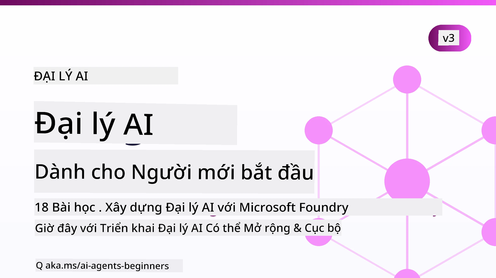

# Đại lý AI cho Người Mới Bắt Đầu - Một Khóa Học



## Một khóa học dạy tất cả những gì bạn cần biết để bắt đầu xây dựng Đại lý AI

[](https://github.com/microsoft/ai-agents-for-beginners/blob/master/LICENSE?WT.mc_id=academic-105485-koreyst)
[](https://GitHub.com/microsoft/ai-agents-for-beginners/graphs/contributors/?WT.mc_id=academic-105485-koreyst)
[](https://GitHub.com/microsoft/ai-agents-for-beginners/issues/?WT.mc_id=academic-105485-koreyst)
[](https://GitHub.com/microsoft/ai-agents-for-beginners/pulls/?WT.mc_id=academic-105485-koreyst)
[](http://makeapullrequest.com?WT.mc_id=academic-105485-koreyst)

### 🌐 Hỗ Trợ Đa Ngôn Ngữ

#### Hỗ trợ thông qua GitHub Action (Tự động & Luôn Cập Nhật)

<!-- CO-OP TRANSLATOR LANGUAGES TABLE START -->
[Arabic](../ar/README.md) | [Bengali](../bn/README.md) | [Bulgarian](../bg/README.md) | [Burmese (Myanmar)](../my/README.md) | [Chinese (Simplified)](../zh-CN/README.md) | [Chinese (Traditional, Hong Kong)](../zh-HK/README.md) | [Chinese (Traditional, Macau)](../zh-MO/README.md) | [Chinese (Traditional, Taiwan)](../zh-TW/README.md) | [Croatian](../hr/README.md) | [Czech](../cs/README.md) | [Danish](../da/README.md) | [Dutch](../nl/README.md) | [Estonian](../et/README.md) | [Finnish](../fi/README.md) | [French](../fr/README.md) | [German](../de/README.md) | [Greek](../el/README.md) | [Hebrew](../he/README.md) | [Hindi](../hi/README.md) | [Hungarian](../hu/README.md) | [Indonesian](../id/README.md) | [Italian](../it/README.md) | [Japanese](../ja/README.md) | [Kannada](../kn/README.md) | [Khmer](../km/README.md) | [Korean](../ko/README.md) | [Lithuanian](../lt/README.md) | [Malay](../ms/README.md) | [Malayalam](../ml/README.md) | [Marathi](../mr/README.md) | [Nepali](../ne/README.md) | [Nigerian Pidgin](../pcm/README.md) | [Norwegian](../no/README.md) | [Persian (Farsi)](../fa/README.md) | [Polish](../pl/README.md) | [Portuguese (Brazil)](../pt-BR/README.md) | [Portuguese (Portugal)](../pt-PT/README.md) | [Punjabi (Gurmukhi)](../pa/README.md) | [Romanian](../ro/README.md) | [Russian](../ru/README.md) | [Serbian (Cyrillic)](../sr/README.md) | [Slovak](../sk/README.md) | [Slovenian](../sl/README.md) | [Spanish](../es/README.md) | [Swahili](../sw/README.md) | [Swedish](../sv/README.md) | [Tagalog (Filipino)](../tl/README.md) | [Tamil](../ta/README.md) | [Telugu](../te/README.md) | [Thai](../th/README.md) | [Turkish](../tr/README.md) | [Ukrainian](../uk/README.md) | [Urdu](../ur/README.md) | [Vietnamese](./README.md)

> **Ưu tiên Clone Cục bộ?**
>
> Kho lưu trữ này bao gồm hơn 50 bản dịch ngôn ngữ làm tăng kích thước tải xuống đáng kể. Để clone mà không có bản dịch, sử dụng sparse checkout:
>
> **Bash / macOS / Linux:**
> ```bash
> git clone --filter=blob:none --sparse https://github.com/microsoft/ai-agents-for-beginners.git
> cd ai-agents-for-beginners
> git sparse-checkout set --no-cone '/*' '!translations' '!translated_images'
> ```
>
> **CMD (Windows):**
> ```cmd
> git clone --filter=blob:none --sparse https://github.com/microsoft/ai-agents-for-beginners.git
> cd ai-agents-for-beginners
> git sparse-checkout set --no-cone "/*" "!translations" "!translated_images"
> ```
>
> Điều này cung cấp cho bạn tất cả những gì cần thiết để hoàn thành khóa học với tốc độ tải nhanh hơn nhiều.
<!-- CO-OP TRANSLATOR LANGUAGES TABLE END -->

**Nếu bạn muốn có thêm các ngôn ngữ bản dịch được hỗ trợ, chúng được liệt kê [ở đây](https://github.com/Azure/co-op-translator/blob/main/getting_started/supported-languages.md).**

[](https://GitHub.com/microsoft/ai-agents-for-beginners/watchers/?WT.mc_id=academic-105485-koreyst)
[](https://GitHub.com/microsoft/ai-agents-for-beginners/network/?WT.mc_id=academic-105485-koreyst)
[](https://GitHub.com/microsoft/ai-agents-for-beginners/stargazers/?WT.mc_id=academic-105485-koreyst)

[](https://discord.com/invite/ATgtXmAS5D)


## 🌱 Bắt đầu

Khóa học này có các bài học bao gồm những nguyên tắc cơ bản để xây dựng Đại lý AI. Mỗi bài học đề cập đến chủ đề riêng của nó, vậy hãy bắt đầu từ đâu bạn thích!

Khóa học này hỗ trợ đa ngôn ngữ. Truy cập [các ngôn ngữ có sẵn tại đây](#-multi-language-support).

Nếu đây là lần đầu tiên bạn xây dựng với các mô hình AI Tạo Sinh, hãy xem khóa học [Generative AI For Beginners](https://aka.ms/genai-beginners), mà bao gồm 21 bài học về xây dựng với GenAI.

Đừng quên [thả sao (🌟) cho repo này](https://docs.github.com/en/get-started/exploring-projects-on-github/saving-repositories-with-stars?WT.mc_id=academic-105485-koreyst) và [fork repo này](https://github.com/microsoft/ai-agents-for-beginners/fork) để chạy mã.

### Gặp gỡ Những Người Học Khác, Nhận Câu Hỏi Được Trả Lời

Nếu bạn gặp khó khăn hoặc có bất kỳ câu hỏi nào về xây dựng Đại lý AI, hãy tham gia Kênh Discord riêng của chúng tôi trong [Microsoft Foundry Discord](https://aka.ms/ai-agents/discord).

### Những gì bạn cần

Mỗi bài học trong khóa này bao gồm các ví dụ mã, có thể tìm thấy trong thư mục code_samples. Bạn có thể [fork repo này](https://github.com/microsoft/ai-agents-for-beginners/fork) để tạo bản sao của riêng bạn.

Các ví dụ mã trong các bài tập này sử dụng Microsoft Agent Framework với Microsoft Foundry Agent Service V2:

- [Microsoft Foundry](https://aka.ms/ai-agents-beginners/ai-foundry) - Yêu cầu Tài khoản Azure

Khóa học này sử dụng các framework và dịch vụ Đại lý AI sau từ Microsoft:

- [Microsoft Agent Framework (MAF)](https://learn.microsoft.com/agent-framework/overview/)
- [Microsoft Foundry Agent Service V2](https://aka.ms/ai-agents-beginners/ai-agent-service)

Một số ví dụ mã cũng hỗ trợ các nhà cung cấp tương thích với OpenAI khác như [MiniMax](https://platform.minimaxi.com/), cung cấp các mô hình ngữ cảnh lớn (lên đến 204K token). Xem phần [Thiết lập Khóa học](./00-course-setup/README.md) để biết chi tiết cấu hình.

Để biết thêm thông tin về cách chạy mã cho khóa học này, hãy truy cập [Thiết lập Khóa học](./00-course-setup/README.md).

## 🙏 Muốn giúp đỡ?

Bạn có gợi ý hoặc phát hiện lỗi chính tả hoặc lỗi mã không? [Tạo vấn đề](https://github.com/microsoft/ai-agents-for-beginners/issues?WT.mc_id=academic-105485-koreyst) hoặc [Tạo pull request](https://github.com/microsoft/ai-agents-for-beginners/pulls?WT.mc_id=academic-105485-koreyst)


## 📂 Mỗi bài học bao gồm

- Một bài học bằng văn bản nằm trong README và một video ngắn
- Ví dụ mã Python sử dụng Microsoft Agent Framework với Microsoft Foundry
- Các liên kết đến tài nguyên bổ sung để tiếp tục học tập của bạn


## 🗃️ Các Bài Học

| **Bài học**                                   | **Văn bản & Mã**                                    | **Video**                                                  | **Học thêm**                                                                     |
|----------------------------------------------|----------------------------------------------------|------------------------------------------------------------|----------------------------------------------------------------------------------------|
| Giới thiệu Đại lý AI và Các Trường hợp Sử dụng Đại lý       | [Link](./01-intro-to-ai-agents/README.md)          | [Video](https://youtu.be/3zgm60bXmQk?si=z8QygFvYQv-9WtO1)  | [Link](https://aka.ms/ai-agents-beginners/collection?WT.mc_id=academic-105485-koreyst) |
| Khám phá Các Framework Đại lý AI              | [Link](./02-explore-agentic-frameworks/README.md)  | [Video](https://youtu.be/ODwF-EZo_O8?si=Vawth4hzVaHv-u0H)  | [Link](https://aka.ms/ai-agents-beginners/collection?WT.mc_id=academic-105485-koreyst) |
| Hiểu Các Mẫu Thiết kế Đại lý AI               | [Link](./03-agentic-design-patterns/README.md)     | [Video](https://youtu.be/m9lM8qqoOEA?si=BIzHwzstTPL8o9GF)  | [Link](https://aka.ms/ai-agents-beginners/collection?WT.mc_id=academic-105485-koreyst) |
| Mẫu Thiết kế Sử dụng Công cụ                   | [Link](./04-tool-use/README.md)                    | [Video](https://youtu.be/vieRiPRx-gI?si=2z6O2Xu2cu_Jz46N)  | [Link](https://aka.ms/ai-agents-beginners/collection?WT.mc_id=academic-105485-koreyst) |
| Đại lý AI RAG                                  | [Link](./05-agentic-rag/README.md)                 | [Video](https://youtu.be/WcjAARvdL7I?si=gKPWsQpKiIlDH9A3)  | [Link](https://aka.ms/ai-agents-beginners/collection?WT.mc_id=academic-105485-koreyst) |
| Xây dựng Đại lý AI Đáng Tin cậy                 | [Link](./06-building-trustworthy-agents/README.md) | [Video](https://youtu.be/iZKkMEGBCUQ?si=jZjpiMnGFOE9L8OK ) | [Link](https://aka.ms/ai-agents-beginners/collection?WT.mc_id=academic-105485-koreyst) |
| Mẫu Thiết kế Lên kế hoạch                      | [Link](./07-planning-design/README.md)             | [Video](https://youtu.be/kPfJ2BrBCMY?si=6SC_iv_E5-mzucnC)  | [Link](https://aka.ms/ai-agents-beginners/collection?WT.mc_id=academic-105485-koreyst) |
| Mẫu Thiết kế Đa Đại lý                         | [Link](./08-multi-agent/README.md)                 | [Video](https://youtu.be/V6HpE9hZEx0?si=rMgDhEu7wXo2uo6g)  | [Link](https://aka.ms/ai-agents-beginners/collection?WT.mc_id=academic-105485-koreyst) |

| Mô hình thiết kế Metacognition                 | [Link](./09-metacognition/README.md)               | [Video](https://youtu.be/His9R6gw6Ec?si=8gck6vvdSNCt6OcF)  | [Link](https://aka.ms/ai-agents-beginners/collection?WT.mc_id=academic-105485-koreyst) |
| Đại lý AI trong sản xuất                      | [Link](./10-ai-agents-production/README.md)        | [Video](https://youtu.be/l4TP6IyJxmQ?si=31dnhexRo6yLRJDl)  | [Link](https://aka.ms/ai-agents-beginners/collection?WT.mc_id=academic-105485-koreyst) |
| Sử dụng giao thức Agentic (MCP, A2A và NLWeb) | [Link](./11-agentic-protocols/README.md)           | [Video](https://youtu.be/X-Dh9R3Opn8)                                 | [Link](https://aka.ms/ai-agents-beginners/collection?WT.mc_id=academic-105485-koreyst) |
| Kỹ thuật ngữ cảnh cho Đại lý AI            | [Link](./12-context-engineering/README.md)         | [Video](https://youtu.be/F5zqRV7gEag)                                 | [Link](https://aka.ms/ai-agents-beginners/collection?WT.mc_id=academic-105485-koreyst) |
| Quản lý bộ nhớ Agentic                      | [Link](./13-agent-memory/README.md)     |      [Video](https://youtu.be/QrYbHesIxpw?si=vZkVwKrQ4ieCcIPx)                                                      |                                                                                        |
| Khám phá Khung đại lý Microsoft                         | [Link](./14-microsoft-agent-framework/README.md)                            |                                                            |                                                                                        |
| Xây dựng Đại lý Sử dụng Máy tính (CUA)           | [Link](./15-browser-use/README.md)     |                                                            | [Link](https://docs.browser-use.com/examples/templates/playwright-integration)         |
| Triển khai Đại lý có thể mở rộng                    | [Link](./16-deploying-scalable-agents/README.md) |                                                    | [Link](https://learn.microsoft.com/azure/ai-foundry/agents/overview)                   |
| Tạo Đại lý AI tại địa phương                     | [Link](./17-creating-local-ai-agents/README.md)  |                                                    | [Link](https://learn.microsoft.com/azure/ai-foundry/foundry-local/)                    |
| Bảo mật Đại lý AI                           | [Link](./18-securing-ai-agents/README.md)  |                                                            | [Link](https://aka.ms/ai-agents-beginners/collection?WT.mc_id=academic-105485-koreyst) |

## 🎒 Các khóa học khác

Nhóm chúng tôi còn sản xuất các khóa học khác! Hãy xem:

<!-- CO-OP TRANSLATOR OTHER COURSES START -->
### LangChain
[](https://aka.ms/langchain4j-for-beginners)
[](https://aka.ms/langchainjs-for-beginners?WT.mc_id=m365-94501-dwahlin)
[](https://github.com/microsoft/langchain-for-beginners?WT.mc_id=m365-94501-dwahlin)
---

### Azure / Edge / MCP / Đại lý
[](https://github.com/microsoft/AZD-for-beginners?WT.mc_id=academic-105485-koreyst)
[](https://github.com/microsoft/edgeai-for-beginners?WT.mc_id=academic-105485-koreyst)
[](https://github.com/microsoft/mcp-for-beginners?WT.mc_id=academic-105485-koreyst)
[](https://github.com/microsoft/ai-agents-for-beginners?WT.mc_id=academic-105485-koreyst)

---
 
### Chuỗi AI Tạo sinh
[](https://github.com/microsoft/generative-ai-for-beginners?WT.mc_id=academic-105485-koreyst)
[-9333EA?style=for-the-badge&labelColor=E5E7EB&color=9333EA)](https://github.com/microsoft/Generative-AI-for-beginners-dotnet?WT.mc_id=academic-105485-koreyst)
[-C084FC?style=for-the-badge&labelColor=E5E7EB&color=C084FC)](https://github.com/microsoft/generative-ai-for-beginners-java?WT.mc_id=academic-105485-koreyst)
[-E879F9?style=for-the-badge&labelColor=E5E7EB&color=E879F9)](https://github.com/microsoft/generative-ai-with-javascript?WT.mc_id=academic-105485-koreyst)

---
 
### Học tập cốt lõi
[](https://aka.ms/ml-beginners?WT.mc_id=academic-105485-koreyst)
[](https://aka.ms/datascience-beginners?WT.mc_id=academic-105485-koreyst)
[](https://aka.ms/ai-beginners?WT.mc_id=academic-105485-koreyst)
[](https://github.com/microsoft/Security-101?WT.mc_id=academic-96948-sayoung)
[](https://aka.ms/webdev-beginners?WT.mc_id=academic-105485-koreyst)
[](https://aka.ms/iot-beginners?WT.mc_id=academic-105485-koreyst)
[](https://github.com/microsoft/xr-development-for-beginners?WT.mc_id=academic-105485-koreyst)

---
 
### Chuỗi Copilot
[](https://aka.ms/GitHubCopilotAI?WT.mc_id=academic-105485-koreyst)
[](https://github.com/microsoft/mastering-github-copilot-for-dotnet-csharp-developers?WT.mc_id=academic-105485-koreyst)
[](https://github.com/microsoft/CopilotAdventures?WT.mc_id=academic-105485-koreyst)
<!-- CO-OP TRANSLATOR OTHER COURSES END -->

## 🌟 Lời cảm ơn cộng đồng

Cảm ơn [Shivam Goyal](https://www.linkedin.com/in/shivam2003/) đã đóng góp các mẫu mã quan trọng minh họa Agentic RAG.

## Đóng góp

Dự án này hoan nghênh các đóng góp và đề xuất. Đại đa số các đóng góp yêu cầu bạn đồng ý với một
Thỏa thuận Cấp phép Đóng góp (CLA) tuyên bố rằng bạn có quyền và thực sự cấp cho chúng tôi
quyền sử dụng đóng góp của bạn. Chi tiết xem tại <https://cla.opensource.microsoft.com>.

Khi bạn gửi yêu cầu kéo, bot CLA sẽ tự động xác định liệu bạn có cần cung cấp
một CLA và trang trí PR cho phù hợp (ví dụ: kiểm tra trạng thái, bình luận). Chỉ cần làm theo hướng dẫn
do bot cung cấp. Bạn chỉ cần làm việc này một lần trong tất cả các kho chứa sử dụng CLA của chúng tôi.

Dự án này đã áp dụng [Bộ Quy tắc Ứng xử Mã nguồn mở Microsoft](https://opensource.microsoft.com/codeofconduct/).
Để biết thêm thông tin hãy xem [Câu hỏi Thường gặp về Quy tắc Ứng xử](https://opensource.microsoft.com/codeofconduct/faq/) hoặc
liên hệ [opencode@microsoft.com](mailto:opencode@microsoft.com) với bất kỳ câu hỏi hoặc nhận xét bổ sung nào.

## Nhãn hiệu

Dự án này có thể chứa nhãn hiệu hoặc logo của các dự án, sản phẩm hoặc dịch vụ. Việc sử dụng được phép các
nhãn hiệu hoặc logo Microsoft phải tuân theo và phải tuân thủ
[Hướng dẫn Nhãn hiệu & Thương hiệu của Microsoft](https://www.microsoft.com/legal/intellectualproperty/trademarks/usage/general).
Việc sử dụng nhãn hiệu hoặc logo Microsoft trong các phiên bản đã chỉnh sửa của dự án này không được gây nhầm lẫn hoặc ngụ ý được tài trợ bởi Microsoft.
Bất kỳ việc sử dụng nhãn hiệu hoặc logo của bên thứ ba nào đều phải tuân theo chính sách của các bên thứ ba đó.

## Nhận trợ giúp


Nếu bạn gặp khó khăn hoặc có câu hỏi về việc xây dựng ứng dụng AI, hãy tham gia:

[](https://aka.ms/foundry/discord)

Nếu bạn có phản hồi về sản phẩm hoặc lỗi khi xây dựng hãy truy cập:

[](https://aka.ms/foundry/forum)

---

<!-- CO-OP TRANSLATOR DISCLAIMER START -->
**Tuyên bố miễn trừ trách nhiệm**:
Tài liệu này đã được dịch bằng dịch vụ dịch thuật AI [Co-op Translator](https://github.com/Azure/co-op-translator). Mặc dù chúng tôi cố gắng đảm bảo độ chính xác, xin lưu ý rằng bản dịch tự động có thể chứa lỗi hoặc sai sót. Tài liệu gốc bằng ngôn ngữ gốc nên được coi là nguồn tin chính thức. Đối với thông tin quan trọng, nên sử dụng dịch vụ dịch thuật chuyên nghiệp bởi con người. Chúng tôi không chịu trách nhiệm về bất kỳ hiểu lầm hoặc giải thích sai nào phát sinh từ việc sử dụng bản dịch này.
<!-- CO-OP TRANSLATOR DISCLAIMER END -->