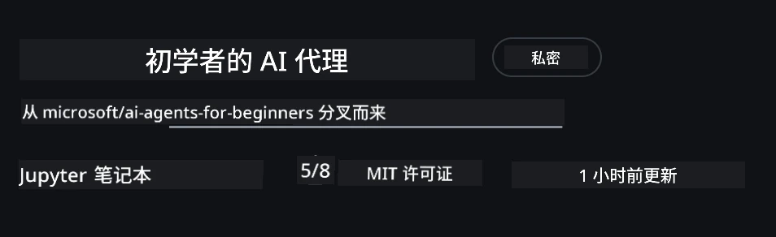

# 课程设置

## 介绍

本课将介绍如何运行本课程的代码示例。

## 加入其他学习者并获得帮助

在开始克隆你的仓库之前，加入 [AI Agents For Beginners Discord 频道](https://aka.ms/ai-agents/discord) 以获得任何设置方面的帮助、关于课程的任何问题，或与其他学习者建立联系。

## 克隆或 Fork 此仓库

首先，请克隆或 Fork GitHub 仓库。这会创建你自己的课程材料副本，以便你运行、测试并调整代码！

你可以通过点击此链接到 <a href="https://github.com/microsoft/ai-agents-for-beginners/fork" target="_blank">Fork 仓库</a> 来完成此操作

你现在应该在以下链接中拥有该课程的个人 Fork：



### 浅克隆（建议用于研讨会 / Codespaces）

  >完整仓库在下载全部历史和所有文件时可能很大（约 ~3 GB）。如果你只是参加研讨会或只需要少数课程文件夹，浅克隆（或稀疏克隆）通过截断历史和/或跳过 blobs 可以避免大部分下载。

#### 快速浅克隆 — 最小历史，全部文件

将下面命令中的 `<your-username>` 替换为你的 Fork URL（或如果你愿意则使用上游 URL）。

要仅克隆最新的提交历史（下载量小）：

```bash|powershell
git clone --depth 1 https://github.com/<your-username>/ai-agents-for-beginners.git
```

要克隆特定分支：

```bash|powershell
git clone --depth 1 --branch <branch-name> https://github.com/<your-username>/ai-agents-for-beginners.git
```

#### 部分（稀疏）克隆 — 最小 blobs + 仅选定文件夹

这使用部分克隆和 sparse-checkout（需要 Git 2.25+，并建议使用支持部分克隆的现代 Git）：

```bash|powershell
git clone --depth 1 --filter=blob:none --sparse https://github.com/<your-username>/ai-agents-for-beginners.git
```

进入仓库文件夹：

```bash|powershell
cd ai-agents-for-beginners
```

然后指定你想要的文件夹（下面示例显示两个文件夹）：

```bash|powershell
git sparse-checkout set 00-course-setup 01-intro-to-ai-agents
```

克隆并验证文件后，如果你只需要这些文件并想释放空间（不保留 git 历史），请删除仓库元数据（💀不可逆 — 你将失去所有 Git 功能：无法提交、拉取、推送或访问历史记录）。

```bash
# zsh/bash
rm -rf .git
```

```powershell
# PowerShell
Remove-Item -Recurse -Force .git
```

#### 使用 GitHub Codespaces（建议以避免本地大量下载）

- 通过 [GitHub UI](https://github.com/codespaces) 为此仓库创建新的 Codespace。  

- 在新创建的 codespace 的终端中，运行上面的一条浅克隆/稀疏克隆命令，只将你需要的课程文件夹带入 Codespace 工作区。
- 可选：在 Codespaces 内部克隆后，删除 .git 以回收额外空间（参见上面的删除命令）。
- 注意：如果你更喜欢直接在 Codespaces 中打开仓库（而不进行额外克隆），请注意 Codespaces 将构建 devcontainer 环境，可能仍会配置超出你需要的内容。在新 Codespace 内部克隆一个浅副本可以让你更好地控制磁盘使用情况。

#### 小贴士

- 如果你想编辑/提交，始终将克隆 URL 替换为你的 Fork。
- 如果你稍后需要更多历史或文件，你可以获取它们或调整 sparse-checkout 以包含额外的文件夹。

## 运行代码

本课程提供一系列 Jupyter Notebook，供你通过实操来构建 AI 代理。

代码示例使用 **Microsoft Agent Framework (MAF)** 和 `AzureAIProjectAgentProvider`，通过 **Microsoft Foundry** 连接到 **Azure AI Agent Service V2**（Responses API）。

所有 Python notebook 标记为 `*-python-agent-framework.ipynb`。

## 要求

- Python 3.12+
  - **注意**: 如果你没有安装 Python3.12，请确保安装它。然后使用 python3.12 创建虚拟环境，以确保从 requirements.txt 文件安装正确的版本。
  
    >示例

    创建 Python venv 目录：

    ```bash|powershell
    python -m venv venv
    ```

    然后激活 venv 环境：

    ```bash
    # zsh 或 bash
    source venv/bin/activate
    ```
  
    ```dos
    # Command Prompt for Windows
    venv\Scripts\activate
    ```

- .NET 10+: 对于使用 .NET 的示例代码，请确保安装 [.NET 10 SDK](https://dotnet.microsoft.com/download/dotnet/10.0) 或更高版本。然后，检查已安装的 .NET SDK 版本：

    ```bash|powershell
    dotnet --list-sdks
    ```

- **Azure CLI** — 身份验证所需。请从 [aka.ms/installazurecli](https://aka.ms/installazurecli) 安装。
- **Azure Subscription** — 用于访问 Microsoft Foundry 和 Azure AI Agent Service。
- **Microsoft Foundry Project** — 具有已部署模型（例如 `gpt-4o`）的项目。请参阅下方的 [第 1 步](../../../00-course-setup)。

我们在此仓库根目录中包含了 `requirements.txt` 文件，其中包含运行代码示例所需的所有 Python 包。

你可以在仓库根目录的终端中运行以下命令来安装它们：

```bash|powershell
pip install -r requirements.txt
```

我们建议创建 Python 虚拟环境以避免任何冲突和问题。

## 设置 VSCode

确保在 VSCode 中使用正确版本的 Python。


## 设置 Microsoft Foundry 和 Azure AI Agent Service

### 第 1 步：创建 Microsoft Foundry 项目

要运行这些 Notebook，你需要一个 Azure AI Foundry 的 **hub** 和 **project**，并部署好模型。

1. 访问 [ai.azure.com](https://ai.azure.com) 并使用你的 Azure 帐户登录。
2. 创建一个 **hub**（或使用现有的）。参见：[中心资源概览](https://learn.microsoft.com/azure/ai-foundry/concepts/ai-resources)。
3. 在 hub 内创建一个 **project**。
4. 在 **Models + Endpoints** → **Deploy model** 中部署模型（例如 `gpt-4o`）。

### 第 2 步：检索项目端点和模型部署名称

在 Microsoft Foundry 门户中的你的项目：

- **项目端点** — 转到 **概览** 页面并复制端点 URL。


- **模型部署名称** — 转到 **Models + Endpoints**，选择已部署的模型，并记下 **部署名称**（例如 `gpt-4o`）。

### 第 3 步：使用 `az login` 登录 Azure

所有 Notebook 使用 **`AzureCliCredential`** 进行身份验证 — 无需管理 API 密钥。这要求你通过 Azure CLI 登录。

1. 如果尚未安装 **Azure CLI**，请安装：[aka.ms/installazurecli](https://aka.ms/installazurecli)

2. **登录**，运行：

    ```bash|powershell
    az login
    ```

    或者，如果你在没有浏览器的远程/Codespace 环境中：

    ```bash|powershell
    az login --use-device-code
    ```

3. 如果提示，**选择你的订阅** — 选择包含你 Foundry 项目的订阅。

4. **验证** 已登录：

    ```bash|powershell
    az account show
    ```

> **为什么使用 `az login`？** Notebook 使用来自 `azure-identity` 包的 `AzureCliCredential` 进行身份验证。这意味着你的 Azure CLI 会话提供凭据 — `.env` 文件中无需 API 密钥或秘密。这是一项[安全最佳实践](https://learn.microsoft.com/azure/developer/ai/keyless-connections)。

### 第 4 步：创建你的 `.env` 文件

复制示例文件：

```bash
# zsh/bash
cp .env.example .env
```

```powershell
# PowerShell
Copy-Item .env.example .env
```

打开 `.env` 并填写以下两个值：

```env
AZURE_AI_PROJECT_ENDPOINT=https://<your-project>.services.ai.azure.com/api/projects/<your-project-id>
AZURE_AI_MODEL_DEPLOYMENT_NAME=gpt-4o
```

| 变量 | 在哪里可以找到 |
|----------|-----------------|
| `AZURE_AI_PROJECT_ENDPOINT` | Foundry 门户 → 你的项目 → **概览** 页面 |
| `AZURE_AI_MODEL_DEPLOYMENT_NAME` | Foundry 门户 → **Models + Endpoints** → 你已部署模型的名称 |

对大多数课程就这些了！Notebook 将通过你的 `az login` 会话自动进行身份验证。

### 第 5 步：安装 Python 依赖项

```bash|powershell
pip install -r requirements.txt
```

我们建议在之前创建的虚拟环境中运行此命令。

## 课程 5（Agentic RAG）的附加设置

课程 5 使用 **Azure AI Search** 进行检索增强生成。如果你打算运行该课程，请将这些变量添加到你的 `.env` 文件中：

| 变量 | 在哪里可以找到 |
|----------|-----------------|
| `AZURE_SEARCH_SERVICE_ENDPOINT` | Azure 门户 → 你的 **Azure AI Search** 资源 → **概览** → URL |
| `AZURE_SEARCH_API_KEY` | Azure 门户 → 你的 **Azure AI Search** 资源 → **设置** → **密钥** → 主管理员密钥 |

## 课程 6 和 8（GitHub 模型）的附加设置

第 6 和第 8 课的一些 notebook 使用 **GitHub Models** 而不是 Azure AI Foundry。如果你打算运行这些示例，请将这些变量添加到你的 `.env` 文件中：

| 变量 | 在哪里可以找到 |
|----------|-----------------|
| `GITHUB_TOKEN` | GitHub → **Settings** → **Developer settings** → **Personal access tokens** |
| `GITHUB_ENDPOINT` | 使用 `https://models.inference.ai.azure.com`（默认值） |
| `GITHUB_MODEL_ID` | 要使用的模型名称（例如 `gpt-4o-mini`） |

## 课程 8（Bing Grounding 工作流）的附加设置

第 8 课中的条件工作流 notebook 通过 Azure AI Foundry 使用 **Bing grounding**。如果你计划运行该示例，请将此变量添加到你的 `.env` 文件中：

| 变量 | 在哪里可以找到 |
|----------|-----------------|
| `BING_CONNECTION_ID` | Azure AI Foundry 门户 → 你的项目 → **管理** → **已连接的资源** → 你的 Bing 连接 → 复制连接 ID |

## 故障排除

### macOS 上的 SSL 证书验证错误

如果你在 macOS 上遇到如下错误：

```plaintext
ssl.SSLCertVerificationError: [SSL: CERTIFICATE_VERIFY_FAILED] certificate verify failed: self-signed certificate in certificate chain
```

这是 macOS 上 Python 的已知问题，系统 SSL 证书不会被自动信任。请按顺序尝试以下解决方法：

**选项 1：运行 Python 的 Install Certificates 脚本（推荐）**

```bash
# 将 3.XX 替换为你已安装的 Python 版本（例如 3.12 或 3.13）：
/Applications/Python\ 3.XX/Install\ Certificates.command
```

**选项 2：在 notebook 中使用 `connection_verify=False`（仅针对 GitHub Models 的 notebook）**

在第 6 课的 notebook（`06-building-trustworthy-agents/code_samples/06-system-message-framework.ipynb`）中，已包含一个注释掉的解决方法。在创建客户端时取消注释 `connection_verify=False`：

```python
client = ChatCompletionsClient(
    endpoint=endpoint,
    credential=AzureKeyCredential(token),
    connection_verify=False,  # 如果遇到证书错误，请禁用 SSL 验证
)
```

> **⚠️ 警告：** 禁用 SSL 验证（`connection_verify=False`）会通过跳过证书验证降低安全性。仅在开发环境作为临时解决方法使用，切勿在生产中使用。

**选项 3：安装并使用 `truststore`**

```bash
pip install truststore
```

然后在你的 notebook 或脚本顶部（在进行任何网络调用之前）添加以下内容：

```python
import truststore
truststore.inject_into_ssl()
```

## 卡住了吗？

如果在运行此设置时遇到任何问题，请加入我们的 <a href="https://discord.gg/kzRShWzttr" target="_blank">Azure AI Community Discord</a> 或 <a href="https://github.com/microsoft/ai-agents-for-beginners/issues?WT.mc_id=academic-105485-koreyst" target="_blank">创建一个 issue</a>。

## 下一课

你现在可以运行本课程的代码了。祝你在 AI 代理的世界中学习愉快！ 

[AI 代理及其应用简介](../01-intro-to-ai-agents/README.md)

---

<!-- CO-OP TRANSLATOR DISCLAIMER START -->
免责声明：
本文件已使用 AI 翻译服务 Co-op Translator（https://github.com/Azure/co-op-translator）翻译。尽管我们力求准确，但请注意自动翻译可能包含错误或不准确之处。原文应被视为权威来源。对于关键信息，建议采用专业人工翻译。对于因使用本翻译而产生的任何误解或错误解释，我们不承担任何责任。
<!-- CO-OP TRANSLATOR DISCLAIMER END -->