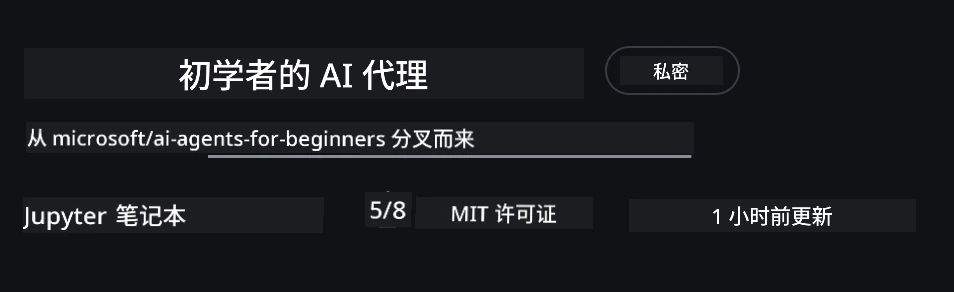
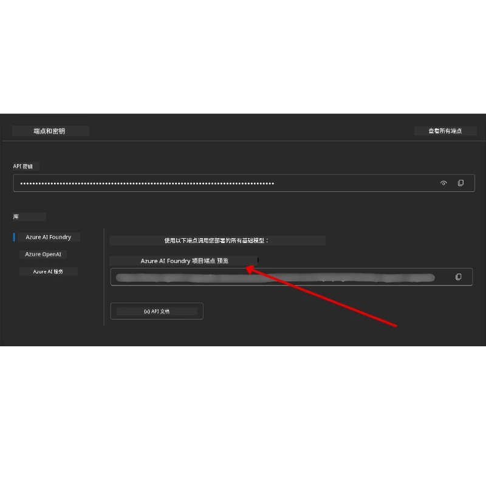

# 课程设置

## 介绍

本课将介绍如何运行本课程的代码示例。

## 加入其他学习者并获得帮助

在开始克隆你的仓库之前，请加入 [AI Agents For Beginners Discord频道](https://aka.ms/ai-agents/discord) ，以获得任何设置帮助、课程问题解答或与其他学习者交流。

## 克隆或分叉该仓库

开始时，请克隆或分叉GitHub仓库。这将创建你自己的课程材料版本，以便运行、测试和调整代码！

你可以点击链接 <a href="https://github.com/microsoft/ai-agents-for-beginners/fork" target="_blank">分叉仓库</a> 来完成此操作

现在你应该在以下链接中拥有你自己分叉的本课程版本：



### 浅克隆（推荐用于工作坊 / Codespaces）

  > 完整仓库下载包含完整历史和所有文件，可能较大（约3GB）。如果你只参加工作坊或只需要几个课程文件夹，浅克隆（或稀疏克隆）将只下载很少部分内容。

#### 快速浅克隆 — 最小历史，所有文件

将下面命令中的 `<your-username>` 替换为你的分叉URL（或上游URL，如果你愿意）。

只克隆最新的提交历史（下载较小）：

```bash
git clone --depth 1 https://github.com/<your-username>/ai-agents-for-beginners.git
```

克隆特定分支：

```bash
git clone --depth 1 --branch <branch-name> https://github.com/<your-username>/ai-agents-for-beginners.git
```

#### 部分（稀疏）克隆 — 最小数据块 + 仅选定文件夹

这使用部分克隆和稀疏检出（要求 Git 2.25+ 并推荐使用支持部分克隆的现代 Git）：

```bash
git clone --depth 1 --filter=blob:none --sparse https://github.com/<your-username>/ai-agents-for-beginners.git
```

进入仓库文件夹：

```bash
cd ai-agents-for-beginners
```

然后指定你想要的文件夹（下面示例显示两个文件夹）：

```bash
git sparse-checkout set 00-course-setup 01-intro-to-ai-agents
```

克隆并确认文件后，如果你只需要文件且想释放空间（不需要 git 历史），请删除仓库元数据（💀不可逆—你将失去全部 Git 功能）：

```bash
# zsh/bash
rm -rf .git
```

```powershell
# PowerShell
Remove-Item -Recurse -Force .git
```

#### 使用 GitHub Codespaces（推荐避免本地大文件下载）

- 通过 [GitHub UI](https://github.com/codespaces) 为此仓库创建新的 Codespace。  

- 在新创建的 codespace 终端中，运行以上浅克隆/稀疏克隆命令，只将需要的课程文件夹带入 Codespace 工作区。
- 可选：在 Codespaces 中克隆后，删除 .git 以释放额外空间（见上面的删除命令）。
- 注意：如果你选择直接在 Codespaces 中打开仓库（无需再克隆一次），请注意 Codespaces 会构建 devcontainer 环境，可能仍然会配置超过你需要的内容。

#### 小贴士

- 如果你想编辑/提交，始终使用你的分叉URL替换克隆URL。
- 如果你以后需要更多历史或文件，可以获取它们或调整稀疏检出以包含额外文件夹。

## 运行代码

本课程提供系列 Jupyter 笔记本，助你实践构建 AI代理。

代码示例使用 **Microsoft Agent Framework (MAF)** 的 `FoundryChatClient`，通过 **Microsoft Foundry** 连接到 **Microsoft Foundry Agent Service V2**（Responses API）。

所有 Python 笔记本均标注为 `*-python-agent-framework.ipynb`。

## 要求

- Python 3.12+
  - <strong>注意</strong>：如果你没有安装 Python3.12，请确保安装。然后使用 python3.12 创建虚拟环境，以确保从 requirements.txt 文件安装正确版本的包。
  
    >示例

    创建 Python 虚拟环境目录：

    ```bash
    python -m venv venv
    ```

    然后激活虚拟环境：

    ```bash
    # zsh/bash
    source venv/bin/activate
    ```
  
    ```dos
    # Command Prompt for Windows
    venv\Scripts\activate
    ```

- .NET 10+：对于使用 .NET 的示例代码，确保安装 [.NET 10 SDK](https://dotnet.microsoft.com/download/dotnet/10.0) 或更高版本。然后检查你安装的 .NET SDK 版本：

    ```bash
    dotnet --list-sdks
    ```

- **Azure CLI** — 认证必需。请从 [aka.ms/installazurecli](https://aka.ms/installazurecli) 安装。
- **Azure 订阅** — 用于访问 Microsoft Foundry 和 Microsoft Foundry Agent Service。
- **Microsoft Foundry 项目** — 具有已部署模型的项目（例如 `gpt-5-mini`）。见下面的[步骤1](#步骤1：创建-microsoft-foundry-项目)。

我们在仓库根目录包含了 `requirements.txt` 文件，包含所有运行代码示例所需的 Python 包。

你可以在仓库根目录终端运行以下命令安装：

```bash
pip install -r requirements.txt
```

我们建议创建 Python 虚拟环境以避免冲突和问题。

## 设置 VSCode

确保你在 VSCode 中使用的是正确的 Python 版本。


## 设置 Microsoft Foundry 和 Microsoft Foundry Agent Service

### 步骤1：创建 Microsoft Foundry 项目

运行笔记本需要有一个部署模型的 Microsoft Foundry **hub** 和 **project**。

1. 访问 [ai.azure.com](https://ai.azure.com) 并使用你的 Azure 账户登录。
2. 创建一个 **hub**（或使用已有的）。详见：[Hub资源概览](https://learn.microsoft.com/azure/ai-foundry/concepts/ai-resources)。
3. 在 hub 内创建一个 **project**。
4. 从 **Models + Endpoints** → **Deploy model** 部署模型（例如 `gpt-5-mini`）。

### 步骤2：获取项目端点和模型部署名称

在 Microsoft Foundry 门户里的项目中：

- <strong>项目端点</strong> — 转到 **Overview** 页面并复制端点 URL。



- <strong>模型部署名称</strong> — 进入 **Models + Endpoints**，选择部署的模型，并记录 **Deployment name**（例如 `gpt-5-mini`）。

### 步骤3：使用 `az login` 登录 Azure

大多数笔记本都通过你的 **Azure CLI 登录** 进行认证 — 使用来自 `azure-identity` 包的 `AzureCliCredential` 或 `DefaultAzureCredential`（两者都能拾取你的 `az login` 会话），因此无需 API key。部分课程和可选集成使用 API key；请检查每个课程的前提条件是否需要额外环境变量。前提是你必须通过 Azure CLI 登录。

1. 如果尚未安装，先安装 Azure CLI：[aka.ms/installazurecli](https://aka.ms/installazurecli)

2. 运行以下命令登录：

    ```bash
    az login
    ```

    或如果在无浏览器的远程/Codespace环境中：

    ```bash
    az login --use-device-code
    ```

3. 如果提示，<strong>选择你的订阅</strong> — 选择包含你的 Foundry 项目的那个。

4. <strong>确认</strong>已登录：

    ```bash
    az account show
    ```

> **为什么用 `az login`？** 笔记本使用来自 `azure-identity` 包的 `AzureCliCredential`（或拾取 Azure CLI 登录的 `DefaultAzureCredential`）进行认证。这意味着你的 Azure CLI 会话提供了凭据 — 不需要在 `.env` 文件中存放 API key 或密钥。这是[安全最佳实践](https://learn.microsoft.com/azure/developer/ai/keyless-connections)。

### 步骤4：创建你的 `.env` 文件

复制示例文件：

```bash
# zsh/bash
cp .env.example .env
```

```powershell
# PowerShell
Copy-Item .env.example .env
```

打开 `.env` 并填写下面两个值：

```env
AZURE_AI_PROJECT_ENDPOINT=https://<your-project>.services.ai.azure.com/api/projects/<your-project-id>
AZURE_AI_MODEL_DEPLOYMENT_NAME=gpt-5-mini
```

| 变量 | 来源 |
|----------|-----------------|
| `AZURE_AI_PROJECT_ENDPOINT` | Foundry 门户 → 你的项目 → **Overview** 页面 |
| `AZURE_AI_MODEL_DEPLOYMENT_NAME` | Foundry 门户 → **Models + Endpoints** → 你的部署模型名称 |

对于大多数课程就是这些！笔记本将自动通过你的 `az login` 会话认证。

### 步骤5：安装 Python 依赖

```bash
pip install -r requirements.txt
```

我们建议在你之前创建的虚拟环境中运行此命令。

## 可选设置：Azure AI 搜索（第5和16课）

第5课（Agentic RAG）和第16课的笔记本开箱即用使用<strong>内存中知识库</strong>，不需额外 Azure 资源。如果你想用真正的<strong>Azure AI 搜索</strong>索引来支持它们，请注意<strong>第16课笔记本当前使用基于密钥的认证</strong>：只有当同时设置了 `AZURE_SEARCH_SERVICE_ENDPOINT` 和 `AZURE_SEARCH_API_KEY` 时，才会开启 Azure AI 搜索；否则仍用内存搜索。所以运行它需要设置管理员密钥。基于 Microsoft Entra ID（RBAC）的无密钥认证是推荐的生产代码做法，与课程中使用的 `az login` 流程一致。

以下 RBAC 步骤适用于示例和你的代码，但不会让第16课笔记本免密钥认证；第16课仍需端点和管理员密钥才能使用 Azure AI 搜索。

1. <strong>在搜索服务上启用基于角色的访问控制</strong>：

    ```bash
    az search service update --name <service-name> --resource-group <resource-group> --auth-options aadOrApiKey
    ```

2. <strong>给自己分配所需角色</strong>（创建/加载索引和查询）：

    ```bash
    az role assignment create --assignee <your-user-or-principal-id> --role "Search Service Contributor" --scope $(az search service show -g <resource-group> -n <service-name> --query id -o tsv)
    az role assignment create --assignee <your-user-or-principal-id> --role "Search Index Data Contributor" --scope $(az search service show -g <resource-group> -n <service-name> --query id -o tsv)
    ```

3. **将端点添加到你的 `.env` 文件中：**

| 变量 | 来源 |
|----------|-----------------|
| `AZURE_SEARCH_SERVICE_ENDPOINT` | Azure 门户 → 你的 **Azure AI 搜索** 资源 → **Overview** → URL |
| `AZURE_SEARCH_API_KEY` | 必需（配合端点启用第16课笔记本中的 Azure AI 搜索，使用基于密钥的认证）。Azure 门户 → **Settings** → **Keys** → 主管理员密钥 |

> **为什么推荐无密钥？** 管理员密钥授予对搜索服务的完全写权限，可能会通过 `.env` 文件泄露。使用 RBAC 你的 `az login` 身份代替密钥 — 这是课程笔记本所用的同一无密钥 Entra ID 模式（通过 `AzureCliCredential` / `DefaultAzureCredential`）。详情见 [使用角色连接 Azure AI 搜索](https://learn.microsoft.com/azure/search/search-security-rbac)。

请参见 [Azure AI 搜索设置指南](./AzureSearch.md) 获取 Python 和 .NET 的完整索引创建示例。

## 直接调用 Azure OpenAI 的额外设置（第6和8课）

第6和8课部分笔记本直接调用 **Azure OpenAI**（使用 **Responses API**），而非通过 Microsoft Foundry 项目。这些示例之前使用 GitHub Models，现已弃用且不支持 Responses API。请将以下变量添加到 `.env` 文件中：

| 变量 | 来源 |
|----------|-----------------|
| `AZURE_OPENAI_ENDPOINT` | Azure 门户 → 你的<strong>Azure OpenAI</strong>资源 → <strong>密钥和端点</strong> → 端点（例如 `https://<your-resource>.openai.azure.com`） |
| `AZURE_OPENAI_DEPLOYMENT` | 你的已部署模型名称（例如 `gpt-5-mini`），支持Responses API |
| `AZURE_OPENAI_API_KEY` | 可选 — 仅当你使用基于密钥的认证而非 `az login` / Entra ID 时需要 |

> Responses API 使用稳定的 `/openai/v1/` 端点，因此不需要 `api-version`。请使用 `az login` 进行无密钥 Entra ID 认证。

## 可替代提供商：MiniMax（兼容 OpenAI）

[MiniMax](https://platform.minimaxi.com/) 提供大上下文模型（最多204K tokens），通过兼容 OpenAI 的 API。因为 Microsoft Agent Framework 的 `OpenAIChatClient` 可用于任何兼容 OpenAI 的端点，你可以使用 MiniMax 作为使用 `OpenAIChatClient` 课程的替代。

将以下变量添加到 `.env` 文件：

| 变量 | 来源 |
|----------|-----------------|
| `MINIMAX_API_KEY` | [MiniMax 平台](https://platform.minimaxi.com/) → API Keys |
| `MINIMAX_BASE_URL` | 使用 `https://api.minimax.io/v1`（默认值） |
| `MINIMAX_MODEL_ID` | 要使用的模型名称（例如 `MiniMax-M3`） |

<strong>示例模型</strong>：`MiniMax-M3`（推荐），`MiniMax-M2.7`，`MiniMax-M2.7-highspeed`（响应更快）。模型名称和可用性可能随时间变化，且模型访问权限依赖你的账户。

使用 `OpenAIChatClient` 的代码示例（例如第14课酒店预订工作流）在检测到设置了 `MINIMAX_API_KEY` 后将自动使用你的 MiniMax 配置。


## 替代提供者：Foundry Local（在设备上运行模型）

[Foundry Local](https://foundrylocal.ai) 是一个轻量级运行时，通过 OpenAI 兼容的 API <strong>完全在您自己的机器上</strong> 下载、管理和提供语言模型——无需云服务。

由于 Microsoft Agent Framework 的 `OpenAIChatClient` 支持任何 OpenAI 兼容端点，Foundry Local 是 Azure OpenAI 的即插即用本地替代方案。

**1. 安装 Foundry Local**

```bash
# Windows 操作系统
winget install Microsoft.FoundryLocal

# macOS 操作系统
brew install foundrylocal
```

**2. 下载并运行一个模型**（这也会启动本地服务）：

```bash
foundry model list          # 查看可用模型
foundry model run phi-4-mini
```

**3. 安装用于发现本地端点的 Python SDK：**

```bash
pip install foundry-local-sdk
```

**4. 指向您的本地模型以使用 Microsoft Agent Framework：**

```python
from foundry_local import FoundryLocalManager
from agent_framework.openai import OpenAIChatClient

# 本地下载（如有需要）并提供模型服务，然后发现端点/端口。
manager = FoundryLocalManager("phi-4-mini")

chat_client = OpenAIChatClient(
    base_url=manager.endpoint,      # 例如 http://localhost:<port>/v1
    api_key=manager.api_key,        # Foundry Local 一律为 “not-required”
    model_id=manager.get_model_info("phi-4-mini").id,
)

agent = chat_client.as_agent(
    name="LocalAgent",
    instructions="You are a helpful assistant running fully on-device.",
)
```

> **注意：** Foundry Local 暴露一个 OpenAI 兼容的 <strong>聊天补全</strong> 端点。请在本地开发和离线场景中使用它。若需完整的 **Responses API** 功能集（有状态对话等），请使用 Azure OpenAI 或 Microsoft Foundry 项目。

## 课程 8 额外设置（Bing 定位工作流）

课程 8 的条件工作流笔记本通过 Microsoft Foundry 使用 **Bing 定位**。如果您打算运行该示例，请将此变量添加到您的 `.env` 文件：

| 变量 | 位置 |
|----------|-----------------|
| `BING_CONNECTION_ID` | Microsoft Foundry 门户 → 您的项目 → <strong>管理</strong> → <strong>已连接资源</strong> → 您的 Bing 连接 → 复制连接 ID |

## 故障排除

### macOS 上的 SSL 证书验证错误

如果您使用 macOS 并遇到如下错误：

```plaintext
ssl.SSLCertVerificationError: [SSL: CERTIFICATE_VERIFY_FAILED] certificate verify failed: self-signed certificate in certificate chain
```

这是 macOS 上 Python 的已知问题，系统 SSL 证书未被自动信任。请按顺序尝试以下解决方案：

**选项 1：运行 Python 的安装证书脚本（推荐）**

```bash
# 用你安装的Python版本替换3.XX（例如，3.12或3.13）：
/Applications/Python\ 3.XX/Install\ Certificates.command
```

**选项 2：在您的笔记本中使用 `connection_verify=False`（仅限 GitHub 模型笔记本）**

在第 6 课笔记本（`06-building-trustworthy-agents/code_samples/06-system-message-framework.ipynb`）中已经包含了一个注释掉的解决方法。遇到证书错误时取消注释 `connection_verify=False`：

```python
client = ChatCompletionsClient(
    endpoint=endpoint,
    credential=AzureKeyCredential(token),
    connection_verify=False,  # 如果遇到证书错误，请禁用 SSL 验证
)
```

> **⚠️ 警告：** 禁用 SSL 验证（`connection_verify=False`）会通过跳过证书验证降低安全性。仅在开发环境作为临时解决方案使用，切勿在生产环境使用。

**选项 3：安装并使用 `truststore`**

```bash
pip install truststore
```

然后在笔记本或脚本的开头、进行任何网络调用前添加以下内容：

```python
import truststore
truststore.inject_into_ssl()
```

## 卡住了？

如果您在运行此设置时遇到任何问题，请加入我们的 <a href="https://discord.gg/kzRShWzttr" target="_blank">Azure AI 社区 Discord</a> 或 <a href="https://github.com/microsoft/ai-agents-for-beginners/issues?WT.mc_id=academic-105485-koreyst" target="_blank">创建问题反馈</a>。

## 下一课

您现在已准备好运行本课程的代码。祝您在 AI 代理的世界里学得开心！

[AI 代理及代理用例简介](../01-intro-to-ai-agents/README.md)

---

<!-- CO-OP TRANSLATOR DISCLAIMER START -->
**免责声明**：
本文件由 AI 翻译服务 [Co-op Translator](https://github.com/Azure/co-op-translator) 翻译完成。尽管我们力求准确，但请注意，自动翻译可能包含错误或不准确之处。原始语言版文件应视为权威来源。对于重要信息，建议使用专业人工翻译。我们对因使用本翻译而产生的任何误解或误释不承担责任。
<!-- CO-OP TRANSLATOR DISCLAIMER END -->