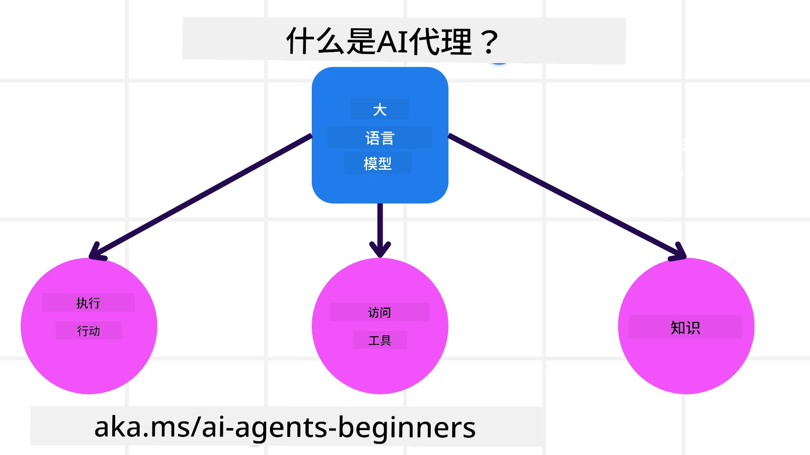
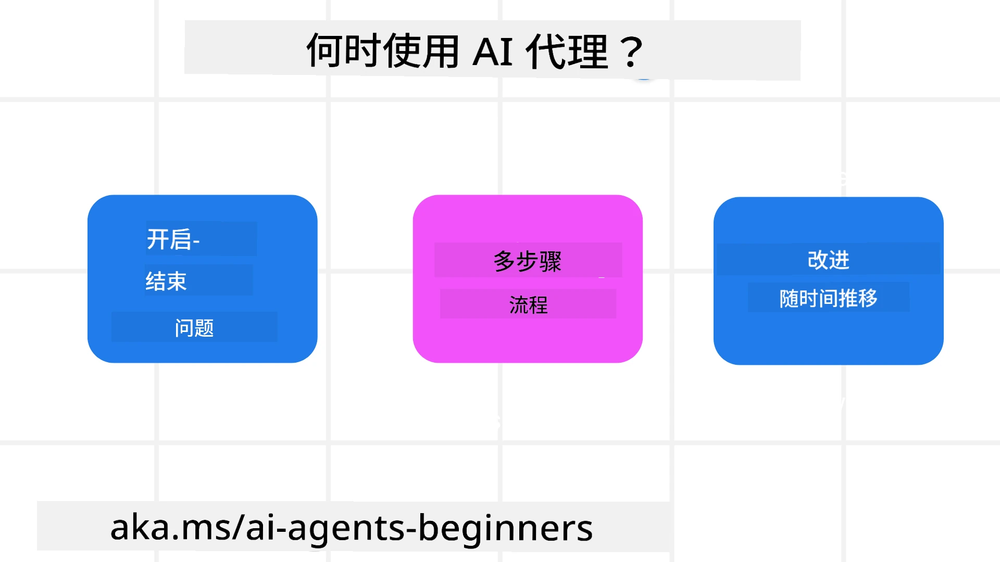

> _(点击上方图片查看本课视频)_

# AI 代理及其使用场景简介

欢迎来到“AI 代理入门”课程！本课程提供构建 AI 代理的基础知识和应用示例。

加入 <a href="https://discord.gg/kzRShWzttr" target="_blank">Azure AI Discord 社区</a> 以结识其他学习者和 AI 代理构建者，并就本课程提出任何问题。

开始本课程时，我们将首先更好地理解什么是 AI 代理，以及如何在我们构建的应用和工作流中使用它们。

## 介绍

本课涵盖：

- 什么是 AI 代理以及不同类型的代理是什么？
- 哪些用例最适合 AI 代理，以及它们如何帮助我们？
- 在设计代理式解决方案时的一些基本构建模块是什么？

## 学习目标
完成本课后，你应该能够：

- 了解 AI 代理的概念以及它们与其他 AI 解决方案的不同之处。
- 更有效地应用 AI 代理。
- 为用户和客户设计高效的代理式解决方案。

## 定义 AI 代理及其类型

### 什么是 AI 代理？

AI 代理是通过赋予 **大型语言模型(LLMs)** 对工具和知识的访问，从而扩展其能力并使其能够**执行操作**的**系统**。

让我们将此定义拆分为更小的部分：

- **System** - 思考代理时，不应只将其视为单一组件，而应将其视为由多个组件组成的系统。在基本层面上，AI 代理的组件包括：
  - **Environment** - AI 代理所运行的定义空间。例如，如果我们有一个旅行预订 AI 代理，环境可以是该 AI 代理用来完成任务的旅行预订系统。
  - **Sensors** - 环境具有信息并提供反馈。AI 代理使用传感器来收集并解释有关环境当前状态的信息。在旅行预订代理的示例中，旅行预订系统可以提供诸如酒店可用性或航班价格等信息。
  - **Actuators** - 一旦 AI 代理接收到环境的当前状态，对于当前任务，代理会确定要执行的操作以改变环境。对于旅行预订代理，这可能是为用户预订一个可用的房间。

**Large Language Models** - 代理的概念在 LLM 出现之前就已存在。使用 LLM 构建 AI 代理的优势在于它们解释自然语言和数据的能力。这种能力使 LLM 能够解释环境信息并定义改变环境的计划。

**Perform Actions** - 在 AI 代理系统之外，LLM 的能力通常仅限于根据用户提示生成内容或信息。在 AI 代理系统内部，LLM 可以通过解释用户请求并使用其环境中可用的工具来完成任务。

**Access To Tools** - LLM 可访问的工具由 1) 它运行的环境决定，和 2) AI 代理的开发者决定。以我们的旅行代理为例，代理的工具受预订系统中可用操作的限制，或者开发者可以将代理的工具访问限制为仅限航班。

**Memory+Knowledge** - 在用户与代理的对话上下文中，记忆可以是短期的。从长期来看，除了环境提供的信息之外，AI 代理还可以从其他系统、服务、工具甚至其他代理检索知识。在旅行代理的示例中，这些知识可能是位于客户数据库中关于用户旅行偏好的信息。

### 不同类型的代理

现在我们已经有了 AI 代理的一般定义，让我们看一些具体的代理类型以及它们如何应用到旅行预订 AI 代理中。

| **代理类型**                | **描述**                                                                                                                       | **示例**                                                                                                                                                                                                                   |
| --------------------------- | ------------------------------------------------------------------------------------------------------------------------------ | -------------------------------------------------------------------------------------------------------------------------------------------------------------------------------------------------------------------------- |
| **简单反射代理**            | 基于预定义规则执行即时操作。                                                                                                    | 旅行代理根据电子邮件的上下文将旅行投诉转发给客户服务。                                                                                                                                                                          |
| **基于模型的反射代理**      | 基于世界模型及对该模型的更改来执行操作。                                                                                          | 旅行代理基于访问到的历史定价数据优先考虑价格出现重大变化的路线。                                                                                                                                                                   |
| **基于目标的代理**          | 通过解释目标并确定实现该目标的操作来创建计划。                                                                                    | 旅行代理通过确定从当前位置到目的地所需的交通安排（汽车、公共交通、航班）来预订行程。                                                                                                                                                 |
| **基于效用的代理**          | 考虑偏好并以数值方式权衡权衡来决定如何实现目标。                                                                                  | 旅行代理在预订时通过权衡便利性与成本来最大化效用。                                                                                                                                                                               |
| **学习型代理**              | 通过对反馈做出响应并相应调整操作来随着时间改进。                                                                                  | 旅行代理通过使用来自行程后调查的客户反馈来改进未来的预订。                                                                                                                                                                        |
| **分层代理**                | 在分层系统中包含多个代理，高级代理将任务分解为低级代理完成的子任务。                                                                | 旅行代理通过将任务分解为子任务（例如，取消特定预订）并由低级代理完成这些子任务，然后向高级代理报告，从而取消行程。                                                                                                             |
| **多代理系统 (MAS)**        | 代理独立完成任务，可能是协作或竞争的。                                                                                              | 协作：多个代理分别预订特定的旅行服务，如酒店、航班和娱乐。竞争：多个代理管理并在共享的酒店预订日历上竞争，为客户预订房间。                                                                                                            |

## 何时使用 AI 代理

在上文中，我们使用了旅行代理的用例来说明不同类型代理在不同旅行预订场景中的应用。我们将在整个课程中继续使用此应用。

下面看看最适合使用 AI 代理的用例类型：

- **开放性问题** - 允许 LLM 决定完成任务所需的步骤，因为这些步骤并不总能被硬编码到工作流中。
- **多步骤流程** - 需要一定复杂性的任务，AI 代理需要在多轮中使用工具或信息，而不是一次性检索。  
- **随时间改进** - 代理可以通过从其环境或用户处接收反馈来随着时间改进，以提供更好的效用。

我们在“构建可信赖的 AI 代理”一课中讨论使用 AI 代理的更多注意事项。

## Agentic 解决方案基础

### 代理开发

设计 AI 代理系统的第一步是定义工具、操作和行为。在本课程中，我们重点使用 **Azure AI Agent Service** 来定义我们的代理。它提供以下功能：

- 选择开放模型，例如 OpenAI、Mistral 和 Llama
- 通过 Tripadvisor 等提供商使用许可数据
- 使用标准化的 OpenAPI 3.0 工具

### Agentic 模式

与 LLM 的通信是通过提示(prompt)进行的。鉴于 AI 代理的半自主性质，在环境发生变化后并不总是可能或需要手动重新提示 LLM。我们使用允许以更具可扩展性的方式在多步中提示 LLM 的 **Agentic 模式**。

本课程划分为一些当前流行的 Agentic 模式。

### Agentic 框架

Agentic 框架允许开发者通过代码实现 agentic 模式。这些框架提供模板、插件和工具，以实现更好的 AI 代理协作。这些优势为 AI 代理系统提供了更好的可观测性和故障排除能力。

在本课程中，我们将探索用于构建可投入生产的 AI 代理的 Microsoft Agent Framework (MAF)。

## 示例代码

- Python: [代理框架](./code_samples/01-python-agent-framework.ipynb)
- .NET: [代理框架](./code_samples/01-dotnet-agent-framework.md)

## 对 AI 代理还有更多问题吗？

加入 [Microsoft Foundry Discord](https://aka.ms/ai-agents/discord) 与其他学习者见面、参加答疑时间并获得你关于 AI 代理的问题的解答。

## 上一课

[课程设置](../00-course-setup/README.md)

## 下一课

[探索 Agentic 框架](../02-explore-agentic-frameworks/README.md)

---

<!-- CO-OP TRANSLATOR DISCLAIMER START -->
免责声明：
本文件采用 AI 翻译服务 Co-op Translator（https://github.com/Azure/co-op-translator）进行翻译。尽管我们力求准确，但请注意，自动翻译可能存在错误或不准确之处。以原始语言撰写的原文应被视为具有权威性的版本。对于重要信息，建议采用专业人工翻译。因使用本译文而可能引起的任何误解或曲解，我们概不负责。
<!-- CO-OP TRANSLATOR DISCLAIMER END -->