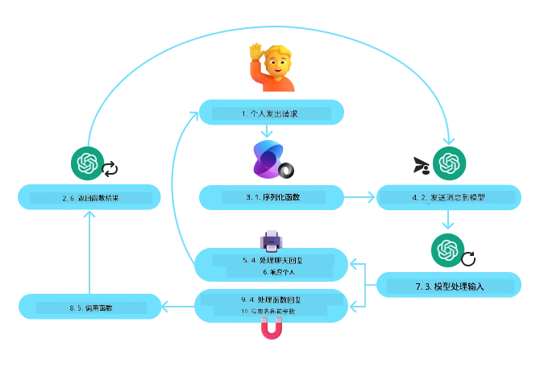
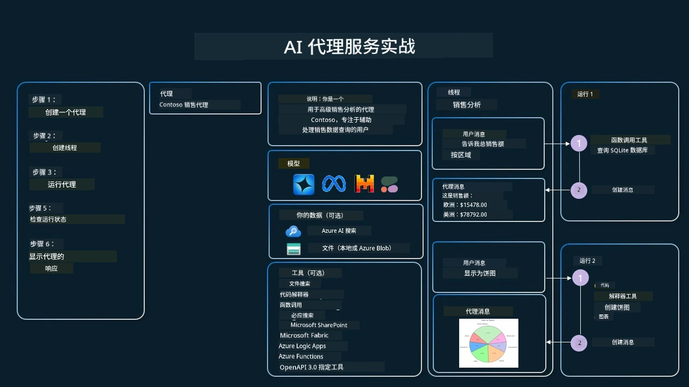

[](https://youtu.be/vieRiPRx-gI?si=cEZ8ApnT6Sus9rhn)

> _(点击上方图片观看本课视频)_

# 工具使用设计模式

工具很有趣，因为它们使 AI 代理具备更广泛的能力。代理不再仅限于执行有限的一组操作，通过添加工具，代理现在可以执行广泛的操作。在本章中，我们将探讨工具使用设计模式，该模式描述了 AI 代理如何使用特定工具来实现其目标。

## 介绍

在本课中，我们将回答以下问题：

- 什么是工具使用设计模式？
- 它适用于哪些用例？
- 实现该设计模式需要哪些元素/构建模块？
- 使用工具使用设计模式构建可信 AI 代理有哪些特别注意事项？

## 学习目标

完成本课后，您将能够：

- 定义工具使用设计模式及其目的。
- 识别适用工具使用设计模式的用例。
- 理解实现该设计模式所需的关键元素。
- 认识在使用该设计模式构建可信 AI 代理时的注意事项。

## 什么是工具使用设计模式？

**工具使用设计模式**侧重于赋予大型语言模型（LLM）与外部工具交互的能力以实现特定目标。工具是代理可以执行的代码块，用来完成某些操作。工具可以是简单的函数，如计算器，也可以是第三方服务的 API 调用，如股票价格查询或天气预报。在 AI 代理的语境中，工具设计为响应**模型生成的函数调用**由代理执行。

## 它适用于哪些用例？

AI 代理可以借助工具完成复杂任务、获取信息或进行决策。工具使用设计模式通常用于需要动态与外部系统交互的场景，比如数据库、网络服务或代码解释器。该能力适用于多种不同用例，包括：

- **动态信息检索**：代理可以查询外部 API 或数据库以获取最新数据（例如，查询 SQLite 数据库进行数据分析，获取股票价格或天气信息）。
- **代码执行与解释**：代理可以执行代码或脚本以解决数学问题、生成报告或执行模拟。
- **工作流自动化**：通过集成任务调度器、邮件服务或数据管道，实现重复或多步骤工作流的自动化。
- **客户支持**：代理可以与客户关系管理系统（CRM）、工单平台或知识库交互，解决用户查询。
- **内容生成与编辑**：代理可以利用语法检查器、文本摘要器或内容安全评估器等工具辅助内容创作任务。

## 实现工具使用设计模式需要哪些元素/构建模块？

这些构建模块使 AI 代理能够执行多种任务。让我们看看实现工具使用设计模式所需的关键元素：

- **函数/工具模式定义**：详细定义可用工具，包括函数名称、用途、必需参数和预期输出。这些模式使 LLM 了解可用工具及如何构造有效请求。
- **函数执行逻辑**：管理基于用户意图和对话上下文的工具调用时机和方式。可能包括规划模块、路由机制或动态决定工具使用的条件流程。
- **消息处理系统**：管理用户输入、LLM 响应、工具调用和工具输出之间的对话流程组件。
- **工具集成框架**：连接代理与各种工具的基础设施，无论是简单函数还是复杂的外部服务。
- **错误处理与验证**：处理工具执行失败、参数验证及异常响应的机制。
- **状态管理**：跟踪对话上下文、先前工具交互和持久数据，确保多轮交互的一致性。

接下来，让我们详细了解函数/工具调用。

### 函数/工具调用

函数调用是使大型语言模型（LLM）与工具交互的主要方式。您会经常看到“函数”和“工具”互换使用，因为“函数”（可重用代码块）就是代理用来完成任务的“工具”。为了调用一个函数的代码，LLM 必须根据用户请求与函数描述进行匹配。为此，会将包含所有可用函数描述的模式(schema)发送给 LLM。LLM 选择最合适的函数进行任务，并返回其名称和参数。随后调用选定函数，其响应返回给 LLM，LLM 利用这些信息回应用户请求。

开发者实现函数调用需要：

1. 支持函数调用的 LLM 模型
2. 包含函数描述的模式(schema)
3. 所有函数描述对应的代码

以下使用获取某城市当前时间为例说明：

1. **初始化支持函数调用的 LLM：**

    并非所有模型都支持函数调用，因此需要确认所用 LLM 是否支持。 <a href="https://learn.microsoft.com/azure/ai-services/openai/how-to/function-calling" target="_blank">Azure OpenAI</a> 支持函数调用。我们可以从初始化 Azure OpenAI 客户端开始。

    ```python
    # 初始化 Azure OpenAI 客户端
    client = AzureOpenAI(
        azure_endpoint = os.getenv("AZURE_AI_PROJECT_ENDPOINT"), 
        api_key=os.getenv("AZURE_OPENAI_API_KEY"),  
        api_version="2024-05-01-preview"
    )
    ```

1. **创建函数模式**：

    接下来定义一个包含函数名称、函数功能描述以及函数参数名和描述的 JSON 模式(schema)。然后将此模式与用户请求一并传给前面创建的客户端，请求查询旧金山的时间。重要的是要注意，返回的是**工具调用**，而非问题的最终答案。如前所述，LLM 返回为该任务选定的函数名称及其参数。

    ```python
    # 模型阅读的函数描述
    tools = [
        {
            "type": "function",
            "function": {
                "name": "get_current_time",
                "description": "Get the current time in a given location",
                "parameters": {
                    "type": "object",
                    "properties": {
                        "location": {
                            "type": "string",
                            "description": "The city name, e.g. San Francisco",
                        },
                    },
                    "required": ["location"],
                },
            }
        }
    ]
    ```
  
    ```python
  
    # 初始用户消息
    messages = [{"role": "user", "content": "What's the current time in San Francisco"}] 
  
    # 第一次 API 调用：请求模型使用该函数
      response = client.chat.completions.create(
          model=deployment_name,
          messages=messages,
          tools=tools,
          tool_choice="auto",
      )
  
      # 处理模型的响应
      response_message = response.choices[0].message
      messages.append(response_message)
  
      print("Model's response:")  

      print(response_message)
  
    ```

    ```bash
    Model's response:
    ChatCompletionMessage(content=None, role='assistant', function_call=None, tool_calls=[ChatCompletionMessageToolCall(id='call_pOsKdUlqvdyttYB67MOj434b', function=Function(arguments='{"location":"San Francisco"}', name='get_current_time'), type='function')])
    ```
  
1. **执行任务所需的函数代码：**

    既然 LLM 已选定需要运行的函数，现在需要实现并执行具体代码。我们可以用 Python 编写获取当前时间的代码。同时还需编写代码从 response_message 中提取函数名和参数以获取最终结果。

    ```python
      def get_current_time(location):
        """Get the current time for a given location"""
        print(f"get_current_time called with location: {location}")  
        location_lower = location.lower()
        
        for key, timezone in TIMEZONE_DATA.items():
            if key in location_lower:
                print(f"Timezone found for {key}")  
                current_time = datetime.now(ZoneInfo(timezone)).strftime("%I:%M %p")
                return json.dumps({
                    "location": location,
                    "current_time": current_time
                })
      
        print(f"No timezone data found for {location_lower}")  
        return json.dumps({"location": location, "current_time": "unknown"})
    ```

     ```python
     # 处理函数调用
      if response_message.tool_calls:
          for tool_call in response_message.tool_calls:
              if tool_call.function.name == "get_current_time":
     
                  function_args = json.loads(tool_call.function.arguments)
     
                  time_response = get_current_time(
                      location=function_args.get("location")
                  )
     
                  messages.append({
                      "tool_call_id": tool_call.id,
                      "role": "tool",
                      "name": "get_current_time",
                      "content": time_response,
                  })
      else:
          print("No tool calls were made by the model.")  
  
      # 第二次API调用：从模型获取最终响应
      final_response = client.chat.completions.create(
          model=deployment_name,
          messages=messages,
      )
  
      return final_response.choices[0].message.content
     ```

     ```bash
      get_current_time called with location: San Francisco
      Timezone found for san francisco
      The current time in San Francisco is 09:24 AM.
     ```

函数调用是绝大多数工具使用设计的核心，尽管从零实现有时较具挑战性。正如我们在[第2课](../../../02-explore-agentic-frameworks)中学习的，代理框架为我们提供了预构建的模块来实现工具使用。

## 使用代理框架的工具使用示例

以下是使用不同代理框架实现工具使用设计模式的示例：

### Microsoft Agent Framework

<a href="https://learn.microsoft.com/azure/ai-services/agents/overview" target="_blank">Microsoft Agent Framework</a> 是一款构建 AI 代理的开源框架。它通过允许开发者使用 `@tool` 装饰器将工具定义为 Python 函数，简化了函数调用的过程。框架处理模型与代码之间的双向通信，并通过 `AzureAIProjectAgentProvider` 提供文件搜索和代码解释器等预构建工具。

下图展示了使用 Microsoft Agent Framework 的函数调用流程：



在 Microsoft Agent Framework 中，工具定义为带装饰器的函数。我们可以将之前看到的 `get_current_time` 函数用 `@tool` 装饰器转换成工具。框架会自动序列化函数及其参数，创建发送给 LLM 的模式。

```python
from agent_framework import tool
from agent_framework.azure import AzureAIProjectAgentProvider
from azure.identity import AzureCliCredential

@tool
def get_current_time(location: str) -> str:
    """Get the current time for a given location"""
    ...

# 创建客户端
provider = AzureAIProjectAgentProvider(credential=AzureCliCredential())

# 创建代理并使用该工具运行
agent = await provider.create_agent(name="TimeAgent", instructions="Use available tools to answer questions.", tools=get_current_time)
response = await agent.run("What time is it?")
```
  
### Azure AI 代理服务

<a href="https://learn.microsoft.com/azure/ai-services/agents/overview" target="_blank">Azure AI Agent Service</a> 是一款较新的代理框架，旨在帮助开发者安全地构建、部署和扩展高质量、可扩展的 AI 代理，无需管理底层计算和存储资源。它特别适合企业应用，因为这是一个具备企业级安全性的全托管服务。

相比直接使用 LLM API，Azure AI Agent Service 提供如下优势：

- 自动调用工具 — 无需手动解析工具调用、执行和处理响应，这些均由服务器端完成。
- 受保护的数据管理 — 代替管理自己的会话状态，可以依赖线程存储所有必要信息。
- 开箱即用工具 — 可使用如 Bing、Azure AI Search 和 Azure Functions 等工具与数据源交互。

Azure AI Agent Service 中的工具分为两类：

1. 知识工具：
    - <a href="https://learn.microsoft.com/azure/ai-services/agents/how-to/tools/bing-grounding?tabs=python&pivots=overview" target="_blank">结合 Bing 搜索补充信息</a>
    - <a href="https://learn.microsoft.com/azure/ai-services/agents/how-to/tools/file-search?tabs=python&pivots=overview" target="_blank">文件搜索</a>
    - <a href="https://learn.microsoft.com/azure/ai-services/agents/how-to/tools/azure-ai-search?tabs=azurecli%2Cpython&pivots=overview-azure-ai-search" target="_blank">Azure AI Search</a>

2. 操作工具：
    - <a href="https://learn.microsoft.com/azure/ai-services/agents/how-to/tools/function-calling?tabs=python&pivots=overview" target="_blank">函数调用</a>
    - <a href="https://learn.microsoft.com/azure/ai-services/agents/how-to/tools/code-interpreter?tabs=python&pivots=overview" target="_blank">代码解释器</a>
    - <a href="https://learn.microsoft.com/azure/ai-services/agents/how-to/tools/openapi-spec?tabs=python&pivots=overview" target="_blank">OpenAPI 定义的工具</a>
    - <a href="https://learn.microsoft.com/azure/ai-services/agents/how-to/tools/azure-functions?pivots=overview" target="_blank">Azure Functions</a>

Agent Service 支持将这些工具组合成 `toolset`，并使用 `threads` 跟踪特定对话的消息历史。

假设你是 Contoso 公司的销售代表，你想开发一个能够回答销售数据问题的对话代理。

下图展示了如何使用 Azure AI Agent Service 分析销售数据：



要使用这些工具，可以创建客户端并定义工具或工具集。以下 Python 代码展示了如何实际实现。LLM 可查看工具集并根据用户请求决定使用用户创建的函数 `fetch_sales_data_using_sqlite_query` 还是预构建的代码解释器。

```python 
import os
from azure.ai.projects import AIProjectClient
from azure.identity import DefaultAzureCredential
from fetch_sales_data_functions import fetch_sales_data_using_sqlite_query # fetch_sales_data_using_sqlite_query 函数可以在 fetch_sales_data_functions.py 文件中找到。
from azure.ai.projects.models import ToolSet, FunctionTool, CodeInterpreterTool

project_client = AIProjectClient.from_connection_string(
    credential=DefaultAzureCredential(),
    conn_str=os.environ["PROJECT_CONNECTION_STRING"],
)

# 初始化工具集
toolset = ToolSet()

# 使用 fetch_sales_data_using_sqlite_query 函数初始化函数调用代理，并将其添加到工具集
fetch_data_function = FunctionTool(fetch_sales_data_using_sqlite_query)
toolset.add(fetch_data_function)

# 初始化代码解释器工具并将其添加到工具集。
code_interpreter = code_interpreter = CodeInterpreterTool()
toolset.add(code_interpreter)

agent = project_client.agents.create_agent(
    model="gpt-4o-mini", name="my-agent", instructions="You are helpful agent", 
    toolset=toolset
)
```

## 使用工具使用设计模式构建可信 AI 代理时的注意事项？

LLM 动态生成的 SQL 通常存在安全顾虑，尤其是 SQL 注入风险或恶意行为（如丢弃/篡改数据库）。虽然这些担忧合理，但通过正确配置数据库访问权限可有效缓解。对于大多数数据库，应将数据库配置为只读。对于 PostgreSQL 或 Azure SQL 等数据库服务，应用应被分配只读（SELECT）角色。

在安全环境中运行应用进一步增强保护。在企业场景下，数据通常从运营系统提取和转换，存入只读数据库或数据仓库，并设计易用模式。此方案确保数据安全、优化性能及可访问性，并限定应用为只读访问。

## 代码示例

- Python: [Agent Framework](./code_samples/04-python-agent-framework.ipynb)
- .NET: [Agent Framework](./code_samples/04-dotnet-agent-framework.md)

## 想了解更多有关工具使用设计模式的问题？

加入 [Microsoft Foundry Discord](https://aka.ms/ai-agents/discord)，与其他学习者交流、参加办公时间并获取 AI 代理相关问题的解答。

## 其他资源

- <a href="https://microsoft.github.io/build-your-first-agent-with-azure-ai-agent-service-workshop/" target="_blank">Azure AI 代理服务工作坊</a>
- <a href="https://github.com/Azure-Samples/contoso-creative-writer/tree/main/docs/workshop" target="_blank">Contoso 创意写作多代理工作坊</a>
- <a href="https://learn.microsoft.com/azure/ai-services/agents/overview" target="_blank">Microsoft 代理框架概览</a>

## 上一课

[理解代理设计模式](../03-agentic-design-patterns/README.md)

## 下一课
[自主 RAG](../05-agentic-rag/README.md)

---

<!-- CO-OP TRANSLATOR DISCLAIMER START -->
**免责声明**：
本文件由 AI 翻译服务 [Co-op Translator](https://github.com/Azure/co-op-translator) 进行翻译。虽然我们努力确保翻译的准确性，但请注意，自动翻译可能存在错误或不准确之处。请以原始语言版本的文件为权威参考。对于重要信息，建议使用专业人工翻译。我们不对因使用本翻译而产生的任何误解或误译负责。
<!-- CO-OP TRANSLATOR DISCLAIMER END -->