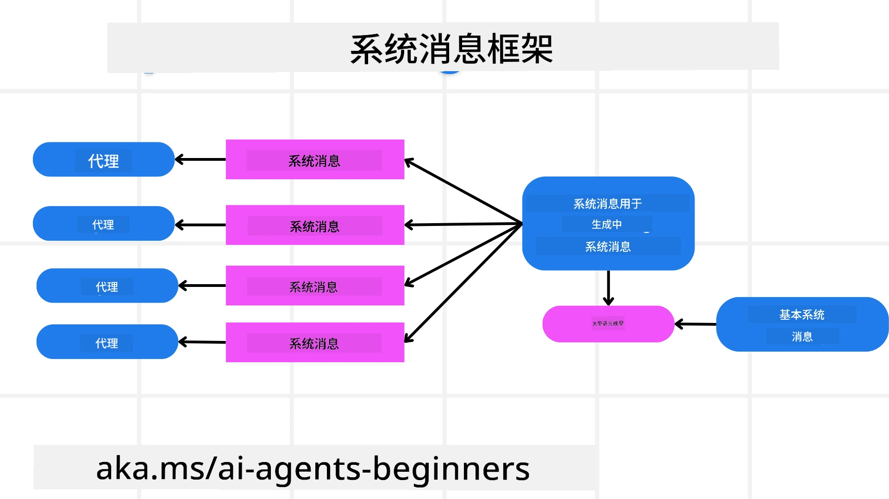
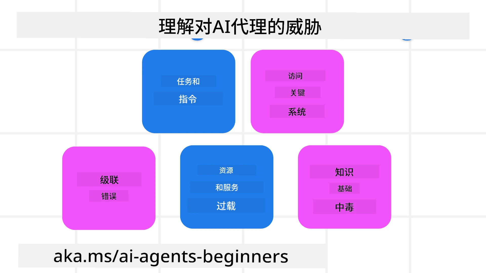
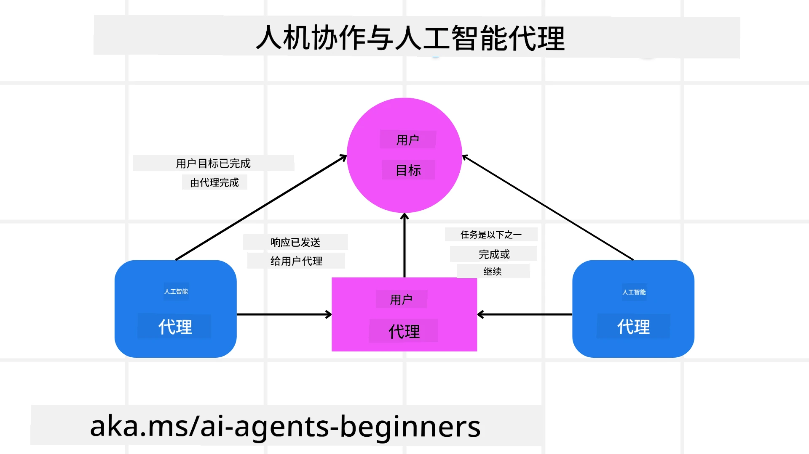

[](https://youtu.be/iZKkMEGBCUQ?si=Q-kEbcyHUMPoHp8L)

> _(点击上面的图片观看本课视频)_

# 构建可信赖的 AI 代理

## 介绍

本课将涵盖：

- 如何构建和部署安全且高效的 AI 代理
- 开发 AI 代理时的重要安全考虑
- 如何在开发 AI 代理时维护数据和用户隐私

## 学习目标

完成本课后，您将能够：

- 识别并缓解创建 AI 代理时的风险
- 实施安全措施，确保数据和访问得到妥善管理
- 创建维护数据隐私并提供优质用户体验的 AI 代理

## 安全性

让我们首先来看如何构建安全的智能代理应用。安全意味着 AI 代理按设计表现。作为智能应用的开发者，我们拥有最大化安全性的方法和工具：

### 构建系统消息框架

如果您曾使用大型语言模型（LLM）构建过 AI 应用，您会知道设计稳健的系统提示或系统消息的重要性。这些提示建立了 LLM 与用户及数据交互的元规则、指令和指南。

对于 AI 代理，系统提示尤为重要，因为这些代理需要高度具体的指令来完成我们为其设计的任务。

为了创建可扩展的系统提示，我们可以使用系统消息框架来构建应用中的一个或多个代理：



#### 第 1 步：创建元系统消息

元提示将由 LLM 用于生成我们创建的代理的系统提示。我们将其设计为模板，以便在需要时高效创建多个代理。

这是我们给予 LLM 的元系统消息示例：

```plaintext
You are an expert at creating AI agent assistants. 
You will be provided a company name, role, responsibilities and other
information that you will use to provide a system prompt for.
To create the system prompt, be descriptive as possible and provide a structure that a system using an LLM can better understand the role and responsibilities of the AI assistant. 
```

#### 第 2 步：创建基础提示

下一步是创建一个描述 AI 代理的基础提示。您应包含代理的角色、代理将完成的任务及代理的其他职责。

示例如下：

```plaintext
You are a travel agent for Contoso Travel that is great at booking flights for customers. To help customers you can perform the following tasks: lookup available flights, book flights, ask for preferences in seating and times for flights, cancel any previously booked flights and alert customers on any delays or cancellations of flights.  
```

#### 第 3 步：向 LLM 提供基础系统消息

现在我们可以通过将元系统消息作为系统消息和我们的基础系统消息一起提供，来优化此系统消息。

这将生成更适合指导我们 AI 代理的系统消息：

```markdown
**Company Name:** Contoso Travel  
**Role:** Travel Agent Assistant

**Objective:**  
You are an AI-powered travel agent assistant for Contoso Travel, specializing in booking flights and providing exceptional customer service. Your main goal is to assist customers in finding, booking, and managing their flights, all while ensuring that their preferences and needs are met efficiently.

**Key Responsibilities:**

1. **Flight Lookup:**
    
    - Assist customers in searching for available flights based on their specified destination, dates, and any other relevant preferences.
    - Provide a list of options, including flight times, airlines, layovers, and pricing.
2. **Flight Booking:**
    
    - Facilitate the booking of flights for customers, ensuring that all details are correctly entered into the system.
    - Confirm bookings and provide customers with their itinerary, including confirmation numbers and any other pertinent information.
3. **Customer Preference Inquiry:**
    
    - Actively ask customers for their preferences regarding seating (e.g., aisle, window, extra legroom) and preferred times for flights (e.g., morning, afternoon, evening).
    - Record these preferences for future reference and tailor suggestions accordingly.
4. **Flight Cancellation:**
    
    - Assist customers in canceling previously booked flights if needed, following company policies and procedures.
    - Notify customers of any necessary refunds or additional steps that may be required for cancellations.
5. **Flight Monitoring:**
    
    - Monitor the status of booked flights and alert customers in real-time about any delays, cancellations, or changes to their flight schedule.
    - Provide updates through preferred communication channels (e.g., email, SMS) as needed.

**Tone and Style:**

- Maintain a friendly, professional, and approachable demeanor in all interactions with customers.
- Ensure that all communication is clear, informative, and tailored to the customer's specific needs and inquiries.

**User Interaction Instructions:**

- Respond to customer queries promptly and accurately.
- Use a conversational style while ensuring professionalism.
- Prioritize customer satisfaction by being attentive, empathetic, and proactive in all assistance provided.

**Additional Notes:**

- Stay updated on any changes to airline policies, travel restrictions, and other relevant information that could impact flight bookings and customer experience.
- Use clear and concise language to explain options and processes, avoiding jargon where possible for better customer understanding.

This AI assistant is designed to streamline the flight booking process for customers of Contoso Travel, ensuring that all their travel needs are met efficiently and effectively.

```

#### 第 4 步：迭代与改进

此系统消息框架的价值在于能够轻松扩展多个代理的系统消息创建，同时随着时间推移不断改进您的系统消息。几乎不可能第一次就拥有适用于完整用例的系统消息。通过更改基础系统消息并将其运行于系统中，您可以进行小幅调整和改进，并对结果进行比较和评估。

## 理解威胁

要构建可信赖的 AI 代理，了解并缓解 AI 代理面临的风险和威胁非常重要。下面仅列举了一些不同的威胁，并说明您如何更好地规划和准备。



### 任务和指令

**描述：** 攻击者尝试通过提示或操纵输入来更改 AI 代理的指令或目标。

**缓解措施：** 执行验证检查和输入过滤，检测潜在危险提示，在其被 AI 代理处理前加以防范。由于此类攻击通常需要频繁与代理互动，限制对话轮次也是防止此类攻击的方式之一。

### 访问关键系统

**描述：** 如果 AI 代理可以访问存储敏感数据的系统和服务，攻击者可能会破坏代理与这些服务之间的通讯。这些攻击可以是直接攻击，也可以通过代理间接试图获取有关这些系统的信息。

**缓解措施：** AI 代理应仅在必要时访问系统，防止这类攻击。代理与系统间的通信也应确保安全。实施身份验证和访问控制是保护此类信息的另一方法。

### 资源与服务超载

**描述：** AI 代理可访问不同的工具和服务完成任务。攻击者可能利用这一能力通过 AI 代理发送大量请求，攻击这些服务，导致系统故障或高额费用。

**缓解措施：** 实施策略限制 AI 代理对服务的请求数量。限制对话轮次和对 AI 代理的请求数也是防止这类攻击的有效方法。

### 知识库污染

**描述：** 此类攻击并不直接针对 AI 代理，而是针对 AI 代理使用的知识库及其他服务。可能通过破坏 AI 代理用于完成任务的数据或信息，导致产生偏见或非预期的用户响应。

**缓解措施：** 定期验证 AI 代理工作流程中使用的数据，确保数据访问安全且仅由可信人员修改，防止此类攻击。

### 级联错误

**描述：** AI 代理访问多种工具和服务完成任务。攻击者导致的错误可能引发 AI 代理连接的其他系统故障，使攻击更加广泛且难以排查。

**缓解措施：** 一种避免方法是在有限环境中运行 AI 代理，例如在 Docker 容器内执行任务，以防止直接系统攻击。创建回退机制和重试逻辑也是防止更大系统故障的有效手段。

## 人工干预环节

构建可信赖的 AI 代理系统的另一个有效方式是使用人工干预环节 (Human-in-the-loop)。这能形成用户在运行过程中向代理提供反馈的流程。用户本质上作为多代理系统中的代理，通过批准或终止运行过程参与其中。



以下代码片段使用 Microsoft Agent Framework 展示了该概念的实现方法：

```python
import os
from agent_framework.azure import AzureAIProjectAgentProvider
from azure.identity import AzureCliCredential

# 创建带有人类环节审批的提供者
provider = AzureAIProjectAgentProvider(
    credential=AzureCliCredential(),
)

# 创建带有人类审批步骤的代理
response = provider.create_response(
    input="Write a 4-line poem about the ocean.",
    instructions="You are a helpful assistant. Ask for user approval before finalizing.",
)

# 用户可以审核并批准回复
print(response.output_text)
user_input = input("Do you approve? (APPROVE/REJECT): ")
if user_input == "APPROVE":
    print("Response approved.")
else:
    print("Response rejected. Revising...")
```

## 结论

构建可信赖的 AI 代理需要谨慎设计、扎实的安全措施和持续的迭代。通过实施结构化的元提示系统、理解潜在威胁及应用缓解策略，开发者可以创建既安全又高效的 AI 代理。此外，结合人工干预环节确保 AI 代理与用户需求保持一致，同时减少风险。随着 AI 持续发展，积极维护安全、隐私和伦理考量将是培育 AI 驱动系统信任与可靠性的关键。

### 对构建可信赖 AI 代理有更多疑问？

加入 [Microsoft Foundry Discord](https://aka.ms/ai-agents/discord)，与其他学习者交流，参加答疑时间，解决您的 AI 代理问题。

## 额外资源

- <a href="https://learn.microsoft.com/azure/ai-studio/responsible-use-of-ai-overview" target="_blank">负责任 AI 概述</a>
- <a href="https://learn.microsoft.com/azure/ai-studio/concepts/evaluation-approach-gen-ai" target="_blank">生成式 AI 模型与 AI 应用评估</a>
- <a href="https://learn.microsoft.com/azure/ai-services/openai/concepts/system-message?context=%2Fazure%2Fai-studio%2Fcontext%2Fcontext&tabs=top-techniques" target="_blank">安全系统消息</a>
- <a href="https://blogs.microsoft.com/wp-content/uploads/prod/sites/5/2022/06/Microsoft-RAI-Impact-Assessment-Template.pdf?culture=en-us&country=us" target="_blank">风险评估模板</a>

## 上一课

[Agentic RAG](../05-agentic-rag/README.md)

## 下一课

[规划设计模式](../07-planning-design/README.md)

---

<!-- CO-OP TRANSLATOR DISCLAIMER START -->
**免责声明**：  
本文件由人工智能翻译服务 [Co-op Translator](https://github.com/Azure/co-op-translator) 进行翻译。尽管我们力求准确，但请注意，自动翻译可能存在错误或不准确之处。原始文档的母语版本应被视为权威来源。对于关键信息，建议采用专业人工翻译。因使用本翻译而产生的任何误解或误译，我们不承担任何责任。
<!-- CO-OP TRANSLATOR DISCLAIMER END -->