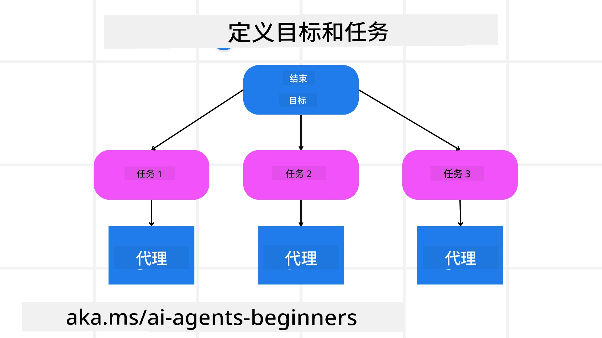

[](https://youtu.be/kPfJ2BrBCMY?si=9pYpPXp0sSbK91Dr)

> _(点击上图观看本课视频)_

# 计划设计

## 简介

本课将涵盖

* 明确整体目标，将复杂任务拆解为可管理的子任务。
* 利用结构化输出实现更可靠、机器可读的响应。
* 采用事件驱动方法处理动态任务和意外输入。

## 学习目标

完成本课后，您将了解：

* 识别并设定AI代理的整体目标，确保其明确知道需要实现什么。
* 将复杂任务拆解为可管理的子任务，并将其组织成逻辑顺序。
* 为代理配备合适的工具（如搜索工具或数据分析工具），决定工具的使用时机和方式，并处理突发情况。
* 评估子任务结果，衡量性能，并迭代改进行动以优化最终输出。

## 定义整体目标与任务拆解



大多数现实任务复杂度高，无法一步完成。AI代理需要一个简洁的目标来指导其规划和行动。例如，考虑目标：

    “生成一个为期3天的旅行行程。”

虽然表述简单，但仍需细化。目标越清晰，代理（及任何人类协作者）越能专注于实现正确结果，比如制作包含航班选项、酒店推荐和活动建议的全面行程。

### 任务分解

大型或复杂任务通过拆分成更小的、目标明确的子任务变得可管理。
以旅游行程为例，您可以将目标拆解为：

* 机票预订
* 酒店预订
* 租车
* 个性化

每个子任务可以由专门的代理或流程处理。一个代理可专注于搜索最佳机票，另一个处理酒店预订，依此类推。协调或“下游”代理随后将这些结果整合成完整行程呈现给最终用户。

这种模块化方法也便于逐步改进。例如，可以添加专门的饮食推荐代理或本地活动建议代理，逐步完善行程。

### 结构化输出

大型语言模型（LLMs）可以生成结构化输出（例如JSON），便于下游代理或服务解析处理。尤其在多代理场景下，收到规划输出后即可执行这些任务。

以下Python代码片段演示了一个简单的规划代理拆解目标成子任务并生成结构化计划：

```python
from pydantic import BaseModel
from enum import Enum
from typing import List, Optional, Union
import json
import os
from typing import Optional
from pprint import pprint
from agent_framework.azure import AzureAIProjectAgentProvider
from azure.identity import AzureCliCredential

class AgentEnum(str, Enum):
    FlightBooking = "flight_booking"
    HotelBooking = "hotel_booking"
    CarRental = "car_rental"
    ActivitiesBooking = "activities_booking"
    DestinationInfo = "destination_info"
    DefaultAgent = "default_agent"
    GroupChatManager = "group_chat_manager"

# 旅行子任务模型
class TravelSubTask(BaseModel):
    task_details: str
    assigned_agent: AgentEnum  # 我们想将任务分配给代理

class TravelPlan(BaseModel):
    main_task: str
    subtasks: List[TravelSubTask]
    is_greeting: bool

provider = AzureAIProjectAgentProvider(credential=AzureCliCredential())

# 定义用户消息
system_prompt = """You are a planner agent.
    Your job is to decide which agents to run based on the user's request.
    Provide your response in JSON format with the following structure:
{'main_task': 'Plan a family trip from Singapore to Melbourne.',
 'subtasks': [{'assigned_agent': 'flight_booking',
               'task_details': 'Book round-trip flights from Singapore to '
                               'Melbourne.'}
    Below are the available agents specialised in different tasks:
    - FlightBooking: For booking flights and providing flight information
    - HotelBooking: For booking hotels and providing hotel information
    - CarRental: For booking cars and providing car rental information
    - ActivitiesBooking: For booking activities and providing activity information
    - DestinationInfo: For providing information about destinations
    - DefaultAgent: For handling general requests"""

user_message = "Create a travel plan for a family of 2 kids from Singapore to Melbourne"

response = client.create_response(input=user_message, instructions=system_prompt)

response_content = response.output_text
pprint(json.loads(response_content))
```

### 具备多代理编排的规划代理

在此示例中，语义路由代理接收用户请求（如“我需要一份旅行酒店计划。”）。

规划者随后：

* 接收酒店计划：基于系统提示（包含可用代理信息），从用户信息生成结构化旅行计划。
* 列出代理及其工具：代理注册表包含代理列表（例如机票、酒店、租车、活动）及其功能或工具。
* 将计划分发给对应代理：根据子任务数量，规划者单任务时直接发送给专属代理，多任务时通过群聊管理器协调多代理协作。
* 总结结果：最后，规划者总结生成的计划以便清晰展示。
以下Python代码示例演示上述步骤：

```python

from pydantic import BaseModel

from enum import Enum
from typing import List, Optional, Union

class AgentEnum(str, Enum):
    FlightBooking = "flight_booking"
    HotelBooking = "hotel_booking"
    CarRental = "car_rental"
    ActivitiesBooking = "activities_booking"
    DestinationInfo = "destination_info"
    DefaultAgent = "default_agent"
    GroupChatManager = "group_chat_manager"

# 旅行子任务模型

class TravelSubTask(BaseModel):
    task_details: str
    assigned_agent: AgentEnum # 我们想将任务分配给代理

class TravelPlan(BaseModel):
    main_task: str
    subtasks: List[TravelSubTask]
    is_greeting: bool
import json
import os
from typing import Optional

from agent_framework.azure import AzureAIProjectAgentProvider
from azure.identity import AzureCliCredential

# 创建客户端

provider = AzureAIProjectAgentProvider(credential=AzureCliCredential())

from pprint import pprint

# 定义用户消息

system_prompt = """You are a planner agent.
    Your job is to decide which agents to run based on the user's request.
    Below are the available agents specialized in different tasks:
    - FlightBooking: For booking flights and providing flight information
    - HotelBooking: For booking hotels and providing hotel information
    - CarRental: For booking cars and providing car rental information
    - ActivitiesBooking: For booking activities and providing activity information
    - DestinationInfo: For providing information about destinations
    - DefaultAgent: For handling general requests"""

user_message = "Create a travel plan for a family of 2 kids from Singapore to Melbourne"

response = client.create_response(input=user_message, instructions=system_prompt)

response_content = response.output_text

# 在将响应内容加载为JSON后打印它

pprint(json.loads(response_content))
```

下面是上述代码的输出，您可以使用该结构化结果路由给`assigned_agent`，并将旅行计划总结给最终用户。

```json
{
    "is_greeting": "False",
    "main_task": "Plan a family trip from Singapore to Melbourne.",
    "subtasks": [
        {
            "assigned_agent": "flight_booking",
            "task_details": "Book round-trip flights from Singapore to Melbourne."
        },
        {
            "assigned_agent": "hotel_booking",
            "task_details": "Find family-friendly hotels in Melbourne."
        },
        {
            "assigned_agent": "car_rental",
            "task_details": "Arrange a car rental suitable for a family of four in Melbourne."
        },
        {
            "assigned_agent": "activities_booking",
            "task_details": "List family-friendly activities in Melbourne."
        },
        {
            "assigned_agent": "destination_info",
            "task_details": "Provide information about Melbourne as a travel destination."
        }
    ]
}
```

含上述代码示例的Jupyter笔记本可以在[这里](07-python-agent-framework.ipynb)获得。

### 迭代规划

某些任务需要反复协作或重新规划，一个子任务结果影响下一个。例如，代理在预订机票时发现意外数据格式，可能需要调整策略再继续酒店预订。

此外，用户反馈（如人工选择更早航班）可能触发部分重新规划。这种动态、迭代方法确保最终方案符合现实约束和不断变化的用户偏好。

示例代码

```python
from agent_framework.azure import AzureAIProjectAgentProvider
from azure.identity import AzureCliCredential
#.. 与之前的代码相同，并传递用户历史和当前计划

system_prompt = """You are a planner agent to optimize the
    Your job is to decide which agents to run based on the user's request.
    Below are the available agents specialized in different tasks:
    - FlightBooking: For booking flights and providing flight information
    - HotelBooking: For booking hotels and providing hotel information
    - CarRental: For booking cars and providing car rental information
    - ActivitiesBooking: For booking activities and providing activity information
    - DestinationInfo: For providing information about destinations
    - DefaultAgent: For handling general requests"""

user_message = "Create a travel plan for a family of 2 kids from Singapore to Melbourne"

response = client.create_response(
    input=user_message,
    instructions=system_prompt,
    context=f"Previous travel plan - {TravelPlan}",
)
# .. 重新规划并将任务发送给相应的代理
```

如需更全面的规划方案，请查看Magnetic One <a href="https://www.microsoft.com/research/articles/magentic-one-a-generalist-multi-agent-system-for-solving-complex-tasks" target="_blank">博客文章</a>，其致力于解决复杂任务。

## 总结

本文介绍了如何创建一个能够动态选择已定义可用代理的规划器。规划器输出拆解任务并分配代理以便执行，假设代理拥有完成任务所需的功能/工具。除代理外，还可以结合反思、摘要和轮询聊天等其他模式以进一步定制。

## 额外资源

Magnetic One - 一款通用多代理系统，用于解决复杂任务，在多个难度较大的代理基准测试中取得显著成绩。参考：<a href="https://www.microsoft.com/research/articles/magentic-one-a-generalist-multi-agent-system-for-solving-complex-tasks" target="_blank">Magnetic One</a>。该实现中调度器负责创建任务专用计划并将任务委派给可用代理。除规划外，调度器还采用跟踪机制监控任务进度并根据需要重新规划。

### 对计划设计模式还有疑问？

加入 [Microsoft Foundry Discord](https://aka.ms/ai-agents/discord) ，与其他学习者交流，参加答疑时间，获取AI代理相关问题解答。

## 上一课

[构建值得信赖的AI代理](../06-building-trustworthy-agents/README.md)

## 下一课

[多代理设计模式](../08-multi-agent/README.md)

---

<!-- CO-OP TRANSLATOR DISCLAIMER START -->
**免责声明**：
本文件由 AI 翻译服务 [Co-op Translator](https://github.com/Azure/co-op-translator) 翻译。虽然我们力求准确，但请注意自动翻译可能包含错误或不准确之处。原始语言版本的文件应被视为权威来源。对于重要信息，建议采用专业人工翻译。对于因使用本翻译而产生的任何误解或误释，我们不承担任何责任。
<!-- CO-OP TRANSLATOR DISCLAIMER END -->