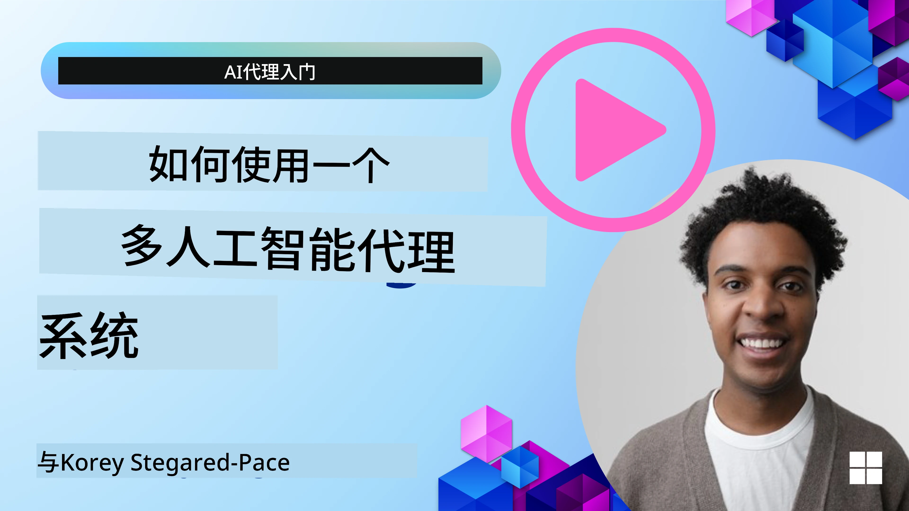
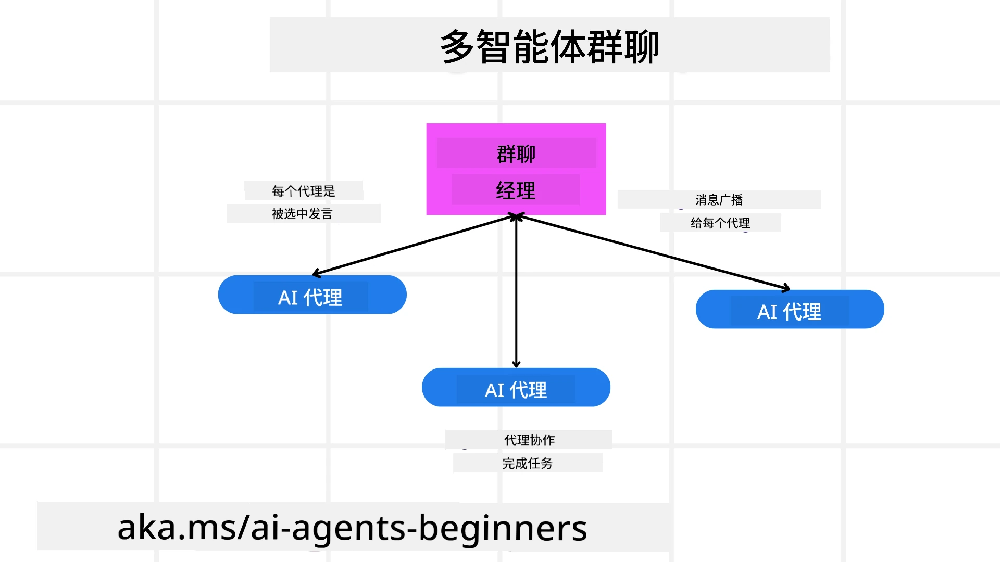
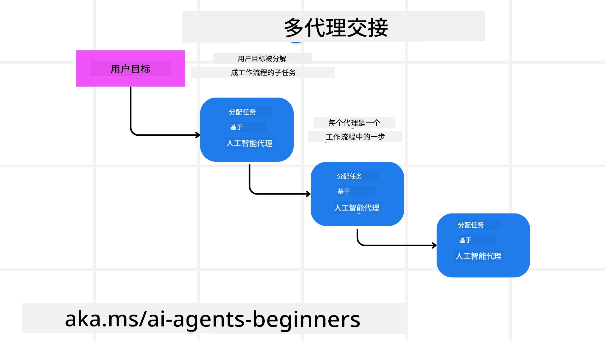
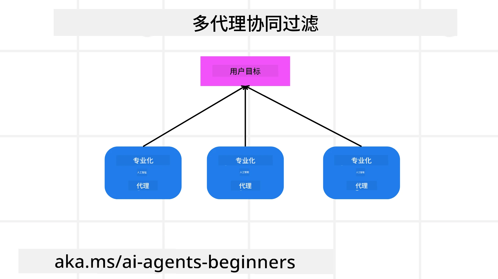

> _(点击上方图片观看本课视频)_

# 多智能体设计模式

一旦开始在项目中涉及多个智能体工作，就需要考虑多智能体设计模式。然而，可能并不立即清楚何时切换到多智能体以及其优势是什么。

## 介绍

在本课中，我们试图回答以下问题：

- 多智能体适用的场景有哪些？
- 使用多智能体相比仅用一个单智能体做多任务有什么优势？
- 实现多智能体设计模式的构建模块有哪些？
- 如何实现对多个智能体之间交互的可见性？

## 学习目标

本课结束后，你应能够：

- 识别适合使用多智能体的场景
- 理解使用多智能体相比单一智能体的优势
- 理解实现多智能体设计模式的构建模块

更大的意义是什么？

*多智能体是一种设计模式，允许多个智能体协作以达成共同目标*。

该模式广泛应用于多个领域，包括机器人、自治系统和分布式计算。

## 适合多智能体的场景

那么哪些场景适合使用多智能体？答案是有很多，特别是在以下情况中使用多个智能体很有益：

- **大规模工作负载**：大型工作负载可拆分成较小的任务分配给不同智能体，允许并行处理、加快完成速度。一个例子是大型数据处理任务。
- **复杂任务**：复杂任务同样可拆分成子任务交由专长不同任务的各智能体处理。举例来说，在自动驾驶车辆中，导航智能体、障碍检测智能体与车间通讯智能体分别管理不同职责。
- **多样化专长**：不同智能体具备多样化专长，更高效地处理任务不同方面。比如医疗中，诊断智能体、治疗方案智能体及患者监控智能体各自专注不同职责。

## 使用多智能体相比单智能体的优势

单一智能体系统适合简单任务，但复杂任务中，使用多个智能体带来若干优势：

- **专业化**：每个智能体可专注具体任务。单个智能体专业化不足时，会面临处理复杂任务时选择困难，可能执行不擅长的任务。
- **可扩展性**：扩展系统更容易，通过增加多个智能体，而非单一超载智能体。
- **容错性**：若一智能体失败，其他智能体可继续运行，保证系统可靠性。

举个例子，帮用户预订旅行。单一智能体需处理整个预订流程，从找航班、订酒店到租车。实现这样单一智能体系统，需要它具备处理所有任务的工具，导致系统复杂难维护和扩展。多智能体系统则可由寻找航班智能体、酒店预订智能体和租车智能体分别负责，使系统模块化更易维护和扩展。

相当于家族小旅行社与加盟连锁旅行社的对比。家族小旅行社由一个代理人处理全部行程预订，而加盟连锁旅行社有不同代理人分别处理不同环节。

## 实现多智能体设计模式的构建模块

实现多智能体设计模式前，你需要理解组成该模式的构建块。

再以用户预订旅行为例，构建模块包括：

- **智能体通信**：负责找航班、订酒店、租车的智能体需沟通并共享用户偏好与约束信息。具体来说，找航班智能体需与订酒店智能体通信，确保酒店预订日期与航班一致。即需决定*哪些智能体共享信息以及如何共享*。
- **协调机制**：智能体需协调其行为，满足用户偏好与约束。比如用户偏好酒店近机场，但租车仅机场有车，订酒店智能体需与租车智能体协调，保证满足用户要求。即需决定*智能体如何协调动作*。
- **智能体架构**：智能体需有内部结构以决策并从与用户互动中学习。找航班智能体需具备推荐航班的决策结构。即需决定*智能体如何基于与用户的交互做决策和学习*。例如，找航班智能体可用机器学习模型，根据用户过往偏好推荐航班。
- **多智能体交互可见性**：需要能够观察多个智能体之间如何交互。需要工具和技术来追踪智能体活动和交互，比如日志监控工具、可视化工具及性能指标。
- **多智能体模式**：实现多智能体系统有多种模式，如集中式、分散式和混合架构。需要选择最适合你用例的模式。
- **人工介入**：大多数情况下会有人工介入，你需要指示智能体何时请求人工干预，比如用户请求特定未被推荐的酒店或航班，或订票前需要人工确认。

## 多智能体交互的可见性

必须能够可视化多个智能体间的交互。这样的可见性对于调试、优化和保障系统整体有效性非常重要。为此，需要工具与技术追踪智能体活动和交互，形式可能包括日志监控工具、可视化工具和性能指标。

以用户预订旅行为例，可能有一个仪表盘显示每个智能体状态、用户偏好和约束、以及智能体间交互。仪表盘显示用户出行日期、航班智能体推荐航班、酒店智能体推荐酒店以及租车智能体推荐租车等，清晰展现智能体如何交互，是否满足用户需求。

具体来看：

- **日志与监控工具**：为每个智能体的行为记录日志。日志中存储执行动作的智能体信息、动作内容、执行时间和结果。可用于调试、优化等。
- **可视化工具**：帮助更直观地展示智能体间交互。比如绘制展示信息流动的图表，帮助识别系统瓶颈、低效等问题。
- **性能指标**：追踪多智能体系统的效率。比如任务完成时间、单位时间内完成任务数、智能体推荐准确率。帮助发现改进空间并优化系统。

## 多智能体模式

让我们探讨一些具体模式，用于构建多智能体应用。以下是值得考虑的有趣模式：

### 群聊

当你想创建群聊应用，多智能体之间相互通讯时，此模式非常有用。典型应用包括团队协作、客户支持和社交网络。

在此模式中，每个智能体代表群聊中的一个用户，消息通过消息协议在智能体间传递。智能体可向群聊发送消息、接收群聊消息，以及回复其他智能体消息。

可用集中式架构实现，所有消息通过中央服务器路由；也可用分散式架构，消息直接在智能体间传递。

### 任务交接

当你想创建多个智能体间能够交接任务的应用时，此模式很有用。

典型应用包括客户支持、任务管理和工作流自动化。

此模式中，每个智能体代表一个任务或工作流步骤，智能体根据预定义规则可将任务交接给其他智能体。

### 协同过滤

当你想创建多个智能体合作向用户推荐内容的应用时，此模式有用。

为何需要多个智能体合作？因为每个智能体具备不同专长，从不同角度协助推荐流程。

举例，用户想获得最佳股票推荐。

- **行业专家**：一智能体为特定行业专家。
- **技术分析**：另一智能体是技术分析专家。
- **基本面分析**：还有智能体为基本面分析专家。智能体合作可提供更全面推荐。

## 场景：退款流程

考虑一个客户试图申请商品退款的场景，涉及多个智能体。我们将这些智能体分为特定退款流程的智能体和可用于其他业务的通用智能体。

**退款流程特定智能体：**

以下智能体可能参与退款流程：

- **客户智能体**：代表客户，负责发起退款流程。
- **卖家智能体**：代表卖家，负责处理退款。
- **支付智能体**：代表支付流程，负责退款给客户。
- **解决智能体**：代表解决流程，负责处理退款过程中的问题。
- **合规智能体**：代表合规流程，负责确保退款流程符合规章政策。

**通用智能体：**

这些智能体可被业务其他部分使用。

- **运输智能体**：代表运输流程，负责将商品退回卖家。既用于退款流程，也用于商品购买运输。
- **反馈智能体**：代表反馈流程，负责收集客户反馈，反馈可在任何时间收集，而非仅限退款过程中。
- **升级智能体**：代表升级流程，负责将问题升级至更高支持级别，适用于任何需升级问题的流程。
- **通知智能体**：代表通知流程，负责在退款流程各阶段向客户发送通知。
- **分析智能体**：代表分析流程，负责分析与退款相关的数据。
- **审计智能体**：代表审计流程，负责审核退款流程确保其正确执行。
- **报告智能体**：代表报告流程，负责生成退款流程报告。
- **知识智能体**：代表知识流程，负责维护与退款流程相关的知识库，也可能涉及你业务其他部分的知识。
- **安全智能体**：代表安全流程，负责保障退款流程安全。
- **质量智能体**：代表质量流程，负责保障退款流程质量。

前面列出了不少智能体，既有退款流程专用的，也有可用于其他业务部分的通用智能体。希望能帮助你了解如何选择适合用于多智能体系统的智能体。

## 任务

设计一个用于客户支持流程的多智能体系统。识别涉及的智能体、其角色与责任，以及它们之间的互动。考虑既有客户支持特定智能体，也有可用于业务其他部分的通用智能体。
> 在阅读以下解决方案之前，请先思考一下，你可能需要的代理比你想象的还要多。

> TIP：考虑客户支持流程的不同阶段，也要考虑任何系统所需的代理。

## 解决方案

[解决方案](./solution/solution.md)

## 知识检测

问题：什么时候应该考虑使用多代理？

- [ ] A1：当你的工作量小且任务简单时。
- [ ] A2：当你的工作量大时。
- [ ] A3：当你的任务简单时。

[解决方案测验](./solution/solution-quiz.md)

## 总结

在本课中，我们了解了多代理设计模式，包括适用多代理的场景、使用多代理相较于单一代理的优势、实现多代理设计模式的构建模块，以及如何获得对多个代理相互作用的可见性。

### 对多代理设计模式还有更多疑问吗？

加入 [Microsoft Foundry Discord](https://aka.ms/ai-agents/discord) 与其他学习者交流，参加答疑时间，获取你的 AI 代理问题的解答。

## 额外资源

- <a href="https://learn.microsoft.com/azure/ai-services/agents/overview" target="_blank">Microsoft 代理框架文档</a>
- <a href="https://www.analyticsvidhya.com/blog/2024/10/agentic-design-patterns/" target="_blank">代理设计模式</a>

## 上一课

[规划设计](../07-planning-design/README.md)

## 下一课

[AI代理中的元认知](../09-metacognition/README.md)

---

<!-- CO-OP TRANSLATOR DISCLAIMER START -->
**免责声明**：
本文件使用AI翻译服务[Co-op Translator](https://github.com/Azure/co-op-translator)进行翻译。尽管我们力求准确，但请注意，自动翻译可能包含错误或不准确之处。原始文件的母语版本应被视为权威来源。对于重要信息，建议使用专业人工翻译。我们不对因使用本翻译而产生的任何误解或误释承担责任。
<!-- CO-OP TRANSLATOR DISCLAIMER END -->