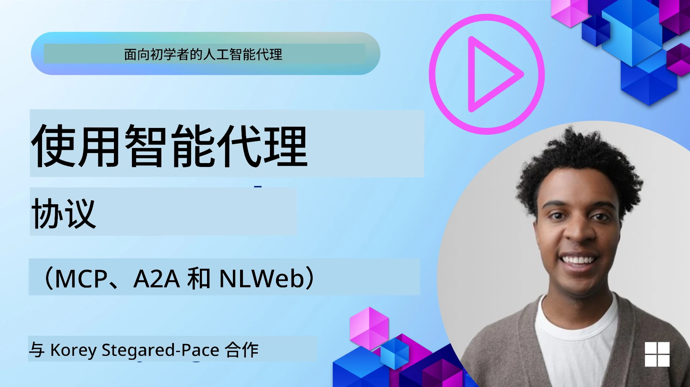
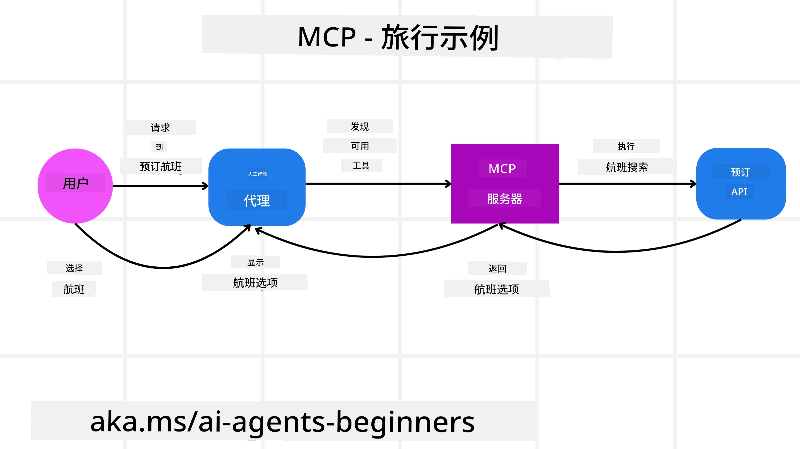
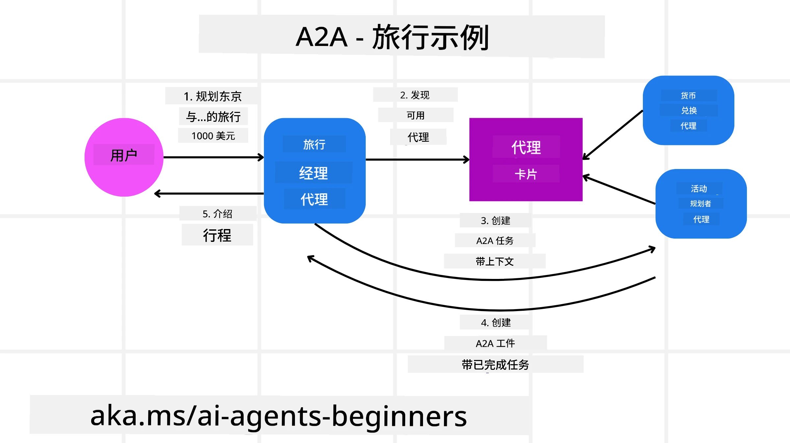
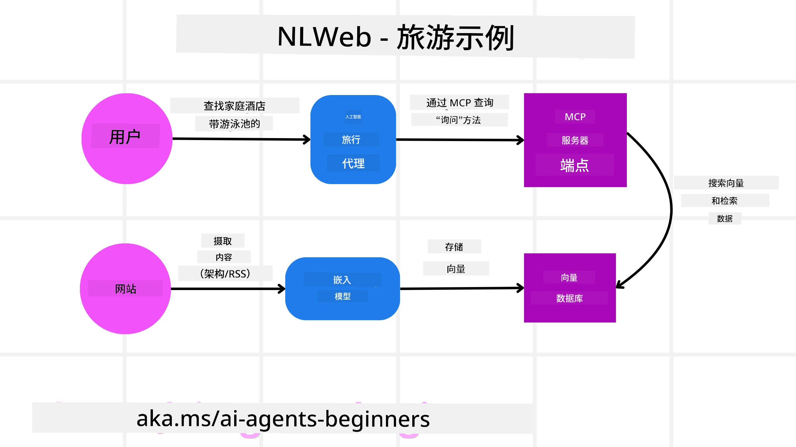

# 使用 Agentic 协议 (MCP、A2A 和 NLWeb)

> _(点击上方图片查看本课视频)_

随着 AI 代理的使用增长，对确保标准化、安全性并支持开放创新的协议的需求也在增加。在本课中，我们将介绍三种旨在满足此需求的协议——Model Context Protocol (MCP)、Agent to Agent (A2A) 和 Natural Language Web (NLWeb)。

## 介绍

在本课中，我们将涵盖：

• **MCP** 如何允许 AI 代理访问外部工具和数据以完成用户任务。

• **A2A** 如何使不同的 AI 代理之间能够进行通信和协作。

• **NLWeb** 如何将自然语言界面带到任何网站，使 AI 代理能够发现并与内容交互。

## 学习目标

• **识别** MCP、A2A 和 NLWeb 在 AI 代理背景下的核心目的和好处。

• **解释** 每个协议如何促进 LLMs、工具和其他代理之间的通信与交互。

• **认识** 每个协议在构建复杂代理系统中所扮演的不同角色。

## Model Context Protocol

Model Context Protocol (MCP) 是一项开放标准，提供一种标准化方式，让应用程序为 LLMs 提供上下文和工具。这使得 AI 代理可以以一致的方式连接到不同的数据源和工具，充当“通用适配器”。

让我们来看看 MCP 的组件、相比直接使用 API 的好处，以及 AI 代理如何使用 MCP 服务器的示例。

### MCP 核心组件

MCP 采用 **客户端-服务器架构**，核心组件包括：

• **Hosts** 是启动与 MCP Server 连接的 LLM 应用（例如像 VSCode 这样的代码编辑器）。

• **Clients** 是宿主应用内的组件，维护与服务器的一对一连接。

• **Servers** 是暴露特定功能的轻量级程序。

协议中包含三种核心原语，即 MCP Server 的功能：

• **Tools**：这些是 AI 代理可以调用以执行操作的离散动作或函数。例如，天气服务可能会暴露一个“get weather”工具，或电子商务服务器可能会暴露一个“purchase product”工具。MCP 服务器在其能力列表中为每个工具公布名称、描述和输入/输出模式。

• **Resources**：这些是 MCP 服务器可以提供的只读数据项或文档，客户端可以按需检索它们。示例包括文件内容、数据库记录或日志文件。Resources 可以是文本（如代码或 JSON）或二进制（如图像或 PDF）。

• **Prompts**：这些是提供建议提示的预定义模板，允许更复杂的工作流。

### MCP 的好处

MCP 为 AI 代理提供显著优势：

• **动态工具发现**：代理可以动态接收来自服务器的可用工具列表及其功能描述。这与传统 API 不同，传统 API 通常需要静态编码集成，意味着任何 API 更改都需要更新代码。MCP 提供“一次集成”的方法，从而具有更高的适应性。

• **跨 LLM 的互操作性**：MCP 可在不同的 LLM 之间工作，提供在核心模型之间切换以评估更好性能的灵活性。

• **标准化安全**：MCP 包含标准的认证方法，在添加对额外 MCP 服务器的访问时提高了可扩展性。这比为各种传统 API 管理不同的密钥和认证类型更简单。

### MCP 示例

想象用户想使用由 MCP 提供支持的 AI 助手预订机票。

1. **连接**：AI 助手（MCP 客户端）连接到航空公司提供的 MCP 服务器。

2. **工具发现**：客户端询问航空公司的 MCP 服务器：“你有哪些可用工具？”服务器响应诸如“search flights”和“book flights”之类的工具。

3. **工具调用**：然后你请 AI 助手“请搜索一趟从 Portland 到 Honolulu 的航班”。AI 助手使用其 LLM 识别出需要调用“search flights”工具，并将相关参数（出发地、目的地）传递给 MCP 服务器。

4. **执行与响应**：MCP 服务器作为包装器，实际调用航空公司的内部预订 API。然后它接收航班信息（例如 JSON 数据）并将其发送回 AI 助手。

5. **进一步交互**：AI 助手展示航班选项。一旦你选择了航班，助手可能会在同一 MCP 服务器上调用“book flight”工具，完成预订。

## Agent-to-Agent Protocol (A2A)

当 MCP 专注于将 LLMs 连接到工具时，Agent-to-Agent (A2A) 协议更进一步，使不同的 AI 代理之间能够进行通信和协作。A2A 将来自不同组织、环境和技术栈的 AI 代理连接起来，以完成共享任务。

我们将查看 A2A 的组件和好处，以及它如何在我们的旅游应用中应用的示例。

### A2A 核心组件

A2A 专注于使代理之间能够通信并协同完成用户的子任务。协议的每个组件都有助于此：

#### Agent Card

类似于 MCP 服务器共享工具列表，Agent Card 包含：
- Agent 的名称。
- 它完成的一般任务的**描述**。
- 帮助其他代理（或甚至人类用户）理解何时以及为何调用该代理的**具体技能列表**及其描述。
- 代理的**当前 Endpoint URL**。
- 代理的**版本**和**能力**，例如流式响应和推送通知。

#### Agent Executor

Agent Executor 负责**将用户聊天的上下文传递给远程代理**，远程代理需要这些信息来理解需要完成的任务。在 A2A 服务器中，代理使用其自身的 Large Language Model (LLM) 来解析传入请求并使用其内部工具执行任务。

#### Artifact

一旦远程代理完成请求的任务，其产出将作为 artifact 创建。artifact **包含代理工作的结果**、**已完成内容的描述**以及通过协议发送的**文本上下文**。artifact 发送后，与远程代理的连接将关闭，直到再次需要为止。

#### Event Queue

该组件用于**处理更新和传递消息**。在生产环境中，这对于代理系统尤为重要，以防在任务完成之前代理之间的连接被关闭，特别是当任务完成时间可能较长时。

### A2A 的好处

• **增强的协作**：它使来自不同厂商和平台的代理能够交互、共享上下文并共同工作，促进跨传统上不相连系统的无缝自动化。

• **模型选择的灵活性**：每个 A2A 代理可以决定使用哪个 LLM 来处理其请求，允许为每个代理优化或微调模型，这不同于某些 MCP 场景中的单一 LLM 连接。

• **内置认证**：认证直接集成到 A2A 协议中，为代理交互提供了强大的安全框架。

### A2A 示例

让我们在旅行预订场景中展开，但这次使用 A2A。

1. **用户向多代理发起请求**：用户与一个“Travel Agent” A2A 客户端/代理交互，例如说：“请为下周预订一次完整的檀香山旅行，包括航班、酒店和租车”。

2. **Travel Agent 的编排**：Travel Agent 接收到这个复杂请求。它使用自己的 LLM 对任务进行推理，并确定需要与其他专门代理交互。

3. **代理间通信**：然后 Travel Agent 使用 A2A 协议连接到下游代理，例如由不同公司创建的“Airline Agent”、“Hotel Agent”和“Car Rental Agent”。

4. **委派任务执行**：Travel Agent 向这些专门代理发送具体任务（例如，“查找飞往檀香山的航班”、“预订酒店”、“租车”）。每个专门代理运行各自的 LLM 并使用自己的工具（这些工具本身也可能是 MCP 服务器）来执行其特定的预订部分。

5. **整合响应**：一旦所有下游代理完成任务，Travel Agent 汇总结果（航班详情、酒店确认、租车预订）并以综合的聊天式响应发送回用户。

## Natural Language Web (NLWeb)

网站长期以来一直是用户在互联网上访问信息和数据的主要方式。

让我们看一下 NLWeb 的不同组件、NLWeb 的好处以及通过我们的旅行应用查看 NLWeb 如何工作示例。

### NLWeb 的组件

- **NLWeb 应用（核心服务代码）**：处理自然语言问题的系统。它连接平台的不同部分以创建响应。你可以将其视为网站自然语言功能的**引擎**。

- **NLWeb 协议**：这是与网站进行自然语言交互的**基本规则集**。它以 JSON 格式（通常使用 Schema.org）返回响应。其目的是为“AI Web”创建一个简单的基础，就像 HTML 使在线共享文档成为可能一样。

- **MCP Server (Model Context Protocol Endpoint)**：每个 NLWeb 设置也作为 **MCP 服务器**。这意味着它可以**与其他 AI 系统共享工具（例如“ask”方法）和数据**。在实践中，这使得网站的内容和能力可被 AI 代理使用，从而使该站点成为更广泛“代理生态系统”的一部分。

- **Embedding Models**：这些模型用于**将网站内容转换为称为向量的数值表示（embeddings）**。这些向量以一种计算机可以比较和搜索的方式捕捉含义。它们存储在专用数据库中，用户可以选择他们想使用的 embedding 模型。

- **Vector Database (检索机制)**：该数据库**存储网站内容的 embeddings**。当有人提出问题时，NLWeb 会检查向量数据库以快速找到最相关的信息。它会提供按相似度排序的快速可能答案列表。NLWeb 可以与不同的向量存储系统一起工作，例如 Qdrant、Snowflake、Milvus、Azure AI Search 和 Elasticsearch。

### NLWeb 示例

再考虑我们的旅行预订网站，但这次它由 NLWeb 提供支持。

1. **数据摄取**：旅行网站现有的产品目录（例如航班列表、酒店描述、旅游套餐）使用 Schema.org 或通过 RSS 提要进行格式化。NLWeb 的工具摄取这些结构化数据，创建 embeddings，并将它们存储在本地或远程的向量数据库中。

2. **自然语言查询（人类）**：用户访问网站，并且不通过导航菜单，而是在聊天界面中输入：“为我查找下周在檀香山、适合家庭且有游泳池的酒店”。

3. **NLWeb 处理**：NLWeb 应用接收此查询。它将查询发送到 LLM 以进行理解，同时在其向量数据库中搜索相关的酒店列表。

4. **准确结果**：LLM 有助于解释数据库的搜索结果，根据“适合家庭”、“游泳池”和“檀香山”这些条件识别最佳匹配，然后格式化成自然语言响应。关键是，响应引用的是网站目录中的实际酒店，避免虚构信息。

5. **AI 代理交互**：由于 NLWeb 同时作为 MCP 服务器，外部的 AI 旅行代理也可以连接到该网站的 NLWeb 实例。AI 代理随后可以使用 `ask("该酒店在檀香山地区是否推荐任何适合素食者的餐厅？")` 方法直接查询该网站。NLWeb 实例将处理此查询，利用其餐厅信息数据库（如果已加载），并返回结构化的 JSON 响应。

### 关于 MCP/A2A/NLWeb 还有更多问题？

加入 [Microsoft Foundry Discord](https://aka.ms/ai-agents/discord) 与其他学习者见面，参加答疑时间并获得 AI 代理相关问题的解答。

## 资源

- [MCP 适合初学者](https://aka.ms/mcp-for-beginners)  
- [MCP 文档](https://learn.microsoft.com/python/api/overview/azure/ai-projects-readme)
- [NLWeb 仓库](https://github.com/nlweb-ai/NLWeb)
- [Microsoft Agent Framework](https://aka.ms/ai-agents-beginners/agent-framewrok)

---

<!-- CO-OP TRANSLATOR DISCLAIMER START -->
**免责声明**：
本文件由 AI 翻译服务 [Co-op Translator](https://github.com/Azure/co-op-translator) 翻译。尽管我们力求准确，但请注意自动翻译可能包含错误或不准确之处。原始语言的文档应被视为权威来源。对于重要信息，建议采用专业人工翻译。对于因使用本翻译而产生的任何误解或曲解，我们不承担任何责任。
<!-- CO-OP TRANSLATOR DISCLAIMER END -->