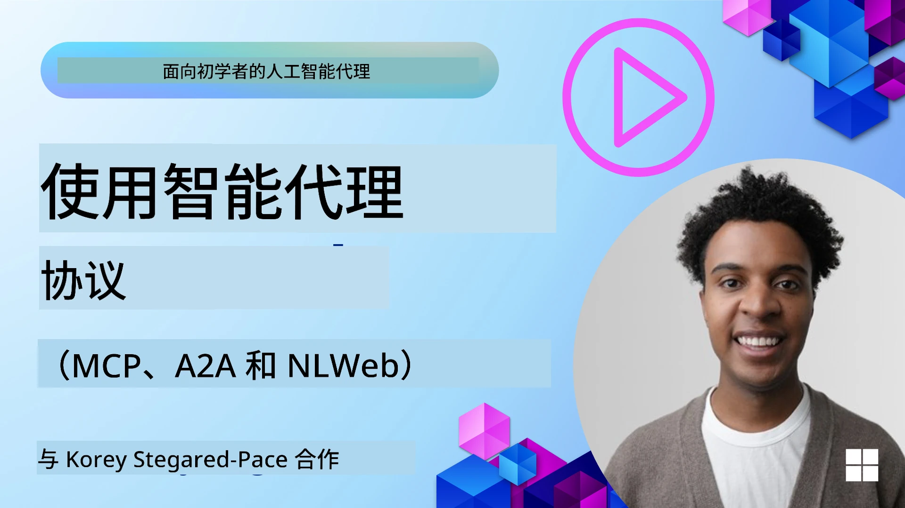
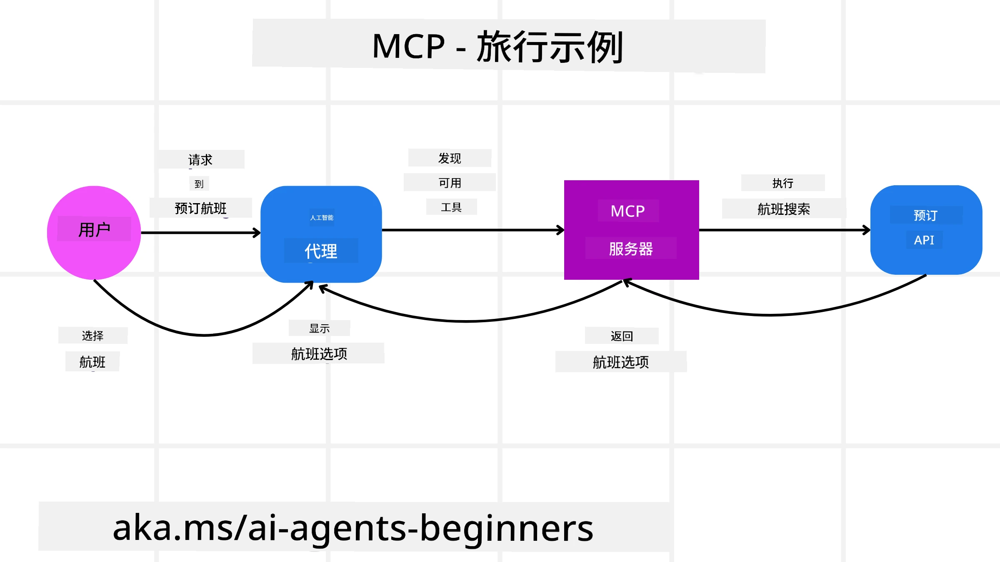
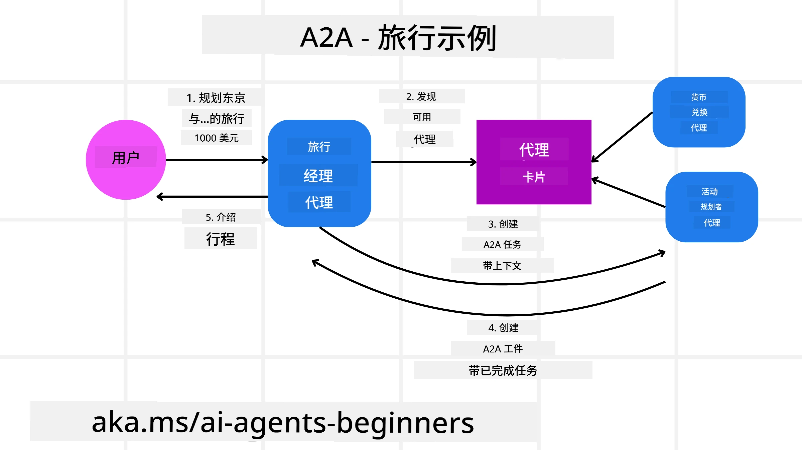
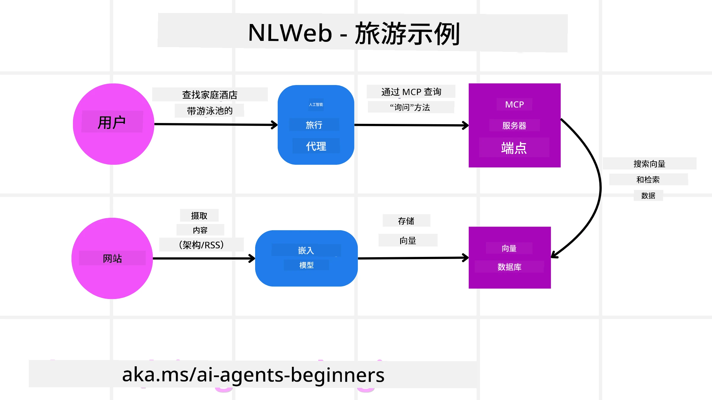

# 使用自主协议（MCP、A2A 和 NLWeb）

> _(点击上方图片观看本课视频)_

随着 AI 代理的广泛应用，对确保标准化、安全性以及支持开放创新的协议需求也在增长。在本课中，我们将介绍三种旨在满足这一需求的协议——模型上下文协议（MCP）、代理间协议（A2A）以及自然语言网页（NLWeb）。

## 介绍

本课将介绍：

• **MCP** 如何允许 AI 代理访问外部工具和数据以完成用户任务。

• **A2A** 如何实现不同 AI 代理之间的通信与协作。

• **NLWeb** 如何为任何网站带来自然语言接口，使 AI 代理能够发现并与内容交互。

## 学习目标

• <strong>识别</strong> MCP、A2A 和 NLWeb 在 AI 代理背景下的核心目的和优势。

• <strong>解释</strong> 每个协议如何促进大型语言模型（LLM）、工具和其他代理之间的通信与交互。

• <strong>认识</strong> 每种协议在构建复杂自主系统中的不同角色。

## 模型上下文协议

**模型上下文协议 (MCP)** 是一项开放标准，提供应用程序向大型语言模型（LLM）传递上下文和工具的标准化方式。这使得 AI 代理能够通过“通用适配器”以一致的方式连接不同的数据源和工具。

让我们了解 MCP 的组成部分、相较于直接使用 API 的优势，以及 AI 代理如何使用 MCP 服务器的示例。

### MCP 核心组件

MCP 基于<strong>客户端-服务器架构</strong>，核心组件包括：

• **Host（主机）** 是启动与 MCP 服务器连接的 LLM 应用，例如代码编辑器 VSCode。

• **Client（客户端）** 是主机应用内保持与服务器一对一连接的组件。

• **Server（服务器）** 是暴露特定功能的轻量级程序。

协议中包含三种核心原语，它们是 MCP 服务器的能力：

• **工具（Tools）**：代理可以调用以执行动作的离散功能。例如，天气服务可能提供“获取天气”工具，电子商务服务器可能提供“购买产品”工具。MCP 服务器在能力列表中发布每个工具的名称、描述和输入/输出架构。

• **资源（Resources）**：MCP 服务器提供的只读数据项或文档，客户端可以按需检索。示例包括文件内容、数据库记录或日志文件。资源可以是文本（如代码或 JSON）或二进制（如图片或 PDF）。

• **提示（Prompts）**：预定义模板，提供建议提示，支持更复杂的工作流。

### MCP 的优势

MCP 为 AI 代理带来显著优势：

• <strong>动态工具发现</strong>：代理可动态获取服务器上可用工具列表及其描述。与传统 API 需要静态编码集成、任何变更都需更新代码不同，MCP 提供“一次集成”的方式，提高适应性。

• **跨 LLM 互操作性**：MCP 支持不同 LLM，灵活切换核心模型以优化性能。

• <strong>标准化安全机制</strong>：MCP 包含标准认证方法，扩展对额外 MCP 服务器访问时更易于管理。相较传统 API 日益复杂的密钥和认证管理，更加简洁。

### MCP 示例

假设用户想通过 MCP 支持的 AI 助理预订航班。

1. <strong>连接</strong>：AI 助理（MCP 客户端）连接航空公司提供的 MCP 服务器。

2. <strong>工具发现</strong>：客户端询问该航空公司的 MCP 服务器：“你有哪些可用工具？” 服务器返回“搜索航班”、“预订航班”等工具列表。

3. <strong>调用工具</strong>：用户对 AI 助理说：“请帮我查找从波特兰到火奴鲁鲁的航班。” AI 助理使用 LLM 识别需要调用“搜索航班”工具，并向 MCP 服务器传递相关参数（出发地、目的地）。

4. <strong>执行并响应</strong>：MCP 服务器作为包装器，实际调用航空公司的内部预订 API，接收航班信息（如 JSON 数据）后返回给 AI 助理。

5. <strong>后续交互</strong>：AI 助理展示航班选项，用户选定后，助理可能调用同一 MCP 服务器上的“预订航班”工具，完成预订。

## 代理间协议（A2A）

MCP 专注于将 LLM 与工具连接，而 **代理间协议（A2A）** 更进一步，实现不同 AI 代理间的通信与协作。A2A 连接不同组织、环境和技术栈的 AI 代理，共同完成任务。

我们将探讨 A2A 的组件和优势，并通过旅游应用示例说明其应用。

### A2A 核心组件

A2A 聚焦于让代理彼此通信，共同完成用户子任务。协议中每个组件均支持此目标：

#### 代理卡（Agent Card）

类似 MCP 服务器共享工具列表，代理卡包含：
- 代理名称。
- 它完成的一般任务<strong>描述</strong>。
- <strong>具体技能列表</strong>及说明，帮助其他代理（或人类用户）了解何时及为何调用该代理。
- 代理的<strong>当前终端 URL</strong>。
- 代理的<strong>版本</strong>和<strong>能力</strong>，如流式响应和推送通知。

#### 代理执行器（Agent Executor）

代理执行器负责<strong>传递用户聊天上下文给远程代理</strong>，远程代理基于此理解需完成任务。A2A 服务器中，代理使用其自有 LLM 解析请求并利用内部工具执行任务。

#### 产物（Artifact）

远程代理完成任务后，产生的工作成果被创建为产物。产物包含代理工作结果、完成内容描述以及通过协议传递的文本上下文。产物发送后，连接关闭，直到下次需要。

#### 事件队列（Event Queue）

该组件用于<strong>处理更新与传递消息</strong>。在生产环境中，防止任务未完成前连接被关闭对代理系统尤其重要，因为任务完成可能需要较长时间。

### A2A 优势

• <strong>增强协作</strong>：支持来自不同厂商和平台的代理相互交互、共享上下文并协同工作，实现传统分离系统间的无缝自动化。

• <strong>模型选择灵活</strong>：每个 A2A 代理可自主选择其使用的 LLM，支持针对不同代理采用优化或微调模型，而非 MCP 某些场景仅使用单一 LLM。

• <strong>内置认证</strong>：认证机制直接集成于 A2A 协议，为代理交互提供坚实安全框架。

### A2A 示例

让我们继续旅游预订场景，但这次使用 A2A。

1. <strong>用户请求多代理</strong>：用户与“旅游代理”A2A 客户端/代理交互，如说：“请帮我下周预订从波特兰到火奴鲁鲁的全套旅行，包括航班、酒店和租车”。

2. <strong>旅游代理协调</strong>：旅游代理接收复杂请求，使用其 LLM 推理确定需与其他专业代理互动。

3. <strong>代理间通信</strong>：旅游代理用 A2A 协议连接下游代理，如由不同公司创建的“航空公司代理”、“酒店代理”和“租车代理”。

4. <strong>委托任务执行</strong>：旅游代理向这些专业代理发送具体任务（如“查找火奴鲁鲁航班”、“预订酒店”、“租车”）。各代理运行自身的 LLM 并利用自身工具（可能也是 MCP 服务器）完成相应预订部分。

5. <strong>汇总响应</strong>：所有下游代理完成任务后，旅游代理整合结果（航班详情、酒店确认、租车预订），以聊天形式返回给用户。

## 自然语言网页（NLWeb）

网站长期以来是用户访问互联网信息和数据的主要方式。

让我们了解 NLWeb 的不同组成部分、优势，并通过旅游应用示例探讨其工作原理。

### NLWeb 组成部分

- **NLWeb 应用（核心服务代码）**：处理自然语言提问的系统。它连接平台不同部分生成响应，可视为<strong>驱动网站自然语言功能的引擎</strong>。

- **NLWeb 协议**：网站自然语言交互的<strong>基本规则集</strong>。返回 JSON 格式（常用 Schema.org）。其目的是为“AI 网络”打下简单基础，就像 HTML 让在线共享文档成为可能。

- **MCP 服务器（模型上下文协议端点）**：每个 NLWeb 配置也是一个 **MCP 服务器**。意味着它可以与其他 AI 系统<strong>共享工具（如“ask”方法）和数据</strong>。实际上，使网站内容和能力可供 AI 代理使用，网站成为更广泛“代理生态系统”的一部分。

- <strong>嵌入模型</strong>：用于将网站内容转换为称为向量（嵌入）的数值表示。这些向量捕捉含义，便于计算机比较和检索。向量存储在特定数据库中，用户可选择采用的嵌入模型。

- **向量数据库（检索机制）**：存储网站内容的嵌入。当有人提问时，NLWeb 查询向量数据库，快速找到最相关信息，列出按相似度排序的可能答案。NLWeb 支持多种向量存储系统，如 Qdrant、Snowflake、Milvus、Azure AI 搜索和 Elasticsearch。

### NLWeb 示例

再次考虑我们的旅游预订网站，这次由 NLWeb 提供支持。

1. <strong>数据摄取</strong>：旅游网站现有产品目录（如航班列表、酒店描述、旅游套餐）已用 Schema.org 格式化或通过 RSS 载入。NLWeb 工具摄取这些结构化数据，创建嵌入，存入本地或远程向量数据库。

2. **自然语言查询（用户）**：用户访问网站，不用浏览菜单，而是在聊天界面输入：“帮我找下周有游泳池的适合家庭入住的火奴鲁鲁酒店”。

3. **NLWeb 处理**：NLWeb 应用接收查询，将其发送给 LLM 理解，同时检索向量数据库中的相关酒店列表。

4. <strong>准确结果</strong>：LLM 协助解读数据库检索结果，基于“适合家庭”、“有泳池”、“火奴鲁鲁”等条件筛选最佳匹配，并格式化自然语言响应。关键是响应引用网站目录中的真实酒店，避免虚假信息。

5. **AI 代理交互**：由于 NLWeb 作为 MCP 服务器，外部 AI 旅游代理也可连接该网站的 NLWeb 实例。AI 代理可用 `ask` MCP 方法直接提问网站：`ask("酒店推荐的火奴鲁鲁素食友好餐厅有哪些？")`。NLWeb 实例处理请求，利用餐厅信息数据库（若已加载）返回结构化 JSON 响应。

### 关于 MCP/A2A/NLWeb 有更多疑问？

加入 [Microsoft Foundry Discord](https://discord.com/invite/ATgtXmAS5D)，与其他学习者交流，参加答疑时间，解答您的 AI 代理相关问题。

## 资源

- [MCP 初学者指南](https://aka.ms/mcp-for-beginners)  
- [MCP 文档](https://learn.microsoft.com/python/api/overview/azure/ai-projects-readme)
- [NLWeb 仓库](https://github.com/nlweb-ai/NLWeb)
- [Microsoft 代理框架](https://learn.microsoft.com/en-us/agent-framework/overview/?wt.mc_id=youtube_26688_organicsocial_reactor&pivots=programming-language-python)

## 上一课

[生产环境中的 AI 代理](../10-ai-agents-production/README.md)

## 下一课

[AI 代理的上下文工程](../12-context-engineering/README.md)

---

<!-- CO-OP TRANSLATOR DISCLAIMER START -->
**免责声明**：
本文件由 AI 翻译服务 [Co-op Translator](https://github.com/Azure/co-op-translator) 翻译完成。尽管我们力求准确，但请注意，自动翻译可能包含错误或不准确之处。原始语言版文件应视为权威来源。对于重要信息，建议使用专业人工翻译。我们对因使用本翻译而产生的任何误解或误释不承担责任。
<!-- CO-OP TRANSLATOR DISCLAIMER END -->