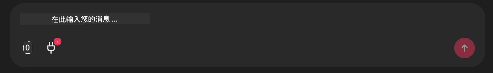

# Github MCP Server Example

## 描述

这是为 Microsoft Reactor 主办的 AI Agents Hackathon 创建的演示。

此工具用于根据用户的 Github 仓库推荐黑客松项目。
实现方式如下：

1. **Github Agent** - 使用 Github MCP Server 检索仓库及其信息。
2. **Hackathon Agent** - 使用来自 Github Agent 的数据，基于项目、用户使用的语言以及 AI Agents 黑客松的项目赛道提出有创意的黑客松项目想法。
3. **Events Agent** - 基于 Hackathon Agent 的建议，Events Agent 将推荐 AI Agent Hackathon 系列中相关的活动。
## 运行代码 

### 环境变量

此演示使用 Microsoft Agent Framework、Azure OpenAI Service、Github MCP Server 和 Azure AI Search。

请确保已设置正确的环境变量以使用这些工具：

```python
AZURE_AI_PROJECT_ENDPOINT=""
AZURE_AI_MODEL_DEPLOYMENT_NAME=""
AZURE_SEARCH_SERVICE_ENDPOINT=""
AZURE_SEARCH_API_KEY=""
``` 

## 运行 Chainlit 服务器

为了连接到 MCP 服务器，此演示使用 Chainlit 作为聊天界面。 

要运行服务器，请在终端中使用以下命令：

```bash
chainlit run app.py -w
```

这将会在 `localhost:8000` 启动你的 Chainlit 服务器，并使用 `event-descriptions.md` 的内容填充你的 Azure AI Search 索引。 

## 连接到 MCP 服务器

要连接到 Github MCP Server，请在 "Type your message here.." 聊天框下面选择 "plug" 图标：



在这里你可以点击 "Connect an MCP" 来添加连接到 Github MCP Server 的命令：

```bash
npx -y @modelcontextprotocol/server-github --env GITHUB_PERSONAL_ACCESS_TOKEN=[YOUR PERSONAL ACCESS TOKEN]
```

将 "[YOUR PERSONAL ACCESS TOKEN]" 替换为你的实际 Personal Access Token。 

连接后，你应该在 plug 图标旁看到一个 (1) 来确认已连接。如果没有，尝试使用 `chainlit run app.py -w` 重启 chainlit 服务器。

## 使用演示 

要启动推荐黑客松项目的代理工作流，你可以输入类似的消息： 

"Recommend hackathon projects for the Github user koreyspace"

Router Agent 将分析你的请求并确定哪种代理组合（GitHub、Hackathon 和 Events）最适合处理你的查询。各代理协同工作，基于 GitHub 仓库分析、项目创意构思和相关技术活动提供全面的推荐。

---

<!-- CO-OP TRANSLATOR DISCLAIMER START -->
免责声明：
本文件使用 AI 翻译服务 Co-op Translator (https://github.com/Azure/co-op-translator) 进行翻译。尽管我们力求准确，但请注意自动翻译可能包含错误或不准确之处。原始语言的文档应被视为权威来源。对于关键信息，建议采用专业人工翻译。因使用本翻译而产生的任何误解或错误解释，我们不承担任何责任。
<!-- CO-OP TRANSLATOR DISCLAIMER END -->