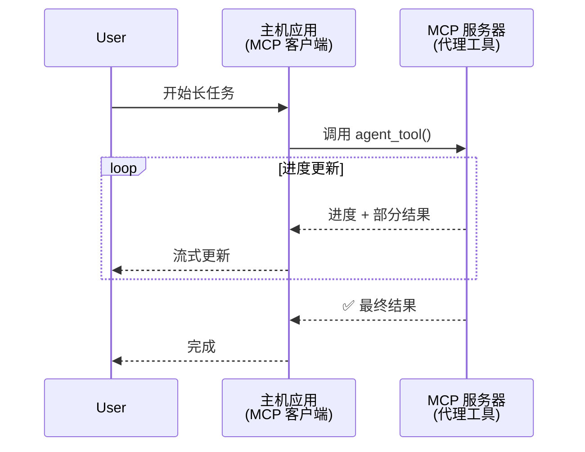
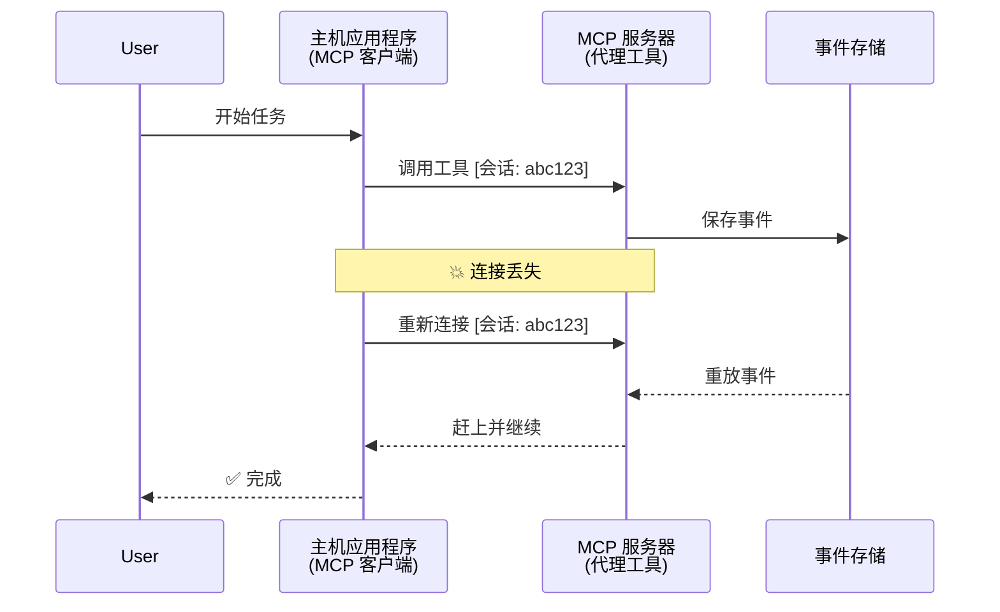
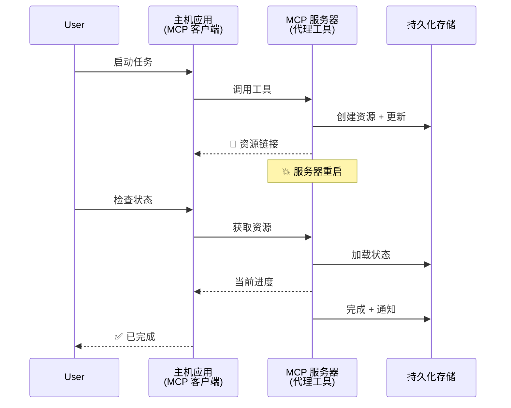
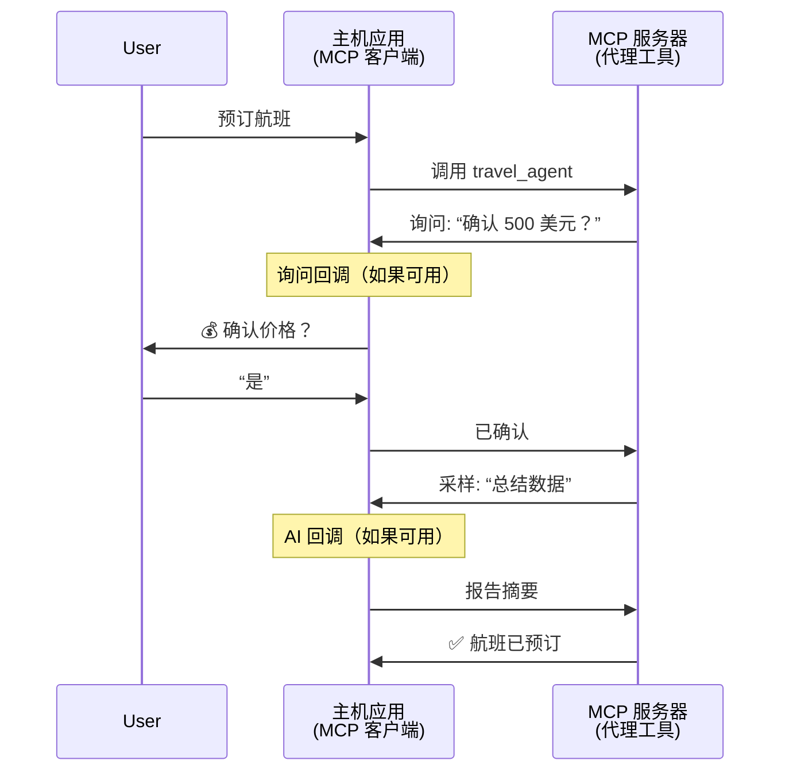
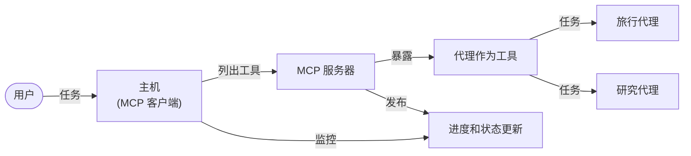

# 使用 MCP 构建代理到代理通信系统

> 摘要 - 能否基于 MCP 构建 Agent2Agent 通信？答案是可以！

MCP 已经远远超出了其“为大型语言模型（LLM）提供上下文”的最初目标。通过最近的增强功能，包括[可恢复流](https://modelcontextprotocol.io/docs/concepts/transports#resumability-and-redelivery)、[引导](https://modelcontextprotocol.io/specification/2025-06-18/client/elicitation)、[采样](https://modelcontextprotocol.io/specification/2025-06-18/client/sampling)和通知（[进度](https://modelcontextprotocol.io/specification/2025-06-18/basic/utilities/progress)和[资源](https://modelcontextprotocol.io/specification/2025-06-18/schema#resourceupdatednotification)），MCP 现已为构建复杂的代理与代理通信系统提供了坚实的基础。

## 代理/工具的误区

随着更多开发者探索具备代理行为的工具（可长时间运行，执行中可能需要额外输入等），一个常见的误区是认为 MCP 不适合，因为早期的工具示例主要聚焦于简单的请求-响应模式。

这种看法已经过时。MCP 规范在过去几个月有了重大增强，具备了弥补长期运行代理行为差距的能力：

- <strong>流式传输与部分结果</strong>：执行期间实时进度更新
- <strong>可恢复性</strong>：客户端断开后可重新连接并继续
- <strong>持久性</strong>：结果能在服务器重启后保留（例如通过资源链接）
- <strong>多轮交互</strong>：通过引导和采样实现执行中交互输入

这些功能可组合使用，支持基于 MCP 协议的复杂代理和多代理应用部署。

为了方便，我们将一个代理称作可在 MCP 服务器上提供的“工具”。这意味着存在一个实现 MCP 客户端的主机应用，它与 MCP 服务器建立会话，并能调用该代理。

## 什么让 MCP 工具“具备代理性”？

在深入实现之前，我们先确定支持长期运行代理所需的基础设施能力。

> 我们定义代理为能够自主长时间运行、处理可能需要多次交互或根据实时反馈调整的复杂任务的实体。

### 1. 流式传输与部分结果

传统的请求-响应模式不适用于长期任务。代理需要提供：

- 实时进度更新
- 中间结果

**MCP 支持**：资源更新通知支持部分结果流式传输，但需要谨慎设计以避免与 JSON-RPC 的一对一请求/响应模型冲突。

| 功能                       | 使用场景                                                                                                                                      | MCP 支持                                                                                   |
| -------------------------- | --------------------------------------------------------------------------------------------------------------------------------------------- | ----------------------------------------------------------------------------------------- |
| 实时进度更新               | 用户请求代码库迁移任务。代理流式传输进度：“10% - 依赖分析中... 25% - 转换 TypeScript 文件... 50% - 更新导入...”                             | ✅ 进度通知                                                                               |
| 部分结果                   | “生成一本书”任务流式返回部分结果，如 1) 故事大纲，2) 章节列表，3) 每章完成内容。主机可在任意阶段检查、取消或重定向。                      | ✅ 通知可以“扩展”以包含部分结果，见 PR 383、776 的提案                                      |

<div align="center" style="font-style: italic; font-size: 0.95em; margin-bottom: 0.5em;">
<strong>图 1：</strong> 该图展示了 MCP 代理在长期任务中如何向主机应用流式传输实时进度更新和部分结果，使用户能够实时监控执行状态。
</div>



### 2. 可恢复性

代理必须优雅地处理网络中断：

- 在（客户端）断开后重新连接
- 从中断点继续（消息重传）

**MCP 支持**：当前 MCP StreamableHTTP 传输支持基于会话 ID 和最后事件 ID 的会话恢复和消息重传。重要的是服务器必须实现一个事件存储（EventStore），支持客户端重新连接时的事件重放。
社区提案（PR #975）正在探索传输无关的可恢复流。

| 功能          | 使用场景                                                                                                                                    | MCP 支持                                                                      |
| ------------ | ------------------------------------------------------------------------------------------------------------------------------------------- | ---------------------------------------------------------------------------- |
| 可恢复性     | 客户端在长期任务中断开连接。重新连接后，恢复会话并重放遗漏事件，无缝继续任务。                                                          | ✅ StreamableHTTP 传输支持会话 ID、事件重放和事件存储                         |

<div align="center" style="font-style: italic; font-size: 0.95em; margin-bottom: 0.5em;">
<strong>图 2：</strong> 该图展示 MCP 的 StreamableHTTP 传输和事件存储如何支持无缝会话恢复：如果客户端断开连接，可重新连接并重放遗漏事件，任务无进度丢失地继续执行。
</div>



### 3. 持久性

长期运行代理需要持久状态：

- 结果在服务器重启后依旧存在
- 状态可离线获取
- 跨会话进度跟踪

**MCP 支持**：MCP 现在支持工具调用的资源链接返回类型。常见模式是设计一个工具创建资源并立即返回资源链接。工具可以在后台继续处理任务并更新资源。客户端可选择轮询该资源获取部分或完整结果（取决于服务器提供的资源更新），或者订阅资源接收更新通知。

这里的一个限制是轮询资源或订阅更新可能消耗大量资源，尤其在大规模时。社区有开放提案（包括 #992），探讨包含服务器调用 webhook 或触发器通知客户端/主机应用更新的可能性。

| 功能      | 使用场景                                                                                                                                      | MCP 支持                                                        |
| ---------- | -------------------------------------------------------------------------------------------------------------------------------------------- | --------------------------------------------------------------- |
| 持久性    | 服务器在数据迁移任务中崩溃。结果和进度在重启后仍然存活，客户端可检查状态并从持久资源继续完成任务。                                           | ✅ 具持久存储和状态通知的资源链接                               |

现在常见的模式是设计工具创建资源并立即返回链接。工具在后台处理任务，发出资源通知作为进度更新或包含部分结果，并按需更新资源内容。

<div align="center" style="font-style: italic; font-size: 0.95em; margin-bottom: 0.5em;">
<strong>图 3：</strong> 该图展示 MCP 代理如何利用持久资源和状态通知，确保长期任务在服务器重启后依然存活，使客户端可检查进展并获取结果。
</div>



### 4. 多轮交互

代理经常需要在执行中获取额外输入：

- 人类澄清或审批
- AI 辅助复杂决策
- 动态参数调整

**MCP 支持**：通过采样（针对 AI 输入）和引导（针对人类输入）完全支持。

| 功能                | 使用场景                                                                                                                                        | MCP 支持                                                |
| ------------------- | ----------------------------------------------------------------------------------------------------------------------------------------------- | ------------------------------------------------------ |
| 多轮交互            | 旅游代理请求用户确认价格，然后请求 AI 汇总旅行数据，最后完成预订操作。                                                                        | ✅ 针对人类输入的引导，针对 AI 输入的采样              |

<div align="center" style="font-style: italic; font-size: 0.95em; margin-bottom: 0.5em;">
<strong>图 4：</strong> 该图展示 MCP 代理如何在执行中互动式引导人类输入或请求 AI 协助，支持确认和动态决策等复杂多轮流程。
</div>



## 在 MCP 上实现长期运行代理 - 代码概览

本文提供了一个[代码仓库](https://github.com/victordibia/ai-tutorials/tree/main/MCP%20Agents)，完整实现了使用 MCP Python SDK 和 StreamableHTTP 传输的长期运行代理，支持会话恢复和消息重传。该实现演示了如何组合 MCP 功能以实现复杂的代理行为。

具体而言，我们实现了一个服务器，包含两个主要代理工具：

- <strong>旅游代理</strong> - 模拟旅游预订服务，通过引导进行价格确认
- <strong>研究代理</strong> - 执行研究任务，通过采样实现 AI 辅助摘要

两个代理均展示了实时进度更新、交互确认和完整会话恢复能力。

### 关键实现概念

下文展示了针对每种能力的服务器端代理实现和客户端主机处理：

#### 流式传输与进度更新 - 任务状态实时反馈

流式传输使代理能在长期任务中提供实时进度更新，保持用户对任务状态和中间结果的知晓。

**服务器实现（代理发送进度通知）：**

```python
# 来自 server/server.py - 旅行代理发送进度更新
for i, step in enumerate(steps):
    await ctx.session.send_progress_notification(
        progress_token=ctx.request_id,
        progress=i * 25,
        total=100,
        message=step,
        related_request_id=str(ctx.request_id)
    )
    await anyio.sleep(2)  # 模拟工作

# 替代方案：记录消息以获得详细的逐步更新
await ctx.session.send_log_message(
    level="info",
    data=f"Processing step {current_step}/{steps} ({progress_percent}%)",
    logger="long_running_agent",
    related_request_id=ctx.request_id,
)
```

**客户端实现（主机接收进度更新）：**

```python
# 来自 client/client.py - 处理实时通知的客户端
async def message_handler(message) -> None:
    if isinstance(message, types.ServerNotification):
        if isinstance(message.root, types.LoggingMessageNotification):
            console.print(f"📡 [dim]{message.root.params.data}[/dim]")
        elif isinstance(message.root, types.ProgressNotification):
            progress = message.root.params
            console.print(f"🔄 [yellow]{progress.message} ({progress.progress}/{progress.total})[/yellow]")

# 创建会话时注册消息处理器
async with ClientSession(
    read_stream, write_stream,
    message_handler=message_handler
) as session:
```

#### 引导 - 请求用户输入

引导使代理能在执行中请求用户输入。此功能关键于长期任务中的确认、澄清或审批。

**服务器实现（代理请求确认）：**

```python
# 来自 server/server.py - 旅行代理请求价格确认
elicit_result = await ctx.session.elicit(
    message=f"Please confirm the estimated price of $1200 for your trip to {destination}",
    requestedSchema=PriceConfirmationSchema.model_json_schema(),
    related_request_id=ctx.request_id,
)

if elicit_result and elicit_result.action == "accept":
    # 继续预订
    logger.info(f"User confirmed price: {elicit_result.content}")
elif elicit_result and elicit_result.action == "decline":
    # 取消预订
    booking_cancelled = True
```

**客户端实现（主机提供引导回调）：**

```python
# 从 client/client.py - 客户端处理信息采集请求
async def elicitation_callback(context, params):
    console.print(f"💬 Server is asking for confirmation:")
    console.print(f"   {params.message}")

    response = console.input("Do you accept? (y/n): ").strip().lower()

    if response in ['y', 'yes']:
        return types.ElicitResult(
            action="accept",
            content={"confirm": True, "notes": "Confirmed by user"}
        )
    else:
        return types.ElicitResult(
            action="decline",
            content={"confirm": False, "notes": "Declined by user"}
        )

# 创建会话时注册回调
async with ClientSession(
    read_stream, write_stream,
    elicitation_callback=elicitation_callback
) as session:
```

#### 采样 - 请求 AI 协助

采样使代理能在执行中请求大型语言模型协助进行复杂决策或内容生成，支持人机混合工作流。

**服务器实现（代理请求 AI 协助）：**

```python
# 来自 server/server.py - 研究代理请求 AI 摘要
sampling_result = await ctx.session.create_message(
    messages=[
        SamplingMessage(
            role="user",
            content=TextContent(type="text", text=f"Please summarize the key findings for research on: {topic}")
        )
    ],
    max_tokens=100,
    related_request_id=ctx.request_id,
)

if sampling_result and sampling_result.content:
    if sampling_result.content.type == "text":
        sampling_summary = sampling_result.content.text
        logger.info(f"Received sampling summary: {sampling_summary}")
```

**客户端实现（主机提供采样回调）：**

```python
# 来自 client/client.py - 客户端处理采样请求
async def sampling_callback(context, params):
    message_text = params.messages[0].content.text if params.messages else 'No message'
    console.print(f"🧠 Server requested sampling: {message_text}")

    # 在实际应用中，这可以调用 LLM API
    # 出于演示目的，我们提供一个模拟响应
    mock_response = "Based on current research, MCP has evolved significantly..."

    return types.CreateMessageResult(
        role="assistant",
        content=types.TextContent(type="text", text=mock_response),
        model="interactive-client",
        stopReason="endTurn"
    )

# 创建会话时注册回调
async with ClientSession(
    read_stream, write_stream,
    sampling_callback=sampling_callback,
    elicitation_callback=elicitation_callback
) as session:
```

#### 可恢复性 - 跨断线的会话连续性

可恢复性确保长期任务能在客户端断线后继续执行，借助事件存储和恢复令牌实现。

**事件存储实现（服务器持有会话状态）：**

```python
# 来自 server/event_store.py - 简单的内存事件存储
class SimpleEventStore(EventStore):
    def __init__(self):
        self._events: list[tuple[StreamId, EventId, JSONRPCMessage]] = []
        self._event_id_counter = 0

    async def store_event(self, stream_id: StreamId, message: JSONRPCMessage) -> EventId:
        """Store an event and return its ID."""
        self._event_id_counter += 1
        event_id = str(self._event_id_counter)
        self._events.append((stream_id, event_id, message))
        return event_id

    async def replay_events_after(self, last_event_id: EventId, send_callback: EventCallback) -> StreamId | None:
        """Replay events after the specified ID for resumption."""
        start_index = None
        stream_id = None
        for index, (event_stream_id, event_id, _) in enumerate(self._events):
            if event_id == last_event_id:
                start_index = index + 1
                stream_id = event_stream_id
                break

        if start_index is None:
            return None

        # 只重放会话原始流中的后续事件。
        for event_stream_id, event_id, message in self._events[start_index:]:
            if event_stream_id != stream_id:
                continue
            await send_callback(EventMessage(message, event_id))

        return stream_id

# 来自 server/server.py - 将事件存储传递给会话管理器
def create_server_app(event_store: Optional[EventStore] = None) -> Starlette:
    server = ResumableServer()

    # 使用事件存储创建用于恢复的会话管理器
    session_manager = StreamableHTTPSessionManager(
        app=server,
        event_store=event_store,  # 事件存储支持会话恢复
        json_response=False,
        security_settings=security_settings,
    )

    return Starlette(routes=[Mount("/mcp", app=session_manager.handle_request)])

# 用法：用事件存储初始化
event_store = SimpleEventStore()
app = create_server_app(event_store)
```

**客户端元数据与恢复令牌（客户端使用存储状态重新连接）：**

```python
# 来自 client/client.py - 带元数据的客户端恢复
if existing_tokens and existing_tokens.get("resumption_token"):
    # 使用现有的恢复令牌继续之前的进度
    metadata = ClientMessageMetadata(
        resumption_token=existing_tokens["resumption_token"],
    )
else:
    # 创建回调以在收到时保存恢复令牌
    def enhanced_callback(token: str):
        protocol_version = getattr(session, 'protocol_version', None)
        token_manager.save_tokens(session_id, token, protocol_version, command, args)

    metadata = ClientMessageMetadata(
        on_resumption_token_update=enhanced_callback,
    )

# 发送带有恢复元数据的请求
result = await session.send_request(
    types.ClientRequest(
        types.CallToolRequest(
            method="tools/call",
            params=types.CallToolRequestParams(name=command, arguments=args)
        )
    ),
    types.CallToolResult,
    metadata=metadata,
)
```

主机应用本地维护会话 ID 和恢复令牌，使其能连接到现有会话而无进度或状态丢失。

### 代码组织

<div align="center" style="font-style: italic; font-size: 0.95em; margin-bottom: 0.5em;">
<strong>图 5：</strong> 基于 MCP 的代理系统架构
</div>



**关键文件：**

- **`server/server.py`** - 支持会话恢复的 MCP 服务器，实现旅游和研究代理，演示引导、采样及进度更新
- **`client/client.py`** - 交互式主机应用，支持会话恢复、回调处理和令牌管理
- **`server/event_store.py`** - 事件存储实现，支持会话恢复和消息重传

## 拓展到基于 MCP 的多代理通信

以上实现可以通过提升主机应用的智能化和范围来扩展为多代理系统：

- <strong>智能任务分解</strong>：主机分析复杂用户请求，将其拆解为不同专长代理的子任务
- <strong>多服务器协调</strong>：主机维护与多个 MCP 服务器的连接，每个服务器暴露不同代理能力
- <strong>任务状态管理</strong>：主机跟踪多个并发代理任务进度，管理依赖和执行顺序
- <strong>弹性与重试</strong>：主机管理失败情况，执行重试逻辑，代理不可用时重新路由任务
- <strong>结果合成</strong>：主机汇总多个代理的输出，生成协调一致的最终结果

主机从简单客户端演变为智能编排者，协调分布式代理能力，同时保持 MCP 协议基础。

## 总结

MCP 的增强功能——资源通知、引导/采样、可恢复流和持久资源——使复杂的代理间交互成为可能，同时保持了协议的简洁性。

## 入门指南

准备构建自己的 agent2agent 系统了吗？请按以下步骤操作：

### 1. 运行演示

```bash
# 启动带有事件存储以便恢复的服务器
python -m server.server --port 8006

# 在另一个终端中运行交互式客户端
python -m client.client --url http://127.0.0.1:8006/mcp
```

**交互模式下可用命令：**

- `travel_agent` - 通过引导确认价格预订旅游
- `research_agent` - 通过采样调用 AI 生成研究主题摘要
- `list` - 显示所有可用工具
- `clean-tokens` - 清除恢复令牌
- `help` - 显示详细命令帮助
- `quit` - 退出客户端

### 2. 测试恢复功能

- 启动一个长期代理（例如 `travel_agent`）
- 执行中中断客户端（Ctrl+C）
- 重启客户端，它将自动从断点恢复继续

### 3. 探索与扩展

- <strong>探索示例</strong>：查看该 [mcp-agents](https://github.com/victordibia/ai-tutorials/tree/main/MCP%20Agents)
- <strong>加入社区</strong>：参与 GitHub 上的 MCP 讨论
- <strong>实验</strong>：从简单长期任务起步，逐步添加流式、可恢复性和多代理协调功能

这展示了 MCP 如何在保持工具简洁的同时实现智能代理行为。

总体而言，MCP 协议规范正在快速发展；建议读者访问官方文档网站以获取最新信息 - https://modelcontextprotocol.io/introduction

---

<!-- CO-OP TRANSLATOR DISCLAIMER START -->
**免责声明**：
本文件由 AI 翻译服务 [Co-op Translator](https://github.com/Azure/co-op-translator) 翻译完成。尽管我们力求准确，但请注意，自动翻译可能包含错误或不准确之处。原始语言版文件应视为权威来源。对于重要信息，建议使用专业人工翻译。我们对因使用本翻译而产生的任何误解或误释不承担责任。
<!-- CO-OP TRANSLATOR DISCLAIMER END -->