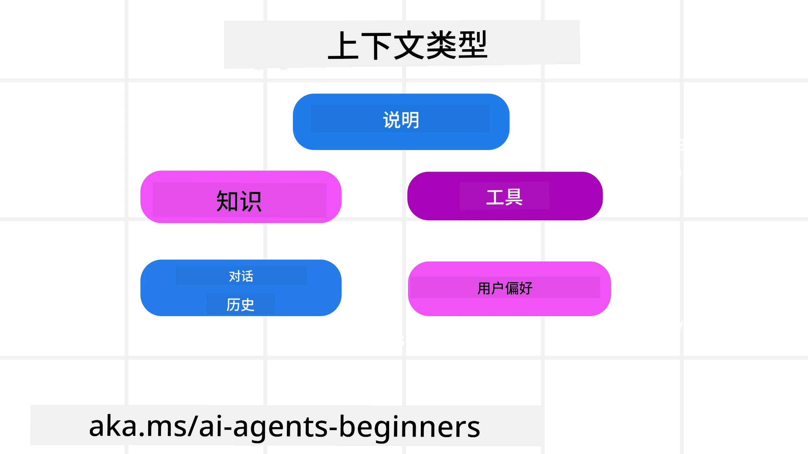
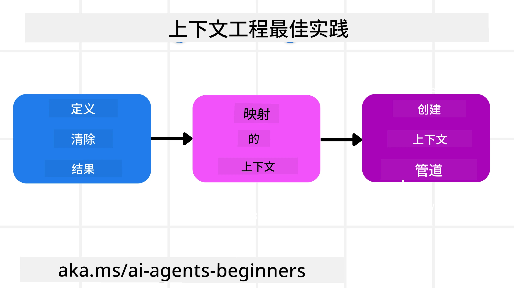

# AI 代理的上下文工程

> _(点击上方图片观看本课视频)_

理解你正在为其构建 AI 代理的应用的复杂性，对于打造可靠的代理非常重要。我们需要构建能够有效管理信息的 AI 代理，以满足超越提示工程的复杂需求。

在本课中，我们将了解什么是上下文工程及其在构建 AI 代理中的作用。

## 介绍

本课将涵盖：

• <strong>什么是上下文工程</strong> 以及它与提示工程的不同之处。

• <strong>有效上下文工程的策略</strong>，包括如何编写、选择、压缩和隔离信息。

• <strong>常见的上下文失败</strong>，可能会破坏你的 AI 代理，以及如何修复。

## 学习目标

完成本课后，你将能够理解：

• <strong>定义上下文工程</strong> 并区分其与提示工程的区别。

• **识别大语言模型（LLM）应用中上下文的关键组成部分**。

• **应用编写、选择、压缩和隔离上下文的策略** 以提升代理性能。

• <strong>识别常见的上下文失败</strong>，如污染、干扰、混淆和冲突，并实施缓解技术。

## 什么是上下文工程？

对于 AI 代理而言，上下文是驱动 AI 代理规划采取某些行动的依据。上下文工程是确保 AI 代理拥有完成下一步任务所需正确信息的实践。上下文窗口大小有限，因此作为代理构建者，我们需要构建系统和流程来管理在上下文窗口中添加、移除和压缩信息。

### 提示工程 vs 上下文工程

提示工程专注于一组静态指令，以有效指导 AI 代理遵循一套规则。上下文工程则是如何管理包括初始提示在内的动态信息集，以确保 AI 代理随着时间推移拥有所需的信息。上下文工程的核心理念是使这一过程可重复且可靠。

### 上下文类型

重要的是要记住，上下文不仅仅是一件事。AI 代理所需的信息可能来自各种不同来源，我们需要确保代理能够访问这些来源：

AI 代理可能需要管理的上下文类型包括：

• **指令：** 类似于代理的“规则”——提示语、系统消息、少量示例（展示给 AI 如何做某事），以及它可以使用的工具描述。这是提示工程与上下文工程相结合的焦点。

• **知识：** 涵盖事实、从数据库检索的信息或代理积累的长期记忆。如果代理需要访问不同的知识库和数据库，这包括集成检索增强生成（RAG）系统。

• **工具：** 代理可以调用的外部函数、API 和 MCP 服务器的定义，以及使用它们后获得的反馈（结果）。

• **对话历史：** 与用户的持续对话。随着时间推移，这些对话变得越来越长和复杂，占用了上下文窗口的空间。

• **用户偏好：** 关于用户喜好随时间收集的信息。这些信息可以存储并在做出关键决策时调用以帮助用户。

## 有效上下文工程的策略

### 规划策略

良好的上下文工程始于良好的规划。以下方法将帮助你开始思考如何应用上下文工程的概念：

1. <strong>明确结果</strong> - AI 代理被指派的任务结果应清晰定义。回答“AI 代理完成任务后，世界将会是什么样子？”换句话说，用户与 AI 代理交互后应获得什么样的改变、信息或回应。
2. <strong>映射上下文</strong> - 确定 AI 代理的结果后，需回答“完成此任务，AI 代理需要什么信息？”从而开始映射这些信息的位置。
3. <strong>创建上下文管道</strong> - 确定信息位置后，需要回答“代理将如何获取这些信息？”这可以通过多种方式实现，包括 RAG、使用 MCP 服务器及其他工具。

### 实践策略

规划很重要，但一旦信息开始流入代理的上下文窗口，我们需要实用策略来管理它：

#### 管理上下文

虽然一些信息会自动添加到上下文窗口，但上下文工程是积极管理这些信息，可以采用以下策略：

 1. <strong>代理草稿板</strong>  
 允许 AI 代理在单次会话期间记录有关当前任务和用户交互的相关信息笔记。草稿板应存在于上下文窗口之外的文件或运行时对象中，代理在本会话中可根据需要检索。

 2. <strong>记忆</strong>  
 草稿板适合管理单次会话上下文窗口外的信息。记忆让代理能够跨多次会话存储和检索相关信息。这可能包括摘要、用户偏好和未来改进的反馈。

 3. <strong>压缩上下文</strong>  
 当上下文窗口增长接近限制时，可采用总结和裁剪等技术，包括仅保留最相关信息或移除较旧消息。
  
 4. <strong>多代理系统</strong>  
 开发多代理系统也是一种上下文工程形式，因为每个代理拥有自己的上下文窗口。如何共享和传递上下文给不同代理，是构建这类系统时另一个需要规划的问题。
  
 5. <strong>沙箱环境</strong>  
 如果代理需要运行代码或处理文档中的大量信息，这可能会消耗大量的 tokens 来处理结果。代理可以使用沙箱环境运行代码，仅读取结果和其他相关信息，而不是将所有内容存储在上下文窗口中。
  
 6. <strong>运行时状态对象</strong>  
 通过创建信息容器来管理代理需要访问特定信息的情况。对于复杂任务，这使代理能够逐步存储各子任务结果，使上下文仅连接到特定子任务。

#### 检查上下文

应用这些策略后，值得检查下一次模型调用实际接收到的内容。一个有用的调试问题是：

> 代理加载了过多上下文、错误上下文，还是遗漏了所需上下文？

你不需要记录原始提示、工具输出或记忆内容来回答这个问题。在生产中，建议使用捕获计数、ID、哈希和策略标签的小型上下文检查记录：

- **选择：** 跟踪考虑了多少候选块、工具或记忆，选中了多少，哪些规则或分数导致其余被过滤。
- **压缩：** 记录来源范围或追踪 ID、摘要 ID、压缩前后估计的 token 数，以及原始内容是否被排除在下一次调用之外。
- **隔离：** 备注哪个子任务在单独代理、会话或沙箱中运行，返回了什么边界摘要，大量工具输出是否保留在父代理上下文之外。
- **记忆与 RAG：** 存储检索文档 ID、记忆 ID、得分、选中 ID 及编辑状态，而非完整检索文本。
- **安全与隐私：** 优先使用哈希、ID、令牌桶和策略标签而非敏感提示文本、工具参数、工具结果或用户记忆体。

目标不是保留更多上下文，而是留下足够的证据，让开发者能判断上下文策略是否执行，以及是否按预期改变了下一次模型调用。

### 上下文工程示例

假设我们想让 AI 代理 **“帮我预订去巴黎的旅行。”**

• 仅使用提示工程的简单代理可能只会回应：**“好的，你想什么时候去巴黎？”** 它仅处理用户当时的直接问题。

• 采用前述上下文工程策略的代理会做得更多。在回应之前，它的系统可能：

  ◦ <strong>检查你的日历</strong> 以获取可用日期（检索实时数据）。

 ◦ <strong>回忆过去的旅行偏好</strong>（来自长期记忆），如你的首选航空公司、预算或是否偏好直飞航班。

 ◦ <strong>识别可用的航班和酒店预订工具</strong>。

- 然后，可能的回应是：“嗨，[你的名字]！我看到你十月的第一周有空。要帮你在[首选航空公司]找符合你预算[预算]的直飞巴黎航班吗？”这个更丰富、了解上下文的回复展示了上下文工程的强大功能。

## 常见的上下文失败

### 上下文污染

**含义：** 当幻觉（LLM 生成的虚假信息）或错误进入上下文并被反复引用，导致代理追求不可能的目标或制定荒谬策略。

**应对：** 实施 <strong>上下文验证</strong> 和 <strong>隔离</strong>。在信息添加到长期记忆前进行验证。如发现潜在污染，启动新的上下文线程防止错误信息扩散。

**旅游预订示例：** 代理误认为存在一条从小地方机场到遥远国际城市的<strong>直飞航班</strong>，实际上该机场不提供国际航班。这条不存在的航班信息被保存到上下文。之后，你请求代理预订时，它不断尝试寻找这条不可能的航线，导致重复错误。

**解决方案：** 在将航班详情加入代理工作上下文前，先用实时 API <strong>验证航班是否存在及其航线</strong>。验证失败时，将错误信息“隔离”，不再使用。

### 上下文干扰

**含义：** 当上下文变得过大，模型过度关注积累的历史，而非训练时学到的内容，导致行为重复或无帮助。甚至在上下文窗口未满时，模型可能开始出错。

**应对：** 使用 <strong>上下文总结</strong>。定期将积累的信息压缩成更短的摘要，保留重要细节，去除冗余历史，帮助“重置”焦点。

**旅游预订示例：** 你与代理长时间讨论各种梦想旅行目的地，包括两年前的背包旅行细节。当你最终请求 **“帮我找下个月的便宜机票”** 时，代理陷入旧且无关的细节，不断询问你的背包装备或过往行程，忽视当前请求。

**解决方案：** 经过一定交互轮数或上下文过大时，代理应<strong>总结最近且相关的对话部分</strong>——聚焦当前出行日期和目的地——并用浓缩摘要做下一次 LLM 调用，丢弃不相关的历史聊天。

### 上下文混淆

**含义：** 因上下文中不必要的信息，通常是太多可用工具，模型生成错误响应或调用无关工具。较小模型尤为易受影响。

**应对：** 使用 RAG 技术实施 <strong>工具管理</strong>。将工具描述存储在向量数据库中，并仅为特定任务选择最相关的工具。研究显示限制工具选择不超过 30 个效果更佳。

**旅游预订示例：** 代理可访问数十个工具：`book_flight`、`book_hotel`、`rent_car`、`find_tours`、`currency_converter`、`weather_forecast`、`restaurant_reservations` 等。你问：“在巴黎最好的出行方式是什么？”由于工具数目庞大，代理混淆，尝试调用在巴黎内部使用的 `book_flight` 或 `rent_car`（尽管你偏好公共交通），因为工具描述可能重叠，或者代理无法识别最佳选择。

**解决方案：** 对工具描述使用 **RAG**。当询问巴黎出行时，系统动态检索仅最相关工具如 `rent_car` 或 `public_transport_info`，为 LLM 提供聚焦的工具“负载”。

### 上下文冲突

**含义：** 上下文中存在矛盾信息，导致推理不一致或最终响应糟糕。常发生在信息分阶段到达时，早期错误假设仍保留在上下文中。

**应对：** 采用 <strong>上下文修剪</strong> 和 <strong>卸载</strong>。修剪即在新细节到来时移除过时或冲突信息。卸载则为模型提供单独的“草稿板”工作区，处理信息而不污染主上下文。
**旅行预订示例：** 你最初告诉你的代理，**“我想坐经济舱。”** 在对话的后期，你改变了主意并说，**“实际上，这次旅行我们改坐商务舱吧。”** 如果这两个指令同时保留在上下文中，代理可能会收到矛盾的搜索结果或对优先考虑哪个偏好感到困惑。

**解决方案：** 实施<strong>上下文修剪</strong>。当新的指令与旧的指令矛盾时，旧的指令会被移除或在上下文中被明确覆盖。或者，代理可以使用<strong>草稿本</strong>来调和冲突的偏好后再做决定，确保只有最终一致的指令指导其行动。

## 关于上下文工程还有更多问题？

加入 [Microsoft Foundry Discord](https://aka.ms/ai-agents/discord) 与其他学习者交流，参加答疑时间，并获得你的 AI Agents 相关问题的解答。

---

<!-- CO-OP TRANSLATOR DISCLAIMER START -->
**免责声明**：
本文件由 AI 翻译服务 [Co-op Translator](https://github.com/Azure/co-op-translator) 翻译完成。尽管我们力求准确，但请注意，自动翻译可能包含错误或不准确之处。原始语言版文件应视为权威来源。对于重要信息，建议使用专业人工翻译。我们对因使用本翻译而产生的任何误解或误释不承担责任。
<!-- CO-OP TRANSLATOR DISCLAIMER END -->