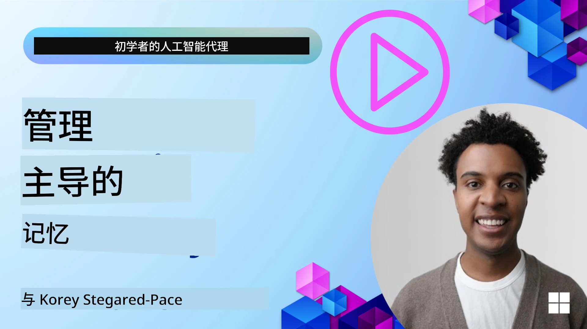

# AI 代理的记忆 

在讨论创建 AI 代理的独特优势时，主要讨论两件事：调用工具来完成任务的能力和随时间改进的能力。记忆是创建能够自我改进并为用户创造更好体验的代理的基础。

在本课中，我们将查看 AI 代理的记忆是什么，以及如何管理和利用它来提升我们的应用程序。

## 介绍

本课将涵盖：

• **理解 AI 代理记忆**：记忆是什么以及为什么对代理至关重要。

• **实现与存储记忆**：为你的 AI 代理添加记忆功能的实用方法，重点关注短期和长期记忆。

• **让 AI 代理自我改进**：记忆如何使代理从过去的交互中学习并随时间改进。

## 可用实现

本课包含两个全面的笔记本教程：

• **[13-agent-memory.ipynb](./13-agent-memory.ipynb)**: 使用 Mem0 和 Azure AI Search 以及 Microsoft Agent Framework 实现记忆

• **[13-agent-memory-cognee.ipynb](./13-agent-memory-cognee.ipynb)**: 使用 Cognee 实现结构化记忆，自动构建由嵌入支持的知识图谱，可视化图谱并进行智能检索

## 学习目标

完成本课后，你将了解如何：

• **区分各种类型的 AI 代理记忆**，包括工作记忆、短期记忆和长期记忆，以及像角色记忆和情节记忆这样的专门形式。

• **使用 Microsoft Agent Framework 实现和管理 AI 代理的短期和长期记忆**，利用像 Mem0、Cognee、Whiteboard memory 这样的工具，并与 Azure AI Search 集成。

• **理解自我改进 AI 代理背后的原理**，以及健全的记忆管理系统如何促进持续学习和适应。

## 理解 AI 代理记忆

从本质上讲，**AI 代理的记忆是指允许它们保留和回忆信息的机制**。这些信息可以是关于对话的具体细节、用户偏好、过去的操作，甚至是学到的模式。

没有记忆，AI 应用通常是无状态的，这意味着每次交互都从头开始。这会导致重复且令人沮丧的用户体验，代理会“忘记”之前的上下文或偏好。

### 为什么记忆很重要？

代理的智能与其回忆和利用过去信息的能力密切相关。记忆使代理能够：

• **反思**：从过去的行为和结果中学习。

• **互动**：在持续的对话中保持上下文。

• **前瞻和反应**：基于历史数据预测需求或做出适当响应。

• **自治**：通过调用存储的知识更独立地运行。

实现记忆的目标是让代理更**可靠且更有能力**。

### 记忆类型

#### 工作记忆

把它想象成代理在单个、正在进行的任务或思考过程中使用的一张草稿纸。它保存计算下一步所需的即时信息。

对于 AI 代理，工作记忆通常捕获对话中最相关的信息，即使完整的聊天记录很长或被截断。它侧重于提取关键要素，如需求、提案、决定和动作。

**工作记忆示例**

在一个旅行预订代理中，工作记忆可能捕获用户当前的请求，例如 “我想预订去巴黎的行程”。这个具体需求保存在代理的即时上下文中，以指导当前的交互。

#### 短期记忆

这种记忆在单次对话或会话期间保留信息。它是当前聊天的上下文，使代理能够引用对话中先前的轮次。

**短期记忆示例**

如果用户询问 “去巴黎的机票大概多少钱？” 然后又问 “那里的住宿呢？”，短期记忆确保代理知道 “那里” 在同一对话中指的是 “巴黎”。

#### 长期记忆

这是跨多个对话或会话持续存在的信息。它允许代理记住用户偏好、历史交互或长期的通用知识。对个性化很重要。

**长期记忆示例**

长期记忆可能存储 “Ben 喜欢滑雪和户外活动、喜欢带山景的咖啡、并且因为过去的伤病想避免高级滑雪道”。这些从先前交互中学到的信息会影响未来旅行规划会话中的推荐，使其高度个性化。

#### 角色记忆

这种专门的记忆帮助代理形成一致的“个性”或“角色”。它允许代理记住关于自己或其预定角色的细节，使交互更加流畅和有针对性。

**角色记忆示例**
如果旅行代理被设计成“滑雪规划专家”，角色记忆可能会强化这一角色，影响其回应以符合专家的语气和知识。

#### 工作流/情节记忆

这种记忆存储代理在复杂任务中所采取步骤的序列，包括成功与失败。它就像记住特定的“情节”或过去经历以便从中学习。

**情节记忆示例**

如果代理尝试预订某个航班但因无座而失败，情节记忆可以记录此失败，允许代理在随后的尝试中尝试替代航班或以更有信息的方式告知用户该问题。

#### 实体记忆

这涉及从对话中提取并记住特定实体（如人、地点或事物）和事件。它允许代理构建对所讨论关键要素的结构化理解。

**实体记忆示例**

从关于过去旅行的对话中，代理可能提取 “Paris”、 “Eiffel Tower” 和 “在 Le Chat Noir 餐厅吃晚餐” 作为实体。在未来的交互中，代理可以回忆起 “Le Chat Noir” 并主动提出为其重新预订。

#### 结构化 RAG（检索增强生成）

虽然 RAG 是一种更广泛的技术，但“结构化 RAG”被强调为一种强大的记忆技术。它从各种来源（对话、电子邮件、图像）中提取密集的结构化信息，并用其提高响应的精确性、召回率和速度。与仅依赖语义相似性的经典 RAG 不同，结构化 RAG 利用信息的固有结构。

**结构化 RAG 示例**

结构化 RAG 不仅仅匹配关键词，还可以从电子邮件中解析出航班详细信息（目的地、日期、时间、航空公司）并以结构化方式存储它们。这允许像 “我周二预订了去巴黎的哪趟航班？” 这样的精确查询。

## 实现与存储记忆

为 AI 代理实现记忆涉及系统化的 **记忆管理** 过程，其中包括生成、存储、检索、整合、更新，甚至“忘记”（或删除）信息。检索是一个尤其关键的方面。

### 专门的记忆工具

#### Mem0

一种存储和管理代理记忆的方法是使用像 Mem0 这样的专用工具。Mem0 作为持久记忆层运行，允许代理回忆相关交互、存储用户偏好和事实上下文，并随着时间从成功和失败中学习。其思想是将无状态代理转变为有状态代理。

它通过一个 **两阶段记忆流水线：提取和更新** 来工作。首先，添加到代理线程的消息被发送到 Mem0 服务，服务使用大型语言模型（LLM）来总结对话历史并提取新记忆。随后，LLM 驱动的更新阶段决定是否添加、修改或删除这些记忆，并将它们存储在可以包括向量、图形和键值数据库的混合数据存储中。该系统还支持各种记忆类型，并且可以结合图谱记忆来管理实体之间的关系。

#### Cognee

另一种强大的方法是使用 **Cognee**，一种开源的语义记忆系统，它将结构化和非结构化数据转化为由嵌入支持的可查询知识图谱。Cognee 提供了一个 **双存储架构**，将向量相似性搜索与图关系结合，能够让代理理解不仅是信息的相似性，还包括概念之间的关联方式。

它在 **混合检索** 方面表现出色，融合了向量相似性、图结构和 LLM 推理——从原始片段查找到具备图意识的问答。该系统维护着不断演化和增长的 **活记忆**，同时作为一个连接的图保持可查询，支持短期会话上下文和长期持久记忆。

Cognee 的笔记本教程（[13-agent-memory-cognee.ipynb](./13-agent-memory-cognee.ipynb)）演示了构建这一统一记忆层的过程，提供了摄取多样数据源、可视化知识图谱以及根据特定代理需求定制不同搜索策略的实用示例。

### 使用 RAG 存储记忆

除了像 mem0 这样的专用记忆工具之外，你还可以利用像 **Azure AI Search 作为后端来存储和检索记忆**，特别适用于结构化 RAG。

这允许你用自己的数据为代理的响应提供依据，确保更相关和更准确的答案。Azure AI Search 可用于存储特定用户的旅行记忆、产品目录或任何其他领域特定知识。

Azure AI Search 支持像 **结构化 RAG** 这样的功能，擅长从大型数据集（如对话历史、电子邮件甚至图像）中提取和检索密集的、结构化的信息。与传统的文本切片和嵌入方法相比，这提供了“超出人类的精确性和召回率”。

## 使 AI 代理自我改进

自我改进代理的一个常见模式是引入一个 **“知识代理”**。这个独立的代理观察用户与主代理之间的主要对话。它的角色是：

1. **识别有价值的信息**：确定对话的哪一部分值得作为通用知识或特定用户偏好保存。

2. **提取与摘要**：从对话中提炼出关键学习点或偏好。

3. **存储到知识库中**：持久化这些提取的信息，通常存储在向量数据库中，以便日后检索。

4. **增强未来查询**：当用户发起新查询时，知识代理检索相关的已存信息并将其附加到用户的提示中，为主代理提供关键上下文（类似于 RAG）。

### 记忆的优化

• **延迟管理**：为避免拖慢用户交互，可以初始使用更便宜、更快速的模型来快速检查信息是否值得存储或检索，只有在必要时才调用更复杂的提取/检索流程。

• **知识库维护**：对于不断增长的知识库，可以将不常用的信息移至“冷存储”以控制成本。

## 关于代理记忆还有更多问题吗？

加入 [Microsoft Foundry Discord](https://aka.ms/ai-agents/discord) 与其他学习者见面，参加答疑时段并解答你的 AI 代理相关问题。

---

<!-- CO-OP TRANSLATOR DISCLAIMER START -->
免责声明：
本文件使用 AI 翻译服务 Co-op Translator（https://github.com/Azure/co-op-translator）进行翻译。尽管我们努力保证准确性，但请注意，自动翻译可能包含错误或不准确之处。原始语言的原文应被视为权威来源。对于关键信息，建议采用专业人工翻译。对于因使用本翻译而产生的任何误解或误释，我们不承担责任。
<!-- CO-OP TRANSLATOR DISCLAIMER END -->