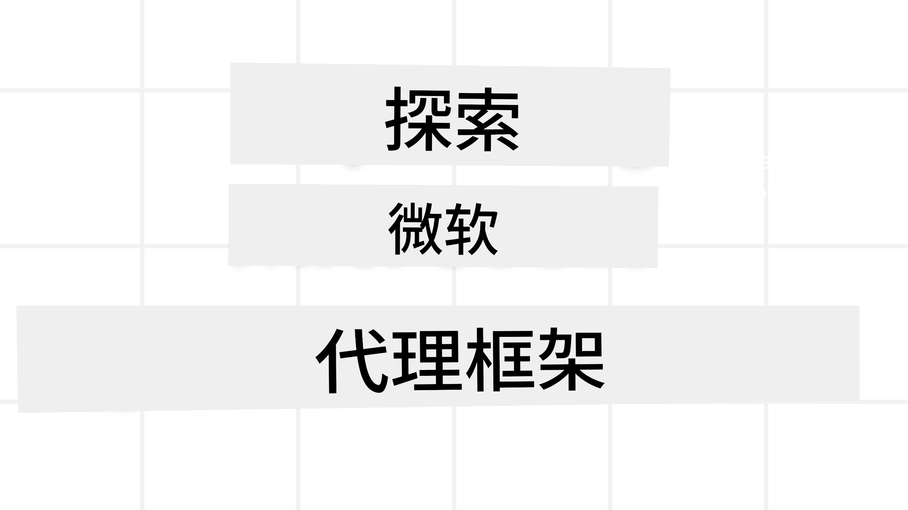

# 探索微软代理框架



### 介绍

本课将涵盖：

- 了解微软代理框架：关键特性和价值  
- 探索微软代理框架的核心概念
- 高级MAF模式：工作流、中间件和内存

## 学习目标

完成本课后，您将能够：

- 使用微软代理框架构建生产就绪的AI代理
- 将微软代理框架的核心功能应用于您的代理用例
- 使用包括工作流、中间件和可观察性在内的高级模式

## 代码示例

[微软代理框架（MAF）](https://aka.ms/ai-agents-beginners/agent-framewrok)的代码示例可以在本仓库的`xx-python-agent-framework`和`xx-dotnet-agent-framework`文件中找到。

## 了解微软代理框架


[微软代理框架（MAF）](https://aka.ms/ai-agents-beginners/agent-framewrok) 是微软构建AI代理的统一框架。它提供灵活性，以应对生产和研究环境中各种代理用例，包括：

- **顺序代理编排**：在需要逐步工作流的场景中使用。
- **并发编排**：在代理需要同时完成任务的场景中使用。
- **群聊编排**：在代理可以协同完成一个任务的场景中使用。
- **交接编排**：在代理完成子任务后，将任务交接给其他代理的场景中使用。
- **磁性编排**：在主管代理创建和修改任务列表，并协调子代理完成任务的场景中使用。

为了交付生产级AI代理，MAF还包括以下功能：

- **可观察性**：通过OpenTelemetry实现，跟踪AI代理的每个操作，包括工具调用、编排步骤、推理流程，以及通过Microsoft Foundry仪表板进行性能监控。
- **安全性**：通过在Microsoft Foundry上原生托管代理，包括基于角色的访问控制、私有数据处理和内置内容安全等安全控制。
- **持久性**：支持代理线程和工作流的暂停、恢复和错误恢复，支持更长时间运行的流程。
- **控制**：支持人机交互的工作流，任务可以标记为需要人工审批。

微软代理框架还着重于互操作性：

- **云无关性**——代理可以在容器、本地及多个不同云环境中运行。
- **提供者无关性**——可以通过您喜欢的SDK创建代理，包括Azure OpenAI和OpenAI。
- **集成开放标准**——代理可以利用代理间协议（Agent-to-Agent，A2A）和模型上下文协议（Model Context Protocol，MCP）来发现和使用其他代理及工具。
- **插件和连接器**——可连接数据和内存服务，如Microsoft Fabric、SharePoint、Pinecone和Qdrant。

下面我们看看这些功能如何应用于微软代理框架的一些核心概念。

## 微软代理框架的核心概念

### 代理


**创建代理**

代理的创建是通过定义推理服务（LLM提供者）、AI代理需遵循的一组指令，以及指定一个`name`：

```python
agent = AzureOpenAIChatClient(credential=AzureCliCredential()).create_agent( instructions="You are good at recommending trips to customers based on their preferences.", name="TripRecommender" )
```

上述示例使用的是`Azure OpenAI`，但代理也可以通过多种服务创建，包括`Microsoft Foundry Agent Service`：

```python
AzureAIAgentClient(async_credential=credential).create_agent( name="HelperAgent", instructions="You are a helpful assistant." ) as agent
```

OpenAI 的 `Responses`、`ChatCompletion` API

```python
agent = OpenAIResponsesClient().create_agent( name="WeatherBot", instructions="You are a helpful weather assistant.", )
```

```python
agent = OpenAIChatClient().create_agent( name="HelpfulAssistant", instructions="You are a helpful assistant.", )
```

或使用A2A协议的远端代理：

```python
agent = A2AAgent( name=agent_card.name, description=agent_card.description, agent_card=agent_card, url="https://your-a2a-agent-host" )
```

**运行代理**

代理通过`.run`或`.run_stream`方法运行，分别支持非流式或流式响应。

```python
result = await agent.run("What are good places to visit in Amsterdam?")
print(result.text)
```

```python
async for update in agent.run_stream("What are the good places to visit in Amsterdam?"):
    if update.text:
        print(update.text, end="", flush=True)

```

每次代理运行还可以通过选项自定义参数，如代理使用的`max_tokens`，代理可以调用的`tools`，甚至代理本身使用的`model`。

这对于完成用户任务时需要特定模型或工具的情况非常有用。

**工具**

工具既可以在定义代理时指定：

```python
def get_attractions( location: Annotated[str, Field(description="The location to get the top tourist attractions for")], ) -> str: """Get the top tourist attractions for a given location.""" return f"The top attractions for {location} are." 


# 直接创建 ChatAgent 时

agent = ChatAgent( chat_client=OpenAIChatClient(), instructions="You are a helpful assistant", tools=[get_attractions]

```

也可以在运行代理时指定：

```python

result1 = await agent.run( "What's the best place to visit in Seattle?", tools=[get_attractions] # 此工具仅为此次运行提供 )
```

**代理线程**

代理线程用于处理多轮对话。线程的创建方式有两种：

- 使用`get_new_thread()`，支持线程随着时间保存
- 运行代理时自动创建线程，线程仅在当前运行期间有效

创建线程的代码如下：

```python
# 创建一个新线程。
thread = agent.get_new_thread() # 使用该线程运行代理。
response = await agent.run("Hello, I am here to help you book travel. Where would you like to go?", thread=thread)

```

然后可以序列化线程以备后续保存：

```python
# 创建一个新线程。
thread = agent.get_new_thread() 

# 使用线程运行代理。

response = await agent.run("Hello, how are you?", thread=thread) 

# 将线程序列化以便存储。

serialized_thread = await thread.serialize() 

# 从存储加载后反序列化线程状态。

resumed_thread = await agent.deserialize_thread(serialized_thread)
```

**代理中间件**

代理与工具和LLM交互，以完成用户任务。在某些场景下，我们希望在这些交互之间执行或跟踪操作。代理中间件允许我们实现：

*函数中间件*

该中间件允许在代理与其调用的函数/工具之间执行操作。比如你可能想对函数调用做日志记录。

下面代码中`next`定义了是否调用下一个中间件或实际函数。

```python
async def logging_function_middleware(
    context: FunctionInvocationContext,
    next: Callable[[FunctionInvocationContext], Awaitable[None]],
) -> None:
    """Function middleware that logs function execution."""
    # 预处理：函数执行前记录日志
    print(f"[Function] Calling {context.function.name}")

    # 继续执行下一个中间件或函数
    await next(context)

    # 后处理：函数执行后记录日志
    print(f"[Function] {context.function.name} completed")
```

*聊天中间件*

该中间件允许在代理与LLM请求之间执行或记录操作。

这包含了发送给AI服务的`messages`等重要信息。

```python
async def logging_chat_middleware(
    context: ChatContext,
    next: Callable[[ChatContext], Awaitable[None]],
) -> None:
    """Chat middleware that logs AI interactions."""
    # 预处理：AI调用前记录日志
    print(f"[Chat] Sending {len(context.messages)} messages to AI")

    # 继续执行下一个中间件或AI服务
    await next(context)

    # 后处理：AI响应后记录日志
    print("[Chat] AI response received")

```

**代理内存**

如`Agentic Memory`课中所述，内存是支撑代理跨不同上下文操作的重要元素。MAF提供多种类型的内存：

*内存存储*

这是运行时线程中存储的内存。

```python
# 创建一个新线程。
thread = agent.get_new_thread() # 使用线程运行代理。
response = await agent.run("Hello, I am here to help you book travel. Where would you like to go?", thread=thread)
```

*持久消息*

该内存在不同会话间存储对话历史。通过`chat_message_store_factory`定义：

```python
from agent_framework import ChatMessageStore

# 创建自定义消息存储
def create_message_store():
    return ChatMessageStore()

agent = ChatAgent(
    chat_client=OpenAIChatClient(),
    instructions="You are a Travel assistant.",
    chat_message_store_factory=create_message_store
)

```

*动态内存*

该内存于代理运行前添加到上下文。这类内存可以存储在外部服务中，如mem0：

```python
from agent_framework.mem0 import Mem0Provider

# 使用 Mem0 实现高级内存功能
memory_provider = Mem0Provider(
    api_key="your-mem0-api-key",
    user_id="user_123",
    application_id="my_app"
)

agent = ChatAgent(
    chat_client=OpenAIChatClient(),
    instructions="You are a helpful assistant with memory.",
    context_providers=memory_provider
)

```

**代理可观察性**

可观察性对构建可靠且易维护的代理系统至关重要。MAF集成了OpenTelemetry，提供追踪和度量以提升可观察性。

```python
from agent_framework.observability import get_tracer, get_meter

tracer = get_tracer()
meter = get_meter()
with tracer.start_as_current_span("my_custom_span"):
    # 做某事
    pass
counter = meter.create_counter("my_custom_counter")
counter.add(1, {"key": "value"})
```

### 工作流

MAF提供工作流，定义了完成任务的预设步骤，并将AI代理作为步骤组成部分。

工作流由不同组件组成，以便更好地控制流程。工作流还支持**多代理编排**和**检查点**以保存工作流状态。

工作流的核心组件包括：

**执行器**

执行器接收输入消息，执行指定任务，然后产生输出消息。这推动工作流向完成更大任务前进。执行器可以是AI代理或自定义逻辑。

**边**

边用于定义工作流中消息的流向。包括：

*直接边*——执行器之间简单一对一连接：

```python
from agent_framework import WorkflowBuilder

builder = WorkflowBuilder()
builder.add_edge(source_executor, target_executor)
builder.set_start_executor(source_executor)
workflow = builder.build()
```

*条件边*——满足特定条件后激活。例如，当酒店房间不可用时，执行器可以建议其他选项。

*开关-案例边*——根据定义的条件将消息路由到不同执行器。例如，如果旅客有优先权限，其任务通过另一个工作流处理。

*分发边*——将一条消息发送给多个目标。

*合并边*——收集来自不同执行器的多条消息并发送给一个目标。

**事件**

为更好地监控工作流，MAF提供内置执行事件，包括：

- `WorkflowStartedEvent`  - 工作流执行开始
- `WorkflowOutputEvent` - 工作流生成输出
- `WorkflowErrorEvent` - 工作流遇到错误
- `ExecutorInvokeEvent`  - 执行器开始处理
- `ExecutorCompleteEvent` - 执行器完成处理
- `RequestInfoEvent` - 请求发出

## 高级MAF模式

以上章节涵盖了微软代理框架的核心概念。构建更复杂的代理时，可考虑以下高级模式：

- **中间件组合**：使用函数和聊天中间件链式多个中间件处理器（日志、认证、限流），实现对代理行为的精细控制。
- **工作流检查点**：利用工作流事件和序列化保存并恢复长时间运行的代理流程。
- **动态工具选择**：结合基于工具描述的检索生成（RAG）和MAF工具注册，仅展示每次查询相关的工具。
- **多代理交接**：使用工作流边和条件路由，编排专门代理之间的任务交接。

## 代码示例

微软代理框架的代码示例可以在本仓库的`xx-python-agent-framework`和`xx-dotnet-agent-framework`文件中找到。

## 对微软代理框架有更多疑问？

加入[Microsoft Foundry Discord](https://aka.ms/ai-agents/discord)与其他学习者交流，参加办公时间，获取您的AI代理问题解答。

---

<!-- CO-OP TRANSLATOR DISCLAIMER START -->
**免责声明**：  
本文件通过AI翻译服务[Co-op Translator](https://github.com/Azure/co-op-translator)进行翻译。虽然我们力求准确，但请注意，自动翻译可能包含错误或不准确之处。原始语言版本的文件应被视为权威来源。对于重要信息，建议使用专业人工翻译。对于因使用本翻译而产生的任何误解或误释，我们概不负责。
<!-- CO-OP TRANSLATOR DISCLAIMER END -->