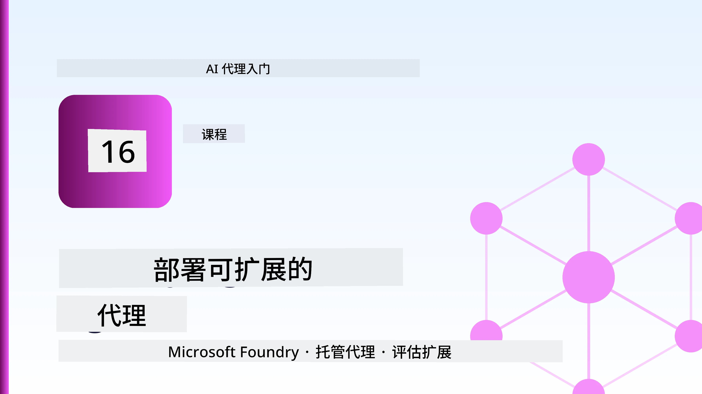
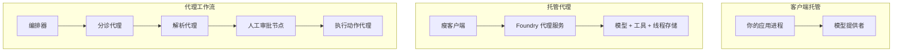
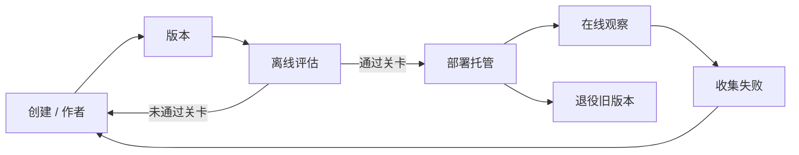
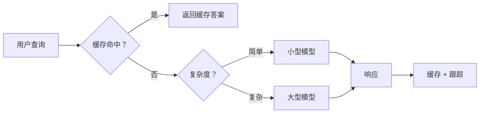
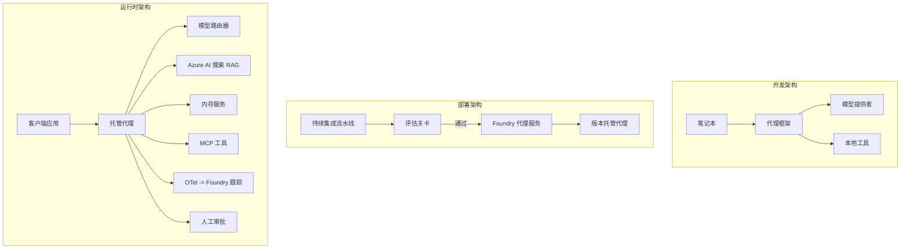

# 使用 Microsoft Foundry 部署可扩展代理



到目前为止，您已经构建了在笔记本电脑上运行的代理，运行在笔记本内，由 `az login` 和少量环境变量驱动。这正是学习的正确方式。但是，这并不是在凌晨 3 点成千上万的客户依赖的代理的正确运行方式。

本课将讲述“在我的机器上能运行”和“在生产环境中可靠且经济地运行”之间的差距。我们将使用 **Microsoft Foundry** 和 **Microsoft Foundry Agent Service** 来弥合这个差距，并通过构建一个具有工具调用、检索、记忆、评估和监控功能的真实客户支持代理来实现。

## 介绍

本课将涵盖：

- <strong>原型代理</strong> 和 <strong>已部署代理</strong> 之间的区别，以及为什么过渡大多是关于模型<em>周围</em>的一切。
- 代理的 <strong>部署模式</strong>：客户端托管、服务托管（托管代理）和工作流协调。
- Microsoft Foundry 上的 <strong>代理生命周期</strong> — 创建、版本控制、部署、评估、观察、退役。
- <strong>扩展策略</strong>：模型路由、缓存、并发和无状态设计。
- 使用 OpenTelemetry 和 Foundry 跟踪实现的 <strong>可观察性</strong>。
- 通过模型选择、路由和评估门实现的 <strong>成本优化</strong>。
- <strong>企业考虑因素</strong>：治理、人工审批，以及在生产环境中安全运行 MCP 服务器。

## 学习目标

完成本课后，您将能够：

- 为给定代理工作负载选择合适的部署模式。
- 将代理部署到 Microsoft Foundry Agent Service，使其具有版本控制、治理和可观察性。
- 为代理添加跟踪，并配备在每次发布前运行的评估管道。
- 应用模型路由和缓存，在规模化时保持延迟和成本受控。
- 为高风险操作添加人工审批门，并以生产安全的方式集成 MCP 服务器。

## 前提条件

本课假定您已完成之前的课程，并熟悉：

- 使用 [Microsoft Agent Framework](../14-microsoft-agent-framework/README.md) 构建代理（第14课）。
- [工具使用](../04-tool-use/README.md)（第4课）和 [Agentic RAG](../05-agentic-rag/README.md)（第5课）。
- [代理记忆](../13-agent-memory/README.md)（第13课）和 [Agentic 协议 / MCP](../11-agentic-protocols/README.md)（第11课）。
- [可观察性和评估](../10-ai-agents-production/README.md)（第10课）— 本课直接在其基础上构建。

您还需要：

- 一个 **Azure 订阅** 和一个至少部署有一个聊天模型的 **Microsoft Foundry 项目**。
- 已认证的 **Azure CLI**（`az login`）。
- Python 3.12+ 及本仓库中的 [`requirements.txt`](../../../requirements.txt) 包。

## 从原型到生产：实际发生了什么变化

原型代理和生产代理共享相同的核心循环——推理、调用工具、响应。变化的是包裹在该循环周围的一切。模型可能只占生产代理的 20%；其余 80% 是运营骨架。

| 关注点 | 原型 | 生产 |
| --- | --- | --- |
| <strong>托管</strong> | 运行在您的笔记本中 | 作为托管服务运行，具备版本化和滚动发布 |
| <strong>身份</strong> | 您的 `az login` 令牌 | 受控身份，带有范围限制的 RBAC |
| <strong>状态</strong> | 内存中，重启丢失 | 外置（线程存储、记忆服务） |
| <strong>失败</strong> | 您看到回溯 | 重试、回退、死信队列、告警 |
| <strong>成本</strong> | “几分钱” | 按请求跟踪，路由，缓存，预算 |
| <strong>质量</strong> | 您肉眼检查输出 | 每次发布前自动评估 |
| <strong>信任</strong> | 您审批每个操作 | 高风险操作采用策略+人工干预 |

记住此表。以下每个章节均对应表中某一行。

## 代理部署模式

您将使用三种模式，常常组合使用。

### 1. 客户端托管代理

代理对象驻留于<em>您的</em>应用进程中。您的代码直接调用模型提供者；推理循环运行在您的服务里。之前所有课程均是这种模式。

- <strong>使用场景</strong>：当您需要完全控制循环、自定义中间件，或者将代理嵌入现有后端时。
- <strong>权衡</strong>：您需自行负责扩展、状态管理和弹性。

### 2. 托管代理（Foundry Agent Service）

代理作为资源<em>注册于</em> Microsoft Foundry。Foundry 托管推理循环、存储线程、执行内容安全和 RBAC，并在 Foundry 门户中显示代理。您的应用变成一个轻客户端，负责创建线程，读取响应。

- <strong>使用场景</strong>：当您需要持久性、内建可观察性、治理以及减少运维复杂度时。
- <strong>权衡</strong>：以受管理运行时换取低级控制的减少。

### 3. 代理工作流

多个代理（及工具）按显式控制流组合成图——顺序步骤、分支、人工审批节点和可以暂停恢复的持久检查点。这是 Microsoft Agent Framework <strong>工作流</strong> 功能在部署规模上的应用。

- <strong>使用场景</strong>：当一个任务涉及多个专用代理或中间需要审批步骤时。
- <strong>权衡</strong>：更多活动部件；需要协调级别的可观察性。



## Microsoft Foundry 上的代理生命周期

部署代理不是一次性 `push` 操作。它是一个循环，看起来很像软件发布周期，因为它的本质就是软件发布。



核心观点，继承自[第10课](../10-ai-agents-production/README.md)：**离线评估是门控，而非事后考虑。** 新代理版本只有通过评估门槛才会发布。在线可观察性将真实失败反馈回离线测试集。整个流程就是这样的闭环。

## 扩展策略

扩展代理不同于扩展无状态的 Web API，因为每个请求可能触发多次昂贵的模型和工具调用。四种技术承担了大部分负载。

**无状态请求处理。** 不在进程内存保留每用户状态。将会话线程持久化存储在 Foundry 线程存储或记忆服务中，因此任何实例都能处理任何请求。这是水平扩展的关键——增加实例，无需粘性会话。

**模型路由。** 并非每个请求都需要最强大（且昂贵）的模型。将简单请求——意图分类、简短事实回答——路由到小而快的模型，将大型模型保留给复杂推理。Foundry 的 <strong>模型路由器</strong> 可以实现此功能，您也可以自己构建轻量分类器。实验课中您将构建一个DIY版本。

**响应缓存。** 许多支持查询几乎重复（“我怎么重置密码？”）。缓存常见问题答案，直接返回，无需调用模型。即使是适度的命中率，也对成本和延迟有明显削减。

**并发和背压。** 模型提供者有速率限制。控制并发，使用带指数退避的重试，优雅失败（排队的“我们正在处理”响应比 500 错误更好）。



## 生产环境中的可观察性

你无法运营看不见的东西。如第10课所述，Microsoft Agent Framework 原生输出 **OpenTelemetry** 跟踪——每次模型调用、工具执行和编排步骤都是一个跨度。在生产中，您将这些跨度导出到 Microsoft Foundry（或任意 OTel 兼容后端），以：

- 对单个客户投诉全链路追踪，涵盖所有模型和工具调用。
- 观察随时间变化的 p50/p95 延迟和每请求成本。
- 在用户（或财务团队）察觉前，对错误率激增和成本异常发出警报。

```python
from agent_framework.observability import get_tracer

tracer = get_tracer()

with tracer.start_as_current_span("support_request") as span:
    span.set_attribute("customer.tier", "enterprise")
    span.set_attribute("routed.model", "gpt-5-nano")
    # 代理执行会在此跨度内自动跟踪
```

类似 `customer.tier` 和 `routed.model` 这样的属性将一大堆跟踪变成可回答的问题（“企业客户是否过于频繁被路由至小模型？”）。

## 成本优化

生产代理的成本主要由令牌支配。三大杠杆，按影响力排序：

1. **模型大小合适。** 一个通过评估门的较小模型几乎总是比一个也通过评估门的较大模型更便宜。用评估证明小模型足够，而不是出于谨慎默认选最大模型。
2. **按复杂度路由。** 如上，仅对需要大型模型推理的请求支付大型模型的费用。
3. **积极缓存。** 最便宜的模型调用是你永远不发起的调用。

评估门和成本控制是同一门学问的两面：评估告诉你<em>质量底线</em>，路由与缓存尽量让你接近这个底线的<em>成本</em>。

## 企业部署考虑

**治理。** 托管代理继承 Foundry 的 RBAC、内容安全和审计日志。为每个代理分配最小特权的托管身份——只读知识库、范围限定访问工单 API，不能更多。

**人工干预。** 某些操作过于重要，不能完全自动化——退款、删除账户、升级至法务团队。Microsoft Agent Framework 支持<strong>审批必需</strong>的工具：代理提出操作，执行暂停，人工批准或拒绝，工作流继续。您在[第6课](../06-building-trustworthy-agents/README.md)见过这个原语；这里部署它。

**生产中的 MCP。** [MCP](../11-agentic-protocols/README.md) 让您的代理通过标准接口消费外部工具。生产环境中，将每个 MCP 服务器视为不可信边界：锁定服务器版本，使用限定身份运行，验证其输出，且永远不向其暴露密钥。MCP 服务器是依赖项，依赖项需要打补丁、审计和限流。



这三幅图——开发、部署、运行时——是同一代理生活中三个阶段。后续实验引导您构建它。

## 实战实验：生产就绪的客户支持代理

打开 [`code_samples/16-python-agent-framework.ipynb`](./code_samples/16-python-agent-framework.ipynb)，从头完成。您将组装一个内置生产关注点的 **Contoso 客户支持代理**：

1. <strong>工具调用</strong> — 查询订单状态和打开支持票。
2. **RAG** — 从知识库回答策略问题（Azure AI Search，含内存回退以便笔记本可在无搜索资源时运行）。
3. <strong>记忆</strong> — 跨轮对话记住客户信息。
4. <strong>模型路由</strong> — 复杂度分类器路由请求至小模型或大模型。
5. <strong>响应缓存</strong> — 重复问题从缓存提供答案。
6. <strong>人工审批</strong> — 超过阈值的退款暂停等待人工签字。
7. <strong>评估管道</strong> — 一个小的离线测试集评分代理，并作为发布门。
8. <strong>可观察性</strong> — 每个请求的 OpenTelemetry 跟踪。

### 讲解

笔记本组织为每个生产关注点的独立运行部分。核心是路由加缓存的请求处理器：

```python
async def handle_support_request(query: str, customer_id: str) -> str:
    # 1. 在可能的情况下从缓存中提供服务。
    cached = response_cache.get(normalize(query))
    if cached:
        return cached

    # 2. 按复杂性路由以控制成本。
    model = "gpt-5-nano" if is_simple(query) else "gpt-5-mini"

    # 3. 在追踪跨度内运行代理以实现可观察性。
    with tracer.start_as_current_span("support_request") as span:
        span.set_attribute("routed.model", model)
        span.set_attribute("customer.id", customer_id)
        response = await support_agent.run(query, model=model)

    # 4. 缓存并返回。
    response_cache.set(normalize(query), response.text)
    return response.text
```

保护发布的评估门如下所示：

```python
async def evaluation_gate(agent, test_cases, threshold: float = 0.8) -> bool:
    passed = 0
    for case in test_cases:
        result = await agent.run(case["input"])
        if score_response(result.text, case["expected"]) >= 0.8:
            passed += 1
    pass_rate = passed / len(test_cases)
    print(f"Evaluation pass rate: {pass_rate:.0%} (gate: {threshold:.0%})")
    return pass_rate >= threshold  # 仅当门控通过时才部署
```

仔细阅读每一行——笔记本故意保持原语小巧，确保无框架调用藏内容。

## 使用冒烟测试验证已部署代理

上面的评估门<em>离线</em>针对您的代理对象运行。一旦代理作为托管代理部署，还需一个更便宜的检查：**部署的端点是否实际响应？**

“成功部署”只是控制平面接受定义，而非证明代理可响应。缺失依赖、错误模型路由或连接过期都可能导致绿灯部署却无响应。<strong>冒烟测试</strong>能在数秒内捕获此类问题，每次部署皆运行，成本远低于完整评估。

本仓库附带基于 [AI Smoke Test](https://github.com/marketplace/actions/ai-smoke-test) GitHub Action 的即用型冒烟测试管道：

- <strong>目录</strong> — [`tests/lesson-16-smoke-tests.json`](../../../tests/lesson-16-smoke-tests.json) 包含 Contoso 支持代理的提示和断言（基于策略回答、订单查询、话题保持和多轮线程连续性）。其他课程代理的目录也在此旁边——参见 [`tests/README.md`](../tests/README.md)。
- <strong>工作流</strong> — [`.github/workflows/smoke-test.yml`](../../../.github/workflows/smoke-test.yml) 使用 Azure OIDC 登录，将每个提示 POST 到代理的 Responses 端点，任一断言失败即使作业失败。

```yaml
- name: Smoke-test hosted agent
  uses: JFolberth/ai-smoketest@v1
  with:
    project_endpoint: ${{ inputs.project_endpoint }}
    agent_name: ContosoSupportAgent
    tests_file: tests/lesson-16-smoke-tests.json
```


在您的代理部署完成后，从 <strong>操作</strong> 选项卡运行它，提供您的 Foundry 项目端点和代理名称。联合身份需要在 Foundry 项目范围内拥有 **Azure AI 用户** 角色。将这些层次想象成金字塔：冒烟测试（是否可访问且有响应？）在每次部署时运行，离线评估（是否足够好以发布？）在升级前运行，在线评估（实际运行情况如何？）持续运行。

## 知识检测

在进入作业之前测试你的理解。

**1. 大致上生产代理中“模型”占多少比例，其余部分是什么？**

<details>
<summary>答案</summary>

模型在系统中占少数 —— 通常被认为约占 20%。其余是操作骨架：托管和版本控制、身份和 RBAC、外部状态、故障处理、成本跟踪、评估以及人工干预控制。上线生产主要是围绕推理环路构建所有外围设施。
</details>

**2. 何时会选择托管代理而非客户机托管代理？**

<details>
<summary>答案</summary>

当你想要一个具有内置持久性（可以持久和恢复线程）、可观测性、内容安全和 RBAC 的管理运行时，并愿意为减少操作维护范围而放弃对推理环路某些底层控制时选择托管代理。客户机托管适合需要完全控制环路或将代理嵌入现有后端时。
</details>

**3. 为什么可扩展的代理在自身进程内存中必须是无状态的？**

<details>
<summary>答案</summary>

这样任何实例都可以处理任何请求，这使得无粘性会话的水平扩展成为可能。用户的会话状态外部化存储在线程存储或内存服务中。如果状态保存在进程内存中，重启时状态会丢失，也无法自由分配负载。
</details>

**4. 模型路由解决了什么问题，它与评估有什么关系？**

<details>
<summary>答案</summary>

路由将简单请求发送到小型、廉价、快速的模型，将大型模型保留用于真正的推理，控制延迟和成本。它与评估相关，因为评估是证明小模型足以处理某类请求的依据 —— 无评估的路由只是猜测。
</details>

**5. 什么是“评估门”，它在生命周期中处于何处？**

<details>
<summary>答案</summary>

评估门会针对新代理版本运行离线测试集，并且除非通过率达到阈值，否则阻止部署。它位于生命周期的“版本”和“部署”之间，使质量成为发布前的先决条件，而不是发布后的检查事项。
</details>

**6. 为什么生产环境中 MCP 服务器应被视为不可信边界？**

<details>
<summary>答案</summary>

因为它是代理调用的外部依赖。应固定其版本，运行时使用限定权限身份，验证其输出，限流，且绝不暴露机密给它 —— 与对第三方依赖的严格管理相同。其输出流入代理推理，未经验证的信任是安全风险。
</details>

**7. 通常哪个单一改动对生产代理成本影响最大，为什么？**

<details>
<summary>答案</summary>

选对模型大小 —— 使用通过评估门的最小模型。成本主要由 tokens 决定，满足质量要求的较小模型几乎总比大模型便宜。缓存和路由可进一步降低成本，但选择基础模型大小产生最大一阶影响。
</details>

**8. 像 `customer.tier` 和 `routed.model` 这样的跨度属性在可观测性中作用是什么？**

<details>
<summary>答案</summary>

它们将原始追踪转化为可回答的业务问题。没有属性只有一堆跨度；有属性你可以问“企业客户是否过于频繁地被路由到小模型？”或者“哪个模型处理我们的最慢请求？”属性是按对业务重要维度切片遥测的方式。
</details>

## 作业

以实验室的客户支持代理为基础，强化它以适应一个特定场景：**一个 SaaS 公司的订阅账单支持代理。**

你的提交应包含：

1. <strong>用账单相关工具替换原有工具</strong>：`get_subscription_status`、`get_invoice` 和 `issue_credit`（金额超过 50 美元需人工审批）。
2. **添加三个 RAG 文档**，涵盖公司的退款政策、账单周期和取消政策。
3. <strong>扩展评估集</strong> 至至少八个案例，其中至少两例应触发人工审批路径，并确认评估门正确通过或不通过。
4. <strong>添加一份成本报告</strong>：运行十个混合查询后，打印多少请求进入小模型，多少进入大模型，以及多少由缓存服务。

用一段简短的文字（markdown 单元格）解释你选择了哪条模型路由规则，以及你如何用真实流量验证它。没有唯一正确答案 —— 评估重点是生产相关事项是否合理连贯。

## 总结

在本课中，您使用 Microsoft Foundry 将一个代理从原型推进到生产：

- 进入生产主要是搭建模型周围的<strong>操作骨架</strong>——托管、身份、状态、故障处理、成本、质量和信任。
- 学习了三种<strong>部署模式</strong>——客户机托管、托管代理和代理工作流——及各自适用场景。
- 了解了<strong>代理生命周期</strong>，离线<strong>评估作为发布门</strong>，在线监测将故障反馈回测试集。
- 采用了<strong>扩展策略</strong>——无状态设计、模型路由、缓存和有界并发——并将其与<strong>成本优化</strong>挂钩。
- 配置了<strong>企业管控</strong>：RBAC、人工干预审批和生产安全的 MCP 集成。
- 构建了一个<strong>生产就绪的客户支持代理</strong>，将所有这些环节以可运行代码整合在一起。

下一课走相反的路线：不是将代理扩展到云端，而是将代理<strong>下沉</strong>到单个开发者机器并完全本地运行。

## 额外资源

- <a href="https://learn.microsoft.com/azure/ai-foundry/what-is-azure-ai-foundry" target="_blank">Microsoft Foundry 文档</a>
- <a href="https://learn.microsoft.com/azure/ai-foundry/agents/overview" target="_blank">Microsoft Foundry 代理服务概览</a>
- <a href="https://learn.microsoft.com/en-us/agent-framework/overview/?wt.mc_id=youtube_26688_organicsocial_reactor&pivots=programming-language-python" target="_blank">Microsoft Agent Framework</a>
- <a href="https://learn.microsoft.com/azure/ai-foundry/concepts/model-router" target="_blank">Microsoft Foundry 中的模型路由器</a>
- <a href="https://learn.microsoft.com/azure/search/search-what-is-azure-search" target="_blank">Azure AI Search</a>
- <a href="https://opentelemetry.io/" target="_blank">OpenTelemetry</a>
- <a href="https://github.com/marketplace/actions/ai-smoke-test" target="_blank">AI 冒烟测试 GitHub Action</a>
- <a href="https://modelcontextprotocol.io/" target="_blank">模型上下文协议 (MCP)</a>

## 上一课

[构建计算机使用代理 (CUA)](../15-browser-use/README.md)

## 下一课

[创建本地 AI 代理](../17-creating-local-ai-agents/README.md)

---

<!-- CO-OP TRANSLATOR DISCLAIMER START -->
**免责声明**：
本文件由 AI 翻译服务 [Co-op Translator](https://github.com/Azure/co-op-translator) 翻译完成。尽管我们力求准确，但请注意，自动翻译可能包含错误或不准确之处。原始语言版文件应视为权威来源。对于重要信息，建议使用专业人工翻译。我们对因使用本翻译而产生的任何误解或误释不承担责任。
<!-- CO-OP TRANSLATOR DISCLAIMER END -->