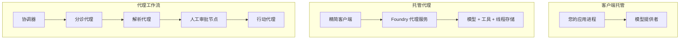
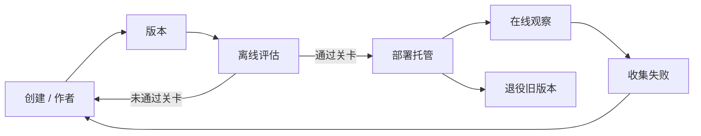
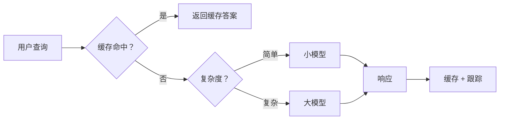
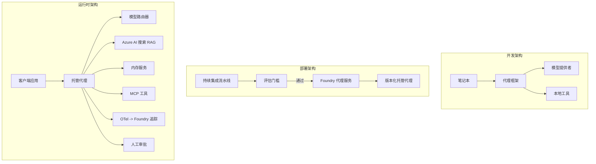

# 使用 Microsoft Foundry 部署可扩展代理


到目前为止，您已经构建了在笔记本内笔记本电脑上运行的代理，由 `az login` 和少量环境变量驱动。这确实是学习的正确方法。但这并不是运行一个在凌晨3点有上千客户依赖的代理的正确方法。

本课将介绍“它在我的机器上能运行”与“它能在生产环境中可靠且经济地运行”之间的差距。我们通过使用 **Microsoft Foundry** 和 **Microsoft Foundry Agent Service** 填补这道差距，并通过构建一个具有工具、检索、记忆、评估和监控功能的真实客户支持代理实现这一目标。

## 介绍

本课将涵盖：

- <strong>原型代理</strong> 与 <strong>部署代理</strong> 的区别，以及为什么过渡主要是关于模型周围的所有内容。
- 代理的 <strong>部署模式</strong>：客户端托管、服务托管（托管代理）和工作流编排。
- Microsoft Foundry 上的 <strong>代理生命周期</strong> — 创建、版本控制、部署、评估、监视、退役。
- <strong>扩展策略</strong>：模型路由、缓存、并发和无状态设计。
- 使用 OpenTelemetry 和 Foundry 跟踪实现的 <strong>可观测性</strong>。
- 通过模型选择、路由和评估门实现的 <strong>成本优化</strong>。
- <strong>企业考量</strong>：治理、人类审批以及在生产环境中安全运行 MCP 服务器。

## 学习目标

完成本课后，您将了解如何：

- 为给定的代理工作负载选择合适的部署模式。
- 将代理部署到 Microsoft Foundry Agent Service，使其具备版本控制、治理和可观测性。
- 为代理添加跟踪，并建立一个在每次发布前运行的评估管道。
- 应用模型路由和缓存，在大规模下保持延迟和成本的可控。
- 为高风险操作添加人工审批门，并以生产安全的方式集成 MCP 服务器。

## 先决条件

本课假设您已完成之前的课程并熟悉：

- 使用 [Microsoft Agent Framework](../14-microsoft-agent-framework/README.md) 构建代理（第14课）。
- [工具使用](../04-tool-use/README.md)（第4课）和 [Agentic RAG](../05-agentic-rag/README.md)（第5课）。
- [代理记忆](../13-agent-memory/README.md)（第13课）和 [Agentic 协议 / MCP](../11-agentic-protocols/README.md)（第11课）。
- [可观测性与评估](../10-ai-agents-production/README.md)（第10课）— 本课将基于它直接构建。

您还需要：

- 一个 **Azure 订阅** 和一个至少部署了一个聊天模型的 **Microsoft Foundry 项目**。
- 通过 `az login` 认证的 **Azure CLI**。
- Python 3.12+ 以及仓库中的 [`requirements.txt`](../../../requirements.txt) 包。

## 从原型到生产：实际变化是什么

原型代理和生产代理共享相同的核心循环——推理、调用工具、响应。改变的是包装在该循环周围的所有内容。模型大约占生产代理的20%；其余80%是运营骨架。

| 关注点 | 原型 | 生产 |
| --- | --- | --- |
| <strong>托管</strong> | 运行在你的笔记本内 | 作为托管服务运行，支持版本控制与发布 |
| <strong>身份</strong> | 你的 `az login` 令牌 | 托管身份，带有范围限定的 RBAC |
| <strong>状态</strong> | 内存中，重启失效 | 外部化（线程存储、记忆服务） |
| <strong>失败</strong> | 你能看到回溯信息 | 重试、降级、死信、告警 |
| <strong>成本</strong> | “几分钱” | 按请求跟踪，路由，缓存，预算管理 |
| <strong>质量</strong> | 你肉眼检查输出 | 每次发布前自动评估 |
| <strong>信任</strong> | 你批准每个操作 | 策略 + 人工介入对风险操作审批 |

记住这张表。下面的每个部分都对应于表中的一行。

## 代理部署模式

常用三种模式，且经常组合使用。

### 1. 客户端托管代理

代理对象存在于<em>你的</em>应用进程中。你的代码直接调用模型提供者；推理循环在你的服务里运行。这是之前所有课程采纳的方式。

- <strong>使用场景</strong>：当你需要完全控制循环、自定义中间件，或者将代理嵌入现有后端时。
- <strong>权衡</strong>：你自己负责扩展、状态和弹性。

### 2. 托管代理（Foundry Agent Service）

代理被<em>注册为资源</em>在 Microsoft Foundry 中。Foundry 托管推理循环，存储线程，执行内容安全和 RBAC，且使代理在 Foundry 门户中可见。你的应用成为一个轻客户端，创建线程和读取响应。

- <strong>使用场景</strong>：当你需要耐久性、内置可观测性、治理和更少的运维工作时。
- <strong>权衡</strong>：以托管运行时换取更少的底层控制。

### 3. 代理工作流

多个代理（及工具）组成一个带有显式控制流的图——顺序步骤、分支、人类审批节点、以及可暂停和恢复的持久检查点。这是 Microsoft Agent Framework <strong>工作流</strong> 功能在部署规模上的应用。

- <strong>使用场景</strong>：任务跨越多个专业代理或中间需要审批步骤时。
- <strong>权衡</strong>：更多运动部件；需要编排级的可观测性。



## Microsoft Foundry 上的代理生命周期

部署代理不是一次性的 `push` 操作，而是一个循环，它看起来很像软件发布周期，因为它确实就是这样。



核心思想，继承自[第10课](../10-ai-agents-production/README.md)：**离线评估是门槛，而非事后考虑。** 新版本代理只有通过你的评估标准才会发布。在线可观测性将现实失败反馈回离线测试集，这就是整个循环。

## 扩展策略

扩展代理与扩展无状态 Web API 不同，因为每个请求可能触发多次昂贵的模型和工具调用。以下四种技术承担了大部分负载。

**无状态请求处理。** 不在进程内存中保存任何针对单一用户的状态。将对话线程持久化在 Foundry 线程存储或记忆服务中，以便任一实例均可处理任一请求。这是实现水平扩展的关键——增加实例，无需粘性会话。

**模型路由。** 并非所有请求都需要你最强（且最贵）的模型。将简单请求——意图分类、简短事实回答——路由到体积较小、响应更快的模型，将大型模型保留给真正的推理任务。Foundry 的 **Model Router** 可以协助你完成，也可以自己实现轻量级分类器。实验中你将构建自定义版本。

**响应缓存。** 很多支持查询几乎重复（“我如何重置密码？”）。缓存常见问题答案，直接返回缓存内容，无需调用模型。即使是适度的缓存命中率也能显著降低成本和延迟。

**并发与背压。** 模型提供者有限流。限制并发度，使用指数退避重试，优雅失败（排队的「我们正在处理」响应胜过 500 错误）。



## 生产环境中的可观测性

不可见的就无法操作。如第10课所述，Microsoft Agent Framework 天生发出 **OpenTelemetry** 跟踪——每一次模型调用、工具调用和编排步骤都成为一个跨度。在生产中，你将这些跨度导出到 Microsoft Foundry（或任何兼容 OTel 的后台）以便你能：

- 端到端追踪单个客户投诉，覆盖所有模型和工具调用。
- 监控请求的 p50/p95 延迟和成本随时间的变化。
- 在用户（或财务团队）察觉之前，对错误率激增和成本异常发出警报。

```python
from agent_framework.observability import get_tracer

tracer = get_tracer()

with tracer.start_as_current_span("support_request") as span:
    span.set_attribute("customer.tier", "enterprise")
    span.set_attribute("routed.model", "gpt-5-nano")
    # 代理执行在此跨度内自动跟踪
```

类似 `customer.tier` 和 `routed.model` 这样的属性将一大批跟踪转化为可回答的问题（“企业客户是否被过于频繁地路由到小模型？”）。

## 成本优化

生产代理的成本主要由 Token 决定。以下三种杠杆，按影响力排序：

1. **选对模型规模。** 通过评估门的较小模型，几乎总比同样通过评估门的较大模型便宜。用评估证明小模型足够，而非出于谨慎默认选择最大模型。
2. **按复杂度路由。** 如前所述—仅对需复杂推理的请求付大模型费用。
3. **积极缓存。** 最便宜的模型调用是你根本不用调用的那一次。

评估门和成本控制是两个角度看待同一学科：评估设定<em>质量下限</em>，路由和缓存努力将成本保持尽可能靠近该下限。

## 企业部署注意事项

**治理。** 托管代理继承 Foundry 的 RBAC、内容安全和审计日志。给每个代理分配只读知识库、范围限定票务 API 访问等最小权限的托管身份。

**人工介入。** 一些操作后果重大，不能完全自动化——退款、账户删除、升级法律团队。Microsoft Agent Framework 支持 <strong>审批必需</strong> 工具：代理提出动作，执行暂停，人类审批或拒绝，工作流恢复。第6课介绍了这项原始功能；这里部署它。

**生产中的 MCP。** [MCP](../11-agentic-protocols/README.md) 让代理通过标准接口调用外部工具。生产环境中，将每个 MCP 服务器视为不可信边界：固定服务器版本，使用范围限定身份运行，验证输出，绝不暴露机密。MCP 服务器是依赖项，需要补丁管理、审计和限流。



这三张图 — 开发、部署、运行时 — 展示了同一代理在生命周期中的三个阶段。接下来的实验引导你构建它。

## 实战实验：生产就绪的客户支持代理

打开 [`code_samples/16-python-agent-framework.ipynb`](./code_samples/16-python-agent-framework.ipynb) 并完整操作。你将组装一个具有所有生产考量的 **Contoso 客户支持代理**：

1. <strong>工具调用</strong> — 查询订单状态并打开支持工单。
2. **RAG** — 从知识库（Azure AI Search，以及无 Search 资源时的内存回退）回答政策问题。
3. <strong>记忆</strong> — 跨对话轮次记住客户信息。
4. <strong>模型路由</strong> — 复杂度分类器将请求路由到小模型或大模型。
5. <strong>响应缓存</strong> — 重复问题从缓存中返回。
6. <strong>人工审批</strong> — 超过阈值的退款等待人工签字。
7. <strong>评估管道</strong> — 小型离线测试集对代理进行评分并作为发布门。
8. <strong>可观测性</strong> — 使用 OpenTelemetry 跟踪每个请求。

### 逐步讲解

笔记本结构化，确保每个生产考量为自包含且可运行的部分。其核心是路由加缓存的请求处理器：

```python
async def handle_support_request(query: str, customer_id: str) -> str:
    # 1. 尽可能从缓存提供服务。
    cached = response_cache.get(normalize(query))
    if cached:
        return cached

    # 2. 根据复杂度进行路由以控制成本。
    model = "gpt-5-nano" if is_simple(query) else "gpt-5-mini"

    # 3. 在追踪跨度内运行代理以便观察。
    with tracer.start_as_current_span("support_request") as span:
        span.set_attribute("routed.model", model)
        span.set_attribute("customer.id", customer_id)
        response = await support_agent.run(query, model=model)

    # 4. 缓存并返回。
    response_cache.set(normalize(query), response.text)
    return response.text
```

保护发布的评估门如下：

```python
async def evaluation_gate(agent, test_cases, threshold: float = 0.8) -> bool:
    passed = 0
    for case in test_cases:
        result = await agent.run(case["input"])
        if score_response(result.text, case["expected"]) >= 0.8:
            passed += 1
    pass_rate = passed / len(test_cases)
    print(f"Evaluation pass rate: {pass_rate:.0%} (gate: {threshold:.0%})")
    return pass_rate >= threshold  # 仅当门通过时才部署
```

逐行阅读 — 笔记本将原始组件保持小巧，避免隐藏在框架调用之后。

## 使用冒烟测试验证已部署代理

上述评估门在线下针对代理对象运行。代理作为托管代理部署后，你还需要更便宜的检测：**部署的端点是否真正响应？**

“成功部署”只证明控制平面接受定义——不证明代理能响应。缺依赖、错误路由或失效连接可能导致绿灯部署但无响应。<strong>冒烟测试</strong>能够在部署秒级内捕获这一点，且无需全套评估的成本。

本仓库提供基于 [AI Smoke Test](https://github.com/marketplace/actions/ai-smoke-test) GitHub Action 的现成冒烟测试管道：

- <strong>目录</strong> — [`tests/lesson-16-smoke-tests.json`](../../../tests/lesson-16-smoke-tests.json) 包含 Contoso 支持代理的提示和断言（有根据的政策答案、订单查询、主题相关以及多轮线程连续性）。其他课程代理的目录紧随其旁，详见 [`tests/README.md`](../tests/README.md)。
- <strong>工作流</strong> — [`.github/workflows/smoke-test.yml`](../../../.github/workflows/smoke-test.yml) 通过 Azure OIDC 登录，向代理的 Responses 端点 POST 每个提示，任何断言失败则让任务失败。

```yaml
- name: Smoke-test hosted agent
  uses: JFolberth/ai-smoketest@v1
  with:
    project_endpoint: ${{ inputs.project_endpoint }}
    agent_name: ContosoSupportAgent
    tests_file: tests/lesson-16-smoke-tests.json
```


在您的代理部署后，从 **Actions** 选项卡运行它，提供您的 Foundry 项目端点和代理名称。联合身份需要在 Foundry 项目范围内具有 **Azure AI User** 角色。可以将层级视为金字塔结构：冒烟测试（是否可访问且有响应？）在每次部署时运行，离线评估（是否足够好到可以发布？）在升级前运行，在线评估（在实际环境中表现如何？）则持续运行。

## 知识检测

在进入作业之前测试您的理解。

**1. 一个生产代理中“模型”的大致比例是多少，其余部分是什么？**

<details>
<summary>答案</summary>

模型只是系统中的少数部分——通常约占20%。其余部分是操作骨架：托管和版本控制、身份和角色访问控制、外部状态、故障处理、成本跟踪、评估以及人工干预控制。生产阶段主要是构建模型推理循环<em>周围</em>的所有东西。
</details>

**2. 什么时候会选择托管代理而非客户端托管代理？**

<details>
<summary>答案</summary>

当您需要一个具有内置耐久性（能够持久化并恢复线程）、可观察性、内容安全和角色访问控制的托管运行环境，并且愿意为减少操作管理工作而放弃对推理循环的部分底层控制时，会选择托管代理。若需要完全控制推理循环或将代理嵌入现有后端时，则倾向使用客户端托管。
</details>

**3. 为什么可扩展代理在其自身进程内存中必须是无状态的？**

<details>
<summary>答案</summary>

这样任何实例都能处理任何请求，这使得水平扩展无需使用粘性会话成为可能。每个用户的对话状态被外部存储到线程存储或内存服务中。如果状态存储在进程内存中，一旦重启状态丢失，且无法自由分配负载。
</details>

**4. 模型路由解决了什么问题，它与评估有什么关系？**

<details>
<summary>答案</summary>

路由将简单请求发送给一个小型、廉价、快速的模型，将大型模型保留给真正的推理，控制延迟和成本。它与评估相关，因为评估就是证明小模型对某类请求足够好——无评估的路由只是猜测。
</details>

**5. 什么是“评估门”，它在生命周期中处于哪个位置？**

<details>
<summary>答案</summary>

评估门对一个新代理版本运行离线测试集，并阻止部署除非通过率达到阈值。它位于生命周期的“版本”和“部署”之间，使质量成为发布的前提条件，而非发布后才检查。
</details>

**6. 为什么 MCP 服务器在生产环境中应被视为不可信边界？**

<details>
<summary>答案</summary>

因为它是代理调用的外部依赖。您应锁定其版本，使用限定身份运行，验证其输出，进行速率限制，并且绝不向其暴露机密——这与对待任何第三方依赖的纪律相同。其输出会流入代理推理，未经验证的信任存在安全风险。
</details>

**7. 哪个单一变更通常对生产代理成本影响最大，为什么？**

<details>
<summary>答案</summary>

选择合适大小的模型——使用最小且仍能通过评估门的模型。成本主要由令牌数量决定，符合质量标准的较小模型几乎总比较大模型便宜。缓存和路由进一步降低成本，但选择适当的基模型具有最大的一级影响。
</details>

**8. 像 `customer.tier` 和 `routed.model` 这样的跨度属性在可观察性中扮演什么角色？**

<details>
<summary>答案</summary>

它们将原始追踪转换成可回答的业务问题。没有属性，您面对的是一堆跨度；有了属性，您可以询问“企业客户是否被过多路由到小模型？”或“哪个模型处理了我们最慢的请求？”属性是按运营关键维度划分遥测数据的手段。
</details>

## 作业

采用实验中的客户支持代理，并针对特定场景进行加固：**面向 SaaS 公司的订阅计费支持代理。**

您的提交应包括：

1. <strong>替换工具</strong> 为计费相关工具：`get_subscription_status`、`get_invoice` 以及 `issue_credit`（超过 50 美元的信用额度需要人工批准）。
2. **添加三份 RAG 文档**，涵盖公司的退款政策、计费周期和取消政策。
3. <strong>扩展评估集</strong> 至少包含八个案例，其中至少两个<em>应该</em>触发人工审批路径，并确认您的评估门正确地通过或失败。
4. <strong>添加一份成本报告</strong>：在代理运行十个混合查询后，打印分别有多少走了小模型，多少走了大模型，以及多少来自缓存。

在 markdown 单元中写一小段文字，说明您选择了哪条模型路由规则，以及如何用真实流量验证它。没有唯一正确答案——评估重点是您是否合理连接了生产关注点。

## 总结

在本课中，您利用 Microsoft Foundry 将代理从原型推进到生产：

- 跳转到生产主要围绕模型的<strong>操作骨架</strong>——托管、身份、状态、故障处理、成本、质量和信任。
- 您学习了三种<strong>部署模式</strong>——客户端托管、托管代理和代理工作流——及其适用场景。
- 您了解了<strong>代理生命周期</strong>，其中离线<strong>评估充当发布门</strong>，在线可观察性将故障反馈到测试集中。
- 您应用了<strong>扩展策略</strong>——无状态设计、模型路由、缓存和有界并发——并将它们与<strong>成本优化</strong>关联起来。
- 您集成了<strong>企业控制</strong>：角色访问控制、人工审批以及生产安全的 MCP 集成。
- 您构建了一个<strong>生产就绪的客户支持代理</strong>，将所有这些关注点连接在可执行代码中。

下一课将走相反的路径：您将把代理从云端<em>缩小</em>到单台开发者机器，并完全本地运行。

## 附加资源

- <a href="https://learn.microsoft.com/azure/ai-foundry/what-is-azure-ai-foundry" target="_blank">Microsoft Foundry 文档</a>
- <a href="https://learn.microsoft.com/azure/ai-foundry/agents/overview" target="_blank">Microsoft Foundry 代理服务概览</a>
- <a href="https://learn.microsoft.com/en-us/agent-framework/overview/?wt.mc_id=youtube_26688_organicsocial_reactor&pivots=programming-language-python" target="_blank">Microsoft Agent Framework</a>
- <a href="https://learn.microsoft.com/azure/ai-foundry/concepts/model-router" target="_blank">Microsoft Foundry 中的模型路由器</a>
- <a href="https://learn.microsoft.com/azure/search/search-what-is-azure-search" target="_blank">Azure AI Search</a>
- <a href="https://opentelemetry.io/" target="_blank">OpenTelemetry</a>
- <a href="https://github.com/marketplace/actions/ai-smoke-test" target="_blank">AI 冒烟测试 GitHub Action</a>
- <a href="https://modelcontextprotocol.io/" target="_blank">模型上下文协议 (MCP)</a>

## 上一课

[构建计算机使用代理 (CUA)](../15-browser-use/README.md)

## 下一课

[创建本地 AI 代理](../17-creating-local-ai-agents/README.md)

---

<!-- CO-OP TRANSLATOR DISCLAIMER START -->
**免责声明**：
本文件由 AI 翻译服务 [Co-op Translator](https://github.com/Azure/co-op-translator) 翻译完成。尽管我们力求准确，但请注意，自动翻译可能包含错误或不准确之处。原始语言版文件应视为权威来源。对于重要信息，建议使用专业人工翻译。我们对因使用本翻译而产生的任何误解或误释不承担责任。
<!-- CO-OP TRANSLATOR DISCLAIMER END -->