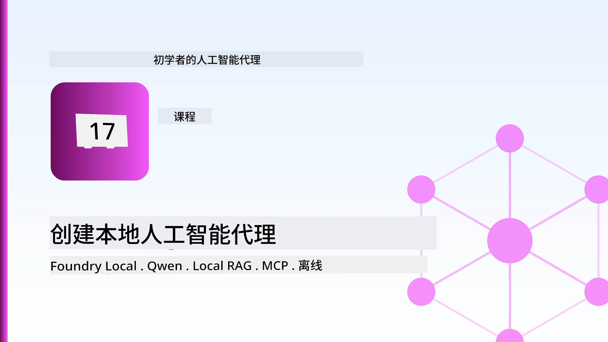
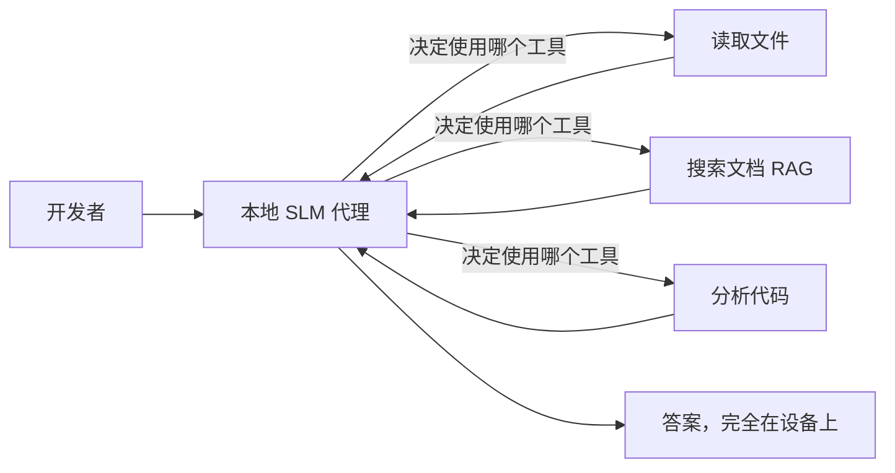
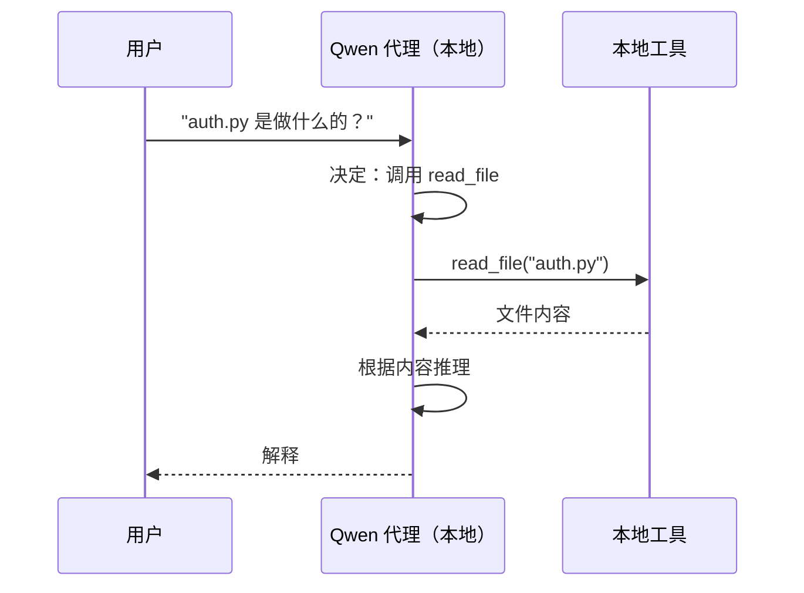
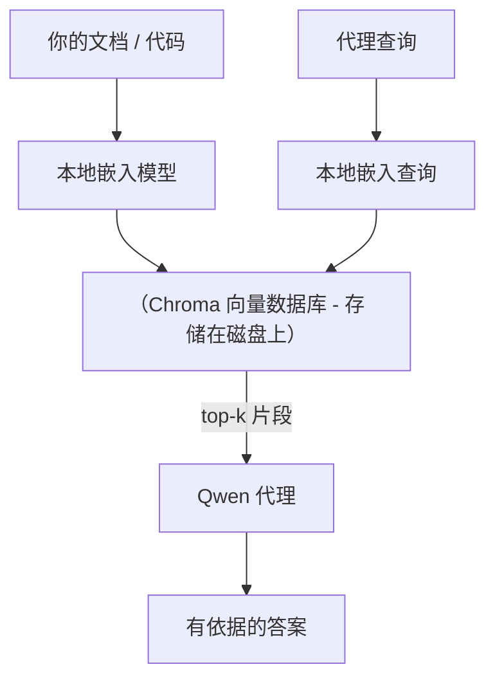
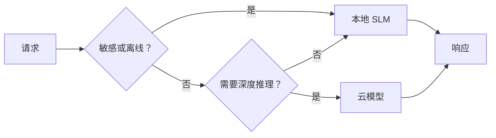

# 使用 Microsoft Foundry Local 和 Qwen 创建本地 AI 代理



上一课讲的是将代理扩展到云端。这一课则是把它们“拉下”到单台机器上。到最后你将拥有一个能进行推理、调用工具、读取文件和搜索文档的工作工程助手——**无需一次云端推理调用。**

为什么需要这样？真实工程工作中经常遇到三个原因：

- **隐私。** 代码和文档永远不会离开机器。没有提示词，没有代码片段，没有客户数据穿越网络边界。
- **成本。** 本地推理没有按令牌计费。你可以全天迭代，只需支付电费。
- **离线。** 在飞机上、在安全设施中或中断期间，代理依然工作。

关键是你用你的 CPU、GPU 或 NPU 运行一个<strong>小型语言模型（SLM）</strong>，以此换取前沿云模型。这一课关于在该限制内构建<em>优秀</em>代理，而不是假装这个限制不存在。

## 介绍

本课将涵盖：

- **小型语言模型（SLMs）**——它们是什么，擅长什么，不擅长什么。
- **Microsoft Foundry Local**——一个运行时，在设备上下载并服务模型，通过<strong>兼容 OpenAI 的 API</strong>。
- **Qwen 函数调用模型**——可靠生成工具调用的 SLM，使本地<em>代理</em>（不仅是本地聊天）成为可能。
- **本地工具、本地 RAG 和本地 MCP**——给予代理无云能力。
- <strong>混合模式</strong>——何时保持本地，何时调用云端。

## 学习目标

完成本课后，你将会：

- 解释 SLM 的利弊并挑选合适的本地代理用例。
- 使用 Foundry Local 本地服务 Qwen 模型，并通过兼容 OpenAI 的端点连接。
- 构建一个完全运行在工作站上的工具调用代理。
- 使用本地向量数据库（Chroma）为自己的文档添加本地 RAG。
- 将代理连接到本地 MCP 服务器，探讨本地/云混合设计。

## 先决条件

本课程假设你已经完成早期课程，并熟悉：

- [工具使用](../04-tool-use/README.md)（第4课）和[代理 RAG](../05-agentic-rag/README.md)（第5课）。
- [代理协议 / MCP](../11-agentic-protocols/README.md)（第11课）。
- [微软代理框架](../14-microsoft-agent-framework/README.md)（第14课）。

你还需要：

- 一台开发者工作站。**8 GB 内存为现实最低配置**；16 GB 以上更加舒适。有 GPU 或 NPU 有帮助但非必需。
- 安装<strong>Microsoft Foundry Local</strong>（参见下方安装部分）。
- Python 3.12+ 和仓库中 [`requirements.txt`](../../../requirements.txt) 的包，以及本课需要的 `foundry-local-sdk`、`openai` 和 `chromadb`。

## 小型语言模型：本地工作的合适工具

前沿云模型有数千亿参数，并由数据中心支撑。SLM 有十亿参数量级，必须放进你的笔记本内存。这个差异定出了明确的期望。

**SLMs 擅长：**

- 结构化、有界的任务——分类、提取、摘要已知文档。
- <strong>工具调用</strong>——决定调用哪个函数以及使用何种参数。
- 快速、廉价、私密地在自己的数据上迭代。

**SLMs 不擅长：**

- 基于大上下文的开放式多跳推理。
- 宽泛的世界知识（见识较少，遗忘更多）。

因此，本地代理的制胜策略是：**让 SLM 负责编排，让工具做繁重工作。** 模型不需要<em>理解</em>你的代码库——它只需要知道何时调用 `read_file` 和 `search_docs`。这正好发挥了 SLM 的优势。



## Microsoft Foundry Local

**Microsoft Foundry Local** 是一个轻量级运行时，在你的机器上下载、管理并服务模型。它对我们最重要的特性是提供了一个<strong>兼容 OpenAI 的 HTTP 端点</strong>——这意味着 OpenAI SDK 以及微软代理框架的 OpenAI 客户端只需修改 `base_url` 即可访问它。你构建代理时学到的一切都可直接迁移；唯一变化是端点从云端切换到 `localhost`。

Foundry Local 还能自动为你的硬件选择最优模型版本——CPU 版本、CUDA/GPU 版本或 NPU 版本——所以你不必为每台机器手动优化。

### 安装

安装 Foundry Local（参见你的操作系统的[文档](https://learn.microsoft.com/azure/ai-foundry/foundry-local/)），确认其可用：

```bash
# 安装（示例；请按照您的平台文档操作）
winget install Microsoft.FoundryLocal      # Windows（视窗）
# brew install microsoft/foundrylocal/foundrylocal   # macOS（苹果操作系统）

# 下载并运行 Qwen 模型，然后启动本地服务
foundry model run qwen2.5-7b-instruct
foundry service status
```

服务启动后你将拥有本地的、兼容 OpenAI 的端点（通常是 `http://localhost:PORT/v1`）。记事本用 `foundry-local-sdk` 自动发现端点，不需硬编码端口。

## Qwen 函数调用：它的重要性

代理只有能够调用工具才是真代理。很多 SLM 能聊天但生成不可靠、格式错误的工具调用。**Qwen** 模型专门训练函数调用，能稳定输出格式良好的工具调用结构——这正是将本地聊天模型变成本地<em>代理</em>的关键。

流程是你熟悉的标准工具调用循环，只是在设备端运行：



## 本地 RAG

文档搜索是本地代理的核心价值。与其指望 SLM 记住你的框架文档，不如将文档嵌入<strong>本地向量数据库</strong>，让代理按需检索相关片段。

我们使用<strong>Chroma</strong>，一个嵌入式向量存储，无需服务器，内嵌进进程。流程完全部署本地：本地嵌入模型 → 本地向量 → 本地检索 → 本地 SLM。



这就是第 5 课的 Agentic RAG 模式——唯一的变化是所有组件都运行在你的机器上。

## 本地 MCP 服务器

[MCP](../11-agentic-protocols/README.md) 是传输协议，不是云服务。MCP 服务器可作为本地进程在 `stdio` 上运行，用标准协议向代理暴露工具。这让你能完全离线复用不断增长的 MCP 服务生态——文件系统访问、git 操作、数据库查询等。

安全态势与云不同，但并非不存在：本地 MCP 服务器运行于你用户权限之下，因此要限制其作用范围（如项目目录，而非整个家目录），并把它的输出作为输入进行验证。

## 混合云-本地模式

本地优先不等于仅本地。成熟系统按敏感性和任务难度路由：

| 情况 | 运行位置 |
| --- | --- |
| 敏感代码/数据或离线时 | **本地 SLM** |
| 简单、有界任务 | **本地 SLM**（廉价且快速） |
| 复杂多跳推理，非敏感数据 | <strong>云模型</strong> |
| 中断期间处理所有任务 | **本地 SLM**（优雅降级） |

这与第 16 课的<strong>模型路由</strong>思路类似——不同的是，这次“模型”之一是你自己的机器。健壮设计需在云不可用时回退本地，让代理质量降级而非完全失败。



## 实操实验：本地工程助手

打开 [`code_samples/17-local-agent-foundry-local.ipynb`](./code_samples/17-local-agent-foundry-local.ipynb) 并完成练习。你将构建一个<strong>完全在工作站运行的本地工程助手</strong>，它能：

1. <strong>调用工具</strong>——通过 Foundry Local 上的 Qwen 函数调用实现。
2. <strong>执行本地文件操作</strong>——列出和读取项目目录的文件。
3. <strong>分析代码</strong>——报告源文件的基础指标。
4. <strong>搜索文档</strong>——使用 Chroma 对文档文件夹执行本地 RAG。
5. **使用 MCP**——连接本地 MCP 服务器（若未配置则优雅跳过）。

全程不使用云端推理。

### 逐步讲解

助手通过兼容 OpenAI 的端点连接 Foundry Local，因此代理代码与云课程几乎相同——唯一差别是客户端:

```python
from foundry_local import FoundryLocalManager
from openai import OpenAI

# Foundry Local 发现/下载模型并提供本地端点。
manager = FoundryLocalManager(\"qwen2.5-7b-instruct\")
client = OpenAI(base_url=manager.endpoint, api_key=manager.api_key)  # api_key 是本地占位符
```

工具是作用于项目目录的普通 Python 函数：

```python
def read_file(path: str) -> str:
    \"\"\"Read a file, but only inside the sandboxed project directory.\"\"\"
    full = (PROJECT_ROOT / path).resolve()
    if PROJECT_ROOT not in full.parents and full != PROJECT_ROOT:
        return \"Access denied: path is outside the project directory.\"
    return full.read_text(encoding=\"utf-8\")
```

注意沙箱检查——即使是本地，能读取任意路径的工具也是安全隐患。记事本确保所有工具都限定在单一项目根目录下。

## 知识检测

在开始作业前测试你的理解。

**1. 举出两个在本地运行代理而非云端的具体理由。**

<details>
<summary>答案</summary>

任意两个：<strong>隐私</strong>（代码和数据未离开机器）、<strong>成本</strong>（无按令牌推理计费）、<strong>离线能力</strong>（无网络时仍可使用——在飞机上、安全设施或停电期间）。监管合规限制不得将数据传出设备是隐私原因的常见驱动力。
</details>

**2. 在本地代理中，SLM 和其工具的推荐分工是什么，为什么？**

<details>
<summary>答案</summary>

让 SLM <strong>负责编排</strong>（决定调用哪个工具及参数），让<strong>工具完成繁重工作</strong>（读文件、检索文档、计算结果）。SLM 擅长有限决策如工具选择，不擅长广泛知识与多跳推理，依赖工具符合模型特性。
</details>

**3. 是什么使得我们能用 Foundry Local 重用云代理代码？**

<details>
<summary>答案</summary>

Foundry Local 提供一个<strong>兼容 OpenAI 的 HTTP 端点</strong>。OpenAI SDK 和代理框架的客户端只需修改`base_url`（并使用本地占位 API Key）即可访问。代理代码的其他部分保持不变。
</details>

**4. 我们为何特别使用 Qwen 函数调用模型而非任意 SLM？**

<details>
<summary>答案</summary>

因为代理必须生成可靠、格式良好的<strong>工具调用</strong>。许多 SLM 可聊天，但输出的工具调用结构格式错误或不一致。Qwen 模型经过函数调用训练，产出一致的工具调用，正是使本地聊天模型成为可用本地代理的关键。
</details>

**5. 在本地 RAG 流程中，哪些组件在你的机器上运行？**

<details>
<summary>答案</summary>

全部：嵌入模型、本地向量数据库（Chroma，磁盘上）、检索步骤和 SLM。文档本地嵌入，本地存储，本地检索，本地模型推理——无一涉及云端。
</details>

**6. 本地 MCP 服务器运行在你的机器上，是否自动意味着安全？你还应采取什么预防措施？**

<details>
<summary>答案</summary>

不。MCP 服务器以你的用户权限运行，因此能访问你能访问的任何内容。应限定其作用范围（如限定为单个项目目录而非整个家目录），并对其输出作为输入进行验证后再操作。
</details>

**7. 描述一个合理的包含本地模型的混合路由规则。**

<details>
<summary>答案</summary>

将敏感或离线请求路由给本地 SLM；将简单、有界任务路由给本地 SLM 以节省成本和提升速度；将复杂多跳推理（非敏感数据）路由给云模型；云端不可用时回退本地 SLM，使代理优雅降级而非失败。这是第 16 课模型路由方案，将本地机器作为模型之一。
</details>

**8. 本课运行本地代理的现实最低内存要求是多少？更多内存带来什么？**

<details>
<summary>答案</summary>

约<strong>8 GB</strong>为现实最低，16 GB 以上更舒适。更多内存让你能运行更大更强模型，并缓存更多上下文。GPU 或 NPU 加速推理更快，但非必需——无加速时 Foundry Local 自动选择 CPU 版本。
</details>

## 作业

将本地工程助手扩展为你选择的小型项目的<strong>本地文档审阅助手</strong>（若愿意可用本仓库的任一课程序列文件夹）。

你的提交应：

1. **将真实文档/代码文件夹索引入 Chroma**（至少五个文件）。
2. **添加一个 `find_todos` 工具**，扫描项目中`TODO`/`FIXME`注释，并返回其文件和行号——需保持与 `read_file` 相同的沙箱检查。

3. <strong>向代理提三个问题</strong>，迫使它结合工具：一个纯RAG问题，一个需要读取特定文件的问题，和一个需要查找TODO的问题。
4. <strong>测量它</strong>：计时这三个响应的时间并在markdown单元中记录。评论延迟是否对你预期的工作流来说是可接受的。

然后写一小段关于<strong>你会将哪些部分迁移到云端，哪些部分保留在本地</strong>给这个评审者，以及原因。评估标准是本地组件的连接是否正确，混合推理是否合理——不评价模型质量。

## 总结

在本课中，你构建了一个完全运行在你自己机器上的代理：

- **SLMs** 以隐私、成本和离线操作为代价换取广度——当它们<strong>协调工具</strong>时发挥优势，而不是自己携带所有知识。
- **Foundry Local** 在设备上服务模型，提供一个<strong>兼容OpenAI的端点</strong>，这样你的云端代理代码只需一行修改即可迁移。
- **Qwen函数调用模型** 使本地可靠调用工具——因此也使本地<em>代理</em>成为可能。
- **本地RAG**（Chroma）和<strong>本地MCP</strong>赋予代理能力而无需离开机器。
- <strong>混合模式</strong> 允许你根据敏感度和难度路由，本地作为一个优雅的回退方案。

这完成了部署弧线：第16课将代理扩展到Microsoft Foundry，本课将其缩减到单个工作站。下一课将转向保持部署代理的安全。

## 补充资源

- <a href="https://learn.microsoft.com/azure/ai-foundry/foundry-local/" target="_blank">Microsoft Foundry Local 文档</a>
- <a href="https://learn.microsoft.com/azure/ai-foundry/what-is-azure-ai-foundry" target="_blank">Microsoft Foundry 文档</a>
- <a href="https://learn.microsoft.com/en-us/agent-framework/overview/?wt.mc_id=youtube_26688_organicsocial_reactor&pivots=programming-language-python" target="_blank">Microsoft Agent Framework</a>
- <a href="https://qwen.readthedocs.io/en/latest/framework/function_call.html" target="_blank">Qwen函数调用文档</a>
- <a href="https://modelcontextprotocol.io/" target="_blank">模型上下文协议（MCP）</a>
- <a href="https://docs.trychroma.com/" target="_blank">Chroma向量数据库</a>

## 上一课

[部署可扩展代理](../16-deploying-scalable-agents/README.md)

## 下一课

[保障AI代理安全](../18-securing-ai-agents/README.md)

---

<!-- CO-OP TRANSLATOR DISCLAIMER START -->
**免责声明**：
本文件由 AI 翻译服务 [Co-op Translator](https://github.com/Azure/co-op-translator) 翻译完成。尽管我们力求准确，但请注意，自动翻译可能包含错误或不准确之处。原始语言版文件应视为权威来源。对于重要信息，建议使用专业人工翻译。我们对因使用本翻译而产生的任何误解或误释不承担责任。
<!-- CO-OP TRANSLATOR DISCLAIMER END -->