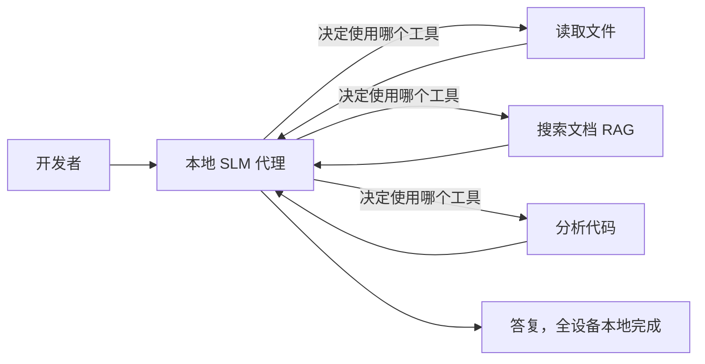
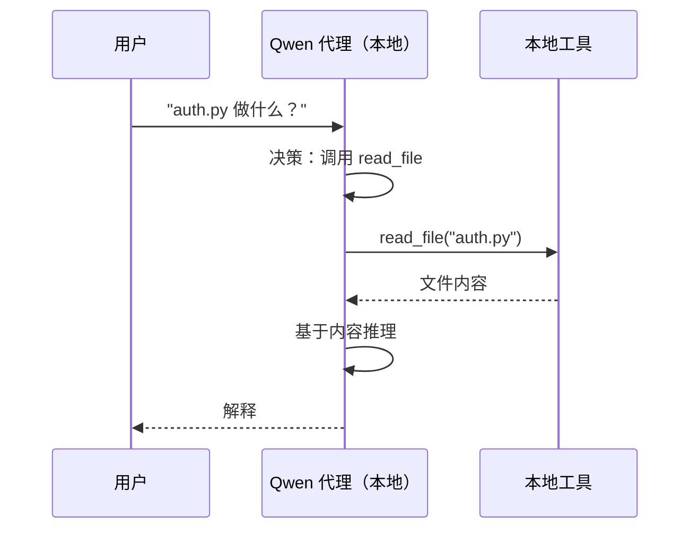
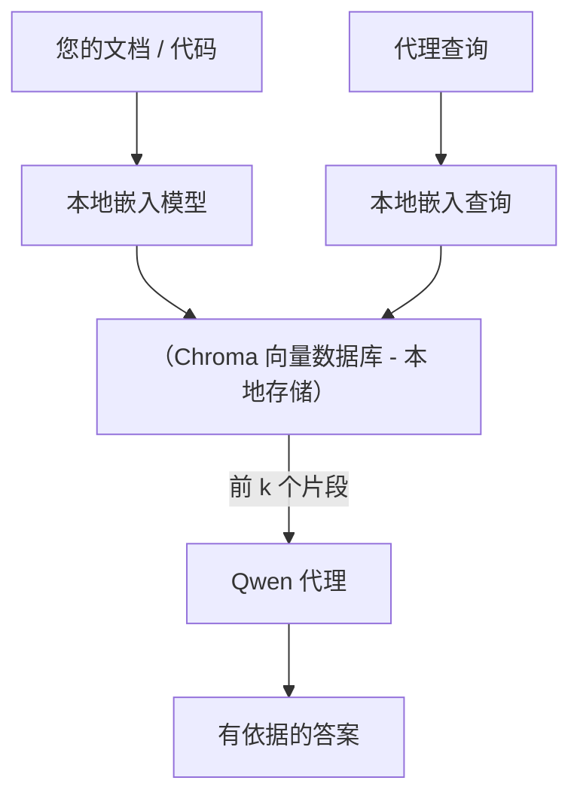
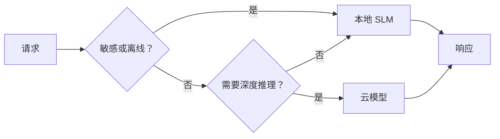

# 使用 Microsoft Foundry Local 和 Qwen 创建本地 AI 代理


上一课将代理扩展到云端。这一课则将它们带回到单机环境中。到最后，你将拥有一个工作中的工程助理，它能推理、调用工具、读取你的文件并搜索你的文档 — **无需任何云推理调用。**

为什么你会想要这样？在实际工程工作中有三个常见原因：

- **隐私。** 代码和文档永远不会离开机器。没有提示语、代码片段或客户数据会穿越网络边界。
- **成本。** 本地推理没有基于每个 token 的计费。你可以整天迭代，费用仅是电费。
- **离线。** 在飞机上、在安全设施内或停电期间，代理仍然能工作。

要点是你需要用一个运行在 CPU、GPU 或 NPU 上的 **小型语言模型（SLM）** 替代前沿的云端模型。本课讲的是如何在这一限制下构建<em>表现良好</em>的代理，而不是假装这限制不存在。

## 介绍

本课将涵盖：

- **小型语言模型（SLMs）** — 它们是什么，在哪些场景表现出色，哪些场景不适合。
- **Microsoft Foundry Local** — 一个可在设备上下载并服务模型的运行时，提供一个<strong>兼容 OpenAI 的 API</strong>。
- **Qwen 函数调用模型** — 可靠产生工具调用的小型语言模型，使得本地<em>代理</em>（而不仅仅是本地聊天）成为可能。
- **本地工具、本地 RAG 和本地 MCP** — 赋予代理无云能力。
- <strong>混合模式</strong> — 何时保持本地，何时调用云服务。

## 学习目标

完成本课后，你将能够：

- 解释 SLM 的权衡并选择合适的本地代理使用场景。
- 使用 Foundry Local 在本地部署 Qwen 模型并通过兼容 OpenAI 的端点进行连接。
- 构建完全运行在工作站上的工具调用代理。
- 使用本地向量数据库（Chroma）为自己的文档添加本地 RAG。
- 将代理连接到本地 MCP 服务器，并思考混合本地/云端设计方案。

## 先决条件

本课假设你已完成之前课程，并熟悉：

- [工具使用](../04-tool-use/README.md)（第4课）和 [Agentic RAG](../05-agentic-rag/README.md)（第5课）。
- [Agentic 协议 / MCP](../11-agentic-protocols/README.md)（第11课）。
- [Microsoft Agent Framework](../14-microsoft-agent-framework/README.md)（第14课）。

你还需要：

- 一台开发工作站。**8 GB 内存是现实的最低要求**；16 GB 以上更为舒适。拥有 GPU 或 NPU 有帮助但非必须。
- 已安装 **Microsoft Foundry Local**（见下面的安装部分）。
- Python 3.12+ 及本仓库 [`requirements.txt`](../../../requirements.txt) 中的包，以及本课所需的 `foundry-local-sdk`、`openai` 和 `chromadb`。

## 小型语言模型：本地工作的合适工具

前沿云模型有上千亿参数和数据中心支持，而 SLM 有几十亿参数，必须适配你笔记本的内存。这种差异带来了明确的期望。

**SLMs 擅长：**

- 结构化且有界的任务 — 分类、抽取、已知文档的总结。
- <strong>调用工具</strong> — 决定调用哪个函数以及传入哪些参数。
- 快速、廉价、私密地对你自己的数据迭代。

**SLMs 较弱的方面：**

- 开放式、多跳推理跨越大上下文。
- 广泛的世界知识（看得少，遗忘多）。

因此，本地代理的制胜策略是：**让 SLM 进行编排，让工具承担重活。** 模型不需要<em>了解</em>你的代码库；它需要知道何时调用 `read_file` 和 `search_docs`。这正好发挥了 SLM 的优势。



## Microsoft Foundry Local

**Microsoft Foundry Local** 是一个轻量级运行时，能够在你的机器上下载、管理并服务模型。对我们最重要的功能是它暴露了一个<strong>兼容 OpenAI 的 HTTP 端点</strong> — 这意味着你只需更改 `base_url`，OpenAI SDK 和 Microsoft Agent Framework 的 OpenAI 客户端就能够使用它。你关于构建代理的所有知识都可直接迁移；唯一变化是端点从云端移到 `localhost`。

Foundry Local 还能根据你的硬件自动选择最优模型版本 — CPU 版本、CUDA/GPU 版本或 NPU 版本 — 省去你为每台机器手动优化。

### 安装

安装 Foundry Local（参考对应操作系统的[文档](https://learn.microsoft.com/azure/ai-foundry/foundry-local/)），然后确认运行正常：

```bash
# 安装（示例；请参阅您平台的文档）
winget install Microsoft.FoundryLocal      # Windows
# brew install microsoft/foundrylocal/foundrylocal   # macOS

# 下载并运行 Qwen 模型，然后启动本地服务
foundry model run qwen2.5-7b-instruct
foundry service status
```

服务启动后，你就拥有了一个本地兼容 OpenAI 的端点（通常为 `http://localhost:PORT/v1`）。笔记本使用 `foundry-local-sdk` 自动发现端点，因此你无需写死端口号。

## Qwen 函数调用：重要性

一个代理只有能够调用工具时才是代理。许多 SLM 可以聊天，但无法可靠地产生规范的工具调用。**Qwen** 模型经过专门训练以生成函数调用，能够持续输出结构良好的工具调用，这正是将本地聊天模型变成本地<em>代理</em>的关键。

该流程是你已熟悉的标准工具调用循环，只是运行在本地设备上：



## 本地 RAG

文档搜索是本地代理发光发热的地方。你不必指望 SLM 记住你的框架文档，而是将文档嵌入<strong>本地向量数据库</strong>，让代理按需检索相关段落。

我们使用 **Chroma**，一个嵌入式向量存储，无需额外服务管理。整个流程均为本地：本地嵌入模型 → 本地向量 → 本地检索 → 本地 SLM。



这是第五课中 Agentic RAG 模式的复现 — 唯一的区别在于每个组件都运行在你的机器上。

## 本地 MCP 服务器

[MCP](../11-agentic-protocols/README.md) 是一种传输协议，而非云服务。MCP 服务器可以作为本地进程运行，通过标准协议通过 `stdio` 向代理暴露工具。这让你可以离线重用日益丰富的 MCP 服务器生态 — 文件系统访问、git 操作、数据库查询等。

安全姿态不同于云端，但并非不存在：本地 MCP 服务器仍以你的用户权限运行，因此应限制其可访问范围（例如项目目录，而非整个家目录），并将其输出视作输入进行验证。

## 混合云与本地模式

本地优先不等于只用本地。成熟系统根据敏感度和难度路由：

| 场景 | 运行位置 |
| --- | --- |
| 敏感代码/数据，或离线时 | **本地 SLM** |
| 简单、有界任务 | **本地 SLM**（廉价快速） |
| 非敏感数据上的复杂多跳推理 | <strong>云模型</strong> |
| 故障期间的所有任务 | **本地 SLM**（优雅降级） |

这呼应了第16课的<strong>模型路由</strong>思想 —— 不同的是其中一个“模型”是你自己的机器。一个健壮的设计是在云不可用时回退到本地，使代理质量下降，而不是直接失败。



## 实操实验：本地工程助理

打开 [`code_samples/17-local-agent-foundry-local.ipynb`](./code_samples/17-local-agent-foundry-local.ipynb) 并跟随完成。你将构建一个<strong>完全运行在工作站上的本地工程助理</strong>，它能：

1. <strong>调用工具</strong> — 通过 Foundry Local 的 Qwen 函数调用。
2. <strong>执行本地文件操作</strong> — 列出和读取项目目录中的文件。
3. <strong>分析代码</strong> — 报告源文件的基本指标。
4. <strong>搜索文档</strong> — 通过 Chroma 在文档文件夹上进行本地 RAG。
5. **使用 MCP** — 连接本地 MCP 服务器（如无配置则优雅跳过）。

全程无需调用云端推理。

### 解析

助理通过兼容 OpenAI 的端点连接 Foundry Local，因此代理代码和云端课程几乎一致，仅客户端不同：

```python
from foundry_local import FoundryLocalManager
from openai import OpenAI

# Foundry Local 发现/下载模型并为我们提供本地端点。
manager = FoundryLocalManager(\"qwen2.5-7b-instruct\")
client = OpenAI(base_url=manager.endpoint, api_key=manager.api_key)  # api_key 是本地占位符
```

工具是限定在项目目录内的普通 Python 函数：

```python
def read_file(path: str) -> str:
    \"\"\"Read a file, but only inside the sandboxed project directory.\"\"\"
    full = (PROJECT_ROOT / path).resolve()
    if PROJECT_ROOT not in full.parents and full != PROJECT_ROOT:
        return \"Access denied: path is outside the project directory.\"
    return full.read_text(encoding=\"utf-8\")
```

注意沙箱检查 — 即便在本地，读取任意路径的工具依然是安全隐患。笔记本确保所有工具都限定在单一项目根目录内。

## 知识检测

在进入作业之前测试你的理解。

**1. 给出两个将代理放在本地运行而非云端的具体理由。**

<details>
<summary>答案</summary>

任选两条：<strong>隐私</strong>（代码和数据始终保留在机器内）、<strong>成本</strong>（无基于令牌的推理费用）和<strong>离线能力</strong>（无网络也可运行——如飞机上、安全场所或停电时）。法规和合规限制禁止数据离开设备是隐私理由的常见驱动力。
</details>

**2. 在本地代理中，推荐的 SLM 与工具的分工是什么？为什么？**

<details>
<summary>答案</summary>

让 SLM <strong>负责编排</strong>（决定调用哪个工具及参数），让<strong>工具负责繁重任务</strong>（读取文件、检索文档、计算结果）。SLM 对有界决策如工具选择擅长，但在广泛知识和长多跳推理方面较弱，依赖工具能发挥其优势。
</details>

**3. 是什么让我们能用 Foundry Local 重用云端代理代码？**

<details>
<summary>答案</summary>

Foundry Local 提供了一个<strong>兼容 OpenAI 的 HTTP 端点</strong>。只需更改 `base_url`（并使用本地占位 API key），OpenAI SDK 和 Agent Framework 的客户端即可使用。代理代码的其他部分保持不变。
</details>

**4. 为什么特意选择 Qwen 函数调用模型，而非任意 SLM？**

<details>
<summary>答案</summary>

因为代理必须产生可靠、格式正确的<strong>工具调用</strong>。许多 SLM 可用于聊天但输出的工具调用结构不规范或不一致。Qwen 模型训练专注于函数调用，输出一致的工具调用，正是将本地聊天模型转变为有效本地代理的关键。
</details>

**5. 在本地 RAG 流程中，哪些组件运行在机器上？**

<details>
<summary>答案</summary>

全部：嵌入模型、向量数据库（Chroma，存储在磁盘上）、检索步骤和 SLM。文档本地嵌入、本地存储、本地检索、本地模型推理—无组件接触云端。
</details>

**6. 本地 MCP 服务器运行在你的机器上，这是否意味着它自动安全？你还应采取什么预防措施？**

<details>
<summary>答案</summary>

否。本地 MCP 服务器以你的用户权限运行，因此能访问你能访问的所有内容。应限制其范围（例如单一项目目录而非整个家目录），并将其输出作为输入验证，确保安全后再使用。
</details>

**7. 描述一个包含本地模型的合理混合路由规则。**

<details>
<summary>答案</summary>

将敏感或离线请求路由到本地 SLM；将简单有界任务也路由到本地 SLM 以提高速度和降低成本；将非敏感数据上的复杂多跳推理路由到云模型；当云不可用时回退到本地 SLM，使代理优雅降级而非完全失败。这是 第16课 的模型路由，且本地机器作为模型之一。
</details>

**8. 运行本课本地代理的现实最低内存需求是多少？更多内存带来什么好处？**

<details>
<summary>答案</summary>

约 **8 GB** 是现实的最低需求，16 GB 以上更舒适。更多内存让你运行更大更强的模型，并能保持更多上下文在内存中。GPU 或 NPU 可加速推理，但非必需——在无硬件加速时，Foundry Local 会选用 CPU 版本。
</details>

## 作业

将本地工程助理扩展为你选择的小型项目的<strong>本地文档审阅助手</strong>（如果愿意，可使用本仓库的任一课程文件夹）。

你的提交应包括：

1. **将真实文档/代码文件夹索引到 Chroma**（至少包含五个文件）。
2. **新增 `find_todos` 工具**，扫描项目中的 `TODO`/`FIXME` 注释并返回含文件名和行号的列表 — 并保持与 `read_file` 一致的沙箱检查。

3. <strong>向代理提问三个问题</strong>，迫使它结合多种工具：一个纯RAG问题，一个需要读取特定文件的问题，以及一个需要查找TODO的问题。
4. <strong>进行测量</strong>：对这三个回答分别计时，并在一个markdown单元中记录。评论延迟是否符合你预期的工作流程。

然后写一段简短的文字说明<strong>你将把哪些部分迁移到云端，哪些部分保留在本地</strong>，以及原因。评分标准是本地组件是否正确连接，以及你的混合推理是否合理——而非模型质量。

## 总结

在本课中，你构建了一个完全在自己的机器上运行的代理：

- **SLMs** 用隐私、成本和脱机操作换取广度——当它们<strong>协调工具</strong>时而不是自己承载所有知识时表现出色。
- **Foundry Local** 在设备端通过一个<strong>兼容OpenAI的端点</strong>提供模型服务，因此你的云端代理代码只需一行修改即可迁移。
- **Qwen函数调用模型** 使本地可靠调用工具成为可能，因此也实现了本地<em>代理</em>。
- **本地RAG**（Chroma）和<strong>本地MCP</strong>为代理提供能力，无需离开设备。
- <strong>混合模式</strong> 允许你根据敏感性和难度路由，本地作为优雅的回退方案。

这完成了部署的全流程：第16课将代理扩展到了Microsoft Foundry，本课则将其缩减到单个工作站。下一课将关注保持已部署代理的安全。

## 附加资源

- <a href="https://learn.microsoft.com/azure/ai-foundry/foundry-local/" target="_blank">Microsoft Foundry Local 文档</a>
- <a href="https://learn.microsoft.com/azure/ai-foundry/what-is-azure-ai-foundry" target="_blank">Microsoft Foundry 文档</a>
- <a href="https://learn.microsoft.com/en-us/agent-framework/overview/?wt.mc_id=youtube_26688_organicsocial_reactor&pivots=programming-language-python" target="_blank">Microsoft Agent Framework</a>
- <a href="https://qwen.readthedocs.io/en/latest/framework/function_call.html" target="_blank">Qwen函数调用文档</a>
- <a href="https://modelcontextprotocol.io/" target="_blank">模型上下文协议 (MCP)</a>
- <a href="https://docs.trychroma.com/" target="_blank">Chroma向量数据库</a>

## 前一课

[部署可扩展代理](../16-deploying-scalable-agents/README.md)

## 下一课

[保障AI代理安全](../18-securing-ai-agents/README.md)

---

<!-- CO-OP TRANSLATOR DISCLAIMER START -->
**免责声明**：
本文件由 AI 翻译服务 [Co-op Translator](https://github.com/Azure/co-op-translator) 翻译完成。尽管我们力求准确，但请注意，自动翻译可能包含错误或不准确之处。原始语言版文件应视为权威来源。对于重要信息，建议使用专业人工翻译。我们对因使用本翻译而产生的任何误解或误释不承担责任。
<!-- CO-OP TRANSLATOR DISCLAIMER END -->