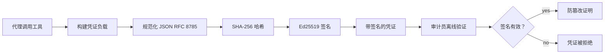
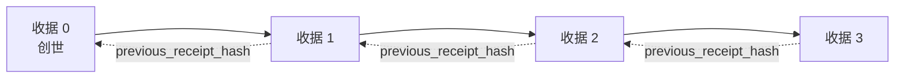

[观看课程视频：使用加密收据保护 AI 代理](https://youtu.be/PLACEHOLDER_VIDEO_ID)

> _(课程视频和缩略图将在合并后由微软内容团队添加，符合第14 / 15课的模式。)_

# 使用加密收据保护 AI 代理

## 简介

本课将涵盖：

- 为什么 AI 代理的审计追踪对于合规、调试和信任至关重要。
- 什么是加密收据，它与未签名的日志行有何不同。
- 如何用纯 Python 生成代理工具调用的签名收据。
- 如何离线验证收据并检测篡改。
- 如何链接收据，使得删除或重新排序任一收据将破坏整个链条。
- 收据能证明什么，明确不能证明什么。

## 学习目标

完成本课后，你将了解如何：

- 识别促使为代理动作提供加密溯源的失败模式。
- 对规范 JSON 负载生成 Ed25519 签名的收据。
- 仅使用签名者的公钥独立验证收据。
- 通过重新验证被篡改的收据来检测篡改。
- 构建哈希链式收据序列并解释链条为何重要。
- 辨识收据能证明的边界（归属、完整性、顺序）及不能证明的内容（动作正确性、策略合理性）。

## 问题：你的代理的审计追踪

想象你部署了 Contoso Travel 的 AI 代理。该代理读取客户请求，调用航班 API 查询选项，并代表客户预订座位。上个季度，代理处理了 50,000 个预订。

今天审计员来了。他们问了一个简单的问题：“给我看一下你的代理做了什么。”

你递交了日志文件。审计员看过后提出了更难的问题：“我怎么知道这些日志没有被篡改？”

这就是审计追踪的问题。当前大多数代理部署依赖：

- <strong>应用日志</strong>：代理自身写入，任何有文件系统访问权限的人都能编辑。
- <strong>云日志服务</strong>：在平台级别防篡改，但前提是审计员信任平台运营商。
- <strong>数据库事务日志</strong>：适合数据库变更审计，但不适用于任意工具调用。

这些都无法回答审计员的问题，除非审计员信任某方（你、你的云服务提供商或数据库供应商）。对内部使用，这种信任通常可接受。但对受监管工作负载（金融、医疗、欧盟 AI 法案监管等）则不可。

加密收据通过让每次代理动作独立可验证来解决此问题。审计员无需信任你，只需要公钥和收据本身。

## 什么是加密收据？

收据是用数字签名记录代理操作的 JSON 对象。



一个最小的收据如下：

```json
{
  "type": "agent.tool_call.v1",
  "agent_id": "contoso-travel-bot",
  "tool_name": "lookup_flights",
  "tool_args_hash": "sha256:a3f9c1...",
  "result_hash": "sha256:7b2e1d...",
  "policy_id": "contoso-travel-policy-v3",
  "timestamp": "2026-04-25T14:30:00Z",
  "sequence": 47,
  "previous_receipt_hash": "sha256:9d4e6a...",
  "signature": {
    "alg": "EdDSA",
    "sig": "c5af83...",
    "public_key": "8f3b2c..."
  }
}
```

三个属性完成核心工作：

1. <strong>签名</strong>。收据由代理网关使用 Ed25519 私钥签名。任何持有对应公钥的人均可离线验证签名。任一字段被篡改都会导致签名无效。

2. <strong>规范编码</strong>。签名前，收据使用 JSON 规范化方案（JCS，RFC 8785）序列化。这保证不同实现生成相同逻辑收据时，字节输出完全相同。若无规范化，不同 JSON 序列化会导致相同内容产生不同签名。

3. <strong>哈希链</strong>。`previous_receipt_hash` 字段将每个收据与前一个关联。删除或重新排序收据会破坏后续所有收据。即使个别签名被绕过，链条级别也能检测篡改。

这三点共同保证：

- <strong>归属</strong>：此密钥签署此内容。
- <strong>完整性</strong>：内容自签署后未被更改。
- <strong>顺序</strong>：该收据在链中位于前一收据之后。

## 在 Python 中生成收据

你不需要特殊库来生成收据。密码学原语广泛可用，逻辑仅需几十行 Python 代码。

`code_samples/18-signed-receipts.ipynb` 的动手练习会完整演示流程。摘要如下：

```python
import json
import hashlib
import base64
from nacl import signing
from jcs import canonicalize  # RFC 8785 规范的 JSON

def b64url_nopad(data: bytes) -> str:
    return base64.urlsafe_b64encode(data).decode("ascii").rstrip("=")

def sha256_canonical(obj) -> str:
    """SHA-256 of a Python object's JCS-canonical JSON form."""
    return f"sha256:{hashlib.sha256(canonicalize(obj)).hexdigest()}"

# 生成或加载签名密钥（在生产环境中，存储在密钥库中）
signing_key = signing.SigningKey.generate()
verify_key = signing_key.verify_key

# 构建收据负载（尚未签名）
tool_args = {"origin": "SYD", "destination": "LAX"}
tool_result = [{"flight": "QF11", "price": 1850, "stops": 0}]

payload = {
    "type": "agent.tool_call.v1",
    "agent_id": "contoso-travel-bot",
    "tool_name": "lookup_flights",
    "tool_args_hash": sha256_canonical(tool_args),
    "result_hash": sha256_canonical(tool_result),
    "policy_id": "contoso-travel-policy-v3",
    "timestamp": "2026-04-25T14:30:00Z",
    "sequence": 0,
    "previous_receipt_hash": None,
}

# 规范化，哈希，签名。
canonical_bytes = canonicalize(payload)
message_hash = hashlib.sha256(canonical_bytes).digest()
signature_bytes = signing_key.sign(message_hash).signature

# 附加结构化签名对象。
receipt = {
    **payload,
    "signature": {
        "alg": "EdDSA",
        "sig": b64url_nopad(signature_bytes),
        "public_key": b64url_nopad(bytes(verify_key)),
    },
}
```

这就是整个签名流程。笔记本中的练习会逐步讲解每一步。

## 验证收据和检测篡改

验证是逆操作：

```python
import base64
import hashlib
from nacl import signing
from nacl.exceptions import BadSignatureError
from jcs import canonicalize

def b64url_decode(s: str) -> bytes:
    padding = "=" * ((4 - len(s) % 4) % 4)
    return base64.urlsafe_b64decode(s + padding)

def verify_receipt(receipt: dict) -> bool:
    # 签名是一个结构化对象：{"alg", "sig", "public_key"}。
    sig_obj = receipt.get("signature")
    if not sig_obj or sig_obj.get("alg") != "EdDSA":
        return False

    # 重建实际被签名的负载（除了签名之外的所有内容）。
    payload = {k: v for k, v in receipt.items() if k != "signature"}

    canonical_bytes = canonicalize(payload)
    message_hash = hashlib.sha256(canonical_bytes).digest()

    try:
        verify_key = signing.VerifyKey(b64url_decode(sig_obj["public_key"]))
        verify_key.verify(message_hash, b64url_decode(sig_obj["sig"]))
        return True
    except BadSignatureError:
        return False
```

此函数接受收据，签名有效返回 `True`，否则返回 `False`。无网络调用，无服务依赖，无需信任第三方。

为了展示篡改检测，笔记本演示了：

1. 生成有效收据并确认验证通过。
2. 修改 `tool_args_hash` 字段的一个字节。
3. 重新验证并观察失败。

这是收据防篡改性的实证示例：任何改动，无论多微小，都会破坏签名。

## 为多步骤代理链接收据

单个签名收据保护一次动作。收据链保护动作序列。



每个收据记录前一个收据的哈希。若攻击者想悄悄删除第2个收据，必须：

- 修改第3个收据的 `previous_receipt_hash` 字段（会破坏第3个收据签名），或者
- 伪造修改后的第3个收据签名（需要代理的私钥）。

若私钥存储于硬件密钥库，且每个收据都公布公钥，任一攻击都会被发现且不可行。

笔记本演示了：

1. 构建包含三个收据的链。
2. 验证每个收据的 `previous_receipt_hash` 是否与前一个收据的实际哈希匹配。
3. 对链中某个收据进行篡改，观察链条在该点断裂。

这就是你如何生成让外部审计员无需信任你也能核验的审计追踪。

## 收据能证明什么（不能证明什么）

这是本课最重要的内容。收据功能强大，但有边界。

**收据能证明三点：**

1. <strong>归属</strong>：具体密钥签署了具体负载。
2. <strong>完整性</strong>：负载自签署后未被更改。
3. <strong>顺序</strong>：该收据在哈希链中位于另一收据之后。

**收据不能证明：**

1. <strong>正确性</strong>：代理的动作是否正确。收据可以为错误答案生成签名，就像为正确答案一样干净。
2. <strong>策略合规性</strong>：`policy_id` 中指示的策略是否真正被评估，或如果检查是否会允许此动作。收据记录宣称的内容，而非执行结果。
3. <strong>密钥背后的身份</strong>：收据仅表明“此密钥签署此内容”，不表明“此人为此授权”。将密钥与人或组织连接需要额外身份设施（目录、公钥注册等）。
4. <strong>输入的真实性</strong>：若代理接收到篡改的提示并据此执行，收据忠实记录动作。收据是在输入验证之后，不能替代输入验证。

这一边界重要有两点：

- 告诉你收据的用处：让代理行为可审计且防篡改，甚至跨组织边界。
- 告诉你还需要哪些附加层：输入验证（第6课）、策略执行（下文简述）、身份设施（本课不涵盖）。

常见误区是认为“有收据就有治理”。非也。收据是基础。治理是你在此基础上构建的系统。

## 生产参考

本课 Python 代码故意简化，方便你阅读每行并准确理解。生产中有两种选择：

1. **直接基于密码学原语构建。** 上面展示的 50 行代码满足许多用例。PyNaCl (Ed25519) 和 `jcs` 包（规范 JSON）是维护良好且经过审计的库。

2. **使用生产级收据库。** 多个开源项目在同模式基础上实现，附加功能（密钥轮换、批量验证、JWK 集分发、与策略引擎集成）：
   - 本课收据格式符合 IETF 互联网草案（`draft-farley-acta-signed-receipts`），目前处于标准流程中。
   - Microsoft Agent Governance Toolkit 结合 Cedar 策略决策管理收据；详见该仓库教程 33，完整示例。
   - `protect-mcp`（npm）和 `@veritasacta/verify`（npm）包提供基于 Node 的收据签名及离线验证实现，适合为任何 MCP 服务器构建防篡改审计链。
   - **[nobulex](https://github.com/arian-gogani/nobulex)** Python SDK（`pip install nobulex`）提供同样的 Ed25519 + JCS 签名方案，包含 LangChain 和 CrewAI 集成，发布了跨验证测试向量及通过 [OWASP PR #2210](https://github.com/OWASP/CheatSheetSeries/pull/2210) 贡献的合规性映射。

自行实现和使用库的选择类似于自己写 JWT 库和使用成熟库的抉择：两者都合理；库省时且减少审计风险；自己写强迫你理解每个原语。本课教授自下而上路径，为任一方案奠定基础。

## 知识检测

练习前先自测理解。

**1. 收据由代理的 Ed25519 私钥签名，审计员仅有公钥。审计员能否离线验证收据？**

<details>
<summary>答案</summary>

能。Ed25519 验证只需公钥和签名字节。无网络调用，无服务依赖。这使得收据在隔离网络、多组织或低信任审计环境中有用。
</details>

**2. 攻击者修改了收据中的 `policy_id` 字段，声称受更宽松策略管辖。签名是对原始负载的。验证时会如何？**

<details>
<summary>答案</summary>

验证失败。签名是对原始负载的规范字节计算，任何字段修改导致字节变更，哈希改变，签名无效。攻击者需要私钥制作新签名，实际无此密钥。
</details>

**3. 为什么收据包含 `tool_args_hash` 和 `result_hash`，而非原始参数和结果？**

<details>
<summary>答案</summary>

基于两点：一是收据可能需要归档或传输，泄露原始内容（PII、业务数据）有风险。哈希保持收据小且保护隐私；审计员核对哈希与另存的实际内容一致。二是哈希固定大小，收据大小与输入输出无关。
</details>

**4. `previous_receipt_hash` 连接每个收据与前驱。若攻击者悄然删除链中一个收据，会导致什么？**

<details>
<summary>答案</summary>

该收据后所有收据无效。它们的 `previous_receipt_hash` 段不再匹配实际链（因为所引用的收据不存在或链指向不同前驱）。隐藏删除需重新签名所有后续收据，必须用私钥。
</details>

**5. 收据验证成功，是否证明代理动作正确、合理或符合法规？**

<details>
<summary>答案</summary>

不。有效收据证明三件事：归属（此钥签署此内容）、完整性（内容未改动）、顺序（收据链中顺序正确）。它不证明动作正确、策略在 `policy_id` 中被评估，或代理遵守规则。收据让代理行为可审计，不等同于行为正确。这是本课最重要的界限。
</details>

## 练习题

打开 `code_samples/18-signed-receipts.ipynb` 并完成四个部分：

1. **第1节**：签署你的第一个收据并验证。
2. **第2节**：篡改收据并观察验证失败。
3. **第3节**：构建包含三条收据的链，并验证链的完整性。
4. **第4节**：将此模式应用到使用 Microsoft Agent Framework 构建的代理：为工具调用包装收据签名，再独立验证收据。
**扩展挑战 1：** 在收据模式中添加一个你自己选择的额外字段（例如，用于跟踪的请求 ID），更新规范签名逻辑以包含该字段，并确认收据仍能通过验证进行完整的往返转换。然后在签名后修改该字段，确认验证失败。这将迫使你理解规范编码的每个字节如何贡献于签名。

**扩展挑战 2：** 对你的两个收据的哈希进行 SHA-256 计算（以确定性顺序连接它们的规范字节），并在第三个收据上嵌入计算得到的摘要作为新字段，然后对其签名。验证这三个收据仍能完成往返转换。你刚刚构建了一个一步包含证明：任何持有第三个收据的人都可以证明第一个和第二个收据在签名时就已存在，而无需透露它们的内容。这是选择性披露收据在大规模场景中使用的模式（Merkle 承诺，RFC 6962）。

## 结论

加密收据为 AI 代理提供了一个审计追踪，其特点是：

- <strong>独立可验证</strong>：持有公钥的任何方都可以验证，无需依赖任何服务。
- <strong>防篡改可见</strong>：任何修改都会使签名无效。
- <strong>便携</strong>：收据是一个小的 JSON 文件；可以存档、传输和随时验证。
- <strong>符合标准</strong>：基于 Ed25519（RFC 8032）、JCS（RFC 8785）和 SHA-256，均为广泛部署的基础设施。

它们不是输入验证、策略执行或身份基础设施的替代品，而是这些层面的基础。当你将代理部署到受监管工作负载、多组织工作流或任何不能假设未来审计员会信任你的场景时，收据是你保持审计轨迹诚实的方式。

最重要的启示：收据证明了谁在什么时候说了什么，但并不证明所说内容是真实或正确的。请紧紧把握这一点。这是诚实的溯源系统与误导性系统的区别所在。

## 生产环境清单

当你准备从本课程毕业，部署带收据签名的代理到真实环境时：

- [ ] **将签名密钥移出开发者笔记本电脑。** 使用 Azure Key Vault、AWS KMS 或硬件安全模块。用于签名收据的私钥绝不能存放在源代码管理或应用机器上的明文中。
- [ ] **发布验证公钥。** 审计者需要离线验证。标准做法是在知名 URL 发布 JWK 集（RFC 7517），例如 `https://your-org.example.com/.well-known/agent-keys.json`。
- [ ] **外部锚定链。** 定期将最新链头哈希写入透明日志（Sigstore Rekor、RFC 3161 时间戳权威，或另一个内部系统），使外部方能够确认“该链在此时存在”。
- [ ] **以不可变方式存储收据。** 采用追加式 Blob 存储（Azure Storage 具备不可变策略，AWS S3 对象锁）防止内部人员在存储层重写历史。
- [ ] **决定保存期限。** 许多合规制度要求多年保存。规划收据增长（每个收据约 500 字节；一个代理每天发出 10,000 次调用，每年产生约 1.8 GB）。
- [ ] **记录收据不涵盖的内容。** 收据证明归属、完整性与顺序。你的运行手册应明确列出额外的控制措施（输入验证、策略执行、速率限制、身份基础设施）与收据共同构成治理态势。

### 关于保障 AI 代理安全还有更多问题？

加入 [Microsoft Foundry Discord](https://aka.ms/ai-agents/discord)，与其他学习者交流，参加答疑时间，获得 AI 代理相关问题的解答。

## 超越本课程

本课程涵盖单一收据签名和哈希链序列。相同的基础原语可以组合成多种更高级的模式，随着你的治理态势成熟，你可能会遇到：

- **选择性披露。** 当收据字段独立提交（RFC 6962 风格的 Merkle 树）时，你可以向特定审计人员披露特定字段，证明其他字段未被篡改而不予暴露。当同一收据必须满足既全面审计（需要完整性）又符合数据最小化法规（如 GDPR，审计员看到的信息应尽可能少）时，这很有用。
- **收据撤销。** 如果签名密钥泄露，你需要一种方式标记该密钥自某时间点后签发的所有收据为不可信。标准模式：短生命周期签名密钥加发布的撤销列表，或带撤销条目的透明日志。
- **双边 / 分割签名收据。** 有些实现将签名负载拆分成执行前的（`authorization_*`）和执行后的（`result_*`）两半，各自独立签名，适合授权决策和观察结果由不同方或不同时间产生的场景。这可以在本课程所教收据格式基础上进行附加组合。
- **负载组合。** 收据将你放入 `result_hash` 的任意字节封存。现实负载往往比单一工具调用结果更丰富：决策前推理（模型预测、考虑的选项、证据及其完整性、风险态势、责任链、门控结果）均可包含于负载，全部由单个收据封存。这保持了收据格式的简约，同时让负载模式可按领域演进。
- **跨实现一致性。** 同一收据格式的多种独立实现（Python, TypeScript, Rust, Go）会相互验证共享测试向量。如果你自建实现，验证已发布向量以确认协议兼容性。
- **后量子迁移。** Ed25519 当前广泛部署，但不是抗量子算法。收据格式兼容算法切换：`signature.alg` 字段可携带 `ML-DSA-65`（NIST 后量子签名标准），以供迁移所需。计划期间内收据可双重签名。

## 额外资源

- <a href="https://datatracker.ietf.org/doc/draft-farley-acta-signed-receipts/" target="_blank">IETF Internet-Draft：机器间访问控制的签名决策收据</a>
- <a href="https://learn.microsoft.com/azure/ai-studio/responsible-use-of-ai-overview" target="_blank">负责任的 AI 概述（Azure AI）</a>
- <a href="https://datatracker.ietf.org/doc/html/rfc8032" target="_blank">RFC 8032：Edwards 曲线数字签名算法 (EdDSA)</a>
- <a href="https://datatracker.ietf.org/doc/html/rfc8785" target="_blank">RFC 8785：JSON 规范化方案 (JCS)</a>
- <a href="https://datatracker.ietf.org/doc/html/rfc6962" target="_blank">RFC 6962：证书透明度</a> (选择性披露收据使用的 Merkle 树构造)
- <a href="https://github.com/microsoft/agent-governance-toolkit/blob/main/docs/tutorials/33-offline-verifiable-receipts.md" target="_blank">Microsoft Agent Governance Toolkit，教程 33：可离线验证的决策收据</a>
- <a href="https://github.com/ScopeBlind/agent-governance-testvectors" target="_blank">本课程使用收据格式的跨实现一致性测试向量</a> (Apache-2.0)
- <a href="https://pynacl.readthedocs.io/" target="_blank">PyNaCl 文档</a> (Python 中的 Ed25519)

## 前一课

[构建计算机使用代理（CUA）](../15-browser-use/README.md)

## 下一课

_(由课程维护者决定)_

---

<!-- CO-OP TRANSLATOR DISCLAIMER START -->
**免责声明**：
本文件由 AI 翻译服务 [Co-op Translator](https://github.com/Azure/co-op-translator) 翻译完成。尽管我们力求准确，但请注意，自动翻译可能包含错误或不准确之处。原始语言版文件应视为权威来源。对于重要信息，建议使用专业人工翻译。我们对因使用本翻译而产生的任何误解或误释不承担责任。
<!-- CO-OP TRANSLATOR DISCLAIMER END -->