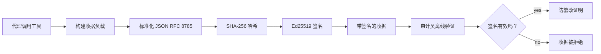
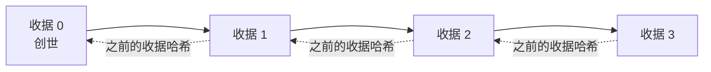

[观看课程视频：使用加密收据保护 AI 代理](https://youtu.be/PLACEHOLDER_VIDEO_ID)

> _(课程视频和缩略图将在合并后由微软内容团队添加，符合第14 / 15课的模式。)_

# 使用加密收据保护 AI 代理

## 介绍

本课程将涵盖：

- 为什么 AI 代理的审计轨迹对合规、调试和信任很重要。
- 什么是加密收据，以及它与未签名日志行的区别。
- 如何使用纯 Python 生成代理工具调用的签名收据。
- 如何离线验证收据并检测篡改。
- 如何链接收据，使移除或重新排列其中一条会破坏整个链。
- 收据能证明什么以及明确不能证明什么。

## 学习目标

完成本课程后，您将学会：

- 识别促使代理操作采用加密溯源的失败模式。
- 对规范的 JSON 负载生成 Ed25519 签名收据。
- 仅使用签名者的公钥独立验证收据。
- 通过对已修改收据重新验证来检测篡改。
- 构建哈希链收据序列并解释链的重要性。
- 认识收据能证明的界限（归属、完整性、顺序）以及不能证明的内容（操作正确性、策略合理性）。

## 问题：您的代理审计轨迹

假设您为 Contoso 旅行部署了一个 AI 代理。该代理读取客户请求，调用航班 API 查询选项，并代表客户预订座位。上季度，该代理处理了 5 万次预订。

今天审计员来了。他们问了一个简单的问题：“给我看看您的代理做了什么。”

您递交日志文件。审计员查看后提出更难的问题：“我怎么知道这些日志没有被编辑过？”

这就是审计轨迹问题。当前大多数代理部署依赖于：

- <strong>应用日志</strong>：由代理自身写入，任何有文件系统访问权限的人都可以编辑。
- <strong>云日志服务</strong>：在平台层面可检测篡改，但前提是审计员信任平台运营方。
- <strong>数据库事务日志</strong>：适合数据库变更，但不适用于任意工具调用。

这些都无法在不让审计员信任某人（您、您的云提供商、数据库供应商）的情况下回答问题。对于内部使用，这种信任通常可接受。但对于受监管工作负载（金融、医疗、以及受欧盟 AI 法案约束的任何情况），这不可接受。

加密收据通过让每个代理操作都可以独立验证来解决这个问题。审计员无需信任您，只需公钥和收据本身。

## 什么是加密收据？

收据是一个 JSON 对象，记录代理所做的操作，并带有数字签名。



一个最小收据如下：

```json
{
  "type": "agent.tool_call.v1",
  "agent_id": "contoso-travel-bot",
  "tool_name": "lookup_flights",
  "tool_args_hash": "sha256:a3f9c1...",
  "result_hash": "sha256:7b2e1d...",
  "policy_id": "contoso-travel-policy-v3",
  "timestamp": "2026-04-25T14:30:00Z",
  "sequence": 47,
  "previous_receipt_hash": "sha256:9d4e6a...",
  "signature": {
    "alg": "EdDSA",
    "sig": "c5af83...",
    "public_key": "8f3b2c..."
  }
}
```

三个属性起着关键作用：

1. <strong>签名</strong>。收据由代理网关使用 Ed25519 私钥签名。任何拥有对应公钥的人都可以离线验证签名。对任意字段的篡改都会使签名无效。

2. <strong>规范编码</strong>。签名前，收据使用 JSON 规范化方案（JCS，RFC 8785）序列化。确保两个实现产生相同的逻辑收据时输出字节完全一致。若不做规范化，不同的 JSON 序列化器会对相同内容产生不同签名。

3. <strong>哈希链</strong>。`previous_receipt_hash` 字段把每个收据和前一个收据链接起来。删除或重新排序收据会破坏后续所有收据。即使绕过个别签名，链级别的篡改也会显现。

这些属性保证了三点：

- <strong>归属</strong>：此密钥签署了该内容。
- <strong>完整性</strong>：内容自签名以来未被更改。
- <strong>顺序</strong>：此收据在链中的顺序晚于那个收据。

## 在 Python 中生成收据

生成收据无需特殊库。加密原语广泛可用，逻辑只需几十行 Python 代码。

`code_samples/18-signed-receipts.ipynb` 中的实操练习详解了完整流程。摘要版本如下：

```python
import json
import hashlib
import base64
from nacl import signing
from jcs import canonicalize  # RFC 8785 规范的 JSON

def b64url_nopad(data: bytes) -> str:
    return base64.urlsafe_b64encode(data).decode("ascii").rstrip("=")

def sha256_canonical(obj) -> str:
    """SHA-256 of a Python object's JCS-canonical JSON form."""
    return f"sha256:{hashlib.sha256(canonicalize(obj)).hexdigest()}"

# 生成或加载签名密钥（生产环境中存储在密钥库中）
signing_key = signing.SigningKey.generate()
verify_key = signing_key.verify_key

# 构建收据负载（尚未签名）
tool_args = {"origin": "SYD", "destination": "LAX"}
tool_result = [{"flight": "QF11", "price": 1850, "stops": 0}]

payload = {
    "type": "agent.tool_call.v1",
    "agent_id": "contoso-travel-bot",
    "tool_name": "lookup_flights",
    "tool_args_hash": sha256_canonical(tool_args),
    "result_hash": sha256_canonical(tool_result),
    "policy_id": "contoso-travel-policy-v3",
    "timestamp": "2026-04-25T14:30:00Z",
    "sequence": 0,
    "previous_receipt_hash": None,
}

# 规范化，哈希，签名。
canonical_bytes = canonicalize(payload)
message_hash = hashlib.sha256(canonical_bytes).digest()
signature_bytes = signing_key.sign(message_hash).signature

# 附加结构化签名对象。
receipt = {
    **payload,
    "signature": {
        "alg": "EdDSA",
        "sig": b64url_nopad(signature_bytes),
        "public_key": b64url_nopad(bytes(verify_key)),
    },
}
```

这就是全部签名流程。笔记本中的练习将逐步演示每一步。

## 验证收据与检测篡改

验证是相反操作：

```python
import base64
import hashlib
from nacl import signing
from nacl.exceptions import BadSignatureError
from jcs import canonicalize

def b64url_decode(s: str) -> bytes:
    padding = "=" * ((4 - len(s) % 4) % 4)
    return base64.urlsafe_b64decode(s + padding)

def verify_receipt(receipt: dict) -> bool:
    # 签名是一个结构化对象：{"alg", "sig", "public_key"}。
    sig_obj = receipt.get("signature")
    if not sig_obj or sig_obj.get("alg") != "EdDSA":
        return False

    # 重建实际被签名的负载（除签名之外的所有内容）。
    payload = {k: v for k, v in receipt.items() if k != "signature"}

    canonical_bytes = canonicalize(payload)
    message_hash = hashlib.sha256(canonical_bytes).digest()

    try:
        verify_key = signing.VerifyKey(b64url_decode(sig_obj["public_key"]))
        verify_key.verify(message_hash, b64url_decode(sig_obj["sig"]))
        return True
    except BadSignatureError:
        return False
```

该函数接收一个收据，若签名有效返回 `True`，否则为 `False`。无网络调用，无服务依赖，无需信任任何第三方。

为了演示篡改检测，笔记本中的流程为：

1. 生成有效收据并确认验证通过。
2. 修改 `tool_args_hash` 字段的一个字节。
3. 重新运行验证并观察失败。

这就是收据防篡改的实际演示：任意修改（哪怕细微）都会破坏签名。

## 为多步骤代理链接收据

单个签名收据保护一项操作。收据链保护一连串操作。



每个收据记录前一个收据的哈希。攻击者若想静默删除收据 2，必须：

- 修改收据 3 的 `previous_receipt_hash` 字段（破坏收据 3 的签名），或
- 伪造对修改后的收据 3 的新签名（需代理私钥）。

若私钥存于硬件密钥库，且您随收据公布公钥，这两种攻击都无法在未被察觉的情况下完成。

笔记本演示了：

1. 构建三条收据链。
2. 验证每条收据的 `previous_receipt_hash` 与前一条收据的实际哈希匹配。
3. 中间一条收据被篡改，链条在正好该处断裂。

这就是您可以让外部审计员无需信任您即可验证的审计轨迹。

## 收据证明的内容（以及不证明的）

这是本课最重要的部分。收据功能强大，但其能力有限。

**收据能证明三件事：**

1. <strong>归属</strong>：特定密钥签署了特定负载。
2. <strong>完整性</strong>：负载自签名以来未被修改。
3. <strong>顺序</strong>：该收据在哈希链中晚于指定收据。

**收据不证明：**

1. <strong>正确性</strong>：代理操作是否正确。收据同样能干净地为错误答案签名。
2. <strong>策略合规</strong>：`policy_id` 中的策略是否真被评估，或若检查是否允许该操作。收据记录的是宣称内容，而非执行结果。
3. <strong>身份超越密钥</strong>：收据声明“此密钥签署了此内容”，但不表示“此人授权”。将密钥与个人或组织关联需依赖单独的身份基础设施（目录、公钥注册表等）。
4. <strong>输入真实性</strong>：若代理接收到篡改过的提示并据此行动，收据忠实记录操作。收据依赖输入验证，不替代其功能。

界限重要性在于：

- 告诉您收据的用途：使代理行为可审计且防篡改，即使跨组织。
- 明确额外需要的层次：输入验证（第6课）、策略执行（稍后简述）、身份基础设施（本课范围外）。

一个常见误解是认为“我们有收据”就意味着“我们受治理约束”。事实不是。收据是基础，治理是您在此基础上构建的系统。

## 生产参考

本课的 Python 代码故意简洁，便于逐行理解生产细节。生产环境有两种选择：

1. **直接构建在加密原语上。** 上述 50 行代码足够满足许多用例。PyNaCl（Ed25519）与 `jcs` 包（规范 JSON）是维护良好且经审计的库。

2. **使用生产级收据库。** 诸多开源项目实现相同模式，并添加额外特性（密钥轮换、批量验证、JWK 集分发、与策略引擎集成）：
   - 本课使用的收据格式遵循 IETF Internet-Draft（`draft-farley-acta-signed-receipts`），正处于标准制订阶段。
   - Microsoft Agent Governance Toolkit 组合收据与基于 Cedar 的策略决策；相关端到端示例见该仓库的教程 33。
   - `protect-mcp`（npm）与 `@veritasacta/verify`（npm）包提供基于 Node 的收据签名与离线验证，用于为任何 MCP 服务器提供防篡改审计轨迹。

自建与库选的决策类似于写自己的 JWT 库或用成熟库：两者合理；库节约时间且减少审计面；自研让您理解每个原语。此课教授自研路径，为双方选择打好基础。

## 知识检测

在进入实践练习前测试您的理解。

**1. 收据用代理的私钥 Ed25519 签名。审计员仅有公钥。能否离线验证收据？**

<details>
<summary>答案</summary>

能。Ed25519 验证只需公钥和已签字节。无网络调用，无服务依赖。这使收据在隔离网、多机构或低信任审计环境中有用。
</details>

**2. 攻击者修改收据的 `policy_id` 字段，声称被更宽松的策略管理。签名仍是原负载。验证会怎样？**

<details>
<summary>答案</summary>

验证失败。签名基于原负载的规范字节；任何字段修改都会改变规范字节，进而改变 SHA-256 哈希，导致签名无效。攻击者若无私钥无法重新签名。
</details>

**3. 为什么收据包含 `tool_args_hash` 和 `result_hash`，而非原始参数和结果？**

<details>
<summary>答案</summary>

有两点。首先，收据可能需要在泄露原始内容（PII、业务数据）敏感的环境中归档或传输。哈希保持收据小且隐私；审计员核对哈希与单独存储的实际内容相符。其次，哈希长度固定，无论输入输出多大，收据大小都受限。
</details>

**4. `previous_receipt_hash` 链接每个收据与其前任。若攻击者中间静默删除一条收据，什么会失效？**

<details>
<summary>答案</summary>

被删除收据之后的所有收据。它们的 `previous_receipt_hash` 不再匹配实际链（因引用的收据不存在或链现在指向不同前序）。攻击者若想掩盖删除，须对后续所有收据重新签名，需私钥。
</details>

**5. 一条收据验证通过。是否证明代理操作正确、合理或符合策略？**

<details>
<summary>答案</summary>

否。有效收据证明三点：归属（此密钥签此内容）、完整性（内容未变）、顺序（此收据在另一收据之后）。它不证明操作正确，`policy_id` 中的策略是否评估，或代理是否遵守规定。收据让代理行为可审计，但不必然正确。这是本课最重要的界限。
</details>

## 实践练习

打开 `code_samples/18-signed-receipts.ipynb`，完成四个部分：

1. <strong>第一部分</strong>：签署您的第一个收据并验证。
2. <strong>第二部分</strong>：篡改收据并观察验证失败。
3. <strong>第三部分</strong>：构建三条收据链并验证链完整性。
4. <strong>第四部分</strong>：在 Microsoft Agent Framework 构建的代理中应用该模式：对工具调用包裹收据签名，再独立验证收据。

**进阶挑战 1：** 扩展收据模式，添加您选择的额外字段（例如用于跟踪的请求 ID），更新规范签名逻辑以包含该字段，并确认收据仍能通过验证转换。随后签名后修改此字段并确认验证失败。这将帮助您理解规范编码的每个字节对签名的贡献。
**扩展挑战 2：** 将您的两个收据的 SHA-256 散列组合在一起（以确定的顺序连接它们的规范字节）并将生成的摘要作为新字段嵌入第三个收据中，然后再对其进行签名。验证所有三个收据仍能往返转换。您刚刚构建了一个一步包含证明：持有第三个收据的任何人都可以证明前两个收据在签名时存在，而无需透露它们的内容。这是选择性披露收据在大规模使用时的模式（Merkle 承诺，RFC 6962）。

## 结论

加密收据为 AI 代理提供了一个审计轨迹，该轨迹具有：

- <strong>独立可验证性</strong>：任何持有公钥的一方都可以验证，无需服务依赖。
- <strong>防篡改性</strong>：任何修改都会使签名无效。
- <strong>可移植性</strong>：收据是一个小型 JSON 文件；可以存档、传输并在任何地方验证。
- <strong>符合标准</strong>：建立在 Ed25519（RFC 8032）、JCS（RFC 8785）和 SHA-256 之上，均为广泛部署的原语。

它们不能替代输入验证、策略执行或身份基础设施。它们是这些层的基础。当您将代理部署在受监管的工作负载、多组织工作流或任何未来审计员无法假定信任您的环境中时，收据就是您使审计轨迹真实可靠的方法。

最重要的结论是：收据证明了谁在何时说了什么。它们并不证明所说内容是真的或正确的。请牢牢记住这一区别。这是诚实的来源系统和误导性系统之间的区别。

## 生产清单

当您准备好从本课升级到在实际环境中部署签有收据的代理时：

- [ ] **将签名密钥移出开发者笔记本电脑。** 使用 Azure 密钥保管库、AWS KMS 或硬件安全模块。用于签署收据的私钥绝不能存储在源代码控制中或以明文形式存放在应用机器上。
- [ ] **发布验证公钥。** 审计员需要它离线验证。标准模式是在已知 URL 处提供 JWK 集（RFC 7517），例如 `https://your-org.example.com/.well-known/agent-keys.json`。
- [ ] **外部锚定链。** 定期将最新链头哈希写入透明日志（Sigstore Rekor、RFC 3161 时间戳权限机构或第二个内部系统），以便外部方确认“此链在该时间存在”。
- [ ] **不可变存储收据。** 附加式 Blob 存储（Azure Storage 带不可变策略，AWS S3 对象锁定）防止内部人员在存储层重写历史。
- [ ] **决定保留策略。** 许多合规制度要求多年保留。规划收据增长（每个收据约 500 字节；一个每天调用 10K 次的代理每年产生约 1.8 GB）。
- [ ] **记录收据不涵盖的内容。** 收据证明归属、完整性和排序。您的操作手册应明确列出额外控制（输入验证、策略执行、速率限制、身份基础设施）与收据共同构成您的治理姿态。

### 对于保护 AI 代理有更多疑问？

加入 [Microsoft Foundry Discord](https://aka.ms/ai-agents/discord)，与其他学习者交流，参加答疑时间，解决您的 AI 代理问题。

## 超越本课

本课涵盖了单收据签名和哈希链序列。相同的原语可组合成若干更高级的模式，随着您的治理姿态成熟，您可能会遇到：

- **选择性披露。** 当收据的字段被独立承诺（RFC 6962 风格的 Merkle 树）时，您可以向特定审计员披露特定字段，并证明其他字段未被更改且保持隐私。当同一个收据既满足全面审计（需要完整性）又符合如 GDPR 这类数据最小化法规（审计员只能看到必要的最少信息）时非常有用。
- **收据撤销。** 如果签名密钥被泄露，您需要一种方法从某个时间点起标记该密钥签署的所有收据不可信。标准模式是短生命周期签名密钥加上公开撤销列表，或带撤销条目的透明日志。
- **双向/拆分签名收据。** 一些实现将已签名负载拆分为执行前（`authorization_*`）和执行后（`result_*`）两部分，分别签名，适用于授权决策与观察结果由不同角色或不同时间产生时的场景。该模式可在本课介绍的收据格式基础上加成使用。
- **负载组合。** 收据封印放入 `result_hash` 的任何字节。真实的负载通常比单个工具调用结果更丰富：决策前的推理（模型预测、考虑的选项、证据及其完整性、风险态势、责任链、关卡结果）都可以存储在负载中，由单个收据封存。这保持了收据格式的简洁，同时允许负载模式按领域演进。
- **跨实现一致性。** 多个独立实现相同收据格式（Python、TypeScript、Rust、Go）通过共享测试向量交叉验证。如果您构建自己的实现，使用公开测试向量验证可确认线兼容性。
- **后量子迁移。** Ed25519 今天广泛部署但不抗量子攻击。收据格式具有算法灵活性：`signature.alg` 字段可携带 `ML-DSA-65`（NIST 后量子签名标准），可在迁移期间使用。规划出签收据双签名的过渡期。

## 附加资源

- <a href="https://datatracker.ietf.org/doc/draft-farley-acta-signed-receipts/" target="_blank">IETF Internet-Draft：机器对机器访问控制的签名决策收据</a>
- <a href="https://learn.microsoft.com/azure/ai-studio/responsible-use-of-ai-overview" target="_blank">负责任的 AI 概览（Azure AI）</a>
- <a href="https://datatracker.ietf.org/doc/html/rfc8032" target="_blank">RFC 8032：Edwards 曲线数字签名算法（EdDSA）</a>
- <a href="https://datatracker.ietf.org/doc/html/rfc8785" target="_blank">RFC 8785：JSON 规范化方案（JCS）</a>
- <a href="https://datatracker.ietf.org/doc/html/rfc6962" target="_blank">RFC 6962：证书透明度</a>（选择性披露收据使用的 Merkle 树构造）
- <a href="https://github.com/microsoft/agent-governance-toolkit/blob/main/docs/tutorials/33-offline-verifiable-receipts.md" target="_blank">Microsoft Agent Governance Toolkit，教程 33：离线可验证的决策收据</a>
- <a href="https://github.com/ScopeBlind/agent-governance-testvectors" target="_blank">本课使用收据格式的跨实现一致性测试向量</a>（Apache-2.0）
- <a href="https://pynacl.readthedocs.io/" target="_blank">PyNaCl 文档</a>（Python 中的 Ed25519）

## 上一课

[构建计算机使用代理（CUA）](../15-browser-use/README.md)

## 下一课

_(由课程维护者确定)_

---

<!-- CO-OP TRANSLATOR DISCLAIMER START -->
**免责声明**：
本文件由 AI 翻译服务 [Co-op Translator](https://github.com/Azure/co-op-translator) 翻译完成。尽管我们力求准确，但请注意，自动翻译可能包含错误或不准确之处。原始语言版文件应视为权威来源。对于重要信息，建议使用专业人工翻译。我们对因使用本翻译而产生的任何误解或误释不承担责任。
<!-- CO-OP TRANSLATOR DISCLAIMER END -->