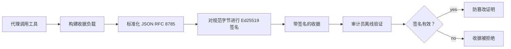
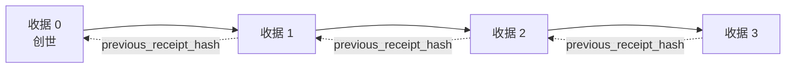

[观看课程视频：使用加密收据保护AI代理](https://youtu.be/PLACEHOLDER_VIDEO_ID)

> _(课程视频和缩略图将由微软内容团队在合并后添加，符合第14 / 15课的模式。)_

# 使用加密收据保护AI代理

## 简介

本课将涵盖：

- 为什么AI代理的审计追踪对合规性、调试和信任很重要。
- 什么是加密收据，以及它与未签名日志行的区别。
- 如何用纯Python为代理的工具调用生成已签名收据。
- 如何离线验证收据并检测篡改。
- 如何将收据链接成链，以便移除或重新排序其中之一会破坏整个链条。
- 收据能证明什么，明确不能证明什么。

## 学习目标

完成本课后，您将学会：

- 识别促使代理行为采用加密溯源的失效模式。
- 生成对规范化JSON负载进行Ed25519签名的收据。
- 仅使用签名者的公钥独立验证收据。
- 通过对修改后的收据重新验证来检测篡改。
- 构建哈希链收据序列，并解释链条为何重要。
- 辨认收据能证明的边界（归属、完整性、排序）以及收据不能证明的（行为正确性、政策合理性）。

## 问题：您的代理的审计追踪

假设您为Contoso Travel部署了一个AI代理。该代理读取客户请求，调用航班API查询选项，并代表客户预订座位。上季度，代理处理了50,000次预订。

今天一位审计员来了。他问一个简单的问题：“给我看看你的代理做了什么。”

您交出日志文件。审计员看着文件，问了个更难的问题：“我怎么知道这些日志没被篡改？”

这就是审计追踪的问题。如今大多数代理部署依赖：

- <strong>应用日志</strong>：由代理自身写入，任何拥有文件系统访问权限的人都可编辑。
- <strong>云日志服务</strong>：在平台级别具备篡改迹象，但前提是审计员信任平台运营商。
- <strong>数据库事务日志</strong>：适合数据库变更，但不适合任意工具调用。

这些都无法在不要求审计员信任某人的情况下回答审计员的问题（无论是您、您的云供应商还是数据库厂商）。在内部使用时，这种信任通常可接受，但对于受监管的工作负载（金融、医疗、受欧盟AI法案约束的任何事）则不可。

加密收据通过使每个代理操作都独立可验证来解决此问题。审计员无需信任您。他们只需您的公钥和收据本身。

## 什么是加密收据？

收据是记录代理行为的JSON对象，带有数字签名。


```mermaid
flowchart LR
    A[代理调用工具] --> B[构建收据负载]
    B --> C[标准化 JSON RFC 8785]
    C --> E[对规范字节进行 Ed25519 签名]
    E --> F[带签名的收据]
    F --> G[审计员离线验证]
    G --> H{签名有效？}
    H -- yes --> I[防篡改证明]
    H -- no --> J[收据被拒绝]
```

一个最小收据示例如下：

```json
{
  "type": "agent.tool_call.v1",
  "agent_id": "contoso-travel-bot",
  "tool_name": "lookup_flights",
  "tool_args_hash": "sha256:a3f9c1...",
  "result_hash": "sha256:7b2e1d...",
  "policy_id": "contoso-travel-policy-v3",
  "timestamp": "2026-04-25T14:30:00Z",
  "sequence": 47,
  "previous_receipt_hash": "sha256:9d4e6a...",
  "signature": {
    "alg": "EdDSA",
    "sig": "c5af83...",
    "public_key": "8f3b2c..."
  }
}
```

有三个属性发挥作用：

1. <strong>签名</strong>。收据由代理网关使用Ed25519私钥签名。拥有对应公钥的任何人都可以离线验证签名。任何字段被篡改都会使签名无效。

2. <strong>规范化编码</strong>。签名前，收据使用JSON规范化方案（JCS，RFC 8785）序列化。这确保两个产生相同逻辑收据的实现输出是字节完全相同的。没有规范化，不同的JSON序列化器会对相同内容产生不同签名。

3. <strong>哈希链</strong>。`previous_receipt_hash`字段将每个收据链接到前一个。移除或重新排序任何收据都会破坏其后的所有收据。即使单个签名被绕过，链级别的篡改也会显现。

这些属性共同提供三重保证：

- <strong>归属</strong>：此密钥签名了该内容。
- <strong>完整性</strong>：内容自签名后未被更改。
- <strong>排序</strong>：此收据在链条中位于该收据之后。

## 用Python生成收据

生成收据不需要特殊库。加密原语广泛可用，代码逻辑只需几十行Python。

`code_samples/18-signed-receipts.ipynb`中的实践练习详细演示完整流程。简要版：

```python
import json
import hashlib
import base64
from nacl import signing
from jcs import canonicalize  # RFC 8785 规范 JSON

def b64url_nopad(data: bytes) -> str:
    return base64.urlsafe_b64encode(data).decode("ascii").rstrip("=")

def sha256_canonical(obj) -> str:
    """SHA-256 of a Python object's JCS-canonical JSON form."""
    return f"sha256:{hashlib.sha256(canonicalize(obj)).hexdigest()}"

# 生成或加载签名密钥（生产环境中，存储在密钥库中）
signing_key = signing.SigningKey.generate()
verify_key = signing_key.verify_key

# 构建收据负载（尚未签名）
tool_args = {"origin": "SYD", "destination": "LAX"}
tool_result = [{"flight": "QF11", "price": 1850, "stops": 0}]

payload = {
    "type": "agent.tool_call.v1",
    "agent_id": "contoso-travel-bot",
    "tool_name": "lookup_flights",
    "tool_args_hash": sha256_canonical(tool_args),
    "result_hash": sha256_canonical(tool_result),
    "policy_id": "contoso-travel-policy-v3",
    "timestamp": "2026-04-25T14:30:00Z",
    "sequence": 0,
    "previous_receipt_hash": None,
}

# 规范化并直接签署 JCS 字节。PureEdDSA 内部进行哈希。
canonical_bytes = canonicalize(payload)
signature_bytes = signing_key.sign(canonical_bytes).signature

# 附加结构化的签名对象。
receipt = {
    **payload,
    "signature": {
        "alg": "EdDSA",
        "sig": b64url_nopad(signature_bytes),
        "public_key": b64url_nopad(bytes(verify_key)),
    },
}
```

这就是整个签名流程。笔记本中的练习会逐步讲解每一步。

## 验证收据并检测篡改

验证是相反操作：

```python
import base64
import hashlib
from nacl import signing
from nacl.exceptions import BadSignatureError
from jcs import canonicalize

def b64url_decode(s: str) -> bytes:
    padding = "=" * ((4 - len(s) % 4) % 4)
    return base64.urlsafe_b64decode(s + padding)

def verify_receipt(receipt: dict) -> bool:
    # 签名是一个结构化对象：{"alg", "sig", "public_key"}。
    sig_obj = receipt.get("signature")
    if not sig_obj or sig_obj.get("alg") != "EdDSA":
        return False

    # 重新构建实际被签名的有效载荷（除签名外的所有内容）。
    payload = {k: v for k, v in receipt.items() if k != "signature"}

    canonical_bytes = canonicalize(payload)

    try:
        verify_key = signing.VerifyKey(b64url_decode(sig_obj["public_key"]))
        verify_key.verify(canonical_bytes, b64url_decode(sig_obj["sig"]))
        return True
    except BadSignatureError:
        return False
```

此函数接受一个收据，如果签名有效则返回`True`，否则返回`False`。无网络调用，无服务依赖，无需信任任何第三方。

要演示篡改检测，笔记本中演示了：

1. 生成有效收据并确认验证通过。
2. 修改`tool_args_hash`字段的一个字节。
3. 重新验证，验证失败。

这是证明收据具有篡改迹象的实际演示：任何修改，无论多小，都会破坏签名。

## 为多步骤代理链接收据

单个已签名收据保护单个操作。收据链保护操作序列。


```mermaid
flowchart LR
    R0[收据 0<br/>创世] --> R1[收据 1]
    R1 --> R2[收据 2]
    R2 --> R3[收据 3]
    R1 -. previous_receipt_hash .-> R0
    R2 -. previous_receipt_hash .-> R1
    R3 -. previous_receipt_hash .-> R2
```

每个收据记录前一个收据的哈希。若攻击者想无声无息地删除收据2，他必须：

- 修改收据3的`previous_receipt_hash`字段（破坏收据3签名），或
- 在修改后的收据3上伪造新签名（需要代理私钥）。

如果私钥存储在硬件密钥库并且每个收据都公布公钥，则这两种攻击都无法在不被检测的情况下完成。

笔记本演示了：

1. 构建包含三个收据的链。
2. 验证每个收据的`previous_receipt_hash`是否匹配前一个收据的实际哈希。
3. 中间篡改一个收据，观察链条在那一环断裂。

这就是您如何生成审计追踪，让外部审计员无需信任您即可验证。

## 收据能证明什么（及不能证明什么）

这是本课最重要的部分。收据功能强大但有限制。

**收据证明三件事：**

1. <strong>归属</strong>：特定密钥签署了特定负载。
2. <strong>完整性</strong>：负载自签名后未被篡改。
3. <strong>排序</strong>：本收据位于哈希链中该收据之后。

**收据不证明：**

1. <strong>正确性</strong>：代理的操作是否正确。错误答案的收据可以和正确答案一样干净地签名。
2. <strong>政策合规性</strong>：`policy_id`中引用的政策是否实际评估过，或即使检查过是否允许此操作。收据记录的是声明内容，不是强制执行内容。
3. <strong>超越密钥的身份</strong>：收据说明“这个密钥签署了此内容”，不代表“某个人授权了此操作”。将密钥绑定到个人或组织需要单独的身份基础设施（目录、公钥注册等）。
4. <strong>输入真实性</strong>：如果代理收到篡改的提示词并基于此行动，收据忠实记录了动作。收据在输入验证之后，而不是替代输入验证。

这一边界之所以重要，有两个原因：

- 它告诉您收据的用途：让代理行为可审计、篡改有迹可循，甚至跨组织边界。
- 它告诉您仍需哪些额外层面：输入验证（第6课）、政策执行（下文简要涉及）、身份基础设施（本课范围外）。

一个常见错误是认为“我们有收据”就意味着“我们实现了治理”。事实不是。收据是基础，治理是基于此构建的体系。

## 证明人类批准了该具体操作

上述第3点值得单独章节：操作收据说的是“此密钥签名了此内容”，从不说“某人类批准了此操作”。对于高风险操作（退款、删除、电汇），治理框架日益要求这个缺失的声明，这也可以用您在本课构建的原语实现。

后续笔记本`code_samples/human-authorization-receipts.ipynb`添加了第二种收据类型`human.approval.v1`，与本课收据使用相同信封结构（一个类型化负载用Ed25519在其规范化JCS字节上签名，`signature`对象在签名字节外）。命名的审批者在执行前签署<strong>完整规范动作及其摘要</strong>；代理的动作收据包含<strong>相同动作摘要</strong>和`parent_approval_ref`，即审批的`receipt_hash`，与上文构建链中`previous_receipt_hash`使用相同惯例。一个`verify_chain`函数在<strong>不同的固定密钥注册表</strong>（审批者密钥vs代理密钥）下同时验证两个工件，代码路径共享，但权限各自独立。

这一特性说明（谨慎表述）：*人类批准了该具体动作，代理执行了完全相同的被批准动作。* 笔记本中的拒绝测试用例使该属性变成实际而非简单断言：

- 经典集合：篡改、混淆代理、重放、双方伪造密钥、格式错误输入；
- <strong>过期权限</strong>：一个仍然可验证的签名，仍被拒绝，因为政策版本改变、审批者密钥被从固定注册表剔除或审批在执行前过期；
- <strong>摘要替换</strong>：一个有效签名的动作收据指向绑定不同规范动作的<em>真实</em>审批。

每个失败都以不同原因拒绝，审计员从拒绝理由中可辨别权限是否过期或执行动作是否改变。笔记本教导的规则：签署的审批本身不构成权限。权限仅当两个收据执行时仍绑定到相同规范动作才存在。人类批准收据是本课定义的一个教育性组合，不是`draft-farley-acta-signed-receipts`定义的收据类型。

## 生产参考

本课Python代码故意简洁，以便您逐行阅读并完全理解其工作。生产环境中，您有两个选择：

1. **直接构建在加密原语之上。** 上面展示的50行代码对很多用例足够。PyNaCl（Ed25519）和`jcs`包（规范化JSON）是维护良好且经过审计的库。

2. **使用生产收据库。** 多个开源项目实现相同模式并附加特性（密钥轮换、批量验证、JWK集合分发、与策略引擎集成）：
   - 签名流程使用独立的IETF互联网草案中的JCS和签名范围惯例([`draft-farley-acta-signed-receipts`](https://datatracker.ietf.org/doc/draft-farley-acta-signed-receipts/), 修订版02)。本课的扁平教学收据与草案的`{payload, signature}`信封不同，且不作为合规实现发布。该草案发布了针对其线格式的公共符合性测试套件([agent-governance-testvectors](https://github.com/ScopeBlind/agent-governance-testvectors))。
   - Microsoft Agent Governance Toolkit将收据与基于Cedar的策略决策结合；参见该仓库的教程33了解端到端示例。
   - `protect-mcp`（npm）和`@veritasacta/verify`（npm）包提供基于Node的收据签名和离线验证实现，旨在包装任何MCP服务器以实现篡改可察的审计追踪，包括在桌面流程中由WebAuthn支持的暂停动作发出绑定动作摘要的审批收据的共签流程，上述人类授权笔记本中的审批收据模式相同。
   - **[nobulex](https://github.com/arian-gogani/nobulex)** Python SDK (`pip install nobulex`)提供Python环境下相同Ed25519 + JCS签名模式，集成LangChain和CrewAI，包含公开的交叉验证测试向量及通过[OWASP PR #2210](https://github.com/OWASP/CheatSheetSeries/pull/2210)贡献的合规映射。

自行开发和使用库这两条路与选择编写自己的JWT库还是使用成熟库相似：两者合理；库节省时间并减少审计面；从零开始则促使您理解每个原语。本课教授从零开始路径，为两种选择奠基。

## 知识检测

在进行实践练习前测试您的理解。

**1. 一个收据由代理的私有Ed25519密钥签名。审计员只有公钥。审计员能否离线验证收据？**

<details>
<summary>答案</summary>

能。Ed25519验证只需公钥和已签名字节。无需网络调用，无需依赖服务。这正是收据在断网、多组织或低信任审计环境中有用的特性。
</details>

**2. 攻击者修改了收据的`policy_id`字段，声称受更宽松政策管辖。签名针对的是原负载。验证时会发生什么？**

<details>
<summary>答案</summary>


验证失败。签名是针对原始有效负载的规范字节计算的；修改任何字段都会更改这些字节，从而使签名无效。攻击者需要私钥来生成一个新的有效签名，但他们没有私钥。
</details>

**3. 为什么收据包含 `tool_args_hash` 和 `result_hash` 而不是原始参数和结果？**

<details>
<summary>答案</summary>

有两个原因。首先，收据可能需要归档或在泄露原始内容（个人身份信息，业务数据）存在问题的环境中传输。散列保持收据较小且内容保密；审计员验证散列值与单独存储的实际内容副本是否匹配。其次，散列具有固定大小；包含散列的收据大小是有界的，无论输入和输出多大。
</details>

**4. `previous_receipt_hash` 字段将每个收据链接到其前一个收据。如果攻击者在链的中间静默删除一个收据，会导致什么变得无效？**

<details>
<summary>答案</summary>

删除的收据之后的每个收据都会无效。它们的 `previous_receipt_hash` 字段将不再匹配实际链（因为它们引用的收据不存在，或者链现在指向不同的前驱）。为了隐藏删除，攻击者必须对之后的每个收据重新签名，这需要私钥。
</details>

**5. 收据验证通过。这是否证明代理的行为是正确的、合理的或符合策略？**

<details>
<summary>答案</summary>

不是。有效的收据证明三件事：归属（此密钥签署了此内容）、完整性（内容未被更改）和顺序（此收据在那份收据之后）。它不证明操作是正确的、`policy_id` 中命名的策略实际上被评估过，或者代理遵循了所有规则。收据使代理行为可审计，但不一定正确。这是本课程中最重要的界限。
</details>

## 练习

打开 `code_samples/18-signed-receipts.ipynb` 并完成所有四个部分：

1. <strong>第一部分</strong>：签署你的第一个收据并验证它。
2. <strong>第二部分</strong>：篡改收据并观察验证失败。
3. <strong>第三部分</strong>：构建一个三收据链并验证链的完整性。
4. <strong>第四部分</strong>：将该模式应用于基于 Microsoft Agent Framework 构建的代理：在收据签名中包裹一个工具调用，然后独立验证该收据。

**进阶挑战 1：** 扩展收据架构，添加你自己选择的额外字段（例如，用于追踪的请求 ID），更新规范签名逻辑以包含该字段，确认收据仍能完成验证。然后签名后修改该字段，确认验证失败。这将迫使你理解规范编码的每个字节如何影响签名。

**进阶挑战 2：** 将你的两个收据用 SHA-256 哈希（将其规范字节以确定顺序拼接）后，作为新字段嵌入第三个收据的签名前。验证三份收据仍能相互验证。你刚构建了一个一步包含证明：持有第三个收据的任意人都可以证明前两个收据在它签署时存在，而无需透露它们的内容。这是大规模选择性披露收据使用的模式（默克尔承诺，RFC 6962）。

## 结论

密码学收据为 AI 代理提供了一个审计追踪，其特性为：

- <strong>独立可验证</strong>：任何拥有公钥的方都能验证，无需依赖服务。
- <strong>篡改可见</strong>：任何修改都会使签名无效。
- <strong>可移植</strong>：收据是一个小型 JSON 文件；可以归档、传输并在任何地方验证。
- <strong>符合标准</strong>：基于 Ed25519（RFC 8032），JCS（RFC 8785）和 SHA-256，均为广泛部署的原语。

它们不是输入验证、策略执行或身份基础设施的替代品。而是这些层的基础。当你将代理部署到受监管的工作负载、多组织工作流程或任何不能假定未来审计员信任你的场景时，收据让审计踪迹变得诚实。

最重要的启示：收据证明谁何时说了什么，但不证明所说内容是真的或正确的。坚持这一点。这是诚实溯源系统与误导性系统的区别。

## 生产清单

当你准备从本课程毕业，开始在实际环境中部署带收据签名的代理时：

- [ ] **将签名密钥移出开发者笔记本电脑。** 使用 Azure Key Vault、AWS KMS 或硬件安全模块。签署收据的私钥绝对不能存在源码控制中或应用机器的明文中。
- [ ] **发布验证公钥。** 审计员离线验证时需要它。常用模式是在知名 URL 处发布 JWK Set（RFC 7517），例如 `https://your-org.example.com/.well-known/agent-keys.json`。
- [ ] **外部锚定链。** 定期将最新链头哈希写入透明日志（Sigstore Rekor，RFC 3161 时间戳机构，或第二个内部系统），让外部方可确认“该链在此时存在”。
- [ ] **不可变存储收据。** 只增不删的 Blob 存储（Azure Storage 带不可变策略，AWS S3 Object Lock）防止内部人员在存储层重写历史。
- [ ] **确定保留期。** 许多合规标准要求多年保存。规划收据增长（每个收据约 500 字节；代理每天调用 1 万次，年产约 1.8 GB）。
- [ ] **文档说明收据未涵盖的内容。** 收据证明归属、完整性和顺序。你的运行手册应明确列出在治理态势中与收据配合工作的其他控制（输入验证、策略执行、限流、身份基础设施）。

### 关于保护 AI 代理还有更多问题？

加入 [Microsoft Foundry Discord](https://aka.ms/ai-agents/discord)，与其他学习者交流，参加答疑时间，获取 AI 代理相关问题的解答。

## 课后拓展

本课覆盖了单个收据签名与哈希链序列。随着治理态势成熟，同样的原语可组成多个更高级模式：

- **选择性披露。** 当收据字段独立承诺（RFC 6962 风格默克尔树）时，你可以向特定审计员透露部分字段，并证明其余未被篡改，无需暴露它们。适用于同一收据既满足全面审计（完整性），又符合如 GDPR 这样的数据最小化法规（审计员只见必要数据）。
- **收据吊销。** 若签名密钥泄漏，你需要标记该密钥签署的所有收据从某时间点起不可信。标准模式：短时效签名密钥加公开吊销列表，或带吊销条目的透明日志。
- **双边/分割签名收据。** 有些实现将签名负载拆分为执行前部分（`authorization_*`）和执行后部分（`result_*`），各自独立签名，适用于授权决策和观察结果由不同角色或时间产生的场景。这是在本课收据格式基础上的递增组合。
- **负载组合。** 收据封存你放入 `result_hash` 的任何字节。现实载荷通常比单个工具调用结果丰富：决策前推理（模型预测、考虑选项、证据及其完整性、风险态势、问责链、关卡结果）全可放入负载，由单个收据封存。这保持收据格式简洁，同时允许各领域逐步演进负载架构。
- **跨实现一致性。** 多个独立实现相同收据格式（Python、TypeScript、Rust、Go）通过共享测试向量交叉验证。若自己实现，验证公开向量可确认传输兼容性。
- **后量子迁移。** Ed25519 目前广泛部署，但不抗量子攻击。收据格式算法可变：`signature.alg` 字段可携带 `ML-DSA-65`（NIST 后量子签名标准），便于迁移。计划期间收据可双签。

## 附加资源

- <a href="https://datatracker.ietf.org/doc/draft-farley-acta-signed-receipts/" target="_blank">IETF Internet-Draft: 机器对机器访问控制的签名决策收据</a>
- <a href="https://learn.microsoft.com/azure/ai-studio/responsible-use-of-ai-overview" target="_blank">责任 AI 概览（Azure AI）</a>
- <a href="https://datatracker.ietf.org/doc/html/rfc8032" target="_blank">RFC 8032：爱德华兹曲线数字签名算法 (EdDSA)</a>
- <a href="https://datatracker.ietf.org/doc/html/rfc8785" target="_blank">RFC 8785：JSON 规范化方案 (JCS)</a>
- <a href="https://datatracker.ietf.org/doc/html/rfc6962" target="_blank">RFC 6962：证书透明度</a>（选择性披露收据使用的默克尔树构造）
- <a href="https://github.com/microsoft/agent-governance-toolkit/blob/main/docs/tutorials/33-offline-verifiable-receipts.md" target="_blank">Microsoft Agent Governance Toolkit，教程 33：离线可验证决策收据</a>
- <a href="https://github.com/ScopeBlind/agent-governance-testvectors" target="_blank">本课收据格式的跨实现一致性测试向量</a>（Apache-2.0）
- <a href="https://pynacl.readthedocs.io/" target="_blank">PyNaCl 文档</a>（Python 中的 Ed25519）

## 上一课

[创建本地 AI 代理](../17-creating-local-ai-agents/README.md)

---

<!-- CO-OP TRANSLATOR DISCLAIMER START -->
**免责声明**：
本文件由 AI 翻译服务 [Co-op Translator](https://github.com/Azure/co-op-translator) 翻译完成。尽管我们力求准确，但请注意，自动翻译可能包含错误或不准确之处。原始语言版文件应视为权威来源。对于重要信息，建议使用专业人工翻译。我们对因使用本翻译而产生的任何误解或误释不承担责任。
<!-- CO-OP TRANSLATOR DISCLAIMER END -->