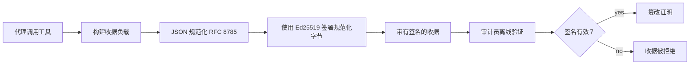
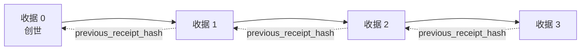

[观看课程视频：使用加密收据保护 AI 代理](https://youtu.be/PLACEHOLDER_VIDEO_ID)

> _(课程视频和缩略图将在合并后由微软内容团队添加，遵循第14 / 15课的模式。)_

# 使用加密收据保护 AI 代理

## 简介

本课将涵盖：

- 为什么 AI 代理的审计轨迹对于合规、调试和信任至关重要。
- 什么是加密收据，以及它与未签名日志行的区别。
- 如何在纯 Python 中为代理的工具调用生成签名收据。
- 如何离线验证收据并检测篡改。
- 如何将收据串联起来，使删除或重新排序其中一个就会破坏链条。
- 收据能证明什么，明确不证明什么。

## 学习目标

完成本课后，您将了解如何：

- 识别促使为代理行为提供加密溯源的失败模式。
- 对规范化 JSON 负载生成 Ed25519 签名收据。
- 使用签名者的公钥独立验证收据。
- 通过重新运行验证检测篡改的收据。
- 构建一个基于哈希串联的收据序列，并解释该链的重要性。
- 认识收据能证明的边界（归属、完整性、排序）和不能证明的内容（行为的正确性、政策的合理性）。

## 问题：代理的审计轨迹

假设您已为 Contoso Travel 部署了一个 AI 代理。该代理读取客户请求，调用航班 API 查找选项，并代表客户预订座位。上个季度，该代理处理了5万个预订。

今天一位审计员来了。他们提出一个简单的问题：“告诉我代理做了什么。”

您交出日志文件。审计员查看后提出更难的问题：“我怎么知道这些日志没有被篡改？”

这就是审计轨迹的问题。当前大多数代理部署依赖于：

- <strong>应用日志</strong>：由代理自身写入，任何有文件系统访问权限的人都可编辑。
- <strong>云日志服务</strong>：在平台层面上可检测篡改，但前提是审计员信任该平台运营方。
- <strong>数据库事务日志</strong>：适合数据库变更，但不适合任意工具调用。

这些都无法在不要求审计员信任某人的情况下回答问题（您、您的云服务提供商或数据库供应商）。对于内部使用，这种信任通常可以接受。对于受监管的工作负载（金融、医疗、受欧盟AI法案约束的任何内容），则不行。

加密收据通过使每个代理行为独立可验证来解决这个问题。审计员无需信任您，只需您的公钥和收据本身即可。

## 什么是加密收据？

收据是一个JSON对象，记录代理所做的事情，并带有数字签名。


```mermaid
flowchart LR
    A[代理调用工具] --> B[构建收据负载]
    B --> C[JSON 规范化 RFC 8785]
    C --> E[使用 Ed25519 签署规范化字节]
    E --> F[带有签名的收据]
    F --> G[审计员离线验证]
    G --> H{签名有效？}
    H -- yes --> I[篡改证明]
    H -- no --> J[收据被拒绝]
```

一个最简收据如下：

```json
{
  "type": "agent.tool_call.v1",
  "agent_id": "contoso-travel-bot",
  "tool_name": "lookup_flights",
  "tool_args_hash": "sha256:a3f9c1...",
  "result_hash": "sha256:7b2e1d...",
  "policy_id": "contoso-travel-policy-v3",
  "timestamp": "2026-04-25T14:30:00Z",
  "sequence": 47,
  "previous_receipt_hash": "sha256:9d4e6a...",
  "signature": {
    "alg": "EdDSA",
    "sig": "c5af83...",
    "public_key": "8f3b2c..."
  }
}
```

三个属性起作用：

1. <strong>签名</strong>。收据由代理网关使用 Ed25519 私钥签名。任何拥有对应公钥的人都可以离线验证签名。篡改任何字段都会使签名无效。

2. <strong>规范编码</strong>。签名前，收据使用 JSON 规范化方案（JCS，RFC 8785）序列化。这确保两个实现只要逻辑收据相同，生成的字节输出就完全相同。没有规范化，不同的 JSON 序列化器会为相同内容生成不同签名。

3. <strong>哈希串联</strong>。`previous_receipt_hash` 字段将每个收据链接到前一个。删除或重新排序其中一个收据会破坏之后的所有收据。即使单个签名被绕过，也能在链的层面检测到篡改。

这些属性共同提供三个保证：

- <strong>归属</strong>：此密钥签署了该内容。
- <strong>完整性</strong>：自签名后内容未改变。
- <strong>排序</strong>：此收据位于链中另一个收据之后。

## 在 Python 中生成收据

生成收据不需要特殊库。加密原语广泛可用，逻辑只需几十行 Python 代码。

`code_samples/18-signed-receipts.ipynb` 中的动手练习演示了完整流程。总结版如下：

```python
import json
import hashlib
import base64
from nacl import signing
from jcs import canonicalize  # RFC 8785 规范 JSON

def b64url_nopad(data: bytes) -> str:
    return base64.urlsafe_b64encode(data).decode("ascii").rstrip("=")

def sha256_canonical(obj) -> str:
    """SHA-256 of a Python object's JCS-canonical JSON form."""
    return f"sha256:{hashlib.sha256(canonicalize(obj)).hexdigest()}"

# 生成或加载签名密钥（在生产环境中，存储在密钥库中）
signing_key = signing.SigningKey.generate()
verify_key = signing_key.verify_key

# 构建收据负载（尚无签名）
tool_args = {"origin": "SYD", "destination": "LAX"}
tool_result = [{"flight": "QF11", "price": 1850, "stops": 0}]

payload = {
    "type": "agent.tool_call.v1",
    "agent_id": "contoso-travel-bot",
    "tool_name": "lookup_flights",
    "tool_args_hash": sha256_canonical(tool_args),
    "result_hash": sha256_canonical(tool_result),
    "policy_id": "contoso-travel-policy-v3",
    "timestamp": "2026-04-25T14:30:00Z",
    "sequence": 0,
    "previous_receipt_hash": None,
}

# 直接规范化并签署 JCS 字节。PureEdDSA 内部进行哈希处理。
canonical_bytes = canonicalize(payload)
signature_bytes = signing_key.sign(canonical_bytes).signature

# 附加一个结构化签名对象。
receipt = {
    **payload,
    "signature": {
        "alg": "EdDSA",
        "sig": b64url_nopad(signature_bytes),
        "public_key": b64url_nopad(bytes(verify_key)),
    },
}
```

这就是整个签名流程。笔记本中的练习详细讲解每个步骤。

## 验证收据和检测篡改

验证是逆向操作：

```python
import base64
import hashlib
from nacl import signing
from nacl.exceptions import BadSignatureError
from jcs import canonicalize

def b64url_decode(s: str) -> bytes:
    padding = "=" * ((4 - len(s) % 4) % 4)
    return base64.urlsafe_b64decode(s + padding)

def verify_receipt(receipt: dict) -> bool:
    # 签名是一个结构化对象：{"alg", "sig", "public_key"}。
    sig_obj = receipt.get("signature")
    if not sig_obj or sig_obj.get("alg") != "EdDSA":
        return False

    # 重建实际被签名的载荷（除签名外的所有内容）。
    payload = {k: v for k, v in receipt.items() if k != "signature"}

    canonical_bytes = canonicalize(payload)

    try:
        verify_key = signing.VerifyKey(b64url_decode(sig_obj["public_key"]))
        verify_key.verify(canonical_bytes, b64url_decode(sig_obj["sig"]))
        return True
    except BadSignatureError:
        return False
```

该函数接受收据，如果签名有效则返回`True`，否则返回`False`。无需网络调用，无需服务依赖，不需要信任第三方。

为了展示篡改检测，笔记本演示了：

1. 生成有效收据并确认验证通过。
2. 修改`tool_args_hash`字段的一个字节。
3. 重新验证并看到验证失败。

这是收据防篡改的实际证明：任何修改，无论多小，都破坏签名。

## 为多步骤代理串联收据

单个签名收据保护一次行动。收据链保护一系列行动。


```mermaid
flowchart LR
    R0[收据 0<br/>创世] --> R1[收据 1]
    R1 --> R2[收据 2]
    R2 --> R3[收据 3]
    R1 -. previous_receipt_hash .-> R0
    R2 -. previous_receipt_hash .-> R1
    R3 -. previous_receipt_hash .-> R2
```

每个收据记录前一个收据的哈希。要悄无声息地删除收据2，攻击者需要：

- 修改收据3的`previous_receipt_hash`字段（破坏收据3的签名），或者
- 伪造收据3的修改版本的新签名（需代理私钥）。

如果私钥保存在硬件密钥库中，且您在每个收据上发布公钥，则未经检测这两种攻击都不可行。

笔记本演示了：

1. 构建包含三条收据的链。
2. 验证每个收据的`previous_receipt_hash`是否匹配前一个收据的实际哈希。
3. 在中间篡改一个收据，看到链在那个点断开。

这就是如何制作外部审计员能够验证的审计轨迹，而无需信任您本人。

## 收据能证明什么（和不能证明什么）

这是本课最重要的部分。收据功能强大，但其能力有限。

**收据可以证明三件事：**

1. <strong>归属</strong>：某个特定密钥签署了特定负载。
2. <strong>完整性</strong>：自签署后负载未被更改。
3. <strong>排序</strong>：该收据在哈希链中位于另一收据之后。

**收据不能证明：**

1. <strong>正确性</strong>：代理行为是否正确。一条收据可以为错误答案签署，跟正确答案同样干净。
2. <strong>政策合规</strong>：`policy_id`引用的政策是否真的评估过，或者如果检查过会否批准此行为。收据记录的是所声称的内容，而非执行的强制内容。
3. <strong>超越密钥的身份</strong>：收据表示“此密钥签署了此内容”，不表示“某人类授权了此操作”。将密钥与个人或组织联系需单独的身份基础设施（目录、公钥注册等）。
4. <strong>输入的真实性</strong>：如果代理接收到篡改过的提示并以此动作，收据忠实记录该行为。收据是输入验证的下游，而非替代。

这个边界重要原因有二：

- 它告诉你收据的实际用途：使代理行为可审计且可检测篡改，即使跨组织边界也是如此。
- 它告诉你还需要哪些额外层次：输入验证（第6课）、政策执行（本课后略述）、身份基础设施（本课未涵盖）。

常见误区是认为“有收据”即意味着“已治理”。并非如此。收据是基础，治理是你在此基础上构建的系统。

## 证明人类批准了确切行动

上述第3点值得单独讲述：行动收据说“此密钥签署了此内容”，却永远不说“有人类授权此操作”。对于高风险操作（退款、删除、汇款），治理框架越来越多地要求缺失的那句话，这可以用本课中已经构建的相同原语生成。

后续笔记本`code_samples/human-authorization-receipts.ipynb`增加了第二种收据类型`human.approval.v1`，与本课收据使用相同的封套格式（类型化负载以 Ed25519 签名，基于规范化 JCS 字节，`signature` 对象在签名字节之外）。指定审批人先对<strong>完整的规范动作及其摘要</strong>签名；代理的行动收据携带<strong>相同动作摘要</strong>和`parent_approval_ref`，即审批收据哈希，遵循你上面构建的链中`previous_receipt_hash`的相同约定。一个`verify_chain`分别使用<strong>两个固定密钥注册表</strong>（审批人密钥与代理密钥）验证两个工件，代码路径共用但权限从不共享。

这个属性的谨慎表述是：*人类批准了这个确切操作，代理恰好执行了该批准动作。* 笔记本中因拒绝机制使该属性真实而非仅仅声明：

- 经典集：篡改、混淆代理、重放、双方伪造密钥、格式错误输入；
- <strong>过期授权</strong>：签名仍然可校验，但因政策版本变更、审批人密钥已从固定注册表移除或审批过期，执行时拒绝；
- <strong>摘要替代</strong>：有效签名的行动收据指向绑定不同规范动作的<em>真实</em>审批。

每个失败都会给出不同的拒绝原因，审计员读拒绝时可以判断权限是过期了还是执行动作变了。笔记本教的规则是：单独签名的审批不是授权。授权只有在执行时两个收据仍绑定同一规范动作时才存在。人类审批收据是本课定义的一种教育组合，而非`draft-farley-acta-signed-receipts`定义的收据类型。

## 生产参考

本课中的 Python 代码故意写得极简，方便你逐行阅读并完全理解。生产环境中，你有两个选择：

1. **直接基于加密原语构建。** 你刚才看到的50行代码已适用于许多场景。PyNaCl（Ed25519）和`jcs`包（规范化 JSON）是维护良好且已审计的库。

2. **使用生产级收据库。** 几个开源项目实现了相同模式并附加更多功能（密钥轮换、批量验证、JWK 集分发、与政策引擎集成）：
   - 签名流程使用独立 IETF 草案([`draft-farley-acta-signed-receipts`](https://datatracker.ietf.org/doc/draft-farley-acta-signed-receipts/)，修订版02)中的 JCS 和签名范围约定。教程中的教育收据与草案里的`{payload, signature}`封套不同，且未呈现为符合规范的实现。草案公开了共享的合规测试套件（[agent-governance-testvectors](https://github.com/ScopeBlind/agent-governance-testvectors)），面向其线格式的实现。
   - 微软代理治理工具包将收据与基于 Cedar 的策略决策组合；详见该仓库中的教程33，示例端到端流程。
   - `protect-mcp`（npm）和`@veritasacta/verify`（npm）包提供针对 Node 的收据签名和离线验证，实现用于为 MCP 服务器构建防篡改审计轨迹，包括基于 WebAuthn 的桌面流程中“持有待共同签署”审批收据发放，与人类授权笔记本中相同的审批收据模式。
   - **[nobulex](https://github.com/arian-gogani/nobulex)** Python SDK (`pip install nobulex`) 提供了相同的 Ed25519 + JCS 签名模式，集成了 LangChain 和 CrewAI，包含开放的交叉验证测试向量及通过 [OWASP PR #2210](https://github.com/OWASP/CheatSheetSeries/pull/2210) 贡献的合规映射。

选择自写还是用库，与选择自写 JWT 库或用测试库类似：两者合理；库节省时间，减少审计面；自写需理解每个原语。本课教授自写路径，奠定任一选择的基础。

## 知识检测

在进入练习之前测试理解。

**1. 收据用代理的 Ed25519 私钥签署。审计员只有公钥，能否离线验证收据？**

<details>
<summary>答案</summary>

可以。Ed25519 验证只需公钥和签名字节。无网络调用，无服务依赖。这使得收据适用于隔离网、多组织或低信任审计环境。
</details>

**2. 攻击者修改收据的`policy_id`字段，声称它受更宽松政策管辖。签名覆盖的是原始负载。验证时会怎样？**

<details>
<summary>答案</summary>


验证失败。签名是针对原始负载的规范字节计算的；修改任何字段都会改变这些字节，从而使签名无效。攻击者需要私钥来生成新的有效签名，但他们并不拥有私钥。
</details>

**3. 为什么收据包含 `tool_args_hash` 和 `result_hash`，而不是原始参数和结果？**

<details>
<summary>答案</summary>

有两个原因。首先，收据可能需要在泄露原始内容（个人身份信息，业务数据）存在问题的环境中进行存档或传输。哈希保持收据小且内容私密；审计员验证哈希是否与单独存储的实际内容相匹配。其次，哈希具有固定大小；包含哈希的收据大小是有界的，无论输入和输出多大。
</details>

**4. `previous_receipt_hash` 字段将每个收据与其前驱链接。如果攻击者悄悄删除链中间的一个收据，会导致什么无效？**

<details>
<summary>答案</summary>

被删除收据之后的每个收据。它们的 `previous_receipt_hash` 字段不再匹配实际链（因为它们引用的收据不存在，或者链现在指向了不同的前驱）。为了隐藏删除，攻击者必须重新签名每个后续收据，这需要私钥。
</details>

**5. 收据验证通过。这能证明代理的行为是正确、合理或符合政策吗？**

<details>
<summary>答案</summary>

不能。有效收据证明三个事实：归属（这把密钥签署了这份内容）、完整性（内容未被更改）和顺序（该收据在另一收据之后）。它不证明操作是正确的、`policy_id` 中列出的政策确实被评估，或者代理遵守了所有规则。收据让代理行为可审计，而不一定保证其正确性。这是本课最重要的界限。
</details>

## 练习题

打开 `code_samples/18-signed-receipts.ipynb` 并完成所有四个部分：

1. **第1部分**：签署你的第一个收据并验证它。
2. **第2部分**：篡改收据并观察验证失败。
3. **第3部分**：构建一个三个收据的链并验证链的完整性。
4. **第4部分**：将该模式应用于使用 Microsoft Agent Framework 构建的代理：在工具调用中加入收据签名，然后独立验证收据。

**扩展挑战1：** 扩展收据模式，新增你选择的字段（例如，用于追踪的请求 ID），更新规范签名逻辑以包含该字段，并确认收据仍可通过验证。然后在签名后修改该字段，确认验证失败。此练习迫使你理解规范编码的每一个字节如何影响签名。

**扩展挑战2：** 对你的两个收据的规范字节进行 SHA-256 哈希（按确定顺序连接），并将结果摘要作为第三个收据的新字段嵌入，然后签名。验证这三个收据均可完整回环。你刚刚构建了一个一步包含证明：任何持有第三个收据的人都能证明前两个收据在签名时存在，而无需暴露它们的内容。这是规模化选择性披露收据（Merkle 承诺，RFC 6962）使用的模式。

## 结论

密码学收据为 AI 代理提供了一个审计轨迹，它是：

- <strong>独立可验证的</strong>：任何持有公钥方均可验证，无需依赖服务。
- <strong>篡改可见的</strong>：任何修改都会使签名无效。
- <strong>便携的</strong>：收据是小型 JSON 文件；可被存档、传输和任何地方验证。
- <strong>标准兼容的</strong>：基于 Ed25519（RFC 8032）、JCS（RFC 8785）和 SHA-256，均为广泛部署的基本原语。

它们不能替代输入验证、政策执行或身份基础设施，而是这些层的基础。当你部署代理到监管工作负载、多组织工作流、或任何不能假设未来审计者信任你的环境时，收据是你让审计轨迹诚实可信的方法。

最重要的启示：收据证明了是谁何时说了什么，但不证明所说内容的真实性或正确性。务必牢记这一点。这是诚实的溯源体系与误导体系的区别。

## 生产清单

准备好从本课毕业，部署签收据的代理于真实环境时：

- [ ] **将签名密钥移出开发者笔记本。** 使用 Azure Key Vault、AWS KMS 或硬件安全模块。用于签名收据的私钥绝不能出现在源码管理或应用机器的明文中。
- [ ] **公开验证公钥。** 审计者离线验证的需求。标准模式是将 JWK 集放在一个知名 URL （RFC 7517），例如 `https://your-org.example.com/.well-known/agent-keys.json`。
- [ ] **在外部锚定链。** 定期将最新链头哈希写入透明日志（Sigstore Rekor、RFC 3161 时间戳权威或第二个内部系统），让外部方确认“此链当时存在”。
- [ ] **不可变存储收据。** 追加式对象存储（Azure Storage 不变性策略，AWS S3 对象锁定）防止内部人员在存储层重写历史。
- [ ] **决定保留期限。** 多个合规规制要求多年保留。规划收据增长（每份收据约500字节；代理每天调用 10K 次约产出 1.8 GB/年）。
- [ ] **记录收据不涵盖的内容。** 收据证明归属、完整性和顺序。你的运行手册应明确列出收据治理姿态中并列使用的额外控制（输入验证、政策执行、速率限制、身份基础设施）。

### 想了解更多关于保障 AI 代理安全的内容？

加入 [Microsoft Foundry Discord](https://aka.ms/ai-agents/discord)，与其他学习者会面，参加办公时间，获取你的 AI 代理问题的答案。

## 超越本课

本课涵盖单一收据签名和哈希链序列。以下更高级模式也是成熟治理姿态中常见的组合：

- **选择性披露。** 当收据字段被独立承诺（RFC 6962 风格的 Merkle 树）时，可以向特定审计者披露特定字段，并证明其余字段未被更改且未被暴露。当同一收据既需进行全面审计（要求完整性），又受限于如 GDPR 之类的数据最小化法规时特别有用。
- **收据撤销。** 若签名密钥泄露，需要标记该密钥签名的所有收据从某时间点起不再可信。标准方案包括使用短期签名密钥加公开撤销列表，或带有撤销条目的透明日志。
- **双边/分割签名收据。** 某些实现将签名负载拆分为执行前（`authorization_*`）和执行后（`result_*`）两半并分别签名，适用于授权决策和观察结果由不同实体或在不同时间生成的情况。该模式可叠加于本课所示的收据格式之上。
- **负载组合。** 收据封装放入 `result_hash` 的任意字节。现实负载通常比单次工具调用结果更丰富：决策前的推理（模型预测、考虑选项、证据及其完整性、风险态势、责任链、门控结果）都可以包含其中，由单一收据封装。这样保持收据格式极简，同时允许按领域演进负载模式。
- **跨实现一致性。** 多种独立实现（Python、TypeScript、Rust、Go）交叉验证共享测试向量。如果你自行实现，验证已发布向量确认线兼容性。
- **后量子迁移。** Ed25519 目前广泛部署但非量子安全。收据格式具算法灵活性：`signature.alg` 字段可载入 `ML-DSA-65`（NIST 后量子签名标准），当需要迁移时使用。规划一个收据双签名期限。

## 额外资源

- <a href="https://datatracker.ietf.org/doc/draft-farley-acta-signed-receipts/" target="_blank">IETF Internet-Draft：机器对机器访问控制的签名决策收据</a>
- <a href="https://learn.microsoft.com/azure/ai-studio/responsible-use-of-ai-overview" target="_blank">负责任的 AI 概述（Azure AI）</a>
- <a href="https://datatracker.ietf.org/doc/html/rfc8032" target="_blank">RFC 8032：爱德华兹曲线数字签名算法（EdDSA）</a>
- <a href="https://datatracker.ietf.org/doc/html/rfc8785" target="_blank">RFC 8785：JSON 规范化方案（JCS）</a>
- <a href="https://datatracker.ietf.org/doc/html/rfc6962" target="_blank">RFC 6962：证书透明度</a>（选择性披露收据所用的 Merkle 树构造）
- <a href="https://github.com/microsoft/agent-governance-toolkit/blob/main/docs/tutorials/33-offline-verifiable-receipts.md" target="_blank">Microsoft Agent Governance Toolkit，教程33：离线可验证决策收据</a>
- <a href="https://github.com/ScopeBlind/agent-governance-testvectors" target="_blank">本课收据格式的跨实现一致性测试向量</a>（Apache-2.0）
- <a href="https://pynacl.readthedocs.io/" target="_blank">PyNaCl 文档</a>（Python 中的 Ed25519）

## 上一课

[创建本地 AI 代理](../17-creating-local-ai-agents/README.md)

---

<!-- CO-OP TRANSLATOR DISCLAIMER START -->
**免责声明**：
本文件由 AI 翻译服务 [Co-op Translator](https://github.com/Azure/co-op-translator) 翻译完成。尽管我们力求准确，但请注意，自动翻译可能包含错误或不准确之处。原始语言版文件应视为权威来源。对于重要信息，建议使用专业人工翻译。我们对因使用本翻译而产生的任何误解或误释不承担责任。
<!-- CO-OP TRANSLATOR DISCLAIMER END -->