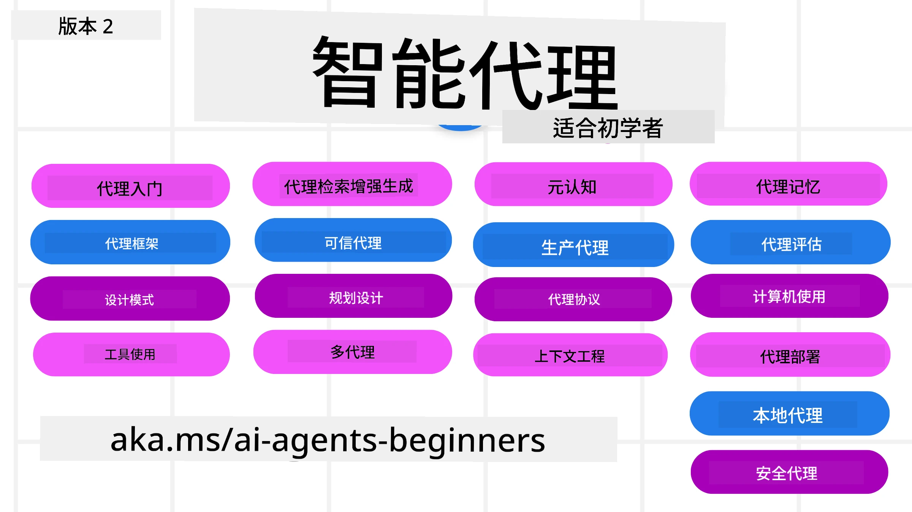

# AI 代理入门课程



## 教你从零开始构建 AI 代理的一门课程

[](https://github.com/microsoft/ai-agents-for-beginners/blob/master/LICENSE?WT.mc_id=academic-105485-koreyst)
[](https://GitHub.com/microsoft/ai-agents-for-beginners/graphs/contributors/?WT.mc_id=academic-105485-koreyst)
[](https://GitHub.com/microsoft/ai-agents-for-beginners/issues/?WT.mc_id=academic-105485-koreyst)
[](https://GitHub.com/microsoft/ai-agents-for-beginners/pulls/?WT.mc_id=academic-105485-koreyst)
[](http://makeapullrequest.com?WT.mc_id=academic-105485-koreyst)

### 🌐 多语言支持

#### 通过 GitHub Action 支持（自动且始终保持最新）

<!-- CO-OP TRANSLATOR LANGUAGES TABLE START -->
[阿拉伯语](../ar/README.md) | [孟加拉语](../bn/README.md) | [保加利亚语](../bg/README.md) | [缅甸语](../my/README.md) | [中文（简体）](./README.md) | [中文（繁体，香港）](../zh-HK/README.md) | [中文（繁体，澳门）](../zh-MO/README.md) | [中文（繁体，台湾）](../zh-TW/README.md) | [克罗地亚语](../hr/README.md) | [捷克语](../cs/README.md) | [丹麦语](../da/README.md) | [荷兰语](../nl/README.md) | [爱沙尼亚语](../et/README.md) | [芬兰语](../fi/README.md) | [法语](../fr/README.md) | [德语](../de/README.md) | [希腊语](../el/README.md) | [希伯来语](../he/README.md) | [印地语](../hi/README.md) | [匈牙利语](../hu/README.md) | [印尼语](../id/README.md) | [意大利语](../it/README.md) | [日语](../ja/README.md) | [卡纳达语](../kn/README.md) | [高棉语](../km/README.md) | [韩语](../ko/README.md) | [立陶宛语](../lt/README.md) | [马来语](../ms/README.md) | [马拉雅拉姆语](../ml/README.md) | [马拉地语](../mr/README.md) | [尼泊尔语](../ne/README.md) | [尼日利亚皮钦语](../pcm/README.md) | [挪威语](../no/README.md) | [波斯语（法尔西）](../fa/README.md) | [波兰语](../pl/README.md) | [葡萄牙语（巴西）](../pt-BR/README.md) | [葡萄牙语（葡萄牙）](../pt-PT/README.md) | [旁遮普语（古鲁穆奇）](../pa/README.md) | [罗马尼亚语](../ro/README.md) | [俄语](../ru/README.md) | [塞尔维亚语（西里尔字母）](../sr/README.md) | [斯洛伐克语](../sk/README.md) | [斯洛文尼亚语](../sl/README.md) | [西班牙语](../es/README.md) | [斯瓦希里语](../sw/README.md) | [瑞典语](../sv/README.md) | [他加禄语（菲律宾语）](../tl/README.md) | [泰米尔语](../ta/README.md) | [泰卢固语](../te/README.md) | [泰语](../th/README.md) | [土耳其语](../tr/README.md) | [乌克兰语](../uk/README.md) | [乌尔都语](../ur/README.md) | [越南语](../vi/README.md)

> **倾向于本地克隆？**
>
> 此仓库包含 50 多种语言的翻译文件，这会大幅增加下载大小。若想不带翻译文件克隆，请使用稀疏检出:
>
> **Bash / macOS / Linux:**
> ```bash
> git clone --filter=blob:none --sparse https://github.com/microsoft/ai-agents-for-beginners.git
> cd ai-agents-for-beginners
> git sparse-checkout set --no-cone '/*' '!translations' '!translated_images'
> ```
>
> **CMD（Windows）：**
> ```cmd
> git clone --filter=blob:none --sparse https://github.com/microsoft/ai-agents-for-beginners.git
> cd ai-agents-for-beginners
> git sparse-checkout set --no-cone "/*" "!translations" "!translated_images"
> ```
>
> 这样可以用更快的速度下载你完成课程所需要的一切内容。
<!-- CO-OP TRANSLATOR LANGUAGES TABLE END -->

**如果您希望支持更多翻译语言，它们列在[此处](https://github.com/Azure/co-op-translator/blob/main/getting_started/supported-languages.md)。**

[](https://GitHub.com/microsoft/ai-agents-for-beginners/watchers/?WT.mc_id=academic-105485-koreyst)
[](https://GitHub.com/microsoft/ai-agents-for-beginners/network/?WT.mc_id=academic-105485-koreyst)
[](https://GitHub.com/microsoft/ai-agents-for-beginners/stargazers/?WT.mc_id=academic-105485-koreyst)

[](https://discord.gg/nTYy5BXMWG)


## 🌱 入门指南

本课程包含构建 AI 代理基础知识的课程。每节课讲解一个主题，可以根据兴趣随意开始！

本课程支持多种语言。请查看我们的[可用语言列表](#-multi-language-support)。

如果你是第一次使用生成式 AI 模型构建，推荐查看我们的[生成式 AI 入门](https://aka.ms/genai-beginners)课程，包含 21 课关于用 GenAI 构建的内容。

别忘了给本仓库点赞（🌟）和[fork本仓库](https://github.com/microsoft/ai-agents-for-beginners/fork)运行代码。

### 结识其他学习者，获取问题解答

如果遇到困难或对构建 AI 代理有任何问题，欢迎加入我们在 [Microsoft Foundry Discord](https://aka.ms/ai-agents/discord) 的专属 Discord 频道。

### 你需要准备的东西

每课都包含代码示例，示例位置在 code_samples 文件夹。你可以[fork本仓库](https://github.com/microsoft/ai-agents-for-beginners/fork)创建自己的副本。

这些练习中使用的代码示例采用 Microsoft Agent Framework 和 Azure AI Foundry Agent Service V2：

- [Microsoft Foundry](https://aka.ms/ai-agents-beginners/ai-foundry) - 需要 Azure 账号

本课程用到微软的以下 AI Agent 框架和服务：

- [Microsoft Agent Framework (MAF)](https://aka.ms/ai-agents-beginners/agent-framework)
- [Azure AI Foundry Agent Service V2](https://aka.ms/ai-agents-beginners/ai-agent-service)

某些代码示例也支持替代的 OpenAI 兼容提供者，如提供大型上下文模型（最长204K标记）的 [MiniMax](https://platform.minimaxi.com/)。请参阅[课程设置](./00-course-setup/README.md)了解配置细节。

有关运行本课程代码的更多信息，请访问[课程设置](./00-course-setup/README.md)。

## 🙏 想帮忙吗？

你有建议或发现拼写或代码错误？[提出问题](https://github.com/microsoft/ai-agents-for-beginners/issues?WT.mc_id=academic-105485-koreyst)或[创建拉取请求](https://github.com/microsoft/ai-agents-for-beginners/pulls?WT.mc_id=academic-105485-koreyst)


## 📂 每课包含

- README 中的书面课程和短视频
- 使用 Microsoft Agent Framework 和 Azure AI Foundry 的 Python 代码示例
- 继续学习的额外资源链接


## 🗃️ 课程列表

| <strong>课程</strong>                                   | <strong>文字与代码</strong>                                    | <strong>视频</strong>                                                  | <strong>额外学习</strong>                                                                     |
|--------------------------------------------|-------------------------------------------------|----------------------------------------------------------|----------------------------------------------------------------------------------|
| AI 代理及其使用场景简介                     | [链接](./01-intro-to-ai-agents/README.md)        | [视频](https://youtu.be/3zgm60bXmQk?si=z8QygFvYQv-9WtO1)  | [链接](https://aka.ms/ai-agents-beginners/collection?WT.mc_id=academic-105485-koreyst) |
| 探索 AI 代理框架                           | [链接](./02-explore-agentic-frameworks/README.md)| [视频](https://youtu.be/ODwF-EZo_O8?si=Vawth4hzVaHv-u0H)  | [链接](https://aka.ms/ai-agents-beginners/collection?WT.mc_id=academic-105485-koreyst) |
| 理解 AI 代理设计模式                       | [链接](./03-agentic-design-patterns/README.md)   | [视频](https://youtu.be/m9lM8qqoOEA?si=BIzHwzstTPL8o9GF)  | [链接](https://aka.ms/ai-agents-beginners/collection?WT.mc_id=academic-105485-koreyst) |
| 工具使用设计模式                           | [链接](./04-tool-use/README.md)                   | [视频](https://youtu.be/vieRiPRx-gI?si=2z6O2Xu2cu_Jz46N)  | [链接](https://aka.ms/ai-agents-beginners/collection?WT.mc_id=academic-105485-koreyst) |
| 代理检索增强生成（Agentic RAG）            | [链接](./05-agentic-rag/README.md)                | [视频](https://youtu.be/WcjAARvdL7I?si=gKPWsQpKiIlDH9A3)  | [链接](https://aka.ms/ai-agents-beginners/collection?WT.mc_id=academic-105485-koreyst) |
| 构建可信赖的 AI 代理                       | [链接](./06-building-trustworthy-agents/README.md)| [视频](https://youtu.be/iZKkMEGBCUQ?si=jZjpiMnGFOE9L8OK ) | [链接](https://aka.ms/ai-agents-beginners/collection?WT.mc_id=academic-105485-koreyst) |
| 规划设计模式                               | [链接](./07-planning-design/README.md)            | [视频](https://youtu.be/kPfJ2BrBCMY?si=6SC_iv_E5-mzucnC)  | [链接](https://aka.ms/ai-agents-beginners/collection?WT.mc_id=academic-105485-koreyst) |
| 多代理设计模式                             | [链接](./08-multi-agent/README.md)                | [视频](https://youtu.be/V6HpE9hZEx0?si=rMgDhEu7wXo2uo6g)  | [链接](https://aka.ms/ai-agents-beginners/collection?WT.mc_id=academic-105485-koreyst) |
| 元认知设计模式                 | [链接](./09-metacognition/README.md)               | [视频](https://youtu.be/His9R6gw6Ec?si=8gck6vvdSNCt6OcF)  | [链接](https://aka.ms/ai-agents-beginners/collection?WT.mc_id=academic-105485-koreyst) |
| 生产环境中的 AI 代理                      | [链接](./10-ai-agents-production/README.md)        | [视频](https://youtu.be/l4TP6IyJxmQ?si=31dnhexRo6yLRJDl)  | [链接](https://aka.ms/ai-agents-beginners/collection?WT.mc_id=academic-105485-koreyst) |
| 使用代理协议 (MCP, A2A 和 NLWeb) | [链接](./11-agentic-protocols/README.md)           | [视频](https://youtu.be/X-Dh9R3Opn8)                                 | [链接](https://aka.ms/ai-agents-beginners/collection?WT.mc_id=academic-105485-koreyst) |
| AI 代理的上下文工程            | [链接](./12-context-engineering/README.md)         | [视频](https://youtu.be/F5zqRV7gEag)                                 | [链接](https://aka.ms/ai-agents-beginners/collection?WT.mc_id=academic-105485-koreyst) |
| 管理代理记忆                      | [链接](./13-agent-memory/README.md)     |      [视频](https://youtu.be/QrYbHesIxpw?si=vZkVwKrQ4ieCcIPx)                                                      |                                                                                        |
| 探索微软代理框架                         | [链接](./14-microsoft-agent-framework/README.md)                            |                                                            |                                                                                        |
| 构建计算机使用代理 (CUA)           | [链接](./15-browser-use/README.md)     |                                                            | [链接](https://docs.browser-use.com/examples/templates/playwright-integration)         |
| 部署可扩展代理                    | 即将推出                            |                                                            |                                                                                        |
| 创建本地 AI 代理                     | 即将推出                               |                                                            |                                                                                        |
| 保障 AI 代理安全                           | [链接](./18-securing-ai-agents/README.md)  |                                                            | [链接](https://aka.ms/ai-agents-beginners/collection?WT.mc_id=academic-105485-koreyst) |

## 🎒 其他课程

我们的团队还制作了其他课程！查看：

<!-- CO-OP TRANSLATOR OTHER COURSES START -->
### LangChain
[](https://aka.ms/langchain4j-for-beginners)
[](https://aka.ms/langchainjs-for-beginners?WT.mc_id=m365-94501-dwahlin)
[](https://github.com/microsoft/langchain-for-beginners?WT.mc_id=m365-94501-dwahlin)
---

### Azure / Edge / MCP / 代理
[](https://github.com/microsoft/AZD-for-beginners?WT.mc_id=academic-105485-koreyst)
[](https://github.com/microsoft/edgeai-for-beginners?WT.mc_id=academic-105485-koreyst)
[](https://github.com/microsoft/mcp-for-beginners?WT.mc_id=academic-105485-koreyst)
[](https://github.com/microsoft/ai-agents-for-beginners?WT.mc_id=academic-105485-koreyst)

---
 
### 生成式 AI 系列
[](https://github.com/microsoft/generative-ai-for-beginners?WT.mc_id=academic-105485-koreyst)
[-9333EA?style=for-the-badge&labelColor=E5E7EB&color=9333EA)](https://github.com/microsoft/Generative-AI-for-beginners-dotnet?WT.mc_id=academic-105485-koreyst)
[-C084FC?style=for-the-badge&labelColor=E5E7EB&color=C084FC)](https://github.com/microsoft/generative-ai-for-beginners-java?WT.mc_id=academic-105485-koreyst)
[-E879F9?style=for-the-badge&labelColor=E5E7EB&color=E879F9)](https://github.com/microsoft/generative-ai-with-javascript?WT.mc_id=academic-105485-koreyst)

---
 
### 核心学习
[](https://aka.ms/ml-beginners?WT.mc_id=academic-105485-koreyst)
[](https://aka.ms/datascience-beginners?WT.mc_id=academic-105485-koreyst)
[](https://aka.ms/ai-beginners?WT.mc_id=academic-105485-koreyst)
[](https://github.com/microsoft/Security-101?WT.mc_id=academic-96948-sayoung)
[](https://aka.ms/webdev-beginners?WT.mc_id=academic-105485-koreyst)
[](https://aka.ms/iot-beginners?WT.mc_id=academic-105485-koreyst)
[](https://github.com/microsoft/xr-development-for-beginners?WT.mc_id=academic-105485-koreyst)

---
 
### Copilot 系列
[](https://aka.ms/GitHubCopilotAI?WT.mc_id=academic-105485-koreyst)
[](https://github.com/microsoft/mastering-github-copilot-for-dotnet-csharp-developers?WT.mc_id=academic-105485-koreyst)
[](https://github.com/microsoft/CopilotAdventures?WT.mc_id=academic-105485-koreyst)
<!-- CO-OP TRANSLATOR OTHER COURSES END -->

## 🌟 社区感谢

感谢 [Shivam Goyal](https://www.linkedin.com/in/shivam2003/) 贡献了展示 Agentic RAG 的重要代码示例。

## 贡献

本项目欢迎贡献和建议。大多数贡献需要您同意一份贡献者许可协议（CLA），声明您有权并且确实授予我们使用您贡献的权利。详情请访问 <https://cla.opensource.microsoft.com>。

当您提交拉取请求时，CLA 机器人将自动确定您是否需要提供 CLA 并适当标注 PR（例如状态检查、评论）。只需按照机器人提供的说明操作即可。您在所有使用我们 CLA 的仓库中只需执行此操作一次。

本项目采用了 [微软开源行为准则](https://opensource.microsoft.com/codeofconduct/)。
更多信息请参见[行为准则常见问题](https://opensource.microsoft.com/codeofconduct/faq/)或通过电子邮件联系 [opencode@microsoft.com](mailto:opencode@microsoft.com) 以提出任何问题或建议。

## 商标

本项目可能包含项目、产品或服务的商标或徽标。授权使用微软商标或徽标须遵循
[微软商标及品牌指南](https://www.microsoft.com/legal/intellectualproperty/trademarks/usage/general)。
在本项目的修改版本中使用微软商标或徽标不得引起混淆或暗示微软赞助。
任何第三方商标或徽标的使用均需遵守相应的第三方政策。

## 获取帮助

如果您遇到困难或有任何关于构建 AI 应用的问题，欢迎加入：

[](https://aka.ms/foundry/discord)

如果您在构建过程中有产品反馈或遇到错误，请访问：

[](https://aka.ms/foundry/forum)

---

<!-- CO-OP TRANSLATOR DISCLAIMER START -->
**免责声明**：
本文件由 AI 翻译服务 [Co-op Translator](https://github.com/Azure/co-op-translator) 翻译完成。尽管我们力求准确，但请注意，自动翻译可能包含错误或不准确之处。原始语言版文件应视为权威来源。对于重要信息，建议使用专业人工翻译。我们对因使用本翻译而产生的任何误解或误释不承担责任。
<!-- CO-OP TRANSLATOR DISCLAIMER END -->