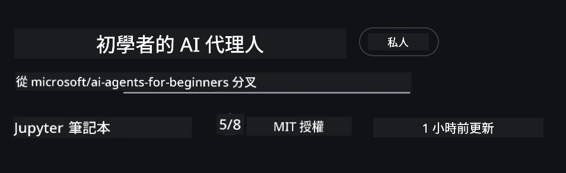
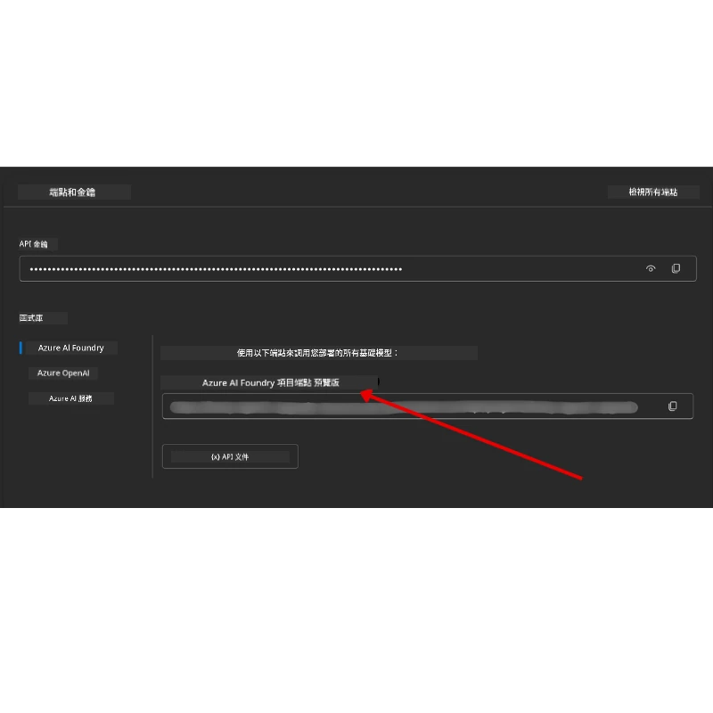

# 課程設置

## 介紹

本課程將涵蓋如何運行本課程的程式碼範例。

## 加入其他學員並獲得幫助

在開始克隆您的倉庫之前，請加入[AI Agents For Beginners Discord 頻道](https://aka.ms/ai-agents/discord)，以獲得任何設置幫助、課程相關問題或與其他學員連繫。

## 克隆或分叉此倉庫

首先，請克隆或分叉 GitHub 倉庫。這將建立您自己版本的課程資源，以便您可以運行、測試和調整程式碼！

您可以透過點擊鏈接來<a href="https://github.com/microsoft/ai-agents-for-beginners/fork" target="_blank">分叉此倉庫</a>

現在您應該擁有此課程的分叉版本，位置如下：



### 淺層克隆（建議用於工作坊 / Codespaces）

  >當您下載完整歷史和所有檔案時，完整倉庫可能很大（約3GB）。如果您只參加工作坊或只需部分課程資料夾，淺層克隆（或稀疏克隆）可通過截斷歷史及/或跳過二進制檔案，避免大部分下載。

#### 快速淺層克隆 — 最小歷史，所有檔案

將以下指令中的 `<your-username>` 替換為您的分叉 URL（或如果您願意，也可用上游 URL）。

只克隆最新的提交歷史（下載量小）：

```bash|powershell
git clone --depth 1 https://github.com/<your-username>/ai-agents-for-beginners.git
```

克隆特定分支：

```bash|powershell
git clone --depth 1 --branch <branch-name> https://github.com/<your-username>/ai-agents-for-beginners.git
```

#### 部分（稀疏）克隆 — 最小二進制檔案 + 只選擇資料夾

使用部分克隆和稀疏檢出（需要 Git 2.25+，建議使用支持部分克隆的較新 Git 版本）：

```bash|powershell
git clone --depth 1 --filter=blob:none --sparse https://github.com/<your-username>/ai-agents-for-beginners.git
```

進入倉庫資料夾：

```bash|powershell
cd ai-agents-for-beginners
```

然後指定您想要的資料夾（下面示範兩個資料夾）：

```bash|powershell
git sparse-checkout set 00-course-setup 01-intro-to-ai-agents
```

克隆並驗證檔案後，如果您只需要檔案且想要騰出空間（無需 Git 歷史），請刪除倉庫元資料（💀不可逆，將失去所有 Git 功能：無法提交、拉取、推送或存取歷史）。

```bash
# zsh/bash
rm -rf .git
```

```powershell
# PowerShell
Remove-Item -Recurse -Force .git
```

#### 使用 GitHub Codespaces（建議避免本地大檔下載）

- 透過[GitHub UI](https://github.com/codespaces)為此倉庫創建新的 Codespace。

- 在新建 Codespace 的終端中運行上述淺層/稀疏克隆指令，只引入您需要的課程資料夾至 Codespace 工作區。
- 選擇性：在 Codespaces 內克隆後，可刪除 .git 以回收額外空間（見上述刪除指令）。
- 注意：若您偏好直接在 Codespaces 開啟倉庫（不額外克隆），需注意 Codespaces 會建構 devcontainer 環境，可能會配置超過您所需的內容。在新 Codespace 中克隆淺層副本，可更好地控管磁碟使用量。

#### 提示

- 如要進行編輯/提交，請務必替換克隆 URL 為您的分叉。
- 若日後需要更多歷史或檔案，您也可拉取或調整稀疏檢出以包含其他資料夾。

## 運行程式碼

本課程提供多個 Jupyter 筆記本，您可以運行它們以獲得建構 AI Agents 的實作經驗。

程式碼範例使用 **Microsoft Agent Framework (MAF)**，搭配 `AzureAIProjectAgentProvider`，它透過 **Microsoft Foundry** 連接至 **Azure AI Agent Service V2**（回應 API）。

所有 Python 筆記本皆標記為 `*-python-agent-framework.ipynb`。

## 要求

- Python 3.12+
  - **注意**：如果您尚未安裝 Python 3.12，請先安裝。然後使用 python3.12 建立您的虛擬環境，確保安裝 requirements.txt 中指定的正確版本。

    >範例

    建立 Python 虛擬環境資料夾：

    ```bash|powershell
    python -m venv venv
    ```

    然後啟動虛擬環境：

    ```bash
    # zsh/bash
    source venv/bin/activate
    ```
  
    ```dos
    # Command Prompt for Windows
    venv\Scripts\activate
    ```

- .NET 10+：針對使用 .NET 的範例程式碼，請確保安裝 [.NET 10 SDK](https://dotnet.microsoft.com/download/dotnet/10.0) 或更新版本。接著，檢查已安裝的 .NET SDK 版本：

    ```bash|powershell
    dotnet --list-sdks
    ```

- **Azure CLI** — 需用於認證。從 [aka.ms/installazurecli](https://aka.ms/installazurecli) 安裝。
- **Azure 訂閱** — 用於存取 Microsoft Foundry 和 Azure AI Agent Service。
- **Microsoft Foundry 專案** — 需有已部署模型的專案（例如 `gpt-4o`）。見以下[步驟 1](../../../00-course-setup)。

本倉庫根目錄包含 `requirements.txt`，內含運行程式碼範例所需的全部 Python 套件。

您可以在倉庫根目錄的終端執行下列指令安裝：

```bash|powershell
pip install -r requirements.txt
```

建議建立 Python 虛擬環境以避免衝突和問題。

## 設置 VSCode

確保您在 VSCode 使用正確版本的 Python。


## 設定 Microsoft Foundry 及 Azure AI Agent Service

### 步驟 1：建立 Microsoft Foundry 專案

您需要 Azure AI Foundry **hub** 和 **project**，並部署模型以運行筆記本。

1. 前往 [ai.azure.com](https://ai.azure.com) 並以您的 Azure 帳戶登入。
2. 建立一個 **hub**（或使用現有的）。請參考：[Hub 資源概述](https://learn.microsoft.com/azure/ai-foundry/concepts/ai-resources)。
3. 在 hub 內建立一個 **project**。
4. 從 **Models + Endpoints** → **Deploy model** 部署一個模型（例如 `gpt-4o`）。

### 步驟 2：取得您的專案端點和模型部署名稱

於 Microsoft Foundry 入口網站的專案中：

- **專案端點** — 前往 **Overview** 頁面並複製端點 URL。



- **模型部署名稱** — 前往 **Models + Endpoints**，選擇已部署的模型，記下 **Deployment name**（例如 `gpt-4o`）。

### 步驟 3：使用 `az login` 登入 Azure

所有筆記本使用 **`AzureCliCredential`** 認證——無需管理 API 金鑰。這需要您透過 Azure CLI 登入。

1. 如果尚未安裝 Azure CLI，請安裝：[aka.ms/installazurecli](https://aka.ms/installazurecli)

2. 執行以下命令登入：

    ```bash|powershell
    az login
    ```

    如果您身處無瀏覽器的遠端/Codespace 環境，請使用：

    ```bash|powershell
    az login --use-device-code
    ```

3. 如系統提示，選擇訂閱——選擇包含您 Foundry 專案的訂閱。

4. 驗證您是否已登入：

    ```bash|powershell
    az account show
    ```

> **為何使用 `az login`？** 筆記本使用 `azure-identity` 套件的 `AzureCliCredential` 進行身份驗證。這表示您的 Azure CLI 會話負責提供認證——不需在 `.env` 檔案中存放 API 金鑰或密鑰。這是[安全最佳實踐](https://learn.microsoft.com/azure/developer/ai/keyless-connections)。

### 步驟 4：建立您的 `.env` 檔案

複製範例檔案：

```bash
# zsh/bash
cp .env.example .env
```

```powershell
# PowerShell
Copy-Item .env.example .env
```

開啟 `.env` 並填寫以下兩個值：

```env
AZURE_AI_PROJECT_ENDPOINT=https://<your-project>.services.ai.azure.com/api/projects/<your-project-id>
AZURE_AI_MODEL_DEPLOYMENT_NAME=gpt-4o
```

| 變數 | 取得位置 |
|----------|-----------------|
| `AZURE_AI_PROJECT_ENDPOINT` | Foundry 入口網站 → 您的專案 → **Overview** 頁面 |
| `AZURE_AI_MODEL_DEPLOYMENT_NAME` | Foundry 入口網站 → **Models + Endpoints** → 您部署模型的名稱 |

大部分課程就是這些！筆記本將透過您的 `az login` 會話自動認證。

### 步驟 5：安裝 Python 套件依賴

```bash|powershell
pip install -r requirements.txt
```

建議在先前建立的虛擬環境中執行此命令。

## 課程 5 (Agentic RAG) 額外設定

課程 5 使用 **Azure AI Search** 進行檢索增強生成。如您計劃運行該課程，請在 `.env` 檔案新增以下變數：

| 變數 | 取得位置 |
|----------|-----------------|
| `AZURE_SEARCH_SERVICE_ENDPOINT` | Azure 入口網站 → 您的 **Azure AI Search** 資源 → **Overview** → URL |
| `AZURE_SEARCH_API_KEY` | Azure 入口網站 → 您的 **Azure AI Search** 資源 → **Settings** → **Keys** → 主要管理金鑰 |

## 課程 6 及課程 8 (GitHub 模型) 額外設定

部分課程 6 和課程 8 的筆記本使用 **GitHub Models**，而非 Azure AI Foundry。如您打算運行這些範例，請在 `.env` 檔案新增下列變數：

| 變數 | 取得位置 |
|----------|-----------------|
| `GITHUB_TOKEN` | GitHub → **Settings** → **Developer settings** → **Personal access tokens** |
| `GITHUB_ENDPOINT` | 使用 `https://models.inference.ai.azure.com`（預設值） |
| `GITHUB_MODEL_ID` | 使用的模型名稱（例如 `gpt-4o-mini`） |

## 課程 8 (Bing Grounding 工作流程) 額外設定

課程 8 的條件工作流程筆記本使用 **Bing grounding**（透過 Azure AI Foundry）。如您要運行該范例，請在 `.env` 檔案新增下列變數：

| 變數 | 取得位置 |
|----------|-----------------|
| `BING_CONNECTION_ID` | Azure AI Foundry 入口網站 → 您的專案 → **Management** → **Connected resources** → 您的 Bing 連接 → 複製連接 ID |

## 疑難排解

### macOS 上的 SSL 憑證驗證錯誤

如果您使用 macOS 遇到如下錯誤：

```plaintext
ssl.SSLCertVerificationError: [SSL: CERTIFICATE_VERIFY_FAILED] certificate verify failed: self-signed certificate in certificate chain
```

這是 macOS 上 Python 的已知問題，系統 SSL 憑證未自動被信任。請嘗試以下解決方案，依序執行：

**選項 1：執行 Python 的 Install Certificates 腳本（建議）**

```bash
# 用你已安裝的 Python 版本取代 3.XX（例如：3.12 或 3.13）：
/Applications/Python\ 3.XX/Install\ Certificates.command
```

**選項 2：在筆記本使用 `connection_verify=False`（僅限 GitHub Models 筆記本）**

在課程 6 筆記本（`06-building-trustworthy-agents/code_samples/06-system-message-framework.ipynb`）中已包含註解的替代方案。建立客戶端時取消註解 `connection_verify=False`：

```python
client = ChatCompletionsClient(
    endpoint=endpoint,
    credential=AzureKeyCredential(token),
    connection_verify=False,  # 如果遇到證書錯誤，請停用 SSL 驗證
)
```

> **⚠️ 警告：**關閉 SSL 驗證 (`connection_verify=False`) 會降低安全性，因跳過憑證驗證。僅限在開發環境作為臨時解決方案，切勿在生產環境使用。

**選項 3：安裝並使用 `truststore`**

```bash
pip install truststore
```

然後在筆記本或程式碼最上方，任何網路呼叫前加入下列指令：

```python
import truststore
truststore.inject_into_ssl()
```

## 卡住了嗎？

若設置過程中有任何疑問，歡迎加入我們的<a href="https://discord.gg/kzRShWzttr" target="_blank">Azure AI 社群 Discord</a>，或<a href="https://github.com/microsoft/ai-agents-for-beginners/issues?WT.mc_id=academic-105485-koreyst" target="_blank">發起議題</a>。

## 下一課

您現在已準備好運行本課程的程式碼。祝您學習 AI Agents 世界愉快！

[AI Agents 介紹及應用案例](../01-intro-to-ai-agents/README.md)

---

<!-- CO-OP TRANSLATOR DISCLAIMER START -->
**免責聲明**：  
本文件由 AI 翻譯服務 [Co-op Translator](https://github.com/Azure/co-op-translator) 翻譯而成。雖然我們致力於追求準確性，但請注意自動翻譯可能包含錯誤或不準確之處。原始語言文件應被視為權威來源。對於重要資訊，建議採用專業人工翻譯。我們不對因使用本翻譯所引起的任何誤解或誤釋負責。
<!-- CO-OP TRANSLATOR DISCLAIMER END -->