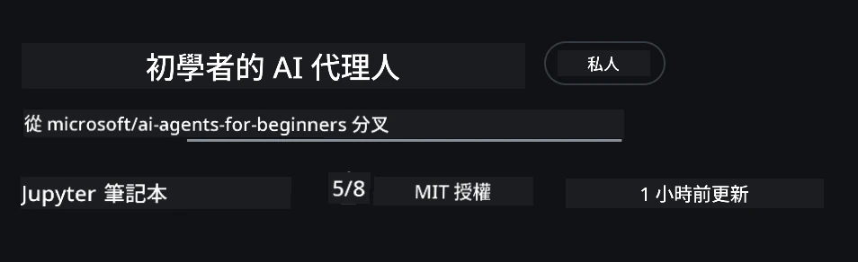
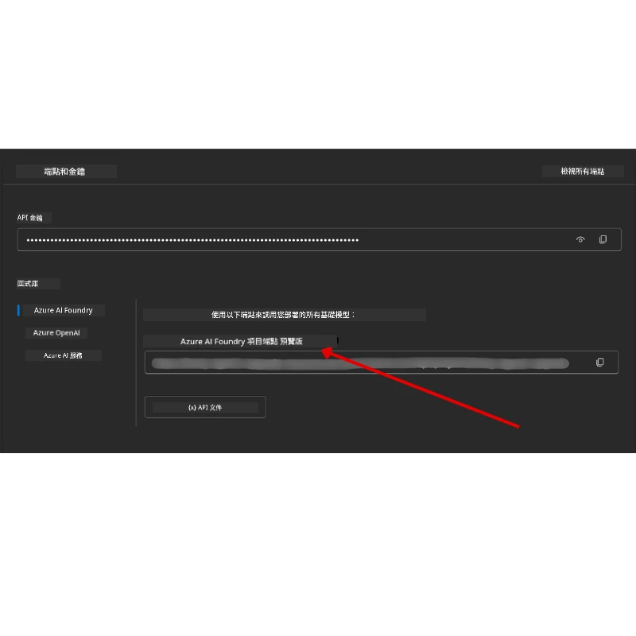

# 課程設置

## 介紹

本課程將介紹如何運行課程中的程式碼範例。

## 加入其他學習者並獲取幫助

在開始克隆你的儲存庫之前，請加入 [AI Agents For Beginners Discord 頻道](https://aka.ms/ai-agents/discord)，以便在設置過程中獲得任何幫助、解決對課程的任何疑問，或與其他學習者交流。

## 克隆或 Fork 此儲存庫

開始之前，請克隆或 Fork GitHub 儲存庫。這樣你就擁有了課程材料的專屬版本，能夠運行、測試及調整程式碼！

你可以點擊此連結 <a href="https://github.com/microsoft/ai-agents-for-beginners/fork" target="_blank">fork 該儲存庫</a>

這樣你就應該會看到屬於你的 fork 版本，連結如下：



### Shallow Clone（推薦用於研討會 / Codespaces）

  >當你下載完整歷史及所有檔案時，完整儲存庫可能很大（約 3 GB）。如果你只參加研討會或只需要少數課程資料夾，淺克隆（或稀疏克隆）會下載較少的資料。

#### 快速淺克隆 —— 最小歷史，含所有檔案

將以下命令中的 `<your-username>` 替換為你的 fork URL（或偏好使用上游 URL）。

只克隆最新提交歷史（下載量小）：

```bash
git clone --depth 1 https://github.com/<your-username>/ai-agents-for-beginners.git
```

克隆特定分支：

```bash
git clone --depth 1 --branch <branch-name> https://github.com/<your-username>/ai-agents-for-beginners.git
```

#### 部分（稀疏）克隆 —— 最少 blobs + 僅包含選定資料夾

此方法使用部分克隆和 sparse-checkout（需 Git 2.25+，推薦使用支持部分克隆的現代 Git）：

```bash
git clone --depth 1 --filter=blob:none --sparse https://github.com/<your-username>/ai-agents-for-beginners.git
```

進入儲存庫資料夾：

```bash
cd ai-agents-for-beginners
```

指定你需要的資料夾（以下範例展示兩個資料夾）：

```bash
git sparse-checkout set 00-course-setup 01-intro-to-ai-agents
```

克隆完畢並確認檔案後，如果你只需要檔案並想釋放空間（不保留 git 歷史），請刪除儲存庫元資料（💀不可復原 — 你將失去所有 Git 功能）：

```bash
# zsh/bash
rm -rf .git
```

```powershell
# PowerShell
Remove-Item -Recurse -Force .git
```

#### 使用 GitHub Codespaces（推薦以避免本機大下載）

- 透過 [GitHub UI](https://github.com/codespaces) 為此儲存庫建立新的 Codespace。  

- 在新創建的 Codespace 終端中執行上述其中一個淺克隆或稀疏克隆命令，只將你需要的課程資料夾拉取到 Codespace 工作區。
- 選擇性：在 Codespaces 裡克隆後，可以移除 .git 以釋放額外空間（參考上述刪除命令）。
- 注意：如果你想直接在 Codespaces 中打開儲存庫（不再額外克隆），請注意 Codespaces 會構建 devcontainer 環境，可能仍會配置超出你需求的東西。

#### 提示

- 如果你想編輯/提交，務必用你的 fork URL 替換克隆地址。
- 如果你日後需要更多歷史或檔案，你可拉取它們或者調整 sparse-checkout 以涵蓋更多資料夾。

## 運行程式碼

本課程提供一系列 Jupyter 筆記本，讓你透過實作體驗構建 AI Agents。

程式碼範例使用 **Microsoft Agent Framework (MAF)** 和 `FoundryChatClient`，此客戶端連接到 **Microsoft Foundry Agent Service V2**（Responses API），其背後是 **Microsoft Foundry**。

所有 Python 筆記本均標記為 `*-python-agent-framework.ipynb`。

## 需求

- Python 3.12+
  - <strong>注意</strong>：若尚未安裝 Python 3.12，請先安裝。接著用 python3.12 建立你的 venv，確保從 requirements.txt 安裝正確版本。
  
    >範例

    建立 Python venv 資料夾：

    ```bash
    python -m venv venv
    ```

    接著啟動 venv 環境：

    ```bash
    # zsh/bash
    source venv/bin/activate
    ```
  
    ```dos
    # Command Prompt for Windows
    venv\Scripts\activate
    ```

- .NET 10+：對於使用 .NET 的範例程式碼，請確保安裝 [.NET 10 SDK](https://dotnet.microsoft.com/download/dotnet/10.0) 或更新版本。然後檢查已安裝的 .NET SDK 版本：

    ```bash
    dotnet --list-sdks
    ```

- **Azure CLI** — 需用於身份驗證。安裝請參考 [aka.ms/installazurecli](https://aka.ms/installazurecli)。
- **Azure 訂閱** — 用於存取 Microsoft Foundry 和 Microsoft Foundry Agent Service。
- **Microsoft Foundry 專案** — 需要有已部署模型的專案（例如 `gpt-5-mini`）。請參考下方 [步驟 1](#步驟-1：建立-microsoft-foundry-專案)。

此儲存庫根目錄中包含 `requirements.txt` 檔案，列出執行程式碼範例所需的 Python 套件。

你可以在儲存庫根目錄的終端機中執行以下指令安裝它們：

```bash
pip install -r requirements.txt
```

我們建議建立 Python 虛擬環境，以避免衝突和問題。

## 設定 VSCode

確認你在 VSCode 中使用的是正確的 Python 版本。


## 設定 Microsoft Foundry 與 Microsoft Foundry Agent Service

### 步驟 1：建立 Microsoft Foundry 專案

在執行筆記本前，你需要一個具有已部署模型的 Microsoft Foundry **hub** 和 <strong>專案</strong>。

1. 前往 [ai.azure.com](https://ai.azure.com) 並使用你的 Azure 帳戶登入。
2. 建立一個 **hub**（或使用現有的）。詳情請參考：[Hub 資源總覽](https://learn.microsoft.com/azure/ai-foundry/concepts/ai-resources)。
3. 在 hub 中建立一個 <strong>專案</strong>。
4. 從 **Models + Endpoints** → <strong>部署模型</strong> 部署一個模型（例如 `gpt-5-mini`）。

### 步驟 2：取得你的專案端點和模型部署名稱

從 Microsoft Foundry 入口網站中你的專案取得：

- <strong>專案端點</strong> — 進入 <strong>總覽</strong> 頁面並複製端點網址。



- <strong>模型部署名稱</strong> — 進入 **Models + Endpoints**，選擇已部署模型，並記下 <strong>部署名稱</strong>（例如 `gpt-5-mini`）。

### 步驟 3：使用 `az login` 登入 Azure

大部分筆記本是透過你的 **Azure CLI 登入** 進行驗證 — 使用 `azure-identity` 套件中的 `AzureCliCredential` 或 `DefaultAzureCredential`（均會使用你的 `az login` 會話），因此不需要 API 金鑰。部分課程或可選整合會使用 API 金鑰，請檢查每堂課的先決條件是否需額外環境變數。你必須透過 Azure CLI 登入。

1. 若尚未安裝，請安裝 Azure CLI：[aka.ms/installazurecli](https://aka.ms/installazurecli)

2. 執行以下指令登入：

    ```bash
    az login
    ```

    或者，如果你在沒有瀏覽器的遠端/Codespace 環境中：

    ```bash
    az login --use-device-code
    ```

3. 若系統提示，請選擇你的訂閱 — 選擇包含 Foundry 專案的訂閱。

4. 驗證你已登入：

    ```bash
    az account show
    ```

> **為什麼要用 `az login`？** 筆記本使用 `azure-identity` 套件的 `AzureCliCredential`（或 `DefaultAzureCredential`，同樣會利用你的 Azure CLI 登入）進行身分驗證。這表示你的 Azure CLI 會話會提供憑證 — 不需在 `.env` 文件中存放 API 金鑰或密鑰。這是一項 [安全最佳實踐](https://learn.microsoft.com/azure/developer/ai/keyless-connections)。

### 步驟 4：建立你的 `.env` 檔案

複製範例文件：

```bash
# zsh/bash
cp .env.example .env
```

```powershell
# PowerShell
Copy-Item .env.example .env
```

打開 `.env`，填寫以下兩個值：

```env
AZURE_AI_PROJECT_ENDPOINT=https://<your-project>.services.ai.azure.com/api/projects/<your-project-id>
AZURE_AI_MODEL_DEPLOYMENT_NAME=gpt-5-mini
```

| 變數 | 取得位置 |
|----------|-----------------|
| `AZURE_AI_PROJECT_ENDPOINT` | Foundry 入口網站 → 你的專案 → <strong>總覽</strong> 頁面 |
| `AZURE_AI_MODEL_DEPLOYMENT_NAME` | Foundry 入口網站 → **Models + Endpoints** → 你已部署的模型名稱 |

大多數課程就到此為止！筆記本將透過你的 `az login` 會話自動驗證身分。

### 步驟 5：安裝 Python 依賴

```bash
pip install -r requirements.txt
```

建議在你先前建立的虛擬環境中執行此命令。

## 可選設置：Azure AI 搜尋（課程 5 和 16）

課程 5（Agentic RAG）和課程 16 筆記本預設可使用 <strong>記憶體內知識庫</strong> 運行 — 無需額外 Azure 資源。若要支援真正的 **Azure AI Search** 索引，需要注意課程 16 筆記本目前使用基於金鑰的身份驗證：當且僅當同時設定 `AZURE_SEARCH_SERVICE_ENDPOINT` <strong>及</strong> `AZURE_SEARCH_API_KEY` 時，才會從記憶體內搜尋切換到 Azure AI Search；否則仍維持記憶體內搜尋。因此若要連線真實索引，必須設定管理員金鑰。針對你自己的生產程式碼，推薦使用 Microsoft Entra ID （RBAC ）的無金鑰身份驗證，與本課程其它部分的 `az login` 流程一致。

下面的 RBAC 步驟適用於本設置指南範例和你自己的程式碼。它不會讓課程 16 筆記本啟用無金鑰身份驗證；課程 16 仍然需要端點與管理員金鑰才能使用 Azure AI Search。

1. <strong>於你的搜尋服務啟用角色基礎存取權限</strong>：

    ```bash
    az search service update --name <service-name> --resource-group <resource-group> --auth-options aadOrApiKey
    ```

2. <strong>為自己分配必需角色</strong>（建立/載入索引與查詢）：

    ```bash
    az role assignment create --assignee <your-user-or-principal-id> --role "Search Service Contributor" --scope $(az search service show -g <resource-group> -n <service-name> --query id -o tsv)
    az role assignment create --assignee <your-user-or-principal-id> --role "Search Index Data Contributor" --scope $(az search service show -g <resource-group> -n <service-name> --query id -o tsv)
    ```

3. **將端點加入 `.env` 檔案中**：

| 變數 | 取得位置 |
|----------|-----------------|
| `AZURE_SEARCH_SERVICE_ENDPOINT` | Azure 入口網站 → 你的 **Azure AI Search** 資源 → <strong>總覽</strong> → URL |
| `AZURE_SEARCH_API_KEY` | 啟用課程 16 筆記本中 Azure AI Search 需同時設置（使用基於金鑰的認證）。Azure 入口網站 → <strong>設定</strong> → <strong>金鑰</strong> → 主要管理金鑰 |

> **為什麼推薦無金鑰？** 管理金鑰會授與搜尋服務完全寫入權限，容易經由 `.env` 文件外洩。使用 RBAC 時會改用你的 `az login` 身分驗證 — 與課程筆記本中透過 `AzureCliCredential` / `DefaultAzureCredential` 使用的無金鑰 Entra ID 模式相同。詳見 [使用角色連線至 Azure AI Search](https://learn.microsoft.com/azure/search/search-security-rbac)。

參考 [Azure AI Search 設置指南](./AzureSearch.md) 獲得完整的索引創建 Python 與 .NET 範例。

## 直接呼叫 Azure OpenAI 的課程額外設置（課程 6 和 8）

部分課程 6 及 8 筆記本會直接呼叫 **Azure OpenAI**（使用 **Responses API**），而非透過 Microsoft Foundry 專案。這些範例之前使用的是 GitHub Models，該服務已棄用且不支援 Responses API。請將以下變數加入你的 `.env` 檔案：

| 變數 | 取得位置 |
|----------|-----------------|
| `AZURE_OPENAI_ENDPOINT` | Azure 入口網站 → 你的 **Azure OpenAI** 資源 → <strong>金鑰與端點</strong> → 端點（例如 `https://<your-resource>.openai.azure.com`） |
| `AZURE_OPENAI_DEPLOYMENT` | 你的已部署模型名稱（例如 `gpt-5-mini`），支援 Responses API |
| `AZURE_OPENAI_API_KEY` | 選填 — 僅當你使用基於金鑰的身份驗證而非 `az login` / Entra ID 時需設定 |

> Responses API 使用穩定的 `/openai/v1/` 端點，無需 `api-version` 參數。請使用 `az login` 進行無金鑰 Entra ID 身份驗證。

## 替代提供者：MiniMax（兼容 OpenAI）

[MiniMax](https://platform.minimaxi.com/) 透過相容 OpenAI 的 API 提供大上下文模型（最高至 204K 令牌）。由於 Microsoft Agent Framework 的 `OpenAIChatClient` 可用於任何相容 OpenAI 端點，你可以在使用 `OpenAIChatClient` 的課程中以 MiniMax 當作替代選項。

請將以下變數加入你的 `.env` 檔案：

| 變數 | 取得位置 |
|----------|-----------------|
| `MINIMAX_API_KEY` | [MiniMax 平台](https://platform.minimaxi.com/) → API 金鑰 |
| `MINIMAX_BASE_URL` | 使用 `https://api.minimax.io/v1`（預設值） |
| `MINIMAX_MODEL_ID` | 使用的模型名稱（例如 `MiniMax-M3`） |

<strong>範例模型</strong>：`MiniMax-M3`（推薦）、`MiniMax-M2.7`、`MiniMax-M2.7-highspeed`（回應速度較快）。模型名稱與可用性可能隨時間變動，且特定模型的使用權限可能取決你的帳戶權限。

凡使用 `OpenAIChatClient` 的程式碼範例（如課程 14 飯店預訂工作流程）會在設置了 `MINIMAX_API_KEY` 時自動偵測並使用 MiniMax 配置。


## 替代提供者：Foundry Local（於本機運行模型）

[Foundry Local](https://foundrylocal.ai) 是一個輕量級的運行環境，能夠下載、管理並完全於您的本機上透過與 OpenAI 相容的 API 來提供語言模型服務 — 不需雲端。

因為 Microsoft Agent Framework 的 `OpenAIChatClient` 可與任何 OpenAI 相容端點合作，Foundry Local 是 Azure OpenAI 的本地替代方案。

**1. 安裝 Foundry Local**

```bash
# Windows
winget install Microsoft.FoundryLocal

# macOS
brew install foundrylocal
```

**2. 下載並執行模型**（同時啟動本地服務）：

```bash
foundry model list          # 查看可用模型
foundry model run phi-4-mini
```

**3. 安裝用以發現本地端點的 Python SDK：**

```bash
pip install foundry-local-sdk
```

**4. 指向 Microsoft Agent Framework 至您的本地模型：**

```python
from foundry_local import FoundryLocalManager
from agent_framework.openai import OpenAIChatClient

# 下載（如有需要）並在本地提供模型，然後發現端點/端口。
manager = FoundryLocalManager("phi-4-mini")

chat_client = OpenAIChatClient(
    base_url=manager.endpoint,      # 例如 http://localhost:<port>/v1
    api_key=manager.api_key,        # 對 Foundry Local 永遠是「不需要」
    model_id=manager.get_model_info("phi-4-mini").id,
)

agent = chat_client.as_agent(
    name="LocalAgent",
    instructions="You are a helpful assistant running fully on-device.",
)
```

> **注意：** Foundry Local 提供一個 OpenAI 相容的 **Chat Completions** 端點。請用於本地開發及離線情境。若需要完整的 **Responses API** 功能集（有狀態對話等），請使用 Azure OpenAI 或 Microsoft Foundry 專案。

## 課程 8 額外設定（Bing 基地運作流程）

課程 8 的條件運作流程筆記本使用 Microsoft Foundry 的 **Bing 基地**。若您計劃執行該範例，請在 `.env` 檔案中加入此變數：

| 變數 | 取得位置 |
|----------|-----------------|
| `BING_CONNECTION_ID` | Microsoft Foundry 入口網站 → 您的專案 → <strong>管理</strong> → <strong>已連接資源</strong> → 您的 Bing 連線 → 複製連線 ID |

## 疑難排解

### macOS 上的 SSL 證書驗證錯誤

如果您使用 macOS 並遇到下列錯誤：

```plaintext
ssl.SSLCertVerificationError: [SSL: CERTIFICATE_VERIFY_FAILED] certificate verify failed: self-signed certificate in certificate chain
```

這是 macOS Python 中已知的問題，系統的 SSL 證書不會自動被信任。請依序嘗試以下解決方案：

**方案 1：執行 Python 的安裝證書腳本（推薦）**

```bash
# 將 3.XX 替換為你已安裝的 Python 版本（例如，3.12 或 3.13）：
/Applications/Python\ 3.XX/Install\ Certificates.command
```

**方案 2：在您的筆記本內設置 `connection_verify=False`（只限 GitHub Models 筆記本）**

在第 6 課的筆記本（`06-building-trustworthy-agents/code_samples/06-system-message-framework.ipynb`）中，已包含此註解掉的解決方案。當發生證書錯誤時，請取消註解 `connection_verify=False`：

```python
client = ChatCompletionsClient(
    endpoint=endpoint,
    credential=AzureKeyCredential(token),
    connection_verify=False,  # 如果遇到證書錯誤，請禁用 SSL 驗證
)
```

> **⚠️ 警告：** 禁用 SSL 驗證 (`connection_verify=False`) 會降低安全性，因為會跳過證書驗證。請僅作為開發環境中的臨時解決方案。切勿在生產環境使用。

**方案 3：安裝並使用 `truststore`**

```bash
pip install truststore
```

接著在筆記本或腳本頂端（任何網路呼叫之前）加入以下內容：

```python
import truststore
truststore.inject_into_ssl()
```

## 卡住了嗎？

若您在執行此設定時遇到任何問題，請加入我們的 <a href="https://discord.gg/kzRShWzttr" target="_blank">Azure AI 社群 Discord</a> 或 <a href="https://github.com/microsoft/ai-agents-for-beginners/issues?WT.mc_id=academic-105485-koreyst" target="_blank">提出問題</a>。

## 下一課

您現在已準備好執行本課程的程式碼。祝您學習 AI 代理人世界愉快！

[AI 代理人與代理人使用案例介紹](../01-intro-to-ai-agents/README.md)

---

<!-- CO-OP TRANSLATOR DISCLAIMER START -->
**免責聲明**：
本文件由 AI 翻譯服務 [Co-op Translator](https://github.com/Azure/co-op-translator) 翻譯而成。雖然我們致力於確保準確性，但請注意，機器自動翻譯可能包含錯誤或不準確之處。原始文件的母語版本應被視為權威來源。對於重要資訊，建議進行專業人工翻譯。我們不對因使用本翻譯而產生的任何誤解或誤釋承擔責任。
<!-- CO-OP TRANSLATOR DISCLAIMER END -->