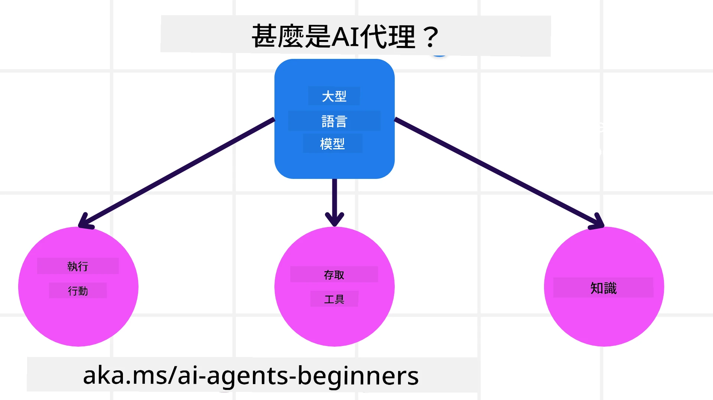
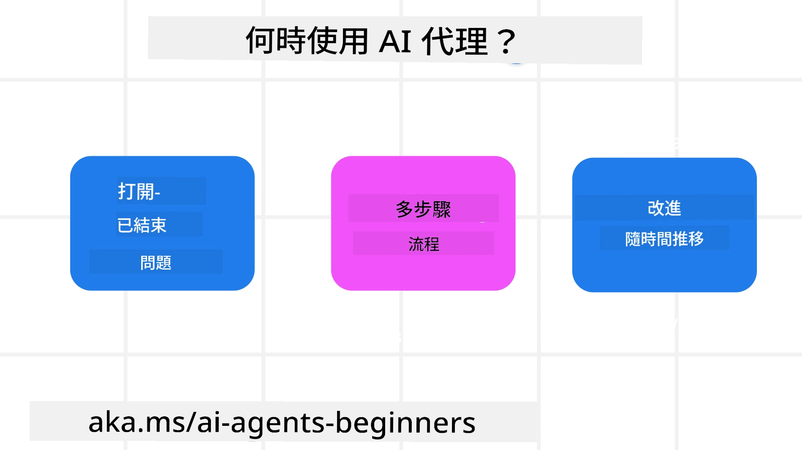

> _(點擊上方圖片觀看本課程視頻)_

# AI 代理及代理使用案例介紹

歡迎參加「初學者的 AI 代理」課程！本課程提供建立 AI 代理的基礎知識和應用範例。

加入 <a href="https://discord.gg/kzRShWzttr" target="_blank">Azure AI Discord 社區</a>，與其他學習者及 AI 代理開發者交流，並隨時提出您對本課程的疑問。

開始本課程時，我們先深入了解什麼是 AI 代理，以及如何在我們建立的應用和工作流程中使用它們。

## 介紹

本課程涵蓋：

- 什麼是 AI 代理及不同類型的代理？
- AI 代理適合哪些使用案例，並如何幫助我們？
- 設計代理解決方案時的一些基本構成要素？

## 學習目標
完成本課程後，您應該能夠：

- 理解 AI 代理的概念及與其他 AI 解決方案的不同之處。
- 有效應用 AI 代理。
- 有生產力地為使用者及客戶設計代理解決方案。

## 定義 AI 代理及 AI 代理的類型

### 什麼是 AI 代理？

AI 代理是**系統**，透過擴展大語言模型（LLMs）的能力，讓其能**執行動作**，這是透過給予 LLMs **工具存取權**及**知識**來實現的。

讓我們將此定義拆解成更小的部分：

- **系統** — 重要的是要將代理視為不只是單一組件，而是一個由多個組件構成的系統。AI 代理的基本組件包括：
  - **環境** — AI 代理運作的定義空間。例如，若我們有一個旅遊訂票 AI 代理，環境可能是旅遊訂票系統，AI 代理在此系統中完成任務。
  - **感測器** — 環境中含有資訊並提供回饋。AI 代理透過感測器蒐集並解讀有關當前環境狀態的資訊。在旅遊訂票代理例子中，系統可提供飯店空房或機票價格等資訊。
  - **執行器** — 當 AI 代理獲得當前環境狀態後，根據正在處理的任務決定執行何種動作以改變環境。例如旅遊訂票代理可能需要為使用者訂一間可用的房間。

**大語言模型** — 代理的概念在 LLMs 出現前即存在。用 LLMs 建構 AI 代理的優勢，在於它們能夠解讀人類語言與資料。此能力使 LLMs 可理解環境資訊並規劃如何改變環境。

**執行動作** — 在 AI 代理系統之外，LLMs 限於根據使用者提示生成內容或資訊。在代理系統中，LLMs 透過解讀使用者的請求，運用可用的工具完成任務。

**存取工具** — LLM 可使用的工具由 1) 所在環境以及 2) AI 代理開發者所限定。以旅遊代理為例，代理的工具受訂票系統可使用操作限制，且開發者可以限制代理只能使用航班工具。

**記憶+知識** — 記憶在使用者與代理間的對話上下文中可為短期記憶。長期而言，除了環境提供的資訊，AI 代理還可以從其他系統、服務、工具甚至其他代理獲取知識。在旅遊代理案例中，這些知識可能來自客戶資料庫中的使用者旅遊偏好資訊。

### 不同類型的代理

現在我們已對 AI 代理有一般定義，接著看一些具體代理類型，以及它們如何應用於旅遊訂票 AI 代理。

| **代理類型**                 | **說明**                                                                                                                              | **範例**                                                                                                                                                                                                                      |
| ----------------------------- | ------------------------------------------------------------------------------------------------------------------------------------- | ----------------------------------------------------------------------------------------------------------------------------------------------------------------------------------------------------------------------------- |
| **簡單反射代理**             | 根據預設規則立即執行動作。                                                                                                           | 旅遊代理解讀電子郵件內容，將旅遊投訴轉交客服部門。                                                                                                                                                                          |
| **基於模型的反射代理**       | 根據世界模型及模型變更執行動作。                                                                                                    | 旅遊代理根據歷史價格資料優先處理價格變動大的路線。                                                                                                                                                                          |
| **目標導向代理**             | 對特定目標設計計劃，解讀目標並決定行動以達成目標。                                                                                  | 旅遊代理從目前位置至目的地，規劃並訂購所需交通工具（汽車、大眾運輸、航班）。                                                                                                                                               |
| **效用導向代理**             | 根據偏好及權衡利弊數值化來決定如何達成目標。                                                                                        | 旅遊代理在訂票時以便利性與成本權衡以最大化效用。                                                                                                                                                                            |
| **學習型代理**               | 根據回饋持續學習改進，調整執行動作。                                                                                                | 旅遊代理利用行後問卷中的顧客回饋優化未來訂票。                                                                                                                                                                              |
| **階層式代理**               | 多層級代理系統，高層代理分解任務給低層代理執行。                                                                                     | 旅遊代理取消行程，分解為子任務（例如取消個別訂單），低層代理完成後回報高層代理。                                                                                                                                           |
| **多代理系統 (MAS)**         | 多代理獨立完成任務，可合作亦可競爭。                                                                                                | 合作型：多代理分別訂飯店、航班及娛樂活動。競爭型：多代理競爭管理共用飯店訂房日曆，為客戶訂房。                                                                                                                           |

## 何時使用 AI 代理

前面章節中我們用旅遊代理案例解釋不同代理類型在旅遊訂票場景的應用，本課程將持續使用此應用案例。

讓我們看看 AI 代理最適合使用的類型案例：

- **開放式問題** — 讓 LLM 判斷完成任務所需步驟，因為無法總是硬編碼在工作流程中。
- **多步驟過程** — 任務複雜度較高，AI 代理需多回合使用工具或資訊，而非一次性檢索。  
- **持續改進** — 代理可透過來自環境或使用者的回饋持續提升，進而提供更佳效用。

更多使用 AI 代理的考量將在「建構可信賴 AI 代理」課程中探討。

## 代理解決方案基礎

### 代理開發

設計 AI 代理系統的第一步是定義工具、行動與行為。本課程聚焦使用 **Azure AI Agent 服務** 來定義代理，該服務提供：

- 選擇 OpenAI、Mistral、Llama 等開放模型
- 使用像 Tripadvisor 這樣的授權資料提供者資料
- 標準化的 OpenAPI 3.0 工具使用

### 代理模式

與 LLM 的溝通是透過提示（prompts）。鑒於 AI 代理半自主的特性，環境變更後不一定可或必須手動重新提示 LLM，我們使用允許多步驟可擴展提示 LLM 的 **代理模式**。

本課程依當前熱門的代理模式劃分章節。

### 代理框架

代理框架讓開發者可以以程式碼實作代理模式。這些框架提供範本、插件和工具以促進智能代理的協同作業，並提升系統監控與故障排除能力。

本課程中，我們將探索用於構建生產就緒 AI 代理的 Microsoft 代理框架 (MAF)。

## 範例程式碼

- Python: [Agent Framework](./code_samples/01-python-agent-framework.ipynb)
- .NET: [Agent Framework](./code_samples/01-dotnet-agent-framework.md)

## 對 AI 代理有更多疑問？

加入 [Microsoft Foundry Discord](https://aka.ms/ai-agents/discord)，與其他學習者交流，參加諮詢時段，獲得 AI 代理問題解答。

## 前一課程

[課程設定](../00-course-setup/README.md)

## 下一課程

[探索代理框架](../02-explore-agentic-frameworks/README.md)

---

<!-- CO-OP TRANSLATOR DISCLAIMER START -->
**免責聲明**：
本文件由 AI 翻譯服務 [Co-op Translator](https://github.com/Azure/co-op-translator) 翻譯而成。儘管我們致力於確保準確性，但請注意自動翻譯可能包含錯誤或不準確之處。文件的原始語言版本應視為權威來源。對於重要資訊，建議採用專業人工翻譯。我們對因使用此翻譯而引起的任何誤解或誤譯概不負責。
<!-- CO-OP TRANSLATOR DISCLAIMER END -->