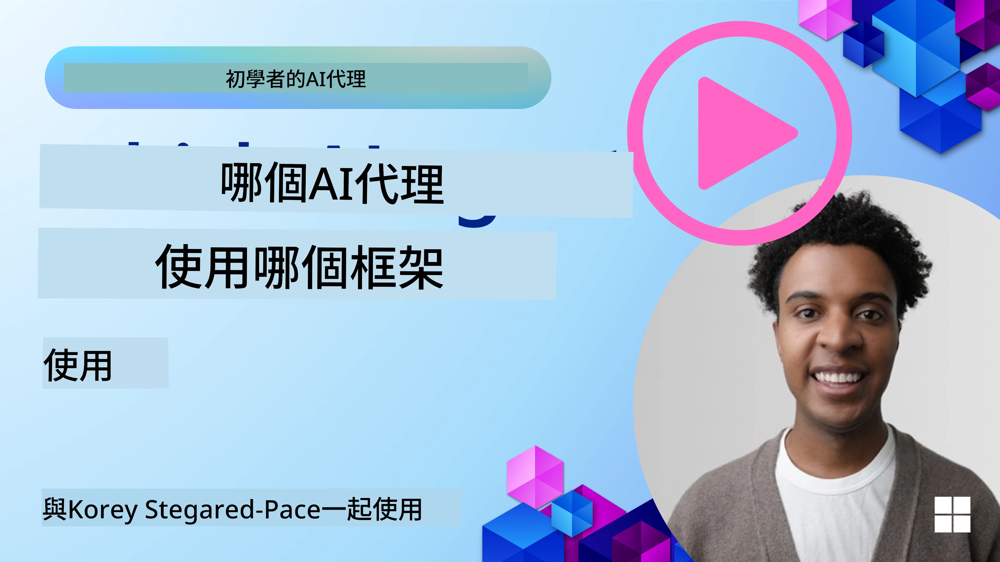

[](https://youtu.be/ODwF-EZo_O8?si=1xoy_B9RNQfrYdF7)

> _(點擊上方圖片觀看本課程影片)_

# 探索 AI 代理框架

AI 代理框架是設計用來簡化 AI 代理創建、部署及管理的軟件平台。這些框架為開發者提供預建構的元件、抽象化層級與工具，簡化複雜 AI 系統的開發流程。

這些框架幫助開發者專注於應用的獨特面向，提供針對 AI 代理開發中的常見挑戰的標準化方案。它們提升 AI 系統建構的可擴展性、易用性及效率。

## 介紹

本課程將涵蓋：

- AI 代理框架是什麼，它們幫助開發者達成哪些目標？
- 團隊如何利用它們快速原型設計、迭代與提升代理能力？
- 微軟所提供的框架與工具（<a href="https://aka.ms/ai-agents-beginners/ai-agent-service" target="_blank">Azure AI Agent Service</a> 及 <a href="https://learn.microsoft.com/azure/ai-services/openai/how-to/responses" target="_blank">Microsoft Agent Framework</a>）有何不同？
- 我能否直接整合現有 Azure 生態系統工具，還是必須使用獨立解決方案？
- 什麼是 Azure AI Agents 服務，它如何幫助我？

## 學習目標

本課程目標是協助你了解：

- AI 代理框架在 AI 開發中的角色。
- 如何善用 AI 代理框架來構建智能代理。
- AI 代理框架所具備的主要功能。
- Microsoft Agent Framework 與 Azure AI Agent Service 的差異。

## 什麼是 AI 代理框架？它們使開發者能做什麼？

傳統 AI 框架可以協助你將 AI 整合進你的應用並以以下方式提升應用品質：

- **個人化**：AI 能分析用戶行為及偏好，提供個性化推薦、內容和體驗。
範例：Netflix 等串流平台利用 AI 根據觀看歷史建議電影與節目，提升用戶參與度和滿意度。
- **自動化與效率**：AI 能自動化重複性任務、優化工作流程並提升營運效率。
範例：客服應用使用 AI 驅動的聊天機器人處理常見詢問，縮短回應時間並讓人工客服能專注處理更複雜問題。
- **增強用戶體驗**：AI 能提升整體體驗，提供語音辨識、自然語言處理及預測文字等智能功能。
範例：虛擬助理如 Siri 與 Google Assistant 利用 AI 理解並回應語音指令，方便用戶操作裝置。

### 那聽起來很棒，那為什麼還需要 AI 代理框架？

AI 代理框架代表著比一般 AI 框架更高層次的東西。它們旨在創建能與用戶、其他代理及環境互動以達成特定目標的智能代理。這些代理能展現自主行為、做出決策並適應變化環境。讓我們來看看 AI 代理框架實現的關鍵功能：

- **代理協作與協調**：能創建多個 AI 代理一同工作、溝通及協調以解決複雜任務。
- **任務自動化與管理**：提供自動化多步工作流程、任務分配與代理間動態任務管理的機制。
- **情境理解與適應**：使代理具備理解情境、適應變化環境並根據即時資訊做決策的能力。

總結來說，代理使你能做更多事情，將自動化提升到下一層次，打造能適應環境並從中學習的更智能系統。

## 如何快速原型設計、迭代與提升代理能力？

這是一個快速變動的領域，但大多數 AI 代理框架共有一些可加速原型與迭代的元素，即模組化元件、協作工具和即時學習。讓我們詳細看看：

- **使用模組化元件**：AI SDK 提供預建構元件如 AI 與記憶體連接器、使用自然語言或程式碼插件調用功能、提示模板等。
- **利用協作工具**：設計具特定角色與任務的代理，測試並完善協作工作流程。
- **即時學習**：實施反饋迴圈，讓代理從互動中學習並動態調整行為。

### 使用模組化元件

像 Microsoft Agent Framework 等 SDK 提供預建元件如 AI 連接器、工具定義與代理管理。

**團隊如何利用這些**：團隊可迅速組合這些元件以建立功能性原型，避免從零開始，促進快速試驗與迭代。

**實務運用方式**：你可以使用預先構建的解析器從用戶輸入中擷取資訊、使用記憶體模組存取與回溯資料，以及使用提示生成器與使用者互動，而無需自行開發這些元件。

**範例程式碼**。以下為使用 Microsoft Agent Framework 結合 `AzureAIProjectAgentProvider`，令模型透過工具調用回應用戶輸入的示例：

``` python
# Microsoft Agent Framework Python 範例

import asyncio
import os
from typing import Annotated

from agent_framework.azure import AzureAIProjectAgentProvider
from azure.identity import AzureCliCredential


# 定義一個範例工具函數來預訂行程
def book_flight(date: str, location: str) -> str:
    """Book travel given location and date."""
    return f"Travel was booked to {location} on {date}"


async def main():
    provider = AzureAIProjectAgentProvider(credential=AzureCliCredential())
    agent = await provider.create_agent(
        name="travel_agent",
        instructions="Help the user book travel. Use the book_flight tool when ready.",
        tools=[book_flight],
    )

    response = await agent.run("I'd like to go to New York on January 1, 2025")
    print(response)
    # 範例輸出：您在2025年1月1日飛往紐約的航班已成功預訂。祝旅途愉快！ ✈️🗽


if __name__ == "__main__":
    asyncio.run(main())
```

從這個範例可以看出，你如何利用預建解析器從使用者輸入中擷取關鍵資訊，比如航班預訂的起點、目的地與日期。此模組化方法讓你專注於高階邏輯。

### 利用協作工具

像 Microsoft Agent Framework 這類框架促進多代理共同工作。

**團隊如何利用這些**：團隊可設計具特定角色及任務的代理，進行協作工作流程測試與優化，提升系統總體效率。

**實務運用方式**：你可以建立一組代理團隊，每個代理負責專門功能如資料檢索、分析或決策。這些代理能溝通並分享資訊，以達成共通目標，如回答用戶問題或完成任務。

**範例程式碼（Microsoft Agent Framework）**：

```python
# 使用 Microsoft Agent Framework 建立多個協同運作的代理人

import os
from agent_framework.azure import AzureAIProjectAgentProvider
from azure.identity import AzureCliCredential

provider = AzureAIProjectAgentProvider(credential=AzureCliCredential())

# 資料擷取代理人
agent_retrieve = await provider.create_agent(
    name="dataretrieval",
    instructions="Retrieve relevant data using available tools.",
    tools=[retrieve_tool],
)

# 資料分析代理人
agent_analyze = await provider.create_agent(
    name="dataanalysis",
    instructions="Analyze the retrieved data and provide insights.",
    tools=[analyze_tool],
)

# 按順序執行代理人以處理任務
retrieval_result = await agent_retrieve.run("Retrieve sales data for Q4")
analysis_result = await agent_analyze.run(f"Analyze this data: {retrieval_result}")
print(analysis_result)
```

前述程式碼顯示你如何建立一個多代理協作分析資料的任務。每個代理執行特定功能，透過協作來完成期望結果。藉由創建具專門角色的代理，可提升任務效率與表現。

### 即時學習

先進框架提供即時情境理解與適應功能。

**團隊如何利用這些**：團隊可實施反饋迴圈，讓代理從互動中學習並動態調整行為，持續改進與優化能力。

**實務運用方式**：代理能分析用戶反饋、環境資料及任務結果，更新知識庫、調整決策算法，進而提升效能。此反覆學習流程使代理得以適應變化條件與用戶偏好，強化系統整體效能。

## Microsoft Agent Framework 與 Azure AI Agent Service 有何差異？

可從設計理念、功能及適用範圍來看這兩者的主要差異：

## Microsoft Agent Framework (MAF)

Microsoft Agent Framework 提供一套簡化的 SDK，使用 `AzureAIProjectAgentProvider` 建構 AI 代理。它讓開發者能創建結合 Azure OpenAI 模型、內建工具調用、對話管理及企業級透過 Azure 身份認證的代理。

**使用案例**：打造可用於生產環境，具備工具調用、多步作業流程及企業整合應用的 AI 代理。

以下是 Microsoft Agent Framework 的重要核心概念：

- **代理**。代理透過 `AzureAIProjectAgentProvider` 創建，並配置名稱、指令與工具。代理可：
  - **處理用戶訊息**，並使用 Azure OpenAI 模型生成回應。
  - **根據對話情境自動調用工具**。
  - **跨多次互動維持對話狀態**。

  下面程式碼範例展示如何創建代理：

    ```python
    import os
    from agent_framework.azure import AzureAIProjectAgentProvider
    from azure.identity import AzureCliCredential

    provider = AzureAIProjectAgentProvider(credential=AzureCliCredential())
    agent = await provider.create_agent(
        name="my_agent",
        instructions="You are a helpful assistant.",
    )

    response = await agent.run("Hello, World!")
    print(response)
    ```

- **工具**。框架支持將 Python 函數定義為代理可自動調用的工具。工具在創建代理時註冊：

    ```python
    def get_weather(location: str) -> str:
        """Get the current weather for a location."""
        return f"The weather in {location} is sunny, 72\u00b0F."

    agent = await provider.create_agent(
        name="weather_agent",
        instructions="Help users check the weather.",
        tools=[get_weather],
    )
    ```

- **多代理協調**。可創建多個專長不同的代理並協調其工作：

    ```python
    planner = await provider.create_agent(
        name="planner",
        instructions="Break down complex tasks into steps.",
    )

    executor = await provider.create_agent(
        name="executor",
        instructions="Execute the planned steps using available tools.",
        tools=[execute_tool],
    )

    plan = await planner.run("Plan a trip to Paris")
    result = await executor.run(f"Execute this plan: {plan}")
    ```

- **Azure 身份整合**。框架使用 `AzureCliCredential`（或 `DefaultAzureCredential`）進行安全無需密鑰的認證，避免須直接管理 API 金鑰。

## Azure AI Agent Service

Azure AI Agent Service 是較新的服務，於 Microsoft Ignite 2024 發表。它允許開發並部署更具彈性的 AI 代理模型，如直接調用開源大型語言模型 Llama 3、Mistral 及 Cohere。

Azure AI Agent Service 提供更強的企業安全機制與資料存儲方式，適合企業應用。

它與 Microsoft Agent Framework 無縫整合，方便構建與部署代理。

本服務目前為公開預覽，支援使用 Python 及 C# 建立代理。

透過 Azure AI Agent Service Python SDK，可以建立帶有自訂工具的代理：

```python
import asyncio
from azure.identity import DefaultAzureCredential
from azure.ai.projects import AIProjectClient

# 定義工具函數
def get_specials() -> str:
    """Provides a list of specials from the menu."""
    return """
    Special Soup: Clam Chowder
    Special Salad: Cobb Salad
    Special Drink: Chai Tea
    """

def get_item_price(menu_item: str) -> str:
    """Provides the price of the requested menu item."""
    return "$9.99"


async def main() -> None:
    credential = DefaultAzureCredential()
    project_client = AIProjectClient.from_connection_string(
        credential=credential,
        conn_str="your-connection-string",
    )

    agent = project_client.agents.create_agent(
        model="gpt-4o-mini",
        name="Host",
        instructions="Answer questions about the menu.",
        tools=[get_specials, get_item_price],
    )

    thread = project_client.agents.create_thread()

    user_inputs = [
        "Hello",
        "What is the special soup?",
        "How much does that cost?",
        "Thank you",
    ]

    for user_input in user_inputs:
        print(f"# User: '{user_input}'")
        message = project_client.agents.create_message(
            thread_id=thread.id,
            role="user",
            content=user_input,
        )
        run = project_client.agents.create_and_process_run(
            thread_id=thread.id, agent_id=agent.id
        )
        messages = project_client.agents.list_messages(thread_id=thread.id)
        print(f"# Agent: {messages.data[0].content[0].text.value}")


if __name__ == "__main__":
    asyncio.run(main())
```

### 核心概念

Azure AI Agent Service 具備以下核心概念：

- **代理**。Azure AI Agent Service 整合 Microsoft Foundry。於 AI Foundry 中，AI 代理作為「智能」微服務，用於回答問題（RAG）、執行動作或完全自動化工作流程。其結合生成式 AI 模型與工具，能存取並互動於真實世界資料來源。以下為代理範例：

    ```python
    agent = project_client.agents.create_agent(
        model="gpt-4o-mini",
        name="my-agent",
        instructions="You are helpful agent",
        tools=code_interpreter.definitions,
        tool_resources=code_interpreter.resources,
    )
    ```

    範例建立了模型 `gpt-4o-mini`，名稱為 `my-agent`，指令為 `You are helpful agent` 的代理。代理配備工具與資源，執行程式碼解釋任務。

- **對話串與訊息**。對話串是另一重要概念，代表代理與用戶間的對話或互動。對話串用於追蹤對話進展、儲存情境資訊及管理互動狀態。以下為對話串範例：

    ```python
    thread = project_client.agents.create_thread()
    message = project_client.agents.create_message(
        thread_id=thread.id,
        role="user",
        content="Could you please create a bar chart for the operating profit using the following data and provide the file to me? Company A: $1.2 million, Company B: $2.5 million, Company C: $3.0 million, Company D: $1.8 million",
    )
    
    # Ask the agent to perform work on the thread
    run = project_client.agents.create_and_process_run(thread_id=thread.id, agent_id=agent.id)
    
    # Fetch and log all messages to see the agent's response
    messages = project_client.agents.list_messages(thread_id=thread.id)
    print(f"Messages: {messages}")
    ```

    程式碼中創建了一個對話串，接著發送訊息至串中。透過呼叫 `create_and_process_run`，代理會於該對話串執行工作。最後取回訊息並記錄，以觀察代理回應。訊息會顯示用戶與代理間的對話進度。亦須了解訊息可為文字、圖片或檔案等多種型態，例如代理工作結果為圖片或文字回應。開發者可利用此資訊進行後續處理或呈現予使用者。

- **整合 Microsoft Agent Framework**。Azure AI Agent Service 與 Microsoft Agent Framework 完美整合，這代表你可用 `AzureAIProjectAgentProvider` 構建代理，並經由 Agent Service 部署於生產環境。

**使用案例**：適合需企業級安全、可擴展及彈性 AI 代理部署的企業應用。

## 這兩者差異在哪？

看起來有重疊，但在設計、功能與目標用途上，仍有以下關鍵差異：

- **Microsoft Agent Framework (MAF)**：為生產就緒的 SDK，提供簡化 API 以創建具工具調用、對話管理及 Azure 身份整合的 AI 代理。
- **Azure AI Agent Service**：為 Azure Foundry 中的代理平台及部署服務，內建連接 Azure OpenAI、Azure AI Search、Bing Search 及程式碼執行等服務。

還是不確定怎麼選？

### 使用場景

讓我們透過一些常見使用情境，幫助你決定：

> 問：我正在建置生產環境的 AI 代理應用，想快速開始
>

> 答：Microsoft Agent Framework 是優選。它透過 `AzureAIProjectAgentProvider` 提供簡潔的 Python API，讓你幾行程式碼就能定義帶有工具與指令的代理。

> 問：我需要企業級部署，整合 Azure 搜尋及程式碼執行
>
> 答：Azure AI Agent Service 最合適。它是平台服務，提供多模型、Azure AI 搜尋、Bing 搜尋及 Azure Functions 等內建能力，讓你輕鬆在 Foundry Portal 建構代理並大規模部署。
 
> 問：我還是有點混亂，選一個方案好了
>
> 答：先從 Microsoft Agent Framework 開始建立代理，之後生產部署與擴展時，再使用 Azure AI Agent Service。此策略能快速迭代你的代理邏輯，同時保有企業部署路徑。

以下表格總結關鍵差異：

| 框架 | 重點 | 核心概念 | 使用案例 |
| --- | --- | --- | --- |
| Microsoft Agent Framework | 精簡的代理 SDK 與工具調用 | 代理、工具、Azure 身份 | 建構 AI 代理、工具使用、多步工作流程 |
| Azure AI Agent Service | 彈性模型、企業安全、程式碼生成、工具調用 | 模組化、協作、流程編排 | 安全、可擴展及彈性的 AI 代理部署 |

## 我能直接整合現有 Azure 生態系統工具，還是需要獨立解決方案？
答案是肯定的，你可以直接將現有的 Azure 生態系工具整合到 Azure AI Agent Service，特別是因為它是為了與其他 Azure 服務無縫協作而建立的。例如，你可以整合 Bing、Azure AI Search 和 Azure Functions。它也與 Microsoft Foundry 有深入的整合。

Microsoft Agent Framework 也通過 `AzureAIProjectAgentProvider` 和 Azure 身份整合 Azure 服務，使你能夠從代理工具直接呼叫 Azure 服務。

## 範例代碼

- Python: [Agent Framework](./code_samples/02-python-agent-framework.ipynb)
- .NET: [Agent Framework](./code_samples/02-dotnet-agent-framework.md)

## 有更多關於 AI Agent Framework 的問題嗎？

加入 [Microsoft Foundry Discord](https://aka.ms/ai-agents/discord)，與其他學習者交流，參加辦公時間並獲得你的 AI Agents 問題解答。

## 參考資料

- <a href="https://techcommunity.microsoft.com/blog/azure-ai-services-blog/introducing-azure-ai-agent-service/4298357" target="_blank">Azure Agent Service</a>
- <a href="https://learn.microsoft.com/azure/ai-services/openai/how-to/responses" target="_blank">Microsoft Agent Framework - Azure OpenAI Responses</a>
- <a href="https://learn.microsoft.com/azure/ai-services/agents/overview" target="_blank">Azure AI Agent service</a>

## 上一課

[Introduction to AI Agents and Agent Use Cases](../01-intro-to-ai-agents/README.md)

## 下一課

[Understanding Agentic Design Patterns](../03-agentic-design-patterns/README.md)

---

<!-- CO-OP TRANSLATOR DISCLAIMER START -->
**免責聲明**：  
此文件係使用 AI 翻譯服務 [Co-op Translator](https://github.com/Azure/co-op-translator) 進行翻譯。雖然我哋致力確保準確性，但請注意自動翻譯可能包含錯誤或不準確之處。原始文件嘅母語版本應被視為權威來源。對於重要資料，建議採用專業人工翻譯。我哋不會對因使用此翻譯而引致嘅任何誤解或誤釋承擔責任。
<!-- CO-OP TRANSLATOR DISCLAIMER END -->