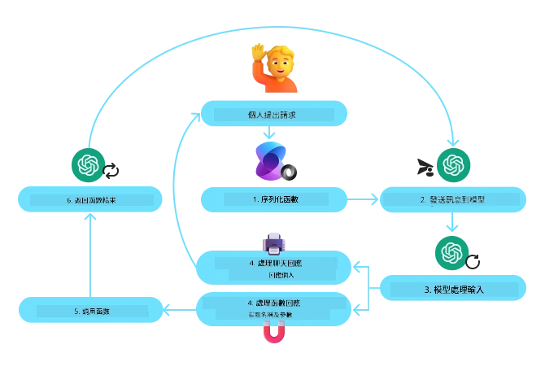
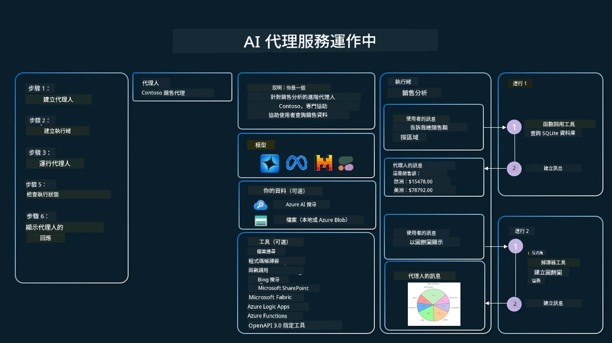

[](https://youtu.be/vieRiPRx-gI?si=cEZ8ApnT6Sus9rhn)

> _(點擊上方圖片以觀看本課影片)_

# 工具使用設計模式

工具很有趣，因為它們讓 AI 代理擁有更廣泛的能力。代理不再只有有限的一組可以執行的動作，透過加入工具，代理現在可以執行各種動作。在本章中，我們將探討工具使用設計模式，說明 AI 代理如何使用特定工具來達成其目標。

## 介紹

在本課中，我們希望回答以下問題：

- 什麼是工具使用設計模式？
- 可將其應用於哪些使用案例？
- 實作此設計模式需要哪些元素/建構區塊？
- 使用工具使用設計模式來構建值得信賴的 AI 代理時，有哪些特別考量？

## 學習目標

完成本課後，您將能夠：

- 定義工具使用設計模式及其目的。
- 辨識適用於工具使用設計模式的使用案例。
- 了解實作此設計模式所需的關鍵元素。
- 了解在使用此設計模式的 AI 代理中確保可信度的考量。

## 什麼是工具使用設計模式？

**工具使用設計模式** 著重於賦予大型語言模型 (LLMs) 與外部工具互動以達成特定目標的能力。工具是代理可執行的程式碼以執行動作。工具可以是簡單的函數，例如計算機，或是第三方服務的 API 呼叫，例如查詢股票價格或天氣預報。在 AI 代理的情境中，工具被設計為由代理根據 **模型產生的函數呼叫** 來執行。

## 可應用於哪些使用案例？

AI 代理可以利用工具來完成複雜任務、取得資訊或做出決策。工具使用設計模式常用於需要與外部系統動態互動的場景，例如資料庫、網路服務或程式碼直譯器。這項能力對下列不同使用案例非常有用，包括：

- **動態資訊擷取：** 代理可以查詢外部 API 或資料庫以獲取最新資料（例如：查詢 SQLite 資料庫進行資料分析、取得股票價格或天氣資訊）。
- **程式碼執行與解釋：** 代理可以執行程式碼或腳本來解決數學問題、產生報告或進行模擬。
- **工作流程自動化：** 透過整合像任務排程、電子郵件服務或資料管線等工具，自動化重複或多步驟的工作流程。
- **客戶支援：** 代理可以與 CRM 系統、工單平台或知識庫互動以解決使用者查詢。
- **內容生成與編輯：** 代理可以利用文法檢查、文字摘要或內容安全評估等工具來協助內容創作工作。

## 實作工具使用設計模式需要哪些元素/建構區塊？

這些建構區塊讓 AI 代理能執行各種任務。以下是實作工具使用設計模式所需的關鍵元素：

- **函數/工具結構（Function/Tool Schemas）：** 可用工具的詳細定義，包括函數名稱、用途、必要參數與預期輸出。這些結構讓 LLM 了解可用工具以及如何構造有效的請求。

- **函數執行邏輯：** 管理根據使用者意圖與對話上下文何時以及如何呼叫工具。這可能包含規劃模組、路由機制或決定工具使用的條件流程。

- **訊息處理系統：** 管理使用者輸入、LLM 回應、工具呼叫與工具輸出之間對話流程的元件。

- **工具整合框架：** 將代理連接到各種工具的基礎建設，無論它們是簡單函數或複雜的外部服務。

- **錯誤處理與驗證：** 處理工具執行失敗、驗證參數及管理非預期回應的機制。

- **狀態管理：** 追蹤對話上下文、先前的工具互動以及持久化資料，以確保多回合互動的一致性。

接下來，我們將更詳細地檢視函數/工具呼叫（Function/Tool Calling）。
 
### 函數/工具呼叫

函數呼叫是讓大型語言模型 (LLMs) 與工具互動的主要方式。您會常看到「Function」與「Tool」交替使用，因為「函數」（可重複使用的程式碼區塊）就是代理用來執行任務的「工具」。為了能夠調用函數的程式碼，LLM 必須將使用者的請求與函數的描述進行比對。為此，我們會將包含所有可用函數描述的結構（schema）傳送給 LLM。LLM 隨後選擇最適合該任務的函數並回傳其名稱與參數。被選擇的函數會被呼叫，其回應會回傳給 LLM，LLM 再使用這些資訊來回應使用者的請求。

開發者若要為代理實作函數呼叫，您需要：

1. 支援函數呼叫的 LLM 模型
2. 包含函數描述的結構（schema）
3. 每個描述中函數的程式碼

讓我們以取得某個城市目前時間的範例來說明：

1. **初始化一個支援函數呼叫的 LLM：**

    並非所有模型都支援函數呼叫，因此確認您使用的 LLM 是否支援非常重要。    <a href="https://learn.microsoft.com/azure/ai-services/openai/how-to/function-calling" target="_blank">Azure OpenAI</a> 支援函數呼叫。我們可以先啟動 Azure OpenAI 用戶端。

    ```python
    # 初始化 Azure OpenAI 用戶端
    client = AzureOpenAI(
        azure_endpoint = os.getenv("AZURE_AI_PROJECT_ENDPOINT"), 
        api_key=os.getenv("AZURE_OPENAI_API_KEY"),  
        api_version="2024-05-01-preview"
    )
    ```

1. **建立函數結構（Function Schema）：**

    接著我們將定義一個 JSON 結構，其中包含函數名稱、函數功能說明，以及函數參數的名稱與描述。
    然後我們會將此結構連同使用者要求（欲查詢 San Francisco 的時間）一併傳給先前建立的用戶端。重要的是要注意，回傳的是 **工具呼叫**，而非問題的最終答案。如前所述，LLM 會回傳它為任務選擇的函數名稱，以及將傳入的參數。

    ```python
    # 供模型閱讀的功能說明
    tools = [
        {
            "type": "function",
            "function": {
                "name": "get_current_time",
                "description": "Get the current time in a given location",
                "parameters": {
                    "type": "object",
                    "properties": {
                        "location": {
                            "type": "string",
                            "description": "The city name, e.g. San Francisco",
                        },
                    },
                    "required": ["location"],
                },
            }
        }
    ]
    ```
   
    ```python
  
    # 初始用戶訊息
    messages = [{"role": "user", "content": "What's the current time in San Francisco"}] 
  
    # 第一次 API 呼叫: 要求模型使用該函數
      response = client.chat.completions.create(
          model=deployment_name,
          messages=messages,
          tools=tools,
          tool_choice="auto",
      )
  
      # 處理模型的回應
      response_message = response.choices[0].message
      messages.append(response_message)
  
      print("Model's response:")  

      print(response_message)
  
    ```

    ```bash
    Model's response:
    ChatCompletionMessage(content=None, role='assistant', function_call=None, tool_calls=[ChatCompletionMessageToolCall(id='call_pOsKdUlqvdyttYB67MOj434b', function=Function(arguments='{"location":"San Francisco"}', name='get_current_time'), type='function')])
    ```
  
1. **執行該任務所需的函數程式碼：**

    現在 LLM 已選擇需要執行的函數，必須實作並執行執行該任務的程式碼。
    我們可以用 Python 實作取得當前時間的程式碼。也需要撰寫程式碼以從 response_message 中擷取名稱與參數以取得最終結果。

    ```python
      def get_current_time(location):
        """Get the current time for a given location"""
        print(f"get_current_time called with location: {location}")  
        location_lower = location.lower()
        
        for key, timezone in TIMEZONE_DATA.items():
            if key in location_lower:
                print(f"Timezone found for {key}")  
                current_time = datetime.now(ZoneInfo(timezone)).strftime("%I:%M %p")
                return json.dumps({
                    "location": location,
                    "current_time": current_time
                })
      
        print(f"No timezone data found for {location_lower}")  
        return json.dumps({"location": location, "current_time": "unknown"})
    ```

     ```python
     # 處理函數呼叫
      if response_message.tool_calls:
          for tool_call in response_message.tool_calls:
              if tool_call.function.name == "get_current_time":
     
                  function_args = json.loads(tool_call.function.arguments)
     
                  time_response = get_current_time(
                      location=function_args.get("location")
                  )
     
                  messages.append({
                      "tool_call_id": tool_call.id,
                      "role": "tool",
                      "name": "get_current_time",
                      "content": time_response,
                  })
      else:
          print("No tool calls were made by the model.")  
  
      # 第二次 API 呼叫：從模型取得最終回應
      final_response = client.chat.completions.create(
          model=deployment_name,
          messages=messages,
      )
  
      return final_response.choices[0].message.content
     ```

     ```bash
      get_current_time called with location: San Francisco
      Timezone found for san francisco
      The current time in San Francisco is 09:24 AM.
     ```

函數呼叫是大多數（如果不是全部）代理工具使用設計的核心，但從頭實作有時會具挑戰性。
如我們在[第 2 課](../../../02-explore-agentic-frameworks)中所學，代理框架為我們提供了預建的建構區塊來實作工具使用。
 
## 使用代理框架的工具使用範例

以下是使用不同代理框架實作工具使用設計模式的一些範例：

### Microsoft Agent Framework

<a href="https://learn.microsoft.com/azure/ai-services/agents/overview" target="_blank">Microsoft Agent Framework</a> 是一個用於構建 AI 代理的開源 AI 框架。它簡化了函數呼叫的使用流程，允許您使用 `@tool` 裝飾器將工具定義為 Python 函數。該框架會處理模型與您的程式碼之間的來回通訊。它還透過 `AzureAIProjectAgentProvider` 提供檔案搜尋與程式碼直譯器等預建工具的存取。

下圖說明了使用 Microsoft Agent Framework 進行函數呼叫的流程：



在 Microsoft Agent Framework 中，工具被定義為帶有裝飾器的函數。我們可以使用 `@tool` 裝飾器將先前看到的 `get_current_time` 函數轉換為一個工具。該框架會自動序列化該函數及其參數，建立要傳送給 LLM 的結構。

```python
from agent_framework import tool
from agent_framework.azure import AzureAIProjectAgentProvider
from azure.identity import AzureCliCredential

@tool
def get_current_time(location: str) -> str:
    """Get the current time for a given location"""
    ...

# 建立客戶端
provider = AzureAIProjectAgentProvider(credential=AzureCliCredential())

# 建立一個代理並使用該工具執行
agent = await provider.create_agent(name="TimeAgent", instructions="Use available tools to answer questions.", tools=get_current_time)
response = await agent.run("What time is it?")
```
  
### Azure AI Agent Service

<a href="https://learn.microsoft.com/azure/ai-services/agents/overview" target="_blank">Azure AI Agent Service</a> 是一個較新的代理框架，旨在讓開發者能夠安全地構建、部署及擴展高品質且可擴充的 AI 代理，而無需管理底層的運算和儲存資源。它對企業應用特別有用，因為它是一項具企業等級安全性的完全託管服務。

與直接使用 LLM API 開發相比，Azure AI Agent Service 提供一些優勢，包括：

- 自動工具呼叫 — 不需要解析工具呼叫、呼叫工具並處理回應；這些都在伺服器端完成
- 安全管理的資料 — 不必自行管理對話狀態，您可以依賴 threads 來儲存所有需要的資訊
- 開箱即用的工具 — 可用於與資料來源互動的工具，例如 Bing、Azure AI Search 與 Azure Functions

Azure AI Agent Service 中可用的工具可分為兩類：

1. 知識型工具：
    - <a href="https://learn.microsoft.com/azure/ai-services/agents/how-to/tools/bing-grounding?tabs=python&pivots=overview" target="_blank">以 Bing 搜尋 作為依據</a>
    - <a href="https://learn.microsoft.com/azure/ai-services/agents/how-to/tools/file-search?tabs=python&pivots=overview" target="_blank">檔案搜尋</a>
    - <a href="https://learn.microsoft.com/azure/ai-services/agents/how-to/tools/azure-ai-search?tabs=azurecli%2Cpython&pivots=overview-azure-ai-search" target="_blank">Azure AI 搜尋</a>

2. 動作型工具：
    - <a href="https://learn.microsoft.com/azure/ai-services/agents/how-to/tools/function-calling?tabs=python&pivots=overview" target="_blank">函數呼叫</a>
    - <a href="https://learn.microsoft.com/azure/ai-services/agents/how-to/tools/code-interpreter?tabs=python&pivots=overview" target="_blank">程式碼直譯器</a>
    - <a href="https://learn.microsoft.com/azure/ai-services/agents/how-to/tools/openapi-spec?tabs=python&pivots=overview" target="_blank">以 OpenAPI 定義的工具</a>
    - <a href="https://learn.microsoft.com/azure/ai-services/agents/how-to/tools/azure-functions?pivots=overview" target="_blank">Azure Functions</a>

Agent Service 允許我們將這些工具作為一個 `toolset` 一起使用。它也利用 `threads` 來追蹤特定對話的訊息歷史。

假設您是名為 Contoso 公司的銷售人員。您想開發一個能回答有關銷售資料問題的對話代理。

下圖說明了如何使用 Azure AI Agent Service 分析您的銷售資料：



要在服務中使用任何這些工具，我們可以建立一個用戶端並定義工具或工具集。實作上，我們可以使用下列 Python 程式碼。LLM 將能檢視該工具集並決定是否使用使用者自訂函數 `fetch_sales_data_using_sqlite_query`，或根據使用者請求使用預建的 Code Interpreter。

```python 
import os
from azure.ai.projects import AIProjectClient
from azure.identity import DefaultAzureCredential
from fetch_sales_data_functions import fetch_sales_data_using_sqlite_query # fetch_sales_data_using_sqlite_query 函數，可在 fetch_sales_data_functions.py 檔案中找到。
from azure.ai.projects.models import ToolSet, FunctionTool, CodeInterpreterTool

project_client = AIProjectClient.from_connection_string(
    credential=DefaultAzureCredential(),
    conn_str=os.environ["PROJECT_CONNECTION_STRING"],
)

# 初始化工具集
toolset = ToolSet()

# 初始化一個函數呼叫代理，使用 fetch_sales_data_using_sqlite_query 函數，並將其加入工具集
fetch_data_function = FunctionTool(fetch_sales_data_using_sqlite_query)
toolset.add(fetch_data_function)

# 初始化 Code Interpreter 工具，並將其加入工具集。
code_interpreter = code_interpreter = CodeInterpreterTool()
toolset.add(code_interpreter)

agent = project_client.agents.create_agent(
    model="gpt-4o-mini", name="my-agent", instructions="You are helpful agent", 
    toolset=toolset
)
```

## 使用工具使用設計模式來構建值得信賴的 AI 代理時，有哪些特別考量？

LLM 動態產生的 SQL 常見的一個關切是安全性，特別是 SQL 注入或惡意行為的風險，例如刪除或竄改資料庫。雖然這些擔憂是合理的，但可透過適當設定資料庫存取權限有效緩解。對於大多數資料庫，這涉及將資料庫設定為唯讀。對於像 PostgreSQL 或 Azure SQL 之類的資料庫服務，應為應用指派唯讀（SELECT）角色。

在安全環境中執行應用程式能進一步提升保護。在企業情境中，資料通常會從作業系統擷取並轉換到具有使用者友善結構的唯讀資料庫或資料倉儲。這種做法確保資料安全、在效能與可存取性上最佳化，且應用程式具有受限的唯讀存取權。

## 範例程式碼

- Python: [Agent Framework](./code_samples/04-python-agent-framework.ipynb)
- .NET: [Agent Framework](./code_samples/04-dotnet-agent-framework.md)

## 想了解更多關於工具使用設計模式的問題嗎？

加入 [Microsoft Foundry Discord](https://aka.ms/ai-agents/discord) 與其他學習者交流、參加辦公時間並取得 AI Agents 的問題解答。

## 其他資源

- <a href="https://microsoft.github.io/build-your-first-agent-with-azure-ai-agent-service-workshop/" target="_blank">Azure AI Agents Service 工作坊</a>
- <a href="https://github.com/Azure-Samples/contoso-creative-writer/tree/main/docs/workshop" target="_blank">Contoso 創意寫作 多代理工作坊</a>
- <a href="https://learn.microsoft.com/azure/ai-services/agents/overview" target="_blank">Microsoft Agent Framework 概覽</a>

## 前一課

[了解 Agentic 設計模式](../03-agentic-design-patterns/README.md)

## 下一課
[能動型 RAG](../05-agentic-rag/README.md)

---

<!-- CO-OP TRANSLATOR DISCLAIMER START -->
免責聲明：
本文件已透過 AI 翻譯服務 [Co-op Translator](https://github.com/Azure/co-op-translator) 進行翻譯。雖然我們已盡力確保準確性，但自動翻譯可能仍含錯誤或不準確之處。原始語言版本應被視為具權威性的來源。對於重要資訊，建議採用專業人工翻譯。我們不會就因使用本翻譯而導致的任何誤解或誤譯承擔責任。
<!-- CO-OP TRANSLATOR DISCLAIMER END -->